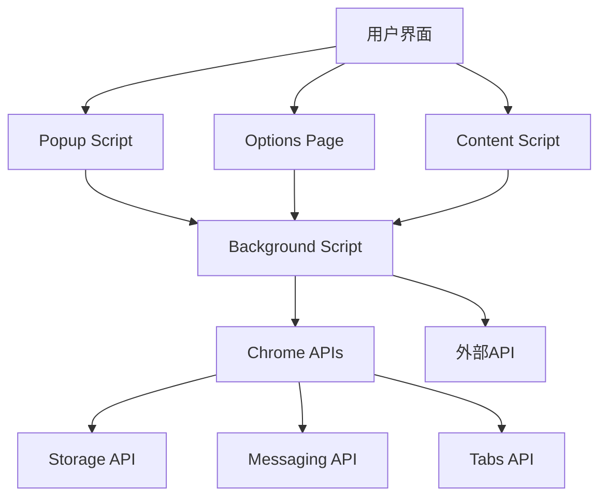

# Bilibili 收藏夹管理助手 — Agent 开发规范

**Version 1.0.0**  
Bilibili Favorites Extension  
June 2026

> **Note:**  
> This document is mainly for agents and LLMs to follow when maintaining,  
> generating, or refactoring the Bilibili Favorites Chrome extension.  
> Humans may also find it useful, but guidance here is optimized for automation  
> and consistency by AI-assisted workflows.

---

## Abstract

Comprehensive development guide for the Bilibili Favorites Chrome extension, designed for AI agents and LLMs. Covers project standards, API integration (Bilibili & OpenAI), Chrome Extension Manifest V3 patterns, React component conventions, and data analysis features with ECharts. Each section includes detailed explanations, code examples, and specific patterns to guide automated development.

---

## Table of Contents

1. [项目规范](#1-project-standards) — **CRITICAL**
2. [API 集成](#2-api-integration) — **HIGH**
3. [Chrome 扩展开发](#3-chrome-extension-development) — **HIGH**
4. [组件开发](#4-component-development) — **MEDIUM**
5. [数据分析功能](#5-data-analysis-features) — **MEDIUM**

---

## 1. 项目规范 {#1-project-standards}

**Impact: CRITICAL**

## 技术栈规范

### 核心技术
- **React 19**: 使用最新的React版本，充分利用其新特性
- **TypeScript**: 严格类型检查，确保代码质量
- **Vite**: 构建工具，支持快速开发和热重载
- **Tailwind CSS**: 样式框架，遵循原子化CSS设计理念
- **Chrome Extension Manifest V3**: 扩展开发规范

### 状态管理
- **Zustand**: 轻量级状态管理，配合Chrome存储中间件使用
- **Chrome Storage API**: 持久化存储用户数据和配置

### UI组件
- **Radix UI**: 无样式组件库，提供可访问性良好的基础组件
- **Lucide React**: 图标库，保持界面风格统一
- **ECharts**: 数据可视化图表库，用于收藏夹数据分析

## 项目结构规范

```
src/
├── background/         # 后台脚本
├── contentScript/      # 内容脚本
├── popup/             # 弹出窗口组件
├── options/           # 选项页面
├── components/        # 共享组件
│   ├── ui/           # 基础UI组件
│   ├── favorite-tag/ # 收藏夹标签组件
│   └── ...           # 其他业务组件
├── hooks/            # 自定义Hooks
├── store/            # 状态管理
├── utils/            # 工具函数
└── assets/           # 静态资源
```

## 代码规范

### TypeScript规范
- 使用严格模式：`"strict": true`
- 接口命名使用PascalCase，类型别名使用PascalCase
- 避免使用`any`类型，优先使用具体类型或`unknown`
- 使用类型断言时要谨慎，优先使用类型守卫

### React组件规范
- 使用函数式组件和Hooks
- 组件文件使用PascalCase命名
- Props接口定义以`Props`结尾
- 使用React.memo优化性能，避免不必要的重渲染

### 样式规范
- 优先使用Tailwind CSS类名
- 自定义样式使用CSS Modules或styled-components
- 保持响应式设计，适配不同屏幕尺寸
- 遵循设计系统，保持视觉一致性

## Chrome扩展开发规范

### 权限管理
- 最小权限原则：只申请必要的权限
- 在[manifest.ts](src/manifest.ts)中明确声明所需权限
- 用户隐私保护：不收集不必要的用户数据

### 消息通信
- Background Script和Content Script间使用Chrome消息API通信
- 消息类型使用枚举或常量定义，避免硬编码
- 错误处理和超时机制要完善

### 存储规范
- 使用Chrome Storage API而非localStorage
- 敏感数据加密存储
- 定期清理过期数据

## API集成规范

### Bilibili API
- 遵循B站API调用频率限制
- 错误处理和重试机制
- Cookie管理使用[utils/cookie.ts](utils/cookie.ts)

### OpenAI API
- API密钥安全存储，不暴露在客户端代码
- 请求参数验证和错误处理
- 响应数据缓存策略

## 测试规范

### 单元测试
- 使用Vitest进行单元测试
- 组件测试使用@testing-library/react
- 工具函数测试覆盖率要求80%以上

### 集成测试
- Chrome扩展功能测试
- API集成测试
- 用户交互流程测试

## 构建和部署规范

### 开发环境
```bash
pnpm install    # 安装依赖
pnpm dev       # 开发模式
pnpm build     # 生产构建
```

### 代码质量
- 使用Prettier进行代码格式化
- ESLint检查代码规范
- TypeScript严格模式编译

### 打包发布
```bash
pnpm zip       # 打包扩展
```
- 构建产物进行代码压缩和优化
- 版本号管理遵循语义化版本规范
- 更新日志维护[CHANGELOG.md](CHANGELOG.md)

## 性能优化规范

### 代码分割
- 使用动态导入减少初始包大小
- 路由级别的代码分割
- 第三方库按需引入

### 内存管理
- 及时清理事件监听器
- 避免内存泄漏
- 合理使用React.useMemo和React.useCallback

### 网络优化
- API请求合并和缓存
- 图片资源优化
- 使用CDN加速静态资源

## 安全规范

### 数据安全
- 用户数据本地加密存储
- API密钥安全管理
- XSS和CSRF防护

### 扩展安全
- Content Security Policy配置
- 防止恶意网站注入
- 安全的跨域通信

## 维护规范

### 版本控制
- Git提交信息规范
- 分支管理策略
- 代码审查流程

### 文档维护
- README文档及时更新
- API文档保持同步
- 组件使用文档完善

---

## 2. API 集成 {#2-api-integration}

**Impact: HIGH**

## API架构概述

### API类型
- **Bilibili API**: 获取收藏夹数据、视频信息等
- **OpenAI API**: 智能分析、关键词提取等AI功能
- **Chrome Storage API**: 本地数据持久化

### API工具文件结构
```
utils/
├── api.ts              # API客户端配置和通用方法
├── cookie.ts           # Cookie管理
├── gpt.ts              # OpenAI API集成
├── message.ts          # 消息通信
└── promise.ts          # Promise工具函数
```

## Bilibili API规范

### API客户端配置
```typescript
// utils/api.ts
export const API_BASE_URL = 'https://api.bilibili.com'

export const apiClient = {
  get: async <T>(url: string, params?: Record<string, any>): Promise<T> => {
    const queryString = params ? new URLSearchParams(params).toString() : ''
    const fullUrl = `${API_BASE_URL}${url}${queryString ? `?${queryString}` : ''}`
    
    const response = await fetch(fullUrl, {
      headers: {
        'Cookie': getBilibiliCookie(),
        'User-Agent': navigator.userAgent,
        'Referer': 'https://www.bilibili.com/'
      }
    })
    
    if (!response.ok) {
      throw new APIError(response.status, response.statusText)
    }
    
    return response.json()
  }
}
```

### API端点定义
```typescript
// API端点常量
export const API_ENDPOINTS = {
  // 收藏夹相关
  FAVORITE_LIST: '/x/v3/fav/folder/list',
  FAVORITE_RESOURCE: '/x/v3/fav/resource/list',
  
  // 视频信息
  VIDEO_INFO: '/x/web-interface/view',
  
  // 用户信息
  USER_INFO: '/x/space/acc/info'
} as const

// API参数类型定义
export interface FavoriteListParams {
  vmid: string
  ps?: number
  pn?: number
}

export interface FavoriteResourceParams {
  media_id: string
  ps?: number
  pn?: number
  keyword?: string
}
```

### API调用示例
```typescript
// 获取收藏夹列表
export const getFavoriteList = async (vmid: string): Promise<FavoriteListResponse> => {
  try {
    const response = await apiClient.get<FavoriteListResponse>(
      API_ENDPOINTS.FAVORITE_LIST,
      { vmid }
    )
    
    if (response.code !== 0) {
      throw new APIError(response.code, response.message || '获取收藏夹列表失败')
    }
    
    return response
  } catch (error) {
    console.error('获取收藏夹列表失败:', error)
    throw error
  }
}

// 获取收藏夹资源
export const getFavoriteResources = async (
  mediaId: string,
  page = 1,
  pageSize = 20
): Promise<FavoriteResourceResponse> => {
  try {
    const response = await apiClient.get<FavoriteResourceResponse>(
      API_ENDPOINTS.FAVORITE_RESOURCE,
      {
        media_id: mediaId,
        pn: page,
        ps: pageSize
      }
    )
    
    if (response.code !== 0) {
      throw new APIError(response.code, response.message || '获取收藏夹资源失败')
    }
    
    return response
  } catch (error) {
    console.error('获取收藏夹资源失败:', error)
    throw error
  }
}
```

## OpenAI API规范

### API配置
```typescript
// utils/gpt.ts
import OpenAI from 'openai'

const openai = new OpenAI({
  apiKey: process.env.OPENAI_API_KEY,
  dangerouslyAllowBrowser: false // 生产环境不允许浏览器端调用
})

// 服务器端调用（通过Background Script）
export const callOpenAI = async (prompt: string): Promise<string> => {
  try {
    const response = await openai.chat.completions.create({
      model: 'gpt-3.5-turbo',
      messages: [
        {
          role: 'system',
          content: '你是一个专业的B站内容分析助手，请根据用户需求提供准确的分析结果。'
        },
        {
          role: 'user',
          content: prompt
        }
      ],
      max_tokens: 1000,
      temperature: 0.7
    })
    
    return response.choices[0]?.message?.content || '分析失败'
  } catch (error) {
    console.error('OpenAI API调用失败:', error)
    throw new Error('AI分析服务暂时不可用')
  }
}
```

### 消息通信规范
```typescript
// utils/message.ts
export enum MessageType {
  GET_FAVORITE_LIST = 'GET_FAVORITE_LIST',
  GET_FAVORITE_RESOURCES = 'GET_FAVORITE_RESOURCES',
  CALL_OPENAI = 'CALL_OPENAI',
  API_RESPONSE = 'API_RESPONSE',
  API_ERROR = 'API_ERROR'
}

export interface Message<T = any> {
  type: MessageType
  payload?: T
  requestId?: string
}

// 发送消息到Background Script
export const sendMessageToBackground = <T>(message: Message<T>): Promise<any> => {
  return new Promise((resolve, reject) => {
    const requestId = generateRequestId()
    
    chrome.runtime.sendMessage({
      ...message,
      requestId
    }, (response) => {
      if (chrome.runtime.lastError) {
        reject(new Error(chrome.runtime.lastError.message))
      } else if (response?.error) {
        reject(new Error(response.error))
      } else {
        resolve(response?.data)
      }
    })
  })
}

// Background Script消息处理
export const setupMessageListener = () => {
  chrome.runtime.onMessage.addListener((message, sender, sendResponse) => {
    const { type, payload, requestId } = message
    
    switch (type) {
      case MessageType.GET_FAVORITE_LIST:
        handleGetFavoriteList(payload)
          .then(data => sendResponse({ data, requestId }))
          .catch(error => sendResponse({ error: error.message, requestId }))
        return true // 保持消息通道开放
        
      case MessageType.CALL_OPENAI:
        handleOpenAICall(payload)
          .then(data => sendResponse({ data, requestId }))
          .catch(error => sendResponse({ error: error.message, requestId }))
        return true
        
      default:
        sendResponse({ error: 'Unknown message type', requestId })
    }
  })
}
```

## 错误处理规范

### 自定义错误类
```typescript
export class APIError extends Error {
  constructor(
    public code: number | string,
    message: string,
    public details?: any
  ) {
    super(message)
    this.name = 'APIError'
  }
}

export class NetworkError extends APIError {
  constructor(message: string = '网络连接失败') {
    super('NETWORK_ERROR', message)
  }
}

export class AuthenticationError extends APIError {
  constructor(message: string = '身份验证失败') {
    super('AUTH_ERROR', message)
  }
}
```

### 错误处理中间件
```typescript
export const withErrorHandling = async <T>(
  apiCall: () => Promise<T>,
  fallback?: T
): Promise<T> => {
  try {
    return await apiCall()
  } catch (error) {
    console.error('API调用失败:', error)
    
    if (error instanceof APIError) {
      // 根据错误类型进行不同处理
      switch (error.code) {
        case 'NETWORK_ERROR':
          showToast('网络连接失败，请检查网络设置')
          break
        case 'AUTH_ERROR':
          showToast('登录已过期，请重新登录')
          break
        default:
          showToast(error.message || '操作失败')
      }
    }
    
    if (fallback !== undefined) {
      return fallback
    }
    
    throw error
  }
}
```

## 数据缓存规范

### 缓存策略
```typescript
interface CacheItem<T> {
  data: T
  timestamp: number
  ttl: number // 生存时间（毫秒）
}

class APICache {
  private cache = new Map<string, CacheItem<any>>()
  
  set<T>(key: string, data: T, ttl: number = 5 * 60 * 1000): void {
    this.cache.set(key, {
      data,
      timestamp: Date.now(),
      ttl
    })
  }
  
  get<T>(key: string): T | null {
    const item = this.cache.get(key)
    if (!item) return null
    
    if (Date.now() - item.timestamp > item.ttl) {
      this.cache.delete(key)
      return null
    }
    
    return item.data
  }
  
  clear(): void {
    this.cache.clear()
  }
}

export const apiCache = new APICache()
```

### 缓存装饰器
```typescript
export const withCache = <T>(
  key: string,
  ttl: number = 5 * 60 * 1000
) => {
  return (target: any, propertyName: string, descriptor: PropertyDescriptor) => {
    const method = descriptor.value
    
    descriptor.value = async function (...args: any[]) {
      const cacheKey = `${key}:${JSON.stringify(args)}`
      
      // 尝试从缓存获取
      const cached = apiCache.get<T>(cacheKey)
      if (cached) {
        return cached
      }
      
      // 调用原方法
      const result = await method.apply(this, args)
      
      // 存入缓存
      apiCache.set(cacheKey, result, ttl)
      
      return result
    }
  }
}

// 使用示例
export class FavoriteService {
  @withCache('favorite-list', 10 * 60 * 1000) // 10分钟缓存
  async getFavoriteList(vmid: string): Promise<FavoriteListResponse> {
    return getFavoriteList(vmid)
  }
}
```

## 请求限制和重试

### 请求限制
```typescript
class RateLimiter {
  private requests: number[] = []
  private readonly maxRequests: number
  private readonly windowMs: number
  
  constructor(maxRequests: number = 30, windowMs: number = 60000) {
    this.maxRequests = maxRequests
    this.windowMs = windowMs
  }
  
  async waitForSlot(): Promise<void> {
    const now = Date.now()
    this.requests = this.requests.filter(time => now - time < this.windowMs)
    
    if (this.requests.length >= this.maxRequests) {
      const oldestRequest = this.requests[0]
      const waitTime = this.windowMs - (now - oldestRequest)
      await new Promise(resolve => setTimeout(resolve, waitTime))
    }
    
    this.requests.push(now)
  }
}

export const rateLimiter = new RateLimiter()
```

### 重试机制
```typescript
export const withRetry = async <T>(
  apiCall: () => Promise<T>,
  maxRetries: number = 3,
  delay: number = 1000
): Promise<T> => {
  let lastError: Error
  
  for (let i = 0; i <= maxRetries; i++) {
    try {
      return await apiCall()
    } catch (error) {
      lastError = error as Error
      
      if (i === maxRetries) {
        break
      }
      
      // 指数退避
      const waitTime = delay * Math.pow(2, i)
      await new Promise(resolve => setTimeout(resolve, waitTime))
    }
  }
  
  throw lastError!
}
```

## 类型定义规范

### API响应类型
```typescript
// 通用响应结构
export interface APIResponse<T = any> {
  code: number
  message: string
  data: T
}

// 收藏夹相关类型
export interface FavoriteFolder {
  id: number
  fid: number
  mid: number
  attr: number
  name: string
  cover: string
  description: string
  media_count: number
  ctime: number
  fav_state: number
  like_state: number
}

export interface FavoriteResource {
  id: number
  bvid: string
  title: string
  cover: string
  intro: string
  duration: number
  owner: {
    mid: number
    name: string
    face: string
  }
  ctime: number
  pubdate: number
}

// OpenAI响应类型
export interface OpenAIResponse {
  id: string
  object: string
  created: number
  model: string
  choices: Array<{
    index: number
    message: {
      role: string
      content: string
    }
    finish_reason: string
  }>
}
```

## 测试规范

### API Mock
```typescript
// __tests__/mocks/api.ts
export const mockFavoriteList: FavoriteListResponse = {
  code: 0,
  message: 'success',
  data: {
    list: [
      {
        id: 1,
        fid: 123456,
        name: '默认收藏夹',
        media_count: 50,
        // ...其他属性
      }
    ]
  }
}

// 测试中使用
import { mockFavoriteList } from '../mocks/api'

describe('FavoriteService', () => {
  beforeEach(() => {
    jest.spyOn(apiClient, 'get').mockResolvedValue(mockFavoriteList)
  })
  
  afterEach(() => {
    jest.restoreAllMocks()
  })
})
```

---

## 3. Chrome 扩展开发 {#3-chrome-extension-development}

**Impact: HIGH**

## Manifest V3配置

### 基础配置
```typescript
// src/manifest.ts
import { defineManifest } from '@crxjs/vite-plugin'
import packageData from '../package.json'

const isDev = process.env.NODE_ENV === 'development'

export default defineManifest({
  name: `${packageData.displayName || packageData.name}${isDev ? ' ➡️ Dev' : ''}`,
  description: packageData.description,
  version: packageData.version,
  manifest_version: 3,
  
  // 图标配置
  icons: {
    16: 'img/logo-16.png',
    32: 'img/logo-34.png',
    48: 'img/logo-48.png',
    128: 'img/logo-128.png',
  },
  
  // 扩展操作
  action: {
    default_popup: 'popup.html',
    default_icon: 'img/logo-48.png',
  },
  
  // 后台脚本
  background: {
    service_worker: 'src/background/index.ts',
    type: 'module',
  },
  
  // 内容脚本
  content_scripts: [
    {
      matches: ['*://*.bilibili.com/*'],
      js: ['src/contentScript/index.ts'],
      run_at: 'document_end'
    }
  ],
  
  // Web可访问资源
  web_accessible_resources: [
    {
      resources: ['img/*.png'],
      matches: ['*://*.bilibili.com/*']
    }
  ],
  
  // 权限配置
  permissions: [
    'storage',
    'activeTab'
  ],
  
  // 可选权限
  optional_permissions: [
    'background',
    'scripting'
  ],
  
  // 选项页面
  options_ui: {
    page: 'options.html',
    open_in_tab: true,
  },
  
  // 内容安全策略
  content_security_policy: {
    extension_pages: "script-src 'self'; object-src 'self'"
  }
})
```

### 权限管理原则
- **最小权限原则**: 只申请必要的权限
- **可选权限**: 非核心功能使用可选权限
- **用户透明**: 向用户清楚说明每个权限的用途
- **渐进式权限**: 根据功能需要动态申请权限

## 架构设计

### 扩展架构图


### 目录结构
```
src/
├── background/              # 后台脚本
│   ├── index.ts            # 主入口
│   ├── handlers/           # 消息处理器
│   └── schedulers/         # 定时任务
├── contentScript/          # 内容脚本
│   ├── index.ts           # 主入口
│   ├── injectors/         # 页面注入
│   └── observers/         # DOM监听
├── popup/                 # 弹出窗口
│   ├── index.tsx          # 入口组件
│   ├── Popup.tsx          # 主组件
│   └── components/        # 弹窗专用组件
├── options/               # 选项页面
│   ├── index.tsx          # 入口组件
│   ├── Options.tsx        # 主组件
│   └── components/        # 选项页专用组件
├── shared/                # 共享代码
│   ├── types/            # 类型定义
│   ├── utils/            # 工具函数
│   └── constants/        # 常量定义
└── assets/               # 静态资源
    ├── img/              # 图片资源
    └── css/              # 样式文件
```

## 消息通信规范

### 消息类型定义
```typescript
// src/shared/types/messages.ts
export enum MessageType {
  // 收藏夹相关
  GET_FAVORITE_LIST = 'GET_FAVORITE_LIST',
  GET_FAVORITE_RESOURCES = 'GET_FAVORITE_RESOURCES',
  UPDATE_FAVORITE = 'UPDATE_FAVORITE',
  
  // AI分析相关
  ANALYZE_CONTENT = 'ANALYZE_CONTENT',
  EXTRACT_KEYWORDS = 'EXTRACT_KEYWORDS',
  
  // 存储相关
  SAVE_SETTINGS = 'SAVE_SETTINGS',
  LOAD_SETTINGS = 'LOAD_SETTINGS',
  
  // 页面交互
  PAGE_READY = 'PAGE_READY',
  INJECT_SCRIPT = 'INJECT_SCRIPT'
}

export interface BaseMessage {
  type: MessageType
  id: string
  timestamp: number
}

export interface RequestMessage<T = any> extends BaseMessage {
  payload: T
}

export interface ResponseMessage<T = any> extends BaseMessage {
  success: boolean
  data?: T
  error?: string
}
```

### 消息发送器
```typescript
// src/shared/utils/messaging.ts
export class MessageSender {
  private static generateId(): string {
    return `${Date.now()}-${Math.random().toString(36).substr(2, 9)}`
  }
  
  // 发送消息到Background Script
  static async sendToBackground<T = any, R = any>(
    type: MessageType,
    payload?: T
  ): Promise<R> {
    return new Promise((resolve, reject) => {
      const message: RequestMessage<T> = {
        type,
        payload: payload as T,
        id: MessageSender.generateId(),
        timestamp: Date.now()
      }
      
      chrome.runtime.sendMessage(message, (response: ResponseMessage<R>) => {
        if (chrome.runtime.lastError) {
          reject(new Error(chrome.runtime.lastError.message))
        } else if (!response.success) {
          reject(new Error(response.error || 'Unknown error'))
        } else {
          resolve(response.data!)
        }
      })
    })
  }
  
  // 发送消息到Content Script
  static async sendToContentScript<T = any, R = any>(
    tabId: number,
    type: MessageType,
    payload?: T
  ): Promise<R> {
    return new Promise((resolve, reject) => {
      const message: RequestMessage<T> = {
        type,
        payload: payload as T,
        id: MessageSender.generateId(),
        timestamp: Date.now()
      }
      
      chrome.tabs.sendMessage(tabId, message, (response: ResponseMessage<R>) => {
        if (chrome.runtime.lastError) {
          reject(new Error(chrome.runtime.lastError.message))
        } else if (!response.success) {
          reject(new Error(response.error || 'Unknown error'))
        } else {
          resolve(response.data!)
        }
      })
    })
  }
}
```

### 消息处理器
```typescript
// src/background/handlers/messageHandler.ts
export class MessageHandler {
  private handlers = new Map<MessageType, Function>()
  
  constructor() {
    this.registerHandlers()
    this.setupListener()
  }
  
  private registerHandlers(): void {
    this.handlers.set(MessageType.GET_FAVORITE_LIST, this.handleGetFavoriteList)
    this.handlers.set(MessageType.ANALYZE_CONTENT, this.handleAnalyzeContent)
    this.handlers.set(MessageType.SAVE_SETTINGS, this.handleSaveSettings)
  }
  
  private setupListener(): void {
    chrome.runtime.onMessage.addListener(
      (message: RequestMessage, sender, sendResponse) => {
        const handler = this.handlers.get(message.type)
        
        if (handler) {
          // 异步处理需要返回true
          handler.call(this, message.payload, sender)
            .then(data => {
              sendResponse({
                ...message,
                success: true,
                data
              })
            })
            .catch(error => {
              sendResponse({
                ...message,
                success: false,
                error: error.message
              })
            })
          
          return true
        }
        
        sendResponse({
          ...message,
          success: false,
          error: 'Unknown message type'
        })
      }
    )
  }
  
  private async handleGetFavoriteList(payload: any): Promise<any> {
    // 处理获取收藏夹列表逻辑
  }
  
  private async handleAnalyzeContent(payload: any): Promise<any> {
    // 处理AI分析逻辑
  }
}
```

## 存储管理规范

### 存储抽象层
```typescript
// src/shared/utils/storage.ts
export interface StorageItem {
  value: any
  timestamp: number
  ttl?: number // 生存时间（毫秒）
}

export class StorageManager {
  private static instance: StorageManager
  private memoryCache = new Map<string, any>()
  
  static getInstance(): StorageManager {
    if (!StorageManager.instance) {
      StorageManager.instance = new StorageManager()
    }
    return StorageManager.instance
  }
  
  // 设置数据
  async set<T>(key: string, value: T, ttl?: number): Promise<void> {
    const item: StorageItem = {
      value,
      timestamp: Date.now(),
      ttl
    }
    
    // 同时存储到内存缓存和Chrome存储
    this.memoryCache.set(key, value)
    
    await chrome.storage.local.set({
      [key]: item
    })
  }
  
  // 获取数据
  async get<T>(key: string): Promise<T | null> {
    // 先检查内存缓存
    if (this.memoryCache.has(key)) {
      return this.memoryCache.get(key)
    }
    
    // 从Chrome存储获取
    const result = await chrome.storage.local.get(key)
    const item: StorageItem = result[key]
    
    if (!item) {
      return null
    }
    
    // 检查是否过期
    if (item.ttl && Date.now() - item.timestamp > item.ttl) {
      await this.remove(key)
      return null
    }
    
    // 更新内存缓存
    this.memoryCache.set(key, item.value)
    
    return item.value
  }
  
  // 移除数据
  async remove(key: string): Promise<void> {
    this.memoryCache.delete(key)
    await chrome.storage.local.remove(key)
  }
  
  // 清空所有数据
  async clear(): Promise<void> {
    this.memoryCache.clear()
    await chrome.storage.local.clear()
  }
  
  // 获取所有键
  async getAllKeys(): Promise<string[]> {
    const items = await chrome.storage.local.get(null)
    return Object.keys(items).filter(key => {
      const item: StorageItem = items[key]
      return !item.ttl || Date.now() - item.timestamp <= item.ttl
    })
  }
}

export const storage = StorageManager.getInstance()
```

### 数据模型定义
```typescript
// src/shared/types/storage.ts
export interface UserSettings {
  // API配置
  openaiApiKey?: string
  bilibiliCookie?: string
  
  // 功能开关
  enableAutoAnalysis: boolean
  enableSmartCategorization: boolean
  
  // 界面设置
  theme: 'light' | 'dark'
  language: 'zh-CN' | 'en-US'
  
  // 其他配置
  maxFavoritesPerPage: number
  autoBackup: boolean
}

export interface FavoriteCache {
  folders: FavoriteFolder[]
  resources: Record<string, FavoriteResource[]>
  lastUpdated: number
}

export interface AnalysisResult {
  id: string
  type: 'keyword' | 'category' | 'trend'
  data: any
  createdAt: number
}
```

## Content Script规范

### 页面注入管理
```typescript
// src/contentScript/index.ts
export class ContentScriptManager {
  private isPageReady = false
  private observers: MutationObserver[] = []
  
  constructor() {
    this.init()
  }
  
  private async init(): Promise<void> {
    // 等待页面加载完成
    if (document.readyState === 'loading') {
      document.addEventListener('DOMContentLoaded', () => this.onPageReady())
    } else {
      this.onPageReady()
    }
  }
  
  private onPageReady(): void {
    this.isPageReady = true
    this.setupMessageListener()
    this.observePageChanges()
    this.injectUI()
    
    // 通知Background Script页面已准备
    MessageSender.sendToBackground(MessageType.PAGE_READY)
  }
  
  private setupMessageListener(): void {
    chrome.runtime.onMessage.addListener((message, sender, sendResponse) => {
      this.handleMessage(message)
        .then(data => sendResponse({ success: true, data }))
        .catch(error => sendResponse({ success: false, error: error.message }))
      
      return true
    })
  }
  
  private async handleMessage(message: RequestMessage): Promise<any> {
    switch (message.type) {
      case MessageType.INJECT_SCRIPT:
        return this.injectScript(message.payload)
      default:
        throw new Error('Unknown message type')
    }
  }
  
  private observePageChanges(): void {
    const observer = new MutationObserver((mutations) => {
      mutations.forEach((mutation) => {
        if (mutation.type === 'childList') {
          this.handleDOMChange(mutation)
        }
      })
    })
    
    observer.observe(document.body, {
      childList: true,
      subtree: true
    })
    
    this.observers.push(observer)
  }
  
  private handleDOMChange(mutation: MutationRecord): void {
    // 处理DOM变化逻辑
  }
  
  private injectUI(): void {
    // 注入自定义UI元素
  }
  
  private injectScript(scriptUrl: string): Promise<void> {
    return new Promise((resolve, reject) => {
      const script = document.createElement('script')
      script.src = chrome.runtime.getURL(scriptUrl)
      script.onload = () => {
        script.remove()
        resolve()
      }
      script.onerror = () => reject(new Error('Failed to inject script'))
      document.head.appendChild(script)
    })
  }
  
  // 清理资源
  destroy(): void {
    this.observers.forEach(observer => observer.disconnect())
    this.observers = []
  }
}

// 初始化Content Script
new ContentScriptManager()
```

## 安全规范

### Content Security Policy (CSP)
```typescript
// 严格的CSP配置
const CSP_DIRECTIVES = {
  'default-src': ["'self'"],
  'script-src': ["'self'", "'unsafe-inline'"],
  'style-src': ["'self'", "'unsafe-inline'"],
  'img-src': ["'self'", 'data:', 'https:'],
  'connect-src': ["'self'", 'https://api.bilibili.com', 'https://api.openai.com'],
  'font-src': ["'self'", 'data:']
}

// 在manifest中应用
content_security_policy: {
  extension_pages: Object.entries(CSP_DIRECTIVES)
    .map(([directive, sources]) => `${directive} ${sources.join(' ')}`)
    .join('; ')
}
```

### 数据验证和清理
```typescript
// src/shared/utils/validation.ts
export class DataValidator {
  // 验证URL
  static isValidUrl(url: string): boolean {
    try {
      new URL(url)
      return true
    } catch {
      return false
    }
  }
  
  // 清理HTML内容
  static sanitizeHTML(html: string): string {
    const div = document.createElement('div')
    div.textContent = html
    return div.innerHTML
  }
  
  // 验证Bilibili视频ID
  static isValidBVID(bvid: string): boolean {
    return /^BV[0-9A-Za-z]{10}$/.test(bvid)
  }
  
  // 验证API响应
  static validateAPIResponse(response: any): boolean {
    return response && 
           typeof response.code === 'number' && 
           typeof response.message === 'string'
  }
}
```

## 性能优化

### 代码分割
```typescript
// 动态导入大型库
const loadECharts = async () => {
  const echarts = await import('echarts')
  return echarts.default
}

// 按需加载功能
const loadAnalysisFeature = async () => {
  const { AnalysisComponent } = await import('./components/Analysis')
  return AnalysisComponent
}
```

### 内存管理
```typescript
// 定期清理缓存
export class MemoryManager {
  private static readonly CLEANUP_INTERVAL = 5 * 60 * 1000 // 5分钟
  
  static startAutoCleanup(): void {
    setInterval(() => {
      this.cleanupExpiredCache()
      this.cleanupUnusedResources()
    }, MemoryManager.CLEANUP_INTERVAL)
  }
  
  private static async cleanupExpiredCache(): Promise<void> {
    const keys = await storage.getAllKeys()
    const expiredKeys = []
    
    for (const key of keys) {
      const item = await storage.get(key)
      if (item && item.ttl && Date.now() - item.timestamp > item.ttl) {
        expiredKeys.push(key)
      }
    }
    
    for (const key of expiredKeys) {
      await storage.remove(key)
    }
  }
  
  private static cleanupUnusedResources(): void {
    // 清理未使用的资源
    if (global.gc) {
      global.gc()
    }
  }
}
```

## 测试规范

### 扩展测试环境
```typescript
// tests/setup/extension.ts
import { WebExtension } from 'webextension-polyfill-ts'

// 模拟Chrome APIs
global.chrome = WebExtension as any

// 设置测试环境
beforeEach(() => {
  chrome.storage.local.clear()
  chrome.runtime.sendMessage.mockClear()
})
```

### 集成测试
```typescript
// tests/integration/favorite.test.ts
describe('Favorite Integration', () => {
  it('should get favorite list from API', async () => {
    // 模拟API响应
    jest.spyOn(api, 'getFavoriteList').mockResolvedValue(mockFavoriteList)
    
    // 发送消息到Background Script
    const result = await MessageSender.sendToBackground(
      MessageType.GET_FAVORITE_LIST,
      { vmid: '123456' }
    )
    
    expect(result).toEqual(mockFavoriteList.data)
  })
})
```

---

## 4. 组件开发 {#4-component-development}

**Impact: MEDIUM**

## 组件设计原则

### 单一职责原则
- 每个组件只负责一个功能
- 保持组件的简洁和可维护性
- 避免过度复杂的组件逻辑

### 可复用性
- 设计通用的UI组件
- 使用props配置组件行为
- 避免硬编码，提高灵活性

### 可测试性
- 组件逻辑与UI分离
- 纯函数优先
- 便于单元测试和集成测试

## 组件文件结构

### 基础组件结构
```
components/
├── ui/                    # 基础UI组件
│   ├── Button/
│   │   ├── index.tsx      # 组件导出
│   │   ├── Button.tsx     # 主组件文件
│   │   └── Button.stories.tsx # Storybook故事（如使用）
│   └── ...
├── favorite-tag/          # 业务组件
│   ├── index.tsx          # 组件导出
│   ├── FavoriteTag.tsx    # 主组件
│   ├── types.ts           # 类型定义
│   └── utils.ts           # 组件工具函数
└── ...
```

### 导出规范
```typescript
// components/ui/Button/index.tsx
export { Button } from './Button'
export type { ButtonProps } from './Button'
```

## 组件命名规范

### 文件命名
- 组件文件使用PascalCase：`UserProfile.tsx`
- 工具文件使用camelCase：`userUtils.ts`
- 类型文件使用camelCase：`userTypes.ts`
- 测试文件使用`.test.tsx`或`.spec.tsx`后缀

### 组件命名
- 组件名使用PascalCase：`UserProfile`
- Props接口名：`UserProfileProps`
- 类型别名：`UserStatus`
- 枚举名：`UserType`

## Props设计规范

### 基础Props结构
```typescript
interface ComponentProps {
  // 必需属性
  id: string
  title: string
  
  // 可选属性
  variant?: 'primary' | 'secondary'
  size?: 'sm' | 'md' | 'lg'
  disabled?: boolean
  
  // 事件处理
  onClick?: (event: React.MouseEvent) => void
  onChange?: (value: string) => void
  
  // 子组件
  children?: React.ReactNode
  
  // 样式相关
  className?: string
  style?: React.CSSProperties
}
```

### Props设计原则
1. **明确性**: Props名称要清晰表达用途
2. **一致性**: 相似功能使用相同的Props名
3. **向后兼容**: 新增Props要有默认值
4. **类型安全**: 使用TypeScript严格类型检查

## 组件实现规范

### 函数式组件模板
```typescript
import React, { forwardRef, useMemo, useCallback } from 'react'
import { cn } from '@/utils/cn' // 假设有classnames工具

interface ComponentProps {
  // Props定义
}

export const Component = forwardRef<HTMLDivElement, ComponentProps>(
  ({ className, children, ...props }, ref) => {
    // 计算属性
    const computedValue = useMemo(() => {
      // 复杂计算逻辑
    }, [dependencies])

    // 事件处理
    const handleClick = useCallback((event: React.MouseEvent) => {
      // 处理逻辑
    }, [dependencies])

    return (
      <div
        ref={ref}
        className={cn('default-classes', className)}
        {...props}
      >
        {children}
      </div>
    )
  }
)

Component.displayName = 'Component'
```

### Hooks使用规范
```typescript
// 自定义Hook示例
const useComponentLogic = (props: ComponentProps) => {
  const [state, setState] = useState(initialState)
  
  // 副作用
  useEffect(() => {
    // 副作用逻辑
    return () => {
      // 清理逻辑
    }
  }, [dependencies])
  
  // 计算属性
  const computedValue = useMemo(() => {
    return // 计算逻辑
  }, [state, props])
  
  // 事件处理
  const handlers = useMemo(() => ({
    handleClick: () => {
      // 处理逻辑
    },
    handleChange: (value: string) => {
      // 处理逻辑
    }
  }), [dependencies])
  
  return {
    state,
    computedValue,
    handlers
  }
}
```

## 样式规范

### Tailwind CSS使用
```typescript
// 基础样式类
const baseClasses = 'flex items-center justify-center'

// 变体样式
const variants = {
  primary: 'bg-blue-500 text-white hover:bg-blue-600',
  secondary: 'bg-gray-200 text-gray-900 hover:bg-gray-300'
}

// 尺寸样式
const sizes = {
  sm: 'px-2 py-1 text-sm',
  md: 'px-4 py-2 text-base',
  lg: 'px-6 py-3 text-lg'
}

// 使用示例
<button className={cn(
  baseClasses,
  variants[variant],
  sizes[size],
  className
)}>
  {children}
</button>
```

### 响应式设计
```typescript
// 响应式类名
<div className="grid grid-cols-1 md:grid-cols-2 lg:grid-cols-3 gap-4">
  {/* 内容 */}
</div>

// 响应式Props
interface ResponsiveProps {
  cols?: {
    sm?: number
    md?: number
    lg?: number
  }
}
```

## 错误处理和边界

### Error Boundary
```typescript
import React, { Component, ErrorInfo, ReactNode } from 'react'

interface Props {
  children: ReactNode
  fallback?: ReactNode
}

interface State {
  hasError: boolean
  error?: Error
}

export class ErrorBoundary extends Component<Props, State> {
  public state: State = {
    hasError: false
  }

  public static getDerivedStateFromError(error: Error): State {
    return { hasError: true, error }
  }

  public componentDidCatch(error: Error, errorInfo: ErrorInfo) {
    console.error('Uncaught error:', error, errorInfo)
  }

  public render() {
    if (this.state.hasError) {
      return this.props.fallback || <div>Something went wrong</div>
    }

    return this.props.children
  }
}
```

### 组件错误处理
```typescript
const Component = ({ data }: Props) => {
  if (!data) {
    return <div>No data available</div>
  }
  
  if (data.length === 0) {
    return <div>Empty state</div>
  }
  
  return <div>{/* 正常渲染 */}</div>
}
```

## 性能优化

### React.memo使用
```typescript
// 纯组件优化
export const PureComponent = React.memo(({ value, onClick }: Props) => {
  return <div onClick={onClick}>{value}</div>
}, (prevProps, nextProps) => {
  // 自定义比较逻辑
  return prevProps.value === nextProps.value
})
```

### useMemo和useCallback
```typescript
const Component = ({ items, onSelect }: Props) => {
  // 复杂计算缓存
  const expensiveValue = useMemo(() => {
    return items.reduce((sum, item) => sum + item.value, 0)
  }, [items])
  
  // 事件处理函数缓存
  const handleClick = useCallback((id: string) => {
    onSelect(id)
  }, [onSelect])
  
  return <div>{/* 渲染逻辑 */}</div>
}
```

## 测试规范

### 组件测试模板
```typescript
import { render, screen, fireEvent } from '@testing-library/react'
import { Component } from './Component'

describe('Component', () => {
  it('renders correctly', () => {
    render(<Component title="Test" />)
    expect(screen.getByText('Test')).toBeInTheDocument()
  })
  
  it('handles click events', () => {
    const handleClick = jest.fn()
    render(<Component onClick={handleClick} />)
    
    fireEvent.click(screen.getByRole('button'))
    expect(handleClick).toHaveBeenCalledTimes(1)
  })
})
```

## 文档规范

### 组件文档
```typescript
/**
 * 组件描述
 * 
 * @example
 * ```tsx
 * <Component title="示例" variant="primary" />
 * ```
 */
export const Component = ({ title, variant }: Props) => {
  // 组件实现
}
```

### JSDoc注释
```typescript
interface Props {
  /** 按钮标题 */
  title: string
  /** 按钮变体 */
  variant?: 'primary' | 'secondary'
  /** 点击事件处理函数 */
  onClick?: (event: React.MouseEvent) => void
}
```

---

## 5. 数据分析功能 {#5-data-analysis-features}

**Impact: MEDIUM**

## 功能概述

收藏夹数据分析TAB为用户提供全面的收藏夹数据洞察，包括统计信息、趋势分析、智能分类等功能。该功能充分利用ECharts进行数据可视化，结合OpenAI API提供智能分析。

## 核心功能模块

### 1. 数据概览模块

#### 统计卡片组件
```typescript
// components/analysis/StatsCards.tsx
interface StatsCardProps {
  title: string
  value: number | string
  icon: React.ReactNode
  trend?: {
    value: number
    isPositive: boolean
  }
  loading?: boolean
}

export const StatsCards: React.FC = () => {
  const { data: stats, loading } = useQuery('favorite-stats', getFavoriteStats)
  
  return (
    <div className="grid grid-cols-1 md:grid-cols-2 lg:grid-cols-4 gap-4">
      <StatsCard
        title="总收藏夹数量"
        value={stats?.totalFolders || 0}
        icon={<FolderIcon />}
        trend={{
          value: stats?.folderGrowth || 0,
          isPositive: true
        }}
      />
      <StatsCard
        title="总视频数量"
        value={stats?.totalVideos || 0}
        icon={<VideoIcon />}
        trend={{
          value: stats?.videoGrowth || 0,
          isPositive: true
        }}
      />
      <StatsCard
        title="最近收藏"
        value={stats?.recentCount || 0}
        icon={<ClockIcon />}
        subtitle="最近7天"
      />
      <StatsCard
        title="最活跃收藏夹"
        value={stats?.mostActiveFolder?.name || '-'}
        icon={<TrendingUpIcon />}
        subtitle={`${stats?.mostActiveFolder?.count || 0} 个视频`}
      />
    </div>
  )
}
```

### 2. 收藏分布分析

#### 饼图组件
```typescript
// components/analysis/DistributionChart.tsx
import { useEffect, useRef } from 'react'
import * as echarts from 'echarts'

interface DistributionData {
  name: string
  value: number
  percentage?: number
}

export const DistributionChart: React.FC<{
  data: DistributionData[]
  title: string
  type?: 'pie' | 'doughnut'
}> = ({ data, title, type = 'pie' }) => {
  const chartRef = useRef<HTMLDivElement>(null)
  const chartInstance = useRef<echarts.ECharts>()
  
  useEffect(() => {
    if (!chartRef.current) return
    
    // 初始化图表
    chartInstance.current = echarts.init(chartRef.current)
    
    // 配置选项
    const option = {
      title: {
        text: title,
        left: 'center'
      },
      tooltip: {
        trigger: 'item',
        formatter: '{a} <br/>{b}: {c} ({d}%)'
      },
      legend: {
        orient: 'vertical',
        left: 'left'
      },
      series: [{
        name: title,
        type: 'pie',
        radius: type === 'doughnut' ? ['40%', '70%'] : '70%',
        data: data.map(item => ({
          name: item.name,
          value: item.value
        })),
        emphasis: {
          itemStyle: {
            shadowBlur: 10,
            shadowOffsetX: 0,
            shadowColor: 'rgba(0, 0, 0, 0.5)'
          }
        }
      }]
    }
    
    chartInstance.current.setOption(option)
    
    // 响应式处理
    const handleResize = () => {
      chartInstance.current?.resize()
    }
    
    window.addEventListener('resize', handleResize)
    
    return () => {
      window.removeEventListener('resize', handleResize)
      chartInstance.current?.dispose()
    }
  }, [data, title, type])
  
  return <div ref={chartRef} className="w-full h-96" />
}
```

#### 柱状图组件
```typescript
// components/analysis/BarChart.tsx
export const BarChart: React.FC<{
  data: Array<{ name: string; value: number }>
  title: string
  horizontal?: boolean
}> = ({ data, title, horizontal = false }) => {
  const chartRef = useRef<HTMLDivElement>(null)
  const chartInstance = useRef<echarts.ECharts>()
  
  useEffect(() => {
    if (!chartRef.current) return
    
    chartInstance.current = echarts.init(chartRef.current)
    
    const option = {
      title: {
        text: title,
        left: 'center'
      },
      tooltip: {
        trigger: 'axis',
        axisPointer: {
          type: 'shadow'
        }
      },
      grid: {
        left: '3%',
        right: '4%',
        bottom: '3%',
        containLabel: true
      },
      xAxis: {
        type: horizontal ? 'value' : 'category',
        data: horizontal ? undefined : data.map(item => item.name)
      },
      yAxis: {
        type: horizontal ? 'category' : 'value',
        data: horizontal ? data.map(item => item.name) : undefined
      },
      series: [{
        type: 'bar',
        data: data.map(item => item.value),
        itemStyle: {
          color: new echarts.graphic.LinearGradient(0, 0, 0, 1, [
            { offset: 0, color: '#83bff6' },
            { offset: 0.5, color: '#188df0' },
            { offset: 1, color: '#188df0' }
          ])
        }
      }]
    }
    
    chartInstance.current.setOption(option)
    
    return () => {
      chartInstance.current?.dispose()
    }
  }, [data, title, horizontal])
  
  return <div ref={chartRef} className="w-full h-96" />
}
```

### 3. 时间趋势分析

#### 趋势图组件
```typescript
// components/analysis/TrendChart.tsx
interface TrendData {
  date: string
  count: number
  cumulative?: number
}

export const TrendChart: React.FC<{
  data: TrendData[]
  title: string
  showCumulative?: boolean
}> = ({ data, title, showCumulative = false }) => {
  const chartRef = useRef<HTMLDivElement>(null)
  const chartInstance = useRef<echarts.ECharts>()
  
  useEffect(() => {
    if (!chartRef.current) return
    
    chartInstance.current = echarts.init(chartRef.current)
    
    const series: any[] = [{
      name: '每日收藏',
      type: 'line',
      data: data.map(item => item.count),
      smooth: true,
      areaStyle: {
        opacity: 0.3
      }
    }]
    
    if (showCumulative) {
      series.push({
        name: '累计收藏',
        type: 'line',
        data: data.map(item => item.cumulative || 0),
        smooth: true
      })
    }
    
    const option = {
      title: {
        text: title,
        left: 'center'
      },
      tooltip: {
        trigger: 'axis'
      },
      legend: {
        data: series.map(s => s.name),
        bottom: 0
      },
      xAxis: {
        type: 'category',
        data: data.map(item => item.date)
      },
      yAxis: {
        type: 'value'
      },
      series
    }
    
    chartInstance.current.setOption(option)
    
    return () => {
      chartInstance.current?.dispose()
    }
  }, [data, title, showCumulative])
  
  return <div ref={chartRef} className="w-full h-96" />
}
```

### 4. 智能分析功能

#### AI关键词提取
```typescript
// hooks/useKeywordExtraction.ts
export const useKeywordExtraction = () => {
  const [isExtracting, setIsExtracting] = useState(false)
  
  const extractKeywords = async (videoTitles: string[]): Promise<KeywordResult[]> => {
    setIsExtracting(true)
    
    try {
      const prompt = `
        请分析以下B站视频标题，提取关键词并进行分类：
        
        ${videoTitles.slice(0, 50).join('\n')}
        
        请按以下JSON格式返回结果：
        {
          "keywords": [
            {
              "word": "关键词",
              "count": 出现次数,
              "category": "分类（如：教程、娱乐、游戏等）",
              "sentiment": "情感倾向（正面/中性/负面）"
            }
          ],
          "summary": "整体内容总结"
        }
      `
      
      const result = await MessageSender.sendToBackground(
        MessageType.EXTRACT_KEYWORDS,
        { titles: videoTitles }
      )
      
      return JSON.parse(result)
    } catch (error) {
      console.error('关键词提取失败:', error)
      throw error
    } finally {
      setIsExtracting(false)
    }
  }
  
  return { extractKeywords, isExtracting }
}
```

#### 词云图组件
```typescript
// components/analysis/WordCloud.tsx
export const WordCloud: React.FC<{
  keywords: Array<{ word: string; count: number; category?: string }>
  title: string
}> = ({ keywords, title }) => {
  const chartRef = useRef<HTMLDivElement>(null)
  const chartInstance = useRef<echarts.ECharts>()
  
  useEffect(() => {
    if (!chartRef.current || keywords.length === 0) return
    
    chartInstance.current = echarts.init(chartRef.current)
    
    // 计算字体大小范围
    const maxCount = Math.max(...keywords.map(k => k.count))
    const minCount = Math.min(...keywords.map(k => k.count))
    
    const data = keywords.map(keyword => ({
      name: keyword.word,
      value: keyword.count,
      textStyle: {
        fontSize: Math.max(12, (keyword.count / maxCount) * 60),
        color: getCategoryColor(keyword.category)
      }
    }))
    
    const option = {
      title: {
        text: title,
        left: 'center'
      },
      tooltip: {
        show: true,
        formatter: '{b}: {c}'
      },
      series: [{
        type: 'wordCloud',
        shape: 'circle',
        sizeRange: [12, 60],
        rotationRange: [-90, 90],
        rotationStep: 45,
        gridSize: 8,
        drawOutOfBound: false,
        data
      }]
    }
    
    chartInstance.current.setOption(option)
    
    return () => {
      chartInstance.current?.dispose()
    }
  }, [keywords, title])
  
  return <div ref={chartRef} className="w-full h-96" />
}

const getCategoryColor = (category?: string): string => {
  const colors: Record<string, string> = {
    '教程': '#1890ff',
    '娱乐': '#52c41a',
    '游戏': '#fa8c16',
    '科技': '#722ed1',
    '生活': '#eb2f96'
  }
  return colors[category || ''] || '#666'
}
```

### 5. 数据筛选和导出

#### 筛选器组件
```typescript
// components/analysis/FilterPanel.tsx
interface FilterOptions {
  dateRange: [Date, Date]
  folders: string[]
  categories: string[]
  minDuration?: number
  maxDuration?: number
}

export const FilterPanel: React.FC<{
  filters: FilterOptions
  onFiltersChange: (filters: FilterOptions) => void
  folders: FavoriteFolder[]
}> = ({ filters, onFiltersChange, folders }) => {
  const [dateRange, setDateRange] = useState<[Date, Date]>(filters.dateRange)
  const [selectedFolders, setSelectedFolders] = useState<string[]>(filters.folders)
  
  const handleApplyFilters = () => {
    onFiltersChange({
      ...filters,
      dateRange,
      folders: selectedFolders
    })
  }
  
  return (
    <div className="bg-white p-4 rounded-lg shadow">
      <h3 className="text-lg font-semibold mb-4">数据筛选</h3>
      
      {/* 时间范围选择 */}
      <div className="mb-4">
        <label className="block text-sm font-medium mb-2">时间范围</label>
        <DatePicker
          selectsRange={true}
          startDate={dateRange[0]}
          endDate={dateRange[1]}
          onChange={(dates) => setDateRange(dates as [Date, Date])}
        />
      </div>
      
      {/* 收藏夹选择 */}
      <div className="mb-4">
        <label className="block text-sm font-medium mb-2">收藏夹</label>
        <Select
          mode="multiple"
          value={selectedFolders}
          onChange={setSelectedFolders}
          placeholder="选择收藏夹"
        >
          {folders.map(folder => (
            <Select.Option key={folder.id} value={folder.id}>
              {folder.name} ({folder.media_count})
            </Select.Option>
          ))}
        </Select>
      </div>
      
      {/* 操作按钮 */}
      <div className="flex space-x-2">
        <Button onClick={handleApplyFilters} type="primary">
          应用筛选
        </Button>
        <Button onClick={() => {
          // 重置筛选条件
          setDateRange([new Date(Date.now() - 30 * 24 * 60 * 60 * 1000), new Date()])
          setSelectedFolders([])
        }}>
          重置
        </Button>
      </div>
    </div>
  )
}
```

#### 导出功能
```typescript
// hooks/useDataExport.ts
export const useDataExport = () => {
  const exportToCSV = (data: any[], filename: string) => {
    if (data.length === 0) return
    
    const headers = Object.keys(data[0])
    const csvContent = [
      headers.join(','),
      ...data.map(row => headers.map(header => row[header]).join(','))
    ].join('\n')
    
    const blob = new Blob(['\ufeff' + csvContent], { type: 'text/csv;charset=utf-8;' })
    const link = document.createElement('a')
    const url = URL.createObjectURL(blob)
    
    link.setAttribute('href', url)
    link.setAttribute('download', `${filename}.csv`)
    link.style.visibility = 'hidden'
    
    document.body.appendChild(link)
    link.click()
    document.body.removeChild(link)
  }
  
  const exportChartAsImage = async (chartElement: HTMLElement, filename: string) => {
    try {
      const canvas = await html2canvas(chartElement)
      const link = document.createElement('a')
      
      link.download = `${filename}.png`
      link.href = canvas.toDataURL()
      link.click()
    } catch (error) {
      console.error('导出图表失败:', error)
    }
  }
  
  const generateReport = async (analysisData: AnalysisData) => {
    const reportData = {
      generatedAt: new Date().toISOString(),
      summary: analysisData.summary,
      charts: analysisData.charts,
      tables: analysisData.tables
    }
    
    // 生成PDF报告（可使用jsPDF等库）
    return reportData
  }
  
  return {
    exportToCSV,
    exportChartAsImage,
    generateReport
  }
}
```

## 性能优化策略

### 数据分页和虚拟化
```typescript
// hooks/useVirtualizedData.ts
export const useVirtualizedData = <T>(
  data: T[],
  itemHeight: number,
  containerHeight: number
) => {
  const [scrollTop, setScrollTop] = useState(0)
  
  const visibleCount = Math.ceil(containerHeight / itemHeight)
  const startIndex = Math.floor(scrollTop / itemHeight)
  const endIndex = Math.min(startIndex + visibleCount, data.length)
  
  const visibleData = useMemo(() => {
    return data.slice(startIndex, endIndex)
  }, [data, startIndex, endIndex])
  
  const offsetY = startIndex * itemHeight
  
  return {
    visibleData,
    offsetY,
    totalHeight: data.length * itemHeight,
    onScroll: (e: React.UIEvent) => setScrollTop(e.currentTarget.scrollTop)
  }
}
```

### 图表懒加载
```typescript
// components/analysis/LazyChart.tsx
export const LazyChart: React.FC<{
  children: React.ReactNode
  placeholder?: React.ReactNode
}> = ({ children, placeholder }) => {
  const [isVisible, setIsVisible] = useState(false)
  const chartRef = useRef<HTMLDivElement>(null)
  
  useEffect(() => {
    const observer = new IntersectionObserver(
      ([entry]) => {
        if (entry.isIntersecting) {
          setIsVisible(true)
          observer.disconnect()
        }
      },
      { threshold: 0.1 }
    )
    
    if (chartRef.current) {
      observer.observe(chartRef.current)
    }
    
    return () => observer.disconnect()
  }, [])
  
  return (
    <div ref={chartRef} className="w-full h-96">
      {isVisible ? children : (placeholder || <div className="flex items-center justify-center h-full">加载中...</div>)}
    </div>
  )
}
```

## 测试策略

### 图表测试
```typescript
// tests/components/DistributionChart.test.tsx
describe('DistributionChart', () => {
  it('should render pie chart with data', () => {
    const mockData = [
      { name: '收藏夹A', value: 10 },
      { name: '收藏夹B', value: 20 }
    ]
    
    render(<DistributionChart data={mockData} title="测试图表" />)
    
    expect(screen.getByText('测试图表')).toBeInTheDocument()
  })
  
  it('should handle empty data gracefully', () => {
    render(<DistributionChart data={[]} title="空数据图表" />)
    
    expect(screen.getByText('空数据图表')).toBeInTheDocument()
  })
})
```

### 数据处理测试
```typescript
// tests/hooks/useKeywordExtraction.test.ts
describe('useKeywordExtraction', () => {
  it('should extract keywords from video titles', async () => {
    const mockTitles = [
      'React教程：入门到精通',
      'Vue.js实战项目开发',
      'JavaScript高级编程技巧'
    ]
    
    const mockResult = {
      keywords: [
        { word: 'React', count: 1, category: '教程' },
        { word: 'Vue', count: 1, category: '教程' },
        { word: 'JavaScript', count: 1, category: '教程' }
      ],
      summary: '主要包含前端技术教程'
    }
    
    jest.spyOn(MessageSender, 'sendToBackground').mockResolvedValue(JSON.stringify(mockResult))
    
    const { result } = renderHook(() => useKeywordExtraction())
    const keywords = await result.current.extractKeywords(mockTitles)
    
    expect(keywords).toEqual(mockResult.keywords)
  })
})
```

---

## References

1. [Chrome Extension Manifest V3](https://developer.chrome.com/docs/extensions/mv3/)
2. [React Documentation](https://react.dev)
3. [ECharts Documentation](https://echarts.apache.org)
4. [Bilibili API](https://github.com/SocialSisterYi/bilibili-API-collect)
5. [Zustand](https://zustand.docs.pmnd.rs)
6. [Radix UI](https://www.radix-ui.com)
