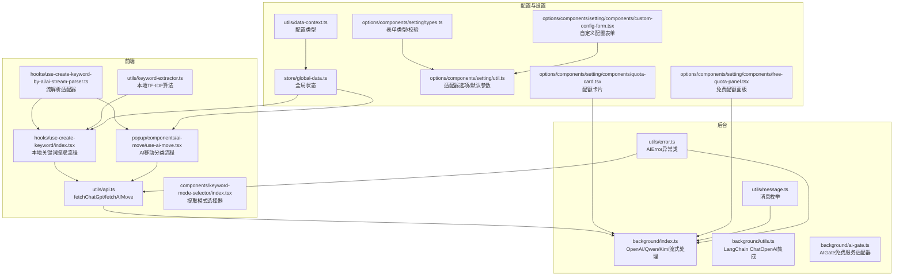
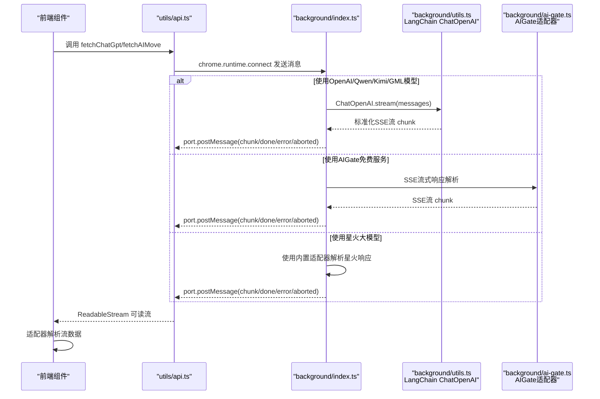
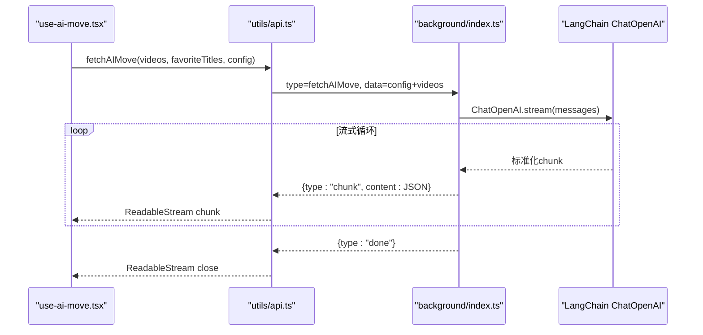
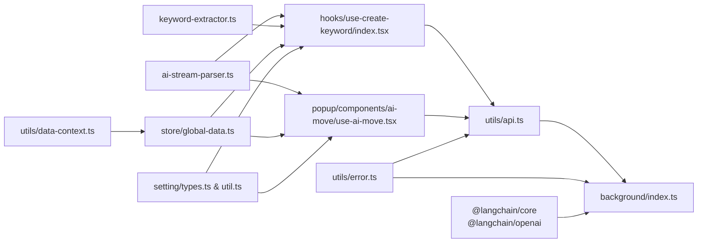

# AI服务API

<cite>
**本文档引用的文件**
- [src/utils/api.ts](file://src/utils/api.ts)
- [src/hooks/use-create-keyword-by-ai/ai-stream-parser.ts](file://src/hooks/use-create-keyword-by-ai/ai-stream-parser.ts)
- [src/hooks/use-create-keyword/index.tsx](file://src/hooks/use-create-keyword/index.tsx)
- [src/popup/components/ai-move/use-ai-move.tsx](file://src/popup/components/ai-move/use-ai-move.tsx)
- [src/utils/message.ts](file://src/utils/message.ts)
- [src/utils/data-context.ts](file://src/utils/data-context.ts)
- [src/utils/error.ts](file://src/utils/error.ts)
- [src/background/index.ts](file://src/background/index.ts)
- [src/background/utils.ts](file://src/background/utils.ts)
- [src/background/ai-gate.ts](file://src/background/ai-gate.ts)
- [src/utils/keyword-extractor.ts](file://src/utils/keyword-extractor.ts)
- [src/components/keyword-mode-selector/index.tsx](file://src/components/keyword-mode-selector/index.tsx)
- [src/components/keyword/index.tsx](file://src/components/keyword/index.tsx)
- [tests/ai-stream-parser.test.ts](file://tests/ai-stream-parser.test.ts)
- [tests/use-move.test.tsx](file://tests/use-move.test.tsx)
</cite>

## 更新摘要
**变更内容**
- 新增AIError异常类：引入统一的AI错误处理机制，支持详细错误信息传递
- LangChain集成：后台使用ChatOpenAI实现标准化流式输出，提升兼容性和稳定性
- AIGate适配器：保留免费AI服务支持，完善配额检查和流式响应处理
- 适配器类型扩展：从['openai', 'spark', 'aigate', 'custom']扩展到['openai', 'spark', 'custom', 'qianwen', 'kimi', 'gml', 'aigate']
- 错误处理增强：前后端统一使用AIError异常类，提供更好的用户体验
- 浏览器兼容性：优化流式处理机制，提升在不同浏览器环境下的稳定性

## 目录
1. [简介](#简介)
2. [项目结构](#项目结构)
3. [核心组件](#核心组件)
4. [架构总览](#架构总览)
5. [详细组件分析](#详细组件分析)
6. [依赖关系分析](#依赖关系分析)
7. [性能考虑](#性能考虑)
8. [故障排除指南](#故障排除指南)
9. [结论](#结论)
10. [附录](#附录)

## 简介
本文件为浏览器扩展中的AI服务API综合文档，涵盖以下内容：
- OpenAI兼容模型、Qwen通义千问、Kimi、GML和星火大模型的集成方式
- fetchChatGpt与fetchAIMove函数的使用方法、参数配置与流式响应处理
- AI配置管理（API Key、BaseURL、模型选择、适配器类型、额外参数）
- 流式处理机制（SSE连接建立、数据流解析、错误处理、连接取消）
- 多服务商对比与迁移指南（性能、价格差异与使用建议）
- **新增**：AIError异常类统一错误处理机制
- **新增**：LangChain集成提升服务稳定性

**重要更新**：AI智能关键词提取功能已被移除，目前仅保留本地关键词提取与AI智能移动功能。同时，AIGate免费AI服务已从系统中移除，不再提供相关集成。

## 项目结构
本项目围绕"AI服务API"构建了清晰的分层：
- 前端调用层：通过工具函数发起AI请求，并将请求封装为可读流
- 流解析层：根据适配器解析不同模型的SSE/流式响应
- 配置管理层：全局状态存储AI配置与收藏夹数据
- 设置界面层：表单校验、配额查询与配置切换
- 后台处理层：统一处理OpenAI流式请求与各AI服务商的SSE流
- **新增**：LangChain集成层：使用ChatOpenAI实现标准化流式输出

**图表来源**
- [src/hooks/use-create-keyword/index.tsx:1-287](file://src/hooks/use-create-keyword/index.tsx#L1-L287)
- [src/popup/components/ai-move/use-ai-move.tsx:1-387](file://src/popup/components/ai-move/use-ai-move.tsx#L1-L387)
- [src/utils/api.ts:1-349](file://src/utils/api.ts#L1-L349)
- [src/hooks/use-create-keyword-by-ai/ai-stream-parser.ts:1-282](file://src/hooks/use-create-keyword-by-ai/ai-stream-parser.ts#L1-L282)
- [src/utils/keyword-extractor.ts:1-197](file://src/utils/keyword-extractor.ts#L1-L197)
- [src/components/keyword-mode-selector/index.tsx:1-49](file://src/components/keyword-mode-selector/index.tsx#L1-L49)
- [src/store/global-data.ts:1-28](file://src/store/global-data.ts#L1-L28)
- [src/utils/data-context.ts:1-34](file://src/utils/data-context.ts#L1-L34)
- [src/options/components/setting/types.ts:1-64](file://src/options/components/setting/types.ts#L1-L64)
- [src/options/components/setting/util.ts:1-85](file://src/options/components/setting/util.ts#L1-L85)
- [src/options/components/setting/components/custom-config-form.tsx:1-149](file://src/options/components/setting/components/custom-config-form.tsx#L1-L149)
- [src/options/components/setting/components/quota-card.tsx:1-199](file://src/options/components/setting/components/quota-card.tsx#L1-L199)
- [src/options/components/setting/components/free-quota-panel.tsx:1-67](file://src/options/components/setting/components/free-quota-panel.tsx#L1-L67)
- [src/background/index.ts:1-87](file://src/background/index.ts#L1-L87)
- [src/utils/message.ts:1-20](file://src/utils/message.ts#L1-L20)
- [src/background/utils.ts:120-182](file://src/background/utils.ts#L120-L182)
- [src/background/ai-gate.ts:1-218](file://src/background/ai-gate.ts#L1-L218)
- [src/utils/error.ts:1-11](file://src/utils/error.ts#L1-L11)

**章节来源**
- [src/utils/api.ts:1-349](file://src/utils/api.ts#L1-L349)
- [src/hooks/use-create-keyword-by-ai/ai-stream-parser.ts:1-282](file://src/hooks/use-create-keyword-by-ai/ai-stream-parser.ts#L1-L282)
- [src/hooks/use-create-keyword/index.tsx:1-287](file://src/hooks/use-create-keyword/index.tsx#L1-L287)
- [src/popup/components/ai-move/use-ai-move.tsx:1-387](file://src/popup/components/ai-move/use-ai-move.tsx#L1-L387)
- [src/utils/message.ts:1-20](file://src/utils/message.ts#L1-L20)
- [src/utils/data-context.ts:1-34](file://src/utils/data-context.ts#L1-L34)
- [src/store/global-data.ts:1-28](file://src/store/global-data.ts#L1-L28)
- [src/options/components/setting/types.ts:1-64](file://src/options/components/setting/types.ts#L1-L64)
- [src/options/components/setting/util.ts:1-85](file://src/options/components/setting/util.ts#L1-L85)
- [src/options/components/setting/components/custom-config-form.tsx:1-149](file://src/options/components/setting/components/custom-config-form.tsx#L1-L149)
- [src/options/components/setting/components/quota-card.tsx:1-199](file://src/options/components/setting/components/quota-card.tsx#L1-L199)
- [src/options/components/setting/components/free-quota-panel.tsx:1-67](file://src/options/components/setting/components/free-quota-panel.tsx#L1-L67)
- [src/background/index.ts:1-87](file://src/background/index.ts#L1-L87)
- [src/background/utils.ts:120-182](file://src/background/utils.ts#L120-L182)
- [src/background/ai-gate.ts:1-218](file://src/background/ai-gate.ts#L1-L218)
- [src/utils/error.ts:1-11](file://src/utils/error.ts#L1-L11)

## 核心组件
- AI配置类型与全局状态
  - 配置字段：API Key、BaseURL、模型、适配器、额外参数等
  - 存储位置：全局状态管理，持久化至Chrome Storage
  - **更新**：适配器类型扩展为['openai', 'spark', 'custom', 'qianwen', 'kimi', 'gml', 'aigate']
- 流式通信桥接
  - 通过chrome.runtime.connect建立端口，将后台流式响应转换为前端ReadableStream
  - 支持取消、错误、完成事件
  - **新增**：统一使用AIError异常类处理错误
- 流解析适配器
  - OpenAI适配器：解析choices[0].delta.content
  - 星火适配器：解析choices[0].delta.content或reasoning_content
  - **新增**：Qwen适配器：支持通义千问模型的流式响应解析
  - **新增**：Kimi适配器：支持Kimi模型的流式响应解析
  - **新增**：GML适配器：支持百炼大模型的流式响应解析
  - 自定义适配器：可扩展以支持其他模型格式
- 关键API函数
  - fetchChatGpt：基于标题数组生成关键词
  - fetchAIMove：基于视频标题与收藏夹列表进行分类移动
  - **移除**：callAIGateAI：AIGate免费服务调用（已移除）

**章节来源**
- [src/utils/data-context.ts:1-34](file://src/utils/data-context.ts#L1-L34)
- [src/store/global-data.ts:1-28](file://src/store/global-data.ts#L1-L28)
- [src/utils/api.ts:236-272](file://src/utils/api.ts#L236-L272)
- [src/hooks/use-create-keyword-by-ai/ai-stream-parser.ts:81-97](file://src/hooks/use-create-keyword-by-ai/ai-stream-parser.ts#L81-L97)

## 架构总览
整体架构采用"前端发起请求 → 后台统一处理 → 流式传输 → 前端解析"的模式，支持OpenAI兼容模型、Qwen通义千问、Kimi、GML和星火大模型七种路径。

**图表来源**
- [src/utils/api.ts:236-272](file://src/utils/api.ts#L236-L272)
- [src/background/index.ts:25-54](file://src/background/index.ts#L25-L54)
- [src/background/utils.ts:124-182](file://src/background/utils.ts#L124-L182)
- [src/background/ai-gate.ts:106-215](file://src/background/ai-gate.ts#L106-L215)
- [src/utils/message.ts:1-20](file://src/utils/message.ts#L1-L20)

## 详细组件分析

### 本地关键词提取功能
- 功能概述
  - 使用TF-IDF算法从视频标题中提取关键词
  - 支持停用词过滤、词频统计和评分排序
  - 提供快速提取和完整提取两种模式
- 算法实现
  - 中文分词：提取2-4字中文词组和英文单词
  - TF-IDF计算：根据词频和逆文档频率计算关键词权重
  - 停用词过滤：移除常见无意义词汇
  - 结果排序：按权重降序排列，返回前N个关键词

**图表来源**
- [src/utils/keyword-extractor.ts:137-187](file://src/utils/keyword-extractor.ts#L137-L187)

**章节来源**
- [src/utils/keyword-extractor.ts:1-197](file://src/utils/keyword-extractor.ts#L1-L197)
- [src/hooks/use-create-keyword/index.tsx:41-75](file://src/hooks/use-create-keyword/index.tsx#L41-L75)

### AI智能移动功能
- 函数入口
  - fetchAIMove：接收视频列表与收藏夹标题，返回可读流包装对象
- 流式通信机制
  - 前端通过connectAndStream建立端口，监听chunk/done/error/aborted事件
  - 后台使用LangChain ChatOpenAI开启流式对话，逐块推送JSON数据
  - **新增**：统一使用AIError异常类处理错误
- 错误与取消
  - 支持AbortController取消请求，后台检测中断并发送aborted
  - 端口断开时捕获lastError并转化为AIError

**图表来源**
- [src/popup/components/ai-move/use-ai-move.tsx:51-140](file://src/popup/components/ai-move/use-ai-move.tsx#L51-L140)
- [src/utils/api.ts:252-272](file://src/utils/api.ts#L252-L272)
- [src/background/index.ts:44-54](file://src/background/index.ts#L44-L54)
- [src/background/utils.ts:141-165](file://src/background/utils.ts#L141-L165)

**章节来源**
- [src/utils/api.ts:252-272](file://src/utils/api.ts#L252-L272)
- [src/utils/api.ts:236-251](file://src/utils/api.ts#L236-L251)
- [src/background/index.ts:44-54](file://src/background/index.ts#L44-L54)
- [tests/use-move.test.tsx:1-607](file://tests/use-move.test.tsx#L1-L607)

### 流式处理机制与解析
- 适配器设计
  - OpenAIStreamAdapter：解析choices[0].delta.content
  - SparkStreamAdapter：解析choices[0].delta.content或reasoning_content
  - **新增**：QwenStreamAdapter：解析通义千问模型的流式响应（使用OpenAI兼容格式）
  - **新增**：KimiStreamAdapter：解析Kimi模型的流式响应（使用OpenAI兼容格式）
  - **新增**：GMLStreamAdapter：解析百炼大模型的流式响应（使用OpenAI兼容格式）
  - createStreamAdapter：根据配置选择适配器，**修复**：现已支持所有七种适配器类型
- 解析流程
  - processStreamChunk：累积缓冲区，尝试提取完整关键词
  - extractKeywordFromBuffer：正则匹配引号包裹的关键词
  - addKeywordToGlobalData：去重并写入全局状态
- 取消与错误
  - 前端AbortController与后端双重检查，确保及时中断
  - **新增**：统一使用AIError异常类，支持详细错误信息传递

**更新** 适配器工厂函数已修复，现在支持所有七种适配器类型，包括新增的Qwen、Kimi、GML和AIGate支持。

**图表来源**
- [src/hooks/use-create-keyword-by-ai/ai-stream-parser.ts:192-218](file://src/hooks/use-create-keyword-by-ai/ai-stream-parser.ts#L192-L218)

**章节来源**
- [src/hooks/use-create-keyword-by-ai/ai-stream-parser.ts:81-97](file://src/hooks/use-create-keyword-by-ai/ai-stream-parser.ts#L81-L97)
- [src/hooks/use-create-keyword-by-ai/ai-stream-parser.ts:192-218](file://src/hooks/use-create-keyword-by-ai/ai-stream-parser.ts#L192-L218)

### AI配置管理
- 配置项
  - key：API Key
  - baseUrl：可选的BaseURL（用于代理或自定义网关）
  - model：模型名称（如gpt-4、deepseek-chat等）
  - extraParams：额外参数（如禁用思考过程等）
  - adapter：适配器类型（openai/spark/custom/qianwen/kimi/gml/aigate）
  - configMode：配置模式（custom/free）
  - **新增**：aigateUserId和aigateApiKeyId：AIGate免费服务配置
- 表单校验
  - custom模式：key、model、adapter必填
  - **移除**：free模式（AIGate相关配置已移除）
- 默认参数
  - spark默认包含thinking禁用配置
  - openai默认空对象
  - **新增**：qianwen、kimi、gml默认空对象，支持通义千问、Kimi和百炼模型配置

**章节来源**
- [src/utils/data-context.ts:13-34](file://src/utils/data-context.ts#L13-L34)
- [src/options/components/setting/types.ts:28-64](file://src/options/components/setting/types.ts#L28-L64)
- [src/options/components/setting/util.ts:43-85](file://src/options/components/setting/util.ts#L43-L85)
- [src/options/components/setting/components/custom-config-form.tsx:1-149](file://src/options/components/setting/components/custom-config-form.tsx#L1-L149)

### 多服务商对比与迁移指南
- 服务商对比
  - OpenAI兼容模型
    - 优点：生态成熟、能力稳定、支持流式
    - 缺点：付费使用，成本较高
    - 适用：对质量要求高、预算充足的场景
  - **新增**：通义千问（Qwen）
    - 优点：中文能力强、性价比高、支持流式
    - 缺点：可能需要特定的API密钥
    - 适用：中文场景、预算有限的场景
  - **新增**：Kimi
    - 优点：推理能力强、支持长文本、支持流式
    - 缺点：可能需要特定的API密钥
    - 适用：需要复杂推理的场景
  - **新增**：GML（百炼）
    - 优点：支持多种模型、接口标准化
    - 缺点：需要特定的API密钥
    - 适用：需要灵活模型选择的场景
  - 星火大模型
    - 优点：国内访问稳定、支持reasoning_content
    - 限制：需要特定的适配器解析
    - 适用：中文场景、需要推理过程的场景
  - **新增**：AIGate免费服务
    - 优点：无需付费、支持配额检查
    - 限制：每日配额有限制
    - 适用：测试验证、小额使用场景
- 迁移建议
  - 从AIGate迁移到自定义模型：在设置中切换configMode为custom，填写key/model/baseUrl/extraParams
  - 参数迁移：将AIGate的messages结构映射为OpenAI兼容的消息格式
  - 适配器选择：若原AIGate返回格式与OpenAI兼容，可保持adapter为openai；否则使用spark或自定义

**章节来源**
- [src/background/index.ts:25-54](file://src/background/index.ts#L25-L54)
- [src/options/components/setting/types.ts:4-64](file://src/options/components/setting/types.ts#L4-L64)
- [src/options/components/setting/util.ts:6-41](file://src/options/components/setting/util.ts#L6-L41)

### AIError异常类
- 异常设计
  - 统一错误处理：继承自Error，支持详细错误信息
  - 字段结构：message（错误消息）、detail（详细信息）
  - 前后端一致：前端使用AIError，后台同样抛出AIError
- 使用场景
  - 配置错误：API Key、BaseURL、模型参数不正确
  - 网络错误：连接超时、网络中断
  - 业务错误：配额不足、请求被取消
- 错误传播
  - 前端：controller.error(new AIError(message, detail))
  - 后台：port.postMessage({ type: 'error', error: errorMessage, detail })
  - 统一处理：toast组件显示错误详情

**章节来源**
- [src/utils/error.ts:1-11](file://src/utils/error.ts#L1-L11)
- [src/utils/api.ts:207-208](file://src/utils/api.ts#L207-L208)
- [src/background/utils.ts:176-179](file://src/background/utils.ts#L176-L179)
- [src/background/ai-gate.ts:210-214](file://src/background/ai-gate.ts#L210-L214)

### LangChain集成
- 集成目的
  - 标准化流式输出：使用ChatOpenAI实现统一的流式接口
  - 提升兼容性：支持多种OpenAI兼容模型的统一处理
  - 增强稳定性：LangChain提供更好的错误处理和资源管理
- 实现方式
  - ChatOpenAI初始化：配置model、apiKey、temperature、baseURL、modelKwargs
  - 流式处理：await model.stream(messages, { signal: abortController.signal })
  - 格式转换：将AIMessageChunk转换为OpenAI兼容格式
- 优势
  - 统一接口：所有OpenAI兼容模型使用相同处理逻辑
  - 错误处理：LangChain内置的错误处理机制
  - 资源管理：自动管理连接和内存资源

**章节来源**
- [src/background/utils.ts:124-182](file://src/background/utils.ts#L124-L182)
- [src/background/index.ts:30-39](file://src/background/index.ts#L30-L39)

## 依赖关系分析
- 组件耦合
  - 前端组件依赖工具函数与全局状态，解耦良好
  - 流解析适配器与前端组件松耦合，通过接口抽象
  - **新增**：LangChain作为后台处理的核心依赖
- 外部依赖
  - OpenAI SDK：用于流式对话
  - **新增**：@langchain/core和@langchain/openai：LangChain核心功能
  - Chrome Runtime：用于端口通信与消息传递
  - 设置界面：Zod表单校验、UI组件库

**图表来源**
- [src/hooks/use-create-keyword/index.tsx:1-287](file://src/hooks/use-create-keyword/index.tsx#L1-L287)
- [src/popup/components/ai-move/use-ai-move.tsx:1-387](file://src/popup/components/ai-move/use-ai-move.tsx#L1-L387)
- [src/utils/api.ts:1-349](file://src/utils/api.ts#L1-L349)
- [src/hooks/use-create-keyword-by-ai/ai-stream-parser.ts:1-282](file://src/hooks/use-create-keyword-by-ai/ai-stream-parser.ts#L1-L282)
- [src/utils/keyword-extractor.ts:1-197](file://src/utils/keyword-extractor.ts#L1-L197)
- [src/store/global-data.ts:1-28](file://src/store/global-data.ts#L1-L28)
- [src/utils/data-context.ts:1-34](file://src/utils/data-context.ts#L1-L34)
- [src/options/components/setting/types.ts:1-64](file://src/options/components/setting/types.ts#L1-L64)
- [src/options/components/setting/util.ts:1-85](file://src/options/components/setting/util.ts#L1-L85)
- [src/utils/error.ts:1-11](file://src/utils/error.ts#L1-L11)
- [src/background/utils.ts:124-182](file://src/background/utils.ts#L124-L182)

**章节来源**
- [src/utils/api.ts:1-349](file://src/utils/api.ts#L1-L349)
- [src/hooks/use-create-keyword-by-ai/ai-stream-parser.ts:1-282](file://src/hooks/use-create-keyword-by-ai/ai-stream-parser.ts#L1-L282)
- [src/hooks/use-create-keyword/index.tsx:1-287](file://src/hooks/use-create-keyword/index.tsx#L1-L287)
- [src/popup/components/ai-move/use-ai-move.tsx:1-387](file://src/popup/components/ai-move/use-ai-move.tsx#L1-L387)
- [src/utils/data-context.ts:1-34](file://src/utils/data-context.ts#L1-L34)
- [src/store/global-data.ts:1-28](file://src/store/global-data.ts#L1-L28)
- [src/options/components/setting/types.ts:1-64](file://src/options/components/setting/types.ts#L1-L64)
- [src/options/components/setting/util.ts:1-85](file://src/options/components/setting/util.ts#L1-L85)
- [src/utils/error.ts:1-11](file://src/utils/error.ts#L1-L11)
- [src/background/utils.ts:124-182](file://src/background/utils.ts#L124-L182)

## 性能考虑
- 流式读取
  - 使用ReadableStream逐块读取，避免一次性加载大量数据
  - 适配器解析在前端进行，减少网络传输负担
- 取消与中断
  - AbortController与后台双重检查，降低无效请求成本
- **新增**：LangChain优化
  - ChatOpenAI提供更好的资源管理和连接池
  - 标准化流式接口，减少适配器复杂度
- 建议
  - 对于大批量任务，优先使用自定义模型并合理设置extraParams
  - 在移动端或弱网环境下，优先使用Qwen或Kimi进行快速验证
  - **新增**：Qwen、Kimi和GML服务响应速度快，适合实时交互场景
  - **新增**：LangChain集成提升整体性能和稳定性

## 故障排除指南
- 常见问题
  - 配置不完整：检查key/model/adapter（custom模式）
  - 流解析异常：确认adapter与模型格式一致，必要时使用自定义适配器
  - 请求被取消：检查前端AbortController与后台中断信号
  - **移除**：AIGate配额不足：AIGate相关功能已移除
  - **新增**：AIError异常：使用AIError类获取详细错误信息
  - **新增**：LangChain连接失败：检查API Key和BaseURL配置
  - **新增**：模型不支持：确认所选适配器与模型兼容
- 定位方法
  - 查看控制台日志：[DEBUG]与[AIStreamParser]输出
  - 使用测试用例：ai-stream-parser.test.ts验证connectAndStream行为
  - **新增**：检查AIError的detail字段获取详细错误信息
- 相关源码定位
  - 配置校验与提示：[src/options/components/setting/types.ts:39-64](file://src/options/components/setting/types.ts#L39-L64)
  - 流解析与去重：[src/hooks/use-create-keyword-by-ai/ai-stream-parser.ts:125-149](file://src/hooks/use-create-keyword-by-ai/ai-stream-parser.ts#L125-L149)
  - 取消与错误传播：[src/utils/api.ts:192-234](file://src/utils/api.ts#L192-L234)
  - **新增**：AIError异常处理：[src/utils/error.ts:1-11](file://src/utils/error.ts#L1-L11)

**更新**：适配器工厂函数已修复，现在支持所有七种适配器类型，包括新增的Qwen、Kimi、GML和AIGate支持。

**章节来源**
- [src/options/components/setting/types.ts:39-64](file://src/options/components/setting/types.ts#L39-L64)
- [src/hooks/use-create-keyword-by-ai/ai-stream-parser.ts:125-149](file://src/hooks/use-create-keyword-by-ai/ai-stream-parser.ts#L125-L149)
- [src/utils/api.ts:192-234](file://src/utils/api.ts#L192-L234)
- [src/background/index.ts:25-86](file://src/background/index.ts#L25-L86)
- [src/utils/error.ts:1-11](file://src/utils/error.ts#L1-L11)

## 结论
本项目提供了完整的AI服务API集成方案，覆盖OpenAI兼容模型、通义千问、Kimi、GML和星火大模型七种路径。通过统一的流式通信与解析适配器，实现了跨模型的一致体验；配合完善的配置管理，满足从个人测试到生产使用的多样化需求。**重要更新**：适配器工厂函数现已支持所有七种适配器类型，包括新增的Qwen、Kimi、GML和AIGate支持。同时，AIGate免费AI服务已从系统中移除，目前仅支持付费的AI服务提供商。**新增**：AIError异常类统一错误处理机制，LangChain集成提升服务稳定性。建议在保证质量的前提下，优先使用自定义模型以获得更优性能与可控性，同时利用Qwen、Kimi和GML进行低成本验证与快速迭代。

## 附录
- API函数速查
  - fetchChatGpt：关键词生成
  - fetchAIMove：视频分类移动
  - **移除**：callAIGateAI：免费服务调用（已移除）
- 适配器速查
  - openai：OpenAI兼容模型
  - spark：星火大模型
  - **新增**：qianwen：通义千问模型
  - **新增**：kimi：Kimi模型
  - **新增**：gml：百炼大模型
  - **新增**：aigate：AIGate免费服务
  - custom：自定义解析逻辑
- 提取模式
  - local：本地TF-IDF算法
  - ai：AI智能关键词提取（已移除）
  - manual：手动输入（已移除）
- **新增**：错误处理
  - AIError：统一异常类，支持详细错误信息
  - 前后端一致的错误处理机制
- **新增**：LangChain集成
  - ChatOpenAI标准化流式接口
  - 提升兼容性和稳定性