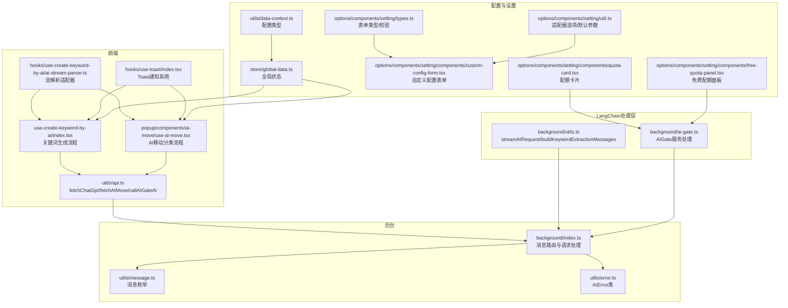
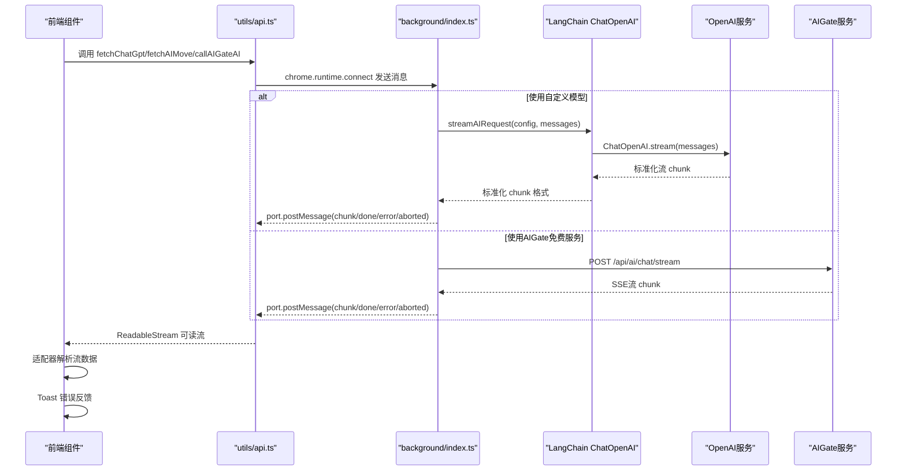
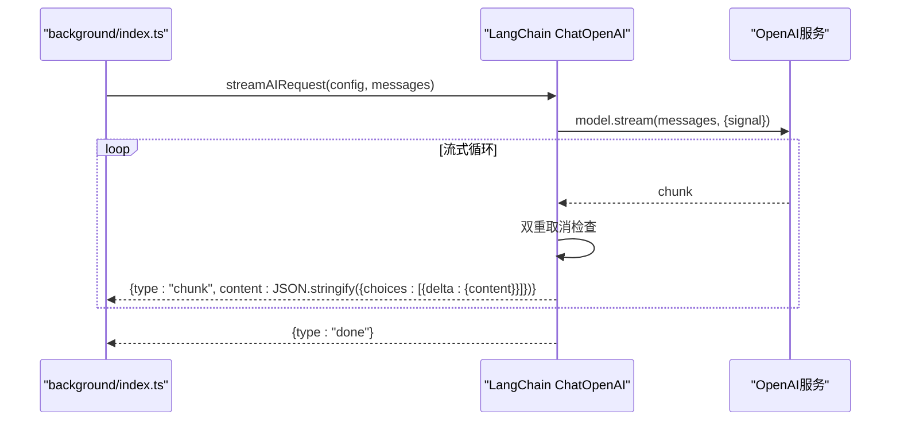
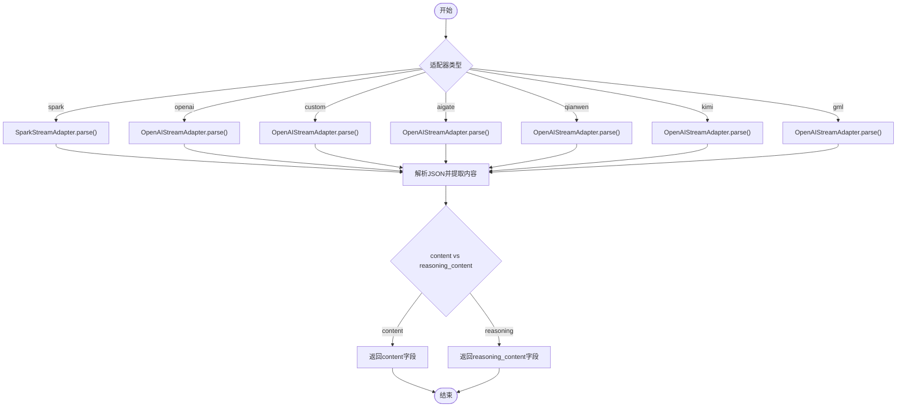
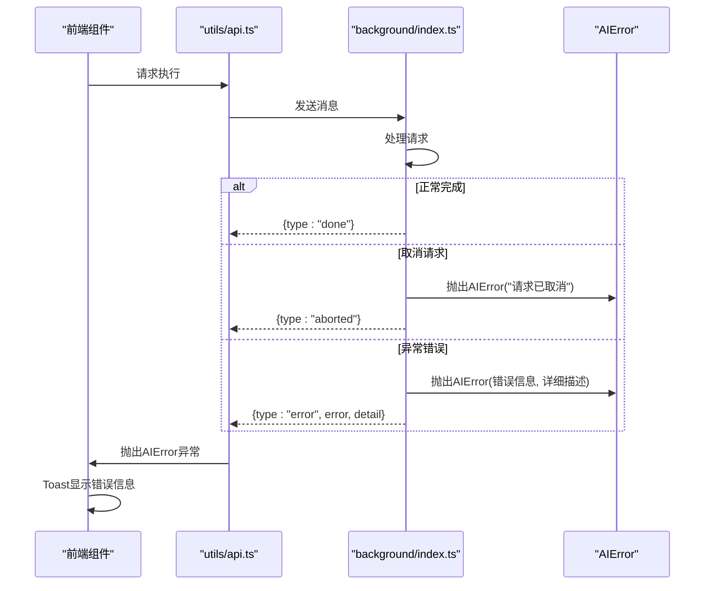
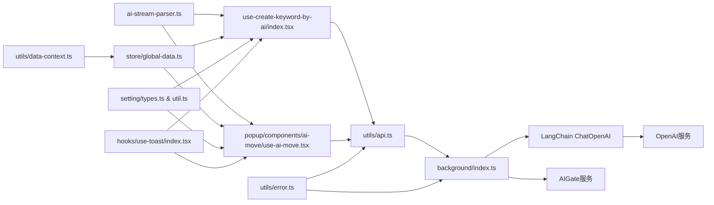

# AI服务API

<cite>
**本文档引用的文件**
- [src/utils/api.ts](file://src/utils/api.ts)
- [src/hooks/use-create-keyword-by-ai/ai-stream-parser.ts](file://src/hooks/use-create-keyword-by-ai/ai-stream-parser.ts)
- [src/hooks/use-create-keyword-by-ai/index.tsx](file://src/hooks/use-create-keyword-by-ai/index.tsx)
- [src/popup/components/ai-move/use-ai-move.tsx](file://src/popup/components/ai-move/use-ai-move.tsx)
- [src/utils/message.ts](file://src/utils/message.ts)
- [src/utils/data-context.ts](file://src/utils/data-context.ts)
- [src/utils/error.ts](file://src/utils/error.ts)
- [src/store/global-data.ts](file://src/store/global-data.ts)
- [src/options/components/setting/types.ts](file://src/options/components/setting/types.ts)
- [src/options/components/setting/util.ts](file://src/options/components/setting/util.ts)
- [src/options/components/setting/components/custom-config-form.tsx](file://src/options/components/setting/components/custom-config-form.tsx)
- [src/options/components/setting/components/quota-card.tsx](file://src/options/components/setting/components/quota-card.tsx)
- [src/options/components/setting/components/free-quota-panel.tsx](file://src/options/components/setting/components/free-quota-panel.tsx)
- [src/background/index.ts](file://src/background/index.ts)
- [src/background/utils.ts](file://src/background/utils.ts)
- [src/background/ai-gate.ts](file://src/background/ai-gate.ts)
- [src/hooks/use-toast/index.tsx](file://src/hooks/use-toast/index.tsx)
- [src/components/ui/toaster.tsx](file://src/components/ui/toaster.tsx)
- [tests/ai-stream-adapter.test.ts](file://tests/ai-stream-adapter.test.ts)
- [tests/ai-stream-parser.test.ts](file://tests/ai-stream-parser.test.ts)
- [tests/ai-stream-connect.test.ts](file://tests/ai-stream-connect.test.ts)
</cite>

## 更新摘要
**变更内容**
- 新增LangChain架构支持，实现标准化流式输出
- 扩展多AI提供商集成，新增qianwen、kimi、gml适配器类型
- 增强错误处理机制，引入AIError类提供详细错误信息
- 完善用户反馈系统，集成Toast通知组件
- 优化流式处理性能，统一前后端适配器接口

## 目录
1. [简介](#简介)
2. [项目结构](#项目结构)
3. [核心组件](#核心组件)
4. [架构总览](#架构总览)
5. [详细组件分析](#详细组件分析)
6. [依赖关系分析](#依赖关系分析)
7. [性能考虑](#性能考虑)
8. [故障排除指南](#故障排除指南)
9. [结论](#结论)
10. [附录](#附录)

## 简介
本文件为浏览器扩展中的AI服务API综合文档，涵盖以下内容：
- **LangChain架构支持**：基于LangChain ChatOpenAI实现标准化流式输出
- **多AI提供商集成**：OpenAI、星火大模型、AIGate、通义千问、Kimi、ChatGLM等多服务商支持
- **增强的错误处理**：AIError类提供详细的错误信息和处理机制
- **用户反馈系统**：Toast通知组件提供实时用户反馈
- **流式处理机制**：SSE连接建立、数据流解析、错误处理、连接取消
- **AI配置管理**：API Key配置、BaseURL设置、模型选择和额外参数传递
- **适配器设计**：统一的AIStreamAdapter接口，支持多种模型格式解析
- **多服务商对比**：性能特点、价格差异与使用建议

## 项目结构
本项目围绕"AI服务API"构建了基于LangChain的现代化分层架构：
- **前端调用层**：通过工具函数发起AI请求，并将请求封装为可读流
- **LangChain处理层**：使用ChatOpenAI标准化流式输出，统一前后端接口
- **流解析层**：根据适配器解析不同模型的SSE/流式响应
- **配置管理层**：全局状态存储AI配置与收藏夹数据
- **设置界面层**：表单校验、配额查询与配置切换
- **后台处理层**：统一处理OpenAI流式请求与AIGate免费服务的SSE流
- **错误处理层**：AIError类提供统一的错误处理机制
- **用户反馈层**：Toast组件提供实时用户反馈

**图表来源**
- [src/hooks/use-create-keyword-by-ai/index.tsx:1-170](file://src/hooks/use-create-keyword-by-ai/index.tsx#L1-L170)
- [src/popup/components/ai-move/use-ai-move.tsx:1-396](file://src/popup/components/ai-move/use-ai-move.tsx#L1-L396)
- [src/utils/api.ts:1-348](file://src/utils/api.ts#L1-L348)
- [src/hooks/use-create-keyword-by-ai/ai-stream-parser.ts:1-282](file://src/hooks/use-create-keyword-by-ai/ai-stream-parser.ts#L1-L282)
- [src/background/utils.ts:1-183](file://src/background/utils.ts#L1-L183)
- [src/background/ai-gate.ts:1-209](file://src/background/ai-gate.ts#L1-L209)
- [src/store/global-data.ts:1-28](file://src/store/global-data.ts#L1-L28)
- [src/utils/data-context.ts:1-34](file://src/utils/data-context.ts#L1-L34)
- [src/options/components/setting/types.ts:1-99](file://src/options/components/setting/types.ts#L1-L99)
- [src/options/components/setting/util.ts:1-35](file://src/options/components/setting/util.ts#L1-L35)
- [src/options/components/setting/components/custom-config-form.tsx:1-150](file://src/options/components/setting/components/custom-config-form.tsx#L1-L150)
- [src/options/components/setting/components/quota-card.tsx:1-199](file://src/options/components/setting/components/quota-card.tsx#L1-L199)
- [src/options/components/setting/components/free-quota-panel.tsx:1-67](file://src/options/components/setting/components/free-quota-panel.tsx#L1-L67)
- [src/background/index.ts:1-87](file://src/background/index.ts#L1-L87)
- [src/utils/message.ts:1-20](file://src/utils/message.ts#L1-L20)
- [src/utils/error.ts:1-12](file://src/utils/error.ts#L1-L12)

## 核心组件
- **LangChain架构支持**
  - ChatOpenAI标准化流式输出，统一前后端接口格式
  - ChatPromptTemplate模板系统，支持系统提示词和few-shot示例
  - BaseMessageLike消息格式，确保跨模型兼容性
- **多AI提供商集成**
  - 适配器类型：spark、openai、custom、aigate、qianwen、kimi、gml
  - 统一的AIStreamAdapter接口，支持多种模型格式解析
  - AIGate免费服务集成，支持实时配额检查
- **增强错误处理机制**
  - AIError类提供详细的错误信息和处理机制
  - 前后端双重错误检查，确保请求取消和异常处理
  - 用户友好的错误反馈，包含详细错误描述
- **用户反馈系统**
  - Toast通知组件提供实时用户反馈
  - 支持展开查看详情的错误信息显示
  - 限制同时显示的Toast数量，避免界面拥挤
- **关键API函数**
  - fetchChatGpt：基于标题数组生成关键词
  - fetchAIMove：基于视频标题与收藏夹列表进行分类移动
  - callAIGateAI：调用AIGate免费服务（需检查配额）

**章节来源**
- [src/background/utils.ts:120-183](file://src/background/utils.ts#L120-L183)
- [src/utils/data-context.ts:1-34](file://src/utils/data-context.ts#L1-L34)
- [src/utils/error.ts:1-12](file://src/utils/error.ts#L1-L12)
- [src/hooks/use-toast/index.tsx:1-186](file://src/hooks/use-toast/index.tsx#L1-L186)
- [src/utils/api.ts:235-285](file://src/utils/api.ts#L235-L285)

## 架构总览
整体架构采用"前端发起请求 → LangChain标准化处理 → 后台统一处理 → 流式传输 → 前端解析"的模式，支持多种AI提供商和统一的错误处理机制。

**图表来源**
- [src/utils/api.ts:235-285](file://src/utils/api.ts#L235-L285)
- [src/background/index.ts:25-75](file://src/background/index.ts#L25-L75)
- [src/background/utils.ts:124-183](file://src/background/utils.ts#L124-L183)
- [src/utils/message.ts:1-20](file://src/utils/message.ts#L1-L20)

## 详细组件分析

### LangChain架构支持与标准化流式输出
- **ChatOpenAI集成**
  - 使用LangChain ChatOpenAI实现标准化流式输出
  - 统一前后端接口格式，确保跨模型兼容性
  - 支持temperature、baseURL、extraParams等配置参数
- **Prompt模板系统**
  - 关键词提取：系统提示词 + few-shot示例
  - AI移动分类：系统提示词 + few-shot示例 + 动态收藏夹列表
  - 支持动态参数替换和消息格式化
- **流式处理机制**
  - 使用for-await-of循环处理流式响应
  - 双重取消检查：前端AbortController + 后端信号检查
  - 标准化chunk格式：统一包装为choices.delta.content结构

**图表来源**
- [src/background/utils.ts:124-183](file://src/background/utils.ts#L124-L183)
- [src/background/index.ts:25-54](file://src/background/index.ts#L25-L54)

**章节来源**
- [src/background/utils.ts:124-183](file://src/background/utils.ts#L124-L183)
- [src/background/utils.ts:34-50](file://src/background/utils.ts#L34-L50)
- [src/background/utils.ts:99-118](file://src/background/utils.ts#L99-L118)

### 多AI提供商集成与适配器设计
- **适配器类型扩展**
  - spark：星火大模型，支持content和reasoning_content字段
  - openai：OpenAI兼容模型，解析choices[0].delta.content
  - custom：自定义适配器，继承OpenAI格式
  - aigate：AIGate免费服务，兼容OpenAI格式
  - qianwen：通义千问，兼容OpenAI格式
  - kimi：月之暗面Kimi，兼容OpenAI格式
  - gml：ChatGLM，兼容OpenAI格式
- **适配器工厂模式**
  - createStreamAdapter根据配置选择对应适配器
  - 默认使用Spark适配器，确保向后兼容性
  - 支持自定义解析逻辑扩展
- **解析策略**
  - content字段优先于reasoning_content字段
  - 错误处理：无效JSON返回空字符串，缺失字段安全降级

**图表来源**
- [src/hooks/use-create-keyword-by-ai/ai-stream-parser.ts:81-97](file://src/hooks/use-create-keyword-by-ai/ai-stream-parser.ts#L81-L97)
- [src/hooks/use-create-keyword-by-ai/ai-stream-parser.ts:39-73](file://src/hooks/use-create-keyword-by-ai/ai-stream-parser.ts#L39-L73)

**章节来源**
- [src/hooks/use-create-keyword-by-ai/ai-stream-parser.ts:1-282](file://src/hooks/use-create-keyword-by-ai/ai-stream-parser.ts#L1-L282)
- [src/utils/data-context.ts:1-34](file://src/utils/data-context.ts#L1-L34)

### 增强错误处理与用户反馈机制
- **AIError类设计**
  - 继承自Error基类，支持message和detail属性
  - 提供详细的错误信息和上下文描述
  - 前后端统一的错误处理标准
- **双重错误检查**
  - 前端：AbortController信号检查 + 端口断开错误
  - 后端：LangChain流式处理中的异常捕获
  - 用户友好的错误反馈，包含详细错误描述
- **Toast通知系统**
  - 支持展开查看详情的错误信息显示
  - 限制同时显示的Toast数量（默认1个）
  - 自动定时关闭和手动关闭功能
  - 支持操作按钮和自定义样式

**图表来源**
- [src/utils/api.ts:181-233](file://src/utils/api.ts#L181-L233)
- [src/background/index.ts:15-23](file://src/background/index.ts#L15-L23)
- [src/utils/error.ts:1-12](file://src/utils/error.ts#L1-L12)

**章节来源**
- [src/utils/error.ts:1-12](file://src/utils/error.ts#L1-L12)
- [src/utils/api.ts:181-233](file://src/utils/api.ts#L181-L233)
- [src/hooks/use-toast/index.tsx:1-186](file://src/hooks/use-toast/index.tsx#L1-L186)

### AIGate免费AI服务集成
- **配额管理系统**
  - 实时配额检查：daily、monthly、rpm三重限制
  - 配额不足时抛出AIError，包含详细错误信息
  - 用户友好的配额状态显示和提示
- **SSE流式处理**
  - 标准化的SSE数据解析，支持[data: [DONE]]标记
  - 错误状态检查：data.code !== 0时抛出AIError
  - 双重取消检查：前端取消 + 后端流式检查
- **配置管理**
  - 支持apiKeyId和userId配置
  - 固定模型：qwen-turbo（lite模型）
  - 禁用思考过程：enable_thinking: false

**章节来源**
- [src/background/ai-gate.ts:38-97](file://src/background/ai-gate.ts#L38-L97)
- [src/background/ai-gate.ts:106-206](file://src/background/ai-gate.ts#L106-L206)
- [src/options/components/setting/types.ts:19-24](file://src/options/components/setting/types.ts#L19-L24)

### 流式处理机制与解析优化
- **标准化流格式**
  - 统一包装为OpenAI兼容格式：choices[0].delta.content
  - LangChain标准化输出，确保跨模型一致性
  - 前端适配器无需修改即可支持新模型
- **解析流程优化**
  - createAIStreamParser工厂函数，支持自定义适配器
  - 缓冲区管理：extractKeywordFromBuffer处理分割的关键词
  - 去重机制：addKeywordToGlobalData避免重复关键词
- **性能优化**
  - 流式读取：避免一次性加载大量数据
  - 双重取消：前端AbortController + 后端信号检查
  - 错误快速失败：无效JSON和缺失字段快速降级

**章节来源**
- [src/hooks/use-create-keyword-by-ai/ai-stream-parser.ts:225-282](file://src/hooks/use-create-keyword-by-ai/ai-stream-parser.ts#L225-L282)
- [src/hooks/use-create-keyword-by-ai/ai-stream-parser.ts:125-183](file://src/hooks/use-create-keyword-by-ai/ai-stream-parser.ts#L125-L183)

### AI配置管理扩展
- **配置项扩展**
  - key：API Key
  - baseUrl：可选的BaseURL（用于代理或自定义网关）
  - model：模型名称（如gpt-4、deepseek-chat等）
  - extraParams：额外参数（如禁用思考过程等）
  - adapter：适配器类型（spark/openai/custom/aigate/qianwen/kimi/gml）
  - aigateUserId/aigateApiKeyId：AIGate免费服务所需
  - configMode：配置模式（custom/free）
- **适配器类型扩展**
  - 新增qianwen、kimi、gml三种适配器类型
  - 所有新适配器类型都兼容OpenAI格式
  - custom类型保留自定义解析逻辑扩展能力
- **表单校验增强**
  - custom模式：key、model、adapter必填
  - free模式：aigateUserId、aigateApiKeyId、model必填
  - 新增适配器类型验证和默认参数设置

**章节来源**
- [src/utils/data-context.ts:1-34](file://src/utils/data-context.ts#L1-L34)
- [src/options/components/setting/types.ts:19-24](file://src/options/components/setting/types.ts#L19-L24)
- [src/options/components/setting/util.ts:18-22](file://src/options/components/setting/util.ts#L18-L22)

### 多服务商对比与迁移指南
- **服务商对比**
  - **OpenAI兼容模型**
    - 优点：生态成熟、能力稳定、支持流式
    - 缺点：付费使用，成本较高
    - 适用：对质量要求高、预算充足的场景
  - **LangChain标准化处理**
    - 优点：统一接口、跨模型兼容、标准化输出
    - 缺点：需要额外的LangChain依赖
    - 适用：需要多模型支持和标准化输出的场景
  - **AIGate免费服务**
    - 优点：无需付费、易上手、实时配额管理
    - 限制：日配额有限、RPM限制、仅限lite模型
    - 适用：轻量测试、小规模使用、预算有限场景
  - **通义千问、Kimi、ChatGLM**
    - 优点：国内服务、低延迟、中文优化
    - 限制：可能需要特定的API密钥和配置
    - 适用：中文内容处理、国内用户场景
- **迁移建议**
  - 从AIGate迁移到自定义模型：在设置中切换configMode为custom，填写key/model/baseUrl/extraParams
  - 从旧适配器迁移到新适配器：更新adapter配置为新的提供商类型
  - 参数迁移：将AIGate的messages结构映射为OpenAI兼容的消息格式
  - 错误处理：利用AIError类获取详细的错误信息和处理建议

**章节来源**
- [src/background/utils.ts:124-183](file://src/background/utils.ts#L124-L183)
- [src/background/ai-gate.ts:38-97](file://src/background/ai-gate.ts#L38-L97)
- [src/utils/data-context.ts:1-34](file://src/utils/data-context.ts#L1-L34)

## 依赖关系分析
- **组件耦合**
  - 前端组件依赖工具函数与全局状态，解耦良好
  - LangChain层提供标准化接口，前端组件无需关心具体实现
  - 流解析适配器与前端组件松耦合，通过接口抽象
  - 错误处理和用户反馈系统独立模块化
- **外部依赖**
  - LangChain：@langchain/core、@langchain/openai
  - Chrome Runtime：用于端口通信与消息传递
  - 设置界面：Zod表单校验、UI组件库
  - Toast组件：独立的通知系统

**图表来源**
- [src/hooks/use-create-keyword-by-ai/index.tsx:1-170](file://src/hooks/use-create-keyword-by-ai/index.tsx#L1-L170)
- [src/popup/components/ai-move/use-ai-move.tsx:1-396](file://src/popup/components/ai-move/use-ai-move.tsx#L1-L396)
- [src/utils/api.ts:1-348](file://src/utils/api.ts#L1-L348)
- [src/hooks/use-create-keyword-by-ai/ai-stream-parser.ts:1-282](file://src/hooks/use-create-keyword-by-ai/ai-stream-parser.ts#L1-L282)
- [src/background/index.ts:1-87](file://src/background/index.ts#L1-L87)
- [src/background/utils.ts:1-183](file://src/background/utils.ts#L1-L183)
- [src/background/ai-gate.ts:1-209](file://src/background/ai-gate.ts#L1-L209)
- [src/store/global-data.ts:1-28](file://src/store/global-data.ts#L1-L28)
- [src/utils/data-context.ts:1-34](file://src/utils/data-context.ts#L1-L34)
- [src/options/components/setting/types.ts:1-99](file://src/options/components/setting/types.ts#L1-L99)
- [src/options/components/setting/util.ts:1-26](file://src/options/components/setting/util.ts#L1-L26)
- [src/utils/error.ts:1-12](file://src/utils/error.ts#L1-L12)
- [src/hooks/use-toast/index.tsx:1-186](file://src/hooks/use-toast/index.tsx#L1-L186)

**章节来源**
- [src/utils/api.ts:1-348](file://src/utils/api.ts#L1-L348)
- [src/hooks/use-create-keyword-by-ai/ai-stream-parser.ts:1-282](file://src/hooks/use-create-keyword-by-ai/ai-stream-parser.ts#L1-L282)
- [src/background/utils.ts:1-183](file://src/background/utils.ts#L1-L183)
- [src/background/ai-gate.ts:1-209](file://src/background/ai-gate.ts#L1-L209)
- [src/utils/error.ts:1-12](file://src/utils/error.ts#L1-L12)

## 性能考虑
- **LangChain优化**
  - 标准化流式输出，减少前端适配器复杂度
  - 统一的消息格式，提高跨模型兼容性
  - 内置的错误处理和取消机制
- **流式读取优化**
  - 使用ReadableStream逐块读取，避免一次性加载大量数据
  - LangChain标准化输出，前端适配器解析更加高效
  - 双重取消检查，降低无效请求成本
- **内存管理**
  - 缓冲区管理：extractKeywordFromBuffer处理分割的数据
  - 去重机制：避免重复关键词占用内存
  - Toast组件限制同时显示数量，避免内存泄漏
- **错误处理优化**
  - AIError类提供详细的错误信息，减少调试时间
  - 统一的错误处理机制，避免重复代码
  - 用户友好的错误反馈，提升用户体验

## 故障排除指南
- **常见问题**
  - 配置不完整：检查key/model/adapter（custom模式）或aigateUserId/aigateApiKeyId/model（free模式）
  - LangChain初始化失败：检查@langchain依赖版本和网络连接
  - 适配器解析异常：确认adapter与模型格式一致，必要时使用自定义适配器
  - 请求被取消：检查前端AbortController与后台中断信号
  - 配额不足：查看配额卡片，等待次日或升级到付费方案
  - AIGate连接失败：检查apiKeyId配置与网络连接
  - Toast显示异常：检查hooks/use-toast配置和组件渲染
- **定位方法**
  - 查看控制台日志：[DEBUG]与[AIStreamParser]输出
  - 使用测试用例：ai-stream-adapter.test.ts验证适配器行为
  - 检查LangChain流式输出格式和解析逻辑
  - 验证AIError类的错误信息和处理机制
- **相关源码定位**
  - 配置校验与提示：[src/options/components/setting/types.ts:52-98](file://src/options/components/setting/types.ts#L52-L98)
  - LangChain流式处理：[src/background/utils.ts:124-183](file://src/background/utils.ts#L124-L183)
  - AIGate配额检查：[src/background/ai-gate.ts:38-97](file://src/background/ai-gate.ts#L38-L97)
  - 错误处理机制：[src/utils/error.ts:1-12](file://src/utils/error.ts#L1-L12)
  - Toast通知系统：[src/hooks/use-toast/index.tsx:1-186](file://src/hooks/use-toast/index.tsx#L1-L186)

**章节来源**
- [src/options/components/setting/types.ts:52-98](file://src/options/components/setting/types.ts#L52-L98)
- [src/background/utils.ts:124-183](file://src/background/utils.ts#L124-L183)
- [src/background/ai-gate.ts:38-97](file://src/background/ai-gate.ts#L38-L97)
- [src/utils/error.ts:1-12](file://src/utils/error.ts#L1-L12)
- [src/hooks/use-toast/index.tsx:1-186](file://src/hooks/use-toast/index.tsx#L1-L186)

## 结论
本项目基于LangChain架构提供了完整的AI服务API集成方案，实现了标准化的多AI提供商支持。通过统一的流式通信与解析适配器，结合增强的错误处理和用户反馈机制，实现了跨模型的一致体验。新增的LangChain支持提供了更好的标准化输出和跨模型兼容性，而扩展的适配器类型为用户提供了更多的选择。建议在保证质量的前提下，优先使用自定义模型以获得更优性能与可控性，同时利用AIGate进行低成本验证与快速迭代。Toast通知系统的集成进一步提升了用户体验，使错误处理更加友好和直观。

## 附录
- **API函数速查**
  - fetchChatGpt：关键词生成（支持useCustomAI参数）
  - fetchAIMove：视频分类移动（支持useCustomAI参数）
  - callAIGateAI：免费服务调用
- **适配器速查**
  - spark：星火大模型（支持content和reasoning_content）
  - openai：OpenAI兼容模型
  - custom：自定义解析逻辑
  - aigate：AIGate免费服务（兼容OpenAI格式）
  - qianwen：通义千问（兼容OpenAI格式）
  - kimi：Kimi（兼容OpenAI格式）
  - gml：ChatGLM（兼容OpenAI格式）
- **消息类型**
  - fetchChatGpt：关键词生成请求
  - fetchAIMove：视频分类请求
  - checkAIGateQuota：配额检查请求
  - callAIGateAI：免费AI调用请求
  - cancel：请求取消通知
- **错误类型**
  - AIError：统一的AI错误处理类
  - 标准化错误信息：包含message和detail属性
  - 前后端统一的错误处理机制
- **配额监控**
  - 日配额：当日剩余请求次数
  - RPM：每分钟请求限制
  - 月配额：请求限制模式下无月配额概念
- **Toast配置**
  - 最大同时显示数量：1个
  - 自动关闭时间：1000000ms
  - 支持展开查看详情
  - 自定义样式和操作按钮