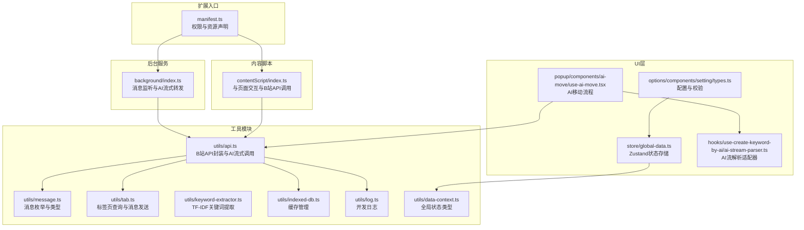
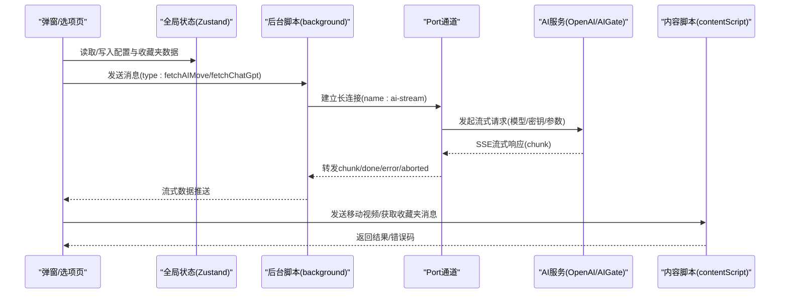
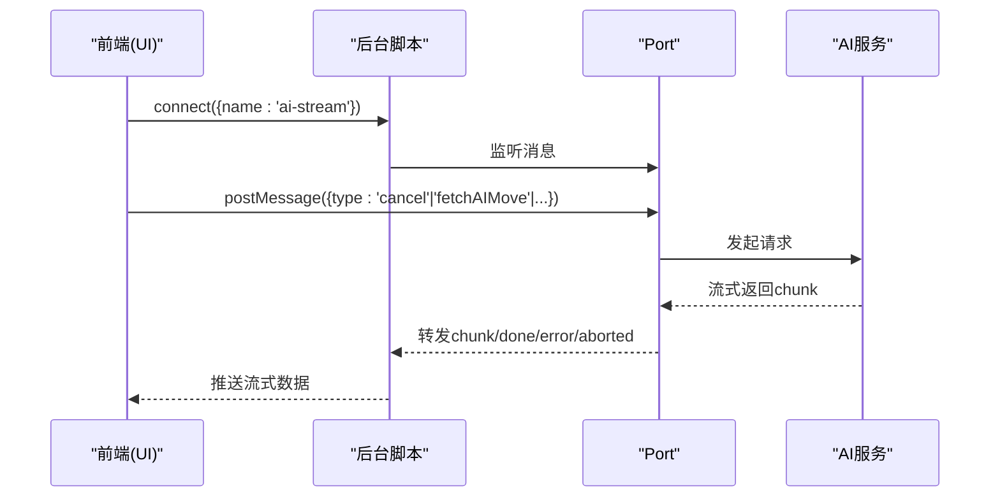
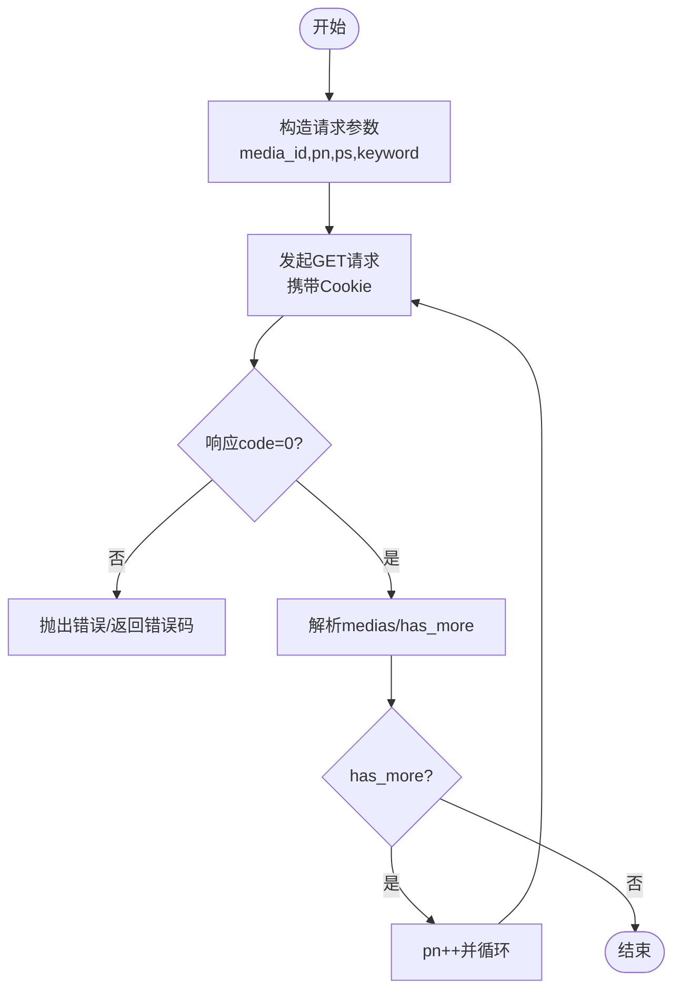
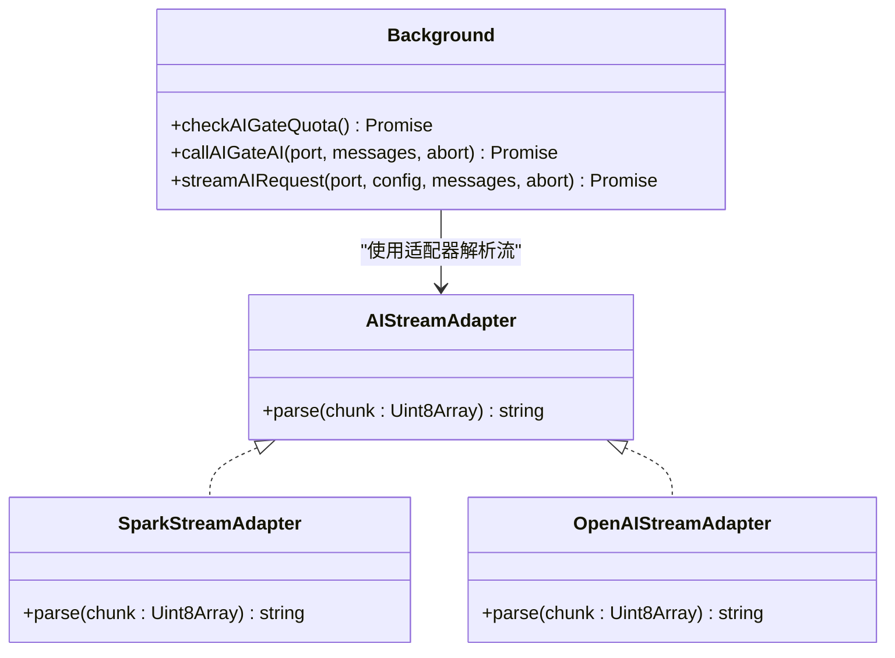
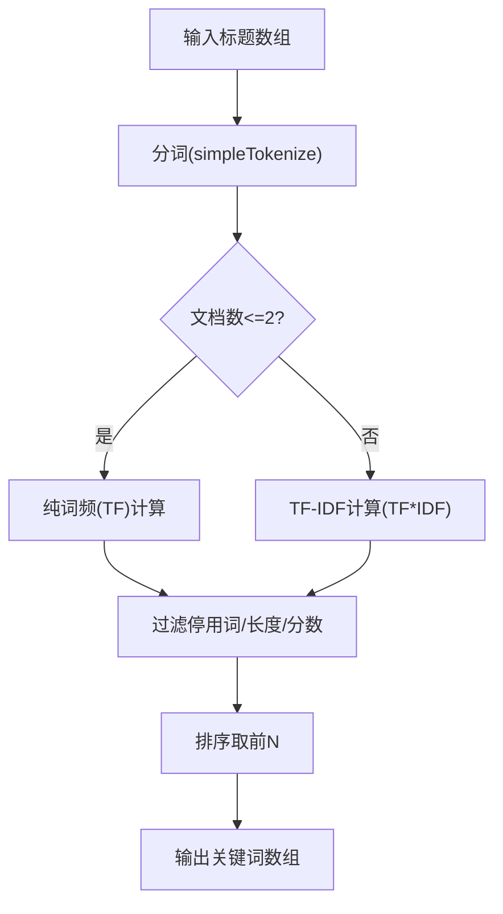
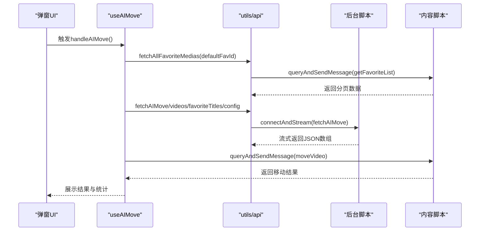
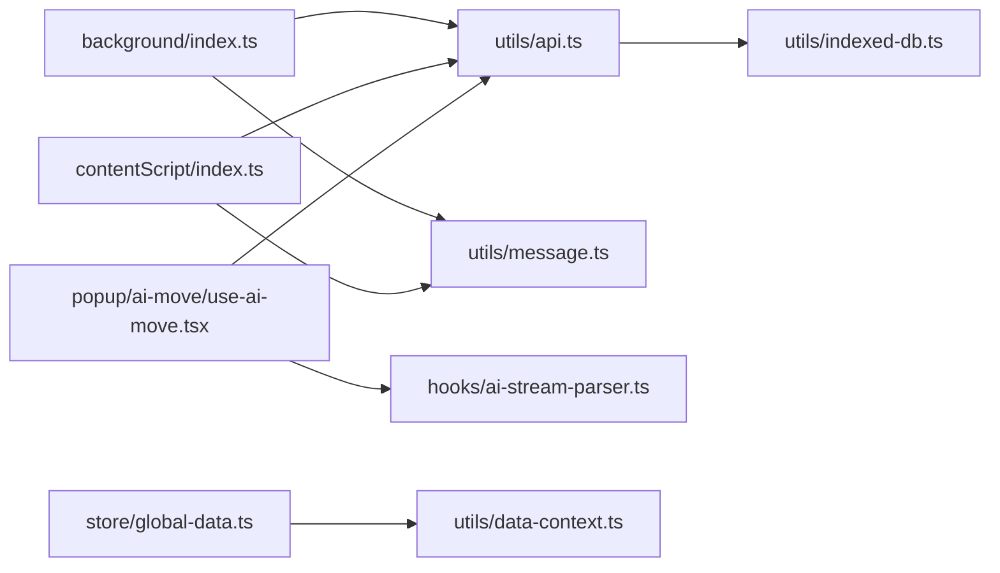

# API参考文档

<cite>
**本文档引用的文件**
- [manifest.ts](file://src/manifest.ts)
- [background/index.ts](file://src/background/index.ts)
- [contentScript/index.ts](file://src/contentScript/index.ts)
- [utils/api.ts](file://src/utils/api.ts)
- [utils/message.ts](file://src/utils/message.ts)
- [utils/tab.ts](file://src/utils/tab.ts)
- [utils/keyword-extractor.ts](file://src/utils/keyword-extractor.ts)
- [hooks/use-create-keyword-by-ai/ai-stream-parser.ts](file://src/hooks/use-create-keyword-by-ai/ai-stream-parser.ts)
- [popup/components/ai-move/use-ai-move.tsx](file://src/popup/components/ai-move/use-ai-move.tsx)
- [store/global-data.ts](file://src/store/global-data.ts)
- [options/components/setting/types.ts](file://src/options/components/setting/types.ts)
- [utils/indexed-db.ts](file://src/utils/indexed-db.ts)
- [utils/log.ts](file://src/utils/log.ts)
- [utils/data-context.ts](file://src/utils/data-context.ts)
- [package.json](file://package.json)
</cite>

## 目录
1. [简介](#简介)
2. [项目结构](#项目结构)
3. [核心组件](#核心组件)
4. [架构总览](#架构总览)
5. [详细组件分析](#详细组件分析)
6. [依赖关系分析](#依赖关系分析)
7. [性能考虑](#性能考虑)
8. [故障排除指南](#故障排除指南)
9. [结论](#结论)
10. [附录](#附录)

## 简介
本API参考文档面向B站收藏夹整理工具的开发者与使用者，系统性梳理以下方面：
- Chrome扩展API的使用：权限声明、生命周期、消息通信（runtime、tabs、storage、sidePanel）等
- Bilibili官方API接口规范：收藏夹列表、收藏夹详情、移动视频等接口的请求参数、响应格式、错误码与速率限制建议
- AI服务API集成：OpenAI、AIGate等多家服务提供商的接口差异、流式响应解析与适配器机制
- 内部工具函数API：消息通信、关键词提取、数据分析与缓存等工具函数的参数与返回值
- 完整的代码示例路径与错误处理指南

## 项目结构
该项目采用MV3扩展架构，包含后台脚本、内容脚本、弹窗与侧边栏界面、选项页以及大量工具模块与Hooks。

**图表来源**
- [manifest.ts:1-55](file://src/manifest.ts#L1-L55)
- [background/index.ts:1-393](file://src/background/index.ts#L1-L393)
- [contentScript/index.ts:1-55](file://src/contentScript/index.ts#L1-L55)
- [utils/api.ts:1-339](file://src/utils/api.ts#L1-L339)
- [utils/message.ts:1-20](file://src/utils/message.ts#L1-L20)
- [utils/tab.ts:1-93](file://src/utils/tab.ts#L1-L93)
- [utils/keyword-extractor.ts:1-197](file://src/utils/keyword-extractor.ts#L1-L197)
- [utils/indexed-db.ts:1-128](file://src/utils/indexed-db.ts#L1-L128)
- [utils/log.ts:1-8](file://src/utils/log.ts#L1-L8)
- [utils/data-context.ts:1-34](file://src/utils/data-context.ts#L1-L34)
- [popup/components/ai-move/use-ai-move.tsx:1-393](file://src/popup/components/ai-move/use-ai-move.tsx#L1-L393)
- [options/components/setting/types.ts:1-99](file://src/options/components/setting/types.ts#L1-L99)
- [store/global-data.ts:1-28](file://src/store/global-data.ts#L1-L28)
- [hooks/use-create-keyword-by-ai/ai-stream-parser.ts:1-278](file://src/hooks/use-create-keyword-by-ai/ai-stream-parser.ts#L1-L278)

**章节来源**
- [manifest.ts:1-55](file://src/manifest.ts#L1-L55)
- [package.json:1-91](file://package.json#L1-L91)

## 核心组件
- 扩展清单与权限：声明storage、tabs、sidePanel权限及对OpenAI、讯飞星火、AIGate等主机权限
- 后台脚本：监听端口消息、构建AI请求、处理SSE流式响应、配额检查与取消控制
- 内容脚本：与页面交互，转发收藏夹列表、移动视频等请求
- 工具模块：统一封装B站API、消息通信、关键词提取、IndexedDB缓存、日志与数据上下文类型
- UI层：弹窗AI移动流程、选项页配置校验、全局状态存储

**章节来源**
- [manifest.ts:39-46](file://src/manifest.ts#L39-L46)
- [background/index.ts:315-392](file://src/background/index.ts#L315-L392)
- [contentScript/index.ts:4-54](file://src/contentScript/index.ts#L4-L54)
- [utils/api.ts:107-329](file://src/utils/api.ts#L107-L329)
- [utils/message.ts:1-20](file://src/utils/message.ts#L1-L20)
- [utils/keyword-extractor.ts:133-197](file://src/utils/keyword-extractor.ts#L133-L197)
- [utils/indexed-db.ts:15-128](file://src/utils/indexed-db.ts#L15-L128)
- [utils/log.ts:1-8](file://src/utils/log.ts#L1-L8)
- [utils/data-context.ts:1-34](file://src/utils/data-context.ts#L1-L34)
- [popup/components/ai-move/use-ai-move.tsx:23-393](file://src/popup/components/ai-move/use-ai-move.tsx#L23-L393)
- [options/components/setting/types.ts:30-99](file://src/options/components/setting/types.ts#L30-L99)
- [store/global-data.ts:6-28](file://src/store/global-data.ts#L6-L28)

## 架构总览
扩展采用“后台脚本+内容脚本+UI层”的三层架构。后台脚本负责与外部AI服务通信与配额管理；内容脚本负责与B站页面交互；UI层通过Zustand状态管理与工具模块协作完成业务流程。

**图表来源**
- [background/index.ts:315-392](file://src/background/index.ts#L315-L392)
- [utils/api.ts:176-232](file://src/utils/api.ts#L176-L232)
- [contentScript/index.ts:4-54](file://src/contentScript/index.ts#L4-L54)
- [popup/components/ai-move/use-ai-move.tsx:90-169](file://src/popup/components/ai-move/use-ai-move.tsx#L90-L169)

## 详细组件分析

### Chrome扩展API与生命周期
- 权限与主机权限
  - storage：持久化配置与设备ID
  - tabs：查询B站标签页并发送消息
  - sidePanel：侧边栏入口
  - host_permissions：允许访问OpenAI、讯飞星火、AIGate等主机
- 生命周期
  - service worker：常驻后台，监听端口与消息
  - content_scripts：注入到B站页面，与页面交互
  - options_ui：选项页
  - side_panel：侧边栏

**章节来源**
- [manifest.ts:39-54](file://src/manifest.ts#L39-L54)
- [background/index.ts:315-392](file://src/background/index.ts#L315-L392)
- [contentScript/index.ts:4-54](file://src/contentScript/index.ts#L4-L54)

### 消息通信API
- 消息枚举与类型
  - getCookie、moveVideo、getFavoriteList、getAllFavoriteFlag
  - fetchChatGpt、fetchAIMove、checkAIGateQuota、callAIGateAI
- 端口流式通信
  - 后台建立名为“ai-stream”的端口，支持取消、done、error、aborted状态
  - 前端通过chrome.runtime.connect建立长连接，读取ReadableStream

**图表来源**
- [utils/message.ts:1-20](file://src/utils/message.ts#L1-L20)
- [background/index.ts:315-392](file://src/background/index.ts#L315-L392)
- [utils/api.ts:176-232](file://src/utils/api.ts#L176-L232)

**章节来源**
- [utils/message.ts:1-20](file://src/utils/message.ts#L1-L20)
- [utils/api.ts:176-232](file://src/utils/api.ts#L176-L232)
- [background/index.ts:315-392](file://src/background/index.ts#L315-L392)

### Bilibili官方API规范
- 收藏夹列表
  - 方法：GET
  - URL：https://api.bilibili.com/x/v3/fav/resource/list
  - 参数：media_id、pn、ps、keyword（可选）、order=mtime、tid=0、platform=web、web_location=333.1387
  - 凭据：credentials: include（携带Cookie）
  - 响应：BResponse<T>，包含info、medias、has_more等
- 全部收藏夹
  - 方法：GET
  - URL：https://api.bilibili.com/x/v3/fav/folder/created/list-all
  - 参数：up_mid=DedeUserID
  - 响应：BResponse<{ list: DataContextType['favoriteData'] }>
- 移动视频
  - 方法：POST
  - URL：https://api.bilibili.com/x/v3/fav/resource/move
  - 表单参数：resources、mid、platform=web、tar_media_id、src_media_id、csrf
  - 响应：BResponse<any>

**图表来源**
- [utils/api.ts:117-130](file://src/utils/api.ts#L117-L130)
- [utils/api.ts:137-145](file://src/utils/api.ts#L137-L145)
- [utils/api.ts:155-174](file://src/utils/api.ts#L155-L174)

**章节来源**
- [utils/api.ts:117-174](file://src/utils/api.ts#L117-L174)

### AI服务API集成
- OpenAI兼容模型
  - 使用openai库，支持baseURL、apiKey、model、extraParams
  - 流式响应通过chat.completions.create(stream=true)逐chunk推送
- AIGate免费额度
  - 配额检查：POST /api/trpc/ai.getQuotaInfo，返回daily/rpm配额
  - 流式对话：POST /api/ai/chat/stream，SSE响应，需解析"data:"行
  - 取消控制：AbortController，支持中途取消
- 流式解析适配器
  - SparkStreamAdapter：解析星火模型的choices.delta.content
  - OpenAIStreamAdapter：解析OpenAI兼容模型的choices.delta.content
  - createStreamAdapter：按配置选择适配器

**图表来源**
- [hooks/use-create-keyword-by-ai/ai-stream-parser.ts:26-93](file://src/hooks/use-create-keyword-by-ai/ai-stream-parser.ts#L26-L93)
- [background/index.ts:93-192](file://src/background/index.ts#L93-L192)
- [background/index.ts:194-247](file://src/background/index.ts#L194-L247)

**章节来源**
- [background/index.ts:93-192](file://src/background/index.ts#L93-L192)
- [background/index.ts:194-247](file://src/background/index.ts#L194-L247)
- [hooks/use-create-keyword-by-ai/ai-stream-parser.ts:26-93](file://src/hooks/use-create-keyword-by-ai/ai-stream-parser.ts#L26-L93)

### 内部工具函数API
- 消息通信
  - queryAndSendMessage：查询B站标签页并发送消息，带超时
  - sendMessageToTab：向指定标签页发送消息并返回Promise
  - queryBilibiliTabs：查询B站相关标签页
- 关键词提取
  - extractKeywords：TF-IDF关键词提取，支持过滤停用词、最小长度、最低分数
  - quickExtractKeywords：快速提取关键词字符串数组
- 数据缓存
  - IndexedDBManager：初始化、get/set/delete/clear、过期检查
- 日志与状态
  - log：开发环境日志
  - DataContextType：全局状态类型定义
  - Zustand + chromeStorageMiddleware：持久化状态

**图表来源**
- [utils/keyword-extractor.ts:133-197](file://src/utils/keyword-extractor.ts#L133-L197)

**章节来源**
- [utils/tab.ts:37-82](file://src/utils/tab.ts#L37-L82)
- [utils/keyword-extractor.ts:133-197](file://src/utils/keyword-extractor.ts#L133-L197)
- [utils/indexed-db.ts:15-128](file://src/utils/indexed-db.ts#L15-L128)
- [utils/log.ts:1-8](file://src/utils/log.ts#L1-L8)
- [utils/data-context.ts:1-34](file://src/utils/data-context.ts#L1-L34)
- [store/global-data.ts:6-28](file://src/store/global-data.ts#L6-L28)

### 弹窗AI移动流程
- 流程概览
  - 校验配置（自定义或AIGate免费额度）
  - 获取默认收藏夹全部视频（分页）
  - AI分析生成移动结果
  - 逐条执行移动并统计结果
  - 支持取消与错误提示

**图表来源**
- [popup/components/ai-move/use-ai-move.tsx:214-307](file://src/popup/components/ai-move/use-ai-move.tsx#L214-L307)
- [utils/api.ts:285-319](file://src/utils/api.ts#L285-L319)
- [utils/api.ts:249-263](file://src/utils/api.ts#L249-L263)
- [contentScript/index.ts:12-37](file://src/contentScript/index.ts#L12-L37)

**章节来源**
- [popup/components/ai-move/use-ai-move.tsx:214-307](file://src/popup/components/ai-move/use-ai-move.tsx#L214-L307)
- [utils/api.ts:285-319](file://src/utils/api.ts#L285-L319)
- [utils/api.ts:249-263](file://src/utils/api.ts#L249-L263)
- [contentScript/index.ts:12-37](file://src/contentScript/index.ts#L12-L37)

## 依赖关系分析
- 外部依赖
  - openai：OpenAI SDK
  - uuid：唯一ID生成
  - zustand/immer：状态管理
  - echarts：可视化图表
- 内部模块耦合
  - background依赖utils/api与utils/message
  - contentScript依赖utils/api与utils/message
  - UI层依赖store/global-data与utils/api
  - AI解析适配器独立于具体服务，便于扩展

**图表来源**
- [background/index.ts:1-393](file://src/background/index.ts#L1-L393)
- [contentScript/index.ts:1-55](file://src/contentScript/index.ts#L1-L55)
- [utils/api.ts:1-339](file://src/utils/api.ts#L1-L339)
- [utils/message.ts:1-20](file://src/utils/message.ts#L1-L20)
- [hooks/use-create-keyword-by-ai/ai-stream-parser.ts:1-278](file://src/hooks/use-create-keyword-by-ai/ai-stream-parser.ts#L1-L278)
- [store/global-data.ts:1-28](file://src/store/global-data.ts#L1-L28)
- [utils/data-context.ts:1-34](file://src/utils/data-context.ts#L1-L34)
- [utils/indexed-db.ts:1-128](file://src/utils/indexed-db.ts#L1-L128)

**章节来源**
- [package.json:29-58](file://package.json#L29-L58)
- [background/index.ts:1-393](file://src/background/index.ts#L1-L393)
- [contentScript/index.ts:1-55](file://src/contentScript/index.ts#L1-L55)
- [utils/api.ts:1-339](file://src/utils/api.ts#L1-L339)

## 性能考虑
- 分页拉取：fetchAllFavoriteMedias默认每页40条，避免一次性请求过大
- 缓存策略：IndexedDB缓存收藏夹数据，默认24小时过期，减少重复请求
- 流式处理：后台与前端均采用流式读取，降低内存占用
- 取消控制：AbortController确保用户取消后及时中断请求
- 请求节流：移动视频时sleep(100ms)，避免请求过快

**章节来源**
- [utils/api.ts:285-319](file://src/utils/api.ts#L285-L319)
- [utils/indexed-db.ts:115-123](file://src/utils/indexed-db.ts#L115-L123)
- [popup/components/ai-move/use-ai-move.tsx:196](file://src/popup/components/ai-move/use-ai-move.tsx#L196)

## 故障排除指南
- 消息超时
  - 现象：sendMessageToTab超时或端口关闭
  - 处理：检查标签页是否存在、消息类型是否正确、后台脚本是否正常运行
- Cookie缺失
  - 现象：getAllFavoriteFlag/getFavoriteList失败
  - 处理：确认已登录B站且扩展拥有tabs权限，检查document.cookie获取
- AI配额不足
  - 现象：AIGate配额检查返回remaining=0
  - 处理：切换自定义OpenAI配置或等待次日配额恢复
- 流式解析异常
  - 现象：SSE数据解析失败或chunk为空
  - 处理：检查适配器类型、网络状况、服务端响应格式
- 移动失败
  - 现象：返回错误码或移动异常
  - 处理：检查源收藏夹与目标收藏夹ID、CSRF与Cookie有效性

**章节来源**
- [utils/tab.ts:37-82](file://src/utils/tab.ts#L37-L82)
- [background/index.ts:27-91](file://src/background/index.ts#L27-L91)
- [hooks/use-create-keyword-by-ai/ai-stream-parser.ts:26-93](file://src/hooks/use-create-keyword-by-ai/ai-stream-parser.ts#L26-L93)
- [contentScript/index.ts:38-51](file://src/contentScript/index.ts#L38-L51)

## 结论
本扩展通过清晰的模块划分与完善的工具链，实现了从B站收藏夹数据获取、AI关键词与分类分析到自动化移动的完整闭环。其消息通信、流式解析与缓存策略为大规模数据处理提供了可靠保障。建议在生产环境中结合错误监控与配额告警进一步提升稳定性。

## 附录
- 配置模式与校验
  - custom模式：需提供key、baseUrl、model、adapter
  - free模式：需提供aigateUserId、aigateApiKeyId、model
- 全局状态字段
  - favoriteData、aiConfig、cookie、activeKey、defaultFavoriteId、keyword
- 设备ID
  - 通过chrome.storage.local生成并缓存deviceId，用于AIGate配额绑定

**章节来源**
- [options/components/setting/types.ts:30-99](file://src/options/components/setting/types.ts#L30-L99)
- [utils/data-context.ts:3-31](file://src/utils/data-context.ts#L3-L31)
- [utils/tab.ts:84-92](file://src/utils/tab.ts#L84-L92)