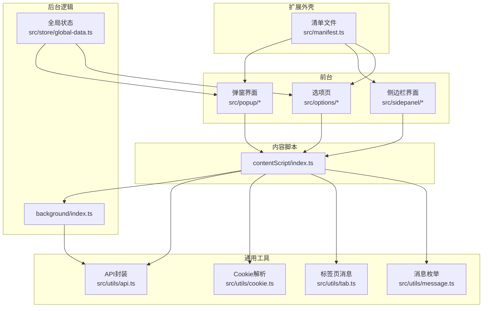
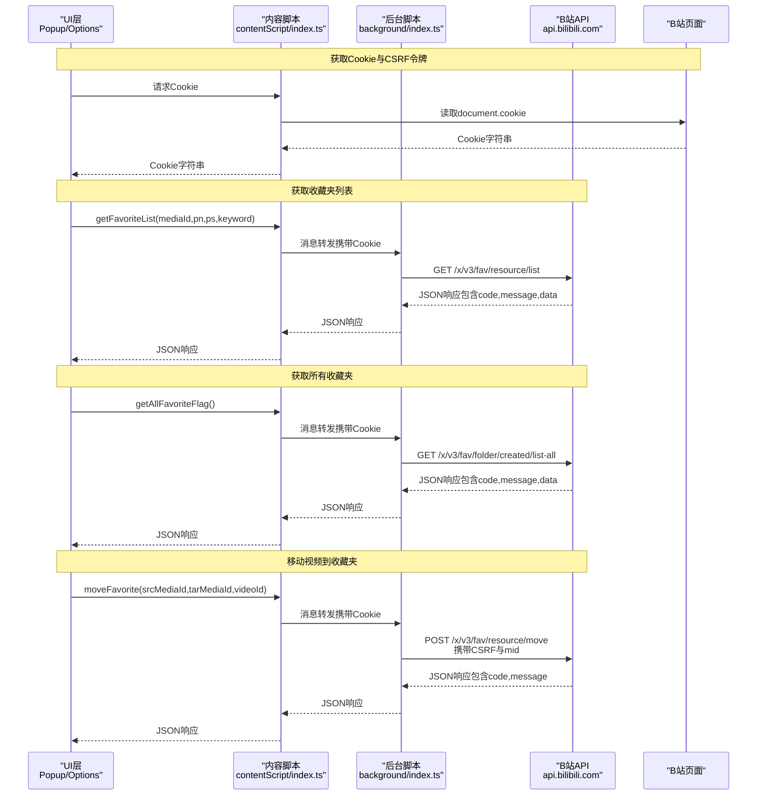
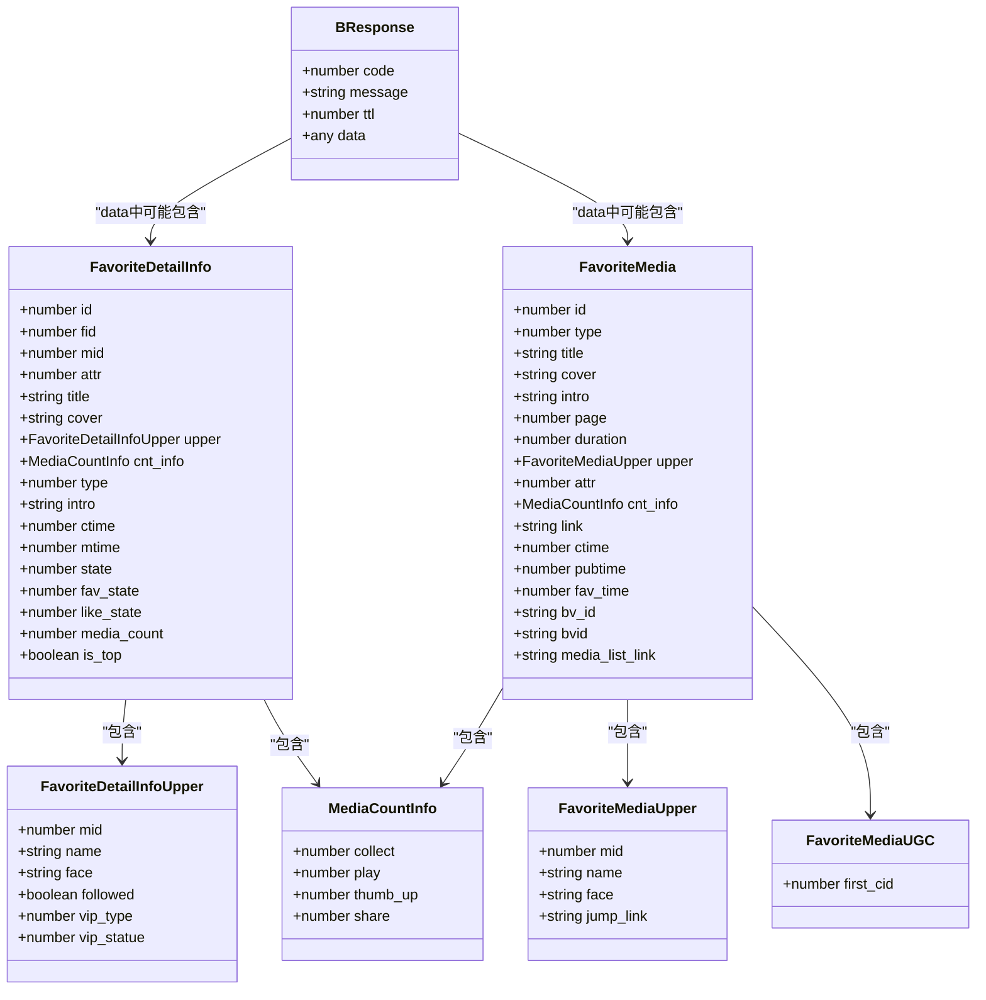
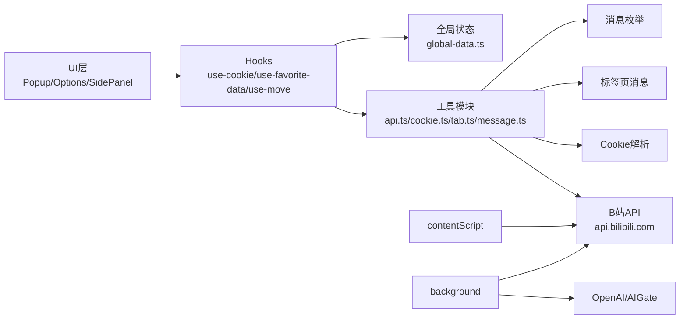

# B站官方API

<cite>
**本文引用的文件**
- [src/utils/api.ts](file://src/utils/api.ts)
- [src/utils/cookie.ts](file://src/utils/cookie.ts)
- [src/contentScript/index.ts](file://src/contentScript/index.ts)
- [src/utils/tab.ts](file://src/utils/tab.ts)
- [src/utils/message.ts](file://src/utils/message.ts)
- [src/hooks/use-cookie/index.ts](file://src/hooks/use-cookie/index.ts)
- [src/hooks/use-favorite-data/index.ts](file://src/hooks/use-favorite-data/index.ts)
- [src/hooks/use-move/index.tsx](file://src/hooks/use-move/index.tsx)
- [src/popup/components/move/index.tsx](file://src/popup/components/move/index.tsx)
- [src/popup/components/login-check/index.tsx](file://src/popup/components/login-check/index.tsx)
- [src/background/index.ts](file://src/background/index.ts)
- [src/manifest.ts](file://src/manifest.ts)
- [src/store/global-data.ts](file://src/store/global-data.ts)
- [src/utils/data-context.ts](file://src/utils/data-context.ts)
- [README.md](file://README.md)
</cite>

## 目录
1. [简介](#简介)
2. [项目结构](#项目结构)
3. [核心组件](#核心组件)
4. [架构总览](#架构总览)
5. [详细组件分析](#详细组件分析)
6. [依赖关系分析](#依赖关系分析)
7. [性能考量](#性能考量)
8. [故障排查指南](#故障排查指南)
9. [结论](#结论)
10. [附录](#附录)

## 简介
本文件面向使用B站官方API的开发者与使用者，系统性梳理收藏夹相关接口与数据模型，覆盖以下能力：
- 获取收藏夹列表（分页）
- 获取所有收藏夹
- 移动视频到收藏夹
- Cookie与CSRF令牌处理
- 用户身份校验流程
- 数据模型定义（FavoriteMedia、FavoriteDetailInfo等）
- 错误码与错误处理策略
- 调用示例与最佳实践

本项目以Chrome扩展形式运行，通过content script与页面交互，借助background脚本与B站官方API通信，并在UI层提供收藏夹分析与整理能力。

## 项目结构
项目采用“扩展三核”（popup/background/content script）+ 前端UI的组织方式，核心API调用集中在content script与utils模块中，通过消息通道与后台交互。

图示来源
- [src/manifest.ts:1-55](file://src/manifest.ts#L1-L55)
- [src/contentScript/index.ts:1-55](file://src/contentScript/index.ts#L1-L55)
- [src/background/index.ts:1-393](file://src/background/index.ts#L1-L393)
- [src/utils/api.ts:1-339](file://src/utils/api.ts#L1-L339)
- [src/utils/cookie.ts:1-13](file://src/utils/cookie.ts#L1-L13)
- [src/utils/tab.ts:1-93](file://src/utils/tab.ts#L1-L93)
- [src/utils/message.ts:1-20](file://src/utils/message.ts#L1-L20)
- [src/store/global-data.ts:1-28](file://src/store/global-data.ts#L1-L28)

章节来源
- [src/manifest.ts:1-55](file://src/manifest.ts#L1-L55)
- [README.md:1-188](file://README.md#L1-L188)

## 核心组件
- 内容脚本（content script）负责监听扩展消息、向页面注入Cookie、调用API并返回结果。
- 后台脚本（background）负责与B站官方API交互、处理CSRF、转发消息与流式AI通信。
- 工具模块（utils）封装API请求、Cookie解析、跨标签页消息传递与消息类型枚举。
- UI层（popup/option/sidepanel）通过hooks与store驱动业务流程，如收藏夹数据拉取、移动操作等。

章节来源
- [src/contentScript/index.ts:1-55](file://src/contentScript/index.ts#L1-L55)
- [src/background/index.ts:1-393](file://src/background/index.ts#L1-L393)
- [src/utils/api.ts:1-339](file://src/utils/api.ts#L1-L339)
- [src/utils/cookie.ts:1-13](file://src/utils/cookie.ts#L1-L13)
- [src/utils/tab.ts:1-93](file://src/utils/tab.ts#L1-L93)
- [src/utils/message.ts:1-20](file://src/utils/message.ts#L1-L20)
- [src/store/global-data.ts:1-28](file://src/store/global-data.ts#L1-L28)

## 架构总览
下面的序列图展示了收藏夹列表获取、所有收藏夹获取与移动视频的核心调用链路，以及Cookie与CSRF令牌的处理位置。

图示来源
- [src/contentScript/index.ts:1-55](file://src/contentScript/index.ts#L1-L55)
- [src/background/index.ts:1-393](file://src/background/index.ts#L1-L393)
- [src/utils/api.ts:108-174](file://src/utils/api.ts#L108-L174)
- [src/utils/cookie.ts:1-13](file://src/utils/cookie.ts#L1-L13)

## 详细组件分析

### 收藏夹相关API定义与调用
- 获取收藏夹列表（分页）
  - 方法：GET
  - 地址：/x/v3/fav/resource/list
  - 参数：
    - media_id：收藏夹ID
    - pn：页码
    - ps：每页数量
    - keyword：可选，按标题关键词过滤
    - order：mtime（按收藏时间排序）
    - tid：0（不按分区过滤）
    - platform：web
    - web_location：333.1387
  - 响应：BResponse结构，data包含info、medias、has_more、ttl
  - 实现参考：[src/utils/api.ts:117-130](file://src/utils/api.ts#L117-L130)

- 获取所有收藏夹
  - 方法：GET
  - 地址：/x/v3/fav/folder/created/list-all
  - 参数：
    - up_mid：来自Cookie中的DedeUserID
  - 响应：BResponse结构，data包含list（收藏夹列表）
  - 实现参考：[src/utils/api.ts:137-145](file://src/utils/api.ts#L137-L145)

- 移动视频到收藏夹
  - 方法：POST
  - 地址：/x/v3/fav/resource/move
  - 表单参数：
    - resources：视频ID与类型，形如"{videoId}:2"
    - mid：来自Cookie中的DedeUserID
    - platform：web
    - tar_media_id：目标收藏夹ID
    - src_media_id：源收藏夹ID
    - csrf：来自Cookie中的bili_jct
  - 响应：BResponse结构，包含code与message
  - 实现参考：[src/utils/api.ts:155-174](file://src/utils/api.ts#L155-L174)

- Cookie与CSRF令牌处理
  - Cookie解析：通过getCookieValue(name, cookies)从字符串中提取指定键值
  - 关键Cookie：
    - DedeUserID：用户ID，用于up_mid与mid
    - bili_jct：CSRF令牌，用于POST请求
  - 实现参考：[src/utils/cookie.ts:1-13](file://src/utils/cookie.ts#L1-L13)

- 用户身份验证
  - UI层通过useCookie在弹窗中请求页面Cookie，若DedeUserID为空则判定未登录
  - 实现参考：[src/hooks/use-cookie/index.ts:1-40](file://src/hooks/use-cookie/index.ts#L1-L40)，[src/popup/components/login-check/index.tsx:1-24](file://src/popup/components/login-check/index.tsx#L1-L24)

- 数据模型定义
  - BResponse<T>：统一响应结构，包含code、message、ttl、data
  - FavoriteDetailInfo：收藏夹详情，包含id、fid、mid、attr、title、cover、upper、cnt_info、type、intro、ctime、mtime、state、fav_state、like_state、media_count、is_top
  - FavoriteMedia：收藏夹媒体条目，包含id、type、title、cover、intro、page、duration、upper、attr、cnt_info、link、ctime、pubtime、fav_time、bv_id、bvid、media_list_link等
  - MediaCountInfo：播放量、点赞数、收藏数、分享数等聚合信息
  - FavoriteMediaUpper/FavoriteMediaUGC：UP主信息与UGC相关信息
  - 实现参考：[src/utils/api.ts:7-106](file://src/utils/api.ts#L7-L106)

- 分页获取全部视频
  - fetchAllFavoriteMedias会循环调用getFavoriteList，直到has_more为false，合并所有媒体并缓存
  - 实现参考：[src/utils/api.ts:285-319](file://src/utils/api.ts#L285-L319)

章节来源
- [src/utils/api.ts:7-106](file://src/utils/api.ts#L7-L106)
- [src/utils/api.ts:108-174](file://src/utils/api.ts#L108-L174)
- [src/utils/api.ts:137-145](file://src/utils/api.ts#L137-L145)
- [src/utils/api.ts:155-174](file://src/utils/api.ts#L155-L174)
- [src/utils/api.ts:285-319](file://src/utils/api.ts#L285-L319)
- [src/utils/cookie.ts:1-13](file://src/utils/cookie.ts#L1-L13)
- [src/hooks/use-cookie/index.ts:1-40](file://src/hooks/use-cookie/index.ts#L1-L40)
- [src/popup/components/login-check/index.tsx:1-24](file://src/popup/components/login-check/index.tsx#L1-L24)

### 调用流程与UI集成
- 获取所有收藏夹
  - UI通过useFavoriteData触发消息getAllFavoriteFlag，content script调用API并返回结果
  - 实现参考：[src/hooks/use-favorite-data/index.ts:1-64](file://src/hooks/use-favorite-data/index.ts#L1-L64)，[src/contentScript/index.ts:39-50](file://src/contentScript/index.ts#L39-L50)

- 移动视频
  - UI通过useMove触发消息moveVideo，content script调用API并返回结果
  - 实现参考：[src/hooks/use-move/index.tsx:1-161](file://src/hooks/use-move/index.tsx#L1-L161)，[src/contentScript/index.ts:12-23](file://src/contentScript/index.ts#L12-L23)，[src/popup/components/move/index.tsx:1-42](file://src/popup/components/move/index.tsx#L1-L42)

- Cookie与CSRF传递
  - content script在收到消息后，将document.cookie作为参数传给后台或直接用于构造POST请求体
  - 实现参考：[src/contentScript/index.ts:4-54](file://src/contentScript/index.ts#L4-L54)，[src/utils/api.ts:166-173](file://src/utils/api.ts#L166-L173)

章节来源
- [src/hooks/use-favorite-data/index.ts:1-64](file://src/hooks/use-favorite-data/index.ts#L1-L64)
- [src/contentScript/index.ts:12-54](file://src/contentScript/index.ts#L12-L54)
- [src/hooks/use-move/index.tsx:1-161](file://src/hooks/use-move/index.tsx#L1-L161)
- [src/popup/components/move/index.tsx:1-42](file://src/popup/components/move/index.tsx#L1-L42)

### 数据模型类图

图示来源
- [src/utils/api.ts:7-106](file://src/utils/api.ts#L7-L106)

## 依赖关系分析
- 组件耦合
  - content script与utils/api紧密耦合，负责发起HTTP请求与参数拼装
  - background与utils/api松耦合，通过消息通道协调
  - UI层通过hooks与store解耦，便于复用与测试
- 外部依赖
  - B站官方API：收藏夹列表、收藏夹列表（全部）、资源移动
  - OpenAI/AIGate：可选的AI关键词提取与分类（扩展能力）

图示来源
- [src/contentScript/index.ts:1-55](file://src/contentScript/index.ts#L1-L55)
- [src/background/index.ts:1-393](file://src/background/index.ts#L1-L393)
- [src/utils/api.ts:1-339](file://src/utils/api.ts#L1-L339)
- [src/utils/cookie.ts:1-13](file://src/utils/cookie.ts#L1-L13)
- [src/utils/tab.ts:1-93](file://src/utils/tab.ts#L1-L93)
- [src/utils/message.ts:1-20](file://src/utils/message.ts#L1-L20)
- [src/store/global-data.ts:1-28](file://src/store/global-data.ts#L1-L28)

章节来源
- [src/contentScript/index.ts:1-55](file://src/contentScript/index.ts#L1-L55)
- [src/background/index.ts:1-393](file://src/background/index.ts#L1-L393)
- [src/utils/api.ts:1-339](file://src/utils/api.ts#L1-L339)
- [src/utils/cookie.ts:1-13](file://src/utils/cookie.ts#L1-L13)
- [src/utils/tab.ts:1-93](file://src/utils/tab.ts#L1-L93)
- [src/utils/message.ts:1-20](file://src/utils/message.ts#L1-L20)
- [src/store/global-data.ts:1-28](file://src/store/global-data.ts#L1-L28)

## 性能考量
- 数据缓存
  - 分页获取全部视频时，使用IndexedDB缓存结果，默认缓存24小时，避免重复请求
  - 实现参考：[src/utils/api.ts:285-319](file://src/utils/api.ts#L285-L319)
- 并发控制
  - 移动视频时逐条发送消息，避免并发冲突；支持取消操作
  - 实现参考：[src/hooks/use-move/index.tsx:27-124](file://src/hooks/use-move/index.tsx#L27-L124)
- 超时与重试
  - 标签页消息发送设置默认超时10秒，出现异常及时抛错
  - 实现参考：[src/utils/tab.ts:37-82](file://src/utils/tab.ts#L37-L82)

## 故障排查指南
- 未登录/Cookie缺失
  - 现象：UI提示未登录
  - 处理：确保在B站页面打开且已登录；刷新页面后重试
  - 实现参考：[src/hooks/use-cookie/index.ts:12-34](file://src/hooks/use-cookie/index.ts#L12-L34)，[src/popup/components/login-check/index.tsx:9-21](file://src/popup/components/login-check/index.tsx#L9-L21)

- CSRF校验失败
  - 现象：POST移动视频返回错误
  - 处理：确认bili_jct存在且与DedeUserID匹配；检查Cookie是否来自正确域名
  - 实现参考：[src/utils/api.ts:166-173](file://src/utils/api.ts#L166-L173)，[src/utils/cookie.ts:1-13](file://src/utils/cookie.ts#L1-L13)

- 网络异常/超时
  - 现象：消息发送超时或无B站标签页
  - 处理：检查B站页面是否打开；增大超时或重试；查看控制台错误
  - 实现参考：[src/utils/tab.ts:65-82](file://src/utils/tab.ts#L65-L82)

- 权限不足/接口限流
  - 现象：响应code非0或message提示受限
  - 处理：降低请求频率；检查账号状态；必要时更换网络环境
  - 实现参考：[src/utils/api.ts:304-306](file://src/utils/api.ts#L304-L306)

- 移动操作失败
  - 现象：移动后未生效或报错
  - 处理：确认srcMediaId与tarMediaId有效；检查视频ID是否存在；查看后台日志
  - 实现参考：[src/contentScript/index.ts:12-23](file://src/contentScript/index.ts#L12-L23)

## 结论
本项目以清晰的职责划分与消息驱动架构，实现了对B站收藏夹API的稳定调用。通过Cookie与CSRF令牌的规范处理、统一的响应模型与缓存策略，兼顾了易用性与性能。建议在生产环境中：
- 明确错误码与message的语义，统一错误提示
- 增加重试与退避策略，应对临时限流
- 对关键操作增加幂等性保障（如重复移动同一视频）

## 附录

### API定义总览
- 获取收藏夹列表（分页）
  - 方法：GET
  - 路径：/x/v3/fav/resource/list
  - 参数：media_id、pn、ps、keyword（可选）、order、tid、platform、web_location
  - 响应：BResponse<{ info, medias, has_more, ttl }>
  - 实现参考：[src/utils/api.ts:117-130](file://src/utils/api.ts#L117-L130)

- 获取所有收藏夹
  - 方法：GET
  - 路径：/x/v3/fav/folder/created/list-all
  - 参数：up_mid（来自Cookie中的DedeUserID）
  - 响应：BResponse<{ list }>
  - 实现参考：[src/utils/api.ts:137-145](file://src/utils/api.ts#L137-L145)

- 移动视频到收藏夹
  - 方法：POST
  - 路径：/x/v3/fav/resource/move
  - 表单参数：resources、mid、platform、tar_media_id、src_media_id、csrf
  - 响应：BResponse<{ code, message }>
  - 实现参考：[src/utils/api.ts:155-174](file://src/utils/api.ts#L155-L174)

### 数据模型字段说明
- BResponse
  - code：业务状态码（0表示成功）
  - message：描述信息
  - ttl：时间至失效单位（秒）
  - data：具体数据对象

- FavoriteDetailInfo
  - id/fid/mid：标识
  - title/cover/intro/type：基础信息
  - upper：UP主信息
  - cnt_info：播放/点赞/收藏/分享统计
  - ctime/mtime/state/fav_state/like_state/media_count/is_top：时间与状态

- FavoriteMedia
  - id/type/title/cover/intro/page/duration/link/ctime/pubtime/fav_time/bv_id/bvid/media_list_link：媒体元数据
  - upper：UP主信息
  - cnt_info：播放/点赞/收藏/分享统计
  - ugc：UGC相关信息（如first_cid）

- MediaCountInfo
  - collect/play/thumb_up/share：收藏/播放/点赞/分享计数

章节来源
- [src/utils/api.ts:7-106](file://src/utils/api.ts#L7-L106)
- [src/utils/api.ts:108-174](file://src/utils/api.ts#L108-L174)