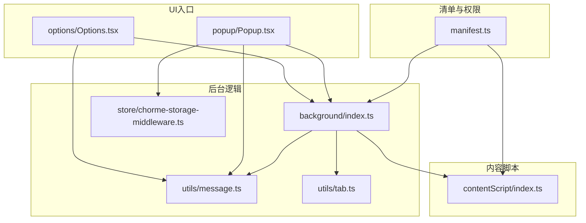
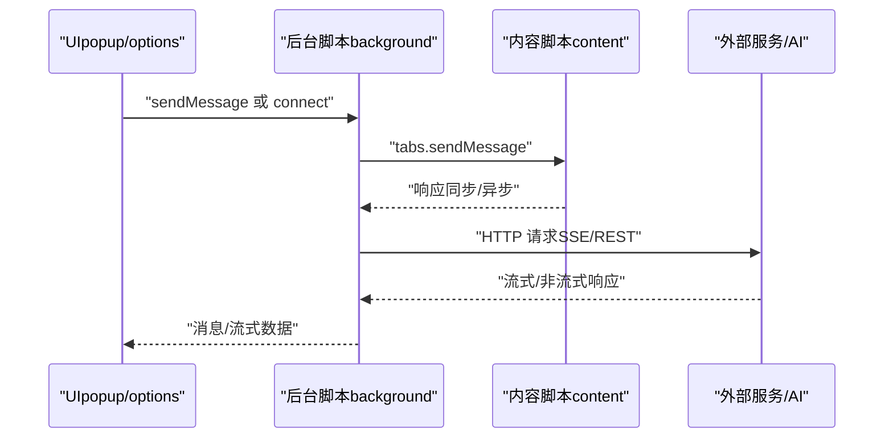
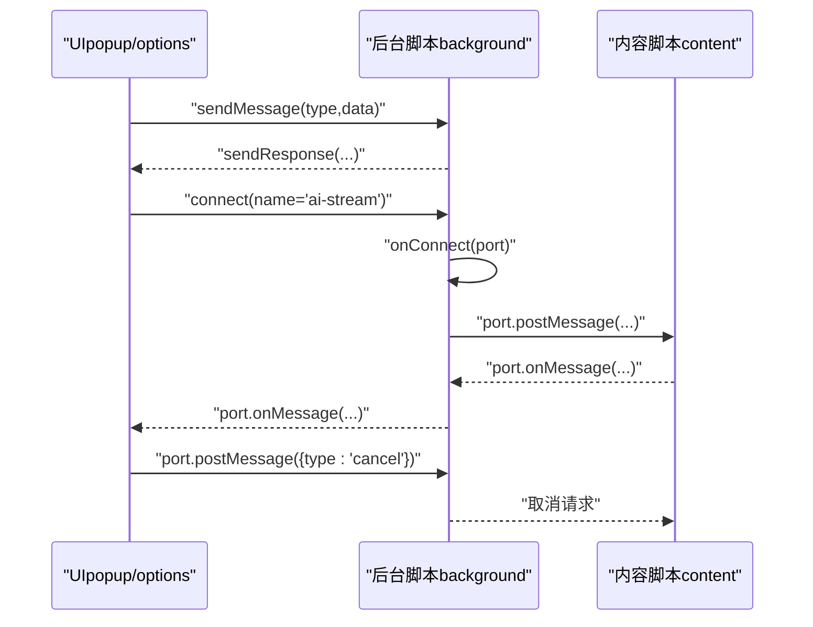
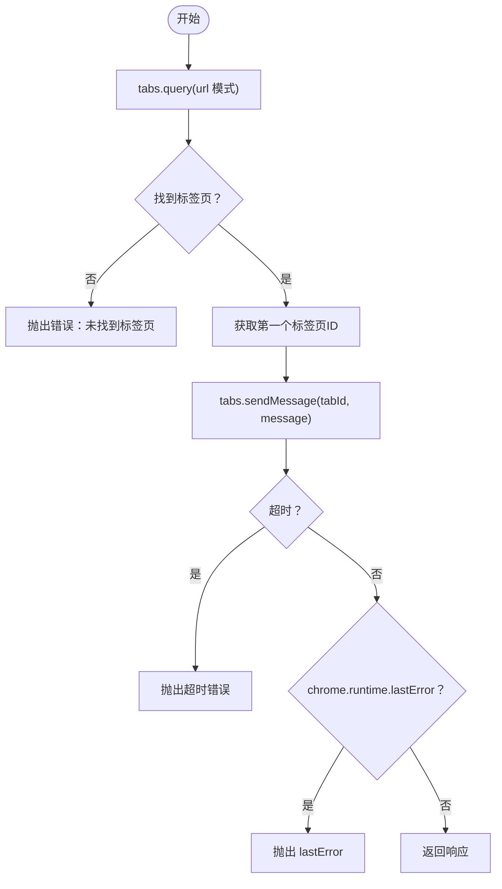
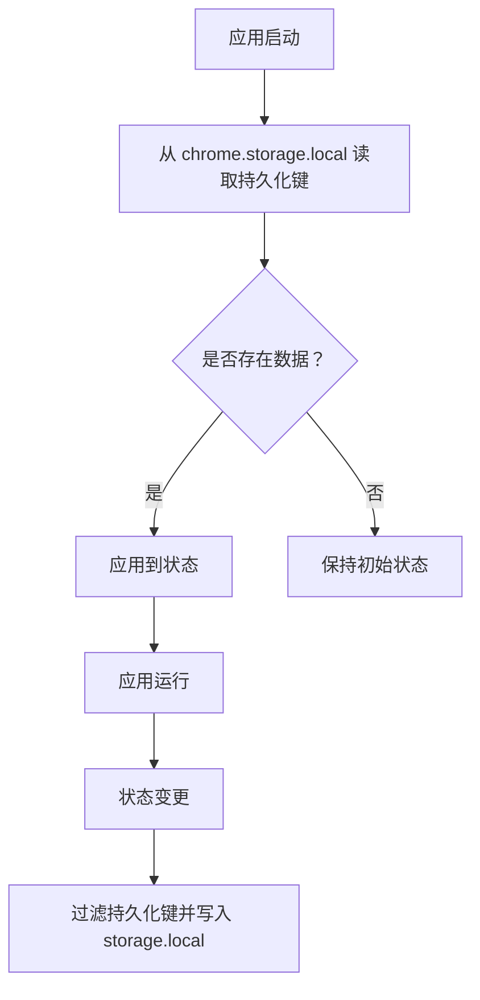
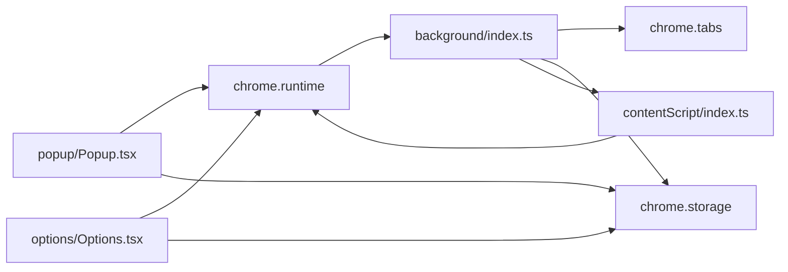

# Chrome扩展API

<cite>
**本文引用的文件**
- [manifest.ts](file://src/manifest.ts)
- [background/index.ts](file://src/background/index.ts)
- [contentScript/index.ts](file://src/contentScript/index.ts)
- [utils/message.ts](file://src/utils/message.ts)
- [utils/api.ts](file://src/utils/api.ts)
- [utils/tab.ts](file://src/utils/tab.ts)
- [store/chorme-storage-middleware.ts](file://src/store/chorme-storage-middleware.ts)
- [global.d.ts](file://src/global.d.ts)
- [package.json](file://package.json)
- [popup/Popup.tsx](file://src/popup/Popup.tsx)
- [options/Options.tsx](file://src/options/Options.tsx)
- [popup/components/ai-move/index.tsx](file://src/popup/components/ai-move/index.tsx)
- [popup/components/auto-create-keyword/index.tsx](file://src/popup/components/auto-create-keyword/index.tsx)
- [utils/log.ts](file://src/utils/log.ts)
</cite>

## 目录
1. [简介](#简介)
2. [项目结构](#项目结构)
3. [核心组件](#核心组件)
4. [架构总览](#架构总览)
5. [详细组件分析](#详细组件分析)
6. [依赖关系分析](#依赖关系分析)
7. [性能考虑](#性能考虑)
8. [故障排查指南](#故障排查指南)
9. [结论](#结论)
10. [附录](#附录)

## 简介
本文件系统性梳理该Chrome扩展的API使用与架构设计，重点覆盖以下方面：
- 扩展核心API：chrome.runtime、chrome.tabs、chrome.storage、chrome.action、chrome.sidePanel、chrome.webNavigation等
- 消息通信机制：runtime.sendMessage、runtime.connect、runtime.onMessage、runtime.onConnect及content script间通信
- 权限管理：manifest.json中权限声明与host_permissions、运行时权限检查思路
- 生命周期管理：后台脚本启动、页面加载、卸载时机处理
- 实战示例与最佳实践：错误处理、超时控制、流式传输、状态持久化、性能优化

## 项目结构
该项目采用基于功能模块的组织方式，核心入口与API使用集中在以下文件：
- 清单与权限：src/manifest.ts
- 后台脚本：src/background/index.ts
- 内容脚本：src/contentScript/index.ts
- 通用消息定义：src/utils/message.ts
- 业务API封装：src/utils/api.ts
- 标签页工具：src/utils/tab.ts
- 存储中间件：src/store/chorme-storage-middleware.ts
- UI入口：src/popup/Popup.tsx、src/options/Options.tsx
- 组件与交互：src/popup/components/*、src/options/components/*

图表来源
- [manifest.ts:1-55](file://src/manifest.ts#L1-L55)
- [background/index.ts:1-393](file://src/background/index.ts#L1-L393)
- [contentScript/index.ts:1-55](file://src/contentScript/index.ts#L1-L55)
- [utils/message.ts:1-20](file://src/utils/message.ts#L1-L20)
- [utils/tab.ts:1-93](file://src/utils/tab.ts#L1-L93)
- [store/chorme-storage-middleware.ts:1-63](file://src/store/chorme-storage-middleware.ts#L1-L63)
- [popup/Popup.tsx:1-80](file://src/popup/Popup.tsx#L1-L80)
- [options/Options.tsx:1-91](file://src/options/Options.tsx#L1-L91)

章节来源
- [manifest.ts:1-55](file://src/manifest.ts#L1-L55)
- [package.json:1-91](file://package.json#L1-L91)

## 核心组件
- 清单与权限：定义扩展元信息、图标、action、background、content_scripts、web_accessible_resources、permissions、host_permissions、options_ui、side_panel等
- 后台脚本：负责AI流式对话、配额检查、与内容脚本建立长连接、与外部服务通信
- 内容脚本：监听来自popup/options的消息，执行页面级操作（如读取cookie、调用B站API）
- 通用消息：统一消息类型枚举与消息结构
- 业务API：封装chrome.runtime.connect、chrome.tabs.sendMessage、chrome.storage.local等API
- 标签页工具：封装chrome.tabs.query、chrome.tabs.sendMessage、超时与lastError处理
- 存储中间件：基于chrome.storage.local的状态持久化

章节来源
- [manifest.ts:8-54](file://src/manifest.ts#L8-L54)
- [background/index.ts:315-392](file://src/background/index.ts#L315-L392)
- [contentScript/index.ts:4-54](file://src/contentScript/index.ts#L4-L54)
- [utils/message.ts:1-20](file://src/utils/message.ts#L1-L20)
- [utils/api.ts:176-232](file://src/utils/api.ts#L176-L232)
- [utils/tab.ts:37-82](file://src/utils/tab.ts#L37-L82)
- [store/chorme-storage-middleware.ts:8-58](file://src/store/chorme-storage-middleware.ts#L8-L58)

## 架构总览
扩展采用“UI层（popup/options）—后台脚本（background）—内容脚本（content）—外部服务”的分层架构。UI层通过chrome.runtime.sendMessage或chrome.runtime.connect与后台通信；后台脚本通过chrome.tabs.sendMessage与内容脚本通信；后台脚本再与外部AI服务或B站API交互。

图表来源
- [background/index.ts:315-392](file://src/background/index.ts#L315-L392)
- [contentScript/index.ts:4-54](file://src/contentScript/index.ts#L4-L54)
- [utils/api.ts:176-232](file://src/utils/api.ts#L176-L232)

## 详细组件分析

### chrome.runtime 消息通信
- runtime.sendMessage：UI层向后台脚本发送一次性消息，后台脚本在onMessage中处理并返回响应
- runtime.connect：UI层建立长连接，后台脚本在onConnect中监听，支持流式数据传输与取消
- runtime.onMessage：内容脚本监听来自后台或UI的消息，执行页面级操作
- runtime.onConnect：后台脚本监听来自UI的长连接，建立双向流式通道

图表来源
- [background/index.ts:315-392](file://src/background/index.ts#L315-L392)
- [contentScript/index.ts:4-54](file://src/contentScript/index.ts#L4-L54)
- [utils/api.ts:176-232](file://src/utils/api.ts#L176-L232)
- [utils/message.ts:1-20](file://src/utils/message.ts#L1-L20)

章节来源
- [background/index.ts:315-392](file://src/background/index.ts#L315-L392)
- [contentScript/index.ts:4-54](file://src/contentScript/index.ts#L4-L54)
- [utils/api.ts:176-232](file://src/utils/api.ts#L176-L232)
- [utils/message.ts:1-20](file://src/utils/message.ts#L1-L20)

### chrome.tabs 与页面交互
- tabs.query：按URL模式查询B站相关标签页
- tabs.sendMessage：向内容脚本发送消息并等待响应，内置超时与lastError处理
- tabs.create：在选项页中打开新标签页（如跳转到关键字管理）

图表来源
- [utils/tab.ts:37-82](file://src/utils/tab.ts#L37-L82)

章节来源
- [utils/tab.ts:26-82](file://src/utils/tab.ts#L26-L82)
- [popup/components/auto-create-keyword/index.tsx:5-10](file://src/popup/components/auto-create-keyword/index.tsx#L5-L10)

### chrome.storage 与状态持久化
- storage.local.get/set：读取/写入扩展本地存储
- zustand中间件：自动从storage.hydrate初始化状态，并在每次setState时持久化指定键

图表来源
- [store/chorme-storage-middleware.ts:8-58](file://src/store/chorme-storage-middleware.ts#L8-L58)

章节来源
- [store/chorme-storage-middleware.ts:8-58](file://src/store/chorme-storage-middleware.ts#L8-L58)

### 权限与清单（manifest.json）
- permissions：声明storage、tabs、sidePanel等权限
- host_permissions：声明对外部AI服务（如OpenAI、讯飞星火）的访问域
- background：service_worker类型，模块化入口
- content_scripts：匹配B站域名，注入内容脚本
- action、side_panel、options_ui：定义弹出页、侧边栏与选项页

章节来源
- [manifest.ts:8-54](file://src/manifest.ts#L8-L54)

### 生命周期管理
- 后台脚本启动：由清单中background.service_worker触发，常驻内存
- 页面加载：content_scripts按matches条件自动注入
- 卸载/断连：onDisconnect监听端口断开，及时取消正在进行的请求

章节来源
- [manifest.ts:23-32](file://src/manifest.ts#L23-L32)
- [background/index.ts:384-391](file://src/background/index.ts#L384-L391)

### UI与扩展交互
- popup/Popup.tsx：弹出面板入口，包含收藏夹、关键字、动作按钮等
- options/Options.tsx：选项页入口，包含设置、关键字管理、拖拽排序、分析等
- 组件通过chrome.runtime.getURL打开options.html，或通过chrome.tabs.create跳转

章节来源
- [popup/Popup.tsx:18-20](file://src/popup/Popup.tsx#L18-L20)
- [options/Options.tsx:12-87](file://src/options/Options.tsx#L12-L87)
- [popup/components/auto-create-keyword/index.tsx:5-10](file://src/popup/components/auto-create-keyword/index.tsx#L5-L10)

## 依赖关系分析
- UI层依赖：chrome.runtime（消息/连接）、chrome.action（弹出页）、chrome.sidePanel（侧边栏）、chrome.storage（持久化）
- 后台脚本依赖：chrome.runtime（连接/消息）、chrome.tabs（跨标签通信）、外部AI服务（SSE/REST）
- 内容脚本依赖：chrome.runtime（消息监听）、页面上下文（document.cookie等）
- 工具层依赖：chrome.storage.local（设备ID生成）、chrome.tabs（标签页查询/消息）

图表来源
- [popup/Popup.tsx:18-20](file://src/popup/Popup.tsx#L18-L20)
- [options/Options.tsx:12-87](file://src/options/Options.tsx#L12-L87)
- [background/index.ts:315-392](file://src/background/index.ts#L315-L392)
- [contentScript/index.ts:4-54](file://src/contentScript/index.ts#L4-L54)

章节来源
- [package.json:29-58](file://package.json#L29-L58)

## 性能考虑
- 流式传输：后台脚本通过SSE或OpenAI SDK流式返回，UI端以ReadableStream消费，避免阻塞主线程
- 取消机制：AbortController与port.postMessage('cancel')配合，及时中断长请求
- 超时与错误：tabs.sendMessage封装超时与lastError处理，避免UI长时间挂起
- 缓存策略：对收藏夹全量数据使用IndexedDB缓存，结合storage.local存储设备ID
- 最小权限：仅声明必要权限（storage、tabs、sidePanel），host_permissions限定到必要域名

章节来源
- [background/index.ts:108-192](file://src/background/index.ts#L108-L192)
- [background/index.ts:209-247](file://src/background/index.ts#L209-L247)
- [utils/tab.ts:42-56](file://src/utils/tab.ts#L42-L56)
- [utils/api.ts:285-319](file://src/utils/api.ts#L285-L319)
- [manifest.ts:39-46](file://src/manifest.ts#L39-L46)

## 故障排查指南
- 消息超时：检查tabs.sendMessage的超时时间与目标标签页是否活跃，关注chrome.runtime.lastError
- 连接断开：onDisconnect中打印lastError，确保在断开时清理AbortController
- 存储异常：确认chrome.storage.local权限与键名一致，避免写入过大对象
- 权限不足：确认manifest中permissions与host_permissions声明，重新加载扩展验证
- 开发调试：启用全局日志开关，区分开发/生产环境行为

章节来源
- [utils/tab.ts:42-56](file://src/utils/tab.ts#L42-L56)
- [background/index.ts:384-391](file://src/background/index.ts#L384-L391)
- [store/chorme-storage-middleware.ts:12-19](file://src/store/chorme-storage-middleware.ts#L12-L19)
- [utils/log.ts:1-8](file://src/utils/log.ts#L1-L8)

## 结论
该扩展通过清晰的分层架构与完善的API使用，实现了从UI到后台、再到内容脚本与外部服务的高效协作。消息通信采用一次性与长连接双通道，结合流式传输与取消机制，兼顾了用户体验与性能。权限与清单配置遵循最小化原则，状态持久化与缓存策略提升了稳定性与响应速度。

## 附录
- 版本信息：扩展版本号与构建脚本见package.json
- 类型声明：全局版本常量类型声明见global.d.ts

章节来源
- [package.json:17-28](file://package.json#L17-L28)
- [global.d.ts:1-4](file://src/global.d.ts#L1-L4)