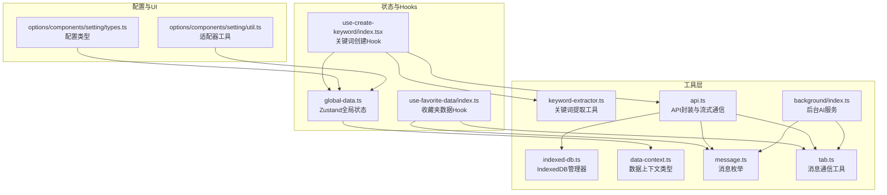
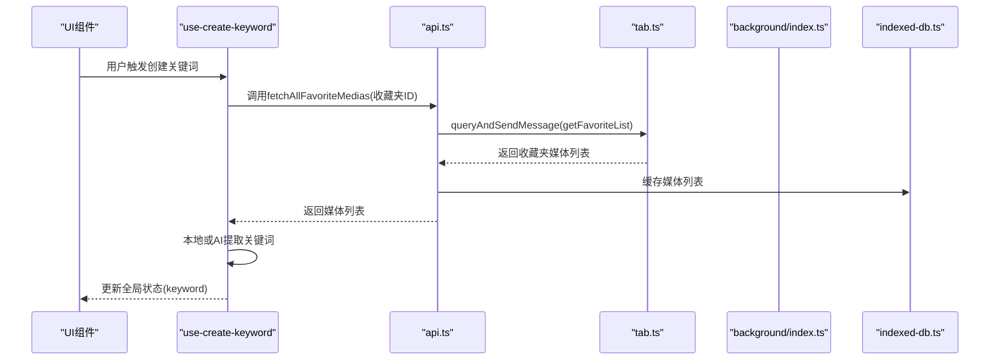
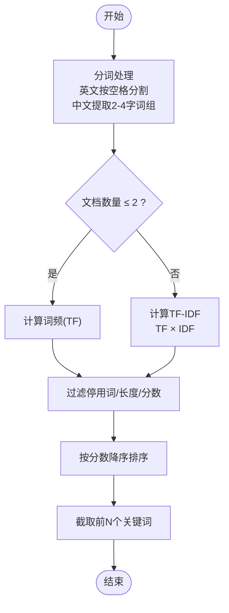
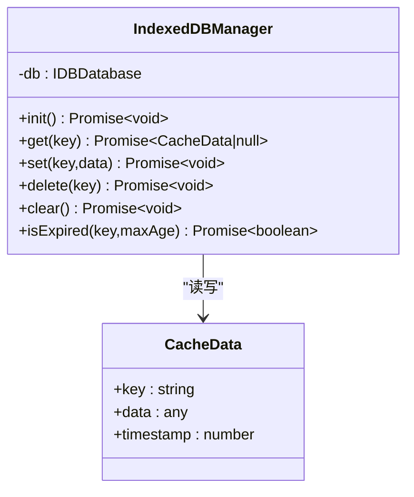
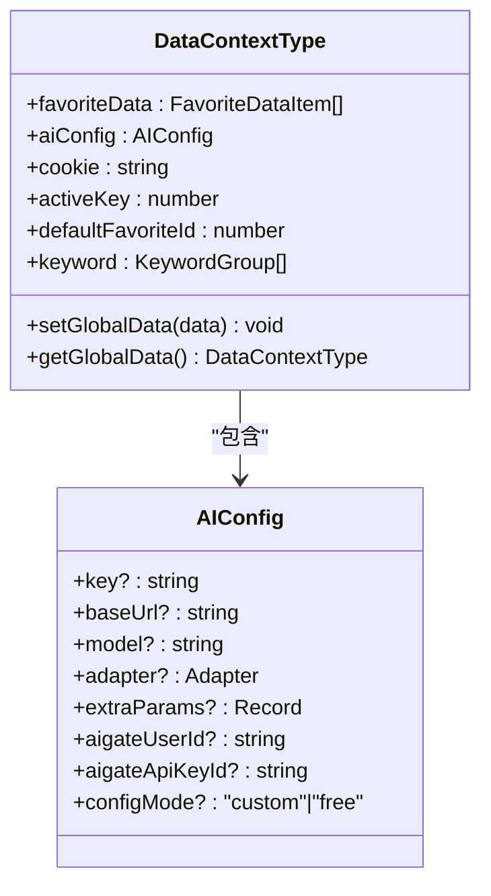
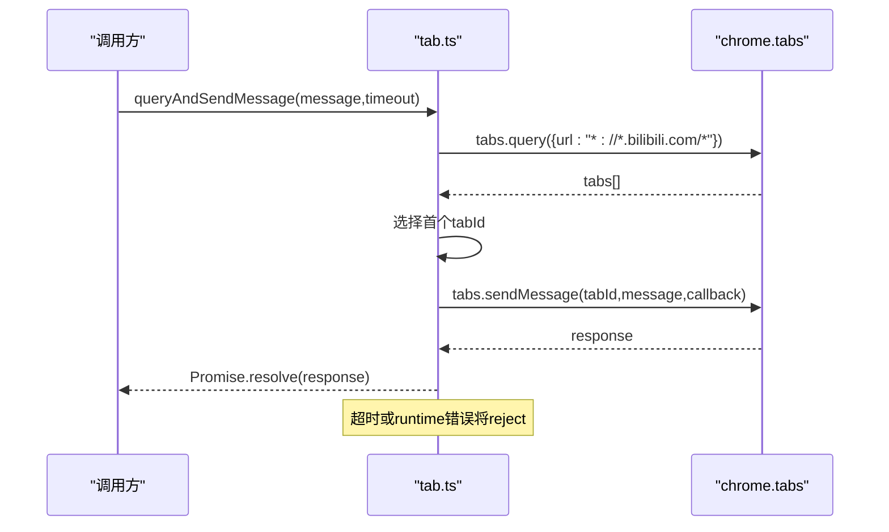
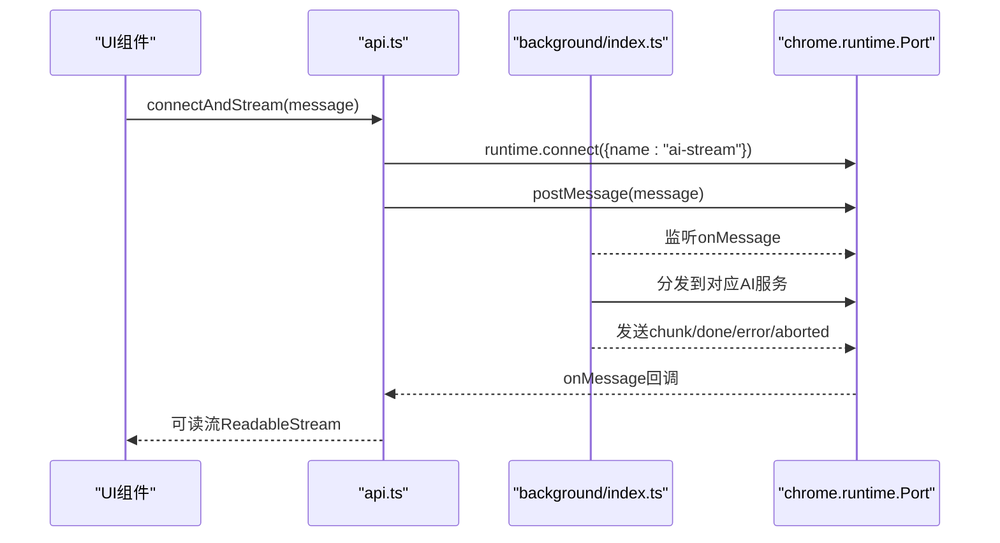
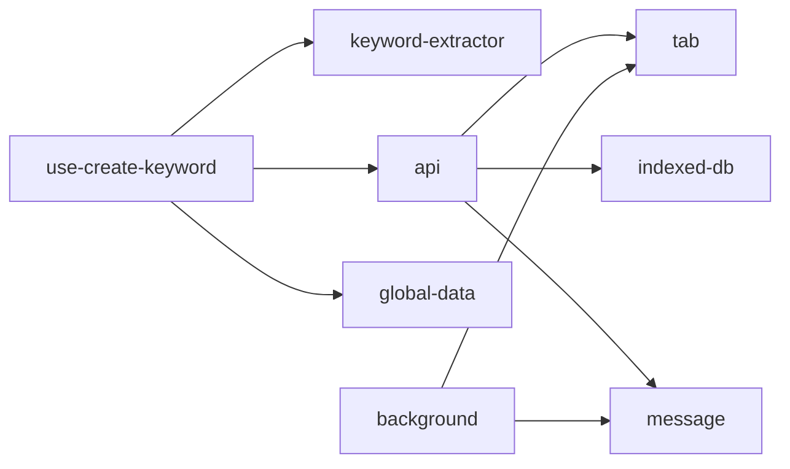

# 内部工具API

<cite>
**本文档引用的文件**
- [keyword-extractor.ts](file://src/utils/keyword-extractor.ts)
- [indexed-db.ts](file://src/utils/indexed-db.ts)
- [data-context.ts](file://src/utils/data-context.ts)
- [message.ts](file://src/utils/message.ts)
- [api.ts](file://src/utils/api.ts)
- [tab.ts](file://src/utils/tab.ts)
- [background/index.ts](file://src/background/index.ts)
- [use-create-keyword/index.tsx](file://src/hooks/use-create-keyword/index.tsx)
- [use-favorite-data/index.ts](file://src/hooks/use-favorite-data/index.ts)
- [global-data.ts](file://src/store/global-data.ts)
- [types.ts](file://src/options/components/setting/types.ts)
- [util.ts](file://src/options/components/setting/util.ts)
</cite>

## 目录
1. [简介](#简介)
2. [项目结构](#项目结构)
3. [核心组件](#核心组件)
4. [架构总览](#架构总览)
5. [详细组件分析](#详细组件分析)
6. [依赖关系分析](#依赖关系分析)
7. [性能考虑](#性能考虑)
8. [故障排除指南](#故障排除指南)
9. [结论](#结论)
10. [附录](#附录)

## 简介
本文件系统性梳理项目内部工具API，涵盖以下能力：
- 关键词提取工具API：基于TF-IDF与停用词过滤的本地关键词提取，以及基于AI的关键词生成。
- IndexedDB数据库管理API：提供缓存分析数据的初始化、读取、写入、删除与清空，以及过期检测。
- 数据上下文管理API：DataContextType的数据结构与全局状态管理，包含收藏夹数据、AI配置、关键词等。
- 消息通信工具API：queryAndSendMessage函数的消息传递协议、超时控制与错误处理。
- 工具函数使用示例与最佳实践：性能优化与错误恢复策略。

## 项目结构
项目采用按功能域划分的组织方式，工具API集中在src/utils目录，业务逻辑通过hooks与store进行集成，后台服务通过background脚本提供AI流式通信与配额检查。

图表来源
- [keyword-extractor.ts:1-197](file://src/utils/keyword-extractor.ts#L1-L197)
- [indexed-db.ts:1-128](file://src/utils/indexed-db.ts#L1-L128)
- [data-context.ts:1-34](file://src/utils/data-context.ts#L1-L34)
- [message.ts:1-20](file://src/utils/message.ts#L1-L20)
- [tab.ts:1-93](file://src/utils/tab.ts#L1-L93)
- [api.ts:1-339](file://src/utils/api.ts#L1-L339)
- [background/index.ts:1-393](file://src/background/index.ts#L1-L393)
- [global-data.ts:1-28](file://src/store/global-data.ts#L1-L28)
- [use-create-keyword/index.tsx:1-304](file://src/hooks/use-create-keyword/index.tsx#L1-L304)
- [use-favorite-data/index.ts:1-63](file://src/hooks/use-favorite-data/index.ts#L1-L63)
- [types.ts:1-99](file://src/options/components/setting/types.ts#L1-L99)
- [util.ts:1-26](file://src/options/components/setting/util.ts#L1-L26)

章节来源
- [keyword-extractor.ts:1-197](file://src/utils/keyword-extractor.ts#L1-L197)
- [indexed-db.ts:1-128](file://src/utils/indexed-db.ts#L1-L128)
- [data-context.ts:1-34](file://src/utils/data-context.ts#L1-L34)
- [message.ts:1-20](file://src/utils/message.ts#L1-L20)
- [tab.ts:1-93](file://src/utils/tab.ts#L1-L93)
- [api.ts:1-339](file://src/utils/api.ts#L1-L339)
- [background/index.ts:1-393](file://src/background/index.ts#L1-L393)
- [global-data.ts:1-28](file://src/store/global-data.ts#L1-L28)
- [use-create-keyword/index.tsx:1-304](file://src/hooks/use-create-keyword/index.tsx#L1-L304)
- [use-favorite-data/index.ts:1-63](file://src/hooks/use-favorite-data/index.ts#L1-L63)
- [types.ts:1-99](file://src/options/components/setting/types.ts#L1-L99)
- [util.ts:1-26](file://src/options/components/setting/util.ts#L1-L26)

## 核心组件
- 关键词提取工具：提供本地TF-IDF与快速关键词提取，支持停用词过滤与最小长度过滤。
- IndexedDB管理器：提供数据库初始化、对象存储创建、读写删清与过期检测。
- 数据上下文：定义全局状态结构，包含收藏夹数据、AI配置、关键词等，并提供读写方法。
- 消息通信：封装标签页查询与消息发送，支持超时控制与错误处理。
- API封装：封装收藏夹数据获取、AI流式通信、缓存读写等高层接口。
- 后台AI服务：监听长连接，支持流式AI响应、配额检查与取消控制。

章节来源
- [keyword-extractor.ts:137-196](file://src/utils/keyword-extractor.ts#L137-L196)
- [indexed-db.ts:15-124](file://src/utils/indexed-db.ts#L15-L124)
- [data-context.ts:3-31](file://src/utils/data-context.ts#L3-L31)
- [tab.ts:65-82](file://src/utils/tab.ts#L65-L82)
- [api.ts:117-319](file://src/utils/api.ts#L117-L319)
- [background/index.ts:315-392](file://src/background/index.ts#L315-L392)

## 架构总览
整体架构围绕“工具层API + 状态与Hooks + 后台服务”的分层设计，前端通过消息通信与后台交互，后台负责AI流式响应与配额管理。

图表来源
- [use-create-keyword/index.tsx:191-284](file://src/hooks/use-create-keyword/index.tsx#L191-L284)
- [api.ts:285-319](file://src/utils/api.ts#L285-L319)
- [tab.ts:65-82](file://src/utils/tab.ts#L65-L82)
- [background/index.ts:334-349](file://src/background/index.ts#L334-L349)
- [indexed-db.ts:45-81](file://src/utils/indexed-db.ts#L45-L81)

## 详细组件分析

### 关键词提取工具API
- 功能概述
  - 本地TF-IDF关键词提取：当文档数≤2时回退为纯词频；否则计算TF-IDF并排序。
  - 停用词过滤：内置中文停用词集合，过滤无意义词汇。
  - 最小长度与最小分数过滤：可配置关键词最小长度与最低分数阈值。
  - 快速提取：直接返回关键词字符串数组，便于快速使用。
- 关键类型与参数
  - KeywordResult：包含keyword与score字段。
  - extractKeywords(options)：支持maxKeywords、minScore、minLength。
  - quickExtractKeywords：简化版，仅返回关键词数组。
- 使用建议
  - 对于少量标题（≤2），TF-IDF可能不如纯词频稳定，可适当降低minScore以提升召回。
  - 结合停用词表与业务需求调整minLength，避免过短无意义词。
  - 在批量处理时，建议先进行去重与清洗，再传入extractKeywords。

章节来源
- [keyword-extractor.ts:6-66](file://src/utils/keyword-extractor.ts#L6-L66)
- [keyword-extractor.ts:137-196](file://src/utils/keyword-extractor.ts#L137-L196)

#### 关键词提取流程图

图表来源
- [keyword-extractor.ts:72-94](file://src/utils/keyword-extractor.ts#L72-L94)
- [keyword-extractor.ts:158-186](file://src/utils/keyword-extractor.ts#L158-L186)

### IndexedDB数据库管理API
- 数据模型
  - CacheData：包含key、data、timestamp三要素。
  - 对象存储：keyPath为key，索引为timestamp。
- 核心接口
  - init：打开数据库并在需要时创建对象存储与索引。
  - get：按key读取缓存。
  - set：写入缓存并记录时间戳。
  - delete：按key删除缓存。
  - clear：清空对象存储。
  - isExpired：基于maxAge判断缓存是否过期。
- 使用场景
  - 缓存收藏夹媒体列表，减少重复网络请求。
  - 支持自定义过期时间，平衡新鲜度与性能。
- 注意事项
  - 首次使用需等待init完成，后续操作自动复用连接。
  - 事务为只读或读写，确保一致性。

章节来源
- [indexed-db.ts:5-124](file://src/utils/indexed-db.ts#L5-L124)

#### IndexedDB类图

图表来源
- [indexed-db.ts:15-124](file://src/utils/indexed-db.ts#L15-L124)

### 数据上下文管理API
- DataContextType结构
  - favoriteData：收藏夹条目数组。
  - aiConfig：AI配置，包含key、baseUrl、model、adapter、extraParams、AIGate配置与configMode。
  - cookie、activeKey、defaultFavoriteId：运行时状态。
  - keyword：关键词映射，按收藏夹ID分组。
  - setGlobalData/getGlobalData：全局状态读写。
- 全局状态实现
  - 使用Zustand + Immer + Chrome Storage中间件持久化。
  - 默认值在store中初始化，避免未定义访问。
- 使用建议
  - 在组件中通过shallow选择器订阅必要字段，减少重渲染。
  - 更新全局状态时尽量合并写入，避免频繁触发订阅。

章节来源
- [data-context.ts:3-31](file://src/utils/data-context.ts#L3-L31)
- [global-data.ts:6-25](file://src/store/global-data.ts#L6-L25)

#### 数据上下文类图

图表来源
- [data-context.ts:3-31](file://src/utils/data-context.ts#L3-L31)
- [global-data.ts:6-25](file://src/store/global-data.ts#L6-L25)

### 消息通信工具API
- queryAndSendMessage
  - 功能：查询匹配B站域名的标签页，向首个标签页发送消息并返回Promise。
  - 超时控制：默认10秒，超时抛出错误。
  - 错误处理：标签页不存在、ID为空、runtime错误均转为异常。
- sendMessageToTab
  - 功能：向指定标签页发送消息，带超时与runtime错误处理。
- 辅助工具
  - isBilibiliUrl：URL匹配辅助。
  - queryBilibiliTabs：查询B站标签页。
- 使用建议
  - 在调用前确保扩展已注入content script且标签页存在。
  - 对于长耗时操作，结合AbortController与后台取消机制。

章节来源
- [tab.ts:65-82](file://src/utils/tab.ts#L65-L82)
- [tab.ts:37-57](file://src/utils/tab.ts#L37-L57)
- [tab.ts:13-20](file://src/utils/tab.ts#L13-L20)

#### 消息通信序列图

图表来源
- [tab.ts:65-82](file://src/utils/tab.ts#L65-L82)

### API封装与AI流式通信
- 收藏夹数据获取
  - fetchAllFavoriteMedias：分页拉取收藏夹全部媒体，使用IndexedDB缓存，支持expireTime。
  - getFavoriteList/getAllFavoriteFlag：直接调用B站API。
- AI流式通信
  - connectAndStream：建立chrome.runtime.connect长连接，监听chunk/done/error/aborted事件，返回可取消的ReadableStream。
  - fetchChatGpt/fetchAIMove/callAIGateAI：封装不同AI请求的消息体与配置。
- 后台服务
  - background/index.ts：监听ai-stream端口，根据MessageEnum分发至对应AI服务，支持取消与配额检查。
- 使用建议
  - 对于大量数据，合理设置expireTime，避免频繁网络请求。
  - 流式读取时注意处理done与error分支，及时释放资源。

章节来源
- [api.ts:117-319](file://src/utils/api.ts#L117-L319)
- [background/index.ts:315-392](file://src/background/index.ts#L315-L392)

#### AI流式通信序列图

图表来源
- [api.ts:180-232](file://src/utils/api.ts#L180-L232)
- [background/index.ts:315-392](file://src/background/index.ts#L315-L392)

### 关键词创建Hook与最佳实践
- useCreateKeyword
  - 支持三种模式：local（本地TF-IDF）、ai（AI流式）、manual（手动）。
  - 本地模式：调用fetchAllFavoriteMedias获取标题，quickExtractKeywords提取关键词，更新全局状态。
  - AI模式：优先AIGate免费额度，否则使用自定义配置；通过流式解析器处理增量结果。
  - 批量处理：遍历收藏夹逐一处理，统计成功/失败数量并提示。
  - 取消机制：AbortController统一管理取消，确保资源释放。
- 最佳实践
  - 性能：对标题进行去重与清洗，减少无效计算；合理设置maxKeywords与minScore。
  - 错误恢复：捕获DOMException并区分用户取消与其他错误；对网络与AI服务异常进行降级处理。
  - UI反馈：使用toast提示进度与结果，避免阻塞用户操作。

章节来源
- [use-create-keyword/index.tsx:19-304](file://src/hooks/use-create-keyword/index.tsx#L19-L304)

## 依赖关系分析
- 组件耦合
  - use-create-keyword依赖keyword-extractor、api、global-data与ai-stream解析器。
  - api依赖tab、indexed-db、message与background。
  - background依赖message与tab。
- 外部依赖
  - IndexedDB浏览器原生API。
  - chrome.runtime与chrome.tabs扩展API。
  - OpenAI SDK（自定义AI）。
- 循环依赖
  - 未发现循环依赖，模块职责清晰。

图表来源
- [use-create-keyword/index.tsx:1-304](file://src/hooks/use-create-keyword/index.tsx#L1-L304)
- [api.ts:1-339](file://src/utils/api.ts#L1-L339)
- [background/index.ts:1-393](file://src/background/index.ts#L1-L393)

章节来源
- [use-create-keyword/index.tsx:1-304](file://src/hooks/use-create-keyword/index.tsx#L1-L304)
- [api.ts:1-339](file://src/utils/api.ts#L1-L339)
- [background/index.ts:1-393](file://src/background/index.ts#L1-L393)

## 性能考虑
- 关键词提取
  - 对于少量文档，TF-IDF可能不稳定，建议降低minScore或切换为本地模式。
  - 预先清洗标题（去重、标准化），减少无效token。
- IndexedDB缓存
  - 合理设置expireTime，避免频繁网络请求；对热点数据可缩短过期时间。
  - 批量写入时合并事务，减少IO次数。
- 流式通信
  - 使用AbortController及时取消长时间运行的任务，避免资源浪费。
  - 在UI侧对流式数据进行节流或缓冲，避免频繁渲染。
- 状态管理
  - 使用shallow选择器订阅必要字段，减少不必要的重渲染。
  - 合并多次更新，避免抖动。

## 故障排除指南
- 消息通信超时
  - 现象：queryAndSendMessage抛出超时错误。
  - 排查：确认扩展已注入content script，标签页URL匹配B站域名，网络正常。
- AI流式通信错误
  - 现象：收到error或aborted消息。
  - 排查：检查AI配置（key、baseUrl、model），确认后台服务正常；查看后台日志定位具体错误。
- IndexedDB写入失败
  - 现象：set/delete/clear抛错。
  - 排查：确认数据库版本升级成功，对象存储存在且keyPath正确。
- 全局状态未更新
  - 现象：UI未反映最新状态。
  - 排查：确认使用shallow选择器订阅，setGlobalData合并写入，避免直接修改引用。

章节来源
- [tab.ts:42-56](file://src/utils/tab.ts#L42-L56)
- [background/index.ts:182-191](file://src/background/index.ts#L182-L191)
- [indexed-db.ts:73-80](file://src/utils/indexed-db.ts#L73-L80)
- [global-data.ts:16-21](file://src/store/global-data.ts#L16-L21)

## 结论
本工具API体系提供了从关键词提取、缓存管理到消息通信与AI流式处理的完整能力。通过合理的配置与最佳实践，可在保证性能的同时提升用户体验。建议在生产环境中持续监控AI配额与网络稳定性，并根据业务场景调整缓存策略与关键词提取参数。

## 附录
- 配置模式与适配器
  - 配置模式：custom（自定义）与free（免费）。
  - 适配器：openai、spark、aigate。
  - 默认额外参数：spark默认禁用思考模式，其他适配器为空对象。
- 关键词提取参数
  - maxKeywords：返回关键词数量上限。
  - minScore：关键词最低分数阈值。
  - minLength：关键词最小长度。
- IndexedDB缓存
  - 默认过期时间：24小时。
  - 对象存储：keyPath为key，索引为timestamp。

章节来源
- [types.ts:30-99](file://src/options/components/setting/types.ts#L30-L99)
- [util.ts:4-25](file://src/options/components/setting/util.ts#L4-L25)
- [keyword-extractor.ts:139-145](file://src/utils/keyword-extractor.ts#L139-L145)
- [indexed-db.ts:118-123](file://src/utils/indexed-db.ts#L118-L123)