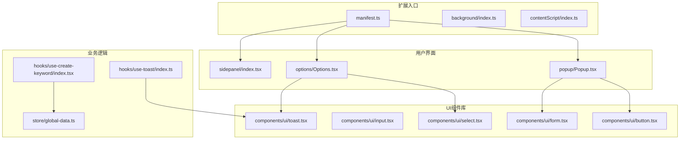
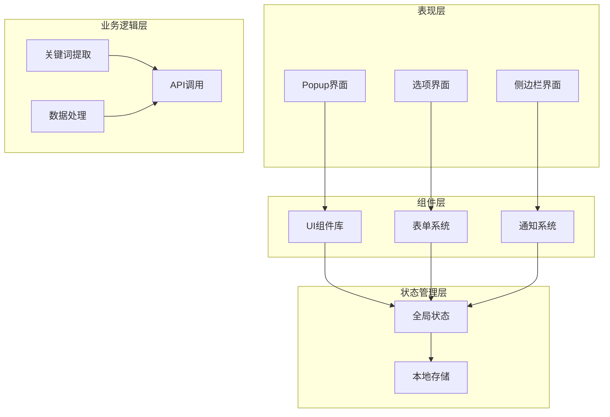
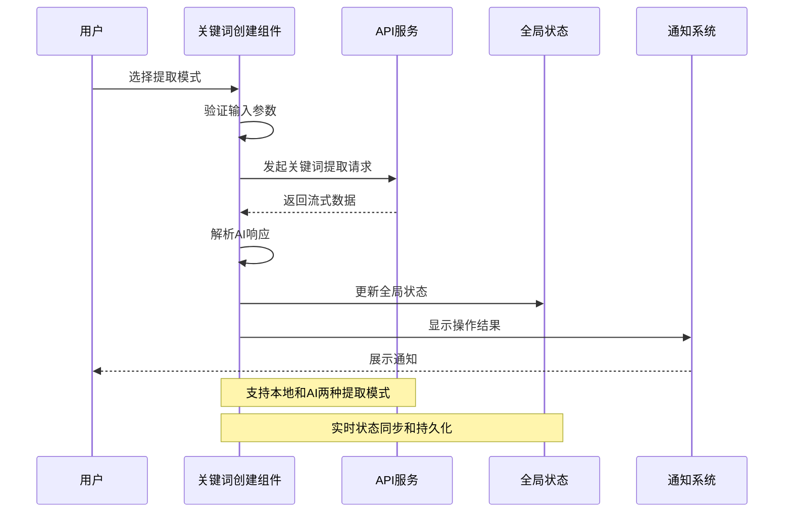
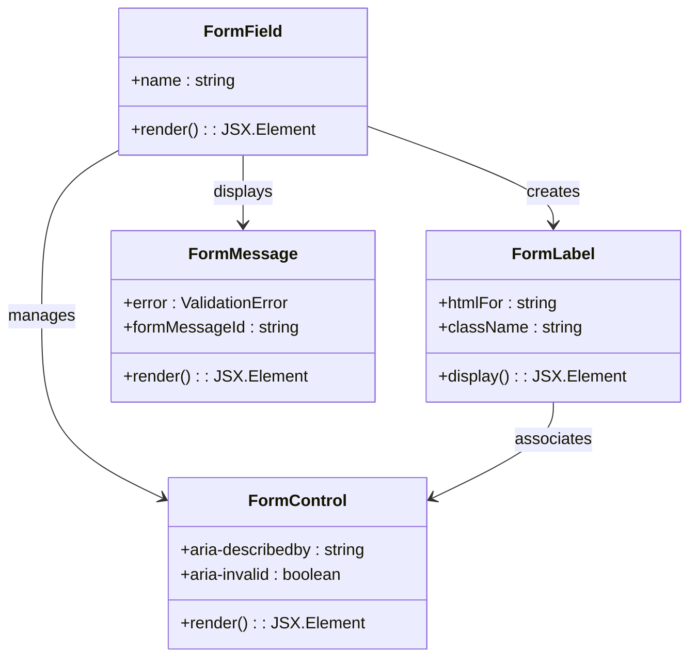
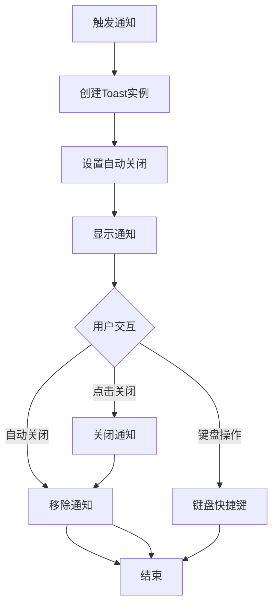

# 可访问性增强

<cite>
**本文档引用的文件**
- [README.md](file://README.md)
- [src/manifest.ts](file://src/manifest.ts)
- [package.json](file://package.json)
- [src/global.d.ts](file://src/global.d.ts)
- [src/lib/utils.ts](file://src/lib/utils.ts)
- [src/components/ui/button.tsx](file://src/components/ui/button.tsx)
- [src/components/ui/input.tsx](file://src/components/ui/input.tsx)
- [src/components/ui/form.tsx](file://src/components/ui/form.tsx)
- [src/hooks/use-toast/index.ts](file://src/hooks/use-toast/index.ts)
- [src/hooks/use-create-keyword/index.tsx](file://src/hooks/use-create-keyword/index.tsx)
- [src/popup/Popup.tsx](file://src/popup/Popup.tsx)
- [src/options/Options.tsx](file://src/options/Options.tsx)
- [src/sidepanel/index.tsx](file://src/sidepanel/index.tsx)
- [src/components/ui/label.tsx](file://src/components/ui/label.tsx)
- [src/components/ui/popover.tsx](file://src/components/ui/popover.tsx)
- [src/components/ui/select.tsx](file://src/components/ui/select.tsx)
- [src/components/ui/tabs.tsx](file://src/components/ui/tabs.tsx)
- [src/components/ui/toast.tsx](file://src/components/ui/toast.tsx)
- [src/components/ui/toaster.tsx](file://src/components/ui/toaster.tsx)
- [src/store/global-data.ts](file://src/store/global-data.ts)
- [src/utils/log.ts](file://src/utils/log.ts)
</cite>

## 目录
1. [简介](#简介)
2. [项目结构](#项目结构)
3. [核心组件](#核心组件)
4. [架构概览](#架构概览)
5. [详细组件分析](#详细组件分析)
6. [依赖关系分析](#依赖关系分析)
7. [性能考虑](#性能考虑)
8. [故障排除指南](#故障排除指南)
9. [结论](#结论)

## 简介

B站收藏夹整理工具是一个强大的Chrome扩展程序，旨在帮助用户高效管理和分析Bilibili收藏夹内容。该项目不仅提供了丰富的功能特性，还特别注重可访问性设计，确保所有用户都能轻松使用该工具。

该项目的核心功能包括：
- 智能分析收藏内容分布情况
- 基于AI的视频标题关键词提取和自动分类
- 直观的可视化展示和收藏趋势分析
- 一键整理和批量操作功能
- 可视化拖拽管理界面
- 侧边栏模式支持

**章节来源**
- [README.md:1-188](file://README.md#L1-L188)

## 项目结构

该项目采用模块化的React架构设计，主要分为以下几个核心部分：



**图表来源**
- [src/manifest.ts:1-55](file://src/manifest.ts#L1-L55)
- [src/popup/Popup.tsx:1-82](file://src/popup/Popup.tsx#L1-L82)
- [src/options/Options.tsx:1-92](file://src/options/Options.tsx#L1-L92)
- [src/sidepanel/index.tsx:1-11](file://src/sidepanel/index.tsx#L1-L11)

**章节来源**
- [src/manifest.ts:1-55](file://src/manifest.ts#L1-L55)
- [package.json:1-91](file://package.json#L1-L91)

## 核心组件

### 可访问性基础组件

项目实现了完整的可访问性基础设施，包括：

#### 基础UI组件
- **Button组件**：支持多种变体和尺寸，具备键盘导航和焦点管理
- **Input组件**：提供表单控件的完整可访问性支持
- **Label组件**：与表单控件建立正确的语义关联
- **Select组件**：完整的下拉选择器可访问性实现

#### 表单系统
- **Form组件**：基于react-hook-form的可访问性表单框架
- **FormControl**：自动处理aria属性和错误状态
- **FormLabel**：与对应的表单控件建立语义关联
- **FormMessage**：提供错误信息的可访问性支持

#### 通知系统
- **Toast组件**：基于Radix UI的可访问性通知系统
- **Toaster组件**：全局通知管理器
- **useToast Hook**：简化的通知API

**章节来源**
- [src/components/ui/button.tsx:1-51](file://src/components/ui/button.tsx#L1-L51)
- [src/components/ui/input.tsx:1-23](file://src/components/ui/input.tsx#L1-L23)
- [src/components/ui/form.tsx:1-168](file://src/components/ui/form.tsx#L1-L168)
- [src/components/ui/toast.tsx:1-127](file://src/components/ui/toast.tsx#L1-L127)
- [src/hooks/use-toast/index.ts:1-186](file://src/hooks/use-toast/index.ts#L1-L186)

## 架构概览

项目采用分层架构设计，确保可访问性的统一性和一致性：



**图表来源**
- [src/popup/Popup.tsx:1-82](file://src/popup/Popup.tsx#L1-L82)
- [src/options/Options.tsx:1-92](file://src/options/Options.tsx#L1-L92)
- [src/store/global-data.ts:1-28](file://src/store/global-data.ts#L1-L28)

**章节来源**
- [src/popup/Popup.tsx:1-82](file://src/popup/Popup.tsx#L1-L82)
- [src/options/Options.tsx:1-92](file://src/options/Options.tsx#L1-L92)
- [src/store/global-data.ts:1-28](file://src/store/global-data.ts#L1-L28)

## 详细组件分析

### 关键词创建组件分析

关键词创建功能是项目的核心特性之一，实现了完整的可访问性支持：



**图表来源**
- [src/hooks/use-create-keyword/index.tsx:1-304](file://src/hooks/use-create-keyword/index.tsx#L1-L304)
- [src/store/global-data.ts:1-28](file://src/store/global-data.ts#L1-L28)

#### 组件特性
- **多模式支持**：本地TF-IDF算法和AI驱动提取
- **流式处理**：支持实时数据流处理
- **错误处理**：完善的异常捕获和用户反馈
- **状态管理**：基于Zustand的全局状态管理

**章节来源**
- [src/hooks/use-create-keyword/index.tsx:1-304](file://src/hooks/use-create-keyword/index.tsx#L1-L304)

### 表单系统可访问性实现

表单系统实现了完整的可访问性标准：



**图表来源**
- [src/components/ui/form.tsx:1-168](file://src/components/ui/form.tsx#L1-L168)

#### 关键可访问性特性
- **语义化标签**：正确关联label和input元素
- **ARIA属性**：自动管理aria-describedby和aria-invalid
- **错误处理**：提供清晰的错误信息和视觉反馈
- **键盘导航**：完整的键盘操作支持

**章节来源**
- [src/components/ui/form.tsx:1-168](file://src/components/ui/form.tsx#L1-L168)

### 通知系统架构

通知系统基于Radix UI构建，提供完整的可访问性支持：



**图表来源**
- [src/hooks/use-toast/index.ts:1-186](file://src/hooks/use-toast/index.ts#L1-L186)
- [src/components/ui/toast.tsx:1-127](file://src/components/ui/toast.tsx#L1-L127)

**章节来源**
- [src/hooks/use-toast/index.ts:1-186](file://src/hooks/use-toast/index.ts#L1-L186)
- [src/components/ui/toast.tsx:1-127](file://src/components/ui/toast.tsx#L1-L127)

### UI组件库可访问性

项目实现了完整的UI组件库，每个组件都遵循可访问性最佳实践：

#### Button组件可访问性特性
- 支持多种交互方式（点击、键盘激活）
- 正确的焦点管理
- 状态变化的视觉反馈
- 适当的ARIA属性

#### Select组件可访问性特性
- 键盘导航支持（上下箭头、Enter、Escape）
- 屏幕阅读器友好
- 状态变化的语音反馈
- 滚动区域的可访问性

**章节来源**
- [src/components/ui/button.tsx:1-51](file://src/components/ui/button.tsx#L1-L51)
- [src/components/ui/select.tsx:1-151](file://src/components/ui/select.tsx#L1-L151)

## 依赖关系分析

项目使用现代化的前端技术栈，重点依赖可访问性友好的库：

```mermaid
graph LR
subgraph "核心依赖"
React[react ^19.0.0]
RadixUI[@radix-ui/*]
Zustand[zustand ^5.0.6]
end
subgraph "可访问性支持"
A11yLibs[可访问性库]
FormValidation[表单验证]
StateManagement[状态管理]
end
subgraph "开发工具"
Vite[vite ^6.0.6]
TypeScript[typescript ^5.7.2]
TailwindCSS[tailwindcss ^3.4.17]
end
React --> A11yLibs
RadixUI --> A11yLibs
Zustand --> StateManagement
ReactHookForm --> FormValidation
```

**图表来源**
- [package.json:29-58](file://package.json#L29-L58)

**章节来源**
- [package.json:1-91](file://package.json#L1-L91)

## 性能考虑

项目在可访问性实现的同时，也注重性能优化：

### 渲染优化
- 使用React.memo和useMemo避免不必要的重渲染
- 懒加载非关键组件
- 优化事件处理函数

### 状态管理
- 基于Zustand的状态管理，减少全局状态更新
- Immer中间件提供不可变更新
- Chrome存储中间件确保数据持久化

### 可访问性性能
- 避免频繁的DOM操作影响屏幕阅读器
- 优化键盘事件处理
- 减少ARIA属性的动态更新频率

## 故障排除指南

### 常见可访问性问题

#### 键盘导航问题
**症状**：无法通过键盘操作界面元素
**解决方案**：
- 确保所有交互元素都有正确的tabIndex属性
- 检查焦点管理逻辑
- 验证键盘事件监听器

#### 屏幕阅读器兼容性问题
**症状**：屏幕阅读器无法正确读取内容
**解决方案**：
- 检查ARIA属性的正确使用
- 确保语义化HTML结构
- 验证角色(role)和属性的准确性

#### 表单验证问题
**症状**：表单错误信息无法被辅助技术识别
**解决方案**：
- 确保aria-describedby正确指向错误信息
- 检查aria-invalid属性的状态同步
- 验证错误消息的可见性和可理解性

**章节来源**
- [src/components/ui/form.tsx:82-156](file://src/components/ui/form.tsx#L82-L156)

### 调试工具和方法

#### 可访问性测试工具
- **axe-core**：自动化可访问性测试
- **Lighthouse**：可访问性审计
- **Chrome DevTools**：ARIA属性检查
- **NVDA/JAWS**：屏幕阅读器测试

#### 调试技巧
- 使用浏览器的可访问性面板
- 检查元素的语义角色
- 验证键盘导航顺序
- 测试不同辅助技术的兼容性

## 结论

B站收藏夹整理工具在可访问性方面展现了卓越的设计理念和技术实现。项目不仅提供了丰富的功能特性，更重要的是确保了所有用户都能平等地使用这些功能。

### 主要成就

1. **完整的可访问性基础设施**：从基础UI组件到复杂业务逻辑，每个层面都考虑了可访问性需求

2. **现代化的技术栈**：采用React 19、Radix UI、Zustand等前沿技术，为可访问性实现提供了坚实基础

3. **用户友好的设计**：通过Toast通知、表单验证、键盘导航等特性，提升了整体用户体验

4. **持续改进的承诺**：项目文档和代码注释体现了对可访问性的持续关注

### 未来发展方向

- **更广泛的辅助技术支持**：扩展对更多辅助技术的兼容性
- **可访问性自动化测试**：集成CI/CD流程中的可访问性测试
- **用户反馈机制**：建立专门的可访问性反馈渠道
- **最佳实践文档**：完善可访问性开发指南和规范

该项目为Chrome扩展的可访问性实现树立了良好的标杆，为其他开发者提供了宝贵的参考经验。