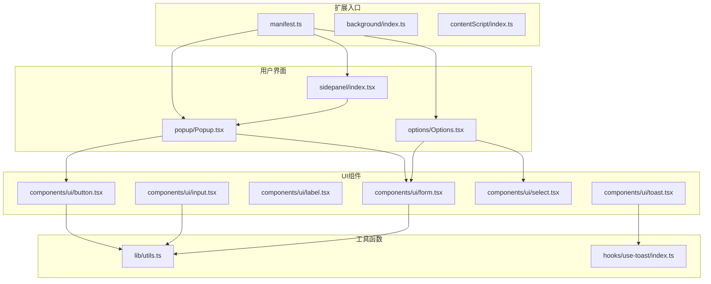
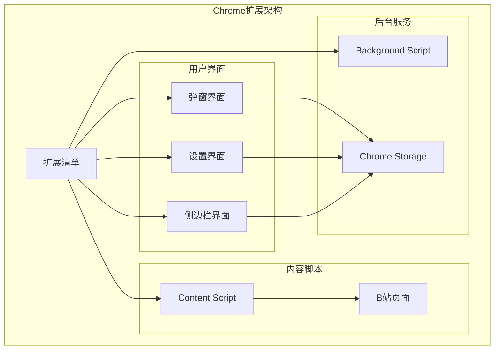
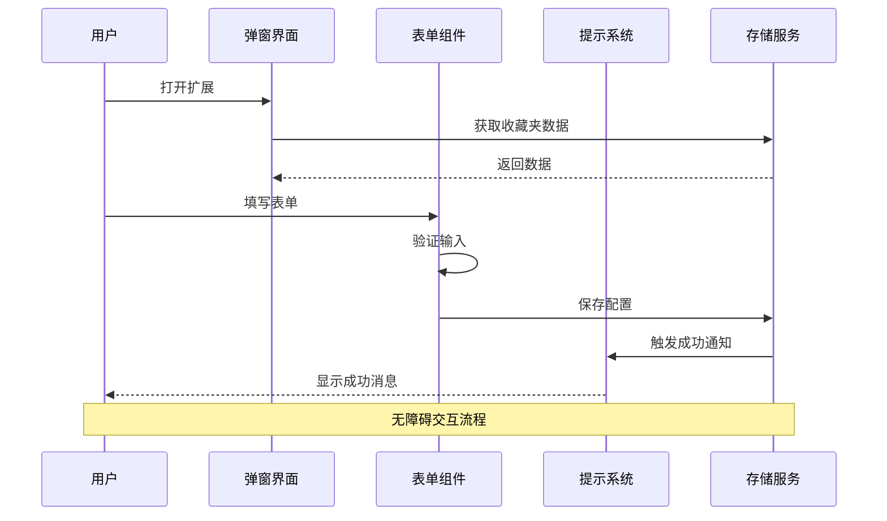
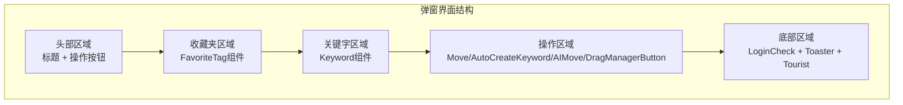
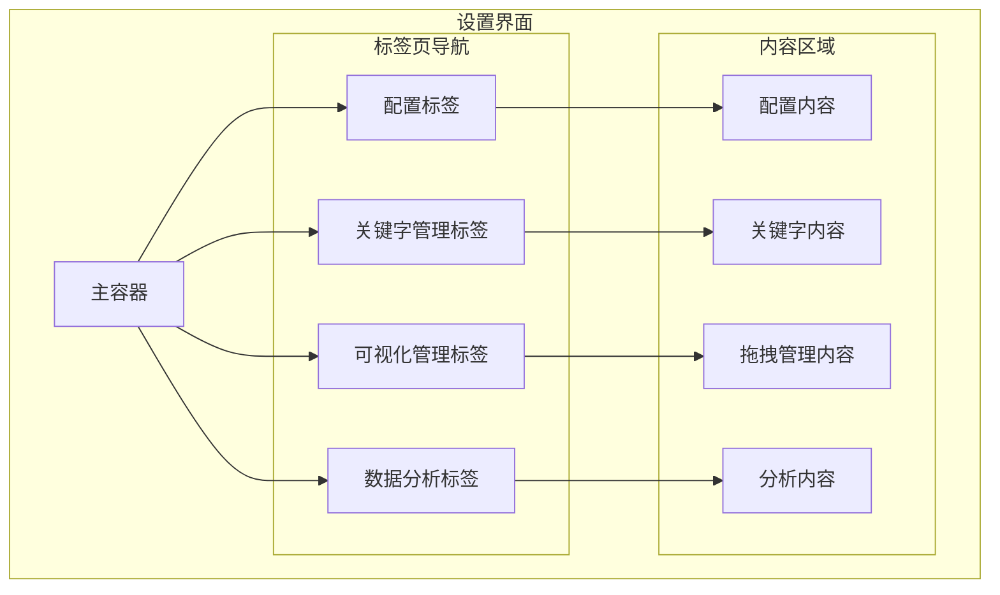
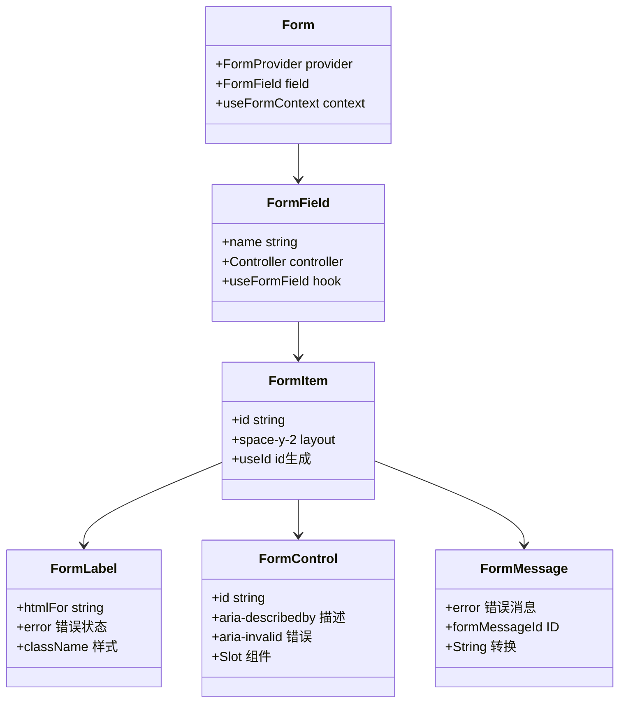
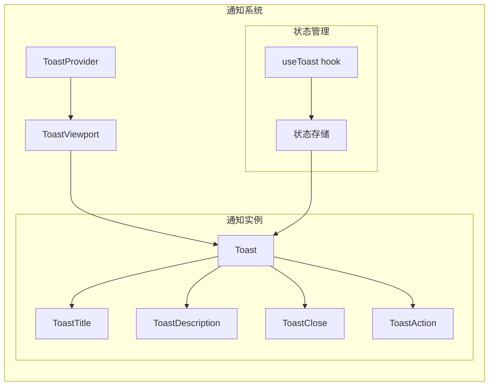
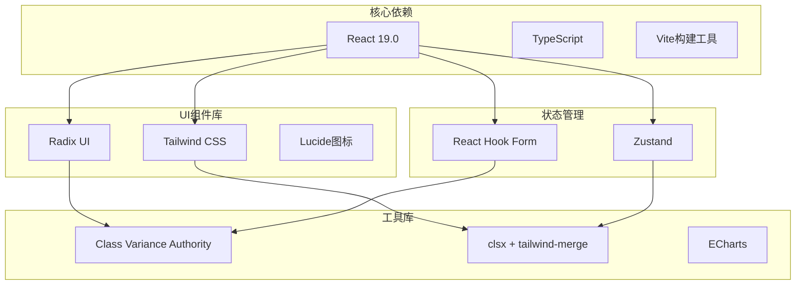
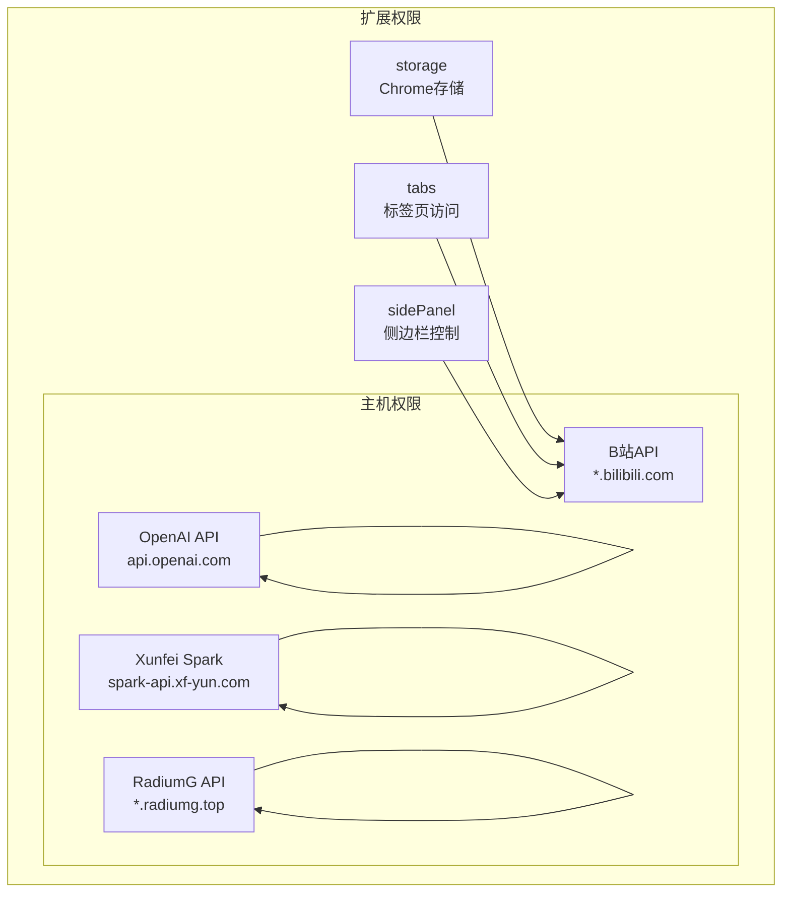

# 无障碍增强

<cite>
**本文档引用的文件**
- [README.md](file://README.md)
- [src/manifest.ts](file://src/manifest.ts)
- [package.json](file://package.json)
- [src/global.d.ts](file://src/global.d.ts)
- [src/lib/utils.ts](file://src/lib/utils.ts)
- [src/components/ui/button.tsx](file://src/components/ui/button.tsx)
- [src/components/ui/input.tsx](file://src/components/ui/input.tsx)
- [src/components/ui/label.tsx](file://src/components/ui/label.tsx)
- [src/components/ui/form.tsx](file://src/components/ui/form.tsx)
- [src/components/ui/select.tsx](file://src/components/ui/select.tsx)
- [src/components/ui/toast.tsx](file://src/components/ui/toast.tsx)
- [src/popup/Popup.tsx](file://src/popup/Popup.tsx)
- [src/options/Options.tsx](file://src/options/Options.tsx)
- [src/sidepanel/index.tsx](file://src/sidepanel/index.tsx)
- [src/hooks/use-toast/index.ts](file://src/hooks/use-toast/index.ts)
</cite>

## 目录
1. [简介](#简介)
2. [项目结构](#项目结构)
3. [核心组件](#核心组件)
4. [架构概览](#架构概览)
5. [详细组件分析](#详细组件分析)
6. [依赖关系分析](#依赖关系分析)
7. [性能考虑](#性能考虑)
8. [故障排除指南](#故障排除指南)
9. [结论](#结论)

## 简介

B站收藏夹整理工具是一个基于React和TypeScript开发的Chrome扩展程序，旨在帮助用户高效管理和分析B站收藏夹内容。该工具提供了智能分析、可视化拖拽管理、侧边栏模式等功能，特别注重用户体验的无障碍性设计。

该项目采用了现代化的前端技术栈，包括React 19.0、Radix UI组件库、Tailwind CSS样式框架等，为用户提供了一个功能丰富且界面友好的扩展程序。

## 项目结构

该项目采用模块化的组织方式，主要分为以下几个核心部分：

**图表来源**
- [src/manifest.ts:1-55](file://src/manifest.ts#L1-L55)
- [src/popup/Popup.tsx:1-82](file://src/popup/Popup.tsx#L1-L82)
- [src/options/Options.tsx:1-92](file://src/options/Options.tsx#L1-L92)
- [src/sidepanel/index.tsx:1-11](file://src/sidepanel/index.tsx#L1-L11)

**章节来源**
- [src/manifest.ts:1-55](file://src/manifest.ts#L1-L55)
- [package.json:1-91](file://package.json#L1-L91)

## 核心组件

### 无障碍设计原则

该项目在设计时充分考虑了无障碍性，主要体现在以下几个方面：

1. **语义化HTML结构**：所有交互元素都使用了正确的HTML语义标签
2. **键盘导航支持**：组件都支持键盘操作和焦点管理
3. **屏幕阅读器兼容**：通过aria属性提供适当的语义信息
4. **颜色对比度**：确保文本和背景有足够的对比度
5. **响应式设计**：适配不同尺寸的屏幕和设备

### 主要UI组件

#### 按钮组件 (Button)
按钮组件是整个应用中最基础的交互元素，具有完整的无障碍支持：

- 支持多种变体和尺寸
- 内置焦点管理
- SVG图标支持
- 禁用状态处理

#### 输入组件 (Input)
输入组件提供了表单的基础输入能力：

- 支持各种输入类型
- 焦点状态管理
- 禁用状态处理
- 占位符文本支持

#### 标签组件 (Label)
标签组件与表单控件关联，提供语义化标签：

- 与表单控件绑定
- 错误状态样式
- 禁用状态处理

#### 表单组件 (Form)
完整的表单解决方案：

- 字段验证集成
- 错误消息显示
- ARIA属性支持
- 焦点管理

#### 选择组件 (Select)
下拉选择组件：

- 支持滚动条
- 选项分组
- 搜索过滤
- 键盘导航

#### 提示组件 (Toast)
通知系统：

- 自动消失机制
- 多种样式变体
- 屏幕阅读器支持
- 用户交互控制

**章节来源**
- [src/components/ui/button.tsx:1-51](file://src/components/ui/button.tsx#L1-L51)
- [src/components/ui/input.tsx:1-23](file://src/components/ui/input.tsx#L1-L23)
- [src/components/ui/label.tsx:1-22](file://src/components/ui/label.tsx#L1-L22)
- [src/components/ui/form.tsx:1-168](file://src/components/ui/form.tsx#L1-L168)
- [src/components/ui/select.tsx:1-151](file://src/components/ui/select.tsx#L1-L151)
- [src/components/ui/toast.tsx:1-127](file://src/components/ui/toast.tsx#L1-L127)

## 架构概览

### 整体架构设计

**图表来源**
- [src/manifest.ts:1-55](file://src/manifest.ts#L1-L55)

### 组件交互流程

**图表来源**
- [src/popup/Popup.tsx:1-82](file://src/popup/Popup.tsx#L1-L82)
- [src/components/ui/form.tsx:1-168](file://src/components/ui/form.tsx#L1-L168)
- [src/hooks/use-toast/index.ts:1-186](file://src/hooks/use-toast/index.ts#L1-L186)

## 详细组件分析

### 弹窗界面 (Popup)

弹窗界面是用户与扩展交互的主要入口，采用了响应式设计和无障碍友好的布局：

#### 主要功能区域

**图表来源**
- [src/popup/Popup.tsx:1-82](file://src/popup/Popup.tsx#L1-L82)

#### 无障碍特性

- **语义化标题**：使用合适的H标签层级
- **键盘导航**：支持Tab键顺序导航
- **屏幕阅读器**：提供适当的aria-label
- **焦点管理**：自动焦点控制
- **颜色对比**：确保足够的视觉对比度

**章节来源**
- [src/popup/Popup.tsx:1-82](file://src/popup/Popup.tsx#L1-L82)

### 设置界面 (Options)

设置界面提供了扩展的所有配置选项，采用了标签页组织方式：

#### 界面布局

**图表来源**
- [src/options/Options.tsx:1-92](file://src/options/Options.tsx#L1-L92)

**章节来源**
- [src/options/Options.tsx:1-92](file://src/options/Options.tsx#L1-L92)

### 侧边栏界面 (SidePanel)

侧边栏模式提供了更大的操作空间，适合长时间使用：

#### 特殊设计考虑

- **全屏适配**：支持100%宽度和高度
- **滚动优化**：针对长内容的滚动体验
- **响应式布局**：适应不同屏幕尺寸
- **持久显示**：不会因点击其他地方而消失

**章节来源**
- [src/sidepanel/index.tsx:1-11](file://src/sidepanel/index.tsx#L1-L11)

### 表单系统 (Form)

表单系统是整个应用的核心交互层，提供了完整的表单管理能力：

#### 表单组件架构

**图表来源**
- [src/components/ui/form.tsx:1-168](file://src/components/ui/form.tsx#L1-L168)

#### 无障碍表单特性

- **字段关联**：Label与Input正确关联
- **错误处理**：清晰的错误消息显示
- **ARIA支持**：适当的aria-describedby和aria-invalid属性
- **键盘导航**：支持Tab键在表单间切换
- **焦点管理**：自动焦点控制和恢复

**章节来源**
- [src/components/ui/form.tsx:1-168](file://src/components/ui/form.tsx#L1-L168)

### 通知系统 (Toast)

通知系统提供了非侵入式的用户反馈机制：

#### 通知组件设计

**图表来源**
- [src/components/ui/toast.tsx:1-127](file://src/components/ui/toast.tsx#L1-L127)
- [src/hooks/use-toast/index.ts:1-186](file://src/hooks/use-toast/index.ts#L1-L186)

#### 无障碍通知特性

- **自动焦点**：新通知获得焦点
- **键盘关闭**：支持Esc键关闭
- **屏幕阅读器**：通知内容可被读取
- **手动控制**：用户可随时关闭
- **多实例管理**：支持同时显示多个通知

**章节来源**
- [src/components/ui/toast.tsx:1-127](file://src/components/ui/toast.tsx#L1-L127)
- [src/hooks/use-toast/index.ts:1-186](file://src/hooks/use-toast/index.ts#L1-L186)

## 依赖关系分析

### 技术栈依赖

**图表来源**
- [package.json:29-58](file://package.json#L29-L58)

### 扩展权限分析

**图表来源**
- [src/manifest.ts:39-46](file://src/manifest.ts#L39-L46)

**章节来源**
- [package.json:29-58](file://package.json#L29-L58)
- [src/manifest.ts:39-46](file://src/manifest.ts#L39-L46)

## 性能考虑

### 无障碍性能优化

1. **组件懒加载**：大型组件按需加载
2. **虚拟滚动**：大量数据时使用虚拟滚动
3. **事件委托**：减少事件监听器数量
4. **内存管理**：及时清理事件监听器和定时器
5. **渲染优化**：使用React.memo和useMemo

### 性能监控

- **首屏加载时间**：优化关键渲染路径
- **交互延迟**：确保小于100ms的响应时间
- **内存使用**：监控组件生命周期
- **网络请求**：缓存策略和请求合并

## 故障排除指南

### 常见无障碍问题

#### 键盘导航问题
- **症状**：Tab键无法正确导航
- **解决方案**：检查tabIndex属性和元素可见性

#### 屏幕阅读器问题
- **症状**：无法正确读取内容
- **解决方案**：添加适当的aria-label和role属性

#### 颜色对比度问题
- **症状**：文本难以辨识
- **解决方案**：调整颜色方案或增加对比度

#### 焦点管理问题
- **症状**：焦点丢失或重复
- **解决方案**：实现正确的焦点捕获和释放

### 调试工具

1. **浏览器开发者工具**：检查DOM结构和ARIA属性
2. **屏幕阅读器测试**：VoiceOver、NVDA等
3. **键盘导航测试**：纯键盘操作验证
4. **颜色对比度检查**：使用contrast checker工具

**章节来源**
- [src/components/ui/form.tsx:40-61](file://src/components/ui/form.tsx#L40-L61)

## 结论

B站收藏夹整理工具在无障碍性方面表现出色，通过以下方式实现了良好的无障碍体验：

1. **全面的ARIA支持**：所有交互元素都有适当的ARIA属性
2. **键盘导航完整**：支持完整的键盘操作流程
3. **屏幕阅读器友好**：提供清晰的语义化内容
4. **视觉设计考虑**：确保足够的颜色对比度
5. **响应式适配**：适配不同设备和屏幕尺寸

该工具不仅功能强大，更重要的是为所有用户提供了平等的使用体验。通过采用现代的前端技术和最佳实践，确保了扩展程序的可用性和可维护性。

未来可以在以下方面继续改进：
- 增加更多的键盘快捷键支持
- 优化高对比度模式下的视觉效果
- 扩展对更多辅助技术的支持
- 实现动态字体大小调整功能