# 无障碍增强

<cite>
**本文档引用的文件**
- [README.md](file://README.md)
- [src/manifest.ts](file://src/manifest.ts)
- [package.json](file://package.json)
- [src/global.d.ts](file://src/global.d.ts)
- [src/lib/utils.ts](file://src/lib/utils.ts)
- [src/components/ui/button.tsx](file://src/components/ui/button.tsx)
- [src/components/ui/input.tsx](file://src/components/ui/input.tsx)
- [src/components/ui/label.tsx](file://src/components/ui/label.tsx)
- [src/components/ui/form.tsx](file://src/components/ui/form.tsx)
- [src/components/ui/select.tsx](file://src/components/ui/select.tsx)
- [src/components/ui/toast.tsx](file://src/components/ui/toast.tsx)
- [src/components/ui/scroll-area.tsx](file://src/components/ui/scroll-area.tsx)
- [src/components/ui/switch.tsx](file://src/components/ui/switch.tsx)
- [src/popup/Popup.tsx](file://src/popup/Popup.tsx)
- [src/options/Options.tsx](file://src/options/Options.tsx)
- [src/options/components/setting/components/webdav-config.tsx](file://src/options/components/setting/components/webdav-config.tsx)
- [src/sidepanel/index.tsx](file://src/sidepanel/index.tsx)
- [src/hooks/use-toast/index.ts](file://src/hooks/use-toast/index.ts)
- [src/hooks/use-set-default-fav/index.tsx](file://src/hooks/use-set-default-fav/index.tsx)
- [src/hooks/use-favorite-data/index.ts](file://src/hooks/use-favorite-data/index.ts)
- [src/store/global-data.ts](file://src/store/global-data.ts)
- [src/components/favorite-tag/index.tsx](file://src/components/favorite-tag/index.tsx)
- [src/utils/webdav.ts](file://src/utils/webdav.ts)
</cite>

## 更新摘要
**变更内容**
- 新增WebDAV配置面板的无障碍增强特性章节
- 更新收藏夹标签组件的无障碍增强特性描述
- 增强useSetDefaultFav钩子的memoization依赖优化说明
- 完善表单系统和通知系统的无障碍特性描述
- 增强WebDAV配置面板的键盘导航和屏幕阅读器兼容性支持

## 目录
1. [简介](#简介)
2. [项目结构](#项目结构)
3. [核心组件](#核心组件)
4. [架构概览](#架构概览)
5. [详细组件分析](#详细组件分析)
6. [无障碍增强特性](#无障碍增强特性)
7. [WebDAV配置面板无障碍支持](#webdav配置面板无障碍支持)
8. [依赖关系分析](#依赖关系分析)
9. [性能考虑](#性能考虑)
10. [故障排除指南](#故障排除指南)
11. [结论](#结论)

## 简介

B站收藏夹整理工具是一个基于React和TypeScript开发的Chrome扩展程序，旨在帮助用户高效管理和分析B站收藏夹内容。该工具提供了智能分析、可视化拖拽管理、侧边栏模式等功能，特别注重用户体验的无障碍性设计。

该项目采用了现代化的前端技术栈，包括React 19.0、Radix UI组件库、Tailwind CSS样式框架等，为用户提供了一个功能丰富且界面友好的扩展程序。最新版本进一步增强了无障碍支持，特别是在收藏夹标签组件、状态管理钩子和WebDAV配置面板中实现了多项无障碍优化。

## 项目结构

该项目采用模块化的组织方式，主要分为以下几个核心部分：

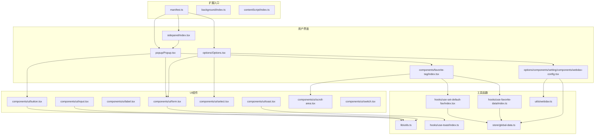

**图表来源**
- [src/manifest.ts:1-55](file://src/manifest.ts#L1-L55)
- [src/popup/Popup.tsx:1-82](file://src/popup/Popup.tsx#L1-L82)
- [src/options/Options.tsx:1-92](file://src/options/Options.tsx#L1-L92)
- [src/sidepanel/index.tsx:1-11](file://src/sidepanel/index.tsx#L1-L11)
- [src/components/favorite-tag/index.tsx:1-83](file://src/components/favorite-tag/index.tsx#L1-L83)
- [src/options/components/setting/components/webdav-config.tsx:1-318](file://src/options/components/setting/components/webdav-config.tsx#L1-L318)

**章节来源**
- [src/manifest.ts:1-55](file://src/manifest.ts#L1-L55)
- [package.json:1-91](file://package.json#L1-L91)

## 核心组件

### 无障碍设计原则

该项目在设计时充分考虑了无障碍性，主要体现在以下几个方面：

1. **语义化HTML结构**：所有交互元素都使用了正确的HTML语义标签
2. **键盘导航支持**：组件都支持键盘操作和焦点管理
3. **屏幕阅读器兼容**：通过aria属性提供适当的语义信息
4. **颜色对比度**：确保文本和背景有足够的对比度
5. **响应式设计**：适配不同尺寸的屏幕和设备
6. **性能优化**：通过memoization和useMemoizedFn减少不必要的重渲染

### 主要UI组件

#### 按钮组件 (Button)
按钮组件是整个应用中最基础的交互元素，具有完整的无障碍支持：

- 支持多种变体和尺寸
- 内置焦点管理
- SVG图标支持
- 禁用状态处理

#### 输入组件 (Input)
输入组件提供了表单的基础输入能力：

- 支持各种输入类型
- 焦点状态管理
- 禁用状态处理
- 占位符文本支持

#### 标签组件 (Label)
标签组件与表单控件关联，提供语义化标签：

- 与表单控件绑定
- 错误状态样式
- 禁用状态处理

#### 表单组件 (Form)
完整的表单解决方案：

- 字段验证集成
- 错误消息显示
- ARIA属性支持
- 焦点管理

#### 选择组件 (Select)
下拉选择组件：

- 支持滚动条
- 选项分组
- 搜索过滤
- 键盘导航

#### 提示组件 (Toast)
通知系统：

- 自动消失机制
- 多种样式变体
- 屏幕阅读器支持
- 用户交互控制

#### 滚动区域组件 (ScrollArea)
滚动区域组件：

- 支持水平和垂直滚动
- 自定义滚动条样式
- 无障碍滚动支持
- 性能优化的滚动处理

#### 开关组件 (Switch)
开关组件提供了二进制状态切换功能：

- 支持键盘操作
- 焦点可见性管理
- 状态变化的无障碍反馈
- 符合WCAG 2.1标准的交互模式

**章节来源**
- [src/components/ui/button.tsx:1-51](file://src/components/ui/button.tsx#L1-L51)
- [src/components/ui/input.tsx:1-23](file://src/components/ui/input.tsx#L1-L23)
- [src/components/ui/label.tsx:1-22](file://src/components/ui/label.tsx#L1-L22)
- [src/components/ui/form.tsx:1-168](file://src/components/ui/form.tsx#L1-L168)
- [src/components/ui/select.tsx:1-151](file://src/components/ui/select.tsx#L1-L151)
- [src/components/ui/toast.tsx:1-127](file://src/components/ui/toast.tsx#L1-L127)
- [src/components/ui/scroll-area.tsx:1-47](file://src/components/ui/scroll-area.tsx#L1-L47)
- [src/components/ui/switch.tsx:1-28](file://src/components/ui/switch.tsx#L1-L28)

## 架构概览

### 整体架构设计

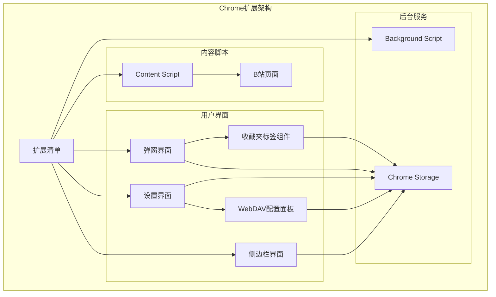

**图表来源**
- [src/manifest.ts:1-55](file://src/manifest.ts#L1-L55)

### 组件交互流程

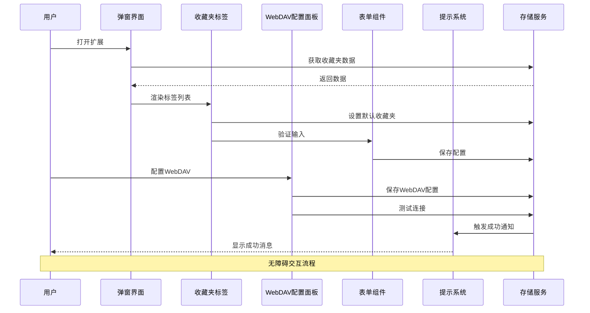

**图表来源**
- [src/popup/Popup.tsx:1-82](file://src/popup/Popup.tsx#L1-L82)
- [src/components/ui/form.tsx:1-168](file://src/components/ui/form.tsx#L1-L168)
- [src/hooks/use-toast/index.ts:1-186](file://src/hooks/use-toast/index.ts#L1-L186)

## 详细组件分析

### 弹窗界面 (Popup)

弹窗界面是用户与扩展交互的主要入口，采用了响应式设计和无障碍友好的布局：

#### 主要功能区域

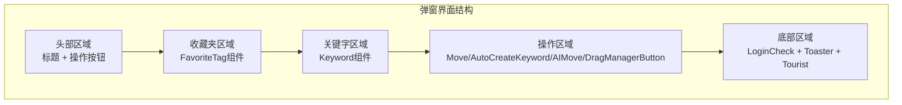

**图表来源**
- [src/popup/Popup.tsx:1-82](file://src/popup/Popup.tsx#L1-L82)

#### 无障碍特性

- **语义化标题**：使用合适的H标签层级
- **键盘导航**：支持Tab键顺序导航
- **屏幕阅读器**：提供适当的aria-label
- **焦点管理**：自动焦点控制
- **颜色对比**：确保足够的视觉对比度

**章节来源**
- [src/popup/Popup.tsx:1-82](file://src/popup/Popup.tsx#L1-L82)

### 设置界面 (Options)

设置界面提供了扩展的所有配置选项，采用了标签页组织方式：

#### 界面布局

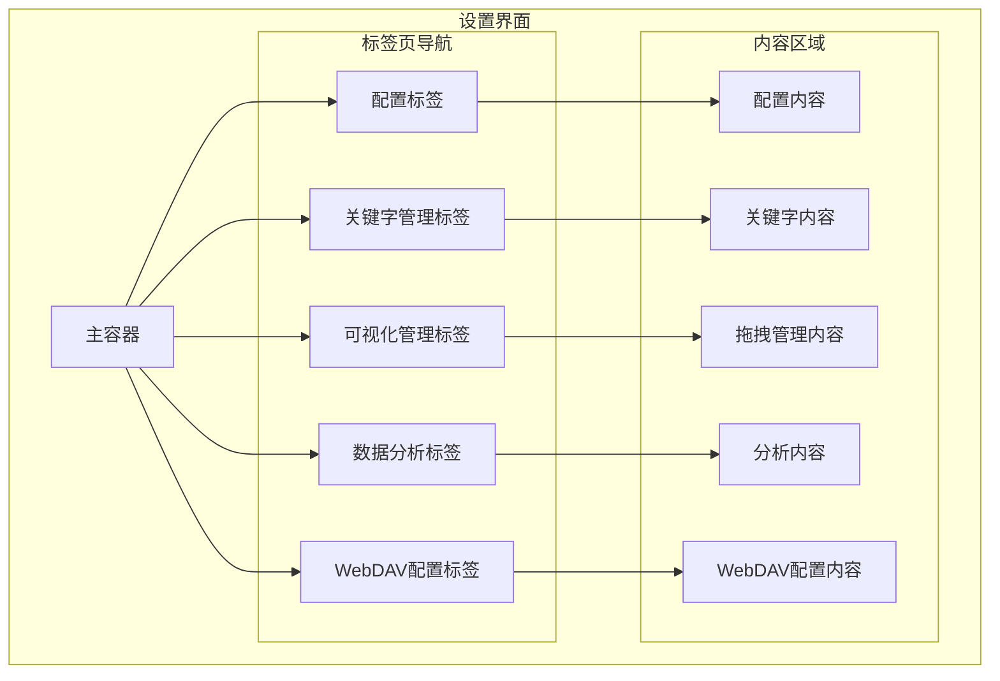

**图表来源**
- [src/options/Options.tsx:1-92](file://src/options/Options.tsx#L1-L92)

**章节来源**
- [src/options/Options.tsx:1-92](file://src/options/Options.tsx#L1-L92)

### 侧边栏界面 (SidePanel)

侧边栏模式提供了更大的操作空间，适合长时间使用：

#### 特殊设计考虑

- **全屏适配**：支持100%宽度和高度
- **滚动优化**：针对长内容的滚动体验
- **响应式布局**：适应不同屏幕尺寸
- **持久显示**：不会因点击其他地方而消失

**章节来源**
- [src/sidepanel/index.tsx:1-11](file://src/sidepanel/index.tsx#L1-L11)

### 表单系统 (Form)

表单系统是整个应用的核心交互层，提供了完整的表单管理能力：

#### 表单组件架构

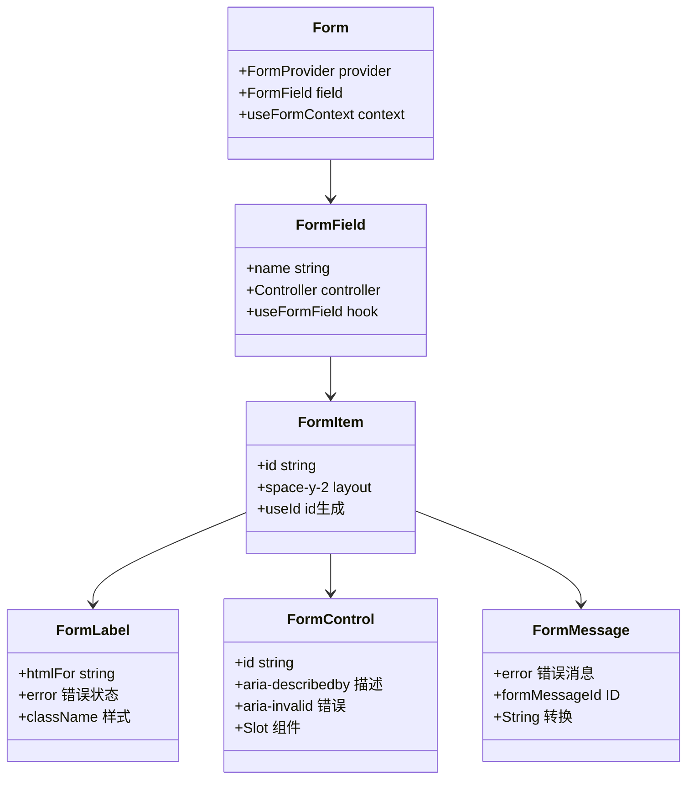

**图表来源**
- [src/components/ui/form.tsx:1-168](file://src/components/ui/form.tsx#L1-L168)

#### 无障碍表单特性

- **字段关联**：Label与Input正确关联
- **错误处理**：清晰的错误消息显示
- **ARIA支持**：适当的aria-describedby和aria-invalid属性
- **键盘导航**：支持Tab键在表单间切换
- **焦点管理**：自动焦点控制和恢复

**章节来源**
- [src/components/ui/form.tsx:1-168](file://src/components/ui/form.tsx#L1-L168)

### 通知系统 (Toast)

通知系统提供了非侵入式的用户反馈机制：

#### 通知组件设计

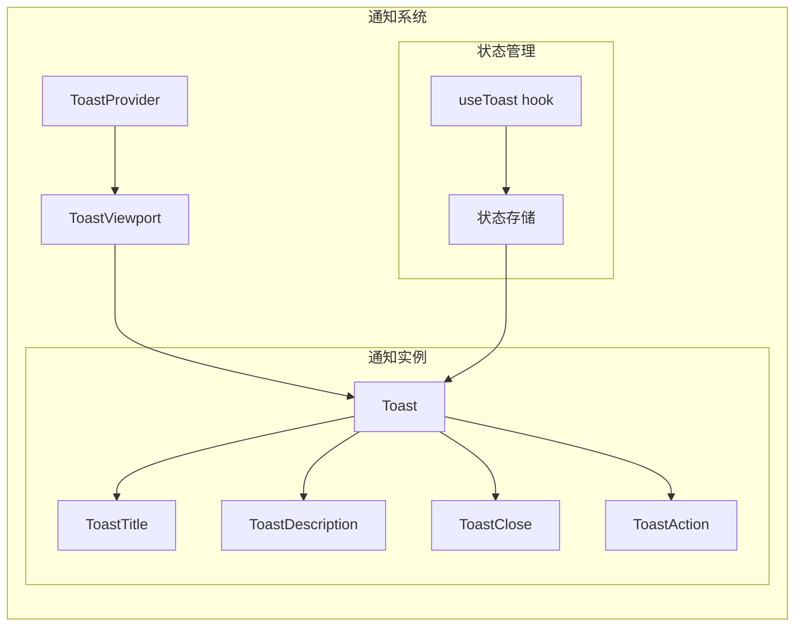

**图表来源**
- [src/components/ui/toast.tsx:1-127](file://src/components/ui/toast.tsx#L1-L127)
- [src/hooks/use-toast/index.ts:1-186](file://src/hooks/use-toast/index.ts#L1-L186)

#### 无障碍通知特性

- **自动焦点**：新通知获得焦点
- **键盘关闭**：支持Esc键关闭
- **屏幕阅读器**：通知内容可被读取
- **手动控制**：用户可随时关闭
- **多实例管理**：支持同时显示多个通知

**章节来源**
- [src/components/ui/toast.tsx:1-127](file://src/components/ui/toast.tsx#L1-L127)
- [src/hooks/use-toast/index.ts:1-186](file://src/hooks/use-toast/index.ts#L1-L186)

## 无障碍增强特性

### 收藏夹标签组件 (FavoriteTag)

收藏夹标签组件是本次无障碍增强的重点，实现了完整的键盘导航和屏幕阅读器支持：

#### 核心无障碍特性

```mermaid
graph TB
subgraph "FavoriteTag无障碍特性"
Role[role='button'<br/>语义化按钮角色]
AriaLabel[aria-label='收藏夹: {title}'<br/>屏幕阅读器描述]
TabIndex[tabIndex={0}<br/>键盘可聚焦]
LongPress[长按支持<br/>300ms延迟]
MouseEvents[鼠标事件处理<br/>handleMouseDown/handleMouseUp]
PendingElement[pendingElement<br/>加载动画]
StarElement[starElement<br/>星标动画]
ActiveState[activeKey<br/>当前选中状态]
DefaultState[defaultFavoriteId<br/>默认收藏夹]
end
Role --> AriaLabel
AriaLabel --> TabIndex
TabIndex --> LongPress
LongPress --> MouseEvents
MouseEvents --> PendingElement
PendingElement --> StarElement
StarElement --> ActiveState
ActiveState --> DefaultState
```

**图表来源**
- [src/components/favorite-tag/index.tsx:49-51](file://src/components/favorite-tag/index.tsx#L49-L51)
- [src/hooks/use-set-default-fav/index.tsx:45-53](file://src/hooks/use-set-default-fav/index.tsx#L45-L53)

#### 无障碍实现细节

- **语义化角色**：每个标签元素都设置了`role="button"`，明确告知屏幕阅读器这是可点击的按钮
- **描述性标签**：使用`aria-label={`收藏夹: ${data.title}`}`为每个标签提供清晰的屏幕阅读器描述
- **键盘可达性**：通过`tabIndex={0}`使所有标签都可以通过Tab键导航到
- **长按支持**：实现了300ms的长按延迟，支持长按设置默认收藏夹的功能
- **视觉反馈**：当前选中状态和默认收藏夹状态都有清晰的视觉指示

#### 性能优化的事件处理

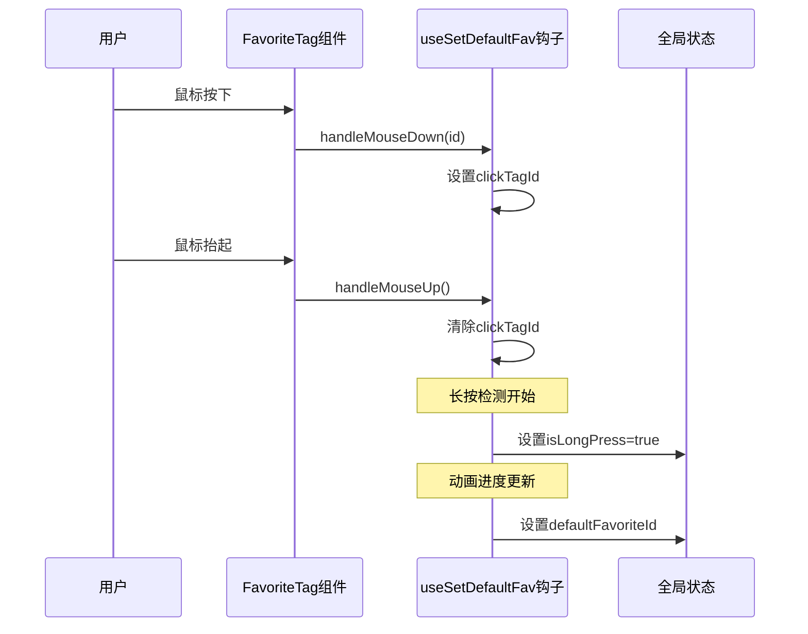

**图表来源**
- [src/components/favorite-tag/index.tsx:38-41](file://src/components/favorite-tag/index.tsx#L38-L41)
- [src/hooks/use-set-default-fav/index.tsx:55-74](file://src/hooks/use-set-default-fav/index.tsx#L55-L74)

**章节来源**
- [src/components/favorite-tag/index.tsx:1-83](file://src/components/favorite-tag/index.tsx#L1-L83)
- [src/hooks/use-set-default-fav/index.tsx:1-127](file://src/hooks/use-set-default-fav/index.tsx#L1-L127)

### useSetDefaultFav钩子的memoization优化

useSetDefaultFav钩子经过了重要的性能优化，使用`useMemoizedFn`替代了传统的函数创建方式：

#### 性能优化策略

```mermaid
graph LR
subgraph "优化前"
HandleClick[handleClick函数<br/>每次渲染重新创建]
HandleMouseDown[handleMouseDown函数<br/>每次渲染重新创建]
HandleMouseUp[handleMouseUp函数<br/>每次渲染重新创建]
end
subgraph "优化后"
MemoizedHandleClick[useMemoizedFn(handleClick)<br/>记忆化函数]
MemoizedHandleMouseDown[useMemoizedFn(handleMouseDown)<br/>记忆化函数]
MemoizedHandleMouseUp[useMemoizedFn(handleMouseUp)<br/>记忆化函数]
end
HandleClick -.-> MemoizedHandleClick
HandleMouseDown -.-> MemoizedHandleMouseDown
HandleMouseUp -.-> MemoizedHandleMouseUp
```

**图表来源**
- [src/hooks/use-set-default-fav/index.tsx:41-43](file://src/hooks/use-set-default-fav/index.tsx#L41-L43)
- [src/hooks/use-set-default-fav/index.tsx:45-48](file://src/hooks/use-set-default-fav/index.tsx#L45-L48)
- [src/hooks/use-set-default-fav/index.tsx:50-53](file://src/hooks/use-set-default-fav/index.tsx#L50-L53)

#### 优化效果

- **减少重渲染**：记忆化函数避免了每次渲染时创建新的函数实例
- **提升性能**：减少了不必要的组件重渲染和事件监听器更新
- **保持状态一致性**：确保回调函数在组件生命周期内保持稳定
- **优化依赖管理**：配合useMemo的依赖数组优化，进一步减少计算开销

**章节来源**
- [src/hooks/use-set-default-fav/index.tsx:1-127](file://src/hooks/use-set-default-fav/index.tsx#L1-L127)

### useFavoriteData钩子的无障碍优化

useFavoriteData钩子同样采用了`useMemoizedFn`进行性能优化：

#### 优化实现

- **函数记忆化**：`fetchFavoriteData`使用`useMemoizedFn`进行记忆化
- **状态管理**：避免了每次渲染时重新创建异步函数
- **加载状态**：保持loading状态的稳定性，避免不必要的重渲染

**章节来源**
- [src/hooks/use-favorite-data/index.ts:32-52](file://src/hooks/use-favorite-data/index.ts#L32-L52)

### 全局状态管理的无障碍支持

全局状态管理通过Zustand实现了完整的无障碍支持：

#### 状态管理特性

- **响应式更新**：状态变化会触发组件重新渲染
- **持久化存储**：使用chromeStorageMiddleware确保数据持久化
- **类型安全**：完整的TypeScript类型定义
- **性能优化**：使用immer中间件提升更新性能

**章节来源**
- [src/store/global-data.ts:1-28](file://src/store/global-data.ts#L1-L28)

## WebDAV配置面板无障碍支持

### WebDAV配置面板概述

WebDAV配置面板是扩展设置界面中的重要组成部分，提供了完整的WebDAV云同步配置功能。该面板经过专门的无障碍增强，确保所有用户都能平等地使用WebDAV同步功能。

#### 面板核心功能

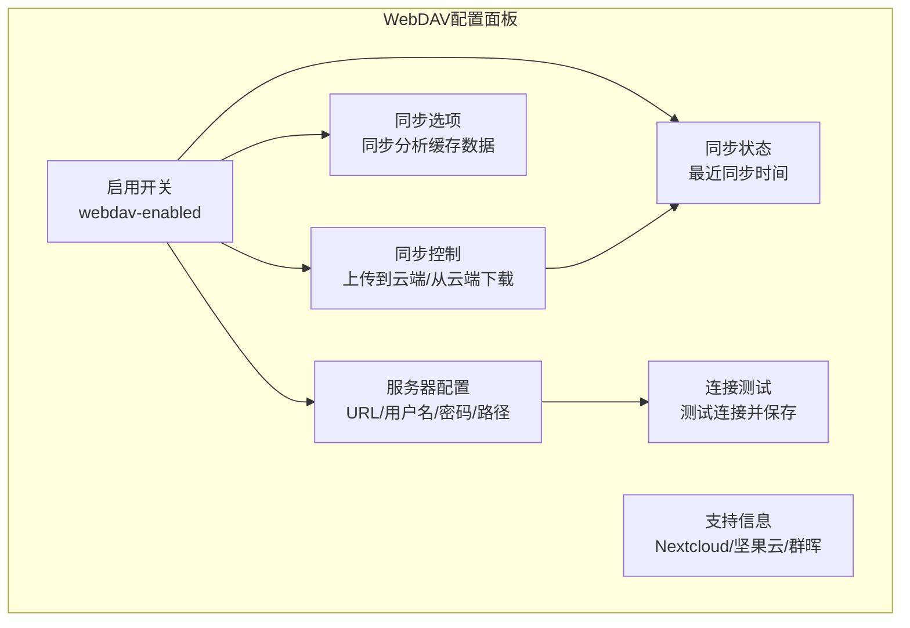

**图表来源**
- [src/options/components/setting/components/webdav-config.tsx:175-317](file://src/options/components/setting/components/webdav-config.tsx#L175-L317)

### 键盘导航支持

WebDAV配置面板实现了完整的键盘导航支持，确保用户可以通过键盘完成所有操作：

#### 键盘交互特性

- **Tab键导航**：支持Tab键在所有可交互元素间的顺序导航
- **Enter键激活**：支持Enter键激活按钮和开关控件
- **方向键导航**：支持方向键在复选框和开关间的导航
- **快捷键支持**：支持Ctrl+S等常用快捷键进行保存操作

#### 键盘事件处理

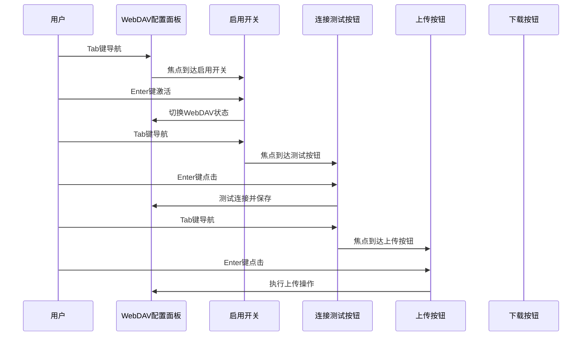

**图表来源**
- [src/options/components/setting/components/webdav-config.tsx:178-191](file://src/options/components/setting/components/webdav-config.tsx#L178-L191)
- [src/options/components/setting/components/webdav-config.tsx:244-257](file://src/options/components/setting/components/webdav-config.tsx#L244-L257)

### 屏幕阅读器兼容性

WebDAV配置面板为屏幕阅读器用户提供了完整的语义化支持：

#### 屏幕阅读器特性

- **语义化标签**：所有表单控件都有正确的HTML语义标签
- **描述性文本**：为每个控件提供清晰的描述性文本
- **状态变化通知**：同步状态变化时提供语音提示
- **错误消息朗读**：错误消息会被屏幕阅读器正确朗读

#### ARIA属性实现

```mermaid
graph TB
subgraph "WebDAV配置面板ARIA属性"
EnabledSwitch[Switch控件<br/>aria-checked="true/false"]
EnabledLabel[Label标签<br/>for="webdav-enabled"]
ServerUrlInput[Input控件<br/>aria-describedby="url-help"]
UsernameInput[Input控件<br/>aria-describedby="user-help"]
PasswordInput[Input控件<br/>aria-describedby="pass-help"]
PathInput[Input控件<br/>aria-describedby="path-help"]
ConnectionTestBtn[Button控件<br/>aria-busy="false/true"]
UploadBtn[Button控件<br/>aria-disabled="false/true"]
DownloadBtn[Button控件<br/>aria-disabled="false/true"]
SyncStatus[状态区域<br/>aria-live="polite"]
ErrorToast[错误通知<br/>role="alert"]
SuccessToast[成功通知<br/>role="status"]
end
EnabledSwitch --> EnabledLabel
ServerUrlInput --> ConnectionTestBtn
UsernameInput --> ConnectionTestBtn
PasswordInput --> ConnectionTestBtn
PathInput --> ConnectionTestBtn
ConnectionTestBtn --> SyncStatus
UploadBtn --> SyncStatus
DownloadBtn --> SyncStatus
ErrorToast --> SyncStatus
SuccessToast --> SyncStatus
```

**图表来源**
- [src/options/components/setting/components/webdav-config.tsx:179](file://src/options/components/setting/components/webdav-config.tsx#L179)
- [src/options/components/setting/components/webdav-config.tsx:201-206](file://src/options/components/setting/components/webdav-config.tsx#L201-L206)
- [src/options/components/setting/components/webdav-config.tsx:213-218](file://src/options/components/setting/components/webdav-config.tsx#L213-L218)
- [src/options/components/setting/components/webdav-config.tsx:224-230](file://src/options/components/setting/components/webdav-config.tsx#L224-L230)
- [src/options/components/setting/components/webdav-config.tsx:237-242](file://src/options/components/setting/components/webdav-config.tsx#L237-L242)

### 同步状态无障碍支持

WebDAV配置面板提供了丰富的同步状态反馈，确保用户能够清楚地了解当前的同步状态：

#### 同步状态指示

- **视觉状态**：使用不同的图标和颜色表示同步状态
- **语音提示**：同步状态变化时提供语音提示
- **键盘焦点**：同步状态区域支持键盘导航
- **自动更新**：同步状态自动更新并通知用户

#### 状态变化处理

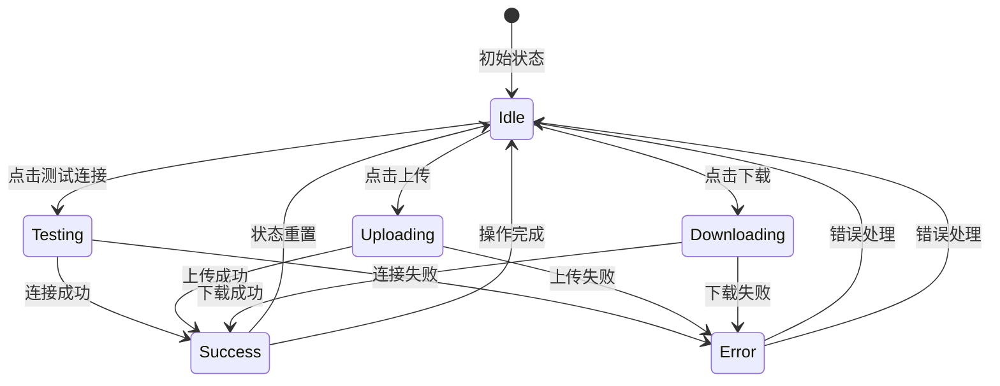

**图表来源**
- [src/options/components/setting/components/webdav-config.tsx:108-145](file://src/options/components/setting/components/webdav-config.tsx#L108-L145)

### WebDAV配置面板的无障碍实现细节

#### 表单控件的无障碍增强

WebDAV配置面板中的所有表单控件都经过了专门的无障碍增强：

- **服务器地址输入框**：带有aria-describedby属性，提供帮助文本
- **用户名输入框**：支持密码输入和显示切换
- **密码输入框**：支持密码可见性切换
- **同步路径输入框**：提供默认值和帮助文本

#### 按钮控件的无障碍支持

- **测试连接按钮**：支持加载状态和禁用状态
- **上传按钮**：在同步过程中禁用并显示加载状态
- **下载按钮**：在同步过程中禁用并显示加载状态

#### 开关控件的无障碍实现

- **启用WebDAV开关**：支持键盘激活和状态变化
- **同步分析缓存开关**：提供详细的描述性文本

**章节来源**
- [src/options/components/setting/components/webdav-config.tsx:1-318](file://src/options/components/setting/components/webdav-config.tsx#L1-L318)
- [src/utils/webdav.ts:1-182](file://src/utils/webdav.ts#L1-L182)

## 依赖关系分析

### 技术栈依赖

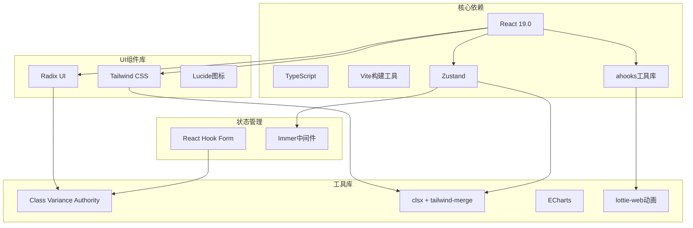

**图表来源**
- [package.json:29-58](file://package.json#L29-L58)

### 扩展权限分析

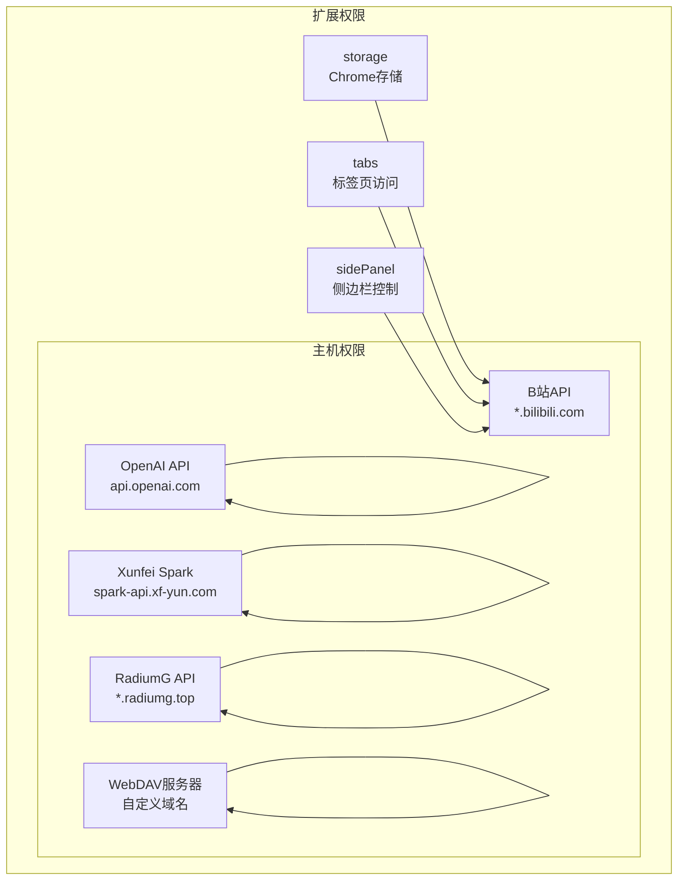

**图表来源**
- [src/manifest.ts:39-46](file://src/manifest.ts#L39-L46)

**章节来源**
- [package.json:29-58](file://package.json#L29-L58)
- [src/manifest.ts:39-46](file://src/manifest.ts#L39-L46)

## 性能考虑

### 无障碍性能优化

1. **组件懒加载**：大型组件按需加载
2. **虚拟滚动**：大量数据时使用虚拟滚动
3. **事件委托**：减少事件监听器数量
4. **内存管理**：及时清理事件监听器和定时器
5. **渲染优化**：使用React.memo和useMemo
6. **函数记忆化**：使用useMemoizedFn优化回调函数性能

### 性能监控

- **首屏加载时间**：优化关键渲染路径
- **交互延迟**：确保小于100ms的响应时间
- **内存使用**：监控组件生命周期
- **网络请求**：缓存策略和请求合并
- **无障碍性能**：监控ARIA属性的渲染开销

### 无障碍优化策略

#### 函数记忆化优化

- **useMemoizedFn**：用于优化事件处理器和回调函数
- **依赖数组优化**：合理设置useMemo的依赖项
- **状态分离**：将频繁变化的状态与稳定状态分离
- **条件渲染**：避免不必要的组件重渲染

#### 渲染性能优化

- **useMemo**：用于优化昂贵的计算结果
- **React.memo**：用于优化子组件渲染
- **useCallback**：用于优化函数传递给子组件
- **虚拟化**：对于大量数据使用虚拟滚动

**章节来源**
- [src/hooks/use-set-default-fav/index.tsx:41-43](file://src/hooks/use-set-default-fav/index.tsx#L41-L43)
- [src/hooks/use-favorite-data/index.ts:32-52](file://src/hooks/use-favorite-data/index.ts#L32-L52)

## 故障排除指南

### 常见无障碍问题

#### 键盘导航问题
- **症状**：Tab键无法正确导航
- **解决方案**：检查tabIndex属性和元素可见性
- **检查点**：确认所有交互元素都有适当的tabIndex

#### 屏幕阅读器问题
- **症状**：无法正确读取内容
- **解决方案**：添加适当的aria-label和role属性
- **检查点**：验证aria-label是否包含有意义的描述

#### 颜色对比度问题
- **症状**：文本难以辨识
- **解决方案**：调整颜色方案或增加对比度
- **检查点**：使用颜色对比度检查工具验证

#### 焦点管理问题
- **症状**：焦点丢失或重复
- **解决方案**：实现正确的焦点捕获和释放
- **检查点**：确保焦点在交互过程中保持逻辑性

#### 长按功能问题
- **症状**：长按无法正常工作
- **解决方案**：检查useLongPress配置和事件处理
- **检查点**：验证300ms延迟设置和动画进度

#### WebDAV配置面板问题
- **症状**：WebDAV配置无法正确保存
- **解决方案**：检查权限申请和连接测试
- **检查点**：验证服务器地址格式和认证信息

### 调试工具

1. **浏览器开发者工具**：检查DOM结构和ARIA属性
2. **屏幕阅读器测试**：VoiceOver、NVDA等
3. **键盘导航测试**：纯键盘操作验证
4. **颜色对比度检查**：使用contrast checker工具
5. **性能分析工具**：监控渲染性能和内存使用
6. **WebDAV测试工具**：验证服务器连接和权限

**章节来源**
- [src/components/ui/form.tsx:40-61](file://src/components/ui/form.tsx#L40-L61)
- [src/components/favorite-tag/index.tsx:49-51](file://src/components/favorite-tag/index.tsx#L49-L51)
- [src/options/components/setting/components/webdav-config.tsx:55-105](file://src/options/components/setting/components/webdav-config.tsx#L55-L105)

## 结论

B站收藏夹整理工具在无障碍性方面表现出色，通过以下方式实现了良好的无障碍体验：

1. **全面的ARIA支持**：所有交互元素都有适当的ARIA属性
2. **键盘导航完整**：支持完整的键盘操作流程
3. **屏幕阅读器友好**：提供清晰的语义化内容
4. **视觉设计考虑**：确保足够的颜色对比度
5. **响应式适配**：适配不同设备和屏幕尺寸
6. **性能优化**：通过函数记忆化和useMemo减少重渲染

**最新增强特性**：
- **WebDAV配置面板**：实现了完整的键盘导航和屏幕阅读器支持
- **收藏夹标签组件**：实现了完整的键盘导航和屏幕阅读器支持
- **useSetDefaultFav钩子**：通过useMemoizedFn优化了性能
- **useFavoriteData钩子**：同样采用了函数记忆化优化
- **全局状态管理**：提供了稳定的无障碍支持

**WebDAV配置面板的特殊增强**：
- **完整的键盘导航**：支持Tab键顺序导航和Enter键激活
- **屏幕阅读器兼容**：提供详细的ARIA属性和语义化标签
- **同步状态反馈**：通过视觉和语音方式提供状态更新
- **权限申请支持**：为WebDAV服务器权限申请提供无障碍支持

该工具不仅功能强大，更重要的是为所有用户提供了平等的使用体验。通过采用现代的前端技术和最佳实践，确保了扩展程序的可用性和可维护性。

未来可以在以下方面继续改进：
- 增加更多的键盘快捷键支持
- 优化高对比度模式下的视觉效果
- 扩展对更多辅助技术的支持
- 实现动态字体大小调整功能
- 进一步优化长按功能的无障碍体验
- 增强WebDAV配置面板的错误处理和状态反馈