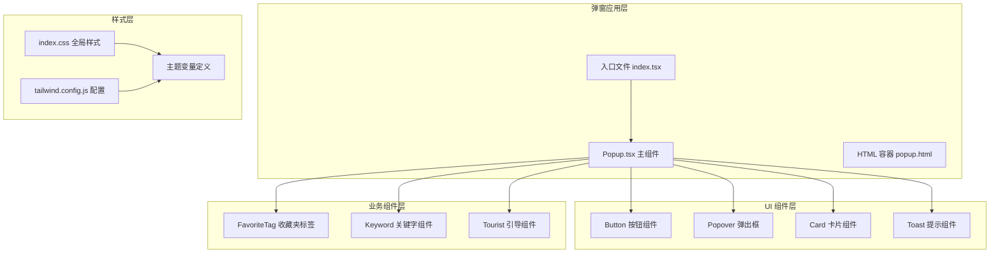
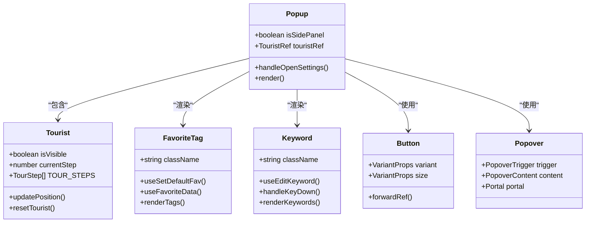
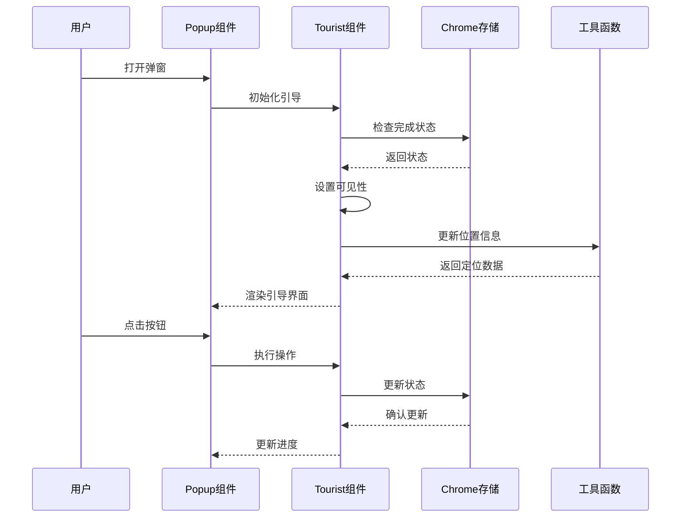
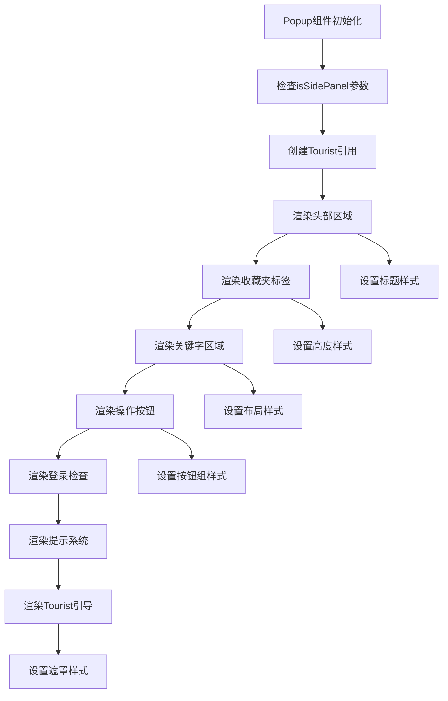
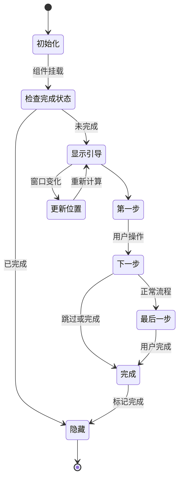
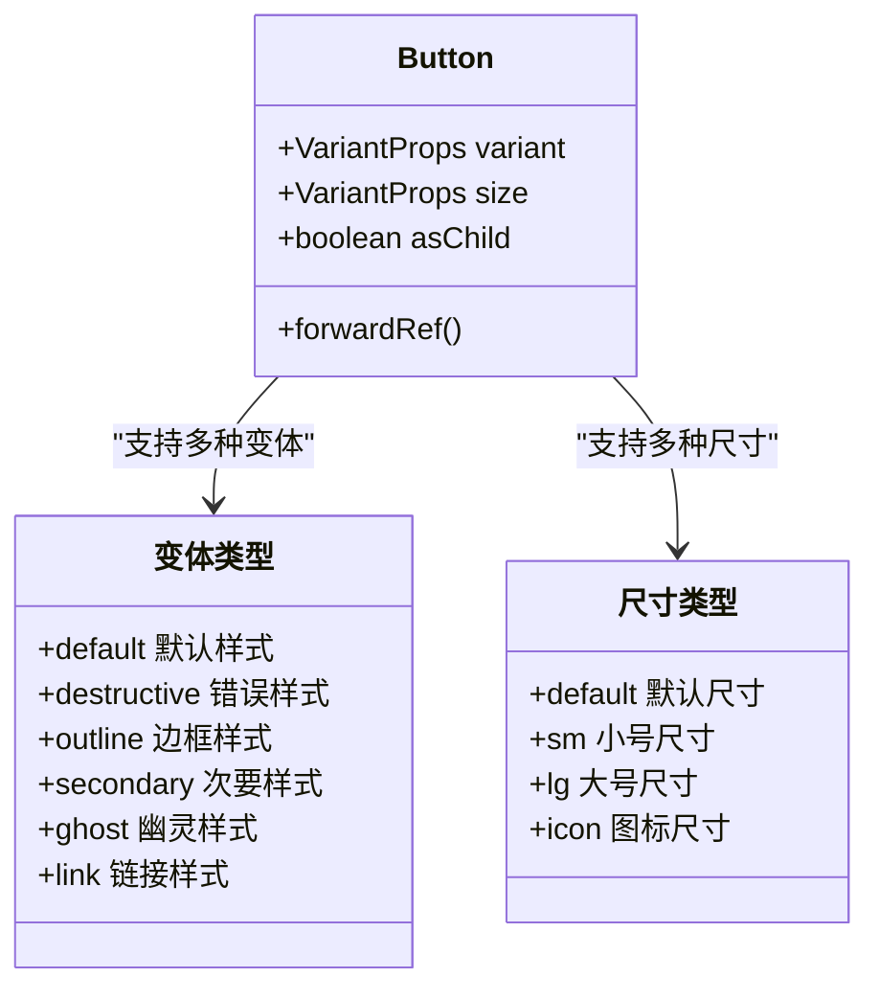
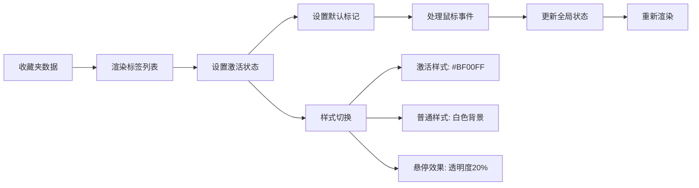
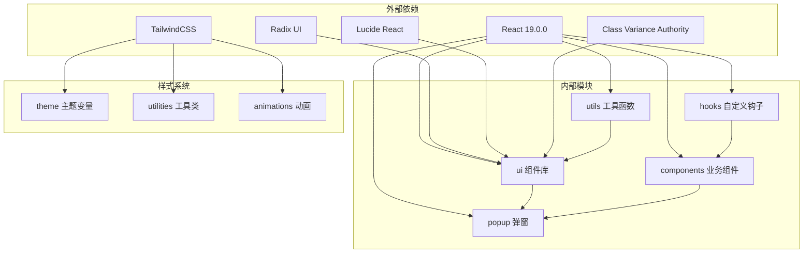
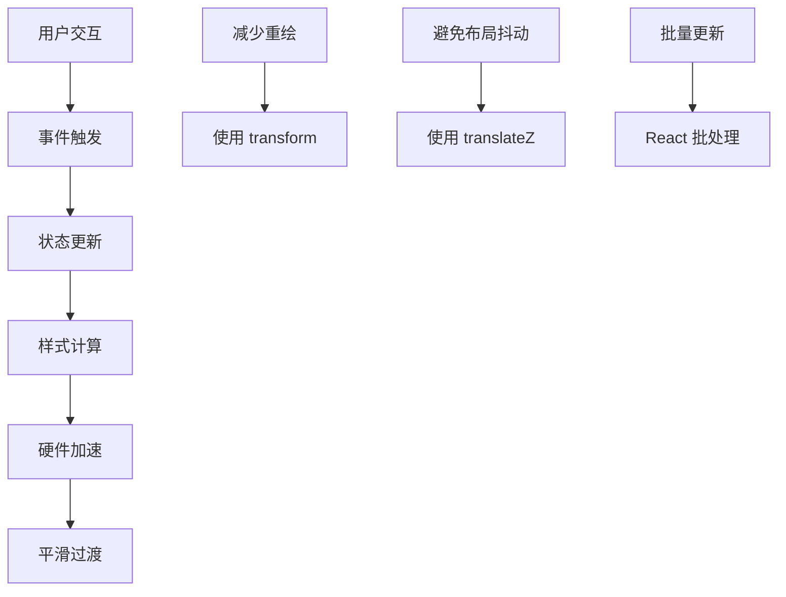

# 弹窗样式系统

<cite>
**本文档引用的文件**
- [src/popup/index.tsx](file://src/popup/index.tsx)
- [src/popup/index.css](file://src/popup/index.css)
- [src/popup/Popup.tsx](file://src/popup/Popup.tsx)
- [src/components/ui/popover.tsx](file://src/components/ui/popover.tsx)
- [src/lib/utils.ts](file://src/lib/utils.ts)
- [src/components/ui/button.tsx](file://src/components/ui/button.tsx)
- [src/components/ui/toaster.tsx](file://src/components/ui/toaster.tsx)
- [src/components/ui/toast.tsx](file://src/components/ui/toast.tsx)
- [src/components/ui/card.tsx](file://src/components/ui/card.tsx)
- [src/popup/components/tourist/index.tsx](file://src/popup/components/tourist/index.tsx)
- [src/popup/components/tourist/use-tourist.ts](file://src/popup/components/tourist/use-tourist.ts)
- [src/options/index.css](file://src/options/index.css)
- [tailwind.config.js](file://tailwind.config.js)
- [popup.html](file://popup.html)
- [src/components/favorite-tag/index.tsx](file://src/components/favorite-tag/index.tsx)
- [src/components/keyword/index.tsx](file://src/components/keyword/index.tsx)
</cite>

## 目录
1. [简介](#简介)
2. [项目结构](#项目结构)
3. [核心组件](#核心组件)
4. [架构概览](#架构概览)
5. [详细组件分析](#详细组件分析)
6. [依赖关系分析](#依赖关系分析)
7. [性能考虑](#性能考虑)
8. [故障排除指南](#故障排除指南)
9. [结论](#结论)

## 简介

本项目是一个基于 React 和 TailwindCSS 的浏览器扩展弹窗样式系统。该系统采用现代化的设计理念，结合多巴胺色彩方案和渐变效果，为用户提供了美观且功能丰富的收藏夹管理界面。系统通过自定义主题变量、响应式设计和动画效果，实现了统一且协调的视觉体验。

## 项目结构

弹窗样式系统主要由以下层次组成：



**图表来源**
- [src/popup/Popup.tsx:1-82](file://src/popup/Popup.tsx#L1-L82)
- [src/popup/index.tsx:1-17](file://src/popup/index.tsx#L1-L17)
- [src/popup/index.css:1-100](file://src/popup/index.css#L1-L100)

**章节来源**
- [src/popup/Popup.tsx:1-82](file://src/popup/Popup.tsx#L1-L82)
- [src/popup/index.tsx:1-17](file://src/popup/index.tsx#L1-L17)
- [src/popup/index.css:1-100](file://src/popup/index.css#L1-L100)

## 核心组件

### 主要组件架构

弹窗系统的核心组件采用分层设计，每个组件都有明确的职责分工：



**图表来源**
- [src/popup/Popup.tsx:10-82](file://src/popup/Popup.tsx#L10-L82)
- [src/popup/components/tourist/index.tsx:63-294](file://src/popup/components/tourist/index.tsx#L63-L294)
- [src/components/favorite-tag/index.tsx:9-78](file://src/components/favorite-tag/index.tsx#L9-L78)
- [src/components/keyword/index.tsx:6-36](file://src/components/keyword/index.tsx#L6-L36)

### 样式系统架构

系统采用多层样式架构，确保样式的可维护性和一致性：

```mermaid
flowchart TD
A[主题变量定义] --> B[颜色系统]
A --> C[尺寸系统]
A --> D[动画系统]
B --> E[主色调: #BF00FF]
B --> F[辅色调: #FF1493]
B --> G[强调色: #00FFFF]
C --> H[圆角半径: var(--radius)]
C --> I[字体大小: 基于 Tailwind]
D --> J[过渡动画: duration-200/300]
D --> K[悬停效果: hover:bg-opacity-20]
D --> L[焦点状态: outline-ring]
E --> M[全局样式应用]
F --> M
G --> M
H --> M
I --> M
J --> M
K --> M
L --> M
```

**图表来源**
- [tailwind.config.js:14-62](file://tailwind.config.js#L14-L62)
- [src/popup/index.css:5-60](file://src/popup/index.css#L5-L60)

**章节来源**
- [src/popup/Popup.tsx:14-82](file://src/popup/Popup.tsx#L14-L82)
- [src/popup/components/tourist/index.tsx:67-294](file://src/popup/components/tourist/index.tsx#L67-L294)
- [src/components/favorite-tag/index.tsx:13-78](file://src/components/favorite-tag/index.tsx#L13-L78)

## 架构概览

弹窗样式系统采用模块化架构，各组件之间通过清晰的接口进行通信：



**图表来源**
- [src/popup/Popup.tsx:16-77](file://src/popup/Popup.tsx#L16-L77)
- [src/popup/components/tourist/use-tourist.ts:20-84](file://src/popup/components/tourist/use-tourist.ts#L20-L84)

## 详细组件分析

### 弹窗主组件分析

Popup.tsx 作为弹窗的核心组件，负责整体布局和组件协调：



**图表来源**
- [src/popup/Popup.tsx:22-78](file://src/popup/Popup.tsx#L22-L78)

#### 样式特性分析

弹窗组件采用了多层次的样式设计：

1. **背景渐变系统**：使用 `bg-b-primary bg-opacity-15` 实现淡紫色渐变背景
2. **响应式布局**：根据 `isSidePanel` 参数动态调整宽度和高度
3. **阴影系统**：通过 `shadow-sm` 和 `shadow-b-primary/30` 实现立体感
4. **过渡动画**：统一的 `duration-200` 过渡效果

**章节来源**
- [src/popup/Popup.tsx:23-27](file://src/popup/Popup.tsx#L23-L27)
- [src/popup/Popup.tsx:57-64](file://src/popup/Popup.tsx#L57-L64)

### 引导系统组件分析

Tourist 组件实现了完整的用户引导功能：



**图表来源**
- [src/popup/components/tourist/use-tourist.ts:20-84](file://src/popup/components/tourist/use-tourist.ts#L20-L84)
- [src/popup/components/tourist/index.tsx:67-148](file://src/popup/components/tourist/index.tsx#L67-L148)

#### 引导步骤设计

引导系统包含四个精心设计的步骤：

| 步骤 | 目标元素 | 标题 | 功能描述 |
|------|----------|------|----------|
| 1 | `[data-tour="favorites"]` | 收藏夹列表 | 展示收藏夹选择功能 |
| 2 | `[data-tour="favorites"] [data-id]` | 设置默认收藏夹 | 长按标记默认文件夹 |
| 3 | `[data-tour="keywords"]` | 关键字过滤 | 关键字设置和筛选 |
| 4 | `[data-tour="actions"]` | 智能操作 | 批量移动和AI分类 |

**章节来源**
- [src/popup/components/tourist/index.tsx:20-50](file://src/popup/components/tourist/index.tsx#L20-L50)
- [src/popup/components/tourist/use-tourist.ts:20-30](file://src/popup/components/tourist/use-tourist.ts#L20-L30)

### UI 组件系统分析

系统采用统一的 UI 组件库，确保视觉一致性和开发效率：

#### 按钮组件分析

Button 组件使用了变体模式系统：



**图表来源**
- [src/components/ui/button.tsx:7-32](file://src/components/ui/button.tsx#L7-L32)

#### 弹出框组件分析

Popover 组件提供了灵活的弹出内容展示：

| 属性 | 默认值 | 描述 |
|------|--------|------|
| `align` | `'center'` | 对齐方式 |
| `sideOffset` | `4` | 偏移像素 |
| `className` | `''` | 自定义类名 |
| `children` | `null` | 内容子元素 |

**章节来源**
- [src/components/ui/button.tsx:40-51](file://src/components/ui/button.tsx#L40-L51)
- [src/components/ui/popover.tsx:9-33](file://src/components/ui/popover.tsx#L9-L33)

### 业务组件分析

#### 收藏夹标签组件

FavoriteTag 组件实现了交互式的收藏夹选择功能：



**图表来源**
- [src/components/favorite-tag/index.tsx:25-62](file://src/components/favorite-tag/index.tsx#L25-L62)

#### 关键字组件分析

Keyword 组件提供了关键字管理和输入功能：

| 功能特性 | 实现方式 | 样式效果 |
|----------|----------|----------|
| 关键字显示 | Flex 布局 | 自动换行 |
| 输入框交互 | Focus 样式 | 边框高亮 |
| 删除功能 | Backspace 事件 | 即时删除 |
| 添加功能 | Enter 键事件 | 新增标签 |

**章节来源**
- [src/components/favorite-tag/index.tsx:13-78](file://src/components/favorite-tag/index.tsx#L13-L78)
- [src/components/keyword/index.tsx:10-36](file://src/components/keyword/index.tsx#L10-L36)

## 依赖关系分析

系统采用模块化的依赖管理，确保组件间的松耦合：



**图表来源**
- [package.json:29-58](file://package.json#L29-L58)
- [tailwind.config.js:65-116](file://tailwind.config.js#L65-L116)

### 核心依赖特性

| 依赖包 | 版本 | 主要功能 | 在样式系统中的作用 |
|--------|------|----------|-------------------|
| `react` | ^19.0.0 | 核心框架 | 提供组件基础 |
| `tailwindcss` | ^3.4.17 | CSS 框架 | 样式生成和主题 |
| `@radix-ui/react-popover` | ^1.1.15 | UI 组件 | 弹出框功能 |
| `lucide-react` | ^0.469.0 | 图标库 | 图标渲染 |
| `class-variance-authority` | ^0.7.1 | 变体系统 | 组件变体管理 |

**章节来源**
- [package.json:29-58](file://package.json#L29-L58)
- [tailwind.config.js:14-62](file://tailwind.config.js#L14-L62)

## 性能考虑

### 样式优化策略

系统采用了多项性能优化措施：

1. **CSS 变量缓存**：通过 `:root` 和 `.dark` 类型预定义所有颜色变量
2. **Tailwind 合并与去重**：使用 `tailwind-merge` 避免重复样式类
3. **条件渲染优化**：引导组件仅在需要时渲染
4. **事件处理优化**：使用 `useMemoizedFn` 缓存回调函数

### 动画性能

系统实现了流畅的动画效果：



**图表来源**
- [src/popup/index.css:90-100](file://src/popup/index.css#L90-L100)
- [src/lib/utils.ts:4-6](file://src/lib/utils.ts#L4-L6)

## 故障排除指南

### 常见问题及解决方案

| 问题类型 | 症状 | 可能原因 | 解决方案 |
|----------|------|----------|----------|
| 样式不生效 | 组件显示异常 | Tailwind 配置错误 | 检查 tailwind.config.js |
| 颜色不正确 | 主题颜色异常 | CSS 变量覆盖 | 验证主题变量定义 |
| 动画卡顿 | 过渡效果不流畅 | 性能问题 | 检查硬件加速 |
| 引导不显示 | Tourist 组件隐藏 | 存储状态问题 | 清除浏览器存储 |

### 调试工具

1. **React DevTools**：检查组件树和状态
2. **浏览器开发者工具**：分析样式和布局
3. **Tailwind CSS 插件**：验证类名生成
4. **Chrome 扩展调试**：检查扩展特定问题

**章节来源**
- [src/popup/components/tourist/use-tourist.ts:54-58](file://src/popup/components/tourist/use-tourist.ts#L54-L58)
- [src/popup/index.css:90-100](file://src/popup/index.css#L90-L100)

## 结论

弹窗样式系统通过精心设计的主题变量、统一的组件架构和优化的性能策略，成功构建了一个既美观又实用的用户界面。系统的主要优势包括：

1. **一致性**：通过主题变量和组件库确保视觉一致性
2. **可维护性**：模块化设计便于功能扩展和维护
3. **性能**：优化的样式计算和动画效果提供流畅体验
4. **可访问性**：完善的键盘导航和屏幕阅读器支持

该系统为浏览器扩展的弹窗界面提供了一个优秀的参考实现，展示了现代前端开发的最佳实践。