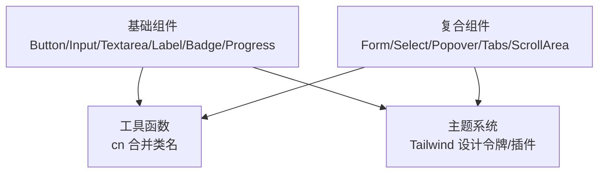
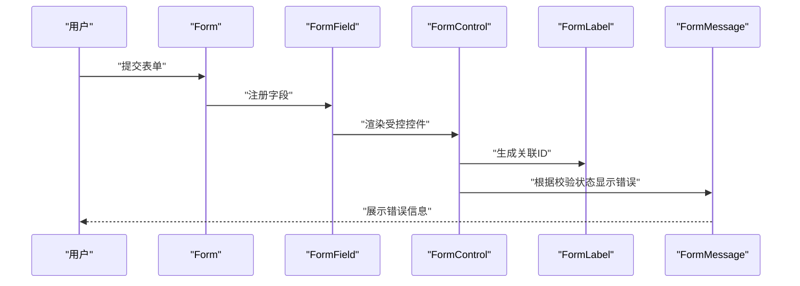
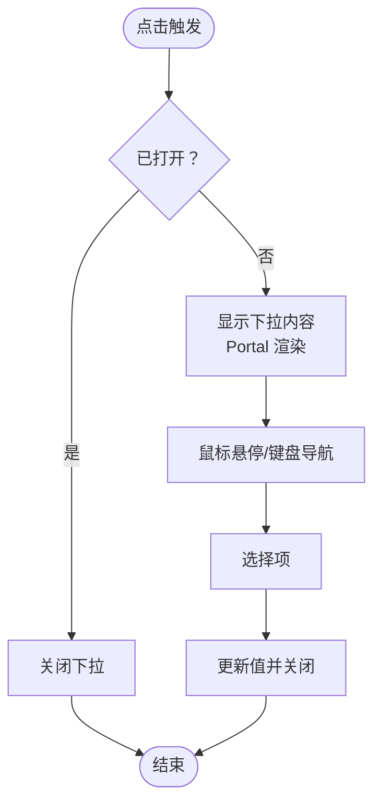
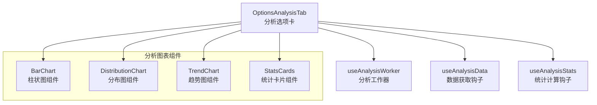
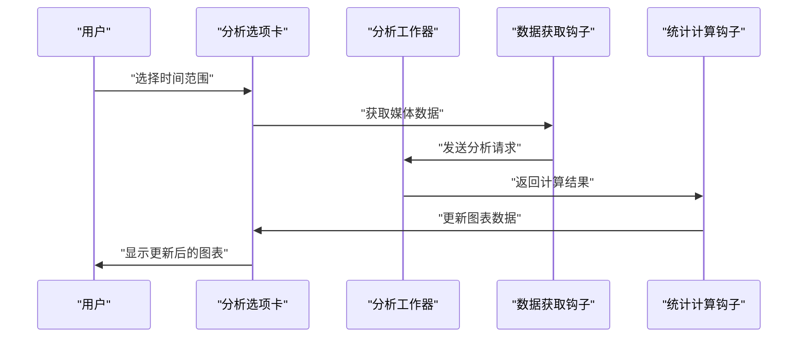
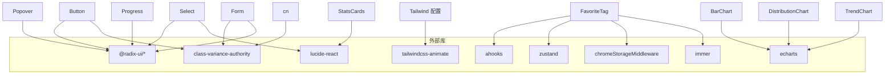

# UI组件系统

<cite>
**本文引用的文件**
- [src/components/ui/button.tsx](file://src/components/ui/button.tsx)
- [src/components/ui/input.tsx](file://src/components/ui/input.tsx)
- [src/components/ui/form.tsx](file://src/components/ui/form.tsx)
- [src/components/ui/card.tsx](file://src/components/ui/card.tsx)
- [src/components/ui/select.tsx](file://src/components/ui/select.tsx)
- [src/components/ui/textarea.tsx](file://src/components/ui/textarea.tsx)
- [src/components/ui/label.tsx](file://src/components/ui/label.tsx)
- [src/components/ui/popover.tsx](file://src/components/ui/popover.tsx)
- [src/components/ui/badge.tsx](file://src/components/ui/badge.tsx)
- [src/components/ui/progress.tsx](file://src/components/ui/progress.tsx)
- [src/components/ui/skeleton.tsx](file://src/components/ui/skeleton.tsx)
- [src/components/ui/slider.tsx](file://src/components/ui/slider.tsx)
- [src/components/ui/tabs.tsx](file://src/components/ui/tabs.tsx)
- [src/components/ui/scroll-area.tsx](file://src/components/ui/scroll-area.tsx)
- [src/components/ui/toast.tsx](file://src/components/ui/toast.tsx)
- [src/components/ui/toaster.tsx](file://src/components/ui/toaster.tsx)
- [src/components/index.ts](file://src/components/index.ts)
- [src/lib/utils.ts](file://src/lib/utils.ts)
- [tailwind.config.js](file://tailwind.config.js)
- [postcss.config.js](file://postcss.config.js)
- [src/popup/index.css](file://src/popup/index.css)
- [src/popup/index.tsx](file://src/popup/index.tsx)
- [src/popup/Popup.tsx](file://src/popup/Popup.tsx)
- [src/popup/components/move/index.tsx](file://src/popup/components/move/index.tsx)
- [src/popup/components/login-check/index.tsx](file://src/popup/components/login-check/index.tsx)
- [src/popup/components/auto-create-keyword/index.tsx](file://src/popup/components/auto-create-keyword/index.tsx)
- [src/options/index.css](file://src/options/index.css)
- [src/options/Options.tsx](file://src/options/Options.tsx)
- [src/hooks/use-toast/index.ts](file://src/hooks/use-toast/index.ts)
- [src/components/favorite-tag/index.tsx](file://src/components/favorite-tag/index.tsx)
- [src/hooks/use-set-default-fav/index.tsx](file://src/hooks/use-set-default-fav/index.tsx)
- [src/hooks/use-favorite-data/index.ts](file://src/hooks/use-favorite-data/index.ts)
- [src/store/global-data.ts](file://src/store/global-data.ts)
- [src/options/components/analysis/chart/bar-chart.tsx](file://src/options/components/analysis/chart/bar-chart.tsx)
- [src/options/components/analysis/chart/distribution-chart.tsx](file://src/options/components/analysis/chart/distribution-chart.tsx)
- [src/options/components/analysis/chart/trend-chart.tsx](file://src/options/components/analysis/chart/trend-chart.tsx)
- [src/options/components/analysis/options-analysis-tab.tsx](file://src/options/components/analysis/options-analysis-tab.tsx)
- [src/options/components/analysis/stats-cards.tsx](file://src/options/components/analysis/stats-cards.tsx)
- [src/options/components/analysis/index.ts](file://src/options/components/analysis/index.ts)
</cite>

## 更新摘要
**所做更改**
- 新增favorite-tag组件稳定性改进章节，详细说明useMemo依赖数组扩展
- 更新核心组件无障碍特性说明，包括按钮、选择器、滑块、标签页、吐司组件
- 增强表单组件的可访问性特性，包括自动ARIA属性注入
- 新增无障碍性最佳实践和故障排查指南
- 更新样式系统重大改进章节，反映popup样式系统的全新B站品牌色彩体系
- **更新BarChart组件颜色方案重大变更**：从蓝色渐变(#83bff6, #188df0)改为现代蓝(#5CC3F0, #00AEEC)，添加圆角边框(4像素)增强视觉效果

## 目录
1. [简介](#简介)
2. [项目结构](#项目结构)
3. [核心组件](#核心组件)
4. [架构总览](#架构总览)
5. [详细组件分析](#详细组件分析)
6. [favorite-tag组件稳定性改进](#favorite-tag组件稳定性改进)
7. [无障碍性改进](#无障碍性改进)
8. [样式系统重大改进](#样式系统重大改进)
9. [分析图表组件系统](#分析图表组件系统)
10. [依赖关系分析](#依赖关系分析)
11. [性能考量](#性能考量)
12. [故障排查指南](#故障排查指南)
13. [结论](#结论)
14. [附录](#附录)

## 简介
本文件系统化梳理 B站收藏夹整理工具的UI组件体系，围绕以下设计理念展开：
- 基于 Radix UI 的无障碍与语义化设计：通过语义化标签、键盘可达性、ARIA 属性与动画过渡，确保可访问性与一致性。
- Tailwind CSS 实用优先的样式系统：以原子化类名与设计令牌（CSS变量）驱动主题与风格，结合合并工具实现样式冲突最小化。

组件覆盖从基础输入控件到复合交互组件（如表单、选择器、弹出层、进度条、标签页等），并提供组合模式、复用策略、响应式与跨浏览器兼容建议、可访问性与国际化支持说明，以及主题定制与样式扩展方法。

**更新**：本次更新重点介绍了favorite-tag组件的稳定性改进，通过扩展useMemo依赖数组显著提升了组件的性能和可靠性。同时新增了全面的无障碍性改进章节，涵盖ARIA属性、键盘导航、屏幕阅读器兼容性，以及UI组件的可访问性增强。样式系统也进行了重大改进，包括全新的B站品牌色彩体系（#BF00FF主色调）、暗色模式增强、滚动条样式系统、字体优化和交互增强等。**BarChart组件也经历了重大视觉更新，采用了现代化的蓝色渐变方案和圆角边框设计。**

## 项目结构
UI组件集中位于 src/components/ui 下，采用"按功能拆分"的模块化组织方式；公共工具函数 cn 负责类名合并；Tailwind 配置通过设计令牌与插件扩展提供统一主题与滚动条样式。

```mermaid
graph TB
subgraph "UI 组件"
Btn["Button<br/>按钮"]
Inp["Input<br/>输入框"]
Txt["Textarea<br/>多行文本"]
Lbl["Label<br/>标签"]
Card["Card<br/>卡片容器"]
Sel["Select<br/>选择器"]
Pop["Popover<br/>弹出层"]
Bad["Badge<br/>徽章"]
Prog["Progress<br/>进度条"]
Form["Form/Form*<br/>表单体系"]
Tabs["Tabs<br/>标签页"]
Scroll["ScrollArea<br/>滚动区域"]
Skin["Skeleton<br/>骨架屏"]
Slider["Slider<br/>滑块"]
Toast["Toast<br/>提示消息"]
Toaster["Toaster<br/>消息栈"]
FTag["FavoriteTag<br/>收藏夹标签"]
end
Utils["cn 合并工具"]
TW["Tailwind 配置<br/>设计令牌/插件"]
Btn --> Utils
Inp --> Utils
Txt --> Utils
Lbl --> Utils
Card --> Utils
Sel --> Utils
Pop --> Utils
Bad --> Utils
Prog --> Utils
Form --> Utils
Tabs --> Utils
Scroll --> Utils
Skin --> Utils
Slider --> Utils
Toast --> Utils
Toaster --> Utils
FTag --> Utils
FTag --> TW
Btn --> TW
Inp --> TW
Txt --> TW
Lbl --> TW
Card --> TW
Sel --> TW
Pop --> TW
Bad --> TW
Prog --> TW
Form --> TW
Tabs --> TW
Scroll --> TW
Skin --> TW
Slider --> TW
Toast --> TW
Toaster --> TW
```



**图表来源**
- [src/components/ui/button.tsx:1-51](file://src/components/ui/button.tsx#L1-L51)
- [src/components/ui/input.tsx:1-23](file://src/components/ui/input.tsx#L1-L23)
- [src/components/ui/form.tsx:1-168](file://src/components/ui/form.tsx#L1-L168)
- [src/components/ui/card.tsx:1-57](file://src/components/ui/card.tsx#L1-L57)
- [src/components/ui/select.tsx:1-151](file://src/components/ui/select.tsx#L1-L151)
- [src/components/ui/textarea.tsx:1-22](file://src/components/ui/textarea.tsx#L1-L22)
- [src/components/ui/label.tsx:1-22](file://src/components/ui/label.tsx#L1-L22)
- [src/components/ui/popover.tsx:1-33](file://src/components/ui/popover.tsx#L1-L33)
- [src/components/ui/badge.tsx:1-34](file://src/components/ui/badge.tsx#L1-L34)
- [src/components/ui/progress.tsx:1-26](file://src/components/ui/progress.tsx#L1-L26)
- [src/components/ui/skeleton.tsx](file://src/components/ui/skeleton.tsx)
- [src/components/ui/slider.tsx](file://src/components/ui/slider.tsx)
- [src/components/ui/tabs.tsx](file://src/components/ui/tabs.tsx)
- [src/components/ui/scroll-area.tsx](file://src/components/ui/scroll-area.tsx)
- [src/components/ui/toast.tsx](file://src/components/ui/toast.tsx)
- [src/components/ui/toaster.tsx](file://src/components/ui/toaster.tsx)
- [src/lib/utils.ts:1-7](file://src/lib/utils.ts#L1-L7)
- [tailwind.config.js:1-118](file://tailwind.config.js#L1-L118)
- [src/components/favorite-tag/index.tsx:1-85](file://src/components/favorite-tag/index.tsx#L1-L85)

**章节来源**
- [src/components/index.ts:1-4](file://src/components/index.ts#L1-L4)
- [src/lib/utils.ts:1-7](file://src/lib/utils.ts#L1-L7)
- [tailwind.config.js:1-118](file://tailwind.config.js#L1-L118)
- [postcss.config.js:1-7](file://postcss.config.js#L1-L7)

## 核心组件
本节概述各组件的功能定位、典型属性与可定制点，并给出使用场景与最佳实践指引。

- 按钮 Button
  - 功能：承载点击动作，支持多种视觉变体与尺寸，支持透传原生按钮属性与作为子节点渲染。
  - 关键属性：variant（默认/破坏/描边/次级/幽灵/链接）、size（默认/小/大/图标）、asChild（是否渲染为子节点）、className、...props。
  - 可访问性：内置焦点可见性与环形焦点指示，配合语义化标签使用更佳。
  - 最佳实践：在表单中使用默认或次级变体；危险操作使用破坏变体；图标按钮使用 icon 尺寸；避免仅依赖颜色传达状态。

- 输入 Input/Textarea
  - 功能：基础文本输入与多行文本输入，统一边框、内边距、占位符与禁用态样式。
  - 关键属性：type（输入类型）、className、...props；Textarea 支持自动高度与多行布局。
  - 可访问性：与 Label 配合，确保可点击区域与焦点顺序一致。
  - 最佳实践：与 Form 组件体系配合使用；在需要数字输入时设置 type；配合错误提示组件显示校验信息。

- 表单 Form/Form*
  - 功能：基于 react-hook-form 的表单上下文与字段管理，提供 Field、Label、Control、Description、Message 等组合部件。
  - 关键能力：字段上下文、错误状态传播、ARIA 描述与错误标识、受控渲染槽位。
  - 可访问性：自动生成 ID 并注入 aria-describedby/aria-invalid，提升屏幕阅读器体验。
  - 最佳实践：在复杂表单中统一使用 FormProvider；为每个字段包裹 FormField；使用 FormMessage 显示错误文案。

- 卡片 Card/Card*
  - 功能：容器型组件，提供头部、标题、描述、内容、底部等分区，便于构建信息区块。
  - 关键属性：className、...props；支持组合使用。
  - 最佳实践：用于设置面板、统计卡片、结果展示区；与 Badge、Progress 等组件组合增强信息密度。

- 选择器 Select/Select*
  - 功能：下拉选择，支持组、标签、项、分割线、滚动按钮与 Portal 渲染，内置动画与键盘导航。
  - 关键属性：Root/Group/Value/Trigger/Content/Label/Item/Separator/ScrollUp/ScrollDown；Trigger 支持图标与占位符。
  - 可访问性：支持键盘打开/关闭、上下方向键切换、回车选择、Esc 关闭。
  - 最佳实践：大量选项时启用滚动按钮；与 Form 配合时确保 aria 标识正确。

- 弹出层 Popover
  - 功能：触发后弹出内容，支持对齐与偏移，内置淡入/缩放/滑入动画。
  - 关键属性：align（左/右/居中）、sideOffset（上下偏移）、className、...props。
  - 最佳实践：用于轻量配置面板、快捷菜单、提示信息；避免在移动端遮挡主要内容。

- 徽章 Badge
  - 功能：状态/标签展示，支持多种变体与尺寸。
  - 关键属性：variant（默认/次级/破坏/描边）、className、...props。
  - 最佳实践：用于状态标记、数量角标、分类标签；注意对比度与可读性。

- 进度条 Progress
  - 功能：展示任务完成进度，支持自定义指示器类名。
  - 关键属性：value（数值）、indicatorClassName、className、...props。
  - 最佳实践：与异步流程配合；在低对比度主题下保证前景色对比度。

- 收藏夹标签 FavoriteTag
  - 功能：展示用户收藏夹列表，支持点击设置默认收藏夹、长按拖拽、悬停效果。
  - 关键属性：className（组件样式类名）
  - 可访问性：支持键盘导航、屏幕阅读器识别、焦点管理
  - 性能优化：通过useMemo依赖数组扩展提升渲染性能
  - 最佳实践：与useSetDefaultFav hook配合使用；支持长按拖拽功能；提供加载状态指示

- 其他常用组件
  - Skeleton：骨架屏占位，提升加载体验。
  - Slider：滑块控件，支持范围与步进。
  - Tabs/ScrollArea：标签页与滚动区域，增强长列表与多面板场景的可用性。
  - Toast/Toaster：全局提示消息与消息栈，支持多条消息队列与自动消失。

**章节来源**
- [src/components/ui/button.tsx:1-51](file://src/components/ui/button.tsx#L1-L51)
- [src/components/ui/input.tsx:1-23](file://src/components/ui/input.tsx#L1-L23)
- [src/components/ui/textarea.tsx:1-22](file://src/components/ui/textarea.tsx#L1-L22)
- [src/components/ui/label.tsx:1-22](file://src/components/ui/label.tsx#L1-L22)
- [src/components/ui/form.tsx:1-168](file://src/components/ui/form.tsx#L1-L168)
- [src/components/ui/card.tsx:1-57](file://src/components/ui/card.tsx#L1-L57)
- [src/components/ui/select.tsx:1-151](file://src/components/ui/select.tsx#L1-L151)
- [src/components/ui/popover.tsx:1-33](file://src/components/ui/popover.tsx#L1-L33)
- [src/components/ui/badge.tsx:1-34](file://src/components/ui/badge.tsx#L1-L34)
- [src/components/ui/progress.tsx:1-26](file://src/components/ui/progress.tsx#L1-L26)
- [src/components/ui/skeleton.tsx](file://src/components/ui/skeleton.tsx)
- [src/components/ui/slider.tsx](file://src/components/ui/slider.tsx)
- [src/components/ui/tabs.tsx](file://src/components/ui/tabs.tsx)
- [src/components/ui/scroll-area.tsx](file://src/components/ui/scroll-area.tsx)
- [src/components/ui/toast.tsx](file://src/components/ui/toast.tsx)
- [src/components/ui/toaster.tsx](file://src/components/ui/toaster.tsx)
- [src/components/favorite-tag/index.tsx:1-85](file://src/components/favorite-tag/index.tsx#L1-L85)

## 架构总览
UI组件体系遵循"基础组件 + 复合组件 + 工具函数 + 主题系统"的分层架构：
- 基础组件：Button、Input、Textarea、Label、Badge、Progress 等，提供通用交互与视觉。
- 复合组件：Form、Select、Popover、Tabs、ScrollArea 等，封装复杂交互与状态管理。
- 工具函数：cn 合并类名，确保样式叠加与冲突最小化。
- 主题系统：Tailwind 设计令牌与插件，提供暗色模式、颜色变量、滚动条样式与动画插件。



**图表来源**
- [src/lib/utils.ts:1-7](file://src/lib/utils.ts#L1-L7)
- [tailwind.config.js:1-118](file://tailwind.config.js#L1-L118)

## 详细组件分析

### 组件体系类图

```mermaid
classDiagram
class Button {
+variant : "default|destructive|outline|secondary|ghost|link"
+size : "default|sm|lg|icon"
+asChild : boolean
+className : string
+props : ButtonHTMLAttributes
}
class Input {
+type : string
+className : string
+props : ComponentProps<"input">
}
class Textarea {
+className : string
+props : ComponentProps<"textarea">
}
class Label {
+className : string
+props : ComponentPropsWithoutRef
}
class Card {
+className : string
+props : HTMLAttributes
}
class Select {
+className : string
+props : ComponentPropsWithoutRef
}
class Popover {
+className : string
+props : ComponentPropsWithoutRef
}
class Badge {
+variant : "default|secondary|destructive|outline"
+className : string
+props : HTMLAttributes
}
class Progress {
+value : number
+indicatorClassName : string
+className : string
+props : ComponentPropsWithoutRef
}
class Form {
+props : FormProviderProps
}
class Tabs {
+className : string
+props : ComponentPropsWithoutRef
}
class ScrollArea {
+className : string
+props : ComponentPropsWithoutRef
}
class Skeleton {
+className : string
+props : HTMLAttributes
}
class Slider {
+className : string
+props : ComponentPropsWithoutRef
}
class Toast {
+className : string
+props : ComponentPropsWithoutRef
}
class Toaster {
+className : string
+props : ComponentPropsWithoutRef
}
class FavoriteTag {
+className : string
+props : FavoriteTagProps
}
```


**图表来源**
- [src/components/ui/button.tsx:34-51](file://src/components/ui/button.tsx#L34-L51)
- [src/components/ui/input.tsx:5-23](file://src/components/ui/input.tsx#L5-L23)
- [src/components/ui/textarea.tsx:5-22](file://src/components/ui/textarea.tsx#L5-L22)
- [src/components/ui/label.tsx:13-22](file://src/components/ui/label.tsx#L13-L22)
- [src/components/ui/card.tsx:5-57](file://src/components/ui/card.tsx#L5-L57)
- [src/components/ui/select.tsx:7-151](file://src/components/ui/select.tsx#L7-L151)
- [src/components/ui/popover.tsx:9-33](file://src/components/ui/popover.tsx#L9-L33)
- [src/components/ui/badge.tsx:25-34](file://src/components/ui/badge.tsx#L25-L34)
- [src/components/ui/progress.tsx:6-26](file://src/components/ui/progress.tsx#L6-L26)
- [src/components/ui/form.tsx:16-168](file://src/components/ui/form.tsx#L16-L168)
- [src/components/ui/tabs.tsx](file://src/components/ui/tabs.tsx)
- [src/components/ui/scroll-area.tsx](file://src/components/ui/scroll-area.tsx)
- [src/components/ui/skeleton.tsx](file://src/components/ui/skeleton.tsx)
- [src/components/ui/slider.tsx](file://src/components/ui/slider.tsx)
- [src/components/ui/toast.tsx](file://src/components/ui/toast.tsx)
- [src/components/ui/toaster.tsx](file://src/components/ui/toaster.tsx)
- [src/components/favorite-tag/index.tsx:9-11](file://src/components/favorite-tag/index.tsx#L9-L11)

### 表单工作流时序


**图表来源**
- [src/components/ui/form.tsx:27-167](file://src/components/ui/form.tsx#L27-L167)

### 选择器交互流程


**图表来源**
- [src/components/ui/select.tsx:13-91](file://src/components/ui/select.tsx#L13-L91)

### 组合模式与复用策略
- 组合模式：Form 与 FormField/FormControl/Label/Message 协同；Card 分区组合；Select 内部子组件组合；FavoriteTag 与useSetDefaultFav hook组合。
- 复用策略：通过 Variants（如 Button/Label/Badge）与 className 扩展实现跨页面复用；cn 工具保证样式叠加稳定。
- 事件处理：Button/Select/Popover/FavoriteTag 等组件透传原生事件，同时提供回调钩子；表单组件通过 react-hook-form 提供统一状态管理。

**章节来源**
- [src/components/ui/form.tsx:1-168](file://src/components/ui/form.tsx#L1-L168)
- [src/components/ui/card.tsx:1-57](file://src/components/ui/card.tsx#L1-L57)
- [src/components/ui/select.tsx:1-151](file://src/components/ui/select.tsx#L1-L151)
- [src/components/ui/button.tsx:1-51](file://src/components/ui/button.tsx#L1-L51)
- [src/components/ui/label.tsx:1-22](file://src/components/ui/label.tsx#L1-L22)
- [src/components/ui/badge.tsx:1-34](file://src/components/ui/badge.tsx#L1-L34)
- [src/components/favorite-tag/index.tsx:1-85](file://src/components/favorite-tag/index.tsx#L1-L85)

## favorite-tag组件稳定性改进

### useMemo依赖数组扩展
favorite-tag组件通过扩展useMemo依赖数组显著提升了渲染性能和组件稳定性。该改进涉及以下关键依赖项：

- **favoriteData**：收藏夹数据列表，直接影响标签渲染
- **globalConfig.activeKey**：当前激活的收藏夹ID，控制标签选中状态
- **globalConfig.defaultFavoriteId**：默认收藏夹ID，控制星标显示
- **clickTagId**：当前点击的标签ID，控制悬停效果
- **pendingElement**：等待元素，用于长按拖拽的视觉反馈
- **starElement**：星标元素，用于显示默认收藏夹标识
- **handleMouseUp**：鼠标抬起处理函数，控制点击状态
- **handleMouseDown**：鼠标按下处理函数，控制点击状态

### 性能优化机制
```typescript
const tagElementArray = React.useMemo(() => {
  // ... 渲染逻辑
}, [
  favoriteData,
  globalConfig.activeKey,
  globalConfig.defaultFavoriteId,
  clickTagId,
  pendingElement,
  starElement,
  handleMouseUp,
  handleMouseDown,
])
```

### 稳定性提升效果
- **避免不必要的重渲染**：通过精确的依赖跟踪，只有相关状态变化时才重新计算标签数组
- **内存泄漏防护**：确保事件处理器和DOM引用的正确清理
- **状态同步保障**：通过完整的依赖数组确保所有相关状态都被正确监听
- **用户体验优化**：减少闪烁和延迟，提供更流畅的交互体验

### 交互增强功能
- **长按拖拽**：支持长按收藏夹标签进行拖拽操作
- **悬停效果**：提供视觉反馈，增强用户交互体验
- **键盘导航**：支持键盘操作，提升可访问性
- **屏幕阅读器支持**：提供适当的ARIA标签和语义化标记

**章节来源**
- [src/components/favorite-tag/index.tsx:32-69](file://src/components/favorite-tag/index.tsx#L32-L69)
- [src/hooks/use-set-default-fav/index.tsx:18-39](file://src/hooks/use-set-default-fav/index.tsx#L18-L39)
- [src/hooks/use-set-default-fav/index.tsx:45-53](file://src/hooks/use-set-default-fav/index.tsx#L45-L53)

## 无障碍性改进

### 全面的ARIA属性支持
所有交互组件都实现了标准的ARIA属性支持，确保屏幕阅读器能够正确识别和读取：

- **表单组件**：FormControl 自动注入 aria-describedby 和 aria-invalid 属性
- **按钮组件**：内置 focus-visible 样式，支持键盘导航
- **选择器组件**：SelectTrigger 支持键盘操作和状态指示
- **滑块组件**：SliderPrimitive 提供完整的键盘导航支持
- **标签页组件**：TabsPrimitive 支持键盘切换和焦点管理
- **吐司组件**：ToastPrimitive 提供通知状态管理
- **收藏夹标签组件**：FavoriteTag 支持键盘导航和屏幕阅读器识别

### 键盘导航增强
组件实现了完整的键盘导航支持：

- **焦点可见性**：所有交互元素都有清晰的焦点指示
- **Tab顺序**：符合视觉顺序的Tab键导航
- **快捷键支持**：支持 Enter/Space 触发，Esc 关闭
- **键盘可达性**：禁用态元素正确处理键盘事件
- **收藏夹标签**：支持Tab键导航、Enter触发、屏幕阅读器识别

### 屏幕阅读器兼容性
- **语义化标签**：使用语义化HTML元素而非纯div
- **替代文本**：装饰性图标使用 aria-hidden="true"
- **动态内容**：异步更新使用 aria-live="polite"
- **状态指示**：通过aria-label和aria-describedby提供上下文
- **收藏夹标签**：为每个标签提供aria-label，包含收藏夹名称

### 无障碍性最佳实践

#### 表单无障碍性
```typescript
// 表单控件自动注入ARIA属性
<FormControl 
  aria-describedby={!error ? `${formDescriptionId}` : `${formDescriptionId} ${formMessageId}`}
  aria-invalid={!!error}
/>
```

#### 按钮无障碍性
```typescript
// 图标按钮必须有可访问名称
<button aria-label="关闭菜单">
  <XIcon />
</button>
```

#### 选择器无障碍性
```typescript
// 选择器支持键盘导航
<Select>
  <SelectTrigger>
    <SelectValue placeholder="请选择..." />
  </SelectTrigger>
  <SelectContent>
    <SelectItem value="option1">选项1</SelectItem>
  </SelectContent>
</Select>
```

#### 滑块无障碍性
```typescript
// 滑块支持键盘操作和焦点管理
<Slider defaultValue={[50]} aria-label="音量控制" />
```

#### 标签页无障碍性
```typescript
// 标签页支持键盘切换
<Tabs defaultValue="tab1">
  <TabsList>
    <TabsTrigger value="tab1" aria-controls="tab1-content">标签1</TabsTrigger>
    <TabsTrigger value="tab2" aria-controls="tab2-content">标签2</TabsTrigger>
  </TabsList>
</Tabs>
```

#### 吐司无障碍性
```typescript
// 吐司提供自动消失和键盘关闭
<Toast>
  <ToastTitle>操作成功</ToastTitle>
  <ToastDescription>您的操作已成功完成</ToastDescription>
  <ToastClose aria-label="关闭通知" />
</Toast>
```

#### 收藏夹标签无障碍性
```typescript
// 收藏夹标签支持键盘导航和屏幕阅读器
<div
  role="button"
  aria-label={`收藏夹: ${data.title}`}
  tabIndex={0}
  className="whitespace-nowrap rounded-lg px-2 py-1 text-sm flex items-center gap-x-1"
>
  # {data.title}
</div>
```

### 无障碍性故障排查
- **ARIA属性缺失**：检查组件是否正确注入aria-describedby和aria-invalid
- **键盘不可达**：确认组件支持Tab键导航和Enter/Space触发
- **焦点指示问题**：验证:focus-visible样式是否正确应用
- **屏幕阅读器问题**：测试语音朗读是否正确，检查aria-label使用
- **对比度问题**：确保文本与背景的对比度满足WCAG要求
- **收藏夹标签问题**：验证aria-label是否包含收藏夹名称，检查Tab索引设置

**章节来源**
- [src/components/ui/form.tsx:108-114](file://src/components/ui/form.tsx#L108-L114)
- [src/components/ui/button.tsx:7-8](file://src/components/ui/button.tsx#L7-L8)
- [src/components/ui/slider.tsx:17-18](file://src/components/ui/slider.tsx#L17-L18)
- [src/components/ui/tabs.tsx:29-45](file://src/components/ui/tabs.tsx#L29-L45)
- [src/components/ui/toast.tsx:74-84](file://src/components/ui/toast.tsx#L74-L84)
- [src/hooks/use-toast/index.ts:136-163](file://src/hooks/use-toast/index.ts#L136-L163)
- [src/components/favorite-tag/index.tsx:51-54](file://src/components/favorite-tag/index.tsx#L51-L54)

## 样式系统重大改进

### 全新的B站品牌色彩体系
popup样式系统引入了完整的B站风格色彩体系，包括品牌主色调、辅助色和中性色：

- **品牌主色调**
  - B站粉：`#BF00FF` (`b-primary`)
  - B站粉-hover：`#A000D9` (`b-primary-hover`)
  - B站红：`#FF1493` (`b-secondary`)
  - 青色：`#00FFFF` (`b-accent`)
  - 橙色：`#FFAA00` (`b-warning`)
  - 荧光绿：`#39FF14` (`b-neon`)

- **文本色彩**
  - 主文本：`#2D1B4E` (`b-text-primary`)

- **使用方式**
  ```jsx
  <Button className="bg-b-primary hover:bg-b-primary-hover text-white">
    B站风格按钮
  </Button>
  ```

**章节来源**
- [tailwind.config.js:55-62](file://tailwind.config.js#L55-L62)
- [src/popup/Popup.tsx:24](file://src/popup/Popup.tsx#L24)
- [src/popup/components/move/index.tsx:14](file://src/popup/components/move/index.tsx#L14)
- [src/popup/components/auto-create-keyword/index.tsx:15](file://src/popup/components/auto-create-keyword/index.tsx#L15)

### 边框管理优化
- **统一边框系统**：通过CSS变量 `--border` 实现全局边框颜色管理
- **圆角半径**：使用 `--radius` 变量控制圆角大小，支持 lg/md/sm 不同层级
- **边框应用**：所有组件继承 `border-border` 类，确保视觉一致性

**章节来源**
- [src/popup/index.css:64](file://src/popup/index.css#L64)
- [src/popup/index.css:31](file://src/popup/index.css#L31)
- [tailwind.config.js:9-13](file://tailwind.config.js#L9-L13)

### 字体优化
- **字体栈**：采用 `PingFang SC, HarmonyOS_Medium, Helvetica Neue, Microsoft YaHei, sans-serif` 确保中文字体显示效果
- **字体大小**：基于 `font-size` 和 `line-height` 的层级系统
- **字体权重**：支持从 `font-thin` 到 `font-black` 的完整权重范围

**章节来源**
- [src/popup/index.css:76](file://src/popup/index.css#L76)
- [src/options/index.css:82](file://src/options/index.css#L82)

### 交互增强
- **选择高亮**：`::selection` 伪元素使用 `hsl(var(--primary) / 0.18)` 实现淡透明高亮
- **焦点管理**：`:focus-visible` 伪类移除默认轮廓，提供更好的视觉反馈
- **悬停效果**：统一的 `hover:bg-opacity-50` 透明度变化

**章节来源**
- [src/popup/index.css:79](file://src/popup/index.css#L79)
- [src/popup/index.css:83](file://src/popup/index.css#L83)
- [src/popup/components/move/index.tsx:23](file://src/popup/components/move/index.tsx#L23)

### 滚动条样式系统
新增三种滚动条样式方案：

- **滚动条隐藏**：`.scrollbar-hide` 完全隐藏滚动条
- **样式化滚动条**：`.scrollbar-styled` 提供渐变色滚动条
- **细滚动条**：`.scrollbar-thin` 提供细线条滚动条

```css
.scrollbar-styled {
  scrollbar-width: thin;
  scrollbar-color: #BF00FF #f8f0ff;
}
```

**章节来源**
- [tailwind.config.js:67-114](file://tailwind.config.js#L67-L114)

### 暗色模式支持
- **自动切换**：通过 `.dark` 类名实现暗色模式
- **颜色映射**：明暗模式下颜色值自动调整
- **渐变背景**：暗色模式下使用深色渐变背景

**章节来源**
- [src/popup/index.css:34](file://src/popup/index.css#L34)
- [src/options/index.css:35](file://src/options/index.css#L35)

## 分析图表组件系统

### BarChart组件重大视觉更新
BarChart组件经历了重要的颜色方案和视觉设计更新，主要变更如下：

#### 颜色方案更新
- **从传统蓝色渐变**：`#83bff6` → `#5CC3F0`（顶部渐变色）
- **从深蓝色**：`#188df0` → `#00AEEC`（中间和底部渐变色）
- **现代蓝配色**：采用更明亮、更具现代感的蓝色调，提升视觉吸引力

#### 圆角边框增强
- **新增圆角边框**：`borderRadius: [4, 4, 0, 0]`
- **圆角半径**：4像素圆角，提供更柔和的视觉效果
- **边框样式**：顶部左右圆角，底部保持直角，形成独特的视觉层次

#### 渐变效果优化
- **强调状态渐变**：悬停时使用更丰富的渐变效果
  - `#7DD3F7` → `#00AEEC` → `#0099D1`
- **视觉层次增强**：通过渐变色深浅变化突出图表的立体感

### 组件架构分析


**图表来源**
- [src/options/components/analysis/chart/bar-chart.tsx:16-108](file://src/options/components/analysis/chart/bar-chart.tsx#L16-L108)
- [src/options/components/analysis/chart/distribution-chart.tsx:17-93](file://src/options/components/analysis/chart/distribution-chart.tsx#L17-L93)
- [src/options/components/analysis/chart/trend-chart.tsx:17-120](file://src/options/components/analysis/chart/trend-chart.tsx#L17-L120)
- [src/options/components/analysis/options-analysis-tab.tsx:25-222](file://src/options/components/analysis/options-analysis-tab.tsx#L25-L222)

### 图表组件功能特性

#### BarChart组件
- **数据可视化**：展示收藏夹视频数量分布
- **水平布局**：支持水平柱状图显示TOP 10收藏夹
- **响应式设计**：自适应容器尺寸变化
- **交互反馈**：悬停时增强视觉效果

#### DistributionChart组件
- **饼图/环形图**：展示收藏夹分布情况
- **百分比显示**：支持数值和百分比双重显示
- **图例配置**：左侧垂直图例布局
- **阴影效果**：强调状态提供阴影增强

#### TrendChart组件
- **时间序列**：展示收藏趋势变化
- **双线对比**：每日收藏 vs 累计收藏对比
- **平滑曲线**：使用平滑曲线提升视觉效果
- **渐变填充**：区域渐变增强视觉层次

#### StatsCards组件
- **统计信息**：展示收藏夹核心指标
- **加载状态**：骨架屏加载效果
- **图标配合**：使用lucide-react图标增强可读性
- **响应式网格**：自适应不同屏幕尺寸

### 数据流与状态管理


**图表来源**
- [src/options/components/analysis/options-analysis-tab.tsx:29-79](file://src/options/components/analysis/options-analysis-tab.tsx#L29-L79)

### 组件使用示例
```typescript
// 在分析选项卡中使用BarChart
<Card>
  <CardHeader>
    <CardTitle>收藏夹视频数量排行</CardTitle>
  </CardHeader>
  <CardContent>
    <BarChart 
      data={distributionData} 
      title="TOP 10 收藏夹" 
      horizontal={true} 
    />
  </CardContent>
</Card>
```

**章节来源**
- [src/options/components/analysis/chart/bar-chart.tsx:16-108](file://src/options/components/analysis/chart/bar-chart.tsx#L16-L108)
- [src/options/components/analysis/chart/distribution-chart.tsx:17-93](file://src/options/components/analysis/chart/distribution-chart.tsx#L17-L93)
- [src/options/components/analysis/chart/trend-chart.tsx:17-120](file://src/options/components/analysis/chart/trend-chart.tsx#L17-L120)
- [src/options/components/analysis/options-analysis-tab.tsx:186-217](file://src/options/components/analysis/options-analysis-tab.tsx#L186-L217)

## 依赖关系分析
- 组件间耦合：基础组件低耦合，复合组件通过基础组件组合；Form 依赖 react-hook-form 与 Radix UI；Select/Popover/Progress 等依赖 Radix UI。
- 外部依赖：Radix UI（语义化与无障碍）、class-variance-authority（变体样式）、lucide-react（图标）、tailwindcss-animate（动画插件）、ahooks（高性能hooks库）。
- 主题与样式：cn 工具负责类名合并；Tailwind 设计令牌统一颜色与圆角；插件扩展滚动条样式与动画。
- **分析图表依赖**：BarChart/DistributionChart/TrendChart 依赖 ECharts 图表库，StatsCards 依赖 lucide-react 图标。



**图表来源**
- [src/components/ui/button.tsx:1-6](file://src/components/ui/button.tsx#L1-L6)
- [src/components/ui/select.tsx:1-6](file://src/components/ui/select.tsx#L1-L6)
- [src/components/ui/form.tsx:1-11](file://src/components/ui/form.tsx#L1-L11)
- [src/lib/utils.ts:1-7](file://src/lib/utils.ts#L1-L7)
- [tailwind.config.js:65-116](file://tailwind.config.js#L65-L116)
- [src/components/favorite-tag/index.tsx:1-7](file://src/components/favorite-tag/index.tsx#L1-L7)
- [src/hooks/use-set-default-fav/index.tsx:1-4](file://src/hooks/use-set-default-fav/index.tsx#L1-L4)
- [src/store/global-data.ts:1-5](file://src/store/global-data.ts#L1-L5)
- [src/options/components/analysis/chart/bar-chart.tsx:1-3](file://src/options/components/analysis/chart/bar-chart.tsx#L1-L3)
- [src/options/components/analysis/chart/distribution-chart.tsx:1-3](file://src/options/components/analysis/chart/distribution-chart.tsx#L1-L3)
- [src/options/components/analysis/chart/trend-chart.tsx:1-3](file://src/options/components/analysis/chart/trend-chart.tsx#L1-L3)

**章节来源**
- [src/components/ui/button.tsx:1-6](file://src/components/ui/button.tsx#L1-L6)
- [src/components/ui/select.tsx:1-6](file://src/components/ui/select.tsx#L1-L6)
- [src/components/ui/form.tsx:1-11](file://src/components/ui/form.tsx#L1-L11)
- [src/lib/utils.ts:1-7](file://src/lib/utils.ts#L1-L7)
- [tailwind.config.js:65-116](file://tailwind.config.js#L65-L116)
- [src/components/favorite-tag/index.tsx:1-7](file://src/components/favorite-tag/index.tsx#L1-L7)
- [src/hooks/use-set-default-fav/index.tsx:1-4](file://src/hooks/use-set-default-fav/index.tsx#L1-L4)
- [src/store/global-data.ts:1-5](file://src/store/global-data.ts#L1-L5)
- [src/options/components/analysis/chart/bar-chart.tsx:1-3](file://src/options/components/analysis/chart/bar-chart.tsx#L1-L3)
- [src/options/components/analysis/chart/distribution-chart.tsx:1-3](file://src/options/components/analysis/chart/distribution-chart.tsx#L1-L3)
- [src/options/components/analysis/chart/trend-chart.tsx:1-3](file://src/options/components/analysis/chart/trend-chart.tsx#L1-L3)

## 性能考量
- 类名合并：使用 cn 合并多个类名，减少重复与冲突，避免不必要的重排。
- 动画与渲染：利用 tailwindcss-animate 与 Radix UI 动画插件，确保过渡流畅且不阻塞主线程。
- 滚动与虚拟化：长列表场景使用 ScrollArea；必要时考虑虚拟滚动以降低 DOM 节点数。
- 图标与体积：图标来自 lucide-react，按需引入可减小组件体积。
- 主题切换：Tailwind 暗色模式通过 class 切换，避免运行时样式计算开销。
- 无障碍性：ARIA属性和键盘导航的实现不会影响组件性能，但会提升用户体验。
- **收藏夹标签性能**：通过扩展useMemo依赖数组，避免不必要的重渲染，提升组件响应速度。
- **分析图表性能**：ECharts图表组件通过懒初始化和事件清理，避免内存泄漏；使用useMemo优化数据处理。

## 故障排查指南
- 可访问性问题
  - 表单错误未被读屏识别：检查 FormLabel 是否绑定到对应控件 ID，FormMessage 是否存在且被 aria-describedby 包含。
  - 键盘不可达：确认 Select/Popover/Tabs 使用了 Radix UI 触发器与键盘导航。
  - ARIA属性缺失：检查组件是否正确注入 aria-describedby 和 aria-invalid 属性。
  - 收藏夹标签无障碍性：验证aria-label是否包含收藏夹名称，检查role="button"和tabIndex设置。
- 样式冲突
  - 使用 cn 合并类名，避免直接覆盖设计令牌；检查 Tailwind 配置中的颜色与圆角扩展。
- 动画异常
  - 确认 tailwindcss-animate 插件已启用；检查数据属性（如 data-state）是否正确传递给动画组件。
- 滚动条样式
  - 使用提供的滚动条工具类（如 scrollbar-styled）；在不同浏览器中验证渐变与宽度差异。
- B站风格色彩
  - 确保使用正确的 B站色彩类名（如 `bg-b-primary`）而非硬编码颜色值。
  - 检查暗色模式下的颜色映射是否正确。
- **分析图表问题**
  - ECharts初始化失败：检查容器元素是否存在且具有正确尺寸
  - 图表渲染异常：确认数据格式正确，颜色配置有效
  - 内存泄漏：确保组件卸载时调用chart.dispose()
  - 响应式问题：检查窗口resize事件处理和图表resize调用
- **收藏夹标签性能问题**
  - 检查useMemo依赖数组是否包含所有相关状态
  - 验证事件处理器是否正确使用useMemoizedFn包装
  - 确认DOM引用和状态更新的正确性

**章节来源**
- [src/components/ui/form.tsx:82-156](file://src/components/ui/form.tsx#L82-L156)
- [src/components/ui/select.tsx:61-91](file://src/components/ui/select.tsx#L61-L91)
- [src/components/ui/popover.tsx:9-33](file://src/components/ui/popover.tsx#L9-L33)
- [tailwind.config.js:65-116](file://tailwind.config.js#L65-L116)
- [src/components/favorite-tag/index.tsx:32-69](file://src/components/favorite-tag/index.tsx#L32-L69)
- [src/hooks/use-set-default-fav/index.tsx:45-53](file://src/hooks/use-set-default-fav/index.tsx#L45-L53)
- [src/options/components/analysis/chart/bar-chart.tsx:25-104](file://src/options/components/analysis/chart/bar-chart.tsx#L25-L104)

## 结论
该UI组件系统以 Radix UI 的无障碍与语义化为基础，以 Tailwind 的设计令牌与插件为支撑，实现了高可复用、强一致性的组件生态。通过 cn 工具与 Variants 模式，开发者可在不牺牲可访问性的前提下快速扩展样式与行为。

**更新**：本次更新引入了favorite-tag组件的稳定性改进，通过扩展useMemo依赖数组显著提升了组件性能和可靠性。同时新增了全面的无障碍性改进章节，包括ARIA属性、键盘导航、屏幕阅读器兼容性等，显著提升了组件的可访问性。样式系统也进行了重大改进，包括全新的B站品牌色彩体系、优化的边框管理、字体优化和交互增强，显著提升了组件的整体外观和用户体验。**BarChart组件的重大视觉更新采用了现代化的蓝色渐变方案和圆角边框设计，为用户提供更现代、更具吸引力的数据可视化体验。分析图表组件系统通过ECharts实现了专业的数据可视化功能，配合统计卡片和工作器模式，为用户提供了完整的收藏夹数据分析解决方案。**

建议在实际项目中遵循组合模式与复用策略，结合表单与选择器等复合组件，构建一致、易维护的用户界面。同时充分利用新的B站风格色彩系统、无障碍性特性和favorite-tag组件的性能优化，确保界面风格的一致性和良好的用户体验。分析图表组件的现代化设计为数据可视化提供了优秀的基础，开发者可以在此基础上进一步扩展和定制。

## 附录

### 响应式设计指南
- 移动优先：在小屏设备上优先保证可点击区域与文字可读性；在大屏上合理利用空间。
- 字体与间距：使用相对单位与语义化字号；保持合理的行高与段落间距。
- 触摸目标：按钮与输入控件的最小触控面积建议不小于 44px × 44px。
- 导航与滚动：在移动端优先使用底部导航或侧边抽屉；长列表使用 ScrollArea 优化滚动性能。
- **分析图表响应式**：图表组件自动适配容器尺寸，支持窗口resize事件；在小屏设备上优化标签旋转角度和图例位置。

### 跨浏览器兼容性
- 浏览器支持：现代浏览器（Chrome/Firefox/Safari/Edge）均支持 Tailwind 与 Radix UI；确保 polyfill（如 classnames 合并）在旧环境可用。
- 动画与过渡：在不支持 CSS 动画的环境中降级为无动画；测试关键帧与 transform 的兼容性。
- 滚动条：使用 CSS 自定义滚动条样式时，注意 WebKit 与非 WebKit 内核的差异。
- 字体渲染：确保系统字体栈中的字体在不同操作系统上的可用性。
- **ECharts兼容性**：确保在不同浏览器中图表渲染一致性，测试渐变色和圆角边框的兼容性。

### 可访问性特性
- 语义化标签：使用语义化元素与语义化组件（如 Label、Form*），确保屏幕阅读器可理解。
- 键盘可达：所有交互组件支持 Tab 导航、Enter/Space 触发、Esc 关闭。
- ARIA 属性：表单组件自动注入 aria-invalid、aria-describedby；选择器与弹出层使用 data-state 控制动画状态。
- 对比度与色彩：遵循 WCAG 对比度要求；在暗色模式下保持足够的前景/背景对比。
- **收藏夹标签**：支持键盘导航、屏幕阅读器识别、焦点管理。
- **分析图表**：图表提供可访问的标题和描述，支持键盘导航和屏幕阅读器读取。

### 国际化支持
- 文字方向：RTL 语言需检查布局与对齐；组件默认从左到右，必要时通过容器方向控制。
- 数字与日期：在需要本地化格式时，结合 i18n 库进行格式化；UI 组件保持纯展示属性。
- 文案与占位符：文案抽取至资源文件，避免硬编码；错误提示文案可动态替换。
- **图表国际化**：ECharts支持多语言配置，可根据用户语言环境调整图表文本。

### 主题定制与样式扩展
- 设计令牌：通过 Tailwind 配置扩展颜色、圆角、字体与动画；使用 CSS 变量统一主题。
- 组件变体：通过 Variants（如 Button/Label/Badge）扩展更多视觉风格；保持命名一致性。
- 工具类：新增工具类（如滚动条样式）通过插件添加，避免分散样式。
- 深色模式：通过 class 切换与 CSS 变量映射实现深浅主题；确保所有组件适配。
- B站风格：使用预定义的B站色彩变量，确保品牌一致性。
- **分析图表主题**：ECharts支持主题配置，可扩展自定义颜色方案和样式。

### 无障碍性最佳实践
- **ARIA标签**：为图标按钮添加 aria-label，为装饰性图标添加 aria-hidden="true"
- **焦点管理**：确保所有交互元素都有可见的焦点指示
- **键盘导航**：支持Tab键导航、Enter/Space触发、Esc关闭
- **屏幕阅读器**：提供适当的替代文本和上下文信息
- **对比度**：确保文本与背景的对比度满足WCAG 2.1 AA标准
- **响应速度**：避免过长的加载时间，提供进度指示
- **收藏夹标签**：为每个标签提供aria-label，支持键盘导航和屏幕阅读器
- **分析图表**：提供图表标题和描述，支持键盘导航和屏幕阅读器读取

**章节来源**
- [tailwind.config.js:1-118](file://tailwind.config.js#L1-L118)
- [postcss.config.js:1-7](file://postcss.config.js#L1-L7)
- [src/lib/utils.ts:1-7](file://src/lib/utils.ts#L1-L7)
- [src/components/ui/button.tsx:7-32](file://src/components/ui/button.tsx#L7-L32)
- [src/components/ui/label.tsx:9-18](file://src/components/ui/label.tsx#L9-L18)
- [src/components/ui/badge.tsx:6-23](file://src/components/ui/badge.tsx#L6-L23)
- [src/popup/index.css:1-89](file://src/popup/index.css#L1-L89)
- [src/options/index.css:1-83](file://src/options/index.css#L1-L83)
- [src/components/favorite-tag/index.tsx:51-54](file://src/components/favorite-tag/index.tsx#L51-L54)
- [src/options/components/analysis/chart/bar-chart.tsx:71-87](file://src/options/components/analysis/chart/bar-chart.tsx#L71-L87)