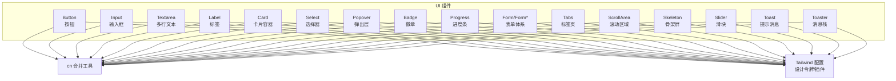
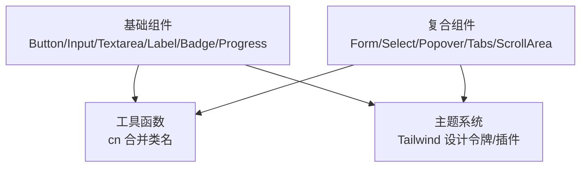
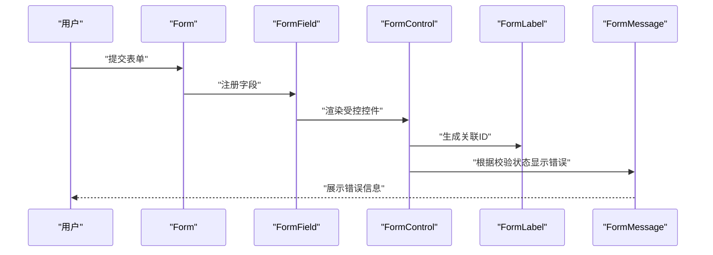
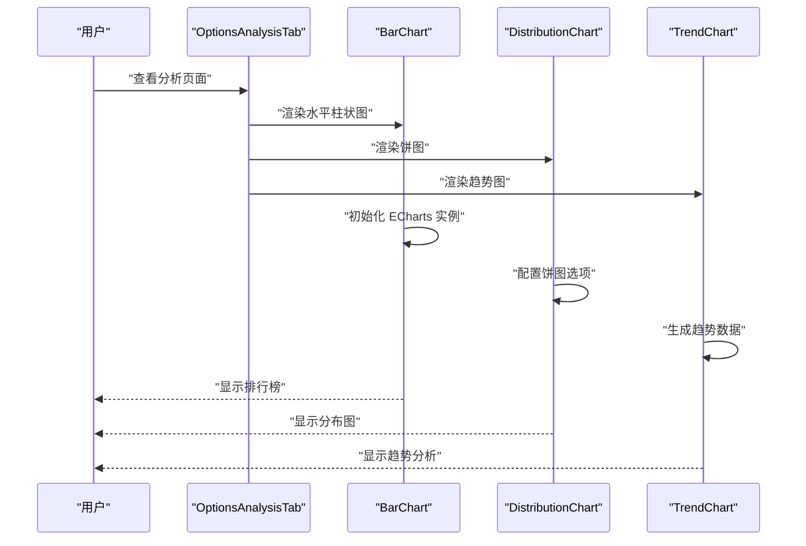
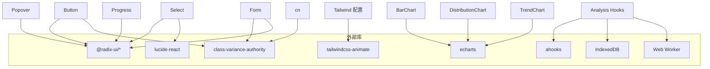

# UI组件系统

<cite>
**本文引用的文件**
- [src/components/ui/button.tsx](file://src/components/ui/button.tsx)
- [src/components/ui/input.tsx](file://src/components/ui/input.tsx)
- [src/components/ui/form.tsx](file://src/components/ui/form.tsx)
- [src/components/ui/card.tsx](file://src/components/ui/card.tsx)
- [src/components/ui/select.tsx](file://src/components/ui/select.tsx)
- [src/components/ui/textarea.tsx](file://src/components/ui/textarea.tsx)
- [src/components/ui/label.tsx](file://src/components/ui/label.tsx)
- [src/components/ui/popover.tsx](file://src/components/ui/popover.tsx)
- [src/components/ui/badge.tsx](file://src/components/ui/badge.tsx)
- [src/components/ui/progress.tsx](file://src/components/ui/progress.tsx)
- [src/components/ui/skeleton.tsx](file://src/components/ui/skeleton.tsx)
- [src/components/ui/slider.tsx](file://src/components/ui/slider.tsx)
- [src/components/ui/tabs.tsx](file://src/components/ui/tabs.tsx)
- [src/components/ui/scroll-area.tsx](file://src/components/ui/scroll-area.tsx)
- [src/components/ui/toast.tsx](file://src/components/ui/toast.tsx)
- [src/components/ui/toaster.tsx](file://src/components/ui/toaster.tsx)
- [src/components/index.ts](file://src/components/index.ts)
- [src/lib/utils.ts](file://src/lib/utils.ts)
- [tailwind.config.js](file://tailwind.config.js)
- [postcss.config.js](file://postcss.config.js)
- [src/popup/index.css](file://src/popup/index.css)
- [src/popup/index.tsx](file://src/popup/index.tsx)
- [src/popup/Popup.tsx](file://src/popup/Popup.tsx)
- [src/popup/components/move/index.tsx](file://src/popup/components/move/index.tsx)
- [src/popup/components/login-check/index.tsx](file://src/popup/components/login-check/index.tsx)
- [src/popup/components/auto-create-keyword/index.tsx](file://src/popup/components/auto-create-keyword/index.tsx)
- [src/options/index.css](file://src/options/index.css)
- [src/options/components/analysis/chart/bar-chart.tsx](file://src/options/components/analysis/chart/bar-chart.tsx)
- [src/options/components/analysis/chart/distribution-chart.tsx](file://src/options/components/analysis/chart/distribution-chart.tsx)
- [src/options/components/analysis/chart/trend-chart.tsx](file://src/options/components/analysis/chart/trend-chart.tsx)
- [src/options/components/analysis/options-analysis-tab.tsx](file://src/options/components/analysis/options-analysis-tab.tsx)
- [src/options/components/analysis/stats-cards.tsx](file://src/options/components/analysis/stats-cards.tsx)
- [src/options/components/analysis/use-analysis-data.ts](file://src/options/components/analysis/use-analysis-data.ts)
- [src/options/components/analysis/use-analysis-stats.ts](file://src/options/components/analysis/use-analysis-stats.ts)
- [src/options/components/analysis/use-analysis-worker.ts](file://src/options/components/analysis/use-analysis-worker.ts)
- [src/workers/analysis.worker.ts](file://src/workers/analysis.worker.ts)
</cite>

## 目录
1. [简介](#简介)
2. [项目结构](#项目结构)
3. [核心组件](#核心组件)
4. [架构总览](#架构总览)
5. [详细组件分析](#详细组件分析)
6. [样式系统重大改进](#样式系统重大改进)
7. [分析图表组件系统](#分析图表组件系统)
8. [依赖关系分析](#依赖关系分析)
9. [性能考量](#性能考量)
10. [故障排查指南](#故障排查指南)
11. [结论](#结论)
12. [附录](#附录)

## 简介
本文件系统化梳理 B站收藏夹整理工具的UI组件体系，围绕以下设计理念展开：
- 基于 Radix UI 的无障碍与语义化设计：通过语义化标签、键盘可达性、ARIA 属性与动画过渡，确保可访问性与一致性。
- Tailwind CSS 实用优先的样式系统：以原子化类名与设计令牌（CSS变量）驱动主题与风格，结合合并工具实现样式冲突最小化。

组件覆盖从基础输入控件到复合交互组件（如表单、选择器、弹出层、进度条、标签页等），并提供组合模式、复用策略、响应式与跨浏览器兼容建议、可访问性与国际化支持说明，以及主题定制与样式扩展方法。

**更新**：本次更新重点介绍了popup样式系统的重大改进，包括全新的颜色调色板系统、边框管理、字体优化、交互增强等，这些改进直接影响UI组件系统的整体外观和用户体验。同时新增了分析图表组件系统的详细文档，包括bar-chart组件的重要样式修复。

## 项目结构
UI组件集中位于 src/components/ui 下，采用"按功能拆分"的模块化组织方式；公共工具函数 cn 负责类名合并；Tailwind 配置通过设计令牌与插件扩展提供统一主题与滚动条样式。



**图表来源**
- [src/components/ui/button.tsx:1-51](file://src/components/ui/button.tsx#L1-L51)
- [src/components/ui/input.tsx:1-23](file://src/components/ui/input.tsx#L1-L23)
- [src/components/ui/form.tsx:1-168](file://src/components/ui/form.tsx#L1-L168)
- [src/components/ui/card.tsx:1-57](file://src/components/ui/card.tsx#L1-L57)
- [src/components/ui/select.tsx:1-151](file://src/components/ui/select.tsx#L1-L151)
- [src/components/ui/textarea.tsx:1-22](file://src/components/ui/textarea.tsx#L1-L22)
- [src/components/ui/label.tsx:1-22](file://src/components/ui/label.tsx#L1-L22)
- [src/components/ui/popover.tsx:1-33](file://src/components/ui/popover.tsx#L1-L33)
- [src/components/ui/badge.tsx:1-34](file://src/components/ui/badge.tsx#L1-L34)
- [src/components/ui/progress.tsx:1-26](file://src/components/ui/progress.tsx#L1-L26)
- [src/components/ui/skeleton.tsx](file://src/components/ui/skeleton.tsx)
- [src/components/ui/slider.tsx](file://src/components/ui/slider.tsx)
- [src/components/ui/tabs.tsx](file://src/components/ui/tabs.tsx)
- [src/components/ui/scroll-area.tsx](file://src/components/ui/scroll-area.tsx)
- [src/components/ui/toast.tsx](file://src/components/ui/toast.tsx)
- [src/components/ui/toaster.tsx](file://src/components/ui/toaster.tsx)
- [src/lib/utils.ts:1-7](file://src/lib/utils.ts#L1-L7)
- [tailwind.config.js:1-118](file://tailwind.config.js#L1-L118)

**章节来源**
- [src/components/index.ts:1-4](file://src/components/index.ts#L1-L4)
- [src/lib/utils.ts:1-7](file://src/lib/utils.ts#L1-L7)
- [tailwind.config.js:1-118](file://tailwind.config.js#L1-L118)
- [postcss.config.js:1-7](file://postcss.config.js#L1-L7)

## 核心组件
本节概述各组件的功能定位、典型属性与可定制点，并给出使用场景与最佳实践指引。

- 按钮 Button
  - 功能：承载点击动作，支持多种视觉变体与尺寸，支持透传原生按钮属性与作为子节点渲染。
  - 关键属性：variant（默认/破坏/描边/次级/幽灵/链接）、size（默认/小/大/图标）、asChild（是否渲染为子节点）、className、...props。
  - 可访问性：内置焦点可见性与环形焦点指示，配合语义化标签使用更佳。
  - 最佳实践：在表单中使用默认或次级变体；危险操作使用破坏变体；图标按钮使用 icon 尺寸；避免仅依赖颜色传达状态。

- 输入 Input/Textarea
  - 功能：基础文本输入与多行文本输入，统一边框、内边距、占位符与禁用态样式。
  - 关键属性：type（输入类型）、className、...props；Textarea 支持自动高度与多行布局。
  - 可访问性：与 Label 配合，确保可点击区域与焦点顺序一致。
  - 最佳实践：与 Form 组件体系配合使用；在需要数字输入时设置 type；配合错误提示组件显示校验信息。

- 表单 Form/Form*
  - 功能：基于 react-hook-form 的表单上下文与字段管理，提供 Field、Label、Control、Description、Message 等组合部件。
  - 关键能力：字段上下文、错误状态传播、ARIA 描述与错误标识、受控渲染槽位。
  - 可访问性：自动生成 ID 并注入 aria-describedby/aria-invalid，提升屏幕阅读器体验。
  - 最佳实践：在复杂表单中统一使用 FormProvider；为每个字段包裹 FormField；使用 FormMessage 显示错误文案。

- 卡片 Card/Card*
  - 功能：容器型组件，提供头部、标题、描述、内容、底部等分区，便于构建信息区块。
  - 关键属性：className、...props；支持组合使用。
  - 最佳实践：用于设置面板、统计卡片、结果展示区；与 Badge、Progress 等组件组合增强信息密度。

- 选择器 Select/Select*
  - 功能：下拉选择，支持组、标签、项、分割线、滚动按钮与 Portal 渲染，内置动画与键盘导航。
  - 关键属性：Root/Group/Value/Trigger/Content/Label/Item/Separator/ScrollUp/ScrollDown；Trigger 支持图标与占位符。
  - 可访问性：支持键盘打开/关闭、上下方向键切换、回车选择、Esc 关闭。
  - 最佳实践：大量选项时启用滚动按钮；与 Form 配合时确保 aria 标识正确。

- 弹出层 Popover
  - 功能：触发后弹出内容，支持对齐与偏移，内置淡入/缩放/滑入动画。
  - 关键属性：align（左/右/居中）、sideOffset（上下偏移）、className、...props。
  - 最佳实践：用于轻量配置面板、快捷菜单、提示信息；避免在移动端遮挡主要内容。

- 徽章 Badge
  - 功能：状态/标签展示，支持多种变体与尺寸。
  - 关键属性：variant（默认/次级/破坏/描边）、className、...props。
  - 最佳实践：用于状态标记、数量角标、分类标签；注意对比度与可读性。

- 进度条 Progress
  - 功能：展示任务完成进度，支持自定义指示器类名。
  - 关键属性：value（数值）、indicatorClassName、className、...props。
  - 最佳实践：与异步流程配合；在低对比度主题下保证前景色对比度。

- 其他常用组件
  - Skeleton：骨架屏占位，提升加载体验。
  - Slider：滑块控件，支持范围与步进。
  - Tabs/ScrollArea：标签页与滚动区域，增强长列表与多面板场景的可用性。
  - Toast/Toaster：全局提示消息与消息栈，支持多条消息队列与自动消失。

**章节来源**
- [src/components/ui/button.tsx:1-51](file://src/components/ui/button.tsx#L1-L51)
- [src/components/ui/input.tsx:1-23](file://src/components/ui/input.tsx#L1-L23)
- [src/components/ui/textarea.tsx:1-22](file://src/components/ui/textarea.tsx#L1-L22)
- [src/components/ui/label.tsx:1-22](file://src/components/ui/label.tsx#L1-L22)
- [src/components/ui/form.tsx:1-168](file://src/components/ui/form.tsx#L1-L168)
- [src/components/ui/card.tsx:1-57](file://src/components/ui/card.tsx#L1-L57)
- [src/components/ui/select.tsx:1-151](file://src/components/ui/select.tsx#L1-L151)
- [src/components/ui/popover.tsx:1-33](file://src/components/ui/popover.tsx#L1-L33)
- [src/components/ui/badge.tsx:1-34](file://src/components/ui/badge.tsx#L1-L34)
- [src/components/ui/progress.tsx:1-26](file://src/components/ui/progress.tsx#L1-L26)
- [src/components/ui/skeleton.tsx](file://src/components/ui/skeleton.tsx)
- [src/components/ui/slider.tsx](file://src/components/ui/slider.tsx)
- [src/components/ui/tabs.tsx](file://src/components/ui/tabs.tsx)
- [src/components/ui/scroll-area.tsx](file://src/components/ui/scroll-area.tsx)
- [src/components/ui/toast.tsx](file://src/components/ui/toast.tsx)
- [src/components/ui/toaster.tsx](file://src/components/ui/toaster.tsx)

## 架构总览
UI组件体系遵循"基础组件 + 复合组件 + 工具函数 + 主题系统"的分层架构：
- 基础组件：Button、Input、Textarea、Label、Badge、Progress 等，提供通用交互与视觉。
- 复合组件：Form、Select、Popover、Tabs、ScrollArea 等，封装复杂交互与状态管理。
- 工具函数：cn 合并类名，确保样式叠加与冲突最小化。
- 主题系统：Tailwind 设计令牌与插件，提供暗色模式、颜色变量、滚动条样式与动画插件。



**图表来源**
- [src/lib/utils.ts:1-7](file://src/lib/utils.ts#L1-L7)
- [tailwind.config.js:1-118](file://tailwind.config.js#L1-L118)

## 详细组件分析

### 组件体系类图

```mermaid
classDiagram
class Button {
+variant : "default|destructive|outline|secondary|ghost|link"
+size : "default|sm|lg|icon"
+asChild : boolean
+className : string
+props : ButtonHTMLAttributes
}
class Input {
+type : string
+className : string
+props : ComponentProps<"input">
}
class Textarea {
+className : string
+props : ComponentProps<"textarea">
}
class Label {
+className : string
+props : ComponentPropsWithoutRef
}
class Card {
+className : string
+props : HTMLAttributes
}
class Select {
+className : string
+props : ComponentPropsWithoutRef
}
class Popover {
+className : string
+props : ComponentPropsWithoutRef
}
class Badge {
+variant : "default|secondary|destructive|outline"
+className : string
+props : HTMLAttributes
}
class Progress {
+value : number
+indicatorClassName : string
+className : string
+props : ComponentPropsWithoutRef
}
class Form {
+props : FormProviderProps
}
class Tabs {
+className : string
+props : ComponentPropsWithoutRef
}
class ScrollArea {
+className : string
+props : ComponentPropsWithoutRef
}
class Skeleton {
+className : string
+props : HTMLAttributes
}
class Slider {
+className : string
+props : ComponentPropsWithoutRef
}
class Toast {
+className : string
+props : ComponentPropsWithoutRef
}
class Toaster {
+className : string
+props : ComponentPropsWithoutRef
}
```


**图表来源**
- [src/components/ui/button.tsx:34-51](file://src/components/ui/button.tsx#L34-L51)
- [src/components/ui/input.tsx:5-23](file://src/components/ui/input.tsx#L5-L23)
- [src/components/ui/textarea.tsx:5-22](file://src/components/ui/textarea.tsx#L5-L22)
- [src/components/ui/label.tsx:13-22](file://src/components/ui/label.tsx#L13-L22)
- [src/components/ui/card.tsx:5-57](file://src/components/ui/card.tsx#L5-L57)
- [src/components/ui/select.tsx:7-151](file://src/components/ui/select.tsx#L7-L151)
- [src/components/ui/popover.tsx:9-33](file://src/components/ui/popover.tsx#L9-L33)
- [src/components/ui/badge.tsx:25-34](file://src/components/ui/badge.tsx#L25-L34)
- [src/components/ui/progress.tsx:6-26](file://src/components/ui/progress.tsx#L6-L26)
- [src/components/ui/form.tsx:16-168](file://src/components/ui/form.tsx#L16-L168)
- [src/components/ui/tabs.tsx](file://src/components/ui/tabs.tsx)
- [src/components/ui/scroll-area.tsx](file://src/components/ui/scroll-area.tsx)
- [src/components/ui/skeleton.tsx](file://src/components/ui/skeleton.tsx)
- [src/components/ui/slider.tsx](file://src/components/ui/slider.tsx)
- [src/components/ui/toast.tsx](file://src/components/ui/toast.tsx)
- [src/components/ui/toaster.tsx](file://src/components/ui/toaster.tsx)

### 表单工作流时序


**图表来源**
- [src/components/ui/form.tsx:27-167](file://src/components/ui/form.tsx#L27-L167)

### 选择器交互流程


**图表来源**
- [src/components/ui/select.tsx:13-91](file://src/components/ui/select.tsx#L13-L91)

### 组合模式与复用策略
- 组合模式：Form 与 FormField/FormControl/Label/Message 协同；Card 分区组合；Select 内部子组件组合。
- 复用策略：通过 Variants（如 Button/Label/Badge）与 className 扩展实现跨页面复用；cn 工具保证样式叠加稳定。
- 事件处理：Button/Select/Popover 等组件透传原生事件，同时提供回调钩子；表单组件通过 react-hook-form 提供统一状态管理。

**章节来源**
- [src/components/ui/form.tsx:1-168](file://src/components/ui/form.tsx#L1-L168)
- [src/components/ui/card.tsx:1-57](file://src/components/ui/card.tsx#L1-L57)
- [src/components/ui/select.tsx:1-151](file://src/components/ui/select.tsx#L1-L151)
- [src/components/ui/button.tsx:1-51](file://src/components/ui/button.tsx#L1-L51)
- [src/components/ui/label.tsx:1-22](file://src/components/ui/label.tsx#L1-L22)
- [src/components/ui/badge.tsx:1-34](file://src/components/ui/badge.tsx#L1-L34)

## 样式系统重大改进

### 全新的颜色调色板系统
popup样式系统引入了完整的B站风格色彩体系，包括品牌主色调、辅助色和中性色：

- **品牌主色调**
  - B站粉：`#BF00FF` (`b-primary`)
  - B站粉-hover：`#A000D9` (`b-primary-hover`)
  - B站红：`#FF1493` (`b-secondary`)
  - 青色：`#00FFFF` (`b-accent`)
  - 橙色：`#FFAA00` (`b-warning`)
  - 荧光绿：`#39FF14` (`b-neon`)

- **文本色彩**
  - 主文本：`#2D1B4E` (`b-text-primary`)

- **使用方式**
  ```jsx
  <Button className="bg-b-primary hover:bg-b-primary-hover text-white">
    B站风格按钮
  </Button>
  ```

**章节来源**
- [tailwind.config.js:55-62](file://tailwind.config.js#L55-L62)
- [src/popup/Popup.tsx:24](file://src/popup/Popup.tsx#L24)
- [src/popup/components/move/index.tsx:14](file://src/popup/components/move/index.tsx#L14)
- [src/popup/components/auto-create-keyword/index.tsx:15](file://src/popup/components/auto-create-keyword/index.tsx#L15)

### 边框管理优化
- **统一边框系统**：通过CSS变量 `--border` 实现全局边框颜色管理
- **圆角半径**：使用 `--radius` 变量控制圆角大小，支持 lg/md/sm 不同层级
- **边框应用**：所有组件继承 `border-border` 类，确保视觉一致性

**章节来源**
- [src/popup/index.css:64](file://src/popup/index.css#L64)
- [src/popup/index.css:31](file://src/popup/index.css#L31)
- [tailwind.config.js:9-13](file://tailwind.config.js#L9-L13)

### 字体优化
- **字体栈**：采用 `PingFang SC, HarmonyOS_Medium, Helvetica Neue, Microsoft YaHei, sans-serif` 确保中文字体显示效果
- **字体大小**：基于 `font-size` 和 `line-height` 的层级系统
- **字体权重**：支持从 `font-thin` 到 `font-black` 的完整权重范围

**章节来源**
- [src/popup/index.css:76](file://src/popup/index.css#L76)
- [src/options/index.css:82](file://src/options/index.css#L82)

### 交互增强
- **选择高亮**：`::selection` 伪元素使用 `hsl(var(--primary) / 0.18)` 实现淡透明高亮
- **焦点管理**：`:focus-visible` 伪类移除默认轮廓，提供更好的视觉反馈
- **悬停效果**：统一的 `hover:bg-opacity-50` 透明度变化

**章节来源**
- [src/popup/index.css:79](file://src/popup/index.css#L79)
- [src/popup/index.css:83](file://src/popup/index.css#L83)
- [src/popup/components/move/index.tsx:23](file://src/popup/components/move/index.tsx#L23)

### 滚动条样式系统
新增三种滚动条样式方案：

- **滚动条隐藏**：`.scrollbar-hide` 完全隐藏滚动条
- **样式化滚动条**：`.scrollbar-styled` 提供渐变色滚动条
- **细滚动条**：`.scrollbar-thin` 提供细线条滚动条

```css
.scrollbar-styled {
  scrollbar-width: thin;
  scrollbar-color: #BF00FF #f8f0ff;
}
```

**章节来源**
- [tailwind.config.js:67-114](file://tailwind.config.js#L67-L114)

### 暗色模式支持
- **自动切换**：通过 `.dark` 类名实现暗色模式
- **颜色映射**：明暗模式下颜色值自动调整
- **渐变背景**：暗色模式下使用深色渐变背景

**章节来源**
- [src/popup/index.css:34](file://src/popup/index.css#L34)
- [src/options/index.css:35](file://src/options/index.css#L35)

### 主题变量系统
- **CSS变量定义**：在 `:root` 和 `.dark` 伪类中定义完整的HSL颜色变量
- **圆角变量**：`--radius` 控制组件圆角大小，支持不同层级的圆角
- **背景渐变**：popup页面使用淡紫色渐变背景，options页面使用多巴胺配色渐变

**章节来源**
- [src/popup/index.css:6](file://src/popup/index.css#L6-L59)
- [src/options/index.css:6](file://src/options/index.css#L6-L60)

## 分析图表组件系统

### 图表组件架构
分析模块包含三个核心图表组件，基于 ECharts 实现，提供收藏夹数据分析功能：

- **BarChart**：柱状图，支持水平和垂直布局，用于显示收藏夹视频数量排行
- **DistributionChart**：饼图/环形图，用于显示收藏夹分布情况
- **TrendChart**：折线图，用于显示收藏趋势分析

### BarChart 组件重要样式修复

#### 圆角计算改进
**更新**：BarChart 组件在水平布局下实现了重要的圆角计算改进，解决了之前圆角显示不正确的问题。

在水平布局模式下，柱状图的圆角计算采用了新的算法：
- **水平布局**：`borderRadius: [0, 4, 4, 0]` - 右侧两端圆角，左侧保持直角
- **垂直布局**：`borderRadius: [4, 4, 4, 4]` - 四个角都保持圆角

这种改进确保了水平柱状图在排行榜场景中具有更好的视觉效果，顶部和底部的圆角提供了优雅的渐变效果，而不会影响柱子的可读性。

#### 组件功能特性
- **数据格式**：接受 `{name: string, value: number}` 数组
- **布局切换**：通过 `horizontal` 属性控制水平/垂直布局
- **渐变色彩**：使用线性渐变色块，从浅蓝到深蓝的渐变效果
- **响应式设计**：自动适应容器尺寸变化
- **交互效果**：悬停时色彩加深，提供更好的用户体验

#### 使用示例
```typescript
// 水平布局 - 排行榜
<BarChart 
  data={distributionData} 
  title="TOP 10 收藏夹" 
  horizontal={true} 
/>

// 垂直布局 - 分布图
<BarChart 
  data={distributionData} 
  title="收藏夹分布" 
  horizontal={false} 
/>
```

**章节来源**
- [src/options/components/analysis/chart/bar-chart.tsx:1-108](file://src/options/components/analysis/chart/bar-chart.tsx#L1-L108)
- [src/options/components/analysis/chart/distribution-chart.tsx:1-93](file://src/options/components/analysis/chart/distribution-chart.tsx#L1-L93)
- [src/options/components/analysis/chart/trend-chart.tsx:1-120](file://src/options/components/analysis/chart/trend-chart.tsx#L1-L120)
- [src/options/components/analysis/options-analysis-tab.tsx:1-222](file://src/options/components/analysis/options-analysis-tab.tsx#L1-L222)

### 图表组件工作流程


**图表来源**
- [src/options/components/analysis/options-analysis-tab.tsx:180-217](file://src/options/components/analysis/options-analysis-tab.tsx#L180-L217)

### 数据处理与缓存机制
分析模块采用多层数据处理和缓存策略：

- **数据获取**：通过 `useAnalysisData` hook 管理收藏夹媒体数据的获取和缓存
- **统计计算**：通过 `useAnalysisStats` hook 计算基础统计、分布数据和趋势数据
- **Web Worker**：使用 `useAnalysisWorker` hook 在后台线程中处理复杂计算
- **缓存策略**：使用 IndexedDB 进行数据持久化缓存，支持过期检测和自动刷新

**章节来源**
- [src/options/components/analysis/use-analysis-data.ts:1-109](file://src/options/components/analysis/use-analysis-data.ts#L1-L109)
- [src/options/components/analysis/use-analysis-stats.ts:1-166](file://src/options/components/analysis/use-analysis-stats.ts#L1-L166)
- [src/options/components/analysis/use-analysis-worker.ts:1-74](file://src/options/components/analysis/use-analysis-worker.ts#L1-L74)
- [src/workers/analysis.worker.ts:1-136](file://src/workers/analysis.worker.ts#L1-L136)

## 依赖关系分析
- 组件间耦合：基础组件低耦合，复合组件通过基础组件组合；Form 依赖 react-hook-form 与 Radix UI；Select/Popover/Progress 等依赖 Radix UI。
- 外部依赖：Radix UI（语义化与无障碍）、class-variance-authority（变体样式）、lucide-react（图标）、tailwindcss-animate（动画插件）、echarts（图表渲染）。
- 主题与样式：cn 工具负责类名合并；Tailwind 设计令牌统一颜色与圆角；插件扩展滚动条样式与动画。



**图表来源**
- [src/components/ui/button.tsx:1-6](file://src/components/ui/button.tsx#L1-L6)
- [src/components/ui/select.tsx:1-6](file://src/components/ui/select.tsx#L1-L6)
- [src/components/ui/form.tsx:1-11](file://src/components/ui/form.tsx#L1-L11)
- [src/lib/utils.ts:1-7](file://src/lib/utils.ts#L1-L7)
- [tailwind.config.js:65-116](file://tailwind.config.js#L65-L116)
- [src/options/components/analysis/chart/bar-chart.tsx:1-2](file://src/options/components/analysis/chart/bar-chart.tsx#L1-L2)
- [src/options/components/analysis/use-analysis-data.ts:1-4](file://src/options/components/analysis/use-analysis-data.ts#L1-L4)
- [src/options/components/analysis/use-analysis-stats.ts:1-5](file://src/options/components/analysis/use-analysis-stats.ts#L1-L5)
- [src/options/components/analysis/use-analysis-worker.ts:1-2](file://src/options/components/analysis/use-analysis-worker.ts#L1-L2)

**章节来源**
- [src/components/ui/button.tsx:1-6](file://src/components/ui/button.tsx#L1-L6)
- [src/components/ui/select.tsx:1-6](file://src/components/ui/select.tsx#L1-L6)
- [src/components/ui/form.tsx:1-11](file://src/components/ui/form.tsx#L1-L11)
- [src/lib/utils.ts:1-7](file://src/lib/utils.ts#L1-L7)
- [tailwind.config.js:65-116](file://tailwind.config.js#L65-L116)

## 性能考量
- 类名合并：使用 cn 合并多个类名，减少重复与冲突，避免不必要的重排。
- 动画与渲染：利用 tailwindcss-animate 与 Radix UI 动画插件，确保过渡流畅且不阻塞主线程。
- 滚动与虚拟化：长列表场景使用 ScrollArea；必要时考虑虚拟滚动以降低 DOM 节点数。
- 图标与体积：图标来自 lucide-react，按需引入可减小组件体积。
- 主题切换：Tailwind 暗色模式通过 class 切换，避免运行时样式计算开销。
- 图表性能：ECharts 图表使用实例复用和 resize 事件监听，避免内存泄漏。
- 数据缓存：分析模块使用 IndexedDB 缓存，减少重复网络请求和计算开销。
- Web Worker：复杂计算在后台线程执行，避免阻塞主线程。

## 故障排查指南
- 可访问性问题
  - 表单错误未被读屏识别：检查 FormLabel 是否绑定到对应控件 ID，FormMessage 是否存在且被 aria-describedby 包含。
  - 键盘不可达：确认 Select/Popover/Tabs 使用了 Radix UI 触发器与键盘导航。
- 样式冲突
  - 使用 cn 合并类名，避免直接覆盖设计令牌；检查 Tailwind 配置中的颜色与圆角扩展。
- 动画异常
  - 确认 tailwindcss-animate 插件已启用；检查数据属性（如 data-state）是否正确传递给动画组件。
- 滚动条样式
  - 使用提供的滚动条工具类（如 scrollbar-styled）；在不同浏览器中验证渐变与宽度差异。
- B站风格色彩
  - 确保使用正确的 B站色彩类名（如 `bg-b-primary`）而非硬编码颜色值。
  - 检查暗色模式下的颜色映射是否正确。
- 图表显示问题
  - 确认 ECharts 实例正确初始化和销毁；检查容器尺寸变化时的 resize 事件。
  - 验证数据格式是否符合预期的 `{name, value}` 结构。
- 圆角显示异常
  - 检查 horizontal 属性是否正确传递；验证圆角计算数组格式是否为 `[top-left, top-right, bottom-right, bottom-left]`。
- 数据缓存问题
  - 确认 IndexedDB 缓存键生成逻辑；检查缓存过期检测机制是否正常工作。

**章节来源**
- [src/components/ui/form.tsx:82-156](file://src/components/ui/form.tsx#L82-L156)
- [src/components/ui/select.tsx:61-91](file://src/components/ui/select.tsx#L61-L91)
- [src/components/ui/popover.tsx:9-33](file://src/components/ui/popover.tsx#L9-L33)
- [tailwind.config.js:65-116](file://tailwind.config.js#L65-L116)
- [src/options/components/analysis/chart/bar-chart.tsx:71-78](file://src/options/components/analysis/chart/bar-chart.tsx#L71-L78)
- [src/options/components/analysis/use-analysis-data.ts:40-47](file://src/options/components/analysis/use-analysis-data.ts#L40-L47)

## 结论
该UI组件系统以 Radix UI 的无障碍与语义化为基础，以 Tailwind 的设计令牌与插件为支撑，实现了高可复用、强一致性的组件生态。通过 cn 工具与 Variants 模式，开发者可在不牺牲可访问性的前提下快速扩展样式与行为。

**更新**：本次popup样式系统的重大改进引入了完整的B站风格色彩体系、优化的边框管理、字体优化和交互增强，显著提升了组件的整体外观和用户体验。新的样式系统通过CSS变量实现统一的主题管理，支持暗色模式切换，并提供了丰富的滚动条样式选项。

新增的分析图表组件系统进一步丰富了UI组件体系，基于ECharts实现了专业的数据分析可视化功能。其中BarChart组件的圆角计算改进解决了水平布局下的视觉问题，为排行榜等场景提供了更好的用户体验。

建议在实际项目中遵循组合模式与复用策略，结合表单与选择器等复合组件，构建一致、易维护的用户界面。同时充分利用新的B站风格色彩系统和分析图表功能，确保界面风格的一致性和功能的完整性。

## 附录

### 响应式设计指南
- 移动优先：在小屏设备上优先保证可点击区域与文字可读性；在大屏上合理利用空间。
- 字体与间距：使用相对单位与语义化字号；保持合理的行高与段落间距。
- 触摸目标：按钮与输入控件的最小触控面积建议不小于 44px × 44px。
- 导航与滚动：在移动端优先使用底部导航或侧边抽屉；长列表使用 ScrollArea 优化滚动性能。
- 图表响应式：确保图表容器支持响应式布局，图表自动适应容器尺寸变化。

### 跨浏览器兼容性
- 浏览器支持：现代浏览器（Chrome/Firefox/Safari/Edge）均支持 Tailwind 与 Radix UI；确保 polyfill（如 classnames 合并）在旧环境可用。
- 动画与过渡：在不支持 CSS 动画的环境中降级为无动画；测试关键帧与 transform 的兼容性。
- 滚动条：使用 CSS 自定义滚动条样式时，注意 WebKit 与非 WebKit 内核的差异。
- 字体渲染：确保系统字体栈中的字体在不同操作系统上的可用性。
- ECharts：确保在不同浏览器中图表渲染的一致性，测试 WebGL 和 Canvas 渲染模式。

### 可访问性特性
- 语义化标签：使用语义化元素与语义化组件（如 Label、Form*），确保屏幕阅读器可理解。
- 键盘可达：所有交互组件支持 Tab 导航、Enter/Space 触发、Esc 关闭。
- ARIA 属性：表单组件自动注入 aria-invalid、aria-describedby；选择器与弹出层使用 data-state 控制动画状态。
- 对比度与色彩：遵循 WCAG 对比度要求；在暗色模式下保持足够的前景/背景对比。
- 图表可访问性：为图表提供适当的标题和描述，确保屏幕阅读器能够正确读取图表信息。

### 国际化支持
- 文字方向：RTL 语言需检查布局与对齐；组件默认从左到右，必要时通过容器方向控制。
- 数字与日期：在需要本地化格式时，结合 i18n 库进行格式化；UI 组件保持纯展示属性。
- 文案与占位符：文案抽取至资源文件，避免硬编码；错误提示文案可动态替换。
- 图表标签：确保图表中的文本标签支持多语言显示，特别是日期和数值格式。

### 主题定制与样式扩展
- 设计令牌：通过 Tailwind 配置扩展颜色、圆角、字体与动画；使用 CSS 变量统一主题。
- 组件变体：通过 Variants（如 Button/Label/Badge）扩展更多视觉风格；保持命名一致性。
- 工具类：新增工具类（如滚动条样式）通过插件添加，避免分散样式。
- 深色模式：通过 class 切换与 CSS 变量映射实现深浅主题；确保所有组件适配。
- B站风格：使用预定义的B站色彩变量，确保品牌一致性。
- 图表主题：为 ECharts 图表提供统一的主题配置，支持深色模式切换。

**章节来源**
- [tailwind.config.js:1-118](file://tailwind.config.js#L1-L118)
- [postcss.config.js:1-7](file://postcss.config.js#L1-L7)
- [src/lib/utils.ts:1-7](file://src/lib/utils.ts#L1-L7)
- [src/components/ui/button.tsx:7-32](file://src/components/ui/button.tsx#L7-L32)
- [src/components/ui/label.tsx:9-18](file://src/components/ui/label.tsx#L9-L18)
- [src/components/ui/badge.tsx:6-23](file://src/components/ui/badge.tsx#L6-L23)
- [src/popup/index.css:1-86](file://src/popup/index.css#L1-L86)
- [src/options/index.css:1-83](file://src/options/index.css#L1-L83)
- [src/options/components/analysis/chart/bar-chart.tsx:71-78](file://src/options/components/analysis/chart/bar-chart.tsx#L71-L78)