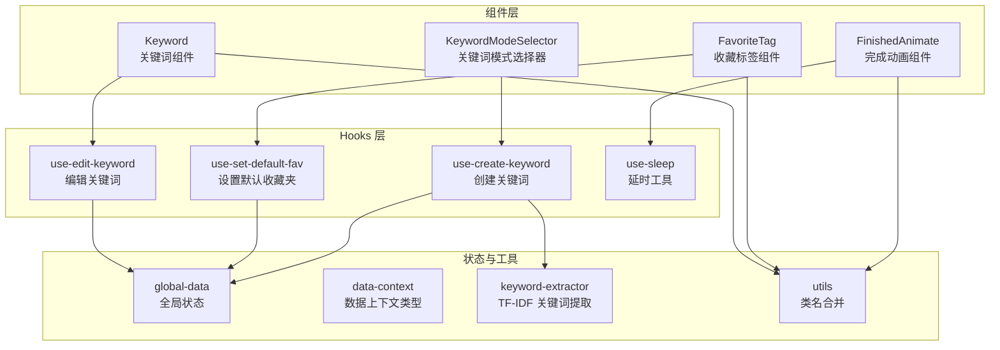
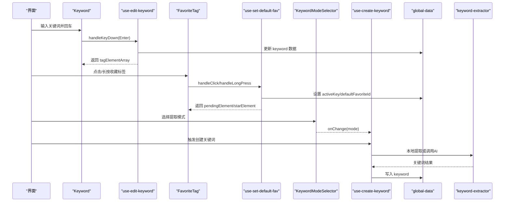
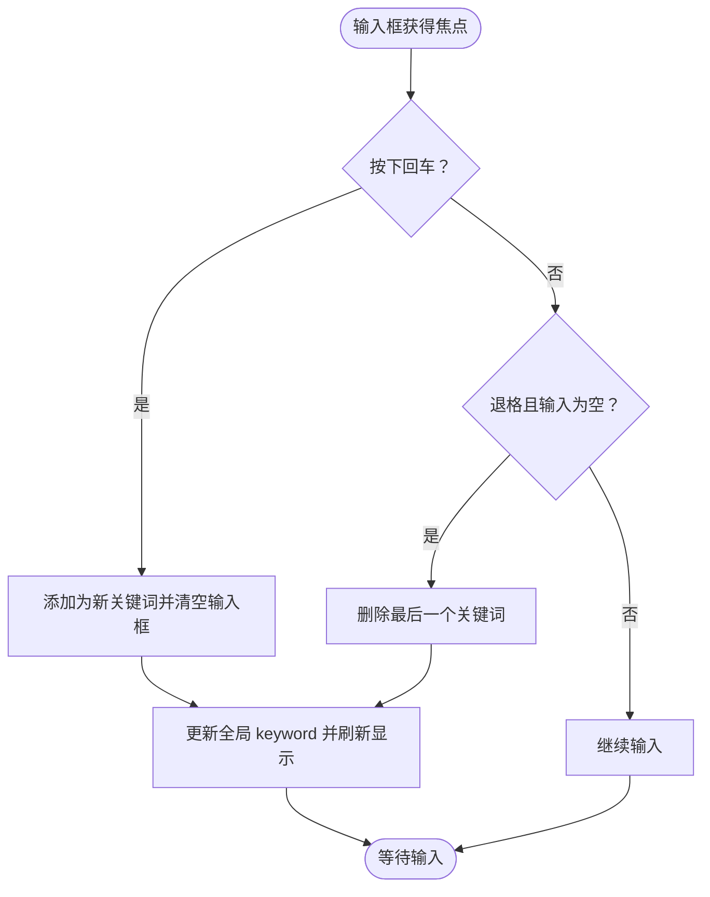
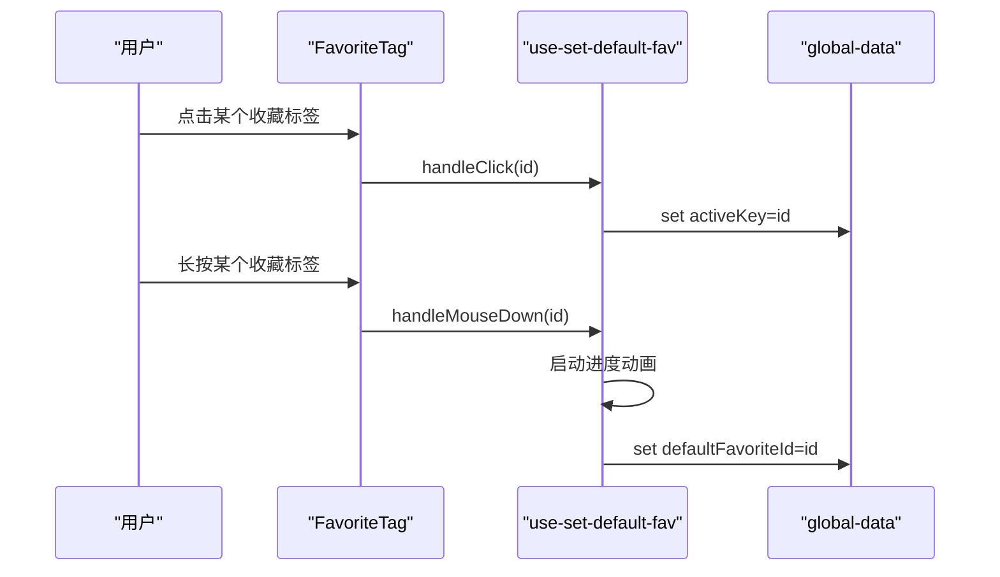
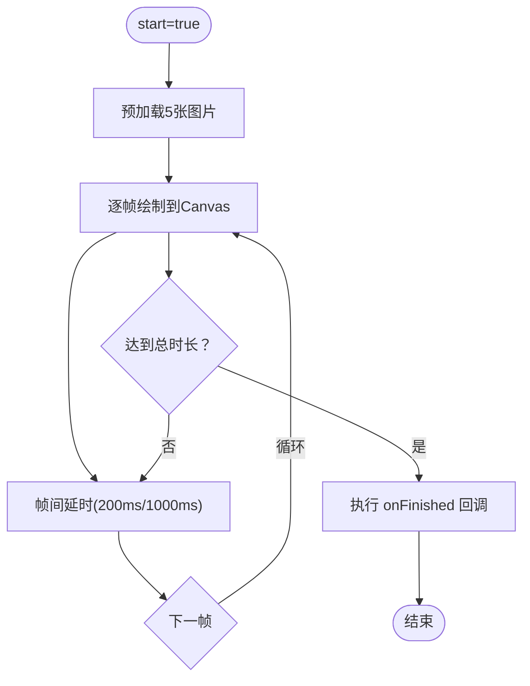
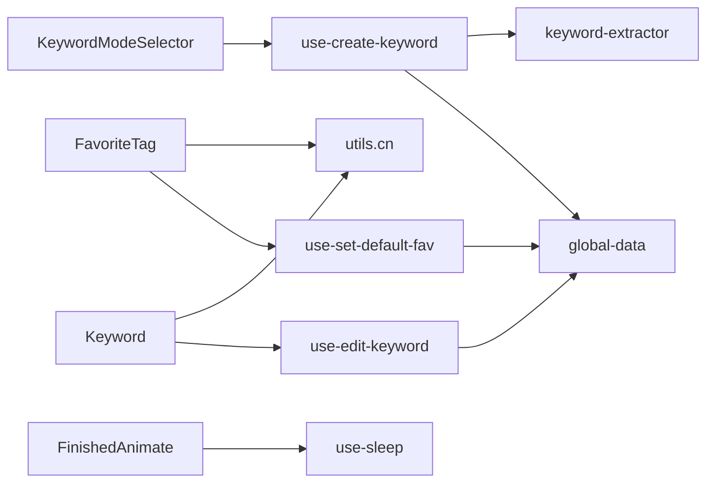

# 专用组件

<cite>
**本文引用的文件**
- [src/components/keyword/index.tsx](file://src/components/keyword/index.tsx)
- [src/components/favorite-tag/index.tsx](file://src/components/favorite-tag/index.tsx)
- [src/components/finished-animate/index.tsx](file://src/components/finished-animate/index.tsx)
- [src/components/keyword-mode-selector/index.tsx](file://src/components/keyword-mode-selector/index.tsx)
- [src/hooks/use-edit-keyword/index.tsx](file://src/hooks/use-edit-keyword/index.tsx)
- [src/hooks/use-set-default-fav/index.tsx](file://src/hooks/use-set-default-fav/index.tsx)
- [src/hooks/use-create-keyword/index.tsx](file://src/hooks/use-create-keyword/index.tsx)
- [src/hooks/use-sleep/index.ts](file://src/hooks/use-sleep/index.ts)
- [src/store/global-data.ts](file://src/store/global-data.ts)
- [src/utils/keyword-extractor.ts](file://src/utils/keyword-extractor.ts)
- [src/utils/data-context.ts](file://src/utils/data-context.ts)
- [src/lib/utils.ts](file://src/lib/utils.ts)
</cite>

## 目录
1. [简介](#简介)
2. [项目结构](#项目结构)
3. [核心组件](#核心组件)
4. [架构总览](#架构总览)
5. [详细组件分析](#详细组件分析)
6. [依赖关系分析](#依赖关系分析)
7. [性能考量](#性能考量)
8. [故障排查指南](#故障排查指南)
9. [结论](#结论)
10. [附录](#附录)

## 简介
本文件聚焦于项目中的四个专用组件：Keyword（关键词组件）、FavoriteTag（收藏标签组件）、FinishedAnimate（完成动画组件）以及 KeywordModeSelector（关键词模式选择器）。它们共同服务于“B站收藏夹管理”场景，分别承担关键词输入与展示、默认收藏夹设置与高亮、批量处理完成后的视觉反馈，以及关键词提取模式的选择与切换。文档将从组件职责、属性配置、事件处理、业务逻辑、使用示例、集成方式、定制化选项与最佳实践等方面进行系统阐述，并给出可视化图示帮助理解。

## 项目结构
这些组件位于 src/components 下，配套的业务逻辑通过 hooks 与全局状态 store 进行解耦，工具函数与算法封装在 utils 中，样式与类名合并工具位于 lib。

图表来源
- [src/components/keyword/index.tsx:1-32](file://src/components/keyword/index.tsx#L1-L32)
- [src/components/favorite-tag/index.tsx:1-77](file://src/components/favorite-tag/index.tsx#L1-L77)
- [src/components/finished-animate/index.tsx:1-117](file://src/components/finished-animate/index.tsx#L1-L117)
- [src/components/keyword-mode-selector/index.tsx:1-50](file://src/components/keyword-mode-selector/index.tsx#L1-L50)
- [src/hooks/use-edit-keyword/index.tsx:1-108](file://src/hooks/use-edit-keyword/index.tsx#L1-L108)
- [src/hooks/use-set-default-fav/index.tsx:1-126](file://src/hooks/use-set-default-fav/index.tsx#L1-L126)
- [src/hooks/use-create-keyword/index.tsx:1-304](file://src/hooks/use-create-keyword/index.tsx#L1-L304)
- [src/hooks/use-sleep/index.ts:1-31](file://src/hooks/use-sleep/index.ts#L1-L31)
- [src/store/global-data.ts:1-28](file://src/store/global-data.ts#L1-L28)
- [src/utils/keyword-extractor.ts:1-197](file://src/utils/keyword-extractor.ts#L1-L197)
- [src/utils/data-context.ts:1-34](file://src/utils/data-context.ts#L1-L34)
- [src/lib/utils.ts:1-7](file://src/lib/utils.ts#L1-L7)

章节来源
- [src/components/keyword/index.tsx:1-32](file://src/components/keyword/index.tsx#L1-L32)
- [src/components/favorite-tag/index.tsx:1-77](file://src/components/favorite-tag/index.tsx#L1-L77)
- [src/components/finished-animate/index.tsx:1-117](file://src/components/finished-animate/index.tsx#L1-L117)
- [src/components/keyword-mode-selector/index.tsx:1-50](file://src/components/keyword-mode-selector/index.tsx#L1-L50)

## 核心组件
- Keyword：用于在收藏夹上下文中输入、展示与删除关键词，支持回车新增、退格删除，内部使用滚动区域展示标签。
- FavoriteTag：展示收藏夹列表，支持点击切换当前活动收藏夹，长按设置默认收藏夹，加载态使用骨架屏。
- FinishedAnimate：基于 Canvas 的完成动画播放器，支持自定义尺寸、时长与回调，适合批量处理结束后的视觉反馈。
- KeywordModeSelector：关键词提取模式选择器，支持本地算法与 AI 模式，提供禁用态与受控值。

章节来源
- [src/components/keyword/index.tsx:6-32](file://src/components/keyword/index.tsx#L6-L32)
- [src/components/favorite-tag/index.tsx:9-77](file://src/components/favorite-tag/index.tsx#L9-L77)
- [src/components/finished-animate/index.tsx:10-117](file://src/components/finished-animate/index.tsx#L10-L117)
- [src/components/keyword-mode-selector/index.tsx:11-50](file://src/components/keyword-mode-selector/index.tsx#L11-L50)

## 架构总览
四个组件通过 hooks 与全局状态协同工作，形成“视图组件 + 业务逻辑 + 状态存储”的清晰分层。Keyword 与 FavoriteTag 负责输入与展示，FinishedAnimate 提供完成态反馈，KeywordModeSelector 控制关键词提取策略。

图表来源
- [src/components/keyword/index.tsx:10-29](file://src/components/keyword/index.tsx#L10-L29)
- [src/hooks/use-edit-keyword/index.tsx:64-102](file://src/hooks/use-edit-keyword/index.tsx#L64-L102)
- [src/components/favorite-tag/index.tsx:13-73](file://src/components/favorite-tag/index.tsx#L13-L73)
- [src/hooks/use-set-default-fav/index.tsx:44-99](file://src/hooks/use-set-default-fav/index.tsx#L44-L99)
- [src/components/keyword-mode-selector/index.tsx:17-46](file://src/components/keyword-mode-selector/index.tsx#L17-L46)
- [src/hooks/use-create-keyword/index.tsx:191-284](file://src/hooks/use-create-keyword/index.tsx#L191-L284)
- [src/utils/keyword-extractor.ts:137-187](file://src/utils/keyword-extractor.ts#L137-L187)
- [src/store/global-data.ts:6-25](file://src/store/global-data.ts#L6-L25)

## 详细组件分析

### Keyword 组件
- 职责：在当前活动收藏夹下维护关键词集合，支持键盘输入、回车新增、退格删除；关键词以可点击的标签形式展示。
- 关键属性
  - className: 可选的容器类名，用于样式覆盖。
- 关键事件与行为
  - 键盘事件：回车键新增输入内容为新关键词；退格且输入框为空时删除最后一个关键词。
  - 标签删除：点击标签上的关闭按钮移除该关键词。
- 依赖与数据流
  - 使用 use-edit-keyword 获取 tagElementArray 与 handleKeyDown。
  - 通过全局状态 global-data 更新 keyword 结构。
- 交互流程

图表来源
- [src/components/keyword/index.tsx:14-28](file://src/components/keyword/index.tsx#L14-L28)
- [src/hooks/use-edit-keyword/index.tsx:64-102](file://src/hooks/use-edit-keyword/index.tsx#L64-L102)

章节来源
- [src/components/keyword/index.tsx:6-32](file://src/components/keyword/index.tsx#L6-L32)
- [src/hooks/use-edit-keyword/index.tsx:6-108](file://src/hooks/use-edit-keyword/index.tsx#L6-L108)
- [src/store/global-data.ts:6-25](file://src/store/global-data.ts#L6-L25)

### FavoriteTag 组件
- 觞职：展示收藏夹列表，支持点击切换当前活动收藏夹，长按设置默认收藏夹；加载中使用骨架屏占位。
- 关键属性
  - className: 可选的容器类名。
- 关键事件与行为
  - 点击：触发切换 activeKey。
  - 长按：进入进度遮罩动画，完成后设置 defaultFavoriteId。
- 依赖与数据流
  - 使用 use-set-default-fav 获取 dom 引用、点击状态、长按状态、星标动画元素。
  - 使用 useFavoriteData 获取收藏夹数据。
  - 使用 global-data 读取 activeKey 与 defaultFavoriteId 并更新。
- 交互流程

图表来源
- [src/components/favorite-tag/index.tsx:13-73](file://src/components/favorite-tag/index.tsx#L13-L73)
- [src/hooks/use-set-default-fav/index.tsx:44-99](file://src/hooks/use-set-default-fav/index.tsx#L44-L99)
- [src/store/global-data.ts:6-25](file://src/store/global-data.ts#L6-L25)

章节来源
- [src/components/favorite-tag/index.tsx:9-77](file://src/components/favorite-tag/index.tsx#L9-L77)
- [src/hooks/use-set-default-fav/index.tsx:6-126](file://src/hooks/use-set-default-fav/index.tsx#L6-L126)
- [src/store/global-data.ts:6-25](file://src/store/global-data.ts#L6-L25)

### FinishedAnimate 组件
- 职责：在 start 为真时播放一组序列帧图片，支持自定义宽高、总时长与回调；播放结束后触发 onFinished。
- 关键属性
  - width/height: 动画画布尺寸，默认 200。
  - duration: 总时长，默认 4000ms。
  - start: 是否开始播放。
  - title: 可选标题文本。
  - onFinished: 播放结束回调。
- 关键行为
  - 预加载五张图片资源。
  - 使用 requestAnimationFrame 顺序绘制不同帧，配合 useSleep 实现帧间延时。
  - 卸载时清理画布与定时器。
- 交互流程

图表来源
- [src/components/finished-animate/index.tsx:19-106](file://src/components/finished-animate/index.tsx#L19-L106)
- [src/hooks/use-sleep/index.ts:3-28](file://src/hooks/use-sleep/index.ts#L3-L28)

章节来源
- [src/components/finished-animate/index.tsx:10-117](file://src/components/finished-animate/index.tsx#L10-L117)
- [src/hooks/use-sleep/index.ts:1-31](file://src/hooks/use-sleep/index.ts#L1-L31)

### KeywordModeSelector 组件
- 职责：提供关键词提取模式选择，支持本地算法与 AI 智能两种模式，可禁用。
- 关键属性
  - value: 当前选中的模式（'local' | 'ai'）。
  - onChange: 模式变更回调。
  - disabled: 是否禁用选择器。
- 关键行为
  - 渲染两个可选项，分别描述本地算法与 AI 智能的特性与限制。
  - 通过 Select 组件实现受控选择。
- 与业务逻辑的关系
  - 与 use-create-keyword 的模式切换配合，驱动关键词提取策略。

章节来源
- [src/components/keyword-mode-selector/index.tsx:11-50](file://src/components/keyword-mode-selector/index.tsx#L11-L50)
- [src/hooks/use-create-keyword/index.tsx:13-35](file://src/hooks/use-create-keyword/index.tsx#L13-L35)

## 依赖关系分析
- 组件与 hooks 的耦合
  - Keyword 依赖 use-edit-keyword 提供的 tagElementArray 与键盘事件处理。
  - FavoriteTag 依赖 use-set-default-fav 提供的长按进度与星标动画。
  - KeywordModeSelector 依赖 use-create-keyword 的模式状态与变更。
- 状态与数据流
  - global-data 提供 keyword、favoriteData、activeKey、defaultFavoriteId、aiConfig 等全局状态。
  - data-context 定义了状态结构与字段类型。
- 工具与算法
  - keyword-extractor 提供本地 TF-IDF 关键词提取能力。
  - utils.cn 提供类名合并工具。

图表来源
- [src/components/keyword/index.tsx:1-32](file://src/components/keyword/index.tsx#L1-L32)
- [src/components/favorite-tag/index.tsx:1-77](file://src/components/favorite-tag/index.tsx#L1-L77)
- [src/components/finished-animate/index.tsx:1-117](file://src/components/finished-animate/index.tsx#L1-L117)
- [src/components/keyword-mode-selector/index.tsx:1-50](file://src/components/keyword-mode-selector/index.tsx#L1-L50)
- [src/hooks/use-edit-keyword/index.tsx:1-108](file://src/hooks/use-edit-keyword/index.tsx#L1-L108)
- [src/hooks/use-set-default-fav/index.tsx:1-126](file://src/hooks/use-set-default-fav/index.tsx#L1-L126)
- [src/hooks/use-create-keyword/index.tsx:1-304](file://src/hooks/use-create-keyword/index.tsx#L1-L304)
- [src/hooks/use-sleep/index.ts:1-31](file://src/hooks/use-sleep/index.ts#L1-L31)
- [src/store/global-data.ts:1-28](file://src/store/global-data.ts#L1-L28)
- [src/utils/keyword-extractor.ts:1-197](file://src/utils/keyword-extractor.ts#L1-L197)
- [src/lib/utils.ts:1-7](file://src/lib/utils.ts#L1-L7)

章节来源
- [src/store/global-data.ts:6-25](file://src/store/global-data.ts#L6-L25)
- [src/utils/data-context.ts:3-31](file://src/utils/data-context.ts#L3-L31)

## 性能考量
- Keyword
  - 使用 useMemo 缓存 tagElementArray，避免每次渲染重新计算。
  - 键盘事件仅在必要时更新全局状态，减少重渲染。
- FavoriteTag
  - 使用 Skeleton 在加载阶段占位，提升感知性能。
  - 长按进度动画使用 requestAnimationFrame，避免阻塞主线程。
- FinishedAnimate
  - 预加载图片资源，降低首帧延迟。
  - 使用 useSleep 管理延时，避免阻塞。
- KeywordModeSelector
  - 作为轻量选择器，性能开销极小，主要影响 use-create-keyword 的执行路径。

## 故障排查指南
- 关键词无法新增
  - 检查 activeKey 是否存在，确保当前收藏夹已选择。
  - 确认回车事件未被其他组件拦截。
- 退格删除无效
  - 确认输入框为空且处于退格事件分支。
- 默认收藏夹未设置
  - 长按时间需超过阈值，检查 isLongPress 状态。
  - 确认 defaultFavoriteId 已写入全局状态。
- 动画不播放
  - 确认 start 为 true，duration 合理。
  - 检查 onFinished 是否正确传入。
- 模式选择无效
  - 确认 value 与 onChange 正确绑定，禁用状态是否被意外设置。

章节来源
- [src/hooks/use-edit-keyword/index.tsx:64-102](file://src/hooks/use-edit-keyword/index.tsx#L64-L102)
- [src/hooks/use-set-default-fav/index.tsx:54-99](file://src/hooks/use-set-default-fav/index.tsx#L54-L99)
- [src/components/finished-animate/index.tsx:19-106](file://src/components/finished-animate/index.tsx#L19-L106)
- [src/components/keyword-mode-selector/index.tsx:17-46](file://src/components/keyword-mode-selector/index.tsx#L17-L46)

## 结论
这四个专用组件围绕“B站收藏夹管理”的核心业务场景构建，通过清晰的职责划分与稳定的 hooks/状态解耦，实现了关键词输入与管理、收藏夹切换与默认设置、批量处理完成反馈以及关键词提取模式控制。它们既可独立使用，也可组合在更高层的页面中协同工作，具备良好的扩展性与可维护性。

## 附录

### 组件属性与事件对照表
- Keyword
  - 属性：className（可选）
  - 事件：键盘事件（回车新增、退格删除）
- FavoriteTag
  - 属性：className（可选）
  - 事件：点击切换 activeKey；长按设置 defaultFavoriteId
- FinishedAnimate
  - 属性：width、height、duration、start、title、onFinished
  - 行为：播放序列帧并回调
- KeywordModeSelector
  - 属性：value、onChange、disabled
  - 行为：受控选择模式

章节来源
- [src/components/keyword/index.tsx:6-8](file://src/components/keyword/index.tsx#L6-L8)
- [src/components/favorite-tag/index.tsx:9-11](file://src/components/favorite-tag/index.tsx#L9-L11)
- [src/components/finished-animate/index.tsx:10-17](file://src/components/finished-animate/index.tsx#L10-L17)
- [src/components/keyword-mode-selector/index.tsx:11-15](file://src/components/keyword-mode-selector/index.tsx#L11-L15)

### 使用示例与集成方法
- 在页面中引入组件并传入所需属性
  - Keyword：在需要输入关键词的区域直接渲染，无需额外 props。
  - FavoriteTag：在收藏夹列表区域渲染，监听全局状态变化。
  - FinishedAnimate：在批量处理完成后渲染，传入 start 与 onFinished。
  - KeywordModeSelector：在关键词创建入口处渲染，绑定 value 与 onChange。
- 与 hooks 集成
  - Keyword：直接使用 use-edit-keyword 返回的 tagElementArray 与 handleKeyDown。
  - FavoriteTag：直接使用 use-set-default-fav 返回的 dom 引用与元素。
  - KeywordModeSelector：直接使用 use-create-keyword 的 currentMode 与 setCurrentMode。

章节来源
- [src/components/keyword/index.tsx:10-29](file://src/components/keyword/index.tsx#L10-L29)
- [src/components/favorite-tag/index.tsx:13-73](file://src/components/favorite-tag/index.tsx#L13-L73)
- [src/components/finished-animate/index.tsx:19-106](file://src/components/finished-animate/index.tsx#L19-L106)
- [src/components/keyword-mode-selector/index.tsx:17-46](file://src/components/keyword-mode-selector/index.tsx#L17-L46)

### 定制化选项与最佳实践
- 定制化选项
  - Keyword：通过 className 自定义样式；可扩展为支持粘贴导入、批量删除等。
  - FavoriteTag：可扩展长按动作（如设置默认后自动刷新关键词）。
  - FinishedAnimate：可扩展更多帧序列、自定义图片资源、回调链路。
  - KeywordModeSelector：可扩展手动模式、更多 AI 适配器。
- 最佳实践
  - 将组件与 hooks 解耦，避免直接访问全局状态。
  - 对高频渲染的数据使用 useMemo/useCallback 缓存。
  - 在异步流程中提供取消机制与错误提示。
  - 保持组件单一职责，复杂交互通过 hooks 抽离。