# 基础UI组件

<cite>
**本文引用的文件**
- [button.tsx](file://src/components/ui/button.tsx)
- [badge.tsx](file://src/components/ui/badge.tsx)
- [card.tsx](file://src/components/ui/card.tsx)
- [label.tsx](file://src/components/ui/label.tsx)
- [progress.tsx](file://src/components/ui/progress.tsx)
- [skeleton.tsx](file://src/components/ui/skeleton.tsx)
- [slider.tsx](file://src/components/ui/slider.tsx)
- [textarea.tsx](file://src/components/ui/textarea.tsx)
- [toast.tsx](file://src/components/ui/toast.tsx)
- [toaster.tsx](file://src/components/ui/toaster.tsx)
- [alert.tsx](file://src/components/ui/alert.tsx)
- [empty.tsx](file://src/components/ui/empty.tsx)
- [form.tsx](file://src/components/ui/form.tsx)
- [input.tsx](file://src/components/ui/input.tsx)
- [popover.tsx](file://src/components/ui/popover.tsx)
- [utils.ts](file://src/lib/utils.ts)
- [index.tsx（选项页入口）](file://src/options/index.tsx)
- [index.tsx（弹出页入口）](file://src/popup/index.tsx)
- [title/index.tsx](file://src/components/title/index.tsx)
- [package.json](file://package.json)
</cite>

## 目录
1. [简介](#简介)
2. [项目结构](#项目结构)
3. [核心组件](#核心组件)
4. [架构总览](#架构总览)
5. [详细组件分析](#详细组件分析)
6. [依赖分析](#依赖分析)
7. [性能考虑](#性能考虑)
8. [故障排查指南](#故障排查指南)
9. [结论](#结论)
10. [附录](#附录)

## 简介
本文件系统化梳理了基于 Radix UI 构建的基础 UI 组件，覆盖 Button 按钮、Badge 徽章、Card 卡片、Label 标签、Progress 进度条、Skeleton 骨架屏、Slider 滑块、Textarea 文本域、Toast 提示、Alert 警告通知、Empty 空状态展示等核心组件。文档从设计原则、可访问性、主题与响应式支持出发，结合源码实现细节，给出属性配置、事件处理、样式定制与无障碍特性的说明，并提供组合使用方法与最佳实践。

## 项目结构
这些基础组件位于 src/components/ui 目录下，采用"按功能拆分"的模块化组织方式，每个组件独立封装，统一通过工具函数进行类名合并，便于主题与样式扩展。新增的 Alert、Empty 组件采用 class-variance-authority 实现一致的样式系统。

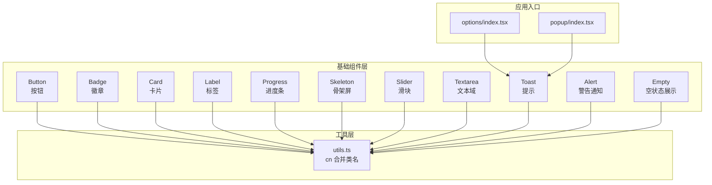

图表来源
- [button.tsx:1-51](file://src/components/ui/button.tsx#L1-L51)
- [badge.tsx:1-34](file://src/components/ui/badge.tsx#L1-L34)
- [card.tsx:1-57](file://src/components/ui/card.tsx#L1-L57)
- [label.tsx:1-22](file://src/components/ui/label.tsx#L1-L22)
- [progress.tsx:1-26](file://src/components/ui/progress.tsx#L1-L26)
- [skeleton.tsx:1-8](file://src/components/ui/skeleton.tsx#L1-L8)
- [slider.tsx:1-24](file://src/components/ui/slider.tsx#L1-L24)
- [textarea.tsx:1-22](file://src/components/ui/textarea.tsx#L1-L22)
- [toast.tsx:1-127](file://src/components/ui/toast.tsx#L1-L127)
- [alert.tsx:1-60](file://src/components/ui/alert.tsx#L1-L60)
- [empty.tsx:1-105](file://src/components/ui/empty.tsx#L1-L105)
- [utils.ts:1-7](file://src/lib/utils.ts#L1-L7)
- [index.tsx（选项页入口）:1-19](file://src/options/index.tsx#L1-L19)
- [index.tsx（弹出页入口）:1-17](file://src/popup/index.tsx#L1-L17)

章节来源
- [button.tsx:1-51](file://src/components/ui/button.tsx#L1-L51)
- [badge.tsx:1-34](file://src/components/ui/badge.tsx#L1-L34)
- [card.tsx:1-57](file://src/components/ui/card.tsx#L1-L57)
- [label.tsx:1-22](file://src/components/ui/label.tsx#L1-L22)
- [progress.tsx:1-26](file://src/components/ui/progress.tsx#L1-L26)
- [skeleton.tsx:1-8](file://src/components/ui/skeleton.tsx#L1-L8)
- [slider.tsx:1-24](file://src/components/ui/slider.tsx#L1-L24)
- [textarea.tsx:1-22](file://src/components/ui/textarea.tsx#L1-L22)
- [toast.tsx:1-127](file://src/components/ui/toast.tsx#L1-L127)
- [alert.tsx:1-60](file://src/components/ui/alert.tsx#L1-L60)
- [empty.tsx:1-105](file://src/components/ui/empty.tsx#L1-L105)
- [utils.ts:1-7](file://src/lib/utils.ts#L1-L7)
- [index.tsx（选项页入口）:1-19](file://src/options/index.tsx#L1-L19)
- [index.tsx（弹出页入口）:1-17](file://src/popup/index.tsx#L1-L17)

## 核心组件
- Button：支持多种变体与尺寸，可透传原生 button 属性；支持 asChild 使用 Slot 包裹任意元素。
- Badge：用于标记状态或标签，提供默认/次要/破坏/描边四种变体。
- Card：卡片容器及子组件（头部、标题、描述、内容、底部），语义化结构清晰。
- Label：基于 Radix Label 的无障碍标签组件，配合表单控件使用。
- Progress：基于 Radix Progress，支持自定义指示器类名与数值。
- Skeleton：脉冲动画骨架屏，用于占位加载。
- Slider：基于 Radix Slider，提供轨道与拇指样式。
- Textarea：基于原生 textarea，内置通用样式与禁用态。
- Toast：基于 Radix Toast 的通知系统，包含 Provider、Viewport、Toast、Title、Description、Close、Action 等子组件。
- Alert：基于 class-variance-authority 的警告通知组件，包含 Alert、AlertTitle、AlertDescription 子组件。
- Empty：空状态展示组件，包含 Empty、EmptyHeader、EmptyTitle、EmptyDescription、EmptyContent、EmptyMedia 子组件。

章节来源
- [button.tsx:34-50](file://src/components/ui/button.tsx#L34-L50)
- [badge.tsx:25-33](file://src/components/ui/badge.tsx#L25-L33)
- [card.tsx:5-56](file://src/components/ui/card.tsx#L5-L56)
- [label.tsx:13-19](file://src/components/ui/label.tsx#L13-L19)
- [progress.tsx:6-22](file://src/components/ui/progress.tsx#L6-L22)
- [skeleton.tsx:3-5](file://src/components/ui/skeleton.tsx#L3-L5)
- [slider.tsx:6-20](file://src/components/ui/slider.tsx#L6-L20)
- [textarea.tsx:5-18](file://src/components/ui/textarea.tsx#L5-L18)
- [toast.tsx:10-126](file://src/components/ui/toast.tsx#L10-L126)
- [alert.tsx:22-59](file://src/components/ui/alert.tsx#L22-L59)
- [empty.tsx:5-104](file://src/components/ui/empty.tsx#L5-L104)

## 架构总览
组件以"原子化 + 组合"方式构建，统一通过 cn 工具合并 Tailwind 类，确保主题一致性与可定制性。Toast 系统在应用入口中挂载 Toaster，形成全局通知能力。新增的 Alert 和 Empty 组件采用 class-variance-authority 实现一致的样式系统。

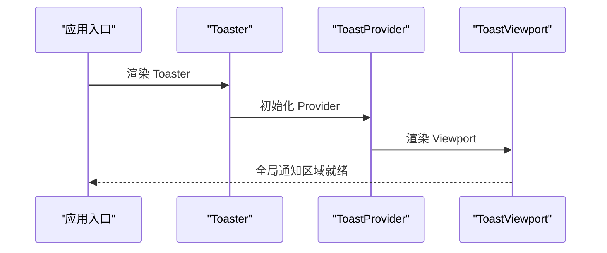

图表来源
- [index.tsx（选项页入口）:6-16](file://src/options/index.tsx#L6-L16)
- [toast.tsx:8-23](file://src/components/ui/toast.tsx#L8-L23)

章节来源
- [index.tsx（选项页入口）:1-19](file://src/options/index.tsx#L1-L19)
- [toast.tsx:1-127](file://src/components/ui/toast.tsx#L1-L127)

## 详细组件分析

### Button 按钮
- 设计原则
  - 变体与尺寸通过 class-variance-authority 统一管理，支持默认、破坏、描边、次要、幽灵、链接六种变体与默认、小、大、图标四种尺寸。
  - 支持 asChild 将渲染节点替换为 Slot，便于包裹链接或自定义元素。
- 关键属性
  - className：追加自定义类名
  - variant：变体选择
  - size：尺寸选择
  - asChild：是否以子元素作为渲染根
  - 其余透传至原生 button
- 无障碍与交互
  - 内置焦点可见性与环形焦点样式，支持键盘操作
  - 禁用态自动降权与阻止交互
- 样式定制
  - 通过 variant/size 调整外观与尺寸；如需微调，可在外部传入 className 或覆盖默认类名
- 最佳实践
  - 图标按钮建议使用 icon 尺寸与 asChild 包裹 a/Link
  - 危险操作使用 destructive 变体，搭配确认对话框

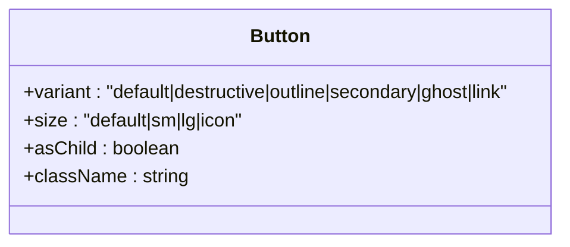

图表来源
- [button.tsx:7-32](file://src/components/ui/button.tsx#L7-L32)

章节来源
- [button.tsx:1-51](file://src/components/ui/button.tsx#L1-L51)

### Badge 徽章
- 设计原则
  - 用于状态标识与辅助信息展示，强调简洁与可读性
- 关键属性
  - variant：default/secondary/destructive/outline
  - className：自定义类名
- 样式定制
  - 通过 variant 切换背景与边框；必要时叠加 className 实现特殊效果
- 最佳实践
  - 与 Button/Label 组合使用，突出关键状态

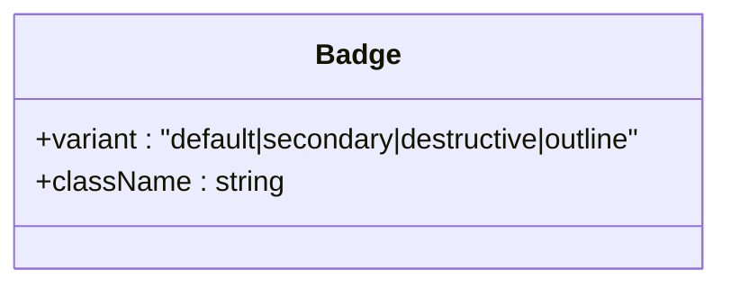

图表来源
- [badge.tsx:6-23](file://src/components/ui/badge.tsx#L6-L23)

章节来源
- [badge.tsx:1-34](file://src/components/ui/badge.tsx#L1-L34)

### Card 卡片
- 设计原则
  - 结构化布局，语义化子组件明确职责
- 子组件
  - Card/CardHeader/CardTitle/CardDescription/CardContent/CardFooter
- 最佳实践
  - 使用 CardHeader + CardTitle 组合呈现标题；CardDescription 提供简要说明；CardContent 放置主体内容；CardFooter 放置操作区

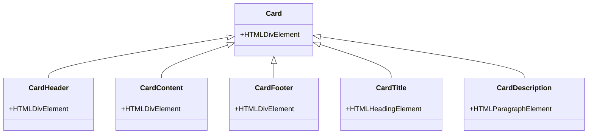

图表来源
- [card.tsx:5-56](file://src/components/ui/card.tsx#L5-L56)

章节来源
- [card.tsx:1-57](file://src/components/ui/card.tsx#L1-L57)

### Label 标签
- 设计原则
  - 与表单控件配对使用，提升可点击范围与可访问性
- 关键属性
  - 透传至 Radix Label Root
- 最佳实践
  - 与 Input/Textarea/Select 等控件配合，点击标签激活对应控件

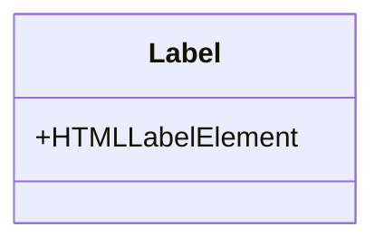

图表来源
- [label.tsx:13-19](file://src/components/ui/label.tsx#L13-L19)

章节来源
- [label.tsx:1-22](file://src/components/ui/label.tsx#L1-L22)

### Progress 进度条
- 设计原则
  - 基于 Radix Progress，提供轨道与指示器，支持自定义指示器类名
- 关键属性
  - value：当前进度百分比
  - indicatorClassName：指示器自定义类名
- 最佳实践
  - 与 Skeleton 配合，先显示骨架屏再更新进度值

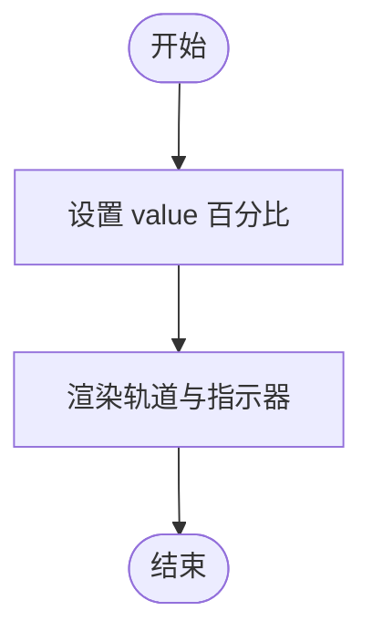

图表来源
- [progress.tsx:6-22](file://src/components/ui/progress.tsx#L6-L22)

章节来源
- [progress.tsx:1-26](file://src/components/ui/progress.tsx#L1-L26)

### Skeleton 骨架屏
- 设计原则
  - 使用脉冲动画与低透明度背景，降低加载感知压力
- 关键属性
  - className：自定义类名
- 最佳实践
  - 在数据未就绪时优先渲染骨架屏，随后替换为真实内容

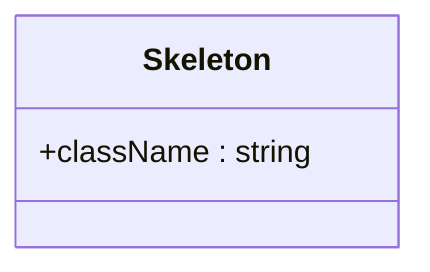

图表来源
- [skeleton.tsx:3-5](file://src/components/ui/skeleton.tsx#L3-L5)

章节来源
- [skeleton.tsx:1-8](file://src/components/ui/skeleton.tsx#L1-L8)

### Slider 滑块
- 设计原则
  - 提供轨道与范围，拇指支持键盘与触控交互
- 关键属性
  - 透传至 Radix Slider Root
- 最佳实践
  - 与 Tooltip/Popover 组合展示实时数值

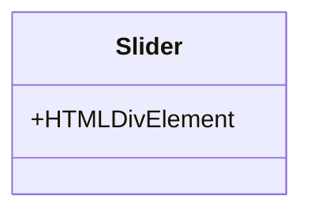

图表来源
- [slider.tsx:6-20](file://src/components/ui/slider.tsx#L6-L20)

章节来源
- [slider.tsx:1-24](file://src/components/ui/slider.tsx#L1-L24)

### Textarea 文本域
- 设计原则
  - 统一样式与禁用态，支持多行输入与占位符
- 关键属性
  - 透传至原生 textarea
- 最佳实践
  - 与 Form 组件配合，结合 Label 与 FormMessage 提升可访问性

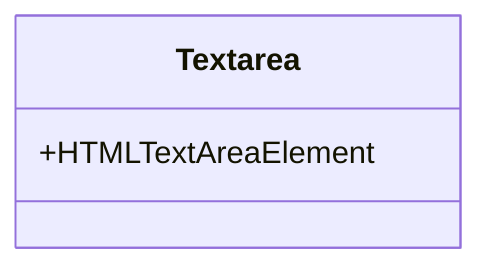

图表来源
- [textarea.tsx:5-18](file://src/components/ui/textarea.tsx#L5-L18)

章节来源
- [textarea.tsx:1-22](file://src/components/ui/textarea.tsx#L1-L22)

### Toast 提示
- 设计原则
  - 基于 Radix Toast，提供 Provider/Viewport/Toast/Title/Description/Close/Action 等子组件，支持手势滑动关闭与动画过渡
- 关键属性
  - Toast: variant（default/destructive）
  - Close: 默认带关闭图标，支持破坏性样式下的高亮
  - Action: 可选操作按钮，支持破坏性样式
- 最佳实践
  - 在应用入口挂载 Toaster，集中管理通知；错误场景使用 destructive 变体

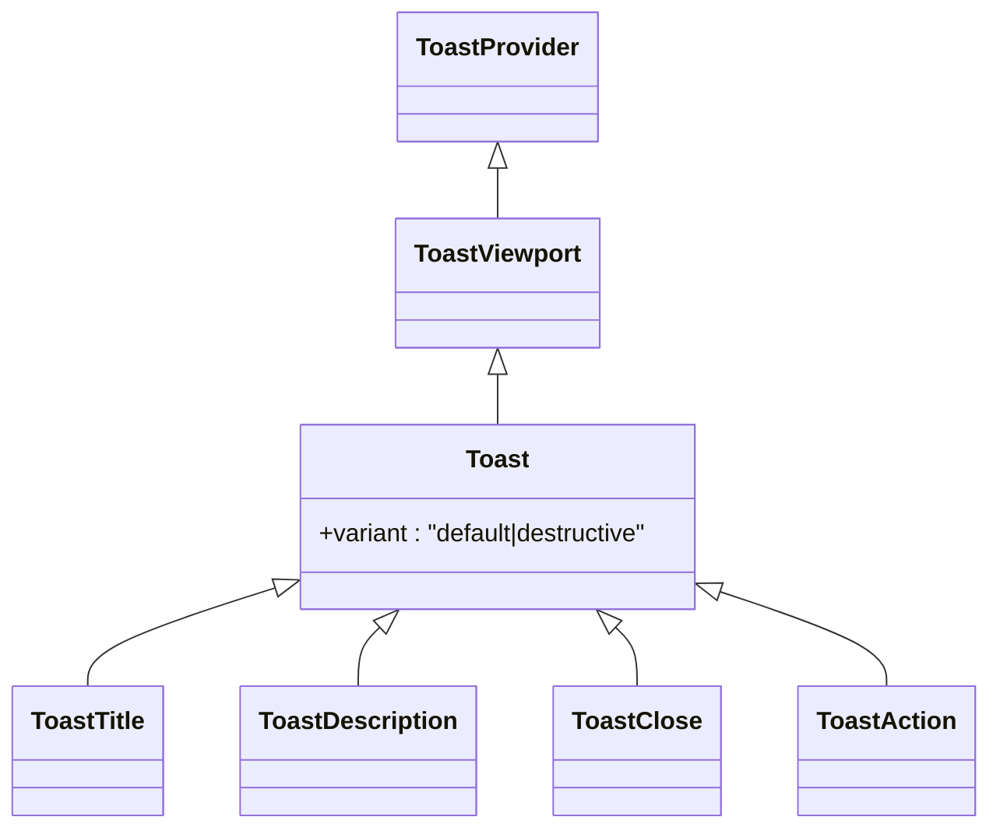

图表来源
- [toast.tsx:8-126](file://src/components/ui/toast.tsx#L8-L126)

章节来源
- [toast.tsx:1-127](file://src/components/ui/toast.tsx#L1-L127)
- [index.tsx（选项页入口）:6-16](file://src/options/index.tsx#L6-L16)

### Alert 警告通知
- 设计原则
  - 基于 class-variance-authority 实现一致的样式系统，支持默认与破坏性两种变体
  - 内置 SVG 图标支持，自动定位到左上角，内容区域自动留出图标空间
  - 语义化结构，AlertTitle 作为标题，AlertDescription 作为描述内容
- 子组件
  - Alert：容器组件，支持 variant 属性
  - AlertTitle：标题组件，使用 h5 元素
  - AlertDescription：描述组件，支持段落元素的行高调整
- 关键属性
  - Alert: variant（default/destructive），className（自定义类名）
  - AlertTitle: className（自定义类名）
  - AlertDescription: className（自定义类名）
- 无障碍与交互
  - Alert 设置 role="alert"，提升可访问性
  - 内置图标与内容的间距处理，确保视觉层次清晰
- 样式定制
  - 通过 variant 切换颜色主题；支持通过 className 扩展样式
- 最佳实践
  - 错误场景使用 destructive 变体；与 Toast 组合使用时注意区分用途

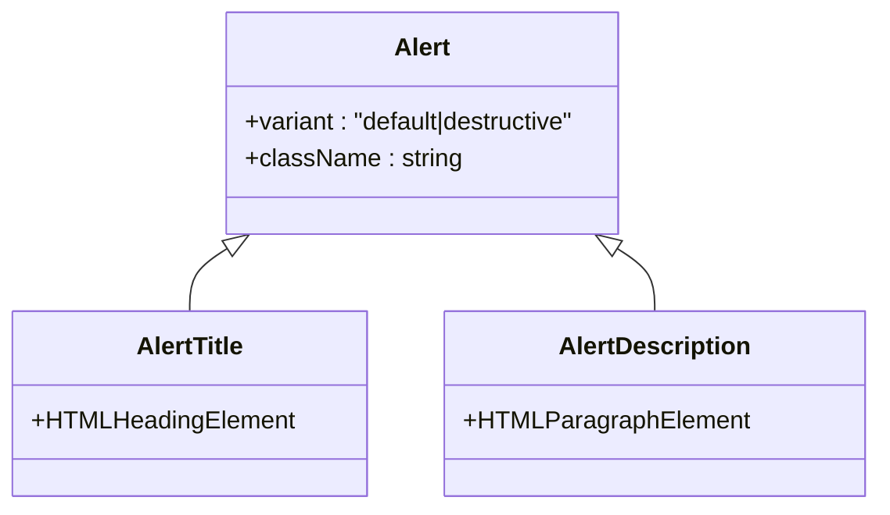

图表来源
- [alert.tsx:22-59](file://src/components/ui/alert.tsx#L22-L59)

章节来源
- [alert.tsx:1-60](file://src/components/ui/alert.tsx#L1-L60)

### Empty 空状态展示
- 设计原则
  - 采用 data-slot 属性系统，便于样式定制与主题适配
  - 支持多种布局模式：默认（无背景）、icon（带背景的图标模式）
  - 响应式设计，移动端与桌面端有不同内边距
- 子组件
  - Empty：主容器，支持 data-slot="empty"
  - EmptyHeader：头部容器，支持 data-slot="empty-header"
  - EmptyTitle：标题，支持 data-slot="empty-title"
  - EmptyDescription：描述文本，支持链接样式
  - EmptyContent：内容容器，支持 data-slot="empty-content"
  - EmptyMedia：媒体区域，支持 variant 属性
- 关键属性
  - Empty/EmptyHeader/EmptyTitle/EmptyDescription/EmptyContent: className（自定义类名）
  - EmptyMedia: variant（default/icon），className（自定义类名）
- 样式定制
  - 通过 data-slot 属性进行精确样式控制
  - EmptyMedia 支持通过 variant 切换背景与图标样式
- 最佳实践
  - 与列表、表格等组件配合使用，提供友好的空状态反馈
  - 图标模式适合简单场景，纯文本模式适合详细说明

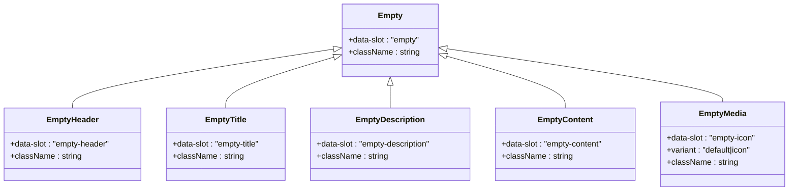

图表来源
- [empty.tsx:5-104](file://src/components/ui/empty.tsx#L5-L104)

章节来源
- [empty.tsx:1-105](file://src/components/ui/empty.tsx#L1-L105)

## 依赖分析
- 组件依赖
  - @radix-ui/react-*：Button/Label/Progress/Slider/Toast 等均基于 Radix UI 原子组件
  - class-variance-authority：统一管理变体与尺寸，Alert、Empty 组件采用此库实现样式系统
  - lucide-react：提供图标（如 ToastClose 中的 X）
- 工具依赖
  - clsx/tailwind-merge：类名合并与冲突修复
- 应用集成
  - 选项页与弹出页入口均引入 Toaster，形成全局通知

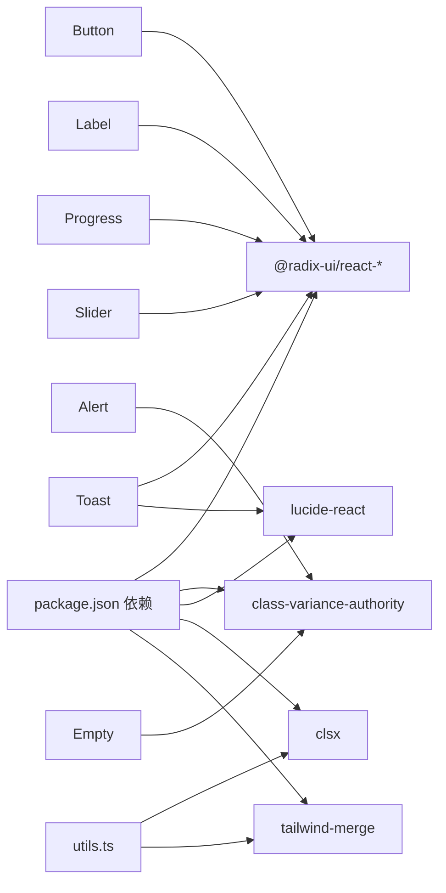

图表来源
- [package.json:29-58](file://package.json#L29-L58)
- [button.tsx:1-51](file://src/components/ui/button.tsx#L1-L51)
- [label.tsx:1-22](file://src/components/ui/label.tsx#L1-L22)
- [progress.tsx:1-26](file://src/components/ui/progress.tsx#L1-L26)
- [slider.tsx:1-24](file://src/components/ui/slider.tsx#L1-L24)
- [toast.tsx:1-127](file://src/components/ui/toast.tsx#L1-L127)
- [alert.tsx:1-60](file://src/components/ui/alert.tsx#L1-L60)
- [empty.tsx:1-105](file://src/components/ui/empty.tsx#L1-L105)
- [utils.ts:1-7](file://src/lib/utils.ts#L1-L7)

章节来源
- [package.json:1-95](file://package.json#L1-L95)

## 性能考虑
- 渲染开销
  - 组件均为轻量封装，避免不必要的重渲染
  - 使用 asChild 时注意仅包裹可交互元素，减少 DOM 层级
  - Alert、Empty 组件采用 class-variance-authority，样式计算在组件初始化时完成
- 动画与过渡
  - Toast 与 Progress 使用 CSS 动画，建议在低端设备上谨慎使用复杂动画
  - Alert 组件无动画，保持轻量性能
- 样式合并
  - 通过 cn 合并类名，避免重复样式导致的渲染抖动
  - class-variance-authority 在运行时进行样式计算，建议在静态样式较多的场景使用

## 故障排查指南
- 可访问性问题
  - Label 未正确绑定控件：检查 htmlFor 是否与控件 id 对应
  - 进度条无语义：确保与屏幕阅读器友好的描述文本配合
  - Alert 缺少 role 属性：确认已设置 role="alert"
- 样式冲突
  - 多次传入 className 时，后传入的类名会覆盖同名 Tailwind 类；使用 twMerge 可避免冲突
  - Alert、Empty 组件的 data-slot 属性可能影响样式选择器，注意样式优先级
- 通知不显示
  - 确认应用入口已挂载 Toaster，且 Provider/Viewport 正常渲染
- Alert、Empty 组件问题
  - EmptyMedia 的 variant 属性未生效：检查 variant 值是否为 default 或 icon
  - Alert 图标显示异常：确认 SVG 元素正确放置在 Alert 内部

章节来源
- [label.tsx:82-96](file://src/components/ui/label.tsx#L82-L96)
- [toast.tsx:8-23](file://src/components/ui/toast.tsx#L8-L23)
- [alert.tsx:28-29](file://src/components/ui/alert.tsx#L28-L29)
- [empty.tsx:54-55](file://src/components/ui/empty.tsx#L54-L55)
- [utils.ts:4-6](file://src/lib/utils.ts#L4-L6)

## 结论
该套基础 UI 组件以 Radix UI 为核心，结合 class-variance-authority 与 Tailwind，实现了高可定制、强可访问、易组合的组件体系。新增的 Alert、Empty 组件进一步完善了通知与状态展示能力，采用 class-variance-authority 实现了一致的样式系统。通过统一的工具函数与清晰的子组件结构，开发者可以快速搭建一致的界面风格，并在需要时进行深度定制。

## 附录

### 组件组合与注意事项
- 表单组合
  - 使用 Form/FormField/FormItem/FormControl/FormControl/ FormLabel/FormDescription/FormMessage 构建完整表单，Label 与 Input/Textarea 配合，FormMessage 展示校验信息
- 通知组合
  - 在应用入口挂载 Toaster，ToastViewport 控制位置与动画；根据场景选择 default 或 destructive 变体
  - Alert 适合短时间的警告提示，Toast 适合持久的通知提醒
- 状态展示组合
  - Empty 组件适合列表、表格等数据为空时的状态提示
  - Alert 适合错误、警告等重要信息的即时提示
- 加载与进度
  - Skeleton 与 Progress 搭配：Skeleton 先显示，数据到达后切换为 Progress 并更新数值
- 滑块与提示
  - Slider 与 Popover/Tooltip 组合，实时展示当前值

章节来源
- [form.tsx:1-168](file://src/components/ui/form.tsx#L1-L168)
- [input.tsx:1-23](file://src/components/ui/input.tsx#L1-L23)
- [popover.tsx:1-33](file://src/components/ui/popover.tsx#L1-L33)
- [index.tsx（选项页入口）:6-16](file://src/options/index.tsx#L6-L16)
- [alert.tsx:22-59](file://src/components/ui/alert.tsx#L22-L59)
- [empty.tsx:5-104](file://src/components/ui/empty.tsx#L5-L104)