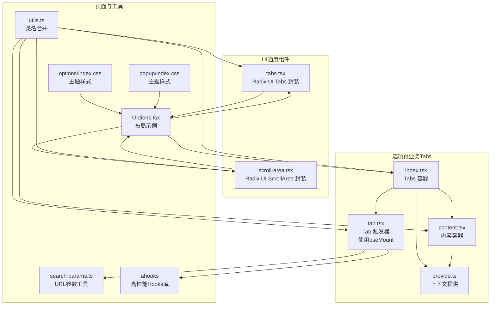
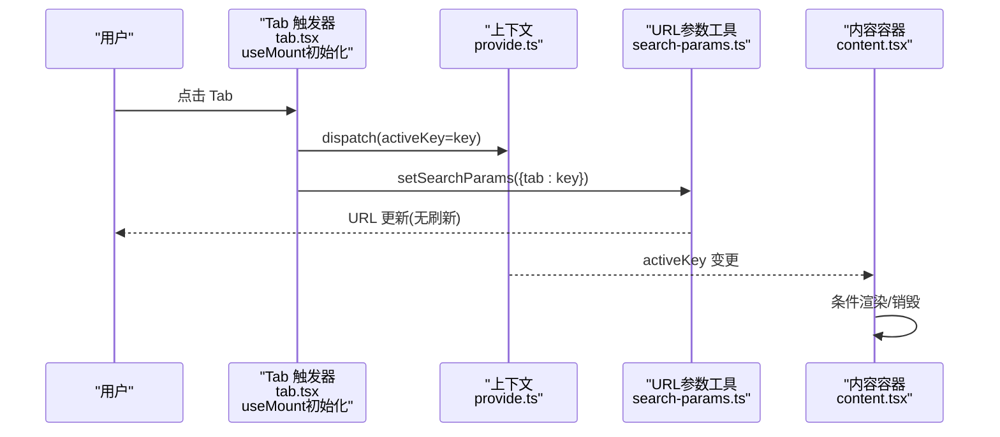
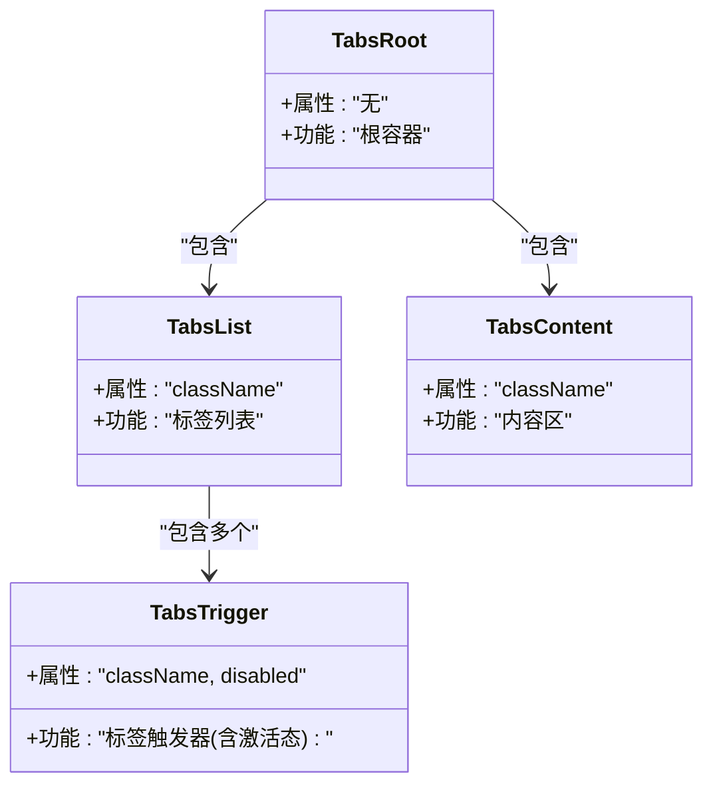
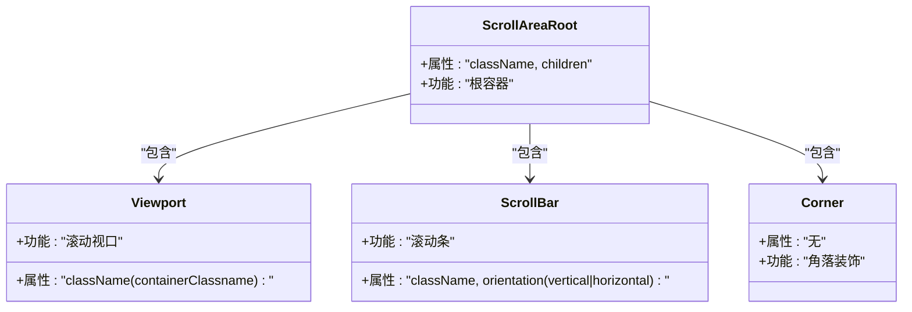
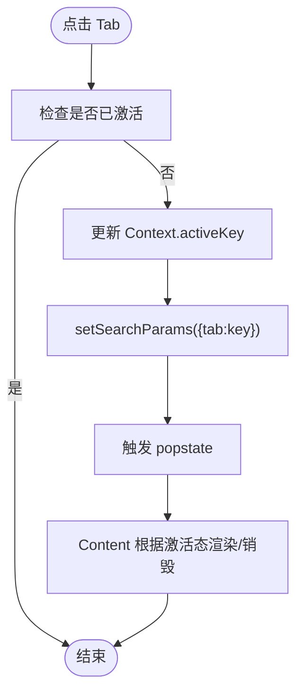
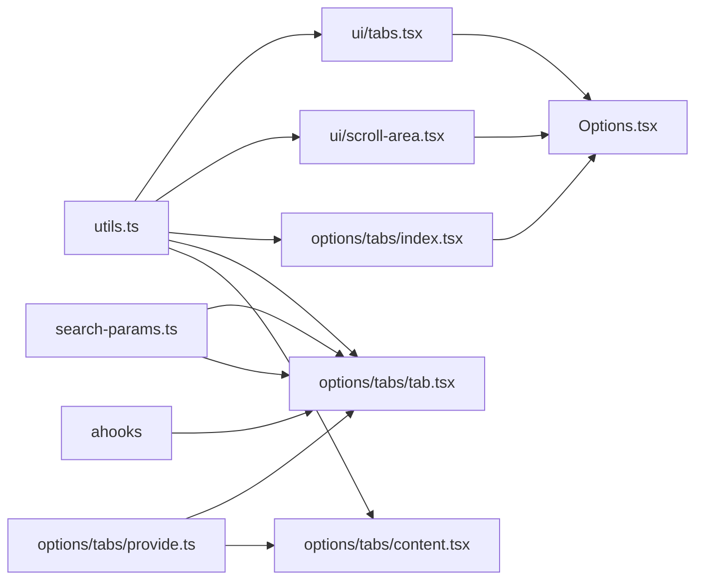

# 布局组件

<cite>
**本文引用的文件**
- [src/components/ui/tabs.tsx](file://src/components/ui/tabs.tsx)
- [src/components/ui/scroll-area.tsx](file://src/components/ui/scroll-area.tsx)
- [src/options/components/tabs/index.tsx](file://src/options/components/tabs/index.tsx)
- [src/options/components/tabs/tab.tsx](file://src/options/components/tabs/tab.tsx)
- [src/options/components/tabs/content.tsx](file://src/options/components/tabs/content.tsx)
- [src/options/components/tabs/provide.ts](file://src/options/components/tabs/provide.ts)
- [src/options/Options.tsx](file://src/options/Options.tsx)
- [src/utils/search-params.ts](file://src/utils/search-params.ts)
- [src/lib/utils.ts](file://src/lib/utils.ts)
- [src/options/index.css](file://src/options/index.css)
- [src/popup/index.css](file://src/popup/index.css)
- [package.json](file://package.json)
</cite>

## 更新摘要
**变更内容**
- 更新Tabs和Tab组件的初始化机制，从useEffect改为useMount钩子
- 改进默认选项初始化性能，提升组件响应效率
- 新增ahooks库依赖说明

## 目录
1. [简介](#简介)
2. [项目结构](#项目结构)
3. [核心组件](#核心组件)
4. [架构总览](#架构总览)
5. [详细组件分析](#详细组件分析)
6. [依赖关系分析](#依赖关系分析)
7. [性能考量](#性能考量)
8. [故障排查指南](#故障排查指南)
9. [结论](#结论)
10. [附录：布局最佳实践与示例模式](#附录布局最佳实践与示例模式)

## 简介
本文件聚焦于布局相关组件，特别是 Tabs 标签页与 ScrollArea 滚动区域两类组件。我们将从系统架构、组件职责、数据流与处理逻辑、样式与响应式行为、性能与可维护性等方面进行深入解析，并结合实际页面（如选项页）中的应用示例，总结布局设计的最佳实践与常见模式。

**更新** 本版本特别关注Tabs和Tab组件的初始化机制优化，通过useMount钩子替代useEffect，提升了默认选项初始化的性能表现。

## 项目结构
- UI 层通用组件位于 src/components/ui，提供基础的语义化与可访问性封装，例如 Tabs 与 ScrollArea。
- 业务侧自定义 Tabs 组件位于 src/options/components/tabs，用于选项页的导航与内容切换。
- 页面入口与布局示例位于 src/options/Options.tsx，展示了如何组合 Tabs 与内容区域，以及如何通过 URL 参数驱动激活状态。
- 工具函数与样式层位于 src/lib/utils.ts 与各页面的 index.css 中，负责类名合并与主题变量注入。
- **新增** ahooks库作为高性能React Hooks工具库，提供useMount等优化钩子。

**图表来源**
- [src/components/ui/tabs.tsx:1-54](file://src/components/ui/tabs.tsx#L1-L54)
- [src/components/ui/scroll-area.tsx:1-47](file://src/components/ui/scroll-area.tsx#L1-L47)
- [src/options/components/tabs/index.tsx:1-52](file://src/options/components/tabs/index.tsx#L1-L52)
- [src/options/components/tabs/tab.tsx:1-75](file://src/options/components/tabs/tab.tsx#L1-L75)
- [src/options/components/tabs/content.tsx:1-27](file://src/options/components/tabs/content.tsx#L1-L27)
- [src/options/components/tabs/provide.ts:1-15](file://src/options/components/tabs/provide.ts#L1-L15)
- [src/options/Options.tsx:1-91](file://src/options/Options.tsx#L1-L91)
- [src/utils/search-params.ts:1-64](file://src/utils/search-params.ts#L1-L64)
- [src/lib/utils.ts:1-7](file://src/lib/utils.ts#L1-L7)
- [src/options/index.css:1-83](file://src/options/index.css#L1-L83)
- [src/popup/index.css:1-76](file://src/popup/index.css#L1-L76)
- [package.json:40](file://package.json#L40)

**章节来源**
- [src/options/Options.tsx:1-91](file://src/options/Options.tsx#L1-L91)
- [src/options/components/tabs/index.tsx:1-52](file://src/options/components/tabs/index.tsx#L1-L52)
- [src/components/ui/tabs.tsx:1-54](file://src/components/ui/tabs.tsx#L1-L54)
- [src/components/ui/scroll-area.tsx:1-47](file://src/components/ui/scroll-area.tsx#L1-L47)

## 核心组件
- Radix UI Tabs 封装（UI 通用）
  - 提供根容器、列表、触发器、内容区四个部分，支持无障碍与键盘导航。
  - 默认样式基于 Tailwind 与主题变量，可通过 className 扩展。
- 自定义选项页 Tabs（业务专用）
  - 通过 React Context 管理激活态，支持默认激活、点击切换、URL 同步。
  - 内容区支持按需销毁隐藏内容以减少内存占用。
  - **更新** Tab组件使用ahooks的useMount钩子进行初始化，相比useEffect具有更好的性能表现。
- ScrollArea 滚动区域（UI 通用）
  - 提供可定制的滚动条与视口，支持垂直/水平方向滚动。
  - 允许传入 containerClassname 以覆盖视口样式。

**更新** ahooks库提供了useMount等优化的React Hooks，专门用于处理组件挂载时的初始化逻辑，避免不必要的重复执行。

**章节来源**
- [src/components/ui/tabs.tsx:1-54](file://src/components/ui/tabs.tsx#L1-L54)
- [src/options/components/tabs/index.tsx:1-52](file://src/options/components/tabs/index.tsx#L1-L52)
- [src/options/components/tabs/tab.tsx:1-75](file://src/options/components/tabs/tab.tsx#L1-L75)
- [src/options/components/tabs/content.tsx:1-27](file://src/options/components/tabs/content.tsx#L1-L27)
- [src/components/ui/scroll-area.tsx:1-47](file://src/components/ui/scroll-area.tsx#L1-L47)

## 架构总览
下图展示了选项页中布局组件的交互流程：用户点击 Tab 触发器 -> 更新上下文状态 -> 同步 URL 参数 -> 内容区根据激活状态渲染或销毁。

**图表来源**
- [src/options/components/tabs/tab.tsx:16-28](file://src/options/components/tabs/tab.tsx#L16-L28)
- [src/options/components/tabs/provide.ts:1-15](file://src/options/components/tabs/provide.ts#L1-L15)
- [src/utils/search-params.ts:10-38](file://src/utils/search-params.ts#L10-L38)
- [src/options/components/tabs/content.tsx:10-24](file://src/options/components/tabs/content.tsx#L10-L24)

## 详细组件分析

### UI 通用组件：Tabs
- 组件构成
  - Root：标签页根容器
  - List：标签列表
  - Trigger：单个标签触发器
  - Content：对应内容区
- 样式与可访问性
  - 使用 Tailwind 类名与主题变量，支持禁用态、激活态视觉反馈与焦点环。
  - 通过 forwardRef 透传 ref，便于无障碍扩展。
- 使用场景
  - 任何需要分组切换内容的场景，如设置页、详情页分段、筛选面板等。

**图表来源**
- [src/components/ui/tabs.tsx:6-51](file://src/components/ui/tabs.tsx#L6-L51)

**章节来源**
- [src/components/ui/tabs.tsx:1-54](file://src/components/ui/tabs.tsx#L1-L54)

### UI 通用组件：ScrollArea
- 组件构成
  - Root：滚动区域根容器
  - Viewport：滚动视口
  - Scrollbar：滚动条（支持垂直/水平）
  - Corner：右下角装饰
- 样式与定制
  - 通过 containerClassname 覆盖视口样式，满足不同容器尺寸需求。
  - 滚动条宽度、边框与颜色基于 Tailwind 类名与主题变量控制。
- 使用场景
  - 需要统一滚动体验的面板、侧边栏、长列表等。

**图表来源**
- [src/components/ui/scroll-area.tsx:6-44](file://src/components/ui/scroll-area.tsx#L6-L44)

**章节来源**
- [src/components/ui/scroll-area.tsx:1-47](file://src/components/ui/scroll-area.tsx#L1-L47)

### 业务组件：选项页 Tabs（自定义）
- 组件构成
  - Tabs 容器：提供上下文、布局左右分区、克隆子内容并注入 keyValue。
  - Tab 触发器：读取上下文，点击更新激活态并同步 URL。
  - Content 内容区：根据激活态显示/销毁，支持 destroyOnHide。
  - provide 上下文：保存 activeKey 与 dispatch。
- 数据流
  - 点击 Tab -> 更新 Context.activeKey -> setSearchParams -> 触发 popstate -> Content 渲染切换或销毁。
- 样式与响应式
  - 左侧固定宽度导航列，右侧内容区自适应填充；支持暗色主题变量与边框线。
- 性能优化点
  - destroyOnHide 可避免隐藏内容常驻 DOM，降低内存占用与重渲染压力。
  - **更新** Tab组件使用useMount钩子替代useEffect，仅在组件首次挂载时执行默认激活逻辑，避免重复初始化。

**图表来源**
- [src/options/components/tabs/tab.tsx:16-28](file://src/options/components/tabs/tab.tsx#L16-L28)
- [src/utils/search-params.ts:10-38](file://src/utils/search-params.ts#L10-L38)
- [src/options/components/tabs/content.tsx:10-24](file://src/options/components/tabs/content.tsx#L10-L24)

**章节来源**
- [src/options/components/tabs/index.tsx:1-52](file://src/options/components/tabs/index.tsx#L1-L52)
- [src/options/components/tabs/tab.tsx:1-75](file://src/options/components/tabs/tab.tsx#L1-L75)
- [src/options/components/tabs/content.tsx:1-27](file://src/options/components/tabs/content.tsx#L1-L27)
- [src/options/components/tabs/provide.ts:1-15](file://src/options/components/tabs/provide.ts#L1-L15)

### 实际布局示例与模式
- 选项页布局（Options.tsx）
  - 使用自定义 Tabs 包裹多个 Tab 与 Content，左侧导航、右侧内容区。
  - 关键字段：defaultTab 由 URL 参数决定；Content.destroyOnHide 控制分析页内容按需销毁。
  - 结合 ScrollArea 可用于长内容区域，确保滚动一致性与可访问性。
- 响应式与主题
  - 通过 CSS 变量与暗色主题类名，实现明暗主题一致的布局风格。
  - 宽度、高度与阴影等样式统一在页面级 CSS 中定义，保证全局一致性。

**章节来源**
- [src/options/Options.tsx:12-91](file://src/options/Options.tsx#L12-L91)
- [src/options/index.css:1-83](file://src/options/index.css#L1-L83)
- [src/popup/index.css:1-76](file://src/popup/index.css#L1-L76)

## 依赖关系分析
- 组件耦合
  - 业务 Tabs 依赖 provide 上下文与 URL 参数工具；Content 依赖 Context 读取激活态。
  - UI 通用 Tabs 与 ScrollArea 仅依赖 Radix UI Primitive 与工具函数，内聚性高。
  - **更新** Tab组件依赖ahooks库的useMount钩子进行优化初始化。
- 外部依赖
  - Radix UI：提供无障碍与跨浏览器一致的交互。
  - Tailwind/TW Merge：类名合并与主题变量注入。
  - **新增** ahooks：提供高性能的React Hooks工具集，包括useMount等优化钩子。
- 潜在循环依赖
  - 当前结构清晰，未发现直接循环依赖；注意避免在 provide.ts 中引入 Tabs 的实现细节。

**图表来源**
- [src/lib/utils.ts:1-7](file://src/lib/utils.ts#L1-L7)
- [src/components/ui/tabs.tsx:1-54](file://src/components/ui/tabs.tsx#L1-L54)
- [src/components/ui/scroll-area.tsx:1-47](file://src/components/ui/scroll-area.tsx#L1-L47)
- [src/options/components/tabs/index.tsx:1-52](file://src/options/components/tabs/index.tsx#L1-L52)
- [src/options/components/tabs/tab.tsx:1-75](file://src/options/components/tabs/tab.tsx#L1-L75)
- [src/options/components/tabs/content.tsx:1-27](file://src/options/components/tabs/content.tsx#L1-L27)
- [src/options/components/tabs/provide.ts:1-15](file://src/options/components/tabs/provide.ts#L1-L15)
- [src/utils/search-params.ts:1-64](file://src/utils/search-params.ts#L1-L64)
- [src/options/Options.tsx:1-91](file://src/options/Options.tsx#L1-L91)
- [package.json:40](file://package.json#L40)

**章节来源**
- [src/lib/utils.ts:1-7](file://src/lib/utils.ts#L1-L7)
- [src/utils/search-params.ts:1-64](file://src/utils/search-params.ts#L1-L64)
- [src/options/components/tabs/provide.ts:1-15](file://src/options/components/tabs/provide.ts#L1-L15)

## 性能考量
- 按需销毁隐藏内容
  - 通过 Content.destroyOnHide 在切换标签时销毁非激活内容，减少 DOM 数量与重渲染开销。
- URL 同步与状态一致性
  - 使用 setSearchParams 替换历史记录而非新增，避免历史栈膨胀；手动触发 popstate 使依赖 URL 的监听者及时感知。
- 类名合并与样式复用
  - 使用 cn 合并 Tailwind 类，避免重复样式与冲突，提升样式层性能与可维护性。
- 主题变量与暗色模式
  - 通过 CSS 变量与暗色类名，减少运行时样式计算与切换抖动。
- **更新** useMount钩子优化初始化性能
  - Tab组件使用ahooks的useMount钩子替代useEffect，仅在组件首次挂载时执行默认激活逻辑，避免重复初始化。
  - 相比useEffect，useMount不会在组件重新渲染时重复执行，提升了默认选项初始化的响应效率。
  - 减少了不必要的状态更新和副作用执行，特别是在组件频繁重新渲染的场景下。

**章节来源**
- [src/options/components/tabs/content.tsx:14-14](file://src/options/components/tabs/content.tsx#L14-L14)
- [src/utils/search-params.ts:10-38](file://src/utils/search-params.ts#L10-L38)
- [src/lib/utils.ts:4-6](file://src/lib/utils.ts#L4-L6)
- [src/options/index.css:5-61](file://src/options/index.css#L5-L61)
- [src/options/components/tabs/tab.tsx:30-40](file://src/options/components/tabs/tab.tsx#L30-L40)

## 故障排查指南
- 症状：点击 Tab 不生效
  - 检查 Tab 是否正确消费上下文 activeKey；确认 dispatch 是否存在；确认 URL 同步是否执行。
- 症状：切换后内容未销毁
  - 检查 Content.destroyOnHide 是否启用；确认 keyValue 与 activeKey 是否匹配。
- 症状：URL 改变但内容未更新
  - 检查 setSearchParams 是否被调用；确认 popstate 监听是否正常；确认依赖 URL 的组件是否重新渲染。
- 症状：滚动条样式异常
  - 检查 containerClassname 是否覆盖了视口样式；确认 orientation 与 Tailwind 类是否匹配。
- **新增** 症状：默认激活不生效
  - 检查Tab组件是否正确使用useMount钩子；确认defaultTab属性是否传递；验证useMount钩子是否正常工作。
- **新增** 症状：ahooks依赖问题
  - 检查package.json中ahooks依赖是否正确安装；确认useMount导入路径是否正确。

**章节来源**
- [src/options/components/tabs/tab.tsx:16-28](file://src/options/components/tabs/tab.tsx#L16-L28)
- [src/options/components/tabs/content.tsx:14-24](file://src/options/components/tabs/content.tsx#L14-L24)
- [src/utils/search-params.ts:10-38](file://src/utils/search-params.ts#L10-L38)
- [src/components/ui/scroll-area.tsx:15-22](file://src/components/ui/scroll-area.tsx#L15-L22)

## 结论
- Tabs 与 ScrollArea 是构建复杂页面布局的基石：前者提供清晰的内容分组与切换体验，后者保障长内容的可访问性与一致性。
- 业务 Tabs 通过 Context 与 URL 参数实现"状态即路由"，既保证可恢复性，又简化了状态管理。
- **更新** 通过useMount钩子优化初始化性能，Tab组件的默认激活逻辑更加高效，避免了useEffect可能带来的重复执行问题。
- 建议在大型页面中优先采用"左侧导航 + 右侧内容"的双栏布局，并结合 destroyOnHide 优化性能；同时统一使用主题变量与 Tailwind 类，确保跨主题与跨设备的一致体验。

## 附录：布局最佳实践与示例模式
- 内容组织
  - 将导航与内容分离，使用固定宽度导航列与自适应内容区，提升信息密度与可读性。
  - 对于长内容区域，优先使用 ScrollArea，确保滚动条与视口样式一致。
- 导航设计
  - 使用 Tabs 触发器的激活态视觉反馈，明确当前选中项；必要时提供快捷键或键盘导航。
  - 通过 URL 参数驱动激活态，支持分享链接直达特定标签页。
  - **更新** 利用useMount钩子优化默认激活体验，确保组件初始化时的流畅性。
- 用户体验优化
  - 非激活内容按需销毁，减少内存占用；对昂贵组件延迟加载。
  - 使用主题变量与暗色模式适配，确保在不同环境下均具备良好的对比度与可读性。
  - **更新** 通过ahooks库提供的优化钩子，提升组件的响应速度和性能表现。
- 常见布局模式
  - 设置页：左侧导航 + 右侧表单/卡片，配合 ScrollArea 处理长列表。
  - 分析页：左侧筛选 + 右侧图表/表格，使用 destroyOnHide 减少渲染负担。
  - 详情页：顶部标签 + 底部内容，结合无障碍与键盘导航增强可访问性。
- **新增** 性能优化建议
  - 优先使用useMount替代useEffect处理一次性初始化逻辑
  - 利用ahooks提供的其他优化钩子提升组件性能
  - 避免在useEffect中执行可能重复的初始化操作

**章节来源**
- [src/options/Options.tsx:31-83](file://src/options/Options.tsx#L31-L83)
- [src/options/components/tabs/index.tsx:37-45](file://src/options/components/tabs/index.tsx#L37-L45)
- [src/components/ui/scroll-area.tsx:15-22](file://src/components/ui/scroll-area.tsx#L15-L22)
- [src/options/index.css:5-61](file://src/options/index.css#L5-L61)
- [src/options/components/tabs/tab.tsx:30-40](file://src/options/components/tabs/tab.tsx#L30-L40)