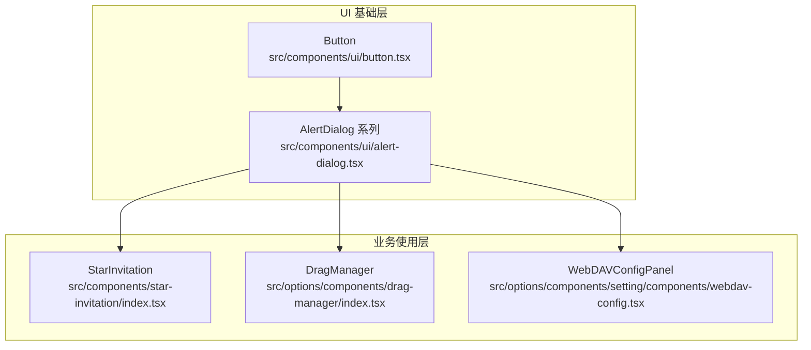
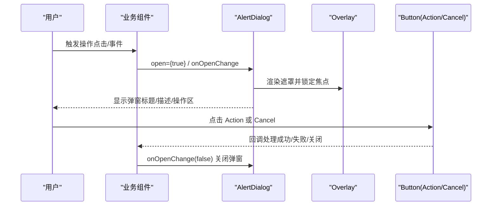
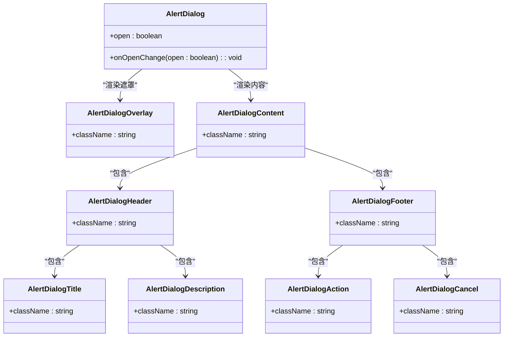
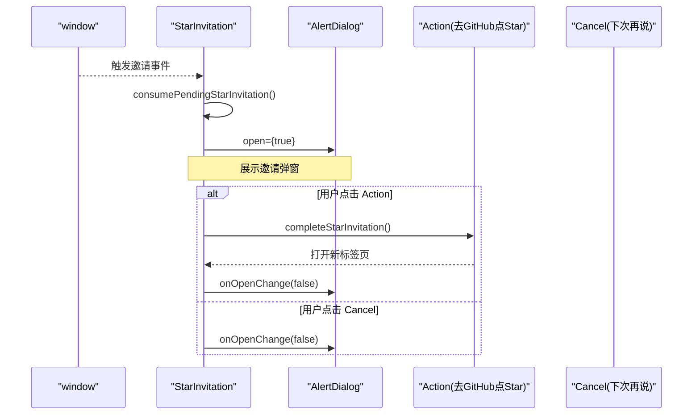
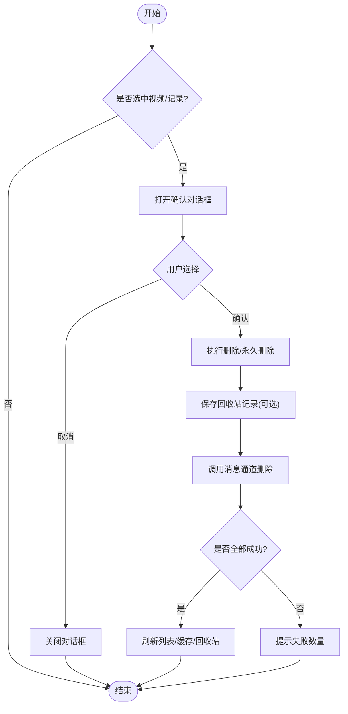
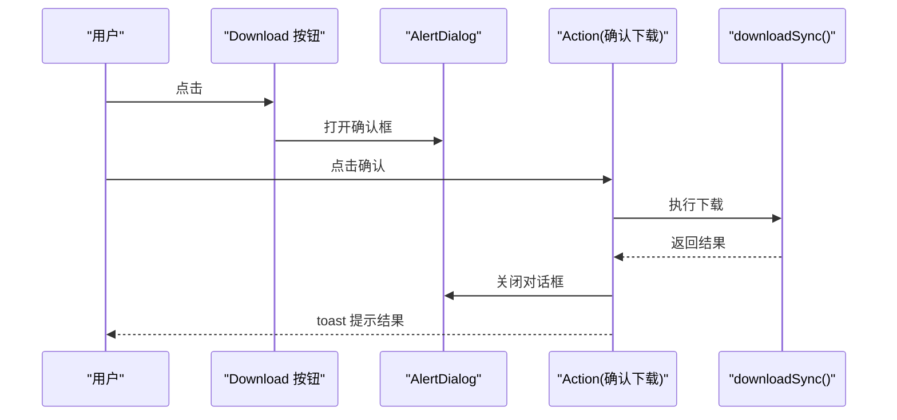
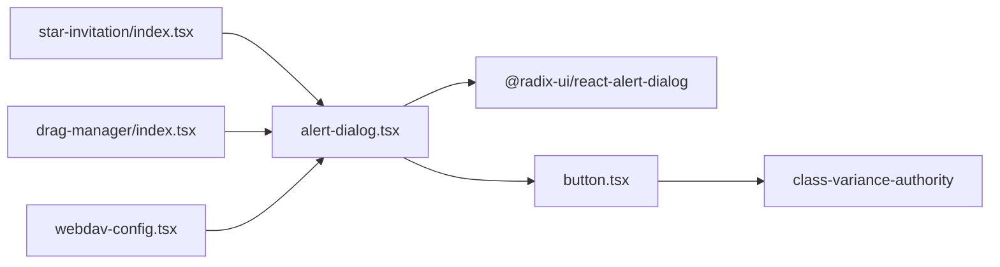

# 确认对话框组件

<cite>
**本文引用的文件**
- [alert-dialog.tsx](file://src/components/ui/alert-dialog.tsx)
- [button.tsx](file://src/components/ui/button.tsx)
- [star-invitation/index.tsx](file://src/components/star-invitation/index.tsx)
- [drag-manager/index.tsx](file://src/options/components/drag-manager/index.tsx)
- [webdav-config.tsx](file://src/options/components/setting/components/webdav-config.tsx)
</cite>

## 目录
1. [简介](#简介)
2. [项目结构](#项目结构)
3. [核心组件](#核心组件)
4. [架构总览](#架构总览)
5. [详细组件分析](#详细组件分析)
6. [依赖关系分析](#依赖关系分析)
7. [性能考虑](#性能考虑)
8. [故障排查指南](#故障排查指南)
9. [结论](#结论)

## 简介
本文件聚焦于“确认对话框组件”的实现与使用，覆盖基础能力、样式体系、交互流程、错误处理与性能要点。该组件基于 Radix UI 的无障碍原语封装，提供开箱即用的遮罩、焦点管理、键盘导航与动画过渡，并在项目中被多处业务场景复用（如删除确认、下载确认、邀请支持等）。

## 项目结构
- 基础 UI 层：位于 src/components/ui，包含 alert-dialog、button 等原子组件
- 业务使用层：在 options、components 等业务模块中组合使用基础组件完成具体交互
- 外部依赖：@radix-ui/react-alert-dialog 提供底层状态机与可访问性；class-variance-authority 用于按钮变体

图表来源
- [alert-dialog.tsx:1-125](file://src/components/ui/alert-dialog.tsx#L1-L125)
- [button.tsx:1-51](file://src/components/ui/button.tsx#L1-L51)
- [star-invitation/index.tsx:1-96](file://src/components/star-invitation/index.tsx#L1-L96)
- [drag-manager/index.tsx:1-593](file://src/options/components/drag-manager/index.tsx#L1-L593)
- [webdav-config.tsx:1-363](file://src/options/components/setting/components/webdav-config.tsx#L1-L363)

章节来源
- [alert-dialog.tsx:1-125](file://src/components/ui/alert-dialog.tsx#L1-L125)
- [button.tsx:1-51](file://src/components/ui/button.tsx#L1-L51)

## 核心组件
- AlertDialog 根容器：管理打开/关闭状态、焦点与可访问性
- AlertDialogTrigger：触发器，支持 asChild 透传
- AlertDialogPortal：将内容渲染到 Portal 以脱离父级层级
- AlertDialogOverlay：半透明遮罩，带入场/出场动画
- AlertDialogContent：居中弹窗主体，含滚动与尺寸控制
- AlertDialogHeader/Footer：标题区与操作区布局
- AlertDialogTitle/Description：语义化标题与描述
- AlertDialogAction/Cancel：主操作与取消按钮，默认复用 Button 变体

关键特性
- 基于 Radix 的状态机，保证键盘可达性与屏幕阅读器友好
- 通过 Tailwind 类名实现统一的视觉风格与动效
- 与 Button 组件解耦，便于统一主题与变体扩展

章节来源
- [alert-dialog.tsx:7-125](file://src/components/ui/alert-dialog.tsx#L7-L125)
- [button.tsx:7-50](file://src/components/ui/button.tsx#L7-L50)

## 架构总览
确认对话框在项目中采用“基础组件 + 业务组合”的分层模式：
- 基础层负责可访问性、状态机与通用样式
- 业务层负责文案、触发时机、副作用（如 API 调用）与结果反馈

图表来源
- [alert-dialog.tsx:13-44](file://src/components/ui/alert-dialog.tsx#L13-L44)
- [alert-dialog.tsx:89-111](file://src/components/ui/alert-dialog.tsx#L89-L111)
- [star-invitation/index.tsx:62-91](file://src/components/star-invitation/index.tsx#L62-L91)
- [drag-manager/index.tsx:548-587](file://src/options/components/drag-manager/index.tsx#L548-L587)
- [webdav-config.tsx:325-349](file://src/options/components/setting/components/webdav-config.tsx#L325-L349)

## 详细组件分析

### 基础确认对话框（AlertDialog）
- 职责：提供可复用的确认弹窗骨架与行为
- 关键点：
  - 遮罩与内容分离，避免层级问题
  - 通过 forwardRef 暴露 ref，便于外部聚焦控制
  - 使用 cn 合并类名，兼容自定义样式覆盖
  - 动作按钮默认继承 Button 变体，保持主题一致

图表来源
- [alert-dialog.tsx:7-125](file://src/components/ui/alert-dialog.tsx#L7-L125)

章节来源
- [alert-dialog.tsx:7-125](file://src/components/ui/alert-dialog.tsx#L7-L125)

### 使用示例一：StarInvitation（邀请支持）
- 触发时机：监听窗口事件后展示
- 交互：支持跳转 GitHub 仓库，或选择“下次再说”
- 数据流：消费待处理的邀请请求 -> 打开弹窗 -> 执行动作 -> 关闭

图表来源
- [star-invitation/index.tsx:27-91](file://src/components/star-invitation/index.tsx#L27-L91)

章节来源
- [star-invitation/index.tsx:27-91](file://src/components/star-invitation/index.tsx#L27-L91)

### 使用示例二：DragManager（删除与永久删除）
- 场景：批量删除视频到回收站、清空回收站记录
- 交互：二次确认防止误删；成功后刷新列表与缓存
- 错误处理：网络/通信异常时提示并回滚部分状态

图表来源
- [drag-manager/index.tsx:321-395](file://src/options/components/drag-manager/index.tsx#L321-L395)
- [drag-manager/index.tsx:451-469](file://src/options/components/drag-manager/index.tsx#L451-L469)
- [drag-manager/index.tsx:548-587](file://src/options/components/drag-manager/index.tsx#L548-L587)

章节来源
- [drag-manager/index.tsx:321-395](file://src/options/components/drag-manager/index.tsx#L321-L395)
- [drag-manager/index.tsx:451-469](file://src/options/components/drag-manager/index.tsx#L451-L469)
- [drag-manager/index.tsx:548-587](file://src/options/components/drag-manager/index.tsx#L548-L587)

### 使用示例三：WebDAVConfigPanel（从云端下载确认）
- 场景：覆盖本地同步数据的危险操作需二次确认
- 交互：通过 Trigger 包裹按钮，点击后弹出确认框，确认后执行下载
- 反馈：成功/失败均通过 toast 提示

图表来源
- [webdav-config.tsx:325-349](file://src/options/components/setting/components/webdav-config.tsx#L325-L349)

章节来源
- [webdav-config.tsx:325-349](file://src/options/components/setting/components/webdav-config.tsx#L325-L349)

## 依赖关系分析
- 外部库
  - @radix-ui/react-alert-dialog：提供无样式、可访问的对话框原语
  - class-variance-authority：按钮变体系统
  - lucide-react：图标（在业务组件中使用）
- 内部依赖
  - Button：为 Action/Cancel 提供统一样式与交互
  - cn：类名合并工具
  - 业务 hooks/utils：如 star-invitation、video-trash、sync-service 等

图表来源
- [alert-dialog.tsx:1-6](file://src/components/ui/alert-dialog.tsx#L1-L6)
- [button.tsx:1-6](file://src/components/ui/button.tsx#L1-L6)
- [star-invitation/index.tsx:1-20](file://src/components/star-invitation/index.tsx#L1-L20)
- [drag-manager/index.tsx:1-32](file://src/options/components/drag-manager/index.tsx#L1-L32)
- [webdav-config.tsx:1-29](file://src/options/components/setting/components/webdav-config.tsx#L1-L29)

章节来源
- [alert-dialog.tsx:1-6](file://src/components/ui/alert-dialog.tsx#L1-L6)
- [button.tsx:1-6](file://src/components/ui/button.tsx#L1-L6)

## 性能考虑
- 渲染隔离：使用 Portal 将弹窗渲染至 body，避免父级 transform/overflow 影响
- 动画与重绘：遮罩与内容使用 CSS 过渡，减少 JS 计算；合理设置 z-index 避免重排
- 状态最小化：仅在需要时打开对话框，避免不必要的重渲染
- 批量操作：删除等耗时操作分批执行，配合 loading 状态提升体验
- 可访问性：Radix 自动处理焦点环与键盘导航，无需额外实现

[本节为通用指导，不直接分析具体文件]

## 故障排查指南
- 弹窗无法关闭
  - 检查 onOpenChange 是否正确传递并更新 open 状态
  - 确认未阻止默认行为导致焦点未回到触发元素
- 样式错乱
  - 检查 cn 合并后的类名是否被覆盖
  - 确认父容器是否存在 transform/overflow 导致定位异常
- 按钮样式不一致
  - 确保 Action/Cancel 使用 Button 变体，必要时传入 variant/size
- 异步操作失败
  - 捕获异常并通过 toast 提示
  - 对部分失败进行计数与回滚，保持 UI 与数据一致

章节来源
- [drag-manager/index.tsx:321-395](file://src/options/components/drag-manager/index.tsx#L321-L395)
- [webdav-config.tsx:71-122](file://src/options/components/setting/components/webdav-config.tsx#L71-L122)

## 结论
确认对话框组件在本项目中作为稳定的基础能力，结合 Radix 的可访问性与 Tailwind 的样式体系，提供了简洁一致的交互体验。业务侧通过组合 Header/Footer/Action/Cancel 快速构建各类确认场景，同时借助 toast 与状态管理保障用户体验与数据一致性。建议在新增确认场景时遵循现有模式：明确触发时机、提供清晰的标题与描述、区分主次操作、完善错误与成功反馈。