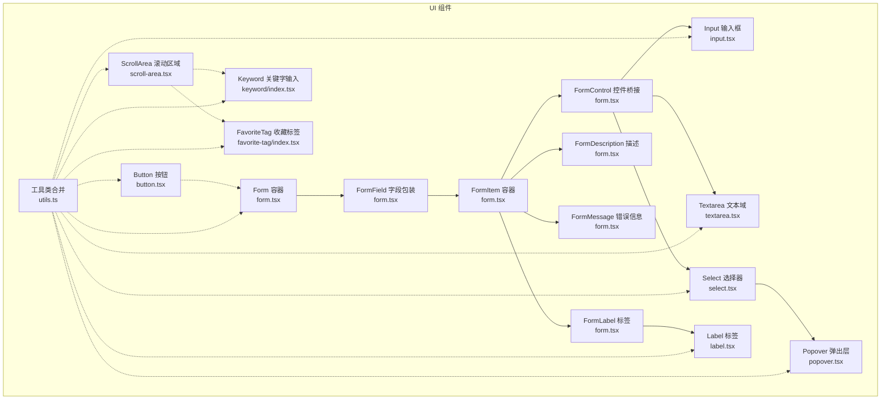
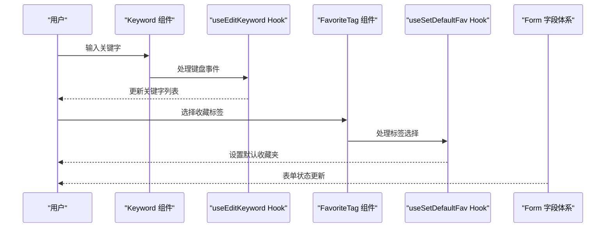
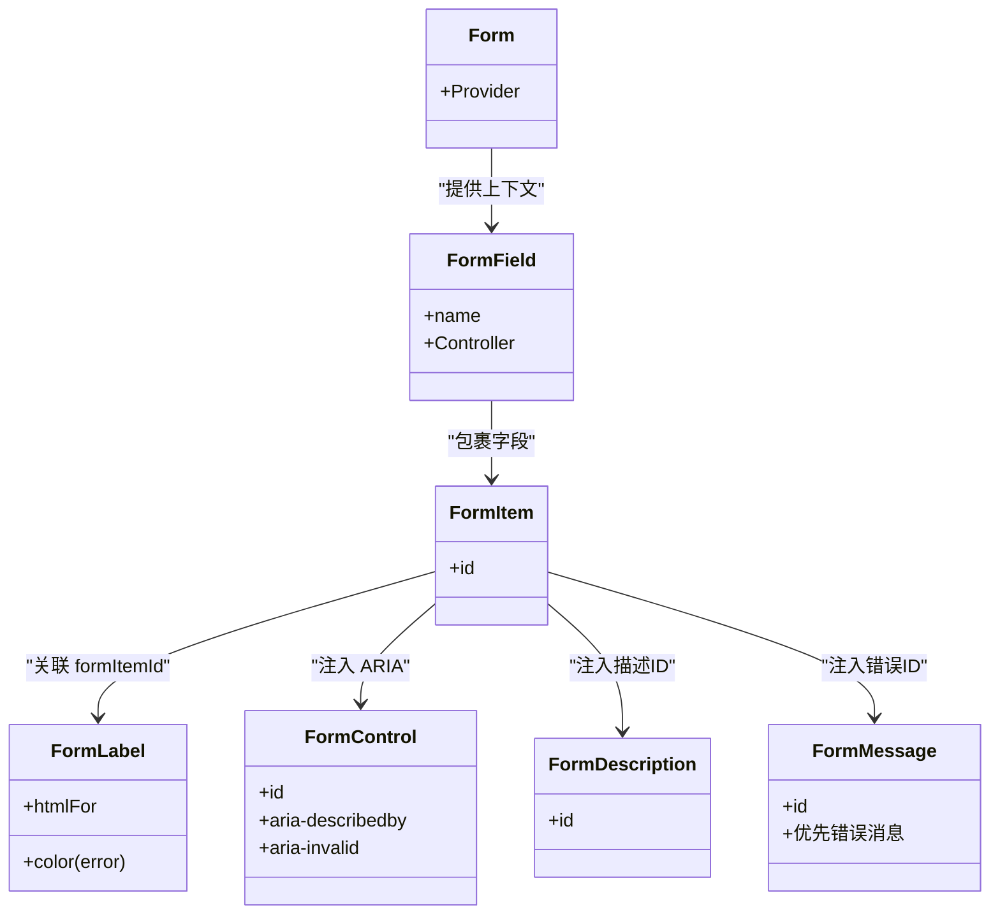
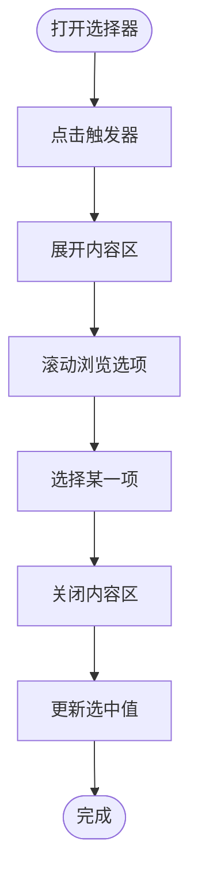
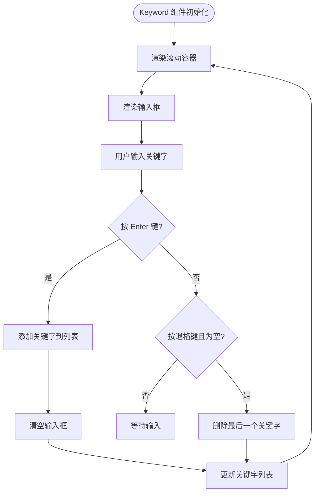
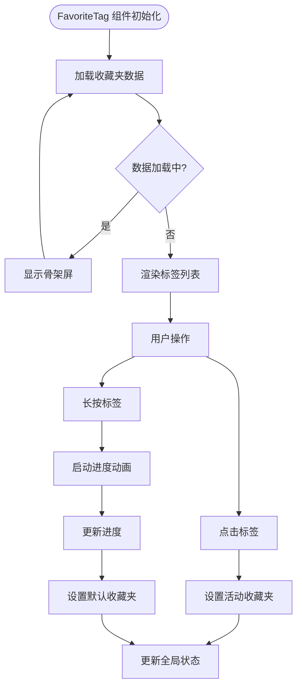
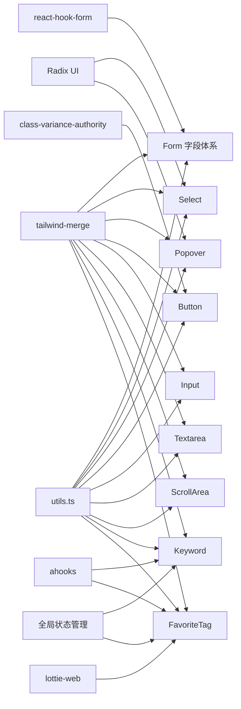

# 表单组件

<cite>
**本文引用的文件**
- [src/components/ui/form.tsx](file://src/components/ui/form.tsx)
- [src/components/ui/input.tsx](file://src/components/ui/input.tsx)
- [src/components/ui/select.tsx](file://src/components/ui/select.tsx)
- [src/components/ui/popover.tsx](file://src/components/ui/popover.tsx)
- [src/components/ui/label.tsx](file://src/components/ui/label.tsx)
- [src/components/ui/textarea.tsx](file://src/components/ui/textarea.tsx)
- [src/components/ui/button.tsx](file://src/components/ui/button.tsx)
- [src/components/ui/scroll-area.tsx](file://src/components/ui/scroll-area.tsx)
- [src/components/keyword/index.tsx](file://src/components/keyword/index.tsx)
- [src/components/favorite-tag/index.tsx](file://src/components/favorite-tag/index.tsx)
- [src/lib/utils.ts](file://src/lib/utils.ts)
- [src/hooks/use-create-keyword/index.tsx](file://src/hooks/use-create-keyword/index.tsx)
- [src/hooks/use-create-keyword-by-ai/index.tsx](file://src/hooks/use-create-keyword-by-ai/index.tsx)
- [src/hooks/use-edit-keyword/index.tsx](file://src/hooks/use-edit-keyword/index.tsx)
- [src/hooks/use-set-default-fav/index.tsx](file://src/hooks/use-set-default-fav/index.tsx)
- [src/options/index.css](file://src/options/index.css)
- [src/popup/index.css](file://src/popup/index.css)
</cite>

## 更新摘要
**变更内容**
- 新增 Keyword 关键字输入组件的样式改进分析
- 新增 FavoriteTag 收藏标签组件的样式优化说明
- 更新焦点状态和边框样式的实现细节
- 增强占位符文本样式的优化策略
- 扩展表单组件的交互体验分析

## 目录
1. [简介](#简介)
2. [项目结构](#项目结构)
3. [核心组件](#核心组件)
4. [架构总览](#架构总览)
5. [详细组件分析](#详细组件分析)
6. [新增组件分析](#新增组件分析)
7. [依赖分析](#依赖分析)
8. [性能考量](#性能考量)
9. [故障排查指南](#故障排查指南)
10. [结论](#结论)
11. [附录](#附录)

## 简介
本文件围绕表单相关组件进行系统化说明，重点覆盖以下内容：
- Form 表单容器与字段体系：Form、FormField、FormItem、FormLabel、FormControl、FormDescription、FormMessage 的职责与协作方式
- 输入控件：Input 输入框、Textarea 多行文本域
- 选择器：Select 选择器（含触发器、内容区、选项项、分组标签、滚动按钮等）
- 弹出层：Popover 弹出层（根节点、触发器、内容区）
- **新增**：Keyword 关键字输入组件，支持焦点状态、边框样式和占位符文本优化
- **新增**：FavoriteTag 收藏标签组件，提供标签选择和默认收藏设置功能
- 组件间协同：如何通过 Form + react-hook-form 实现数据绑定、验证、错误展示与无障碍属性联动
- 最佳实践：布局设计、用户体验优化、可访问性（ARIA）与错误处理策略
- 实际示例与常见场景：结合项目中的 Hook 使用模式，给出可复用的表单构建思路

## 项目结构
本项目的 UI 组件集中在 src/components/ui 下，采用"原子化组件 + 组合模式"的组织方式：
- form.tsx 提供 Form 容器与字段体系上下文
- input.tsx、textarea.tsx 提供基础输入控件
- select.tsx 提供完整的下拉选择器生态
- popover.tsx 提供弹出层基础能力
- label.tsx 提供标签样式变体
- button.tsx 提供按钮样式变体
- scroll-area.tsx 提供滚动区域组件
- **新增**：keyword.tsx 提供关键字输入功能
- **新增**：favorite-tag.tsx 提供收藏标签管理功能
- utils.ts 提供类名合并工具

**图表来源**
- [src/components/ui/form.tsx:16-167](file://src/components/ui/form.tsx#L16-L167)
- [src/components/ui/input.tsx:1-23](file://src/components/ui/input.tsx#L1-L23)
- [src/components/ui/textarea.tsx:1-22](file://src/components/ui/textarea.tsx#L1-L22)
- [src/components/ui/select.tsx:1-151](file://src/components/ui/select.tsx#L1-L151)
- [src/components/ui/popover.tsx:1-33](file://src/components/ui/popover.tsx#L1-L33)
- [src/components/ui/label.tsx:1-22](file://src/components/ui/label.tsx#L1-L22)
- [src/components/ui/button.tsx:1-51](file://src/components/ui/button.tsx#L1-L51)
- [src/components/ui/scroll-area.tsx:1-47](file://src/components/ui/scroll-area.tsx#L1-L47)
- [src/components/keyword/index.tsx:1-32](file://src/components/keyword/index.tsx#L1-L32)
- [src/components/favorite-tag/index.tsx:1-77](file://src/components/favorite-tag/index.tsx#L1-L77)
- [src/lib/utils.ts:1-7](file://src/lib/utils.ts#L1-L7)

**章节来源**
- [src/components/ui/form.tsx:16-167](file://src/components/ui/form.tsx#L16-L167)
- [src/components/ui/input.tsx:1-23](file://src/components/ui/input.tsx#L1-L23)
- [src/components/ui/textarea.tsx:1-22](file://src/components/ui/textarea.tsx#L1-L22)
- [src/components/ui/select.tsx:1-151](file://src/components/ui/select.tsx#L1-L151)
- [src/components/ui/popover.tsx:1-33](file://src/components/ui/popover.tsx#L1-L33)
- [src/components/ui/label.tsx:1-22](file://src/components/ui/label.tsx#L1-L22)
- [src/components/ui/button.tsx:1-51](file://src/components/ui/button.tsx#L1-L51)
- [src/components/ui/scroll-area.tsx:1-47](file://src/components/ui/scroll-area.tsx#L1-L47)
- [src/components/keyword/index.tsx:1-32](file://src/components/keyword/index.tsx#L1-L32)
- [src/components/favorite-tag/index.tsx:1-77](file://src/components/favorite-tag/index.tsx#L1-L77)
- [src/lib/utils.ts:1-7](file://src/lib/utils.ts#L1-L7)

## 核心组件
- Form 容器：基于 react-hook-form 的 FormProvider，提供全局表单上下文
- FormField 字段包装：将 Controller 与字段名关联，建立字段上下文
- FormItem 容器：为每个字段项生成唯一 ID，并作为子组件上下文
- FormLabel：读取字段状态，动态控制标签颜色与关联的输入 ID
- FormControl：将受控控件桥接到 Form 上下文，注入 ARIA 属性（描述/错误提示）
- FormDescription：辅助文本 ID 注入
- FormMessage：错误消息渲染，优先显示字段错误，否则回退到 children
- **新增**：Keyword 组件：提供关键字输入功能，支持焦点状态管理和边框样式优化
- **新增**：FavoriteTag 组件：提供收藏标签选择和默认收藏设置功能

**章节来源**
- [src/components/ui/form.tsx:16-167](file://src/components/ui/form.tsx#L16-L167)
- [src/components/keyword/index.tsx:10-29](file://src/components/keyword/index.tsx#L10-L29)
- [src/components/favorite-tag/index.tsx:13-73](file://src/components/favorite-tag/index.tsx#L13-L73)

## 架构总览
Form 字段体系通过 Context 将"字段名"、"描述 ID"、"错误 ID"等信息在树内传递，使 Label、Control、Message 能够正确联动。Select、Input、Textarea 等控件通过 FormControl 与 Form 字段体系对接，从而获得统一的验证、错误展示与无障碍体验。**新增的 Keyword 和 FavoriteTag 组件通过 Hook 与全局状态管理器集成，提供更丰富的表单交互体验。**

**图表来源**
- [src/components/keyword/index.tsx:12-25](file://src/components/keyword/index.tsx#L12-L25)
- [src/hooks/use-edit-keyword/index.tsx:64-102](file://src/hooks/use-edit-keyword/index.tsx#L64-L102)
- [src/components/favorite-tag/index.tsx:23-41](file://src/components/favorite-tag/index.tsx#L23-L41)
- [src/hooks/use-set-default-fav/index.tsx:40-73](file://src/hooks/use-set-default-fav/index.tsx#L40-L73)

## 详细组件分析

### Form 字段体系（Form/FormField/FormItem/FormLabel/FormControl/FormDescription/FormMessage）
- 设计要点
  - 通过 Context 传递字段名与 ID，避免重复计算与跨组件通信成本
  - FormControl 动态注入 aria-describedby 与 aria-invalid，提升可访问性
  - FormMessage 支持默认错误与自定义 children，便于灵活扩展
- 数据流
  - useFormField 读取字段状态与 ID
  - FormLabel/FormControl/FormDescription/FormMessage 依据字段状态渲染
- 错误处理
  - 当字段存在错误时，FormLabel 变色；FormControl 设置 aria-invalid；FormMessage 渲染错误文本

**图表来源**
- [src/components/ui/form.tsx:16-167](file://src/components/ui/form.tsx#L16-L167)

**章节来源**
- [src/components/ui/form.tsx:16-167](file://src/components/ui/form.tsx#L16-L167)

### Input 输入框
- 特点
  - 基于原生 input，提供尺寸、边框、占位符、聚焦环等通用样式
  - 通过 forwardRef 暴露 ref，便于与 FormControl 对接
- 无障碍
  - 交由 FormControl 注入 ID 与 ARIA 描述/错误属性

**章节来源**
- [src/components/ui/input.tsx:1-23](file://src/components/ui/input.tsx#L1-L23)

### Textarea 文本域
- 特点
  - 提供最小高度、圆角、边框、占位符、聚焦环等通用样式
  - 通过 forwardRef 暴露 ref，便于与 FormControl 对接

**章节来源**
- [src/components/ui/textarea.tsx:1-22](file://src/components/ui/textarea.tsx#L1-L22)

### Select 选择器
- 组件族
  - Root/Group/Value/Trigger/Content/Label/Item/Separator/ScrollUpButton/ScrollDownButton
- 交互特性
  - Trigger 聚焦时展开 Content，Viewport 内部滚动条与 popper 定位
  - Item 支持选中指示器与文本展示
- 无障碍
  - 通过 Radix UI 的语义化结构与 Portal 渲染，确保键盘可达与屏幕阅读器友好

**图表来源**
- [src/components/ui/select.tsx:13-125](file://src/components/ui/select.tsx#L13-L125)

**章节来源**
- [src/components/ui/select.tsx:1-151](file://src/components/ui/select.tsx#L1-L151)

### Popover 弹出层
- 组件族
  - Root/Trigger/Content（支持对齐与偏移）
- 适用场景
  - 与 Select/按钮等配合，承载复杂内容（如日期选择器、筛选面板）

**章节来源**
- [src/components/ui/popover.tsx:1-33](file://src/components/ui/popover.tsx#L1-L33)

### Label 标签
- 特点
  - 提供可变体样式，用于与输入控件建立视觉与语义关联
- 与 Form 的关系
  - FormLabel 基于 Label 并注入错误态样式与 htmlFor 关联

**章节来源**
- [src/components/ui/label.tsx:1-22](file://src/components/ui/label.tsx#L1-L22)

### Button 按钮
- 特点
  - 通过变体与尺寸变体提供一致的交互反馈
  - 支持 asChild 以嵌套其他元素（如 Link）

**章节来源**
- [src/components/ui/button.tsx:1-51](file://src/components/ui/button.tsx#L1-L51)

### ScrollArea 滚动区域
- 特点
  - 提供可定制的滚动条样式和滚动行为
  - 支持水平和垂直滚动
  - 通过 ScrollBar 组件提供细粒度的滚动条控制

**章节来源**
- [src/components/ui/scroll-area.tsx:1-47](file://src/components/ui/scroll-area.tsx#L1-L47)

## 新增组件分析

### Keyword 关键字输入组件
- 设计目标
  - 提供关键字输入和管理功能
  - 支持焦点状态管理和边框样式优化
  - 优化占位符文本样式，提升用户体验
- 核心特性
  - **焦点状态优化**：使用 `focus-within` 伪类实现容器级别的焦点状态管理
  - **边框样式改进**：动态边框颜色变化，从半透明到实色过渡
  - **占位符文本优化**：使用 `placeholder:text-b-primary/40` 实现半透明占位符
  - **滚动区域集成**：内置 ScrollArea 提供标签溢出处理
- 交互流程
  - 用户输入关键字后按 Enter 键添加
  - 支持退格删除最后一个关键字
  - 自动清空输入框内容

**图表来源**
- [src/components/keyword/index.tsx:14-29](file://src/components/keyword/index.tsx#L14-L29)
- [src/hooks/use-edit-keyword/index.tsx:64-102](file://src/hooks/use-edit-keyword/index.tsx#L64-L102)

**章节来源**
- [src/components/keyword/index.tsx:1-32](file://src/components/keyword/index.tsx#L1-L32)
- [src/hooks/use-edit-keyword/index.tsx:1-108](file://src/hooks/use-edit-keyword/index.tsx#L1-L108)

### FavoriteTag 收藏标签组件
- 设计目标
  - 提供收藏夹标签选择功能
  - 支持默认收藏夹设置和长按操作
  - 实现标签状态的视觉反馈
- 核心特性
  - **标签状态管理**：根据当前活动收藏夹和默认收藏夹设置不同样式
  - **长按操作支持**：通过 useLongPress Hook 实现长按设置默认收藏夹
  - **动画效果**：使用 Lottie 动画增强视觉反馈
  - **加载状态处理**：使用 Skeleton 组件提供加载时的占位符
- 交互流程
  - 点击标签切换活动收藏夹
  - 长按标签设置为默认收藏夹
  - 显示加载状态直到数据获取完成

**图表来源**
- [src/components/favorite-tag/index.tsx:63-73](file://src/components/favorite-tag/index.tsx#L63-L73)
- [src/hooks/use-set-default-fav/index.tsx:54-99](file://src/hooks/use-set-default-fav/index.tsx#L54-L99)

**章节来源**
- [src/components/favorite-tag/index.tsx:1-77](file://src/components/favorite-tag/index.tsx#L1-L77)
- [src/hooks/use-set-default-fav/index.tsx:1-126](file://src/hooks/use-set-default-fav/index.tsx#L1-L126)

## 依赖分析
- 组件内聚与耦合
  - Form 字段体系内部高度内聚，通过 Context 降低耦合
  - Input/Textarea/Select 仅依赖 FormControl 与 utils，保持低耦合
  - **新增**：Keyword 和 FavoriteTag 组件通过 Hook 与全局状态管理器集成
- 外部依赖
  - react-hook-form：提供表单上下文与字段状态
  - @radix-ui/react-*：提供无障碍语义与动画
  - class-variance-authority/tailwind-merge：提供样式变体与类名合并
  - **新增**：lottie-web：提供动画效果支持
  - **新增**：ahooks：提供自定义 Hook 功能
- 可能的循环依赖
  - 未发现直接循环依赖；Form 仅向下提供上下文，不反向依赖子组件
  - **新增**：Hook 与组件之间通过状态管理器解耦

**图表来源**
- [src/components/ui/form.tsx:1-11](file://src/components/ui/form.tsx#L1-L11)
- [src/components/ui/select.tsx:1-5](file://src/components/ui/select.tsx#L1-L5)
- [src/components/ui/popover.tsx:1-3](file://src/components/ui/popover.tsx#L1-L3)
- [src/components/ui/button.tsx:1-5](file://src/components/ui/button.tsx#L1-L5)
- [src/components/ui/scroll-area.tsx:1-5](file://src/components/ui/scroll-area.tsx#L1-L5)
- [src/components/keyword/index.tsx:1-5](file://src/components/keyword/index.tsx#L1-L5)
- [src/components/favorite-tag/index.tsx:1-7](file://src/components/favorite-tag/index.tsx#L1-L7)
- [src/lib/utils.ts:1-7](file://src/lib/utils.ts#L1-L7)

**章节来源**
- [src/components/ui/form.tsx:1-11](file://src/components/ui/form.tsx#L1-L11)
- [src/components/ui/select.tsx:1-5](file://src/components/ui/select.tsx#L1-L5)
- [src/components/ui/popover.tsx:1-3](file://src/components/ui/popover.tsx#L1-L3)
- [src/components/ui/button.tsx:1-5](file://src/components/ui/button.tsx#L1-L5)
- [src/components/ui/scroll-area.tsx:1-5](file://src/components/ui/scroll-area.tsx#L1-L5)
- [src/components/keyword/index.tsx:1-5](file://src/components/keyword/index.tsx#L1-L5)
- [src/components/favorite-tag/index.tsx:1-7](file://src/components/favorite-tag/index.tsx#L1-L7)
- [src/lib/utils.ts:1-7](file://src/lib/utils.ts#L1-L7)

## 性能考量
- 渲染开销
  - FormControl 仅注入必要属性，避免额外包装导致的重渲染
  - Select/Popover 使用 Portal 渲染，减少父级布局抖动
  - **新增**：Keyword 和 FavoriteTag 组件使用 useMemo 优化渲染性能
- 计算与合并
  - 使用 utils.ts 的类名合并工具，避免重复样式类导致的样式冲突与重绘
- 受控与非受控
  - 建议统一使用受控控件（由 Form/Controller 管理），减少状态同步问题
  - **新增**：Hook 通过全局状态管理器集中管理组件状态，避免重复渲染

## 故障排查指南
- FormLabel 未生效
  - 确认 FormField/FormItem 包裹顺序正确，且 FormControl 已注入 ID
- 错误信息不显示
  - 确认字段存在错误对象；FormMessage 会优先显示字段错误
- ARIA 属性无效
  - 确认 FormControl 正确注入 aria-describedby 与 aria-invalid
- Select/Popover 位置异常
  - 检查触发器尺寸与 viewport 尺寸是否一致；必要时调整 position 或 popper 样式
- **新增**：Keyword 组件焦点状态问题
  - 检查 focus-within 伪类是否正确应用到容器上
  - 确认边框样式类的优先级设置
- **新增**：FavoriteTag 组件交互问题
  - 检查长按操作是否正确触发
  - 确认全局状态更新是否正常执行

**章节来源**
- [src/components/ui/form.tsx:82-156](file://src/components/ui/form.tsx#L82-L156)
- [src/components/ui/select.tsx:61-91](file://src/components/ui/select.tsx#L61-L91)
- [src/components/ui/popover.tsx:9-30](file://src/components/ui/popover.tsx#L9-L30)
- [src/components/keyword/index.tsx:15-16](file://src/components/keyword/index.tsx#L15-L16)
- [src/components/favorite-tag/index.tsx:23-41](file://src/components/favorite-tag/index.tsx#L23-L41)

## 结论
本表单组件体系以 Form 字段体系为核心，通过 Context 与 FormControl 将输入控件、选择器、弹出层等组件有机串联，形成统一的数据绑定、验证与错误展示机制。**新增的 Keyword 和 FavoriteTag 组件进一步丰富了表单交互体验，通过 Hook 与全局状态管理器集成，提供了更好的用户体验和更丰富的功能特性。** 结合 Label、Button 等基础组件，可快速搭建可访问、易维护的复杂表单界面。建议在实际项目中遵循"受控控件 + 字段体系 + ARIA 属性"的模式，确保一致性与可扩展性。

## 附录

### 实际使用示例与常见场景
- 单字段输入表单
  - 使用 Form 容器包裹，FormField 包裹单个字段，FormItem 内部包含 FormLabel、FormControl（包裹 Input）、FormDescription/FormMessage
- 多字段选择表单
  - 在 FormItem 中使用 FormControl 包裹 Select，结合 FormLabel 与 FormMessage 实现统一的错误展示
- 复杂面板表单
  - 使用 Popover 作为内容容器，内部嵌套 Select/输入控件，通过 Button 触发展开/收起
- **新增**：关键字管理表单
  - 使用 Keyword 组件提供关键字输入和管理功能，支持焦点状态优化和边框样式改进
- **新增**：收藏夹选择表单
  - 使用 FavoriteTag 组件提供收藏夹标签选择和默认收藏夹设置功能，支持长按操作和动画效果
- 批量处理与错误提示
  - 参考 Hook 中的错误捕获与 toast 提示，结合 FormMessage 展示字段级错误

**章节来源**
- [src/hooks/use-create-keyword/index.tsx:191-284](file://src/hooks/use-create-keyword/index.tsx#L191-L284)
- [src/hooks/use-create-keyword-by-ai/index.tsx:21-154](file://src/hooks/use-create-keyword-by-ai/index.tsx#L21-L154)
- [src/hooks/use-edit-keyword/index.tsx:64-102](file://src/hooks/use-edit-keyword/index.tsx#L64-L102)
- [src/hooks/use-set-default-fav/index.tsx:54-99](file://src/hooks/use-set-default-fav/index.tsx#L54-L99)