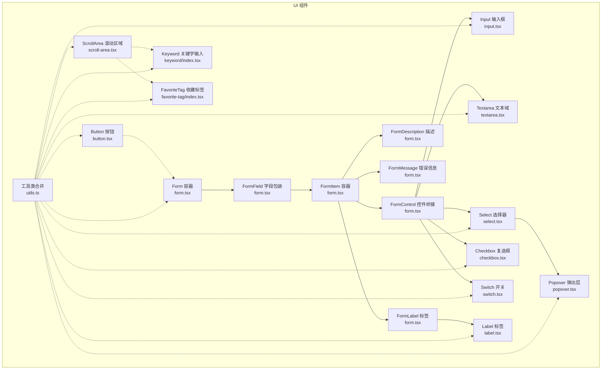
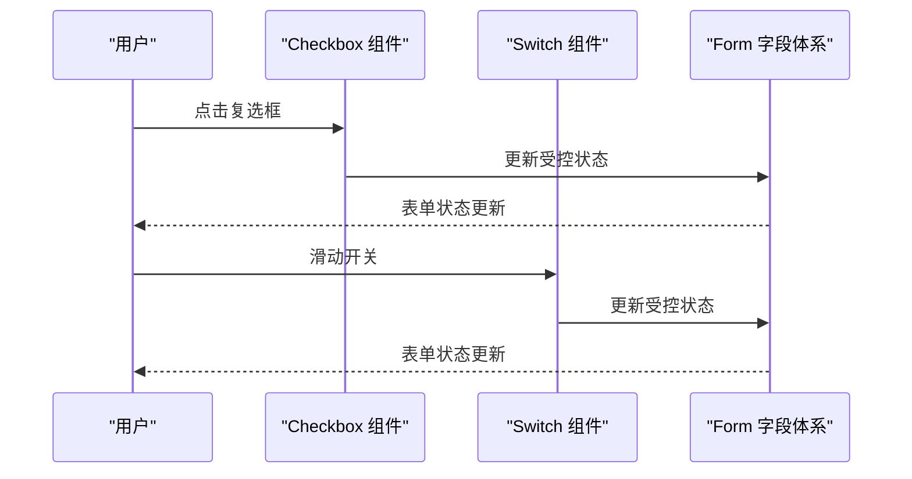
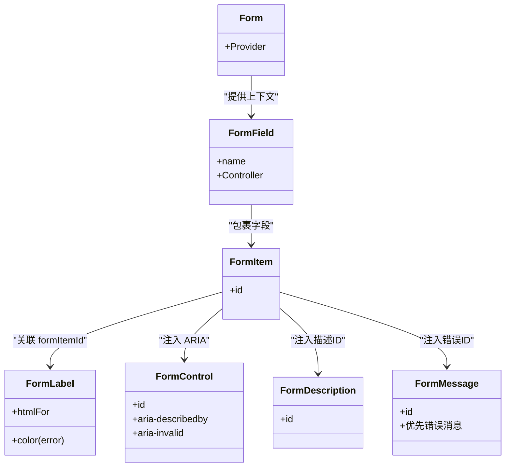
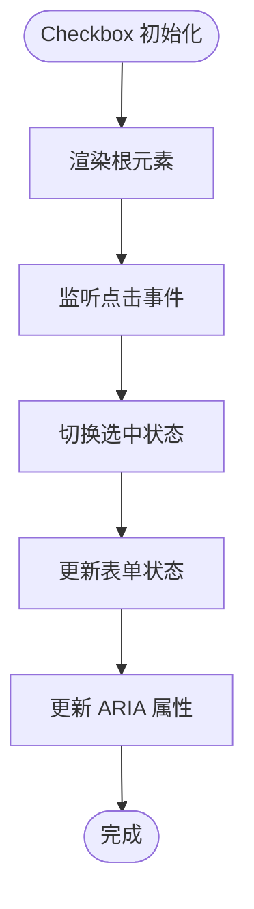
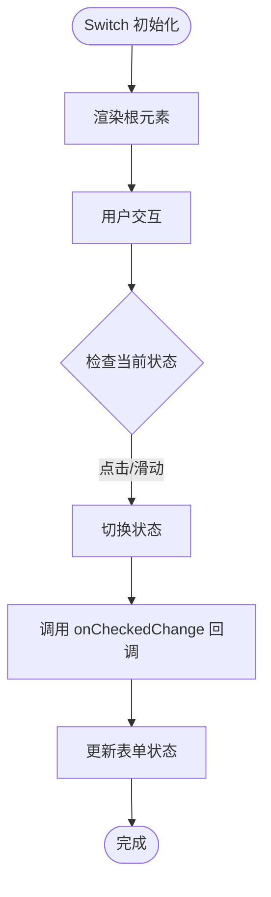
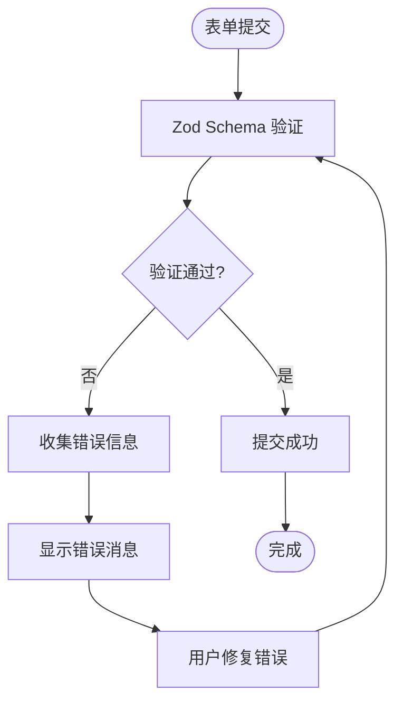
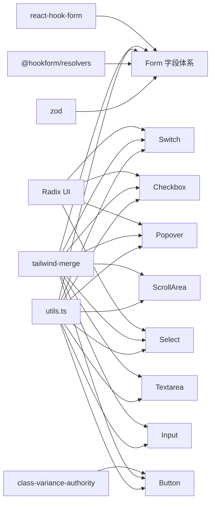

# 表单组件

<cite>
**本文引用的文件**
- [src/components/ui/form.tsx](file://src/components/ui/form.tsx)
- [src/components/ui/input.tsx](file://src/components/ui/input.tsx)
- [src/components/ui/select.tsx](file://src/components/ui/select.tsx)
- [src/components/ui/popover.tsx](file://src/components/ui/popover.tsx)
- [src/components/ui/label.tsx](file://src/components/ui/label.tsx)
- [src/components/ui/textarea.tsx](file://src/components/ui/textarea.tsx)
- [src/components/ui/button.tsx](file://src/components/ui/button.tsx)
- [src/components/ui/scroll-area.tsx](file://src/components/ui/scroll-area.tsx)
- [src/components/ui/checkbox.tsx](file://src/components/ui/checkbox.tsx)
- [src/components/ui/switch.tsx](file://src/components/ui/switch.tsx)
- [src/components/keyword/index.tsx](file://src/components/keyword/index.tsx)
- [src/components/favorite-tag/index.tsx](file://src/components/favorite-tag/index.tsx)
- [src/lib/utils.ts](file://src/lib/utils.ts)
- [src/hooks/use-create-keyword/index.tsx](file://src/hooks/use-create-keyword/index.tsx)
- [src/hooks/use-create-keyword-by-ai/index.tsx](file://src/hooks/use-create-keyword-by-ai/index.tsx)
- [src/hooks/use-edit-keyword/index.tsx](file://src/hooks/use-edit-keyword/index.tsx)
- [src/hooks/use-set-default-fav/index.tsx](file://src/hooks/use-set-default-fav/index.tsx)
- [src/options/index.css](file://src/options/index.css)
- [src/popup/index.css](file://src/popup/index.css)
- [src/options/components/setting/components/custom-mode-switch.tsx](file://src/options/components/setting/components/custom-mode-switch.tsx)
</cite>

## 更新摘要
**变更内容**
- 新增 Checkbox 复选框组件，支持受控状态和无障碍属性
- 新增 Switch 开关组件，提供滑动切换交互体验
- 增强表单验证系统，支持 react-hook-form 与 Zod 验证器集成
- 扩展表单组件生态系统，提供更丰富的用户交互选项
- 新增配置模式切换示例，展示 Switch 组件的实际应用场景

## 目录
1. [简介](#简介)
2. [项目结构](#项目结构)
3. [核心组件](#核心组件)
4. [架构总览](#架构总览)
5. [详细组件分析](#详细组件分析)
6. [新增组件分析](#新增组件分析)
7. [验证系统增强](#验证系统增强)
8. [依赖分析](#依赖分析)
9. [性能考量](#性能考量)
10. [故障排查指南](#故障排查指南)
11. [结论](#结论)
12. [附录](#附录)

## 简介
本文件围绕表单相关组件进行系统化说明，重点覆盖以下内容：
- Form 表单容器与字段体系：Form、FormField、FormItem、FormLabel、FormControl、FormDescription、FormMessage 的职责与协作方式
- 输入控件：Input 输入框、Textarea 多行文本域
- 选择器：Select 选择器（含触发器、内容区、选项项、分组标签、滚动按钮等）
- 弹出层：Popover 弹出层（根节点、触发器、内容区）
- **新增**：Checkbox 复选框组件，支持受控状态和无障碍属性
- **新增**：Switch 开关组件，提供滑动切换交互体验
- **新增**：增强的验证系统，支持 react-hook-form 与 Zod 验证器集成
- 组件间协同：如何通过 Form + react-hook-form 实现数据绑定、验证、错误展示与无障碍属性联动
- 最佳实践：布局设计、用户体验优化、可访问性（ARIA）与错误处理策略
- 实际示例与常见场景：结合项目中的 Hook 使用模式，给出可复用的表单构建思路

## 项目结构
本项目的 UI 组件集中在 src/components/ui 下，采用"原子化组件 + 组合模式"的组织方式：
- form.tsx 提供 Form 容器与字段体系上下文
- input.tsx、textarea.tsx 提供基础输入控件
- select.tsx 提供完整的下拉选择器生态
- popover.tsx 提供弹出层基础能力
- label.tsx 提供标签样式变体
- button.tsx 提供按钮样式变体
- scroll-area.tsx 提供滚动区域组件
- **新增**：checkbox.tsx 提供复选框控件
- **新增**：switch.tsx 提供开关控件
- **新增**：keyword.tsx 提供关键字输入功能
- **新增**：favorite-tag.tsx 提供收藏标签管理功能
- utils.ts 提供类名合并工具

**图表来源**
- [src/components/ui/form.tsx:16-167](file://src/components/ui/form.tsx#L16-L167)
- [src/components/ui/input.tsx:1-23](file://src/components/ui/input.tsx#L1-L23)
- [src/components/ui/textarea.tsx:1-22](file://src/components/ui/textarea.tsx#L1-L22)
- [src/components/ui/select.tsx:1-151](file://src/components/ui/select.tsx#L1-L151)
- [src/components/ui/popover.tsx:1-33](file://src/components/ui/popover.tsx#L1-L33)
- [src/components/ui/label.tsx:1-22](file://src/components/ui/label.tsx#L1-L22)
- [src/components/ui/button.tsx:1-51](file://src/components/ui/button.tsx#L1-L51)
- [src/components/ui/scroll-area.tsx:1-47](file://src/components/ui/scroll-area.tsx#L1-L47)
- [src/components/ui/checkbox.tsx:1-29](file://src/components/ui/checkbox.tsx#L1-L29)
- [src/components/ui/switch.tsx:1-28](file://src/components/ui/switch.tsx#L1-L28)
- [src/components/keyword/index.tsx:1-32](file://src/components/keyword/index.tsx#L1-L32)
- [src/components/favorite-tag/index.tsx:1-77](file://src/components/favorite-tag/index.tsx#L1-L77)
- [src/lib/utils.ts:1-7](file://src/lib/utils.ts#L1-L7)

**章节来源**
- [src/components/ui/form.tsx:16-167](file://src/components/ui/form.tsx#L16-L167)
- [src/components/ui/input.tsx:1-23](file://src/components/ui/input.tsx#L1-L23)
- [src/components/ui/textarea.tsx:1-22](file://src/components/ui/textarea.tsx#L1-L22)
- [src/components/ui/select.tsx:1-151](file://src/components/ui/select.tsx#L1-L151)
- [src/components/ui/popover.tsx:1-33](file://src/components/ui/popover.tsx#L1-L33)
- [src/components/ui/label.tsx:1-22](file://src/components/ui/label.tsx#L1-L22)
- [src/components/ui/button.tsx:1-51](file://src/components/ui/button.tsx#L1-L51)
- [src/components/ui/scroll-area.tsx:1-47](file://src/components/ui/scroll-area.tsx#L1-L47)
- [src/components/ui/checkbox.tsx:1-29](file://src/components/ui/checkbox.tsx#L1-L29)
- [src/components/ui/switch.tsx:1-28](file://src/components/ui/switch.tsx#L1-L28)
- [src/components/keyword/index.tsx:1-32](file://src/components/keyword/index.tsx#L1-L32)
- [src/components/favorite-tag/index.tsx:1-77](file://src/components/favorite-tag/index.tsx#L1-L77)
- [src/lib/utils.ts:1-7](file://src/lib/utils.ts#L1-L7)

## 核心组件
- Form 容器：基于 react-hook-form 的 FormProvider，提供全局表单上下文
- FormField 字段包装：将 Controller 与字段名关联，建立字段上下文
- FormItem 容器：为每个字段项生成唯一 ID，并作为子组件上下文
- FormLabel：读取字段状态，动态控制标签颜色与关联的输入 ID
- FormControl：将受控控件桥接到 Form 上下文，注入 ARIA 属性（描述/错误提示）
- FormDescription：辅助文本 ID 注入
- FormMessage：错误消息渲染，优先显示字段错误，否则回退到 children
- **新增**：Checkbox 组件：基于 @radix-ui/react-checkbox，支持受控状态和无障碍属性
- **新增**：Switch 组件：基于 @radix-ui/react-switch，提供滑动切换交互体验
- **新增**：增强的验证系统：支持 react-hook-form 与 Zod 验证器集成

**章节来源**
- [src/components/ui/form.tsx:16-167](file://src/components/ui/form.tsx#L16-L167)
- [src/components/ui/checkbox.tsx:7-28](file://src/components/ui/checkbox.tsx#L7-L28)
- [src/components/ui/switch.tsx:6-27](file://src/components/ui/switch.tsx#L6-L27)

## 架构总览
Form 字段体系通过 Context 将"字段名"、"描述 ID"、"错误 ID"等信息在树内传递，使 Label、Control、Message 能够正确联动。Select、Input、Textarea、Checkbox、Switch 等控件通过 FormControl 与 Form 字段体系对接，从而获得统一的验证、错误展示与无障碍体验。**新增的 Checkbox 和 Switch 组件通过 Radix UI 提供无障碍语义，增强表单的交互能力和可访问性。**

**图表来源**
- [src/components/ui/checkbox.tsx:10-25](file://src/components/ui/checkbox.tsx#L10-L25)
- [src/components/ui/switch.tsx:9-24](file://src/components/ui/switch.tsx#L9-L24)

## 详细组件分析

### Form 字段体系（Form/FormField/FormItem/FormLabel/FormControl/FormDescription/FormMessage）
- 设计要点
  - 通过 Context 传递字段名与 ID，避免重复计算与跨组件通信成本
  - FormControl 动态注入 aria-describedby 与 aria-invalid，提升可访问性
  - FormMessage 支持默认错误与自定义 children，便于灵活扩展
- 数据流
  - useFormField 读取字段状态与 ID
  - FormLabel/FormControl/FormDescription/FormMessage 依据字段状态渲染
- 错误处理
  - 当字段存在错误时，FormLabel 变色；FormControl 设置 aria-invalid；FormMessage 渲染错误文本

**图表来源**
- [src/components/ui/form.tsx:16-167](file://src/components/ui/form.tsx#L16-L167)

**章节来源**
- [src/components/ui/form.tsx:16-167](file://src/components/ui/form.tsx#L16-L167)

### Input 输入框
- 特点
  - 基于原生 input，提供尺寸、边框、占位符、聚焦环等通用样式
  - 通过 forwardRef 暴露 ref，便于与 FormControl 对接
- 无障碍
  - 交由 FormControl 注入 ID 与 ARIA 描述/错误属性

**章节来源**
- [src/components/ui/input.tsx:1-23](file://src/components/ui/input.tsx#L1-L23)

### Textarea 文本域
- 特点
  - 提供最小高度、圆角、边框、占位符、聚焦环等通用样式
  - 通过 forwardRef 暴露 ref，便于与 FormControl 对接

**章节来源**
- [src/components/ui/textarea.tsx:1-22](file://src/components/ui/textarea.tsx#L1-L22)

### Select 选择器
- 组件族
  - Root/Group/Value/Trigger/Content/Label/Item/Separator/ScrollUpButton/ScrollDownButton
- 交互特性
  - Trigger 聚焦时展开 Content，Viewport 内部滚动条与 popper 定位
  - Item 支持选中指示器与文本展示
- 无障碍
  - 通过 Radix UI 的语义化结构与 Portal 渲染，确保键盘可达与屏幕阅读器友好

**图表来源**
- [src/components/ui/select.tsx:13-125](file://src/components/ui/select.tsx#L13-L125)

**章节来源**
- [src/components/ui/select.tsx:1-151](file://src/components/ui/select.tsx#L1-L151)

### Popover 弹出层
- 组件族
  - Root/Trigger/Content（支持对齐与偏移）
- 适用场景
  - 与 Select/按钮等配合，承载复杂内容（如日期选择器、筛选面板）

**章节来源**
- [src/components/ui/popover.tsx:1-33](file://src/components/ui/popover.tsx#L1-L33)

### Label 标签
- 特点
  - 提供可变体样式，用于与输入控件建立视觉与语义关联
- 与 Form 的关系
  - FormLabel 基于 Label 并注入错误态样式与 htmlFor 关联

**章节来源**
- [src/components/ui/label.tsx:1-22](file://src/components/ui/label.tsx#L1-L22)

### Button 按钮
- 特点
  - 通过变体与尺寸变体提供一致的交互反馈
  - 支持 asChild 以嵌套其他元素（如 Link）

**章节来源**
- [src/components/ui/button.tsx:1-51](file://src/components/ui/button.tsx#L1-L51)

### ScrollArea 滚动区域
- 特点
  - 提供可定制的滚动条样式和滚动行为
  - 支持水平和垂直滚动
  - 通过 ScrollBar 组件提供细粒度的滚动条控制

**章节来源**
- [src/components/ui/scroll-area.tsx:1-47](file://src/components/ui/scroll-area.tsx#L1-L47)

## 新增组件分析

### Checkbox 复选框组件
- 设计目标
  - 提供标准的复选框控件，支持受控状态管理
  - 通过 Radix UI 提供无障碍语义和键盘导航支持
  - 集成到 Form 字段体系，获得统一的验证和错误展示
- 核心特性
  - **受控状态管理**：通过 data-[state=checked] 属性控制选中状态
  - **无障碍支持**：基于 @radix-ui/react-checkbox，提供标准的 ARIA 属性
  - **样式集成**：使用 cn 工具函数合并 Tailwind CSS 类名
  - **图标指示器**：选中状态下显示 Check 图标
- 交互流程
  - 用户点击复选框切换状态
  - 通过 Form 字段体系更新表单状态
  - 支持键盘操作（Space 键切换）

**图表来源**
- [src/components/ui/checkbox.tsx:10-25](file://src/components/ui/checkbox.tsx#L10-L25)

**章节来源**
- [src/components/ui/checkbox.tsx:1-29](file://src/components/ui/checkbox.tsx#L1-L29)

### Switch 开关组件
- 设计目标
  - 提供滑动切换的开关控件，支持受控状态管理
  - 通过 Radix UI 提供流畅的动画效果和无障碍支持
  - 适用于配置项、功能开关等场景
- 核心特性
  - **滑动动画**：基于 translate-x-4 实现平滑的滑动效果
  - **受控状态**：data-[state=checked]/data-[state=unchecked] 控制外观
  - **无障碍支持**：提供标准的 ARIA 属性和键盘导航
  - **样式变体**：支持不同的尺寸和颜色主题
- 交互流程
  - 用户点击或滑动开关切换状态
  - 通过 onCheckedChange 回调通知状态变化
  - 支持键盘操作（左右箭头键切换）

**图表来源**
- [src/components/ui/switch.tsx:9-24](file://src/components/ui/switch.tsx#L9-L24)

**章节来源**
- [src/components/ui/switch.tsx:1-28](file://src/components/ui/switch.tsx#L1-L28)

### 配置模式切换示例
- 应用场景
  - 展示 Switch 组件在实际项目中的应用
  - 切换 AI 配置模式（免费模式 vs 自定义模式）
- 实现特点
  - 使用 zustand 状态管理存储配置状态
  - 通过 useShallow 优化组件重渲染
  - 集成 Label 组件提供可点击的标签文本
  - 实时更新全局配置数据

**章节来源**
- [src/options/components/setting/components/custom-mode-switch.tsx:1-35](file://src/options/components/setting/components/custom-mode-switch.tsx#L1-L35)

## 验证系统增强

### react-hook-form 与 Zod 集成
- 技术栈
  - react-hook-form@^7.74.0：提供表单状态管理和验证
  - @hookform/resolvers@^3.10.0：集成 Zod 验证器
  - zod@^3.25.76：类型安全的验证库
- 集成优势
  - **类型安全**：编译时类型检查，减少运行时错误
  - **自动验证**：基于 Zod Schema 自动生成验证规则
  - **错误处理**：统一的错误消息格式和显示方式
  - **性能优化**：智能的重新渲染控制和字段级验证

### 验证流程

**图表来源**
- [src/components/ui/form.tsx:134-156](file://src/components/ui/form.tsx#L134-L156)

**章节来源**
- [src/components/ui/form.tsx:1-168](file://src/components/ui/form.tsx#L1-L168)

## 依赖分析
- 组件内聚与耦合
  - Form 字段体系内部高度内聚，通过 Context 降低耦合
  - Input/Textarea/Select/Checkbox/Switch 仅依赖 FormControl 与 utils，保持低耦合
- 外部依赖
  - react-hook-form：提供表单上下文与字段状态
  - @radix-ui/react-*：提供无障碍语义与动画
  - class-variance-authority/tailwind-merge：提供样式变体与类名合并
  - **新增**：@radix-ui/react-checkbox：提供复选框控件
  - **新增**：@radix-ui/react-switch：提供开关控件
  - **新增**：@hookform/resolvers：集成 Zod 验证器
  - **新增**：zod：类型安全的验证库
- 可能的循环依赖
  - 未发现直接循环依赖；Form 仅向下提供上下文，不反向依赖子组件

**图表来源**
- [src/components/ui/form.tsx:1-11](file://src/components/ui/form.tsx#L1-L11)
- [src/components/ui/select.tsx:1-5](file://src/components/ui/select.tsx#L1-L5)
- [src/components/ui/popover.tsx:1-3](file://src/components/ui/popover.tsx#L1-L3)
- [src/components/ui/button.tsx:1-5](file://src/components/ui/button.tsx#L1-L5)
- [src/components/ui/scroll-area.tsx:1-5](file://src/components/ui/scroll-area.tsx#L1-L5)
- [src/components/ui/checkbox.tsx:1-5](file://src/components/ui/checkbox.tsx#L1-L5)
- [src/components/ui/switch.tsx:1-4](file://src/components/ui/switch.tsx#L1-L4)
- [src/lib/utils.ts:1-7](file://src/lib/utils.ts#L1-L7)

**章节来源**
- [src/components/ui/form.tsx:1-11](file://src/components/ui/form.tsx#L1-L11)
- [src/components/ui/select.tsx:1-5](file://src/components/ui/select.tsx#L1-L5)
- [src/components/ui/popover.tsx:1-3](file://src/components/ui/popover.tsx#L1-L3)
- [src/components/ui/button.tsx:1-5](file://src/components/ui/button.tsx#L1-L5)
- [src/components/ui/scroll-area.tsx:1-5](file://src/components/ui/scroll-area.tsx#L1-L5)
- [src/components/ui/checkbox.tsx:1-5](file://src/components/ui/checkbox.tsx#L1-L5)
- [src/components/ui/switch.tsx:1-4](file://src/components/ui/switch.tsx#L1-L4)
- [src/lib/utils.ts:1-7](file://src/lib/utils.ts#L1-L7)

## 性能考量
- 渲染开销
  - FormControl 仅注入必要属性，避免额外包装导致的重渲染
  - Select/Popover 使用 Portal 渲染，减少父级布局抖动
  - **新增**：Checkbox 和 Switch 组件使用 forwardRef 暴露底层 DOM 元素，减少不必要的包装
  - **新增**：使用 Radix UI 的轻量级实现，避免大型第三方库的性能负担
- 计算与合并
  - 使用 utils.ts 的类名合并工具，避免重复样式类导致的样式冲突与重绘
- 受控与非受控
  - 建议统一使用受控控件（由 Form/Controller 管理），减少状态同步问题
  - **新增**：Checkbox 和 Switch 支持受控和非受控两种模式，提供更大的灵活性

## 故障排查指南
- FormLabel 未生效
  - 确认 FormField/FormItem 包裹顺序正确，且 FormControl 已注入 ID
- 错误信息不显示
  - 确认字段存在错误对象；FormMessage 会优先显示字段错误
- ARIA 属性无效
  - 确认 FormControl 正确注入 aria-describedby 与 aria-invalid
- Select/Popover 位置异常
  - 检查触发器尺寸与 viewport 尺寸是否一致；必要时调整 position 或 popper 样式
- **新增**：Checkbox 组件状态不更新
  - 确认使用受控模式（checked 属性）或正确设置 onCheckedChange 回调
  - 检查 data-[state=checked] 属性是否正确应用
- **新增**：Switch 组件动画不流畅
  - 确认 transition-transform 类名正确应用
  - 检查 translate-x 位移值是否符合预期
- **新增**：Zod 验证不工作
  - 确认 @hookform/resolvers 正确集成
  - 检查 Zod Schema 定义是否正确
  - 确认 useForm 的 resolver 配置

**章节来源**
- [src/components/ui/form.tsx:82-156](file://src/components/ui/form.tsx#L82-L156)
- [src/components/ui/select.tsx:61-91](file://src/components/ui/select.tsx#L61-L91)
- [src/components/ui/popover.tsx:9-30](file://src/components/ui/popover.tsx#L9-L30)
- [src/components/ui/checkbox.tsx:10-25](file://src/components/ui/checkbox.tsx#L10-L25)
- [src/components/ui/switch.tsx:9-24](file://src/components/ui/switch.tsx#L9-L24)

## 结论
本表单组件体系以 Form 字段体系为核心，通过 Context 与 FormControl 将输入控件、选择器、弹出层、复选框、开关等组件有机串联，形成统一的数据绑定、验证与错误展示机制。**新增的 Checkbox 和 Switch 组件通过 Radix UI 提供了更好的无障碍支持和用户体验，而增强的验证系统则通过 react-hook-form 与 Zod 的集成提供了类型安全和自动验证能力。** 结合 Label、Button 等基础组件，可快速搭建可访问、易维护的复杂表单界面。建议在实际项目中遵循"受控控件 + 字段体系 + ARIA 属性 + 类型安全验证"的模式，确保一致性与可扩展性。

## 附录

### 实际使用示例与常见场景
- 单字段输入表单
  - 使用 Form 容器包裹，FormField 包裹单个字段，FormItem 内部包含 FormLabel、FormControl（包裹 Input）、FormDescription/FormMessage
- 多字段选择表单
  - 在 FormItem 中使用 FormControl 包裹 Select，结合 FormLabel 与 FormMessage 实现统一的错误展示
- 复杂面板表单
  - 使用 Popover 作为内容容器，内部嵌套 Select/输入控件，通过 Button 触发展开/收起
- **新增**：复选框表单
  - 使用 Checkbox 组件创建多选列表，支持全选/反选功能
  - 结合 Form 字段体系实现批量数据验证和提交
- **新增**：开关配置表单
  - 使用 Switch 组件创建功能开关，实时更新配置状态
  - 通过 zustand 状态管理器持久化用户偏好设置
- **新增**：类型安全验证表单
  - 使用 Zod Schema 定义表单结构和验证规则
  - 通过 @hookform/resolvers 自动集成验证逻辑
  - 实现编译时类型检查和运行时验证双重保障
- 批量处理与错误提示
  - 参考 Hook 中的错误捕获与 toast 提示，结合 FormMessage 展示字段级错误

**章节来源**
- [src/options/components/setting/components/custom-mode-switch.tsx:16-31](file://src/options/components/setting/components/custom-mode-switch.tsx#L16-L31)
- [src/hooks/use-create-keyword/index.tsx:191-284](file://src/hooks/use-create-keyword/index.tsx#L191-L284)
- [src/hooks/use-create-keyword-by-ai/index.tsx:21-154](file://src/hooks/use-create-keyword-by-ai/index.tsx#L21-L154)
- [src/hooks/use-edit-keyword/index.tsx:64-102](file://src/hooks/use-edit-keyword/index.tsx#L64-L102)
- [src/hooks/use-set-default-fav/index.tsx:54-99](file://src/hooks/use-set-default-fav/index.tsx#L54-L99)