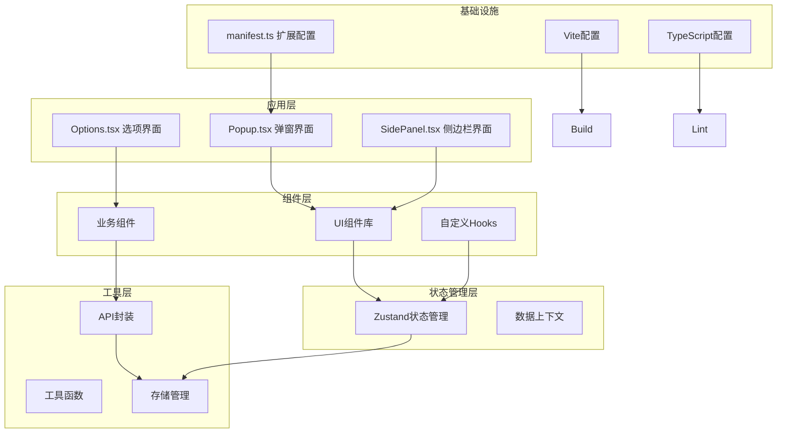
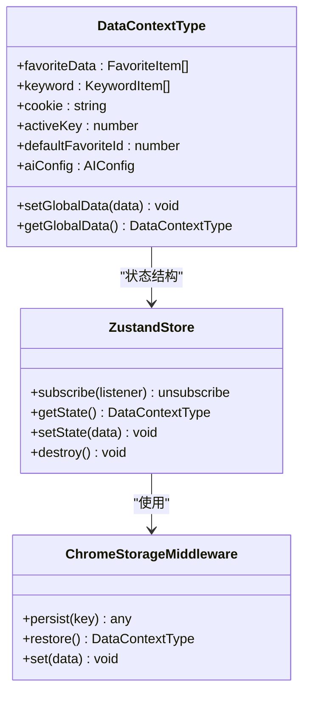
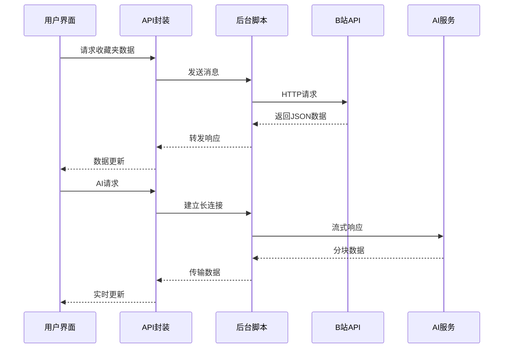
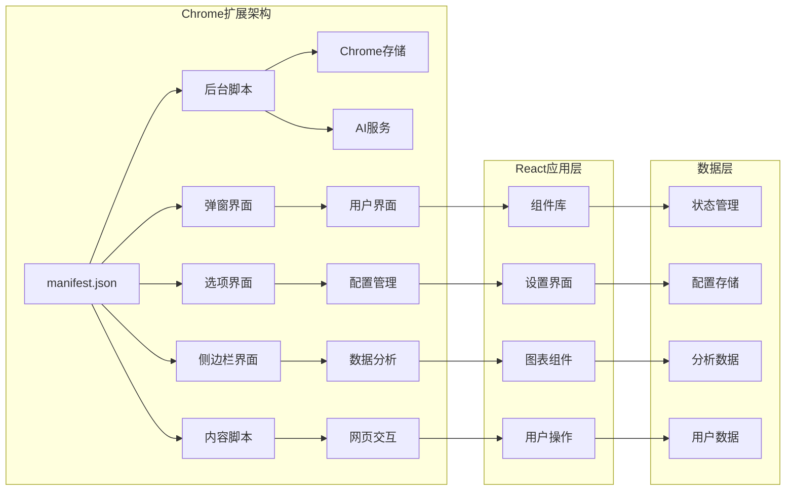
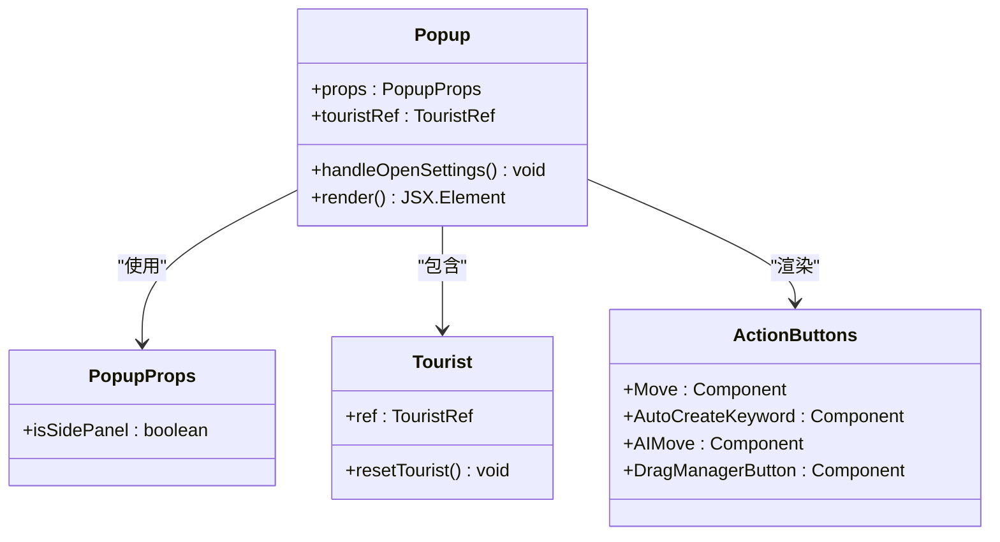
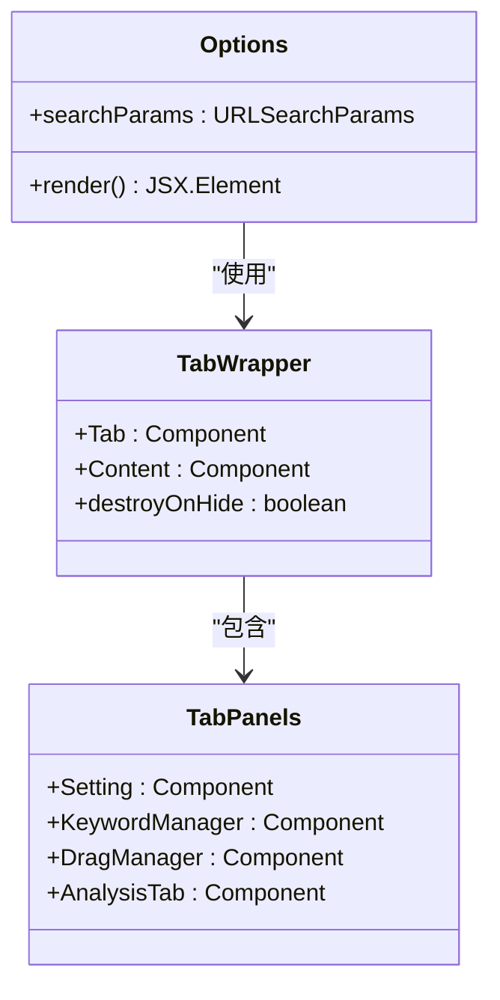
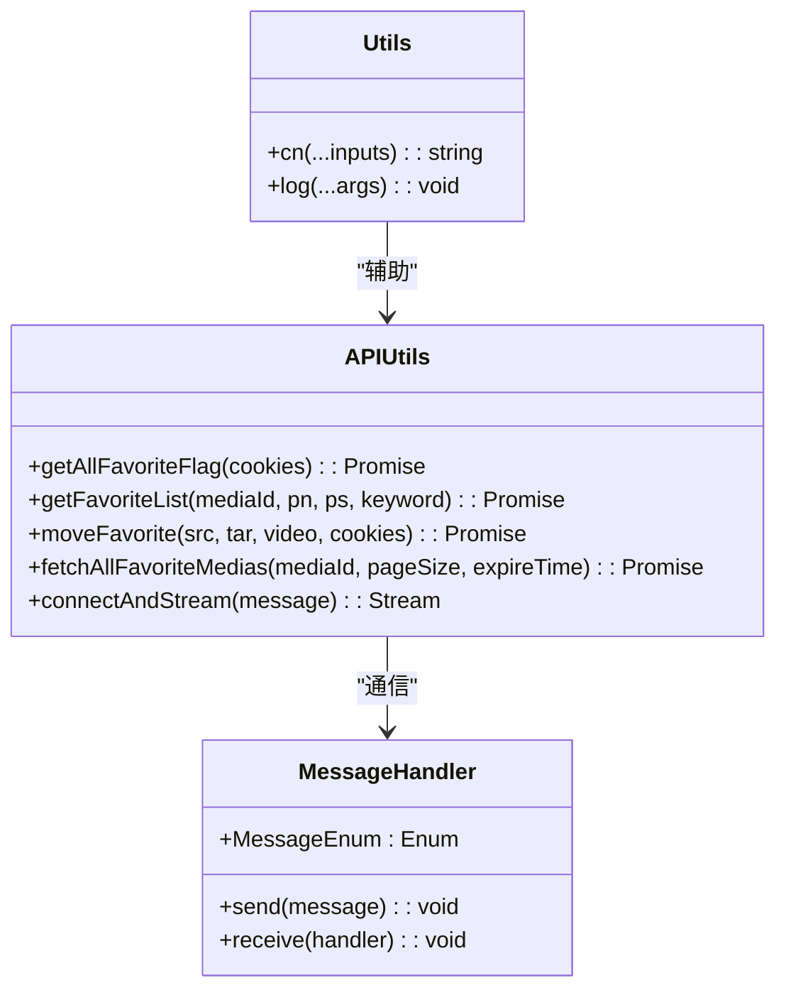
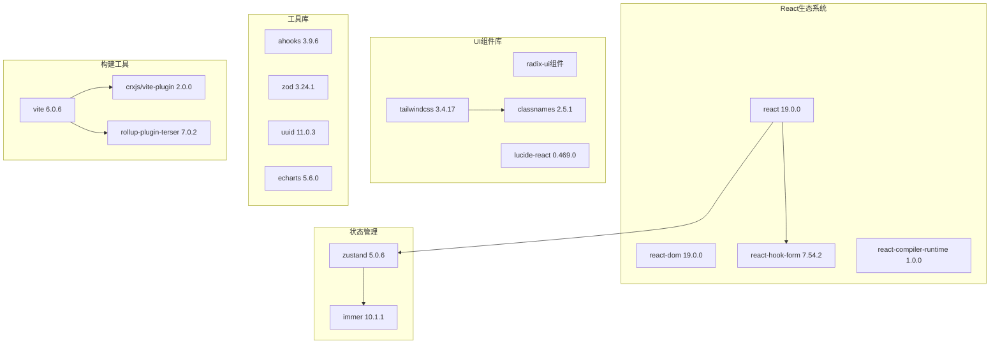

# React最佳实践系统

<cite>
**本文档引用的文件**
- [package.json](file://package.json)
- [vite.config.ts](file://vite.config.ts)
- [tsconfig.json](file://tsconfig.json)
- [src/manifest.ts](file://src/manifest.ts)
- [src/global.d.ts](file://src/global.d.ts)
- [src/popup/Popup.tsx](file://src/popup/Popup.tsx)
- [src/options/Options.tsx](file://src/options/Options.tsx)
- [src/store/global-data.ts](file://src/store/global-data.ts)
- [src/hooks/index.ts](file://src/hooks/index.ts)
- [src/components/index.ts](file://src/components/index.ts)
- [src/lib/utils.ts](file://src/lib/utils.ts)
- [src/utils/data-context.ts](file://src/utils/data-context.ts)
- [src/utils/api.ts](file://src/utils/api.ts)
- [src/utils/log.ts](file://src/utils/log.ts)
- [src/utils/message.ts](file://src/utils/message.ts)
</cite>

## 目录
1. [简介](#简介)
2. [项目结构](#项目结构)
3. [核心组件](#核心组件)
4. [架构概览](#架构概览)
5. [详细组件分析](#详细组件分析)
6. [依赖关系分析](#依赖关系分析)
7. [性能考虑](#性能考虑)
8. [故障排除指南](#故障排除指南)
9. [结论](#结论)

## 简介

这是一个基于React 19开发的Chrome扩展程序，名为"B站收藏夹整理工具"。该项目采用现代前端技术栈，包括TypeScript、Vite构建工具、TailwindCSS样式框架、Zustand状态管理等。项目实现了对B站收藏夹的管理功能，包括收藏夹移动、关键字管理、AI辅助整理等功能。

该扩展程序具有以下特点：
- 使用React 19的最新特性
- 采用模块化的组件架构
- 集成AI功能（通过OpenAI和讯飞星火接口）
- 实现了完整的Chrome扩展生命周期
- 提供多种用户界面（弹窗、选项页、侧边栏）

## 项目结构

该项目采用了清晰的分层架构设计，主要分为以下几个层次：

**图表来源**
- [src/popup/Popup.tsx:1-80](file://src/popup/Popup.tsx#L1-L80)
- [src/options/Options.tsx:1-91](file://src/options/Options.tsx#L1-L91)
- [src/manifest.ts:1-55](file://src/manifest.ts#L1-L55)

**章节来源**
- [package.json:1-91](file://package.json#L1-L91)
- [vite.config.ts:1-44](file://vite.config.ts#L1-L44)
- [tsconfig.json:1-44](file://tsconfig.json#L1-L44)

## 核心组件

### 状态管理系统

项目采用Zustand作为状态管理解决方案，结合Immer中间件实现不可变更新：

**图表来源**
- [src/store/global-data.ts:1-28](file://src/store/global-data.ts#L1-L28)
- [src/utils/data-context.ts:1-34](file://src/utils/data-context.ts#L1-L34)

### API通信层

项目实现了完整的API通信机制，支持与B站后端和AI服务的交互：

**图表来源**
- [src/utils/api.ts:176-232](file://src/utils/api.ts#L176-L232)
- [src/utils/message.ts:1-20](file://src/utils/message.ts#L1-L20)

**章节来源**
- [src/store/global-data.ts:1-28](file://src/store/global-data.ts#L1-L28)
- [src/utils/api.ts:1-339](file://src/utils/api.ts#L1-L339)

## 架构概览

该项目采用Chrome扩展的标准架构模式，包含多个独立的入口点：

**图表来源**
- [src/manifest.ts:1-55](file://src/manifest.ts#L1-L55)
- [src/popup/Popup.tsx:1-80](file://src/popup/Popup.tsx#L1-L80)
- [src/options/Options.tsx:1-91](file://src/options/Options.tsx#L1-L91)

## 详细组件分析

### 弹窗界面组件

弹窗界面是用户交互的主要入口，提供了完整的收藏夹管理功能：

**图表来源**
- [src/popup/Popup.tsx:10-80](file://src/popup/Popup.tsx#L10-L80)

### 选项页面组件

选项页面提供了更复杂的配置和管理功能：

**图表来源**
- [src/options/Options.tsx:12-91](file://src/options/Options.tsx#L12-L91)

### 工具函数系统

项目实现了丰富的工具函数，支持各种实用功能：

**图表来源**
- [src/lib/utils.ts:1-7](file://src/lib/utils.ts#L1-L7)
- [src/utils/api.ts:1-339](file://src/utils/api.ts#L1-L339)
- [src/utils/log.ts:1-8](file://src/utils/log.ts#L1-L8)

**章节来源**
- [src/popup/Popup.tsx:1-80](file://src/popup/Popup.tsx#L1-L80)
- [src/options/Options.tsx:1-91](file://src/options/Options.tsx#L1-L91)
- [src/lib/utils.ts:1-7](file://src/lib/utils.ts#L1-L7)

## 依赖关系分析

项目采用了现代化的依赖管理策略，集成了多个优秀的开源库：

**图表来源**
- [package.json:29-58](file://package.json#L29-L58)
- [vite.config.ts:34-41](file://vite.config.ts#L34-L41)

**章节来源**
- [package.json:1-91](file://package.json#L1-L91)
- [vite.config.ts:1-44](file://vite.config.ts#L1-L44)

## 性能考虑

项目在性能优化方面采用了多项策略：

### 构建优化
- 使用Terser进行代码压缩，去除console.log
- 采用React Compiler进行编译优化
- 模块化打包，生成chunk文件名

### 运行时优化
- 使用Zustand替代Redux，减少不必要的重渲染
- 实现IndexedDB缓存机制，避免重复网络请求
- 采用Immer中间件，优化对象更新性能

### 网络优化
- 实现分页加载，避免一次性加载大量数据
- 使用长连接处理AI流式响应
- 缓存收藏夹数据，设置过期时间

## 故障排除指南

### 常见问题及解决方案

**1. AI功能无法使用**
- 检查AI配置是否正确设置
- 验证API密钥和基础URL
- 确认网络连接正常

**2. 收藏夹数据加载失败**
- 检查Cookie是否有效
- 验证B站登录状态
- 查看控制台错误信息

**3. 扩展安装问题**
- 清理浏览器缓存
- 重新加载扩展
- 检查权限设置

**章节来源**
- [src/utils/api.ts:176-232](file://src/utils/api.ts#L176-L232)
- [src/utils/log.ts:1-8](file://src/utils/log.ts#L1-L8)

## 结论

这个React扩展程序展现了现代前端开发的最佳实践：

### 技术亮点
- 采用React 19的最新特性和性能优化
- 实现了完整的Chrome扩展架构
- 集成了AI功能和数据分析能力
- 使用TypeScript确保类型安全

### 架构优势
- 清晰的分层设计，职责分离明确
- 模块化的组件系统，便于维护和扩展
- 完善的状态管理机制
- 良好的错误处理和调试支持

### 改进建议
- 可以考虑添加更多的单元测试
- 优化AI功能的用户体验
- 增加更多的配置选项
- 实现更完善的错误恢复机制

该项目为React开发者提供了一个优秀的学习案例，展示了如何构建高质量的Chrome扩展应用程序。