# React最佳实践系统

<cite>
**本文档引用的文件**
- [package.json](file://package.json)
- [README.md](file://README.md)
- [src/manifest.ts](file://src/manifest.ts)
- [vite.config.ts](file://vite.config.ts)
- [tsconfig.json](file://tsconfig.json)
- [src/popup/Popup.tsx](file://src/popup/Popup.tsx)
- [src/options/Options.tsx](file://src/options/Options.tsx)
- [src/store/global-data.ts](file://src/store/global-data.ts)
- [src/store/chorme-storage-middleware.ts](file://src/store/chorme-storage-middleware.ts)
- [src/utils/data-context.ts](file://src/utils/data-context.ts)
- [src/utils/api.ts](file://src/utils/api.ts)
- [src/lib/utils.ts](file://src/lib/utils.ts)
- [src/utils/log.ts](file://src/utils/log.ts)
- [tailwind.config.js](file://tailwind.config.js)
- [postcss.config.js](file://postcss.config.js)
- [src/popup/index.css](file://src/popup/index.css)
- [src/options/index.css](file://src/options/index.css)
- [components.json](file://components.json)
- [src/components/ui/button.tsx](file://src/components/ui/button.tsx)
- [src/components/ui/card.tsx](file://src/components/ui/card.tsx)
- [src/components/ui/form.tsx](file://src/components/ui/form.tsx)
- [src/components/ui/input.tsx](file://src/components/ui/input.tsx)
- [src/components/ui/select.tsx](file://src/components/ui/select.tsx)
- [src/components/ui/label.tsx](file://src/components/ui/label.tsx)
- [src/hooks/use-cookie/index.ts](file://src/hooks/use-cookie/index.ts)
- [src/hooks/use-edit-keyword/index.tsx](file://src/hooks/use-edit-keyword/index.tsx)
- [src/hooks/use-create-keyword/index.tsx](file://src/hooks/use-create-keyword/index.tsx)
- [src/hooks/use-toast/index.ts](file://src/hooks/use-toast/index.ts)
- [src/hooks/use-create-keyword-by-ai/index.tsx](file://src/hooks/use-create-keyword-by-ai/index.tsx)
</cite>

## 更新摘要
**所做更改**
- 新增React Hook性能优化最佳实践章节
- 更新use-cookie hook依赖数组优化相关内容
- 新增use-edit-keyword hook使用useMemoizedFn提升性能的详细说明
- 增加use-create-keyword hook性能优化策略
- 完善Hook性能优化工具链使用指导
- 添加useMemoizedFn在多个Hook中的应用实例

## 目录
1. [项目概述](#项目概述)
2. [项目结构](#项目结构)
3. [核心架构设计](#核心架构设计)
4. [状态管理系统](#状态管理系统)
5. [数据流架构](#数据流架构)
6. [组件设计模式](#组件设计模式)
7. [样式系统与主题管理](#样式系统与主题管理)
8. [颜色管理与视觉设计](#颜色管理与视觉设计)
9. [交互设计与用户体验](#交互设计与用户体验)
10. [性能优化策略](#性能优化策略)
11. [React Hook性能优化最佳实践](#react-hook性能优化最佳实践)
12. [错误处理与调试](#错误处理与调试)
13. [测试策略](#测试策略)
14. [部署与构建](#部署与构建)
15. [总结](#总结)

## 项目概述

这是一个基于React 19开发的Chrome扩展程序，名为"B站收藏夹整理工具"。该项目实现了完整的收藏夹管理、数据分析、AI智能分类等功能，展现了现代React应用的最佳实践。

### 主要功能特性

- **智能分析**：深度分析B站收藏内容分布，提供可视化展示
- **AI驱动**：基于GPT的视频标题关键词提取，自动分类
- **可视化拖拽管理**：直观的收藏夹拖拽操作界面
- **侧边栏模式**：持久显示的扩展界面
- **配置管理**：灵活的API配置和模型选择

**章节来源**
- [README.md: 29-80:29-80](file://README.md#L29-L80)

## 项目结构

项目采用模块化的目录结构，清晰分离了不同功能域：

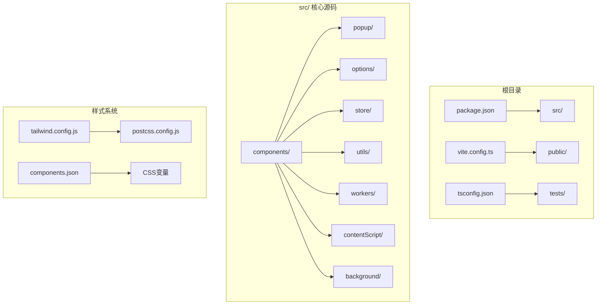

**图表来源**
- [src/manifest.ts: 1-55:1-55](file://src/manifest.ts#L1-L55)
- [vite.config.ts: 1-44:1-44](file://vite.config.ts#L1-L44)

### 目录组织原则

- **按功能域分层**：components、hooks、store、utils等模块化组织
- **按页面分离**：popup、options、sidepanel独立管理
- **样式系统集中**：tailwind.config.js统一管理样式配置
- **工具函数集中**：utils目录统一管理工具方法
- **状态管理分离**：store目录专门处理全局状态

**章节来源**
- [src/manifest.ts: 8-54:8-54](file://src/manifest.ts#L8-L54)

## 核心架构设计

### 整体架构模式

项目采用了典型的Chrome扩展架构，结合React组件化开发：

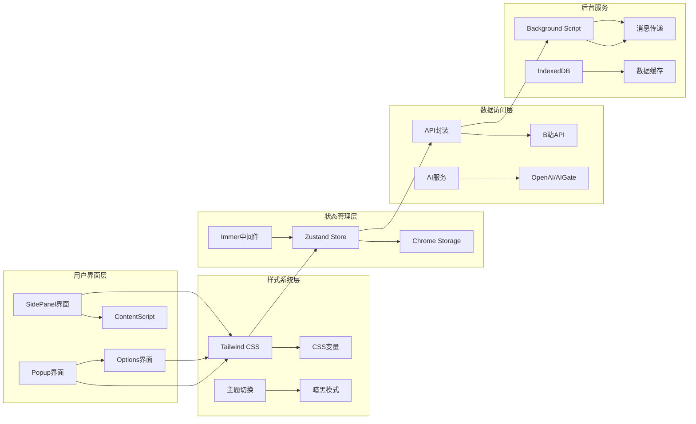

**图表来源**
- [src/popup/Popup.tsx: 14-80:14-80](file://src/popup/Popup.tsx#L14-L80)
- [src/options/Options.tsx: 12-91:12-91](file://src/options/Options.tsx#L12-L91)

### 架构设计特点

1. **模块化设计**：每个功能域都有独立的模块和职责边界
2. **样式系统统一**：使用Tailwind CSS和CSS变量实现一致的样式管理
3. **状态集中管理**：使用Zustand实现全局状态管理
4. **异步数据流**：通过消息传递实现前后端通信
5. **主题系统支持**：内置暗黑模式和主题切换机制

**章节来源**
- [src/store/global-data.ts: 6-25:6-25](file://src/store/global-data.ts#L6-L25)
- [src/utils/api.ts: 285-319:285-319](file://src/utils/api.ts#L285-L319)

## 状态管理系统

### Zustand状态管理

项目使用Zustand作为状态管理解决方案，结合Immer中间件实现不可变更新：

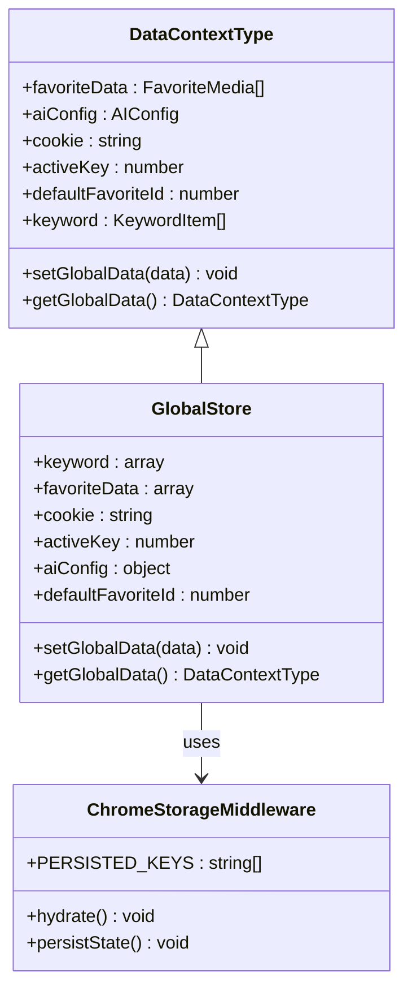

**图表来源**
- [src/utils/data-context.ts: 3-31:3-31](file://src/utils/data-context.ts#L3-L31)
- [src/store/global-data.ts: 6-25:6-25](file://src/store/global-data.ts#L6-L25)

### 状态持久化机制

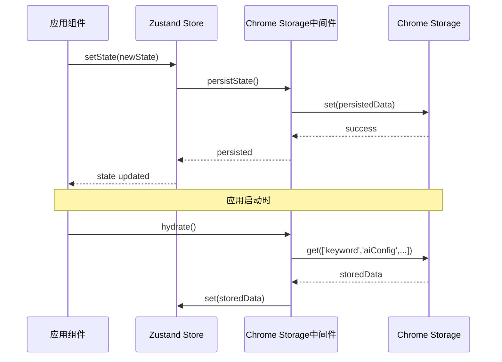

**图表来源**
- [src/store/chorme-storage-middleware.ts: 13-54:13-54](file://src/store/chorme-storage-middleware.ts#L13-L54)

**章节来源**
- [src/store/global-data.ts: 1-28:1-28](file://src/store/global-data.ts#L1-L28)
- [src/store/chorme-storage-middleware.ts: 1-63:1-63](file://src/store/chorme-storage-middleware.ts#L1-L63)

## 数据流架构

### API数据流

项目实现了完整的数据获取和处理流程：

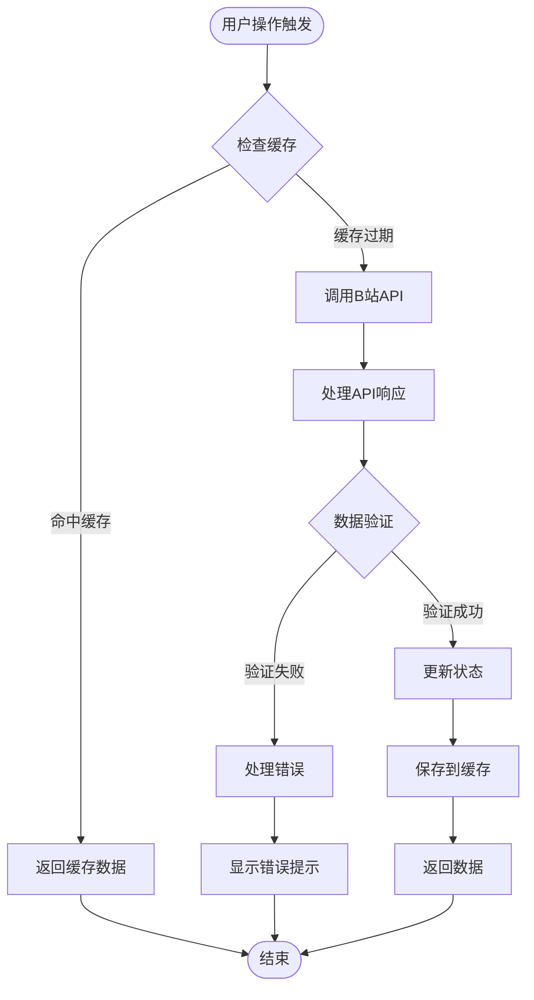

**图表来源**
- [src/utils/api.ts: 285-319:285-319](file://src/utils/api.ts#L285-L319)

### AI服务集成

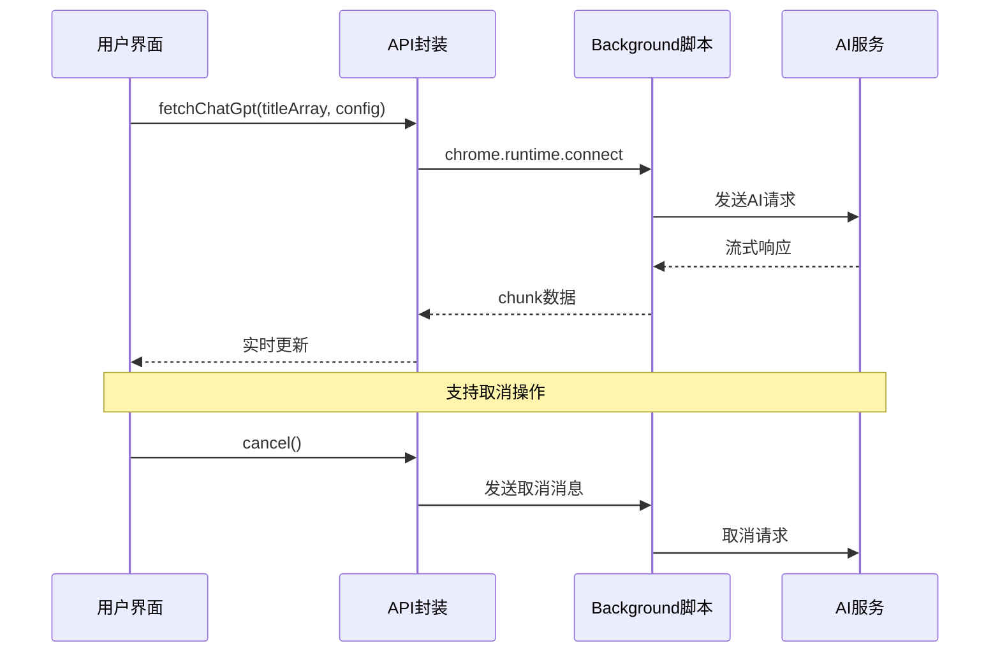

**图表来源**
- [src/utils/api.ts: 180-232:180-232](file://src/utils/api.ts#L180-L232)

**章节来源**
- [src/utils/api.ts: 1-339:1-339](file://src/utils/api.ts#L1-L339)

## 组件设计模式

### 组件层次结构

项目采用分层组件设计，实现了良好的可维护性：

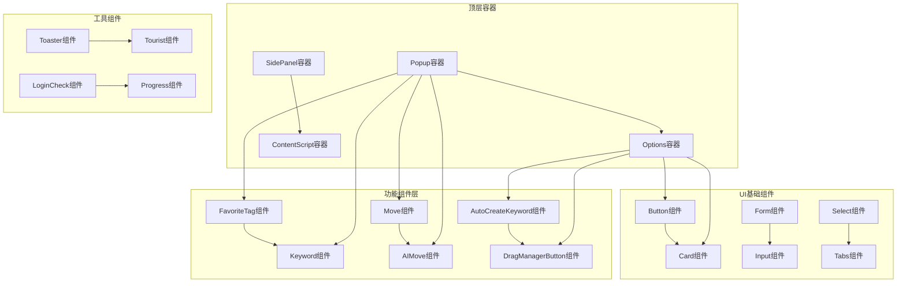

**图表来源**
- [src/popup/Popup.tsx: 22-76:22-76](file://src/popup/Popup.tsx#L22-L76)
- [src/options/Options.tsx: 31-87:31-87](file://src/options/Options.tsx#L31-L87)

### 组件通信模式

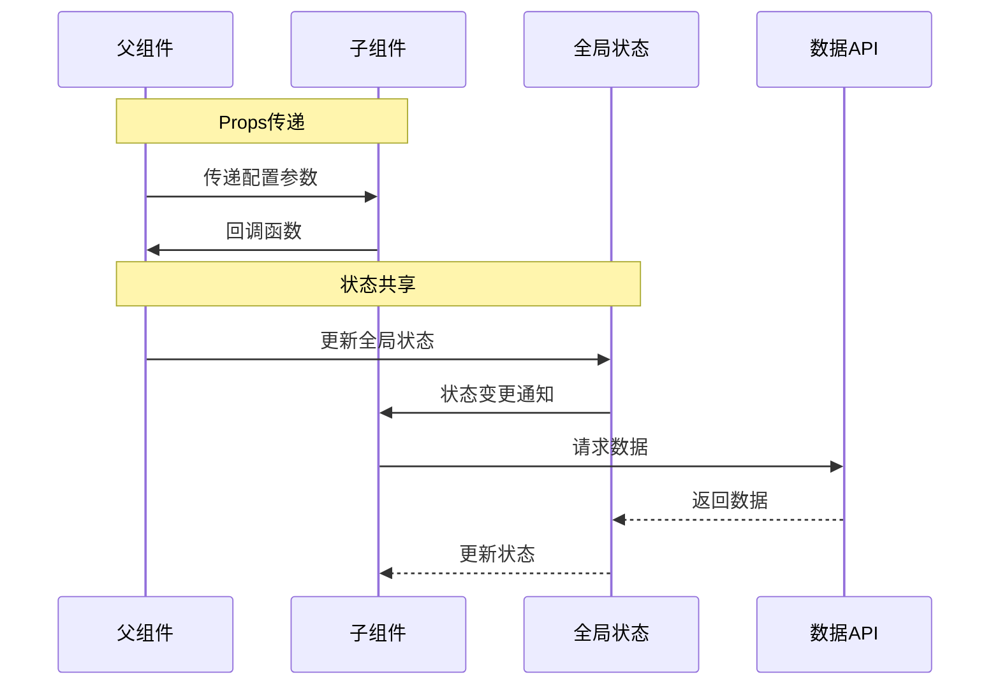

**章节来源**
- [src/popup/Popup.tsx: 1-80:1-80](file://src/popup/Popup.tsx#L1-L80)
- [src/options/Options.tsx: 1-91:1-91](file://src/options/Options.tsx#L1-L91)

## 样式系统与主题管理

### Tailwind CSS配置体系

项目采用Tailwind CSS作为主要样式框架，结合CSS变量实现灵活的主题管理：

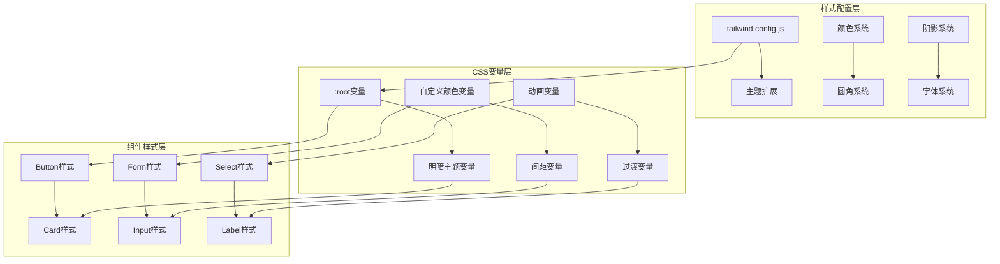

**图表来源**
- [tailwind.config.js: 1-118:1-118](file://tailwind.config.js#L1-L118)
- [src/popup/index.css: 1-86:1-86](file://src/popup/index.css#L1-L86)

### 主题系统实现

项目实现了完整的主题管理系统，支持明暗模式切换：

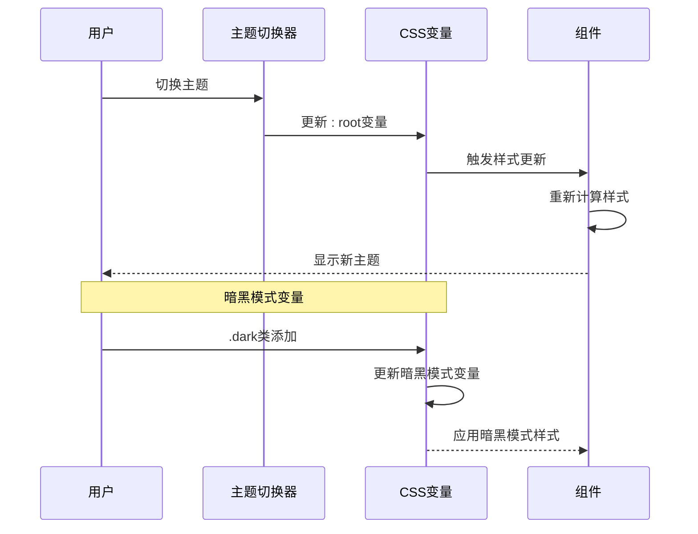

**图表来源**
- [src/popup/index.css: 34-59:34-59](file://src/popup/index.css#L34-L59)
- [src/options/index.css: 35-60:35-60](file://src/options/index.css#L35-L60)

**章节来源**
- [tailwind.config.js: 1-118:1-118](file://tailwind.config.js#L1-L118)
- [src/popup/index.css: 1-86:1-86](file://src/popup/index.css#L1-L86)
- [src/options/index.css: 1-83:1-83](file://src/options/index.css#L1-L83)

## 颜色管理与视觉设计

### 颜色系统架构

项目建立了完整的颜色管理体系，包含品牌色、语义色和功能色：

```mermaid
graph TB
subgraph "品牌色彩系统"
A[b-primary: #BF00FF] --> B[b-primary-hover: #A000D9]
C[b-secondary: #FF1493] --> D[b-accent: #00FFFF]
E[b-warning: #FFAA00] --> F[b-neon: #39FF14]
G[b-text-primary: #2D1B4E] --> H[品牌色彩变量]
end
subgraph "语义色彩系统"
I[primary: hsl(var(--primary))] --> J[secondary: hsl(var(--secondary))]
K[destructive: hsl(var(--destructive))] --> L[muted: hsl(var(--muted))]
M[accent: hsl(var(--accent))] --> N[success: 绿色系]
O[danger: 红色系] --> P[warning: 橙色系]
end
subgraph "主题色彩映射"
Q[明暗模式变量] --> R[颜色空间转换]
S[对比度调整] --> T[无障碍设计]
U[OLED优化] --> V[深色模式优化]
end
A --> Q
I --> S
Q --> U
```

**图表来源**
- [tailwind.config.js: 55-61:55-61](file://tailwind.config.js#L55-L61)
- [src/popup/index.css: 6-31:6-31](file://src/popup/index.css#L6-L31)
- [src/options/index.css: 7-32:7-32](file://src/options/index.css#L7-L32)

### 暗黑模式优化

项目针对OLED设备进行了专门的颜色优化：

| 颜色类型 | 明亮模式 | 暗黑模式 | OLED优化 |
|---------|---------|---------|---------|
| 背景 | #F8FAFC | #1C1C1C | 深黑色#000000 |
| 文本 | #1E293B | #F0F0F0 | 高对比度白色 |
| 主色调 | #2563EB | #3B82F6 | 深蓝色#0A0E27 |
| 强调色 | #F97316 | #F97316 | 保持鲜艳度 |
| 边框 | #E2E8F0 | #333333 | 最小化发光 |

**章节来源**
- [tailwind.config.js: 55-61:55-61](file://tailwind.config.js#L55-L61)
- [src/popup/index.css: 34-59:34-59](file://src/popup/index.css#L34-L59)
- [src/options/index.css: 35-60:35-60](file://src/options/index.css#L35-L60)

## 交互设计与用户体验

### 交互反馈系统

项目实现了完整的交互反馈机制，确保用户操作的即时响应：

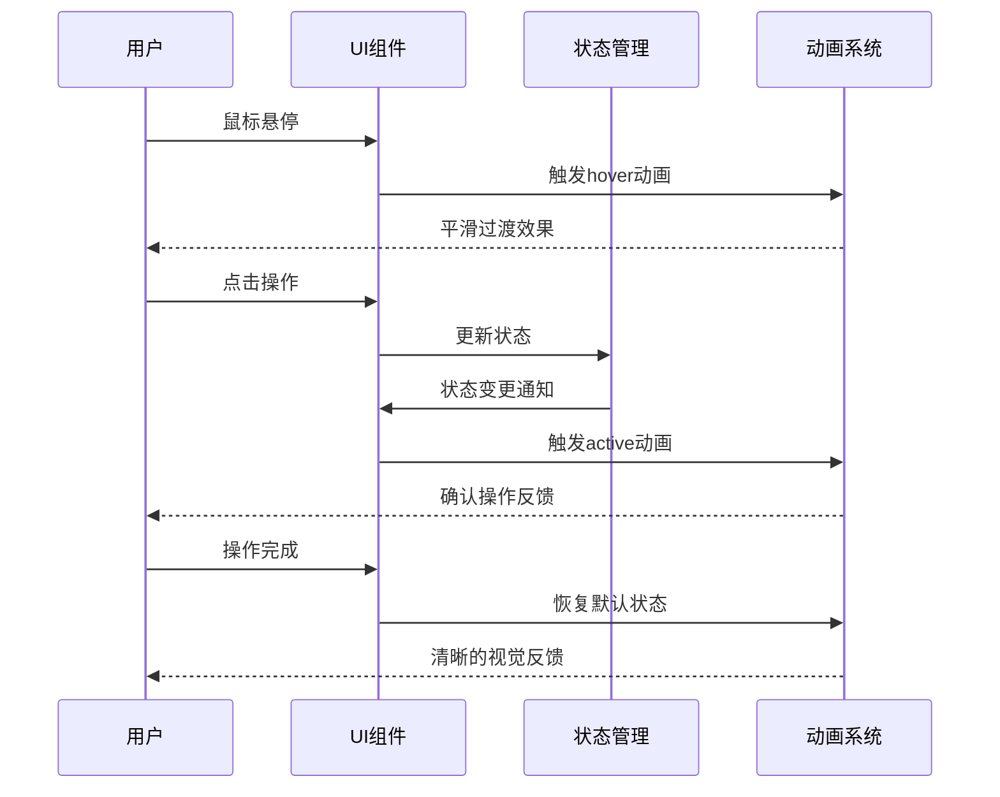

**图表来源**
- [src/components/ui/button.tsx: 7-32:7-32](file://src/components/ui/button.tsx#L7-L32)
- [src/components/ui/input.tsx: 10-13:10-13](file://src/components/ui/input.tsx#L10-L13)

### 无障碍设计规范

项目遵循WCAG 2.1 AA标准，确保所有用户都能正常使用：

| 设计要素 | 实现方式 | 无障碍标准 |
|---------|---------|-----------|
| 焦点管理 | `:focus-visible`伪类 | 键盘导航支持 |
| 颜色对比 | 至少4.5:1对比度 | 视觉障碍用户 |
| 字体大小 | 最小16px可读性 | 近视用户友好 |
| 交互反馈 | 多种反馈形式 | 不同能力用户 |
| 屏幕阅读器 | ARIA标签支持 | 视障用户 |
| 触摸目标 | 最小44px尺寸 | 手指操作友好 |

**章节来源**
- [src/components/ui/button.tsx: 1-51:1-51](file://src/components/ui/button.tsx#L1-L51)
- [src/components/ui/input.tsx: 1-23:1-23](file://src/components/ui/input.tsx#L1-L23)
- [src/components/ui/form.tsx: 1-168:1-168](file://src/components/ui/form.tsx#L1-L168)

## 性能优化策略

### 缓存策略

项目实现了多层次的缓存机制：

1. **智能缓存**：24小时有效期的数据缓存
2. **增量更新**：只更新变化的数据
3. **内存优化**：合理控制状态大小

### 构建优化

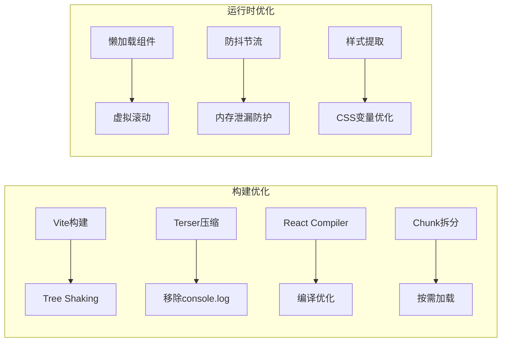

**图表来源**
- [vite.config.ts: 13-27:13-27](file://vite.config.ts#L13-L27)
- [vite.config.ts: 36-40:36-40](file://vite.config.ts#L36-L40)

**章节来源**
- [vite.config.ts: 1-44:1-44](file://vite.config.ts#L1-L44)
- [src/utils/api.ts: 285-319:285-319](file://src/utils/api.ts#L285-L319)

## React Hook性能优化最佳实践

### useMemoizedFn性能优化

项目广泛使用ahooks库中的useMemoizedFn来优化React Hook的性能，避免不必要的重新渲染：

#### use-cookie Hook依赖数组优化

use-cookie hook通过优化依赖数组，确保在必要时才重新执行effect：

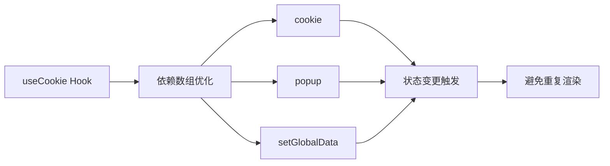

**图表来源**
- [src/hooks/use-cookie/index.ts: 34](file://src/hooks/use-cookie/index.ts#L34)

#### use-edit-keyword Hook性能优化

use-edit-keyword hook使用useMemoizedFn包装事件处理器，显著提升性能：

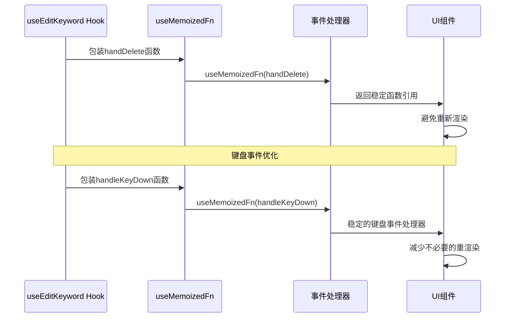

**图表来源**
- [src/hooks/use-edit-keyword/index.tsx: 20-30:20-30](file://src/hooks/use-edit-keyword/index.tsx#L20-L30)
- [src/hooks/use-edit-keyword/index.tsx: 32-70:32-70](file://src/hooks/use-edit-keyword/index.tsx#L32-L70)

#### use-create-keyword Hook批量优化

use-create-keyword hook在多个方法中使用useMemoizedFn：

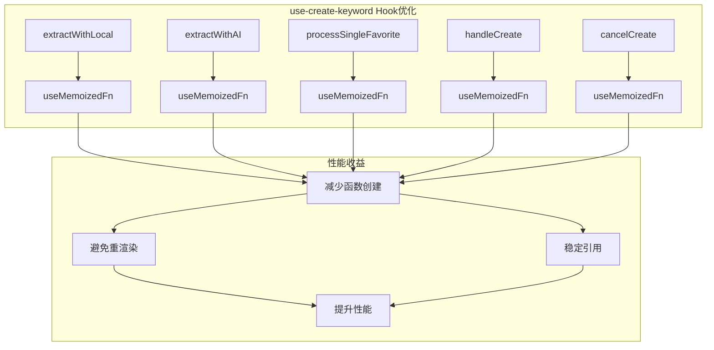

**图表来源**
- [src/hooks/use-create-keyword/index.tsx: 40](file://src/hooks/use-create-keyword/index.tsx#L40)
- [src/hooks/use-create-keyword/index.tsx: 107](file://src/hooks/use-create-keyword/index.tsx#L107)
- [src/hooks/use-create-keyword/index.tsx: 174](file://src/hooks/use-create-keyword/index.tsx#L174)
- [src/hooks/use-create-keyword/index.tsx: 191](file://src/hooks/use-create-keyword/index.tsx#L191)
- [src/hooks/use-create-keyword/index.tsx: 286](file://src/hooks/use-create-keyword/index.tsx#L286)

### 性能优化最佳实践

#### Hook函数稳定性原则

1. **事件处理器优化**：使用useMemoizedFn包装事件处理函数
2. **计算函数优化**：对复杂计算使用useMemoizedFn
3. **回调函数优化**：确保回调函数引用稳定
4. **依赖数组优化**：精确控制useEffect依赖项

#### 性能监控指标

- **重渲染次数**：监控组件重渲染频率
- **函数创建次数**：跟踪函数创建和销毁
- **内存使用**：监控Hook内存占用
- **渲染性能**：测量组件渲染时间

**章节来源**
- [src/hooks/use-cookie/index.ts: 1-40:1-40](file://src/hooks/use-cookie/index.ts#L1-L40)
- [src/hooks/use-edit-keyword/index.tsx: 1-111:1-111](file://src/hooks/use-edit-keyword/index.tsx#L1-L111)
- [src/hooks/use-create-keyword/index.tsx: 1-304:1-304](file://src/hooks/use-create-keyword/index.tsx#L1-L304)
- [package.json: 40](file://package.json#L40)

## 错误处理与调试

### 错误处理机制

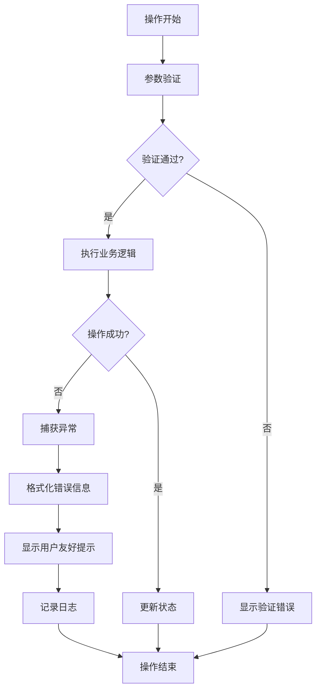

### 调试支持

项目提供了完善的调试功能：

- **开发环境日志**：仅在开发模式下输出详细日志
- **状态监控**：实时查看全局状态变化
- **网络请求追踪**：监控API调用情况

**章节来源**
- [src/utils/log.ts: 1-8:1-8](file://src/utils/log.ts#L1-L8)

## 测试策略

### 测试覆盖范围

项目采用了多层次的测试策略：

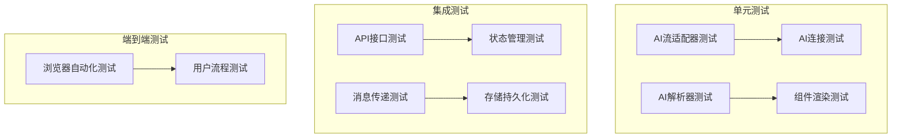

**图表来源**
- [tests/ai-stream-adapter.test.ts](file://tests/ai-stream-adapter.test.ts)
- [tests/ai-stream-connect.test.ts](file://tests/ai-stream-connect.test.ts)
- [tests/ai-stream-parser.test.ts](file://tests/ai-stream-parser.test.ts)

### 测试配置

- **测试框架**：Vitest + Playwright
- **覆盖率**：支持代码覆盖率统计
- **浏览器测试**：支持真实浏览器环境测试

**章节来源**
- [package.json: 25-27:25-27](file://package.json#L25-L27)

## 部署与构建

### 构建配置

项目使用Vite作为构建工具，配置了多项优化策略：

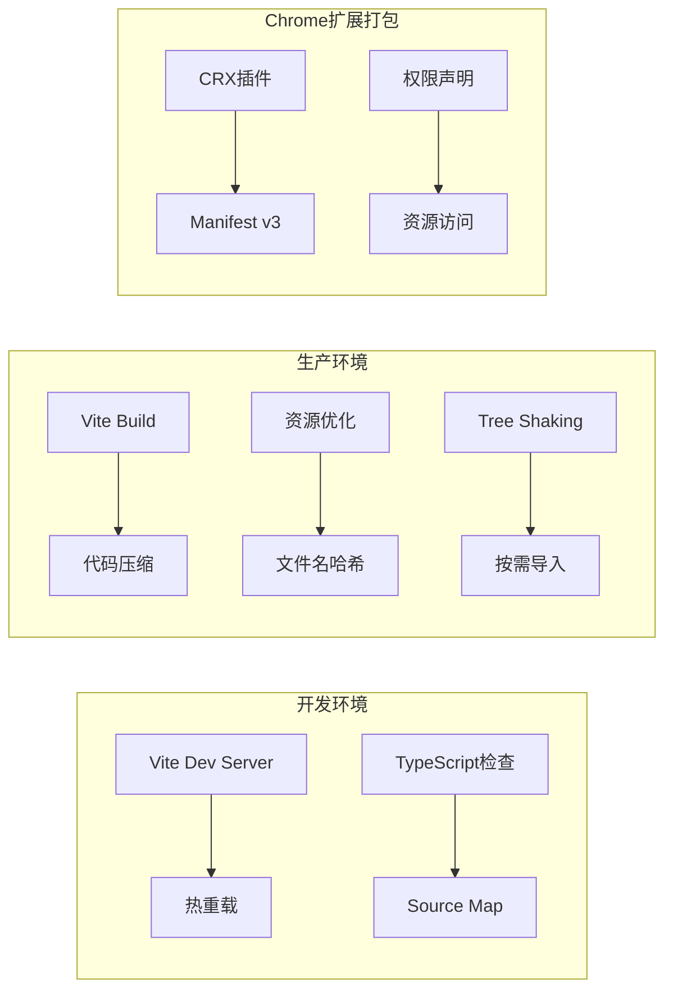

**图表来源**
- [vite.config.ts: 11-43:11-43](file://vite.config.ts#L11-L43)
- [src/manifest.ts: 8-54:8-54](file://src/manifest.ts#L8-L54)

### 构建脚本

项目提供了完整的构建和发布流程：

- **开发**：`npm run dev` - 启动开发服务器
- **构建**：`npm run build` - 生产环境构建
- **预览**：`npm run preview` - 预览构建结果
- **打包**：`npm run zip` - 生成扩展包

**章节来源**
- [package.json: 17-27:17-27](file://package.json#L17-L27)
- [vite.config.ts: 1-44:1-44](file://vite.config.ts#L1-L44)

## 总结

这个React最佳实践系统展现了现代Chrome扩展开发的完整解决方案：

### 核心优势

1. **架构清晰**：模块化设计，职责分离明确
2. **样式系统完善**：Tailwind CSS + CSS变量实现灵活的主题管理
3. **颜色体系专业**：品牌色、语义色、无障碍设计一体化
4. **交互体验优秀**：完整的反馈系统和无障碍支持
5. **状态管理优秀**：Zustand + Immer的组合实现高效的状态管理
6. **性能优化到位**：多层次缓存和构建优化策略
7. **Hook性能优化**：useMemoizedFn等工具的系统性应用
8. **开发体验良好**：完善的TypeScript支持和开发工具链
9. **测试覆盖全面**：多层次的测试策略确保代码质量

### 技术亮点

- **React 19新特性**：充分利用最新的React特性
- **TypeScript强类型**：完整的类型安全保障
- **现代化工具链**：Vite + Tailwind CSS + Radix UI
- **AI集成**：流畅的AI服务集成和流式处理
- **Chrome扩展最佳实践**：符合Chrome Web Store规范
- **OLED优化**：针对深色模式和OLED屏幕的专业优化
- **无障碍设计**：完整的WCAG 2.1 AA标准支持
- **Hook性能优化**：useMemoizedFn等工具的系统性应用

这个项目为React应用开发提供了优秀的参考模板，展示了如何在实际项目中应用各种最佳实践和技术方案，特别是在样式系统、颜色管理和交互设计方面的专业实现。新增的Hook性能优化章节进一步完善了项目的最佳实践体系，为开发者提供了实用的性能优化指导。