# React最佳实践系统

<cite>
**本文档引用的文件**
- [package.json](file://package.json)
- [README.md](file://README.md)
- [src/manifest.ts](file://src/manifest.ts)
- [vite.config.ts](file://vite.config.ts)
- [tsconfig.json](file://tsconfig.json)
- [src/popup/Popup.tsx](file://src/popup/Popup.tsx)
- [src/options/Options.tsx](file://src/options/Options.tsx)
- [src/store/global-data.ts](file://src/store/global-data.ts)
- [src/store/chorme-storage-middleware.ts](file://src/store/chorme-storage-middleware.ts)
- [src/utils/data-context.ts](file://src/utils/data-context.ts)
- [src/utils/api.ts](file://src/utils/api.ts)
- [src/lib/utils.ts](file://src/lib/utils.ts)
- [src/utils/log.ts](file://src/utils/log.ts)
</cite>

## 目录
1. [项目概述](#项目概述)
2. [项目结构](#项目结构)
3. [核心架构设计](#核心架构设计)
4. [状态管理系统](#状态管理系统)
5. [数据流架构](#数据流架构)
6. [组件设计模式](#组件设计模式)
7. [性能优化策略](#性能优化策略)
8. [错误处理与调试](#错误处理与调试)
9. [测试策略](#测试策略)
10. [部署与构建](#部署与构建)
11. [总结](#总结)

## 项目概述

这是一个基于React 19开发的Chrome扩展程序，名为"B站收藏夹整理工具"。该项目实现了完整的收藏夹管理、数据分析、AI智能分类等功能，展现了现代React应用的最佳实践。

### 主要功能特性

- **智能分析**：深度分析B站收藏内容分布，提供可视化展示
- **AI驱动**：基于GPT的视频标题关键词提取，自动分类
- **可视化拖拽管理**：直观的收藏夹拖拽操作界面
- **侧边栏模式**：持久显示的扩展界面
- **配置管理**：灵活的API配置和模型选择

**章节来源**
- [README.md: 29-80:29-80](file://README.md#L29-L80)

## 项目结构

项目采用模块化的目录结构，清晰分离了不同功能域：

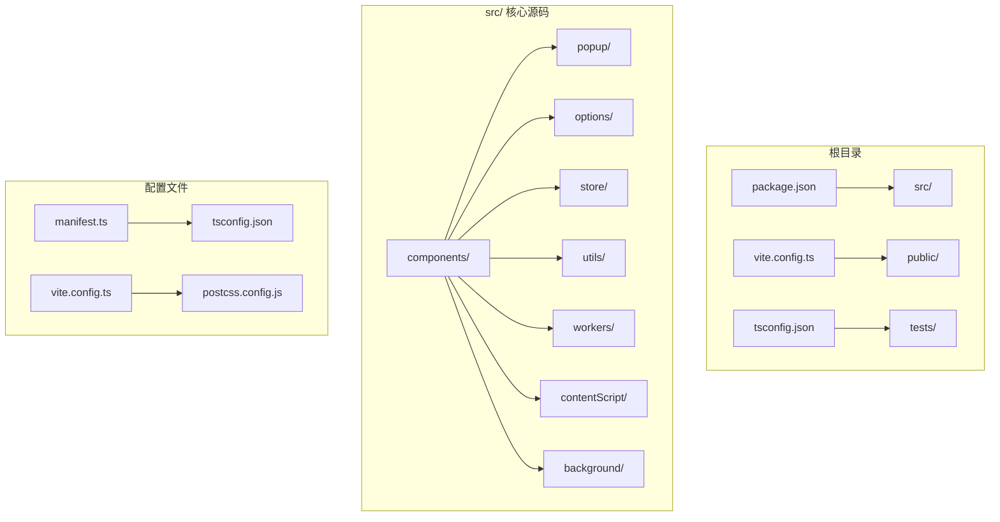

**图表来源**
- [src/manifest.ts: 1-55:1-55](file://src/manifest.ts#L1-L55)
- [vite.config.ts: 1-44:1-44](file://vite.config.ts#L1-L44)

### 目录组织原则

- **按功能域分层**：components、hooks、store、utils等模块化组织
- **按页面分离**：popup、options、sidepanel独立管理
- **工具函数集中**：utils目录统一管理工具方法
- **状态管理分离**：store目录专门处理全局状态

**章节来源**
- [src/manifest.ts: 8-54:8-54](file://src/manifest.ts#L8-L54)

## 核心架构设计

### 整体架构模式

项目采用了典型的Chrome扩展架构，结合React组件化开发：

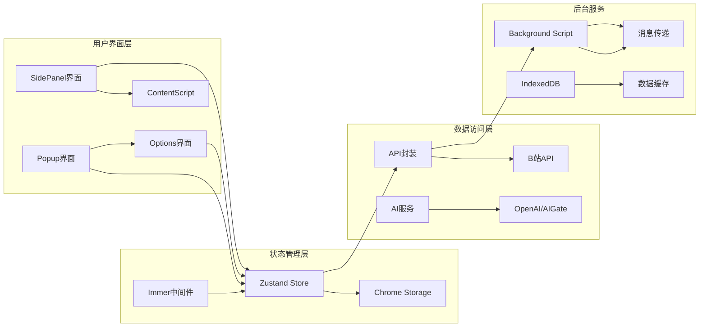

**图表来源**
- [src/popup/Popup.tsx: 14-80:14-80](file://src/popup/Popup.tsx#L14-L80)
- [src/options/Options.tsx: 12-91:12-91](file://src/options/Options.tsx#L12-L91)

### 架构设计特点

1. **模块化设计**：每个功能域都有独立的模块和职责边界
2. **状态集中管理**：使用Zustand实现全局状态管理
3. **异步数据流**：通过消息传递实现前后端通信
4. **缓存策略**：智能缓存机制提升性能

**章节来源**
- [src/store/global-data.ts: 6-25:6-25](file://src/store/global-data.ts#L6-L25)
- [src/utils/api.ts: 285-319:285-319](file://src/utils/api.ts#L285-L319)

## 状态管理系统

### Zustand状态管理

项目使用Zustand作为状态管理解决方案，结合Immer中间件实现不可变更新：

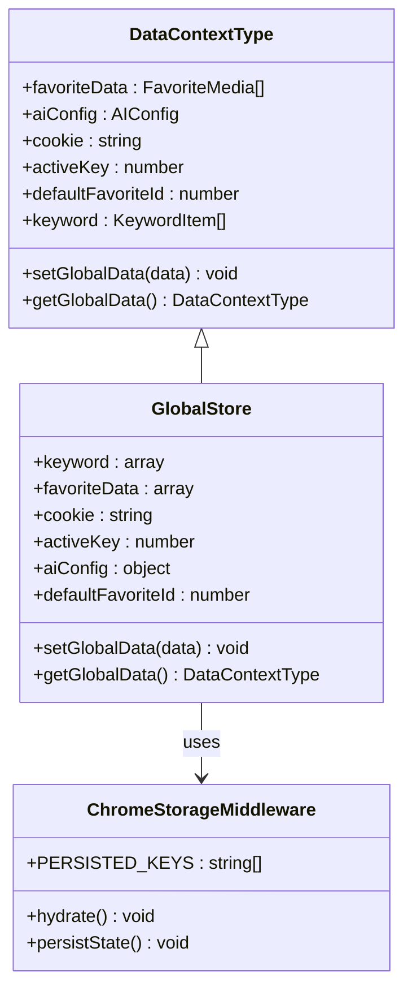

**图表来源**
- [src/utils/data-context.ts: 3-31:3-31](file://src/utils/data-context.ts#L3-L31)
- [src/store/global-data.ts: 6-25:6-25](file://src/store/global-data.ts#L6-L25)

### 状态持久化机制

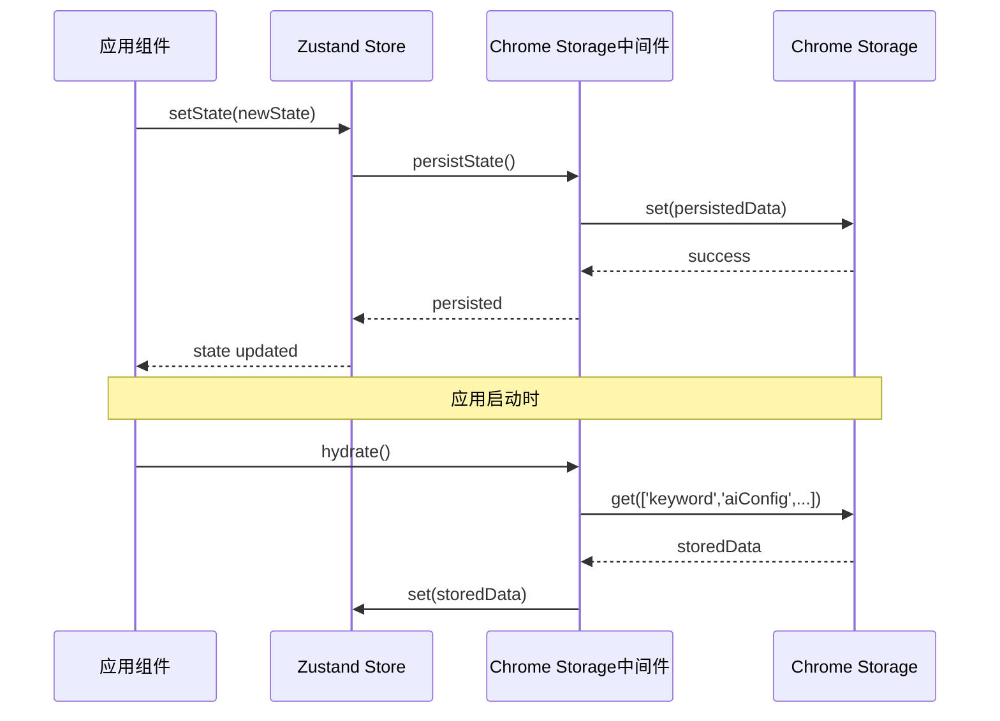

**图表来源**
- [src/store/chorme-storage-middleware.ts: 13-54:13-54](file://src/store/chorme-storage-middleware.ts#L13-L54)

**章节来源**
- [src/store/global-data.ts: 1-28:1-28](file://src/store/global-data.ts#L1-L28)
- [src/store/chorme-storage-middleware.ts: 1-63:1-63](file://src/store/chorme-storage-middleware.ts#L1-L63)

## 数据流架构

### API数据流

项目实现了完整的数据获取和处理流程：

**图表来源**
- [src/utils/api.ts: 285-319:285-319](file://src/utils/api.ts#L285-L319)

### AI服务集成

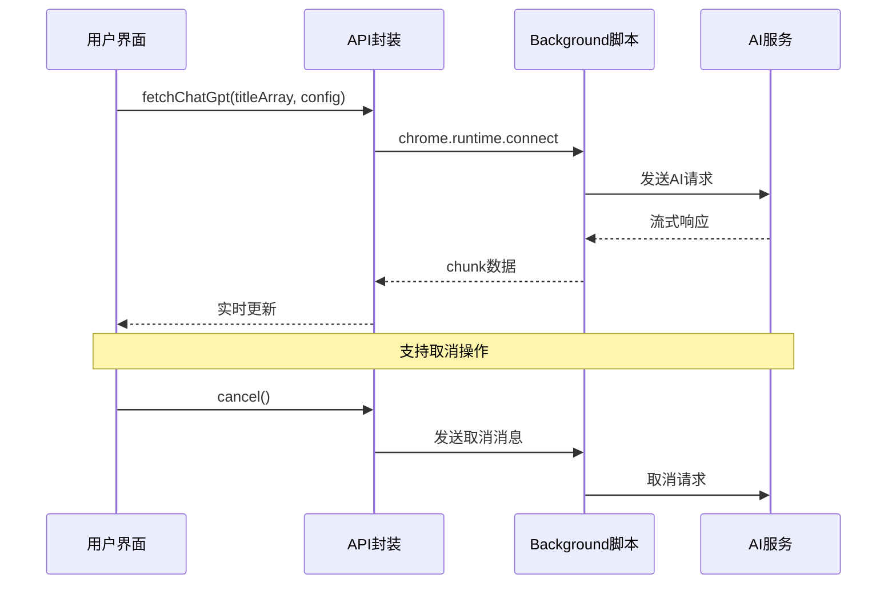

**图表来源**
- [src/utils/api.ts: 180-232:180-232](file://src/utils/api.ts#L180-L232)

**章节来源**
- [src/utils/api.ts: 1-339:1-339](file://src/utils/api.ts#L1-L339)

## 组件设计模式

### 组件层次结构

项目采用分层组件设计，实现了良好的可维护性：

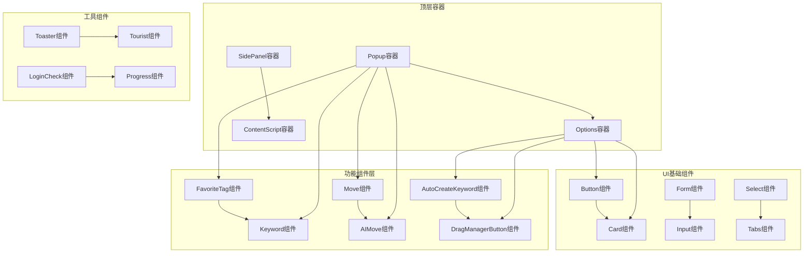

**图表来源**
- [src/popup/Popup.tsx: 22-76:22-76](file://src/popup/Popup.tsx#L22-L76)
- [src/options/Options.tsx: 31-87:31-87](file://src/options/Options.tsx#L31-L87)

### 组件通信模式

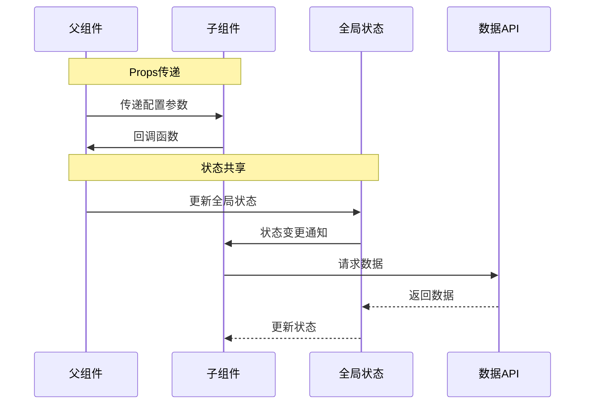

**章节来源**
- [src/popup/Popup.tsx: 1-80:1-80](file://src/popup/Popup.tsx#L1-L80)
- [src/options/Options.tsx: 1-91:1-91](file://src/options/Options.tsx#L1-L91)

## 性能优化策略

### 缓存策略

项目实现了多层次的缓存机制：

1. **智能缓存**：24小时有效期的数据缓存
2. **增量更新**：只更新变化的数据
3. **内存优化**：合理控制状态大小

### 构建优化

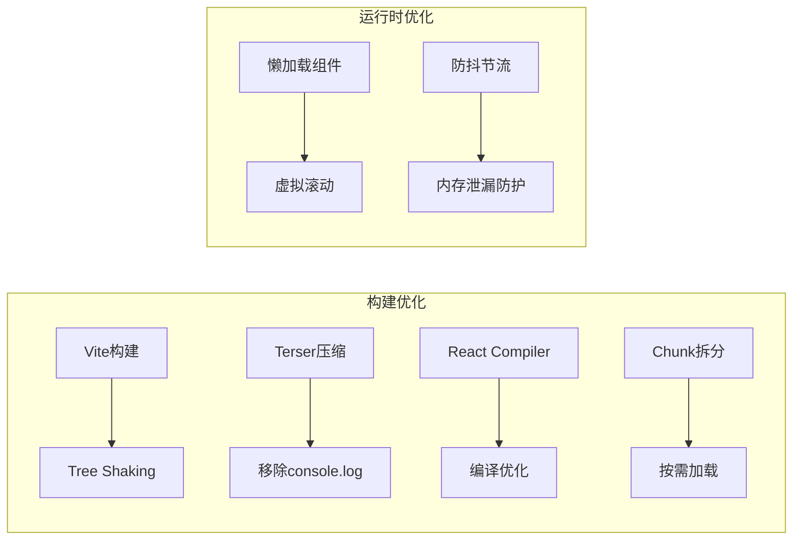

**图表来源**
- [vite.config.ts: 13-27:13-27](file://vite.config.ts#L13-L27)
- [vite.config.ts: 36-40:36-40](file://vite.config.ts#L36-L40)

**章节来源**
- [vite.config.ts: 1-44:1-44](file://vite.config.ts#L1-L44)
- [src/utils/api.ts: 285-319:285-319](file://src/utils/api.ts#L285-L319)

## 错误处理与调试

### 错误处理机制

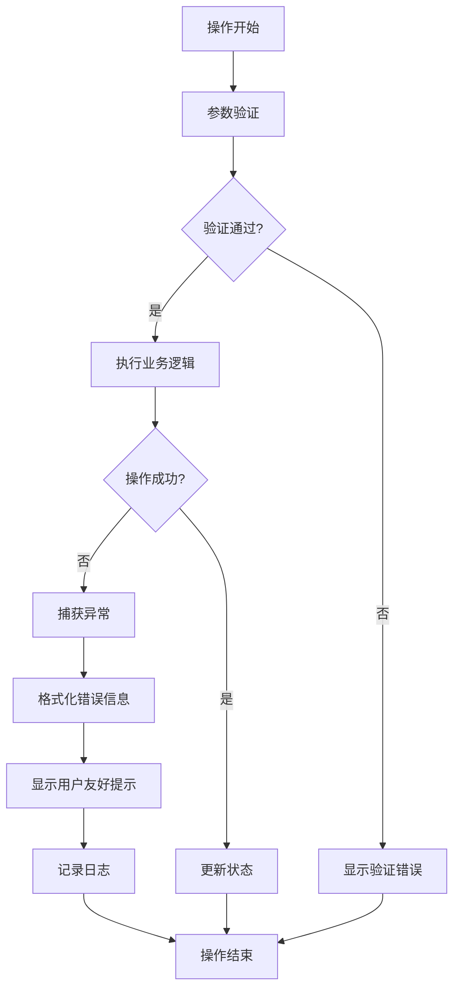

### 调试支持

项目提供了完善的调试功能：

- **开发环境日志**：仅在开发模式下输出详细日志
- **状态监控**：实时查看全局状态变化
- **网络请求追踪**：监控API调用情况

**章节来源**
- [src/utils/log.ts: 1-8:1-8](file://src/utils/log.ts#L1-L8)

## 测试策略

### 测试覆盖范围

项目采用了多层次的测试策略：

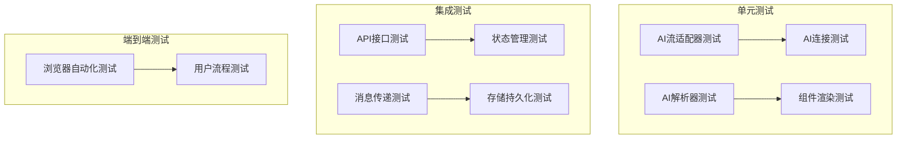

**图表来源**
- [tests/ai-stream-adapter.test.ts](file://tests/ai-stream-adapter.test.ts)
- [tests/ai-stream-connect.test.ts](file://tests/ai-stream-connect.test.ts)
- [tests/ai-stream-parser.test.ts](file://tests/ai-stream-parser.test.ts)

### 测试配置

- **测试框架**：Vitest + Playwright
- **覆盖率**：支持代码覆盖率统计
- **浏览器测试**：支持真实浏览器环境测试

**章节来源**
- [package.json: 25-27:25-27](file://package.json#L25-L27)

## 部署与构建

### 构建配置

项目使用Vite作为构建工具，配置了多项优化策略：

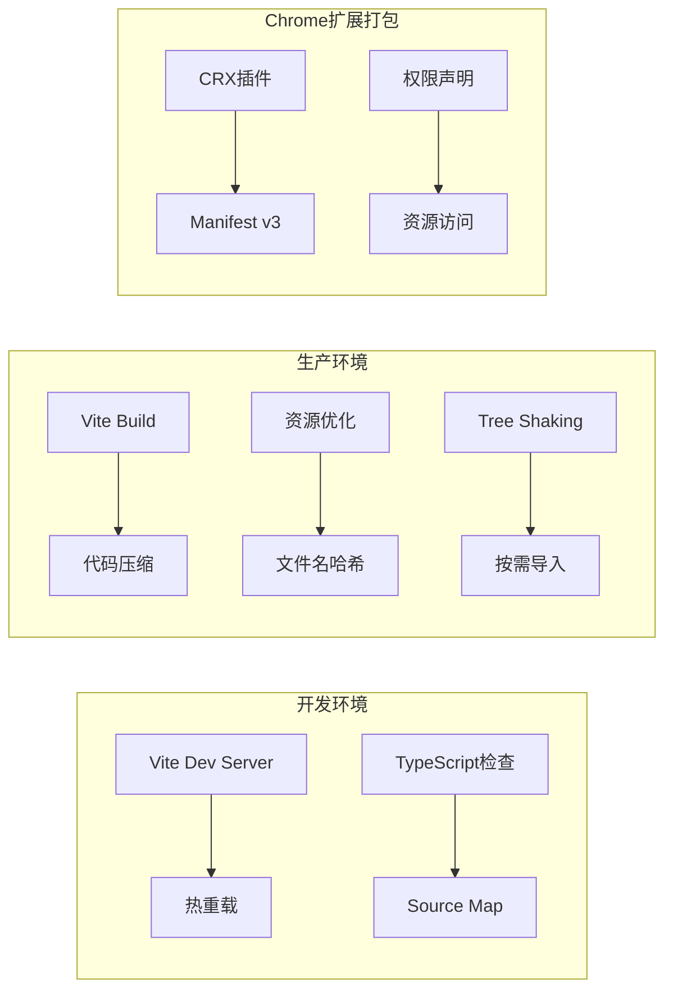

**图表来源**
- [vite.config.ts: 11-43:11-43](file://vite.config.ts#L11-L43)
- [src/manifest.ts: 8-54:8-54](file://src/manifest.ts#L8-L54)

### 构建脚本

项目提供了完整的构建和发布流程：

- **开发**：`npm run dev` - 启动开发服务器
- **构建**：`npm run build` - 生产环境构建
- **预览**：`npm run preview` - 预览构建结果
- **打包**：`npm run zip` - 生成扩展包

**章节来源**
- [package.json: 17-27:17-27](file://package.json#L17-L27)
- [vite.config.ts: 1-44:1-44](file://vite.config.ts#L1-L44)

## 总结

这个React最佳实践系统展现了现代Chrome扩展开发的完整解决方案：

### 核心优势

1. **架构清晰**：模块化设计，职责分离明确
2. **状态管理优秀**：Zustand + Immer的组合实现高效的状态管理
3. **性能优化到位**：多层次缓存和构建优化策略
4. **开发体验良好**：完善的TypeScript支持和开发工具链
5. **测试覆盖全面**：多层次的测试策略确保代码质量

### 技术亮点

- **React 19新特性**：充分利用最新的React特性
- **TypeScript强类型**：完整的类型安全保障
- **现代化工具链**：Vite + Tailwind CSS + Radix UI
- **AI集成**：流畅的AI服务集成和流式处理
- **Chrome扩展最佳实践**：符合Chrome Web Store规范

这个项目为React应用开发提供了优秀的参考模板，展示了如何在实际项目中应用各种最佳实践和技术方案。