# UI/UX专业设计系统

<cite>
**本文档引用的文件**
- [button.tsx](file://src/components/ui/button.tsx)
- [card.tsx](file://src/components/ui/card.tsx)
- [form.tsx](file://src/components/ui/form.tsx)
- [input.tsx](file://src/components/ui/input.tsx)
- [select.tsx](file://src/components/ui/select.tsx)
- [tabs.tsx](file://src/components/ui/tabs.tsx)
- [toast.tsx](file://src/components/ui/toast.tsx)
- [utils.ts](file://src/lib/utils.ts)
- [components.json](file://components.json)
- [index.css](file://src/options/index.css)
- [Options.tsx](file://src/options/Options.tsx)
- [Popup.tsx](file://src/popup/Popup.tsx)
- [global-data.ts](file://src/store/global-data.ts)
- [tailwind.config.js](file://tailwind.config.js)
- [package.json](file://package.json)
</cite>

## 目录
1. [项目概述](#项目概述)
2. [设计系统架构](#设计系统架构)
3. [核心组件库](#核心组件库)
4. [视觉设计系统](#视觉设计系统)
5. [交互设计规范](#交互设计规范)
6. [状态管理设计](#状态管理设计)
7. [响应式设计策略](#响应式设计策略)
8. [可访问性设计](#可访问性设计)
9. [性能优化策略](#性能优化策略)
10. [总结与最佳实践](#总结与最佳实践)

## 项目概述

本项目是一个基于React开发的浏览器扩展UI/UX设计系统，专注于B站收藏夹管理功能。该设计系统采用现代化的设计理念，结合了原子化设计原则、组件化架构和响应式布局，为用户提供直观、高效的操作体验。

### 设计系统特点

- **原子化设计原则**：采用原子类设计，通过组合基础样式构建复杂界面
- **主题化设计**：支持明暗主题切换，提供丰富的色彩体系
- **组件化架构**：模块化的组件设计，便于维护和扩展
- **响应式布局**：适配不同屏幕尺寸和浏览器窗口大小
- **无障碍设计**：遵循WCAG标准，确保良好的可访问性

## 设计系统架构

### 整体架构图

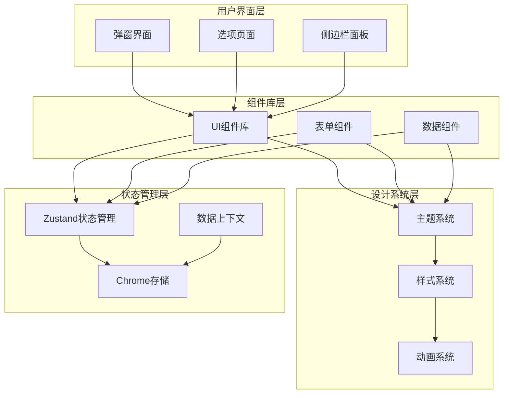

**图表来源**
- [Popup.tsx:14-76](file://src/popup/Popup.tsx#L14-L76)
- [Options.tsx:12-87](file://src/options/Options.tsx#L12-L87)
- [global-data.ts:6-24](file://src/store/global-data.ts#L6-L24)

### 组件层次结构

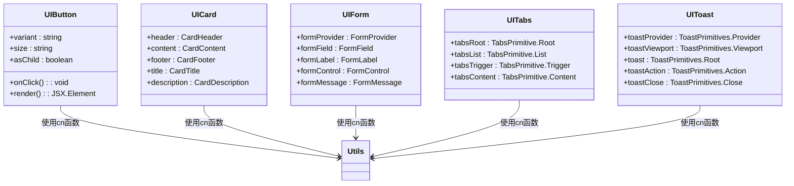

**图表来源**
- [button.tsx:34-50](file://src/components/ui/button.tsx#L34-L50)
- [card.tsx:5-56](file://src/components/ui/card.tsx#L5-L56)
- [form.tsx:16-167](file://src/components/ui/form.tsx#L16-L167)
- [tabs.tsx:6-53](file://src/components/ui/tabs.tsx#L6-L53)
- [toast.tsx:8-126](file://src/components/ui/toast.tsx#L8-L126)

**章节来源**
- [Popup.tsx:1-80](file://src/popup/Popup.tsx#L1-L80)
- [Options.tsx:1-91](file://src/options/Options.tsx#L1-L91)
- [global-data.ts:1-28](file://src/store/global-data.ts#L1-L28)

## 核心组件库

### 按钮组件系统

按钮组件是整个设计系统的基础元素，采用变体模式提供多种样式选择：

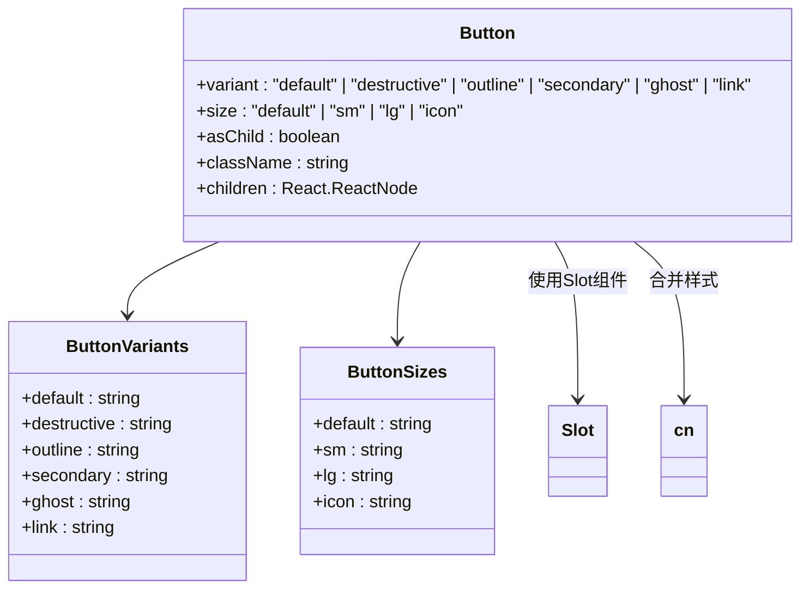

**图表来源**
- [button.tsx:7-32](file://src/components/ui/button.tsx#L7-L32)
- [button.tsx:40-47](file://src/components/ui/button.tsx#L40-L47)

#### 按钮变体设计

| 变体类型 | 颜色方案 | 使用场景 | 状态效果 |
|---------|---------|---------|---------|
| default | 主色调背景 + 逆色文字 | 主要操作按钮 | 悬停时透明度变化 |
| destructive | 错误色背景 + 逆色文字 | 危险操作按钮 | 强烈的红色系 |
| outline | 边框 + 背景透明 | 次要操作按钮 | 边框颜色变化 |
| secondary | 次色调背景 + 逆色文字 | 次要功能按钮 | 轻微透明效果 |
| ghost | 仅悬停效果 | 工具栏按钮 | 透明背景 |
| link | 主色调文字 | 文本链接 | 下划线效果 |

**章节来源**
- [button.tsx:10-31](file://src/components/ui/button.tsx#L10-L31)

### 卡片组件系统

卡片组件提供内容容器的标准化设计：

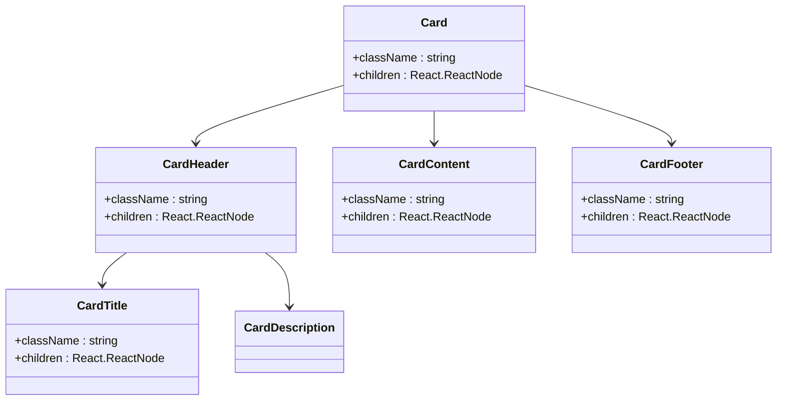

**图表来源**
- [card.tsx:5-56](file://src/components/ui/card.tsx#L5-L56)

#### 卡片布局规范

- **圆角半径**：16px（lg），14px（md），12px（sm）
- **阴影效果**：轻量级阴影，提升层级感
- **内边距**：标题区域1.5rem，内容区域1rem
- **边框样式**：统一的边框颜色和宽度

**章节来源**
- [card.tsx:16-54](file://src/components/ui/card.tsx#L16-L54)

### 表单组件系统

表单组件提供完整的表单处理能力：

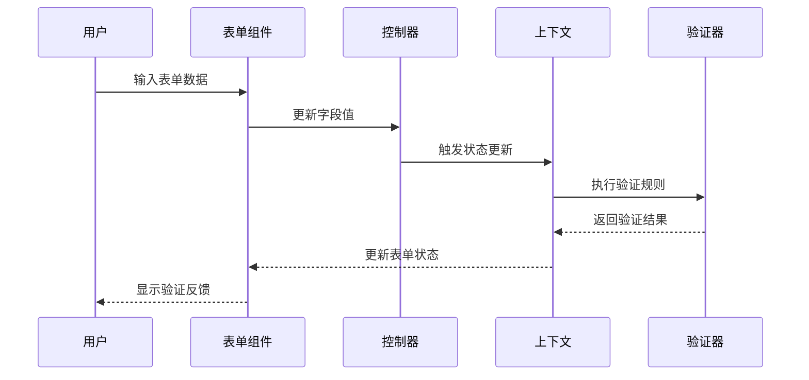

**图表来源**
- [form.tsx:27-38](file://src/components/ui/form.tsx#L27-L38)
- [form.tsx:40-61](file://src/components/ui/form.tsx#L40-L61)

#### 表单验证流程

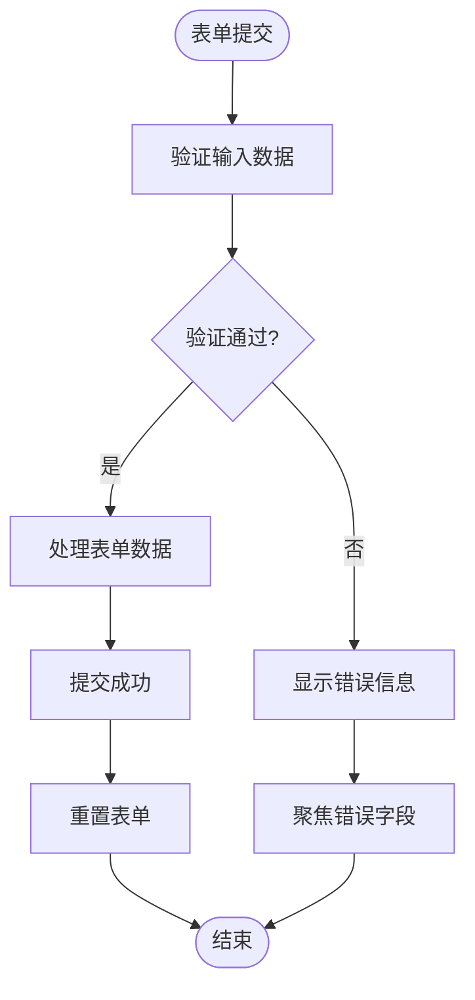

**图表来源**
- [form.tsx:134-155](file://src/components/ui/form.tsx#L134-L155)

**章节来源**
- [form.tsx:16-167](file://src/components/ui/form.tsx#L16-L167)

### 选择器组件系统

选择器组件提供下拉选择功能：

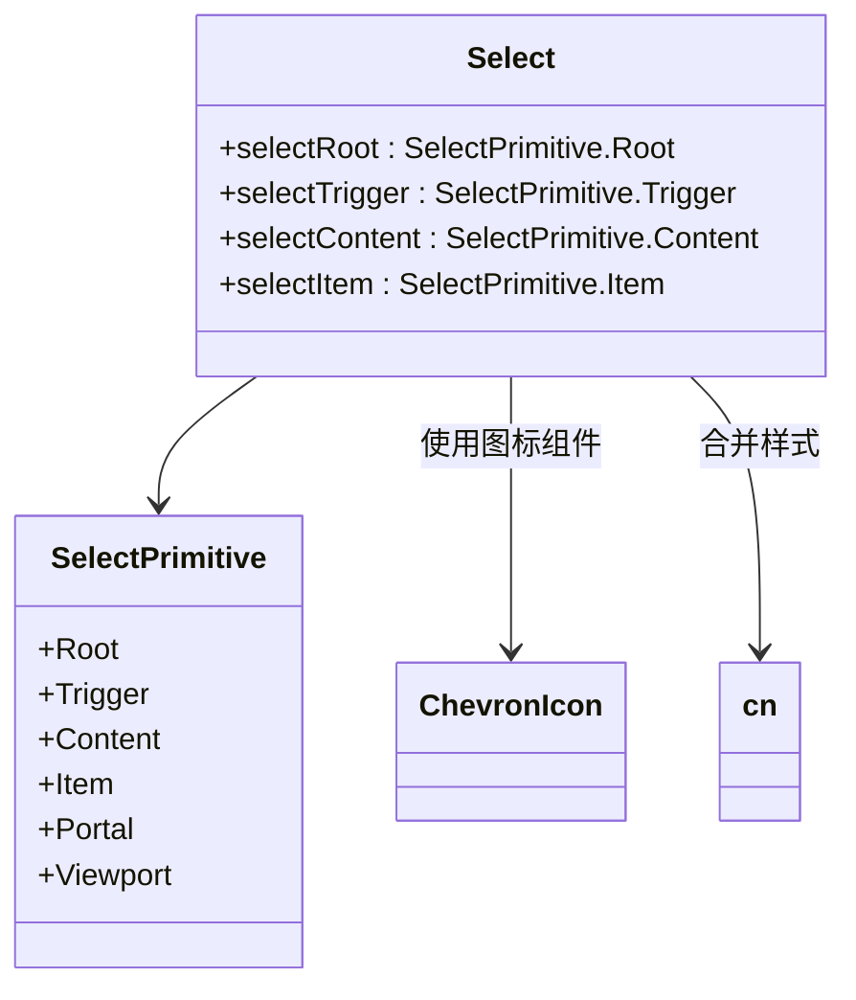

**图表来源**
- [select.tsx:7-150](file://src/components/ui/select.tsx#L7-L150)

#### 选择器交互模式

- **触发器**：显示当前选中值，点击展开选项
- **内容区域**：支持滚动查看更多选项
- **选项项**：支持键盘导航和鼠标选择
- **动画效果**：展开收起的平滑过渡动画

**章节来源**
- [select.tsx:13-91](file://src/components/ui/select.tsx#L13-L91)

### 标签页组件系统

标签页组件提供多面板切换功能：

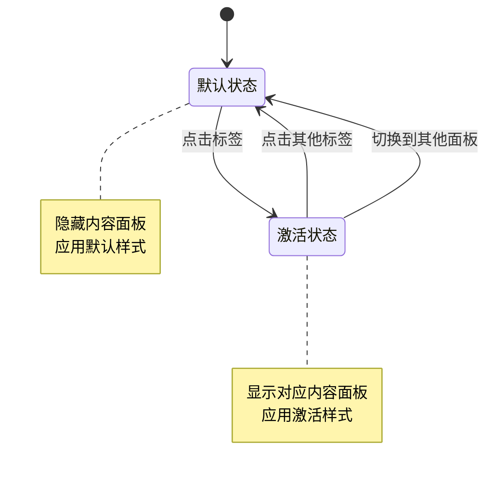

**图表来源**
- [tabs.tsx:23-36](file://src/components/ui/tabs.tsx#L23-L36)

**章节来源**
- [tabs.tsx:6-53](file://src/components/ui/tabs.tsx#L6-L53)

### 提示组件系统

提示组件提供用户反馈机制：

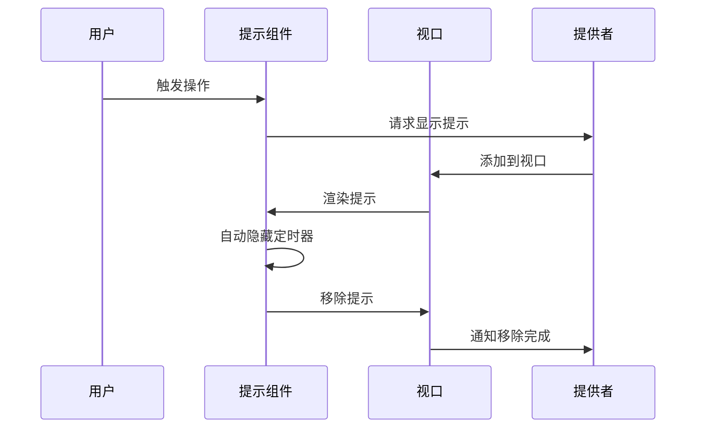

**图表来源**
- [toast.tsx:8-23](file://src/components/ui/toast.tsx#L8-L23)

#### 提示类型设计

| 类型 | 颜色方案 | 使用场景 | 动画效果 |
|------|---------|---------|---------|
| default | 基础主题色 | 一般信息提示 | 从顶部滑入 |
| destructive | 错误主题色 | 错误操作反馈 | 从底部滑入 |

**章节来源**
- [toast.tsx:25-53](file://src/components/ui/toast.tsx#L25-L53)

**章节来源**
- [button.tsx:1-51](file://src/components/ui/button.tsx#L1-L51)
- [card.tsx:1-57](file://src/components/ui/card.tsx#L1-L57)
- [form.tsx:1-168](file://src/components/ui/form.tsx#L1-L168)
- [input.tsx:1-23](file://src/components/ui/input.tsx#L1-L23)
- [select.tsx:1-151](file://src/components/ui/select.tsx#L1-L151)
- [tabs.tsx:1-54](file://src/components/ui/tabs.tsx#L1-L54)
- [toast.tsx:1-127](file://src/components/ui/toast.tsx#L1-L127)

## 视觉设计系统

### 色彩体系设计

设计系统采用多巴胺配色方案，提供丰富的色彩选择：

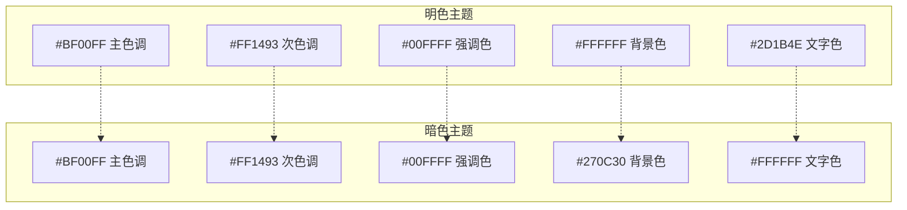

**图表来源**
- [index.css:6-60](file://src/options/index.css#L6-L60)

#### 色彩变量定义

| 色彩变量 | 明色值 | 暗色值 | 用途说明 |
|---------|-------|-------|---------|
| --primary | 288° 100% 50% | 288° 100% 60% | 主要品牌色彩 |
| --secondary | 328° 100% 54% | 328° 100% 60% | 次要功能色彩 |
| --accent | 180° 100% 50% | 180° 100% 50% | 强调装饰色彩 |
| --destructive | 39° 100% 50% | 39° 100% 55% | 错误警告色彩 |
| --background | 270° 100% 99% | 270° 30% 8% | 页面背景色彩 |
| --foreground | 270° 50% 10% | 0° 0% 98% | 主要文字色彩 |

**章节来源**
- [index.css:7-60](file://src/options/index.css#L7-L60)

### 字体系统设计

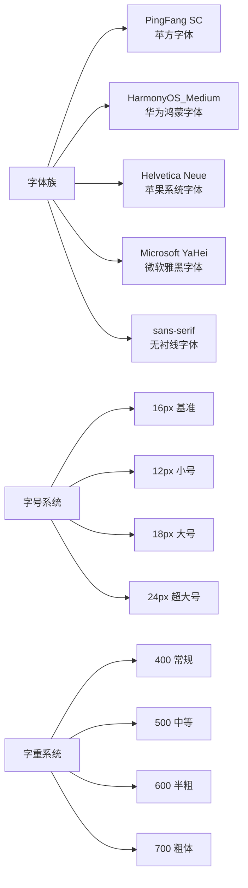

**图表来源**
- [index.css:81-83](file://src/options/index.css#L81-L83)

#### 字体排版规范

- **主字体**：PingFang SC（优先），Helvetica Neue（回退）
- **字号层级**：12px → 14px → 16px → 18px → 20px → 24px
- **行高比例**：1.4-1.6倍行高
- **字重选择**：标题使用Semibold，正文使用Regular

**章节来源**
- [index.css:81-83](file://src/options/index.css#L81-L83)

### 阴影与圆角系统

```mermaid
graph TB
ShadowSystem[阴影系统] --> BoxShadow[盒子阴影]
ShadowSystem --> TextShadow[文本阴影]
BoxShadow --> Depth1[深度1: 0 1px 3px rgba(0,0,0,0.1)]
BoxShadow --> Depth2[深度2: 0 4px 6px rgba(0,0,0,0.1)]
BoxShadow --> Depth3[深度3: 0 10px 25px rgba(0,0,0,0.1)]
BoxShadow --> Depth4[深度4: 0 20px 40px rgba(0,0,0,0.1)]
BorderRadius[圆角系统] --> RadiusSmall[小圆角: 4px]
BorderRadius --> RadiusMedium[中圆角: 8px]
BorderRadius --> RadiusLarge[大圆角: 16px]
BorderRadius --> RadiusFull[全圆角: 9999px]
```

**图表来源**
- [tailwind.config.js:9-13](file://tailwind.config.js#L9-L13)

#### 视觉层次设计

- **层级关系**：通过阴影深度区分界面层级
- **圆角一致性**：保持统一的圆角半径规范
- **过渡动画**：0.2秒的标准过渡时间
- **空间留白**：8px、16px、24px的基础间距

**章节来源**
- [tailwind.config.js:8-63](file://tailwind.config.js#L8-L63)

## 交互设计规范

### 动画与过渡系统

设计系统采用流畅的动画过渡效果：

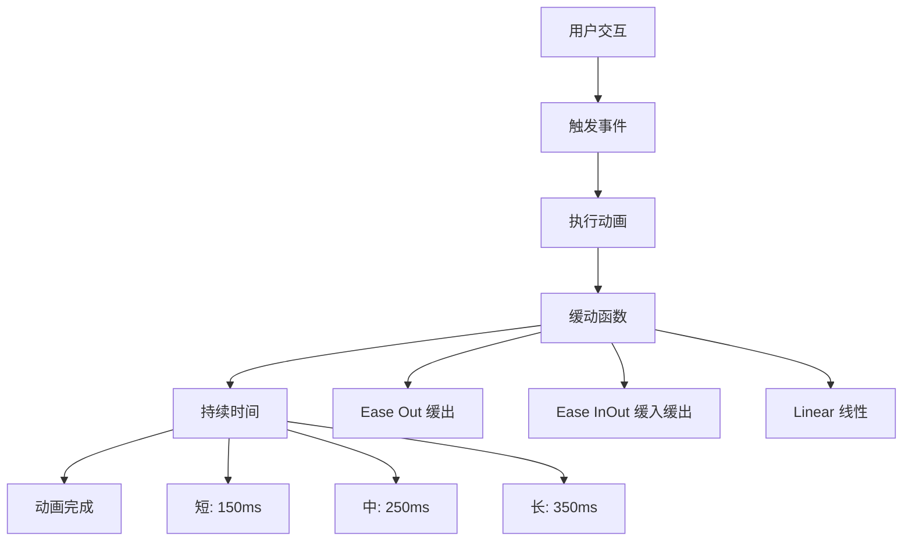

**图表来源**
- [toast.tsx:25-39](file://src/components/ui/toast.tsx#L25-L39)

#### 动画规范

- **按钮悬停**：0.2秒缓出动画
- **模态框显示**：0.3秒缓入缓出
- **标签切换**：0.2秒线性过渡
- **表单验证**：0.15秒快速反馈

**章节来源**
- [toast.tsx:25-39](file://src/components/ui/toast.tsx#L25-L39)

### 焦点管理设计

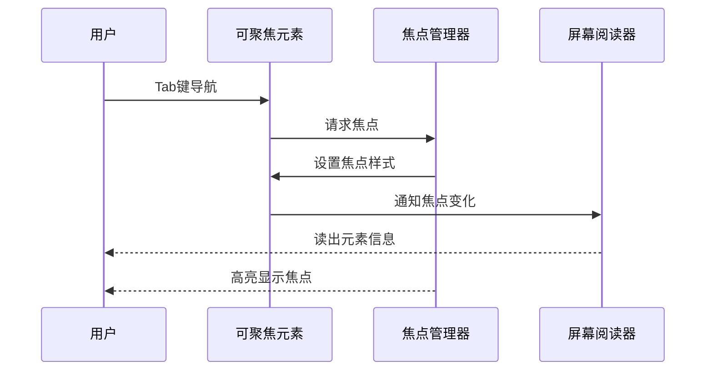

**图表来源**
- [form.tsx:103-114](file://src/components/ui/form.tsx#L103-L114)

#### 焦点可见性

- **焦点环**：蓝色轮廓边框
- **键盘导航**：Tab键顺序导航
- **屏幕阅读**：语音朗读元素名称
- **高对比度**：确保焦点清晰可见

**章节来源**
- [form.tsx:82-114](file://src/components/ui/form.tsx#L82-L114)

### 触摸与手势支持

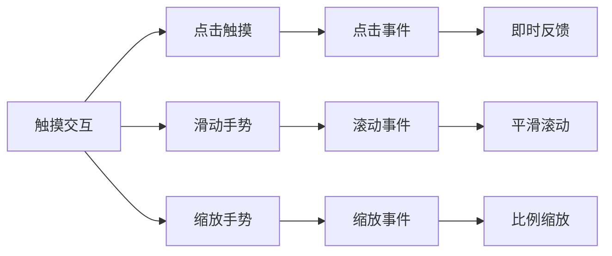

**图表来源**
- [select.tsx:65-89](file://src/components/ui/select.tsx#L65-L89)

#### 移动端适配

- **触摸目标**：最小44px×44px点击区域
- **手势识别**：支持滑动、缩放等手势
- **响应速度**：100ms内的触摸响应
- **方向锁定**：智能的方向锁定机制

**章节来源**
- [select.tsx:65-91](file://src/components/ui/select.tsx#L65-L91)

## 状态管理设计

### 全局状态架构

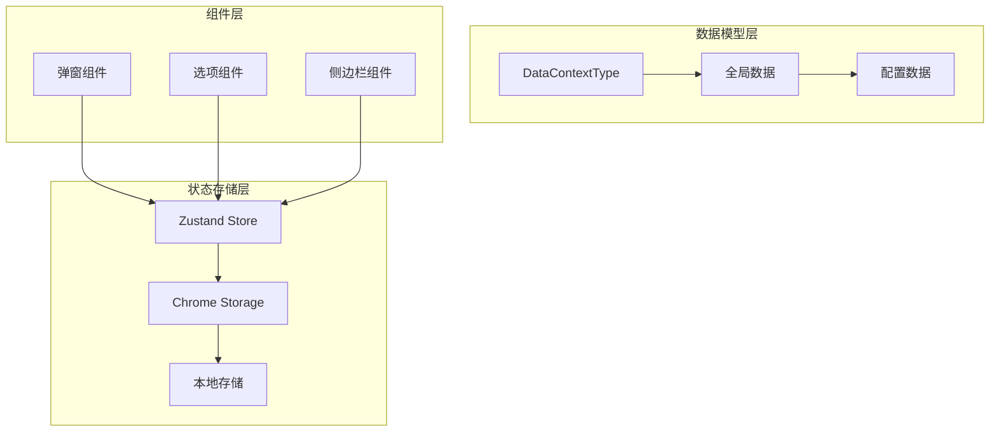

**图表来源**
- [global-data.ts:6-24](file://src/store/global-data.ts#L6-L24)

#### 状态管理模式

- **集中式管理**：所有状态集中在单一store中
- **持久化存储**：自动同步到Chrome存储
- **响应式更新**：状态变更自动触发组件重渲染
- **类型安全**：完整的TypeScript类型定义

**章节来源**
- [global-data.ts:1-28](file://src/store/global-data.ts#L1-L28)

### 数据流设计

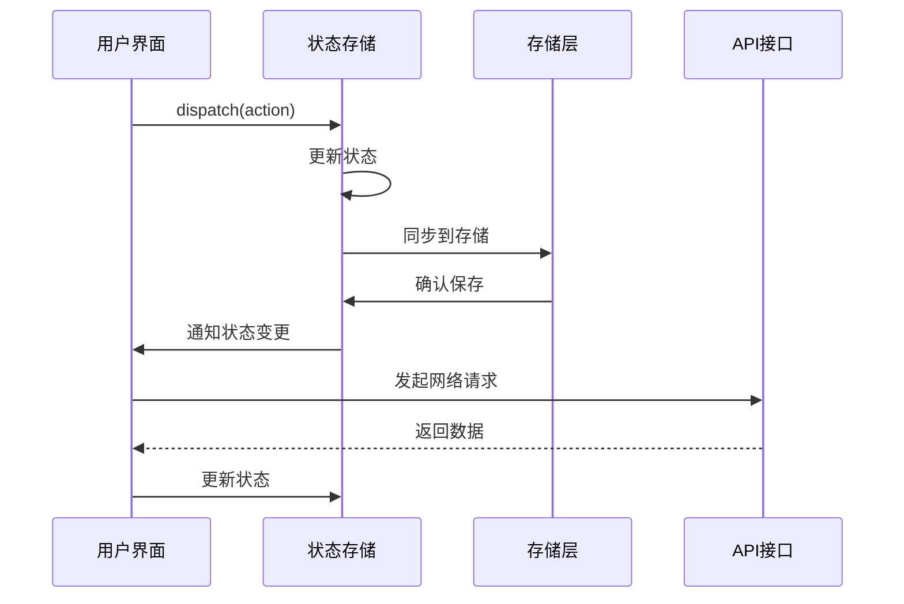

**图表来源**
- [global-data.ts:16-22](file://src/store/global-data.ts#L16-L22)

#### 状态同步机制

- **双向绑定**：UI状态与存储状态双向同步
- **冲突解决**：优先使用最新状态
- **错误恢复**：自动恢复失败的状态更新
- **性能优化**：批量更新减少重渲染

**章节来源**
- [global-data.ts:16-22](file://src/store/global-data.ts#L16-L22)

## 响应式设计策略

### 断点系统设计

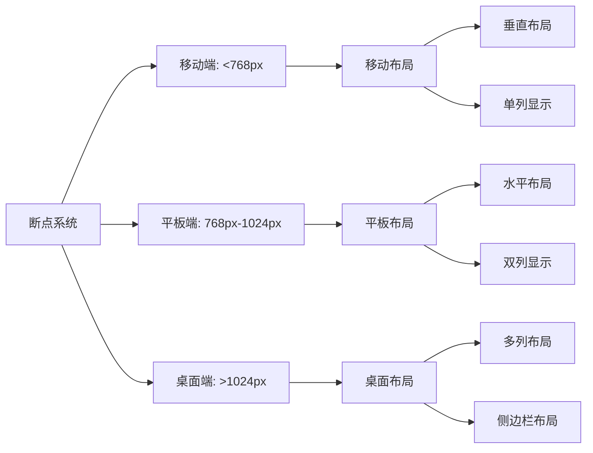

**图表来源**
- [Popup.tsx:24-26](file://src/popup/Popup.tsx#L24-L26)

#### 响应式布局策略

- **移动端优先**：以手机屏幕为基础进行设计
- **弹性布局**：使用Flexbox实现自适应布局
- **网格系统**：基于CSS Grid的响应式网格
- **媒体查询**：精确控制断点切换时机

**章节来源**
- [Popup.tsx:24-26](file://src/popup/Popup.tsx#L24-L26)

### 适配策略

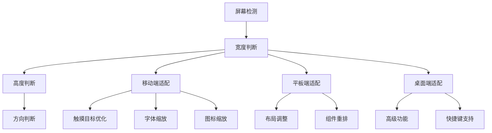

**图表来源**
- [Options.tsx:52-60](file://src/options/Options.tsx#L52-L60)

#### 适配优化

- **触摸友好**：确保所有交互元素易于触摸
- **字体可读性**：在小屏幕上保持良好的可读性
- **组件尺寸**：根据屏幕大小调整组件尺寸
- **导航简化**：在小屏幕上简化导航结构

**章节来源**
- [Options.tsx:52-60](file://src/options/Options.tsx#L52-L60)

## 可访问性设计

### WCAG合规性

设计系统遵循WCAG 2.1 AA标准：

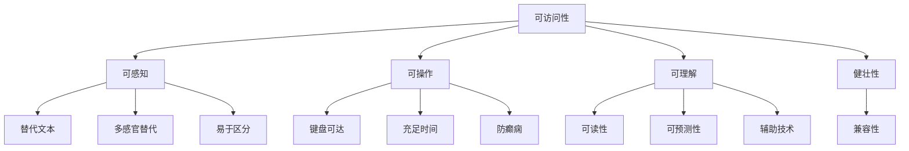

**图表来源**
- [form.tsx:86-96](file://src/components/ui/form.tsx#L86-L96)

#### 可访问性特性

- **键盘导航**：完整的键盘操作支持
- **屏幕阅读**：全面的ARIA标签支持
- **颜色对比**：满足WCAG对比度要求
- **语义标记**：正确的HTML语义结构

**章节来源**
- [form.tsx:86-96](file://src/components/ui/form.tsx#L86-L96)

### 辅助技术支持

```mermaid
sequenceDiagram
participant User as 用户
participant ScreenReader as 屏幕阅读器
participant DOM as DOM树
participant ARIA as ARIA属性
User->>ScreenReader : 启动屏幕阅读器
ScreenReader->>DOM : 读取页面结构
DOM->>ARIA : 获取语义信息
ARIA-->>ScreenReader : 返回可访问性信息
ScreenReader-->>User : 语音播报内容
User->>DOM : 操作界面元素
DOM->>ARIA : 更新状态信息
ARIA-->>ScreenReader : 通知状态变化
ScreenReader-->>User : 更新语音反馈
```

**图表来源**
- [form.tsx:103-114](file://src/components/ui/form.tsx#L103-L114)

#### 辅助技术支持

- **ARIA标签**：为所有交互元素添加ARIA属性
- **语义结构**：使用正确的HTML语义标签
- **动态更新**：实时更新可访问性状态
- **语音反馈**：提供详细的语音描述

**章节来源**
- [form.tsx:103-114](file://src/components/ui/form.tsx#L103-L114)

## 性能优化策略

### 渲染性能优化

设计系统采用多种性能优化技术：

```mermaid
graph TB
Performance[性能优化] --> BundleOptimization[包体积优化]
Performance --> RenderOptimization[渲染优化]
Performance --> MemoryOptimization[内存优化]
Performance --> NetworkOptimization[网络优化]
BundleOptimization --> TreeShaking[Tree Shaking]
BundleOptimization --> CodeSplitting[代码分割]
BundleOptimization --> LazyLoading[懒加载]
RenderOptimization --> ReactMemo[React.memo]
RenderOptimization --> useCallback[useCallback]
RenderOptimization --> useMemo[useMemo]
MemoryOptimization --> GarbageCollection[垃圾回收]
MemoryOptimization --> MemoryLeakPrevention[内存泄漏预防]
NetworkOptimization --> Caching[缓存策略]
NetworkOptimization --> RequestDebouncing[请求去抖]
```

**图表来源**
- [utils.ts:4-6](file://src/lib/utils.ts#L4-L6)

#### 性能监控指标

- **首屏渲染**：小于3秒的初始加载时间
- **交互延迟**：小于50ms的用户操作响应
- **内存使用**：保持稳定的内存占用
- **包体积**：压缩后小于500KB的JS包

**章节来源**
- [utils.ts:1-7](file://src/lib/utils.ts#L1-L7)

### 优化实现策略

```mermaid
flowchart TD
Optimization[性能优化] --> ComponentLevel[组件级优化]
Optimization --> ApplicationLevel[应用级优化]
ComponentLevel --> Memoization[记忆化]
ComponentLevel --> Virtualization[虚拟化]
ComponentLevel --> Debouncing[去抖]
ApplicationLevel --> StateManagement[状态管理优化]
ApplicationLevel --> AssetOptimization[资源优化]
ApplicationLevel --> CachingStrategy[缓存策略]
Memoization --> ReactMemo[React.memo]
Memoization --> useMemo[useMemo]
Memoization --> useCallback[useCallback]
Virtualization --> Windowing[窗口化]
Virtualization --> LazyRendering[懒渲染]
StateManagement --> ZustandOptimization[Zustand优化]
StateManagement --> ChromeStorageOptimization[存储优化]
```

**图表来源**
- [global-data.ts:6-24](file://src/store/global-data.ts#L6-L24)

#### 优化技术栈

- **Zustand优化**：使用immer中间件提高性能
- **Chrome存储优化**：批量更新减少存储操作
- **组件优化**：合理使用React.memo和hooks
- **资源优化**：图片和字体的懒加载策略

**章节来源**
- [global-data.ts:6-24](file://src/store/global-data.ts#L6-L24)

## 总结与最佳实践

### 设计系统优势

本UI/UX设计系统具有以下显著优势：

1. **一致性**：统一的设计语言和交互模式
2. **可扩展性**：模块化的组件架构便于功能扩展
3. **可维护性**：清晰的代码结构和文档规范
4. **性能**：优化的渲染和状态管理策略
5. **可访问性**：全面的无障碍设计支持

### 最佳实践建议

```mermaid
graph TB
BestPractices[最佳实践] --> DesignConsistency[设计一致性]
BestPractices --> ComponentReuse[组件复用]
BestPractices --> PerformanceOptimization[性能优化]
BestPractices --> AccessibilityCompliance[可访问性合规]
DesignConsistency --> DesignTokens[设计令牌]
DesignConsistency --> ComponentLibrary[组件库]
DesignConsistency --> StyleGuide[样式指南]
ComponentReuse --> AtomicDesign[原子设计]
ComponentReuse --> Composition[组合模式]
ComponentReuse --> PropsInterface[属性接口]
PerformanceOptimization --> BundleSize[包体积控制]
PerformanceOptimization --> RenderEfficiency[渲染效率]
PerformanceOptimization --> MemoryManagement[内存管理]
AccessibilityCompliance --> WCAGStandards[WCAG标准]
AccessibilityCompliance --> ScreenReaderSupport[屏幕阅读器支持]
AccessibilityCompliance --> KeyboardNavigation[键盘导航]
```

#### 开发指导原则

- **设计优先**：先设计再开发，确保设计的一致性
- **组件导向**：以组件为中心的开发模式
- **性能意识**：从项目开始就考虑性能影响
- **测试驱动**：编写充分的单元测试和集成测试
- **文档完善**：保持代码和设计文档的同步更新

### 未来发展方向

1. **设计系统演进**：持续优化设计语言和组件库
2. **性能提升**：探索新的优化技术和工具
3. **可访问性增强**：进一步提升无障碍功能
4. **跨平台支持**：扩展到更多平台和设备
5. **智能化功能**：集成AI辅助的设计和开发功能

通过这套完整的UI/UX设计系统，项目实现了高质量的用户体验，为浏览器扩展开发提供了优秀的参考范例。