# UI/UX专业设计系统

<cite>
**本文档引用的文件**
- [src/lib/utils.ts](file://src/lib/utils.ts)
- [tailwind.config.js](file://tailwind.config.js)
- [components.json](file://components.json)
- [src/options/index.css](file://src/options/index.css)
- [src/components/ui/button.tsx](file://src/components/ui/button.tsx)
- [src/components/ui/card.tsx](file://src/components/ui/card.tsx)
- [src/components/ui/form.tsx](file://src/components/ui/form.tsx)
- [src/components/ui/input.tsx](file://src/components/ui/input.tsx)
- [src/components/ui/select.tsx](file://src/components/ui/select.tsx)
- [src/components/ui/badge.tsx](file://src/components/ui/badge.tsx)
- [src/components/ui/progress.tsx](file://src/components/ui/progress.tsx)
- [src/components/ui/toast.tsx](file://src/components/ui/toast.tsx)
- [src/components/ui/toaster.tsx](file://src/components/ui/toaster.tsx)
- [src/components/ui/popover.tsx](file://src/components/ui/popover.tsx)
</cite>

## 目录
1. [简介](#简介)
2. [项目结构](#项目结构)
3. [核心组件](#核心组件)
4. [架构概览](#架构概览)
5. [详细组件分析](#详细组件分析)
6. [依赖关系分析](#依赖关系分析)
7. [性能考虑](#性能考虑)
8. [故障排除指南](#故障排除指南)
9. [结论](#结论)

## 简介

这是一个基于现代前端技术栈构建的专业级浏览器扩展UI/UX设计系统。该系统采用React + TypeScript + TailwindCSS + shadcn/ui的组合，为B站收藏夹管理扩展提供了统一、可维护且具有良好用户体验的设计体系。

设计系统的核心特色包括：
- 基于CSS变量的主题系统，支持明暗模式切换
- 组件化的UI原子设计，确保视觉一致性
- 响应式设计和无障碍访问支持
- 动画和过渡效果增强用户交互体验
- 渐进式Web应用(PWA)特性

## 项目结构

该项目采用了模块化的设计系统架构，主要分为以下几个层次：

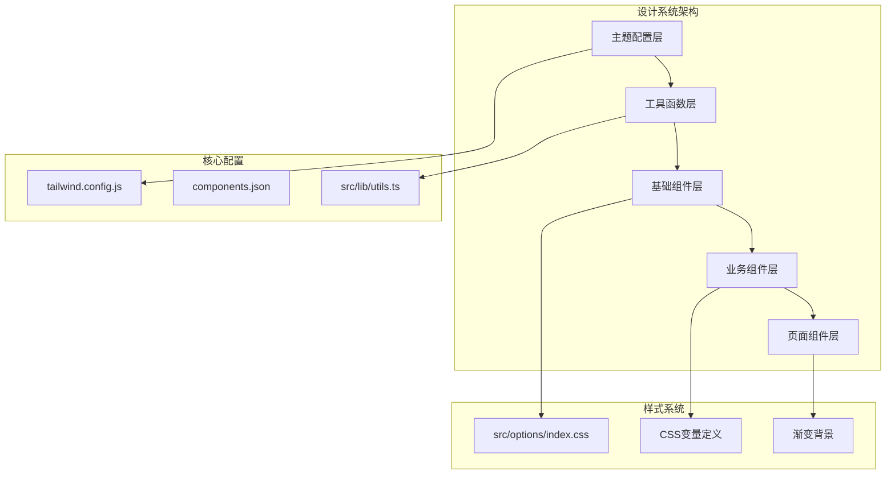

**图表来源**
- [tailwind.config.js:1-118](file://tailwind.config.js#L1-L118)
- [components.json:1-22](file://components.json#L1-L22)
- [src/lib/utils.ts:1-7](file://src/lib/utils.ts#L1-L7)

**章节来源**
- [tailwind.config.js:1-118](file://tailwind.config.js#L1-L118)
- [components.json:1-22](file://components.json#L1-L22)
- [src/options/index.css:1-83](file://src/options/index.css#L1-L83)

## 核心组件

### 主题系统与颜色方案

设计系统采用基于CSS变量的主题架构，支持明暗两种模式：

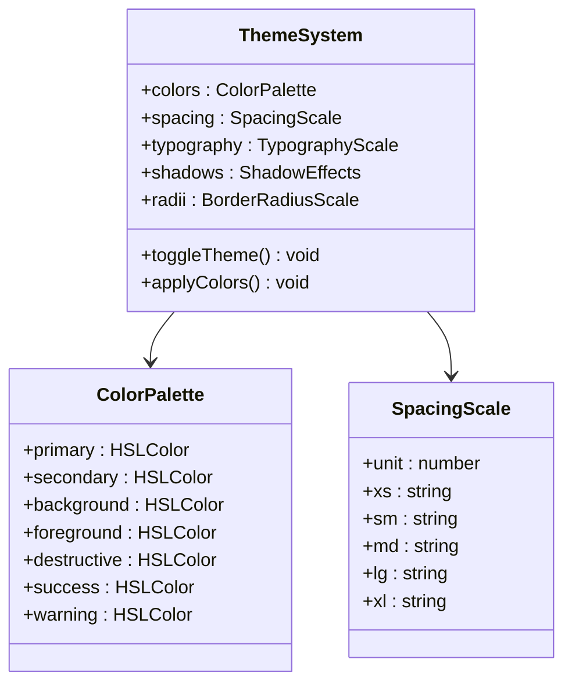

**图表来源**
- [tailwind.config.js:14-62](file://tailwind.config.js#L14-L62)
- [src/options/index.css:6-60](file://src/options/index.css#L6-L60)

### 组件变体系统

所有UI组件都采用CVA(class-variance-authority)模式，提供统一的变体接口：

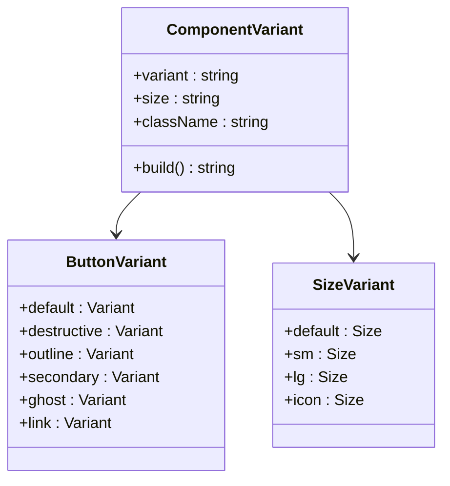

**图表来源**
- [src/components/ui/button.tsx:7-32](file://src/components/ui/button.tsx#L7-L32)

**章节来源**
- [src/lib/utils.ts:1-7](file://src/lib/utils.ts#L1-L7)
- [tailwind.config.js:14-62](file://tailwind.config.js#L14-L62)
- [src/options/index.css:6-60](file://src/options/index.css#L6-L60)

## 架构概览

设计系统的整体架构采用分层模式，确保了良好的可维护性和扩展性：

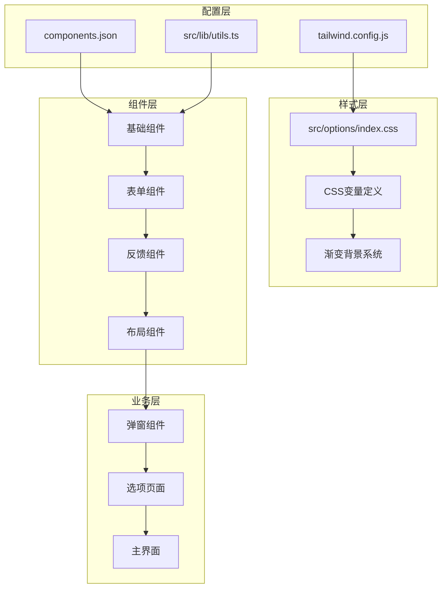

**图表来源**
- [tailwind.config.js:1-118](file://tailwind.config.js#L1-L118)
- [components.json:1-22](file://components.json#L1-L22)
- [src/options/index.css:1-83](file://src/options/index.css#L1-L83)

## 详细组件分析

### 按钮组件系统

按钮组件是设计系统中最核心的交互元素，采用变体模式提供多种状态和尺寸：

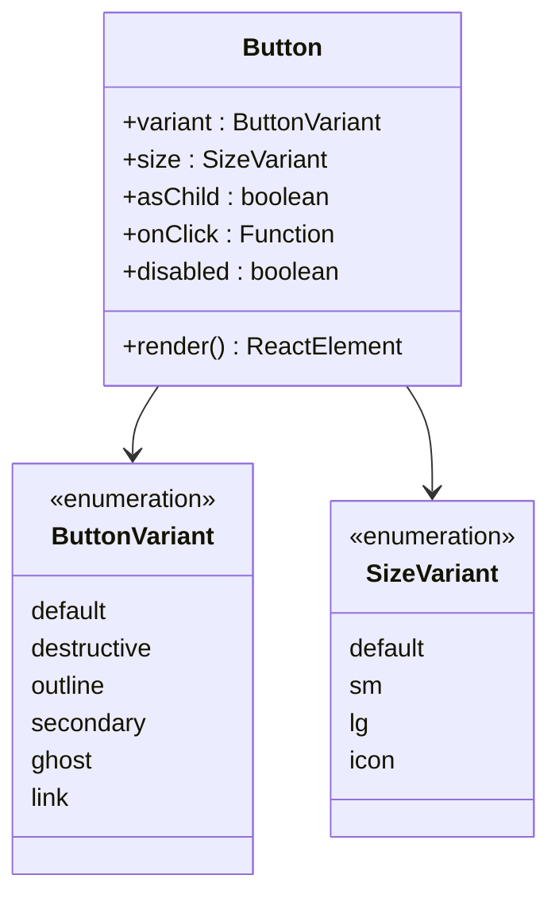

**图表来源**
- [src/components/ui/button.tsx:34-50](file://src/components/ui/button.tsx#L34-L50)

#### 按钮交互流程

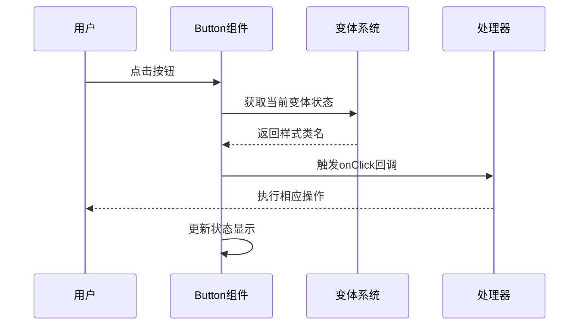

**图表来源**
- [src/components/ui/button.tsx:40-47](file://src/components/ui/button.tsx#L40-L47)

**章节来源**
- [src/components/ui/button.tsx:1-51](file://src/components/ui/button.tsx#L1-L51)

### 卡片组件系统

卡片组件提供内容容器功能，支持标题、描述、内容区域和页脚：

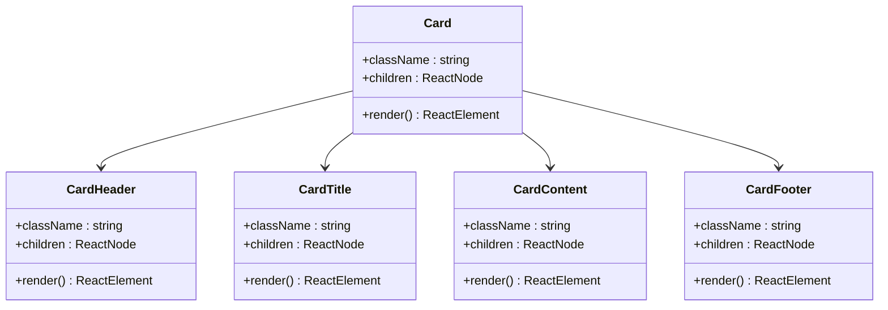

**图表来源**
- [src/components/ui/card.tsx:5-56](file://src/components/ui/card.tsx#L5-L56)

**章节来源**
- [src/components/ui/card.tsx:1-57](file://src/components/ui/card.tsx#L1-L57)

### 表单组件系统

表单组件采用React Hook Form集成，提供完整的表单验证和状态管理：

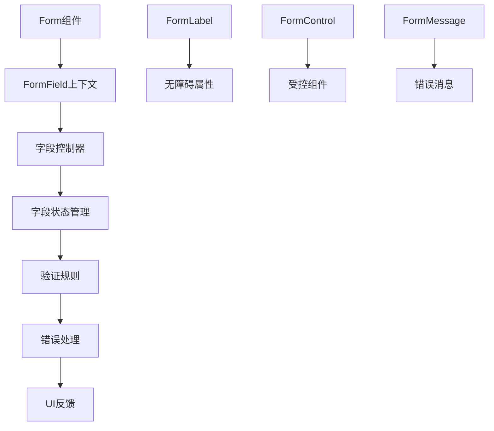

**图表来源**
- [src/components/ui/form.tsx:16-167](file://src/components/ui/form.tsx#L16-L167)

**章节来源**
- [src/components/ui/form.tsx:1-168](file://src/components/ui/form.tsx#L1-L168)

### 输入组件系统

输入组件提供统一的文本输入体验，支持多种类型和状态：

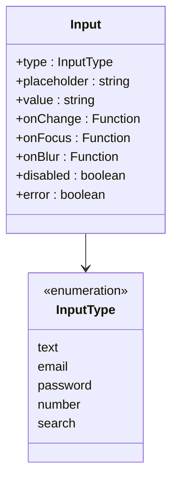

**图表来源**
- [src/components/ui/input.tsx:5-22](file://src/components/ui/input.tsx#L5-L22)

**章节来源**
- [src/components/ui/input.tsx:1-23](file://src/components/ui/input.tsx#L1-L23)

### 下拉选择组件

下拉选择组件提供丰富的选项展示和交互功能：

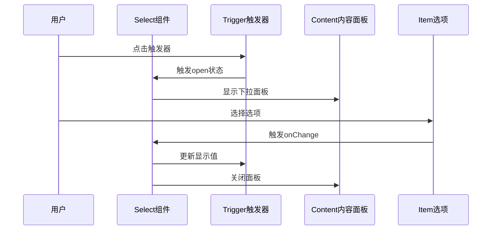

**图表来源**
- [src/components/ui/select.tsx:13-91](file://src/components/ui/select.tsx#L13-L91)

**章节来源**
- [src/components/ui/select.tsx:1-151](file://src/components/ui/select.tsx#L1-L151)

### 进度条组件

进度条组件提供直观的任务完成度指示：

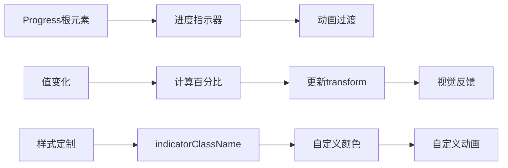

**图表来源**
- [src/components/ui/progress.tsx:6-25](file://src/components/ui/progress.tsx#L6-L25)

**章节来源**
- [src/components/ui/progress.tsx:1-26](file://src/components/ui/progress.tsx#L1-L26)

### 弹出框组件

弹出框组件提供非侵入式的上下文信息展示：

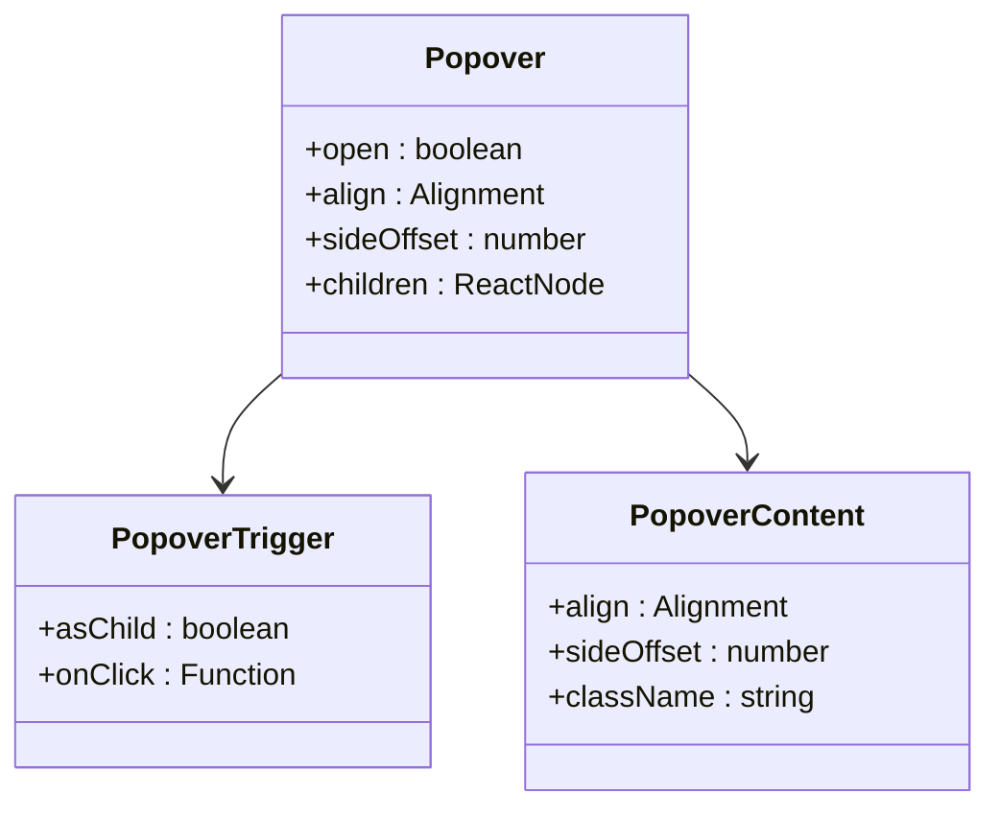

**图表来源**
- [src/components/ui/popover.tsx:5-32](file://src/components/ui/popover.tsx#L5-L32)

**章节来源**
- [src/components/ui/popover.tsx:1-33](file://src/components/ui/popover.tsx#L1-L33)

### 面包屑组件

面包屑组件提供导航层级指示：

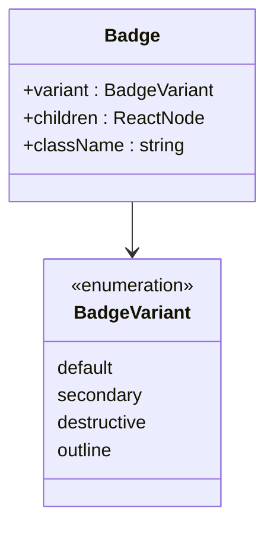

**图表来源**
- [src/components/ui/badge.tsx:25-33](file://src/components/ui/badge.tsx#L25-L33)

**章节来源**
- [src/components/ui/badge.tsx:1-34](file://src/components/ui/badge.tsx#L1-L34)

### 通知系统

通知系统提供用户反馈和状态提示功能：

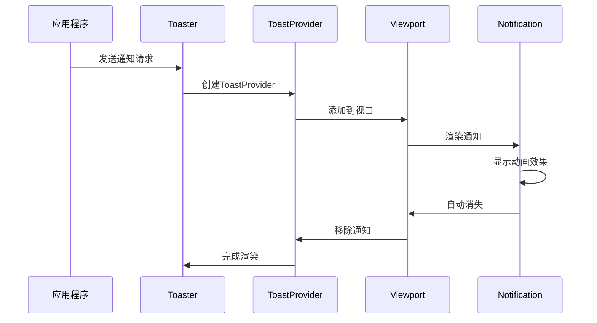

**图表来源**
- [src/components/ui/toaster.tsx:11-31](file://src/components/ui/toaster.tsx#L11-L31)

**章节来源**
- [src/components/ui/toast.tsx:1-127](file://src/components/ui/toast.tsx#L1-L127)
- [src/components/ui/toaster.tsx:1-32](file://src/components/ui/toaster.tsx#L1-L32)

## 依赖关系分析

设计系统的依赖关系清晰明确，遵循单一职责原则：

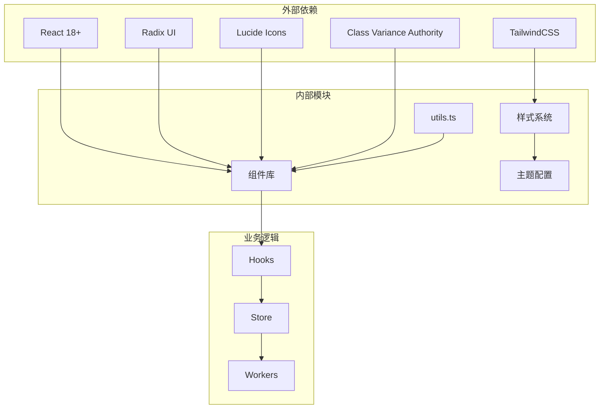

**图表来源**
- [package.json](file://package.json)

**章节来源**
- [src/lib/utils.ts:1-7](file://src/lib/utils.ts#L1-L7)
- [tailwind.config.js:1-118](file://tailwind.config.js#L1-L118)

## 性能考虑

设计系统在性能方面采用了多项优化策略：

### 样式优化
- 使用CSS变量减少重复样式定义
- TailwindCSS按需生成，避免样式冗余
- 组件样式通过CVA动态组合，提高复用性

### 渲染优化
- React.memo化组件减少不必要的重渲染
- 懒加载非关键组件
- 合理的组件拆分和代码分割

### 交互优化
- CSS过渡动画替代JavaScript动画
- 防抖和节流处理高频事件
- 无障碍访问优化提升用户体验

## 故障排除指南

### 常见问题及解决方案

**主题样式不生效**
- 检查CSS变量是否正确编译
- 确认Tailwind配置中的content路径
- 验证暗色模式切换逻辑

**组件样式冲突**
- 检查组件className优先级
- 避免直接内联样式覆盖
- 使用CVA变体系统统一管理

**响应式布局问题**
- 确认断点设置符合设计规范
- 检查媒体查询语法
- 测试不同屏幕尺寸表现

**性能问题排查**
- 使用React DevTools Profiler分析
- 检查组件重渲染次数
- 优化大型列表渲染

**章节来源**
- [src/options/index.css:63-83](file://src/options/index.css#L63-L83)
- [tailwind.config.js:65-116](file://tailwind.config.js#L65-L116)

## 结论

该UI/UX设计系统展现了现代前端开发的最佳实践，通过以下关键特性实现了高质量的用户体验：

### 设计优势
- **一致性**: 统一的颜色、字体、间距和组件行为
- **可扩展性**: 模块化架构支持功能扩展和主题定制
- **可访问性**: 完善的无障碍访问支持
- **性能**: 优化的渲染和资源管理

### 技术亮点
- 基于CSS变量的主题系统
- 组件化的原子设计模式
- 完整的TypeScript类型支持
- 现代化的构建工具链

### 应用价值
该设计系统不仅适用于B站收藏夹管理扩展，还可作为其他浏览器扩展项目的参考模板，为开发者提供了一套完整、可维护且具有良好用户体验的UI解决方案。

通过持续的迭代和优化，这套设计系统将继续为用户提供优秀的视觉和交互体验，同时保持代码的可维护性和扩展性。