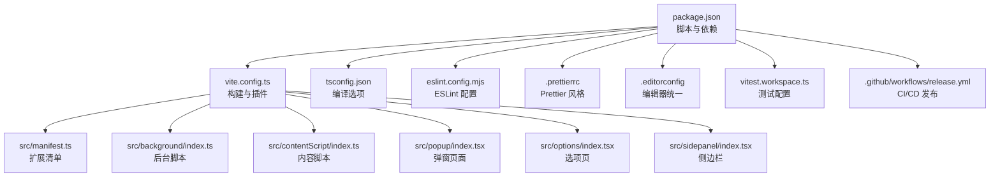
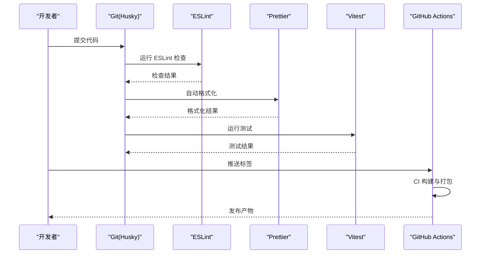
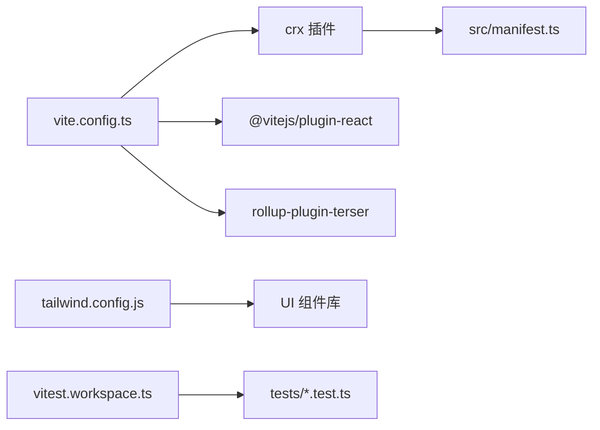

# 代码规范与质量保证

<cite>
**本文引用的文件**
- [eslint.config.mjs](file://eslint.config.mjs)
- [.prettierrc](file://.prettierrc)
- [.editorconfig](file://.editorconfig)
- [package.json](file://package.json)
- [tsconfig.json](file://tsconfig.json)
- [tsconfig.node.json](file://tsconfig.node.json)
- [vite.config.ts](file://vite.config.ts)
- [tailwind.config.js](file://tailwind.config.js)
- [vitest.workspace.ts](file://vitest.workspace.ts)
- [.github/workflows/release.yml](file://.github/workflows/release.yml)
- [src/manifest.ts](file://src/manifest.ts)
- [src/utils/log.ts](file://src/utils/log.ts)
- [tests/ai-stream-parser.test.ts](file://tests/ai-stream-parser.test.ts)
</cite>

## 目录
1. [简介](#简介)
2. [项目结构](#项目结构)
3. [核心组件](#核心组件)
4. [架构总览](#架构总览)
5. [详细组件分析](#详细组件分析)
6. [依赖分析](#依赖分析)
7. [性能考虑](#性能考虑)
8. [故障排查指南](#故障排查指南)
9. [结论](#结论)
10. [附录](#附录)

## 简介
本指南面向“B站收藏夹整理工具”项目的代码规范与质量保证，覆盖以下方面：
- ESLint 配置：规则、插件、忽略项与扩展建议
- Prettier 格式化：风格统一与自动格式化脚本
- Husky Git 钩子：提交前检查与质量门禁
- 代码审查流程与最佳实践
- TypeScript 类型检查配置与错误处理策略
- 维护代码质量与一致性的方法

## 项目结构
该项目采用 Vite + CRXJS 构建 Chrome 扩展，前端为 React 19，使用 TypeScript 编写，配合 Vitest 进行单元测试，并通过 GitHub Actions 自动发布。

图表来源
- [package.json:17-28](file://package.json#L17-L28)
- [vite.config.ts:11-42](file://vite.config.ts#L11-L42)
- [tsconfig.json:1-44](file://tsconfig.json#L1-L44)
- [eslint.config.mjs:4-47](file://eslint.config.mjs#L4-L47)
- [.prettierrc:1-11](file://.prettierrc#L1-L11)
- [.editorconfig:1-27](file://.editorconfig#L1-L27)
- [vitest.workspace.ts:1-15](file://vitest.workspace.ts#L1-L15)
- [.github/workflows/release.yml:1-101](file://.github/workflows/release.yml#L1-L101)
- [src/manifest.ts:1-55](file://src/manifest.ts#L1-L55)

章节来源
- [package.json:17-28](file://package.json#L17-L28)
- [vite.config.ts:11-42](file://vite.config.ts#L11-L42)
- [tsconfig.json:1-44](file://tsconfig.json#L1-L44)
- [eslint.config.mjs:4-47](file://eslint.config.mjs#L4-L47)
- [.prettierrc:1-11](file://.prettierrc#L1-L11)
- [.editorconfig:1-27](file://.editorconfig#L1-L27)
- [vitest.workspace.ts:1-15](file://vitest.workspace.ts#L1-L15)
- [.github/workflows/release.yml:1-101](file://.github/workflows/release.yml#L1-L101)
- [src/manifest.ts:1-55](file://src/manifest.ts#L1-L55)

## 核心组件
- ESLint：仅启用 React Hooks 相关规则，聚焦 Hook 使用与依赖完整性；忽略 node_modules、dist、public、打包产物等目录。
- Prettier：统一单引号、尾随逗号、缩进宽度、换行符等风格；提供批量格式化脚本。
- TypeScript：严格模式开启，模块解析 Node，路径别名 @ 指向 src；无单独自定义 ESLint 规则。
- Vitest：测试环境 jsdom，测试用例覆盖 AI 流解析逻辑。
- Husky：通过 prepare 脚本安装钩子，建议新增 pre-commit 钩子执行 lint 与 format。
- CI/CD：GitHub Actions 在打标签时自动构建、打包并生成发布说明。

章节来源
- [eslint.config.mjs:4-47](file://eslint.config.mjs#L4-L47)
- [.prettierrc:1-11](file://.prettierrc#L1-L11)
- [package.json:17-28](file://package.json#L17-L28)
- [tsconfig.json:14-28](file://tsconfig.json#L14-L28)
- [vitest.workspace.ts:8-12](file://vitest.workspace.ts#L8-L12)
- [tests/ai-stream-parser.test.ts:1-243](file://tests/ai-stream-parser.test.ts#L1-L243)
- [.github/workflows/release.yml:26-38](file://.github/workflows/release.yml#L26-L38)

## 架构总览
下图展示了开发期质量保障的关键流程：本地提交前通过 Husky 钩子触发 ESLint 与 Prettier，随后运行测试；远端通过 GitHub Actions 完成构建与发布。

图表来源
- [package.json:21-27](file://package.json#L21-L27)
- [.github/workflows/release.yml:34-38](file://.github/workflows/release.yml#L34-L38)

章节来源
- [package.json:21-27](file://package.json#L21-L27)
- [.github/workflows/release.yml:34-38](file://.github/workflows/release.yml#L34-L38)

## 详细组件分析

### ESLint 配置与规则
- 忽略项：第三方缓存、构建产物、公共资源、压缩文件、文档与特定目录，确保检查范围聚焦源码。
- 语言选项：使用 TypeScript 解析器，启用 JSX 支持，目标版本为最新模块语法。
- 插件与规则：仅启用 React Hooks 插件，启用两条规则：
  - 规则：强制遵循 Hooks 使用规则（错误级别）
  - 规则：exhaustive-deps（警告级别），提示依赖数组完整性
- 建议增强：
  - 引入 @typescript-eslint/strict-type-checked 或 @typescript-eslint/recommended，提升类型安全
  - 添加 import/no-unresolved、import/order 等规则，约束导入顺序与路径解析
  - 对测试文件与工具函数可单独配置更宽松规则集

章节来源
- [eslint.config.mjs:4-47](file://eslint.config.mjs#L4-L47)

### Prettier 格式化配置
- 单引号、尾随逗号、打印宽度、分号、制表符宽度与换行符统一，确保团队风格一致
- 提供批量格式化脚本，支持 TSX/TS/JSON/CSS/SCSS/Markdown
- 建议：
  - 在 IDE 中启用保存时自动格式化
  - 与 ESLint 的 --fix 结合，形成“检查+修复”的闭环

章节来源
- [.prettierrc:1-11](file://.prettierrc#L1-L11)
- [package.json:23](file://package.json#L23)

### TypeScript 类型检查与错误处理
- 编译选项：严格模式、模块解析 Node、路径别名 @ 指向 src、无 emit 输出用于开发态
- 类型声明：全局版本常量声明，便于运行时判断
- 错误处理策略：
  - 开发期条件性日志：仅在开发环境输出日志，避免生产污染
  - 测试用例覆盖：对 AI 流解析进行边界与异常场景验证，确保健壮性
  - 构建期优化：移除 console 日志，减少生产体积与噪音

章节来源
- [tsconfig.json:14-28](file://tsconfig.json#L14-L28)
- [src/global.d.ts:1-4](file://src/global.d.ts#L1-L4)
- [src/utils/log.ts:1-8](file://src/utils/log.ts#L1-L8)
- [vite.config.ts:21-25](file://vite.config.ts#L21-L25)
- [tests/ai-stream-parser.test.ts:1-243](file://tests/ai-stream-parser.test.ts#L1-L243)

### Husky Git 钩子与质量门禁
- 当前：通过 prepare 脚本安装钩子
- 建议新增 pre-commit 钩子：
  - 执行 ESLint 检查与自动修复
  - 运行 Prettier 格式化
  - 运行 Vitest 测试
  - 仅允许通过的变更进入分支，形成“质量门禁”

章节来源
- [package.json:27](file://package.json#L27)

### 代码审查流程与最佳实践
- 提交前检查：ESLint、Prettier、测试全部通过
- 代码评审要点：
  - Hooks 依赖是否完整（exhaustive-deps 警告需解决）
  - 类型安全：避免 any、合理使用工具类型
  - 可测试性：拆分纯函数、注入副作用、便于单元测试
  - 可维护性：命名清晰、注释必要、避免重复逻辑
- 合并与发布：通过 CI 自动构建与打包，生成发布说明

章节来源
- [eslint.config.mjs:42-45](file://eslint.config.mjs#L42-L45)
- [tests/ai-stream-parser.test.ts:1-243](file://tests/ai-stream-parser.test.ts#L1-L243)
- [.github/workflows/release.yml:44-98](file://.github/workflows/release.yml#L44-L98)

### 测试与覆盖率
- 测试框架：Vitest，环境 jsdom
- 测试范围：AI 流解析、关键字提取、跳过内容判断等
- 覆盖率：提供覆盖率命令，建议在 CI 中启用并设置阈值

章节来源
- [vitest.workspace.ts:8-12](file://vitest.workspace.ts#L8-L12)
- [package.json:25](file://package.json#L25)
- [tests/ai-stream-parser.test.ts:1-243](file://tests/ai-stream-parser.test.ts#L1-L243)

### 构建与发布
- 构建：先 tsc 再 vite build，移除 console 日志
- 清单：CRXJS 动态生成 Manifest，声明权限与主机权限
- 发布：GitHub Actions 在打标签时构建、打包并生成发布说明

章节来源
- [package.json:19](file://package.json#L19)
- [vite.config.ts:13-27](file://vite.config.ts#L13-L27)
- [src/manifest.ts:1-55](file://src/manifest.ts#L1-L55)
- [.github/workflows/release.yml:34-98](file://.github/workflows/release.yml#L34-L98)

## 依赖分析
- 开发依赖：ESLint、Prettier、Husky、Vitest、React 编译器、Terser 等
- 运行时依赖：React 19、Radix UI、Tailwind、Zustand、OpenAI SDK 等
- 依赖关系：Vite 作为构建核心，CRXJS 注入 Manifest，Tailwind 提供样式基础

图表来源
- [vite.config.ts:34-41](file://vite.config.ts#L34-L41)
- [src/manifest.ts:1-55](file://src/manifest.ts#L1-L55)
- [tailwind.config.js:1-118](file://tailwind.config.js#L1-L118)
- [vitest.workspace.ts:3-14](file://vitest.workspace.ts#L3-L14)

章节来源
- [package.json:59-89](file://package.json#L59-L89)
- [vite.config.ts:34-41](file://vite.config.ts#L34-L41)
- [tailwind.config.js:1-118](file://tailwind.config.js#L1-L118)
- [vitest.workspace.ts:3-14](file://vitest.workspace.ts#L3-L14)

## 性能考虑
- 构建期移除 console 日志，降低包体积与运行时开销
- 使用 React Compiler 优化渲染性能
- Tailwind 按需引入与滚动条样式优化，减少不必要的重绘
- 测试在 jsdom 环境运行，提高测试速度

章节来源
- [vite.config.ts:21-25](file://vite.config.ts#L21-L25)
- [vite.config.ts:37-40](file://vite.config.ts#L37-L40)
- [tailwind.config.js:66-116](file://tailwind.config.js#L66-L116)

## 故障排查指南
- ESLint 报错
  - 检查是否遗漏了必要的忽略项或规则
  - 使用 --fix 自动修复可修复问题
- Prettier 格式化冲突
  - 确保 IDE 保存时调用 Prettier
  - 使用批量格式化脚本统一风格
- 测试失败
  - 查看测试用例覆盖的边界与异常场景
  - 针对 AI 流解析的缓冲区拼接与分片场景进行复现
- 构建失败
  - 确认 TypeScript 编译通过后再执行 vite build
  - 检查 Terser 是否移除了必要的日志或变量

章节来源
- [eslint.config.mjs:4-47](file://eslint.config.mjs#L4-L47)
- [package.json:21-23](file://package.json#L21-L23)
- [tests/ai-stream-parser.test.ts:124-242](file://tests/ai-stream-parser.test.ts#L124-L242)
- [vite.config.ts:13-27](file://vite.config.ts#L13-L27)

## 结论
本项目在质量保障方面具备良好的基础：严格的 TypeScript 配置、轻量的 ESLint 规则、统一的 Prettier 风格、完善的 Vitest 测试与自动化发布流程。建议进一步完善 ESLint 规则集、补充 Husky pre-commit 钩子、在 CI 中启用覆盖率阈值，以持续提升代码质量与一致性。

## 附录
- 版本与清单：扩展版本与图标、权限、主机权限均在清单中集中管理
- 开发环境：全局版本常量与条件日志，便于区分开发与生产行为

章节来源
- [src/manifest.ts:8-54](file://src/manifest.ts#L8-L54)
- [src/global.d.ts:1-4](file://src/global.d.ts#L1-L4)
- [src/utils/log.ts:1-8](file://src/utils/log.ts#L1-L8)