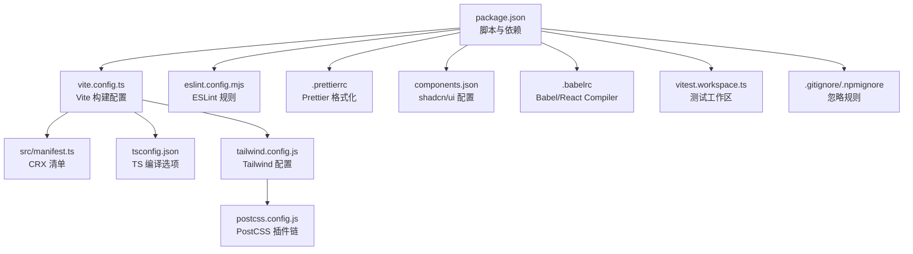
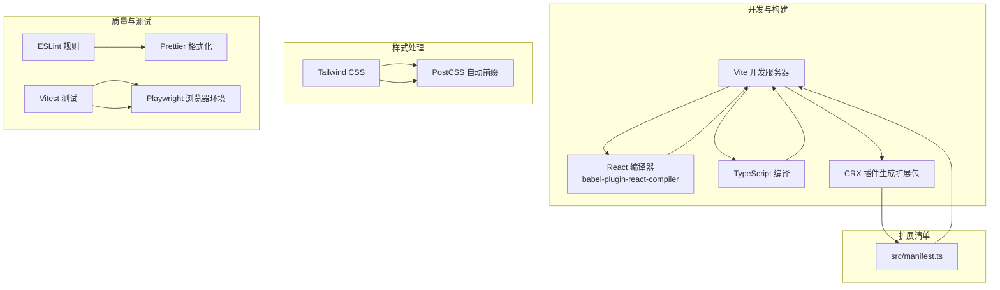
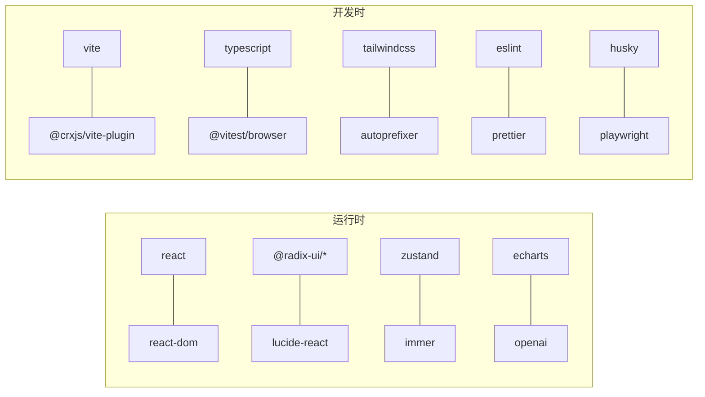

# 开发指南

<cite>
**本文引用的文件**
- [package.json](file://package.json)
- [vite.config.ts](file://vite.config.ts)
- [tsconfig.json](file://tsconfig.json)
- [tsconfig.node.json](file://tsconfig.node.json)
- [tailwind.config.js](file://tailwind.config.js)
- [postcss.config.js](file://postcss.config.js)
- [.prettierrc](file://.prettierrc)
- [eslint.config.mjs](file://eslint.config.mjs)
- [components.json](file://components.json)
- [.babelrc](file://.babelrc)
- [src/manifest.ts](file://src/manifest.ts)
- [vitest.workspace.ts](file://vitest.workspace.ts)
- [.gitignore](file://.gitignore)
- [.npmignore](file://.npmignore)
- [README.md](file://README.md)
</cite>

## 目录
1. [简介](#简介)
2. [项目结构](#项目结构)
3. [核心组件](#核心组件)
4. [架构总览](#架构总览)
5. [详细组件分析](#详细组件分析)
6. [依赖分析](#依赖分析)
7. [性能考虑](#性能考虑)
8. [故障排查指南](#故障排查指南)
9. [结论](#结论)
10. [附录](#附录)

## 简介
本指南面向希望参与“B站收藏夹整理工具”开发的工程师与维护者，覆盖开发环境搭建、构建配置、代码规范与质量保障、测试策略、调试技巧、性能优化与发布流程。项目基于 Vite + React + TypeScript 构建 Chrome Extension，采用 Tailwind CSS 进行样式处理，并通过 CRX 插件生成可安装的扩展包。

## 项目结构
项目采用模块化组织，核心目录与职责如下：
- src：源代码根目录，包含 background、contentScript、popup、sidepanel、components、hooks、store、utils、workers 等模块
- public/assets/icons/img：公共资源与图标
- tests：单元测试与集成测试用例
- 配置文件：vite.config.ts、tsconfig.json、tailwind.config.js、postcss.config.js、eslint.config.mjs、.prettierrc、components.json、.babelrc 等
- 根级脚本：package.json 中定义了开发、构建、预览、打包、格式化、测试、覆盖率与压缩等命令

图示来源
- [package.json:1-91](file://package.json#L1-L91)
- [vite.config.ts:1-44](file://vite.config.ts#L1-L44)
- [tsconfig.json:1-44](file://tsconfig.json#L1-L44)
- [tailwind.config.js:1-118](file://tailwind.config.js#L1-L118)
- [postcss.config.js:1-7](file://postcss.config.js#L1-L7)
- [eslint.config.mjs:1-48](file://eslint.config.mjs#L1-L48)
- [.prettierrc:1-11](file://.prettierrc#L1-L11)
- [components.json:1-22](file://components.json#L1-L22)
- [.babelrc:1-5](file://.babelrc#L1-L5)
- [vitest.workspace.ts:1-15](file://vitest.workspace.ts#L1-L15)
- [.gitignore:1-28](file://.gitignore#L1-L28)
- [.npmignore:1-27](file://.npmignore#L1-L27)

章节来源
- [package.json:1-91](file://package.json#L1-L91)
- [README.md:1-188](file://README.md#L1-L188)

## 核心组件
- 构建系统：Vite + CRX 插件，支持 React 编译与生产环境压缩
- 类型系统：TypeScript，严格模式与路径别名配置
- 样式系统：Tailwind CSS + PostCSS 自动前缀
- 质量体系：ESLint + Prettier + Husky（Git 钩子）
- 测试体系：Vitest + Playwright 浏览器环境
- 扩展清单：src/manifest.ts 动态生成 Manifest V3

章节来源
- [vite.config.ts:1-44](file://vite.config.ts#L1-L44)
- [tsconfig.json:1-44](file://tsconfig.json#L1-L44)
- [tailwind.config.js:1-118](file://tailwind.config.js#L1-L118)
- [postcss.config.js:1-7](file://postcss.config.js#L1-L7)
- [eslint.config.mjs:1-48](file://eslint.config.mjs#L1-L48)
- [.prettierrc:1-11](file://.prettierrc#L1-L11)
- [components.json:1-22](file://components.json#L1-L22)
- [.babelrc:1-5](file://.babelrc#L1-L5)
- [vitest.workspace.ts:1-15](file://vitest.workspace.ts#L1-L15)
- [src/manifest.ts:1-55](file://src/manifest.ts#L1-L55)

## 架构总览
下图展示了开发与构建的关键交互：开发时由 Vite 启动，TypeScript 与 React 编译器参与编译；构建阶段通过 CRX 插件生成扩展清单与资源；Tailwind 与 PostCSS 处理样式；测试通过 Vitest 与 Playwright 执行。

图示来源
- [vite.config.ts:1-44](file://vite.config.ts#L1-L44)
- [.babelrc:1-5](file://.babelrc#L1-L5)
- [tsconfig.json:1-44](file://tsconfig.json#L1-L44)
- [src/manifest.ts:1-55](file://src/manifest.ts#L1-L55)
- [tailwind.config.js:1-118](file://tailwind.config.js#L1-L118)
- [postcss.config.js:1-7](file://postcss.config.js#L1-L7)
- [eslint.config.mjs:1-48](file://eslint.config.mjs#L1-L48)
- [vitest.workspace.ts:1-15](file://vitest.workspace.ts#L1-L15)

## 详细组件分析

### 构建配置（Vite + CRX）
- 构建输出：清空输出目录、产物目录 build、Rollup 输出命名规则
- 生产压缩：启用 terser 去除 console
- 路径别名：@ 指向 src
- 插件链：CRX 插件注入清单、React 插件配合 babel-plugin-react-compiler
- 开发模式：NODE_ENV 控制清单名称后缀

章节来源
- [vite.config.ts:11-44](file://vite.config.ts#L11-L44)
- [src/manifest.ts:6-10](file://src/manifest.ts#L6-L10)

### TypeScript 编译配置
- 目标与模块：ESNext、ESNext 模块解析
- 严格模式：开启严格类型检查
- JSX：react-jsx
- 路径映射：@/* -> ./src/*
- 类型声明：包含 react、react-dom、chrome、playwright 浏览器 provider
- 引用：tsconfig.node.json

章节来源
- [tsconfig.json:2-33](file://tsconfig.json#L2-L33)
- [tsconfig.node.json:1-11](file://tsconfig.node.json#L1-L11)

### 样式与主题（Tailwind CSS）
- 内容扫描：扫描根目录 HTML 与 src 下 TSX/TS/JXS/JS
- 深色模式：基于 class 的 darkMode
- 主题扩展：圆角、颜色体系、图表色板、B站品牌色
- 插件：tailwindcss-animate 与自定义滚动条样式工具类
- PostCSS：tailwindcss + autoprefixer

章节来源
- [tailwind.config.js:4-118](file://tailwind.config.js#L4-L118)
- [postcss.config.js:1-7](file://postcss.config.js#L1-L7)

### 代码规范与质量保障
- ESLint：基于 eslint.config.mjs，使用 TypeScript 解析器，启用 react-hooks 规则集
- Prettier：统一缩进、引号、尾随逗号、换行符宽度等
- Git 钩子：husky 通过 prepare 脚本安装，结合 lint-staged 可在提交前校验
- shadcn/ui：components.json 统一风格与别名，便于组件复用

章节来源
- [eslint.config.mjs:1-48](file://eslint.config.mjs#L1-L48)
- [.prettierrc:1-11](file://.prettierrc#L1-L11)
- [package.json:27](file://package.json#L27)
- [components.json:1-22](file://components.json#L1-L22)

### 测试策略与编写指南
- 测试运行：Vitest 工作区配置，包含 tests 目录，使用 jsdom 环境
- 浏览器测试：通过 @vitest/browser 与 Playwright 驱动
- 覆盖率：使用 coverage 命令生成报告
- 最佳实践：按功能拆分测试文件、优先测试业务逻辑与边界条件、对异步流程进行时序断言

章节来源
- [vitest.workspace.ts:1-15](file://vitest.workspace.ts#L1-L15)
- [package.json:25-26](file://package.json#L25-L26)

### 扩展清单与权限
- 清单生成：src/manifest.ts 使用 @crxjs/vite-plugin 定义扩展元数据
- 权限：storage、tabs、sidePanel
- 主机权限：OpenAI 与部分服务域名
- 资源暴露：web_accessible_resources 暴露图标资源
- 页面：action 默认弹窗、options_ui、side_panel

章节来源
- [src/manifest.ts:1-55](file://src/manifest.ts#L1-L55)

### 调试技巧与开发工具
- 开发服务器：vite 命令启动，支持热更新
- React 编译器：babel-plugin-react-compiler 提升渲染性能
- 浏览器调试：通过 Chrome 扩展页面加载开发版，检查 Console、Network、Storage
- 日志与消息：utils/log.ts 与 utils/message.ts 提供日志与跨组件通信能力

章节来源
- [package.json:17-20](file://package.json#L17-L20)
- [.babelrc:1-5](file://.babelrc#L1-L5)
- [src/manifest.ts:19-53](file://src/manifest.ts#L19-L53)

### 性能优化建议
- 构建期优化：启用 terser 去除 console，合理拆分代码块
- 样式体积：Tailwind 按需引入与 purge 内容配置，避免无用样式
- 组件渲染：利用 React Compiler 与 useMemo/useCallback 减少重渲染
- 数据缓存：合理使用 IndexedDB 与 Chrome Storage 缓存策略，降低重复请求
- 图片与资源：压缩静态资源，延迟加载非关键资源

章节来源
- [vite.config.ts:20-26](file://vite.config.ts#L20-L26)
- [tailwind.config.js:6](file://tailwind.config.js#L6)

### 发布流程说明
- 本地构建：先 tsc 再 vite build
- 打包压缩：通过 src/zip.js 将 build 产物打包为 .zip
- 版本管理：package.json 中 version 字段控制扩展版本
- 清单与权限：确保 src/manifest.ts 中权限与资源配置正确
- 预览与验证：vite preview 本地验证扩展功能

章节来源
- [package.json:19-24](file://package.json#L19-L24)
- [src/manifest.ts:1-55](file://src/manifest.ts#L1-L55)

## 依赖分析
- 运行时依赖：React 19、Radix UI 组件库、Tailwind 相关工具、OpenAI SDK、Zustand 状态管理、ECharts 可视化等
- 开发依赖：Vite、TypeScript、Tailwind CSS、ESLint、Prettier、Husky、Vitest、Playwright、Terser、@crxjs/vite-plugin 等
- 包管理器：pnpm，引擎要求 Node >= 14.18.0

图示来源
- [package.json:29-89](file://package.json#L29-L89)

章节来源
- [package.json:13-16](file://package.json#L13-L16)
- [package.json:29-89](file://package.json#L29-L89)

## 性能考虑
- 构建体积：通过 terser 去除 console，合理 chunk 命名，避免重复依赖
- 样式体积：Tailwind content 范围精确扫描，减少未使用类名
- 组件渲染：React Compiler 与 React.memo 结合，减少无效渲染
- 数据层：IndexedDB 与 Chrome Storage 缓存策略，避免频繁网络请求
- 资源加载：图片与动画资源按需加载，避免阻塞主线程

章节来源
- [vite.config.ts:16-26](file://vite.config.ts#L16-L26)
- [tailwind.config.js:6](file://tailwind.config.js#L6)

## 故障排查指南
- 构建失败：检查 tsconfig 严格模式与路径别名是否生效；确认 Vite 插件顺序与 CRX 清单生成
- 样式异常：确认 Tailwind content 扫描范围与 PostCSS 插件链；检查组件是否使用正确的工具类
- 测试报错：确认 vitest 工作区配置与 jsdom 环境；检查测试文件命名与导入路径
- 扩展无法加载：核对 src/manifest.ts 中权限、主机权限与资源暴露；在 chrome://extensions 加载开发版并开启“开发者模式”
- Git 钩子失效：执行 npm run prepare 或 pnpm prepare 安装 husky；确认 pre-commit 脚本配置

章节来源
- [vite.config.ts:34-42](file://vite.config.ts#L34-L42)
- [tailwind.config.js:6](file://tailwind.config.js#L6)
- [vitest.workspace.ts:8-12](file://vitest.workspace.ts#L8-L12)
- [src/manifest.ts:39-53](file://src/manifest.ts#L39-L53)
- [package.json:27](file://package.json#L27)

## 结论
本指南提供了从环境搭建到发布上线的完整开发路径，涵盖构建、样式、质量、测试、性能与发布等关键环节。建议团队在日常协作中坚持 ESLint + Prettier + Husky 的质量基线，以 Vitest + Playwright 保障核心功能稳定性，并持续优化构建与样式体积，确保扩展在生产环境具备良好的性能与可维护性。

## 附录

### 开发环境搭建步骤
- 安装 Node.js（版本满足 engines 要求）与 pnpm
- 克隆仓库后安装依赖
- 启动开发服务器进行调试
- 使用 VS Code 并安装推荐扩展（ESLint、Prettier、Tailwind CSS）

章节来源
- [package.json:13-16](file://package.json#L13-L16)
- [package.json:17](file://package.json#L17)
- [README.md:82-96](file://README.md#L82-L96)

### 常用脚本说明
- dev：启动 Vite 开发服务器
- build：TypeScript 编译后构建扩展
- preview：本地预览构建产物
- lint/lint:fix：ESLint 检查与修复
- fmt：Prettier 统一格式
- zip：构建后打包为 .zip
- coverage/test:browser：覆盖率与浏览器测试
- prepare：安装 Husky 钩子

章节来源
- [package.json:17-27](file://package.json#L17-L27)