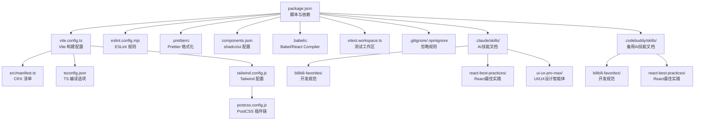
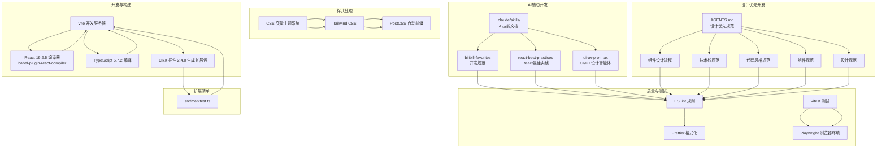
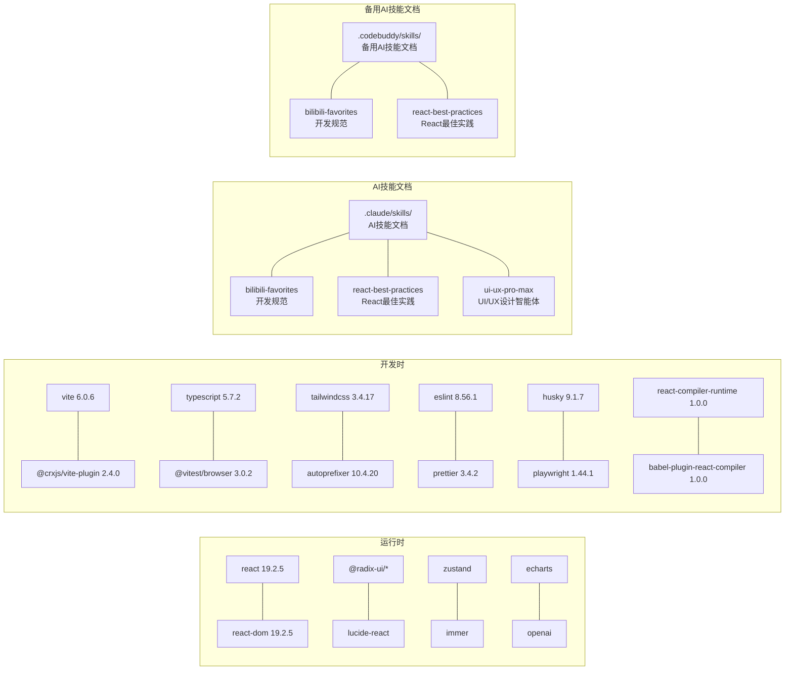

# 开发指南

<cite>
**本文档引用的文件**
- [package.json](file://package.json)
- [vite.config.ts](file://vite.config.ts)
- [tsconfig.json](file://tsconfig.json)
- [tsconfig.node.json](file://tsconfig.node.json)
- [tailwind.config.js](file://tailwind.config.js)
- [postcss.config.js](file://postcss.config.js)
- [.prettierrc](file://.prettierrc)
- [eslint.config.mjs](file://eslint.config.mjs)
- [components.json](file://components.json)
- [.babelrc](file://.babelrc)
- [src/manifest.ts](file://src/manifest.ts)
- [vitest.workspace.ts](file://vitest.workspace.ts)
- [.gitignore](file://.gitignore)
- [.npmignore](file://.npmignore)
- [README.md](file://README.md)
- [src/popup/index.css](file://src/popup/index.css)
- [src/options/index.css](file://src/options/index.css)
- [src/sidepanel/index.css](file://src/sidepanel/index.css)
- [src/popup/index.tsx](file://src/popup/index.tsx)
- [src/popup/Popup.tsx](file://src/popup/Popup.tsx)
- [src/lib/utils.ts](file://src/lib/utils.ts)
- [popup.html](file://popup.html)
- [options.html](file://options.html)
- [sidepanel.html](file://sidepanel.html)
- [.claude/skills/bilibili-favorites/SKILL.md](file://.claude/skills/bilibili-favorites/SKILL.md)
- [.claude/skills/react-best-practices/SKILL.md](file://.claude/skills/react-best-practices/SKILL.md)
- [.claude/skills/ui-ux-pro-max/SKILL.md](file://.claude/skills/ui-ux-pro-max/SKILL.md)
- [.claude/settings.local.json](file://.claude/settings.local.json)
- [AGENTS.md](file://AGENTS.md)
- [.codebuddy/skills/bilibili-favorites/AGENTS.md](file://.codebuddy/skills/bilibili-favorites/AGENTS.md)
- [.codebuddy/skills/react-best-practices/AGENTS.md](file://.codebuddy/skills/react-best-practices/AGENTS.md)
</cite>

## 更新摘要
**所做更改**
- 新增AGENTS.md开发规范文档，建立设计优先的开发实践体系
- 更新.clause AI技能文档体系，包含B站收藏夹开发规范、React最佳实践和UI/UX设计智能体
- 新增.codebuddy技能文档支持，提供更全面的开发规范指导
- 更新开发标准以反映新的AI辅助开发工作流

## 目录
1. [简介](#简介)
2. [项目结构](#项目结构)
3. [核心组件](#核心组件)
4. [架构总览](#架构总览)
5. [详细组件分析](#详细组件分析)
6. [依赖分析](#依赖分析)
7. [性能考虑](#性能考虑)
8. [故障排查指南](#故障排查指南)
9. [结论](#结论)
10. [附录](#附录)

## 简介
本指南面向希望参与"B站收藏夹整理工具"开发的工程师与维护者，覆盖开发环境搭建、构建配置、代码规范与质量保障、测试策略、调试技巧、性能优化与发布流程。项目基于 Vite + React 19.2.5 + TypeScript 构建 Chrome Extension，采用 Tailwind CSS 进行样式处理，并通过 CRX 插件生成可安装的扩展包。

**重大更新** 项目现已集成.clause AI技能文档体系，提供开发规范、React最佳实践和UI/UX设计指导，替代传统的.codebuddy规则文件。同时新增AGENTS.md开发规范文档，建立设计优先的开发实践体系。

## 项目结构
项目采用模块化组织，核心目录与职责如下：
- src：源代码根目录，包含 background、contentScript、popup、sidepanel、components、hooks、store、utils、workers 等模块
- public/assets/icons/img：公共资源与图标
- tests：单元测试与集成测试用例
- 配置文件：vite.config.ts、tsconfig.json、tailwind.config.js、postcss.config.js、eslint.config.mjs、.prettierrc、components.json、.babelrc 等
- 根级脚本：package.json 中定义了开发、构建、预览、打包、格式化、测试、覆盖率与压缩等命令
- .claude/skills：新的AI技能文档体系，包含开发规范、React最佳实践和UI/UX设计指导
- .codebuddy/skills：备用的AI技能文档体系，提供额外的开发规范支持



**图示来源**
- [package.json:1-96](file://package.json#L1-L96)
- [vite.config.ts:1-45](file://vite.config.ts#L1-L45)
- [tsconfig.json:1-47](file://tsconfig.json#L1-L47)
- [tailwind.config.js:1-118](file://tailwind.config.js#L1-L118)
- [postcss.config.js:1-7](file://postcss.config.js#L1-L7)
- [eslint.config.mjs:1-48](file://eslint.config.mjs#L1-L48)
- [.prettierrc:1-11](file://.prettierrc#L1-L11)
- [components.json:1-22](file://components.json#L1-L22)
- [.babelrc:1-5](file://.babelrc#L1-L5)
- [vitest.workspace.ts:1-15](file://vitest.workspace.ts#L1-L15)
- [.gitignore:1-28](file://.gitignore#L1-L28)
- [.npmignore:1-27](file://.npmignore#L1-L27)
- [.claude/skills/bilibili-favorites/SKILL.md:1-35](file://.claude/skills/bilibili-favorites/SKILL.md#L1-L35)
- [.claude/skills/react-best-practices/SKILL.md:1-137](file://.claude/skills/react-best-practices/SKILL.md#L1-L137)
- [.claude/skills/ui-ux-pro-max/SKILL.md:1-378](file://.claude/skills/ui-ux-pro-max/SKILL.md#L1-L378)

**章节来源**
- [package.json:1-96](file://package.json#L1-L96)
- [README.md:1-188](file://README.md#L1-L188)

## 核心组件
- 构建系统：Vite + CRX 插件，支持 React 19.2.5 编译与生产环境压缩
- 类型系统：TypeScript 5.7.2，严格模式与路径别名配置
- 样式系统：Tailwind CSS + PostCSS 自动前缀，基于 CSS 变量的主题系统
- 质量体系：ESLint + Prettier + Husky（Git 钩子），集成.clause AI技能文档
- 测试体系：Vitest + Playwright 浏览器环境
- 扩展清单：src/manifest.ts 动态生成 Manifest V3
- AI辅助开发：.claude/skills 目录下的技能文档，提供开发规范和最佳实践指导
- **新增** 设计优先开发规范：AGENTS.md 提供组件开发前必须先设计的设计优先实践

**重大更新** 新增AGENTS.md开发规范文档，建立设计优先的开发实践体系，要求在编写任何新组件或大幅重构现有组件之前，必须先使用 ui-ux-pro-max 技能进行页面/组件设计。

**章节来源**
- [vite.config.ts:1-45](file://vite.config.ts#L1-L45)
- [tsconfig.json:1-47](file://tsconfig.json#L1-L47)
- [tailwind.config.js:1-118](file://tailwind.config.js#L1-L118)
- [postcss.config.js:1-7](file://postcss.config.js#L1-L7)
- [eslint.config.mjs:1-48](file://eslint.config.mjs#L1-L48)
- [.prettierrc:1-11](file://.prettierrc#L1-L11)
- [components.json:1-22](file://components.json#L1-L22)
- [.babelrc:1-5](file://.babelrc#L1-L5)
- [vitest.workspace.ts:1-15](file://vitest.workspace.ts#L1-L15)
- [src/manifest.ts:1-55](file://src/manifest.ts#L1-L55)
- [.claude/skills/bilibili-favorites/SKILL.md:1-35](file://.claude/skills/bilibili-favorites/SKILL.md#L1-L35)
- [AGENTS.md:1-61](file://AGENTS.md#L1-L61)

## 架构总览
下图展示了开发与构建的关键交互：开发时由 Vite 启动，React 19.2.5 与 React Compiler 参与编译；构建阶段通过 @crxjs/vite-plugin 2.4.0 生成扩展清单与资源；Tailwind 与 PostCSS 处理样式；测试通过 Vitest 与 Playwright 执行；AI辅助开发通过.clause技能文档提供规范指导；设计优先开发通过AGENTS.md规范确保组件设计质量。



**图示来源**
- [vite.config.ts:1-45](file://vite.config.ts#L1-L45)
- [.babelrc:1-5](file://.babelrc#L1-L5)
- [tsconfig.json:1-47](file://tsconfig.json#L1-L47)
- [src/manifest.ts:1-55](file://src/manifest.ts#L1-L55)
- [tailwind.config.js:1-118](file://tailwind.config.js#L1-L118)
- [postcss.config.js:1-7](file://postcss.config.js#L1-L7)
- [eslint.config.mjs:1-48](file://eslint.config.mjs#L1-L48)
- [vitest.workspace.ts:1-15](file://vitest.workspace.ts#L1-L15)
- [.claude/skills/bilibili-favorites/SKILL.md:1-35](file://.claude/skills/bilibili-favorites/SKILL.md#L1-L35)
- [.claude/skills/react-best-practices/SKILL.md:1-137](file://.claude/skills/react-best-practices/SKILL.md#L1-L137)
- [.claude/skills/ui-ux-pro-max/SKILL.md:1-378](file://.claude/skills/ui-ux-pro-max/SKILL.md#L1-L378)
- [AGENTS.md:1-61](file://AGENTS.md#L1-L61)

## 详细组件分析

### 构建配置（Vite + CRX）
- 构建输出：清空输出目录、产物目录 build、Rollup 输出命名规则
- 生产压缩：启用 terser 去除 console
- 路径别名：@ 指向 src
- 插件链：@crxjs/vite-plugin 2.4.0 注入清单、React 插件配合 babel-plugin-react-compiler
- 开发模式：NODE_ENV 控制清单名称后缀

**更新** React 编译器插件配置已移除注释，直接使用 Vite React 插件

**章节来源**
- [vite.config.ts:11-45](file://vite.config.ts#L11-L45)
- [src/manifest.ts:6-10](file://src/manifest.ts#L6-L10)

### TypeScript 编译配置
- 目标与模块：ESNext、ESNext 模块解析
- 严格模式：开启严格类型检查
- JSX：react-jsx
- 路径映射：@/* -> ./src/*
- 类型声明：包含 @vitest/browser/providers/playwright、react、react-dom、chrome 等类型
- 引用：tsconfig.node.json

**更新** TypeScript 版本升级到 5.7.2，React 类型定义升级到 19.2.14 和 19.2.3

**章节来源**
- [tsconfig.json:2-47](file://tsconfig.json#L2-L47)
- [tsconfig.node.json:1-12](file://tsconfig.node.json#L1-L12)

### 样式与主题（Tailwind CSS + CSS 变量系统）
- **CSS 变量主题系统**：采用 CSS 自定义属性实现主题切换，支持明暗两种模式
- **明暗模式支持**：:root 定义默认主题，.dark 类定义深色主题
- **B站品牌色系**：包含主色调 #BF00FF、#FF1493、#00FFFF 等品牌色彩
- **圆角系统**：基于 var(--radius) 实现统一圆角尺寸
- **颜色映射**：Tailwind theme.extend 将 CSS 变量映射到工具类
- **滚动条样式**：提供多种滚动条样式工具类（scrollbar-hide、scrollbar-styled、scrollbar-thin）
- **样式分离**：popup、options、sidepanel 采用独立样式文件，支持样式复用

**新增** popup 样式系统的 CSS 变量主题配置

**章节来源**
- [src/popup/index.css:1-86](file://src/popup/index.css#L1-L86)
- [src/options/index.css:1-83](file://src/options/index.css#L1-L83)
- [src/sidepanel/index.css:1-2](file://src/sidepanel/index.css#L1-L2)
- [tailwind.config.js:1-118](file://tailwind.config.js#L1-L118)
- [src/lib/utils.ts:1-7](file://src/lib/utils.ts#L1-L7)

### 代码规范与质量保障
- ESLint：基于 eslint.config.mjs，使用 TypeScript 解析器，启用 react-hooks 规则集
- Prettier：统一缩进、引号、尾随逗号、换行符宽度等
- Git 钩子：husky 通过 prepare 脚本安装，结合 lint-staged 可在提交前校验
- shadcn/ui：components.json 统一风格与别名，便于组件复用
- **AI技能文档**：.claude/skills 目录提供开发规范、React最佳实践和UI/UX设计指导
- **设计优先规范**：AGENTS.md 要求组件开发前必须先设计，确保设计质量

**重大更新** 新增AGENTS.md开发规范文档，建立设计优先的开发实践体系，要求在编写任何新组件或大幅重构现有组件之前，必须先使用 ui-ux-pro-max 技能进行页面/组件设计。

**章节来源**
- [eslint.config.mjs:1-48](file://eslint.config.mjs#L1-L48)
- [.prettierrc:1-11](file://.prettierrc#L1-L11)
- [package.json:27](file://package.json#L27)
- [components.json:1-22](file://components.json#L1-L22)
- [AGENTS.md:1-61](file://AGENTS.md#L1-L61)

### 测试策略与编写指南
- 测试运行：Vitest 工作区配置，包含 tests 目录，使用 jsdom 环境
- 浏览器测试：通过 @vitest/browser 与 Playwright 驱动
- 覆盖率：使用 coverage 命令生成报告
- 最佳实践：按功能拆分测试文件、优先测试业务逻辑与边界条件、对异步流程进行时序断言

**章节来源**
- [vitest.workspace.ts:1-15](file://vitest.workspace.ts#L1-L15)
- [package.json:25-26](file://package.json#L25-L26)

### 扩展清单与权限
- 清单生成：src/manifest.ts 使用 @crxjs/vite-plugin 2.4.0 定义扩展元数据
- 权限：storage、tabs、sidePanel
- 主机权限：OpenAI 与部分服务域名
- 资源暴露：web_accessible_resources 暴露图标资源
- 页面：action 默认弹窗、options_ui、side_panel

**更新** @crxjs/vite-plugin 升级到 2.4.0 版本

**章节来源**
- [src/manifest.ts:1-55](file://src/manifest.ts#L1-L55)

### 调试技巧与开发工具
- 开发服务器：vite 命令启动，支持热更新
- React 编译器：babel-plugin-react-compiler 提升渲染性能
- 浏览器调试：通过 Chrome 扩展页面加载开发版，检查 Console、Network、Storage
- 日志与消息：utils/log.ts 与 utils/message.ts 提供日志与跨组件通信能力

**更新** React 版本升级到 19.2.5，使用最新的 React Compiler

**章节来源**
- [package.json:17-20](file://package.json#L17-L20)
- [.babelrc:1-5](file://.babelrc#L1-L5)
- [src/manifest.ts:19-53](file://src/manifest.ts#L19-L53)

### 性能优化建议
- 构建期优化：启用 terser 去除 console，合理拆分代码块
- 样式体积：Tailwind 按需引入与 purge 内容配置，避免无用样式
- 组件渲染：利用 React Compiler 与 React.memo 减少重渲染
- 数据缓存：合理使用 IndexedDB 与 Chrome Storage 缓存策略，降低重复请求
- 图片与资源：压缩静态资源，延迟加载非关键资源

**更新** 基于 React 19.2.5 的性能优化建议

**章节来源**
- [vite.config.ts:20-26](file://vite.config.ts#L20-L26)
- [tailwind.config.js:6](file://tailwind.config.js#L6)

### 发布流程说明
- 本地构建：先 tsc 再 vite build
- 打包压缩：通过 src/zip.js 将 build 产物打包为 .zip
- 版本管理：package.json 中 version 字段控制扩展版本
- 清单与权限：确保 src/manifest.ts 中权限与资源配置正确
- 预览与验证：vite preview 本地验证扩展功能

**章节来源**
- [package.json:19-24](file://package.json#L19-L24)
- [src/manifest.ts:1-55](file://src/manifest.ts#L1-L55)

### 样式系统改进详情

#### CSS 变量主题架构
项目采用基于 CSS 自定义属性的现代化主题系统，实现以下特性：

**明暗主题支持**
- 默认主题：:root 选择器定义基础 CSS 变量
- 深色主题：.dark 类选择器覆盖对应变量值
- 自动切换：通过 class 属性实现主题切换

**B站品牌色彩系统**
- 主色调：--primary: 252 83% 63% (#BF00FF)
- 辅助色彩：--secondary: 220 27% 95% (#FF1493)
- 强调色彩：--accent: 252 100% 97% (#00FFFF)
- 危险色彩：--destructive: 0 72% 51% (#FFAA00)

**圆角系统**
- 统一圆角：--radius: 0.75rem
- 层级圆角：lg: var(--radius), md: calc(var(--radius) - 2px), sm: calc(var(--radius) - 4px)

**颜色映射到 Tailwind**
tailwind.config.js 将 CSS 变量映射到 Tailwind 工具类：
- background: hsl(var(--background))
- primary: hsl(var(--primary))
- secondary: hsl(var(--secondary))
- B站品牌色：b-primary(#BF00FF)、b-secondary(#FF1493)、b-accent(#00FFFF)

**滚动条样式工具类**
- scrollbar-hide：完全隐藏滚动条
- scrollbar-styled：美化滚动条（8px，主色滑块）
- scrollbar-thin：细滚动条（4px，主色滑块）

**样式文件组织**
- popup/index.css：弹窗界面样式，包含完整的 CSS 变量定义
- options/index.css：设置页面样式，采用多巴胺配色方案
- sidepanel/index.css：侧边栏样式，通过 @import 复用 popup 样式

**章节来源**
- [src/popup/index.css:1-86](file://src/popup/index.css#L1-L86)
- [src/options/index.css:1-83](file://src/options/index.css#L1-L83)
- [src/sidepanel/index.css:1-2](file://src/sidepanel/index.css#L1-L2)
- [tailwind.config.js:1-118](file://tailwind.config.js#L1-L118)

### .claude AI技能文档体系

#### bilibili-favorites 技能文档
.bilibili-favorites 技能文档提供B站收藏夹管理助手Chrome扩展的综合开发规范，包含5个规则类别：
- 项目标准（Critical）
- API集成（High）
- Chrome扩展开发（High）
- 组件开发（Medium）
- 数据分析功能（Medium）

**使用场景**：在开发、审查或重构扩展代码时参考，涵盖项目标准、API集成、Chrome扩展模式、React组件和数据分析功能。

#### react-best-practices 技能文档
react-best-practices 技能文档提供Vercel工程团队维护的React和Next.js性能优化指南，包含57条规则，按影响程度分为8个类别：
- 消除瀑布式请求（Critical）
- 包体积优化（Critical）
- 服务器端性能（High）
- 客户端数据获取（Medium-High）
- 重渲染优化（Medium）
- 渲染性能（Medium）
- JavaScript性能（Low-Medium）
- 高级模式（Low）

**规则示例**：
- bundle-dynamic-imports：使用动态导入优化包大小
- rerender-memo：使用memo减少不必要的重渲染
- async-parallel：使用Promise.all并行处理独立操作

#### ui-ux-pro-max 技能文档
ui-ux-pro-max 技能文档提供UI/UX设计智能体，包含67种风格、96种配色方案、57种字体搭配、25种图表类型和13种技术栈。支持设计系统生成、样式选择、颜色搭配、排版设计和交互优化。

**核心功能**：
- 设计系统生成：基于产品类型、行业和关键词生成完整设计系统
- 多领域搜索：支持style、color、typography、landing、chart、ux等多个领域
- 栈特定指导：针对不同技术栈（React、Vue、Next.js等）提供实现最佳实践
- 层次化检索：支持主设计系统和页面特定覆盖的层次化设计系统

**使用流程**：
1. 分析用户需求（产品类型、风格关键词、行业、技术栈）
2. 生成设计系统（必需步骤）
3. 补充详细搜索（按需）
4. 获取栈特定指导

**章节来源**
- [.claude/skills/bilibili-favorites/SKILL.md:1-35](file://.claude/skills/bilibili-favorites/SKILL.md#L1-L35)
- [.claude/skills/react-best-practices/SKILL.md:1-137](file://.claude/skills/react-best-practices/SKILL.md#L1-L137)
- [.claude/skills/ui-ux-pro-max/SKILL.md:1-378](file://.claude/skills/ui-ux-pro-max/SKILL.md#L1-L378)

### Claude AI配置
项目包含.clause/settings.local.json配置文件，用于AI助手的权限管理：
- 允许访问：WebFetch(domain:scented-firewall-062.notion.site)
- 权限控制：通过permissions.allow配置允许特定域的网页抓取

**章节来源**
- [.claude/settings.local.json:1-8](file://.claude/settings.local.json#L1-L8)

### 设计优先开发规范

#### AGENTS.md 核心规则
AGENTS.md 提供了设计优先的开发实践体系，包含以下核心规则：

**1. 组件开发前必须先设计**
- **优先级**：CRITICAL
- **适用场景**：新建页面级组件、新建业务组件、大幅调整现有组件的 UI/UX、用户明确要求 UI 优化或美化时
- **不适用场景**：纯逻辑修改、修复 bug（仅修复样式 bug 除外）、简单文案修改
- **流程**：设计阶段 → 确认阶段 → 实现阶段

**2. 技术栈规范**
- 框架：React 19 + TypeScript
- 构建：Vite
- 样式：Tailwind CSS
- UI 组件：Radix UI + Lucide React
- 状态管理：Zustand + Chrome Storage 中间件
- 可视化：ECharts
- 扩展规范：Chrome Extension Manifest V3

**3. 代码风格规范**
- 函数式组件 + Hooks
- 严格 TypeScript 类型检查，避免 `any`
- 组件文件使用 PascalCase 命名
- 工具函数使用 camelCase 命名
- 遵循 Prettier 格式化配置

**4. 组件规范**
- 每个组件独立目录，包含 `index.tsx`
- 共享组件放在 `src/components/` 下
- 页面组件放在对应入口目录下（`popup/components/`、`options/components/`）
- 自定义 Hook 放在 `src/hooks/` 下，独立目录

**5. 设计规范**
- 遵循 B 站品牌色系（主色 `#00AEEC`、粉色 `#FB7299`）
- 使用 B 站风格的圆角、阴影和动效
- 保证无障碍性（对比度、键盘导航）
- 响应式设计，适配 Chrome 扩展的各种面板尺寸

**章节来源**
- [AGENTS.md:1-61](file://AGENTS.md#L1-L61)

### .codebuddy 技能文档体系

#### bilibili-favorites 技能文档
.codebuddy/skills/bilibili-favorites 提供了详细的开发规范文档，包含：
- 项目规范（CRITICAL）
- API 集成（HIGH）
- Chrome 扩展开发（HIGH）
- 组件开发（MEDIUM）
- 数据分析功能（MEDIUM）

**完整文档**：AGENTS.md 文件包含详细的规则、代码示例和实现模式，指导自动化开发。

#### react-best-practices 技能文档
.codebuddy/skills/react-best-practices 提供了React性能优化的详细指南，包含：
- 40+ 规则，8 个类别
- 从消除瀑布式请求到高级模式的完整优化体系
- 每个规则包含详细解释、错误与正确实现对比和具体影响指标

**章节来源**
- [.codebuddy/skills/bilibili-favorites/SKILL.md:1-35](file://.codebuddy/skills/bilibili-favorites/SKILL.md#L1-L35)
- [.codebuddy/skills/react-best-practices/SKILL.md:1-137](file://.codebuddy/skills/react-best-practices/SKILL.md#L1-L137)

## 依赖分析
- 运行时依赖：React 19.2.5、React DOM 19.2.5、Radix UI 组件库、Tailwind 相关工具、OpenAI SDK、Zustand 状态管理、ECharts 可视化等
- 开发依赖：Vite 6.0.6、TypeScript 5.7.2、Tailwind CSS 3.4.17、ESLint 8.56.1、Prettier 3.4.2、Husky 9.1.7、Vitest 3.0.5、Playwright 1.44.1、Terser 5.37.0、@crxjs/vite-plugin 2.4.0、React Compiler Runtime 1.0.0 等
- 包管理器：pnpm 9.15.0，引擎要求 Node >= 14.18.0
- **AI技能文档**：.claude/skills 目录下的技能文档，提供开发规范和最佳实践指导
- **备用AI技能文档**：.codebuddy/skills 目录下的技能文档，提供额外的开发规范支持

**重大更新** 所有依赖版本已更新到最新稳定版本，新增.clause AI技能文档体系和.codebuddy备用技能文档体系



**重大更新** 所有依赖版本已更新到最新稳定版本，新增.clause AI技能文档体系和.codebuddy备用技能文档体系

**图示来源**
- [package.json:29-96](file://package.json#L29-L96)

**章节来源**
- [package.json:13-16](file://package.json#L13-L16)
- [package.json:29-96](file://package.json#L29-L96)

## 性能考虑
- 构建体积：通过 terser 去除 console，合理 chunk 命名，避免重复依赖
- 样式体积：Tailwind content 范围精确扫描，减少未使用类名
- 组件渲染：利用 React 19.2.5 Compiler 与 React.memo 结合，减少无效渲染
- 数据层：IndexedDB 与 Chrome Storage 缓存策略，避免频繁网络请求
- 资源加载：图片与动画资源按需加载，避免阻塞主线程

**更新** 基于 React 19.2.5 的性能优化建议

**章节来源**
- [vite.config.ts:16-26](file://vite.config.ts#L16-L26)
- [tailwind.config.js:6](file://tailwind.config.js#L6)

## 故障排查指南
- 构建失败：检查 tsconfig 严格模式与路径别名是否生效；确认 Vite 插件顺序与 @crxjs/vite-plugin 2.4.0 清单生成
- 样式异常：确认 Tailwind content 扫描范围与 PostCSS 插件链；检查组件是否使用正确的工具类
- 测试报错：确认 vitest 工作区配置与 jsdom 环境；检查测试文件命名与导入路径
- 扩展无法加载：核对 src/manifest.ts 中权限、主机权限与资源暴露；在 chrome://extensions 加载开发版并开启"开发者模式"
- Git 钩子失效：执行 npm run prepare 或 pnpm prepare 安装 husky；确认 pre-commit 脚本配置
- React 版本冲突：确保 react、react-dom、@types/react 版本保持一致
- **AI技能文档问题**：检查.clause/skills目录是否存在；确认技能文档格式正确；验证Claude AI配置权限
- **设计优先规范问题**：检查AGENTS.md文件是否存在；确认设计流程执行正确；验证组件设计质量

**重大更新** @crxjs/vite-plugin 升级到 2.4.0，React 版本升级到 19.2.5，新增AI技能文档故障排查和设计优先规范故障排查

**章节来源**
- [vite.config.ts:34-42](file://vite.config.ts#L34-L42)
- [tailwind.config.js:6](file://tailwind.config.js#L6)
- [vitest.workspace.ts:8-12](file://vitest.workspace.ts#L8-L12)
- [src/manifest.ts:39-53](file://src/manifest.ts#L39-L53)
- [package.json:27](file://package.json#L27)
- [.claude/skills/bilibili-favorites/SKILL.md:1-35](file://.claude/skills/bilibili-favorites/SKILL.md#L1-L35)
- [AGENTS.md:1-61](file://AGENTS.md#L1-L61)

## 结论
本指南提供了从环境搭建到发布上线的完整开发路径，涵盖构建、样式、质量、测试、性能与发布等关键环节。项目采用现代化的 CSS 变量主题系统，支持明暗模式切换和 B站品牌色彩，通过 Tailwind CSS 实现统一的样式规范。

**重大更新** 项目现已集成.clause AI技能文档体系，提供开发规范、React最佳实践和UI/UX设计指导，替代传统的.codebuddy规则文件。新增的技能文档包含：
- bilibili-favorites：B站收藏夹管理助手开发规范
- react-best-practices：Vercel工程团队维护的React性能优化指南  
- ui-ux-pro-max：UI/UX设计智能体，支持设计系统生成和多领域搜索

同时新增AGENTS.md开发规范文档，建立了设计优先的开发实践体系，要求在编写任何新组件或大幅重构现有组件之前，必须先使用 ui-ux-pro-max 技能进行页面/组件设计。

随着 React 升级到 19.2.5 和 @crxjs/vite-plugin 升级到 2.4.0，项目在性能和开发体验方面都有显著提升。建议团队在日常协作中坚持 ESLint + Prettier + Husky 的质量基线，结合.clause AI技能文档和AGENTS.md提供的最佳实践，以 Vitest + Playwright 保障核心功能稳定性，并持续优化构建与样式体积，确保扩展在生产环境具备良好的性能与可维护性。

## 附录

### 开发环境搭建步骤
- 安装 Node.js（版本满足 engines 要求）与 pnpm 9.15.0
- 克隆仓库后安装依赖
- 启动开发服务器进行调试
- 使用 VS Code 并安装推荐扩展（ESLint、Prettier、Tailwind CSS）
- **新增** 配置Claude AI权限（如需使用AI功能）
- **新增** 遵循AGENTS.md设计优先规范，确保组件设计质量

**章节来源**
- [package.json:13-16](file://package.json#L13-L16)
- [package.json:17](file://package.json#L17)
- [README.md:82-96](file://README.md#L82-L96)
- [.claude/settings.local.json:1-8](file://.claude/settings.local.json#L1-L8)
- [AGENTS.md:1-61](file://AGENTS.md#L1-L61)

### 常用脚本说明
- dev：启动 Vite 开发服务器
- build：TypeScript 编译后构建扩展
- preview：本地预览构建产物
- lint/lint:fix：ESLint 检查与修复
- fmt：Prettier 统一格式
- zip：构建后打包为 .zip
- coverage/test:browser：覆盖率与浏览器测试
- prepare：安装 Husky 钩子

**章节来源**
- [package.json:17-27](file://package.json#L17-L27)

### 样式系统使用指南

#### CSS 变量使用
在组件中使用 CSS 变量：
```css
.button {
  background: hsl(var(--primary));
  color: hsl(var(--primary-foreground));
}
```

#### 主题切换
通过添加/移除 .dark 类实现主题切换：
```javascript
// 切换到深色主题
document.body.classList.add('dark');
// 切换到浅色主题
document.body.classList.remove('dark');
```

#### B站品牌色使用
```html
<!-- 使用主色调 -->
<button class="bg-b-primary hover:bg-b-primary-hover text-white">
  主要操作
</button>

<!-- 使用辅助色 -->
<div class="bg-b-secondary text-b-text-primary">
  辅助信息
</div>
```

**章节来源**
- [src/popup/index.css:1-86](file://src/popup/index.css#L1-L86)
- [tailwind.config.js:1-118](file://tailwind.config.js#L1-L118)
- [src/lib/utils.ts:1-7](file://src/lib/utils.ts#L1-L7)

### React 版本升级指南

#### React 19.2.5 升级要点
- **版本兼容性**：确保 react、react-dom、@types/react 版本保持一致
- **编译器优化**：利用 React 19.2.5 的新特性提升渲染性能
- **类型安全**：更新 TypeScript 类型定义以获得更好的类型检查
- **迁移注意事项**：检查现有代码是否符合 React 19 的新要求

#### @crxjs/vite-plugin 2.4.0 升级要点
- **插件配置**：更新插件版本号到 2.4.0
- **清单生成**：使用新版本的清单生成机制
- **兼容性**：确保与其他 Vite 插件的兼容性

#### React Compiler Runtime 1.0.0 新增
- **开发依赖**：新增 react-compiler-runtime 作为开发依赖
- **编译优化**：提供额外的编译时优化能力
- **性能提升**：进一步提升组件渲染性能

**章节来源**
- [package.json:53-54](file://package.json#L53-L54)
- [package.json:64](file://package.json#L64)
- [package.json:84](file://package.json#L84)
- [vite.config.ts:34-42](file://vite.config.ts#L34-L42)
- [tsconfig.json:23-28](file://tsconfig.json#L23-L28)

### 设计优先开发实践指南

#### 组件设计流程
1. **设计阶段**：调用 ui-ux-pro-max 技能，产出组件的视觉设计方案（布局、配色、交互、动效）
2. **确认阶段**：将设计方案展示给用户确认
3. **实现阶段**：根据确认后的设计方案编写组件代码

#### 设计规范应用
- 遵循 B 站品牌色系（主色 `#00AEEC`、粉色 `#FB7299`）
- 使用 B 站风格的圆角、阴影和动效
- 保证无障碍性（对比度、键盘导航）
- 响应式设计，适配 Chrome 扩展的各种面板尺寸

#### 技术栈规范
- 框架：React 19 + TypeScript
- 构建：Vite
- 样式：Tailwind CSS
- UI 组件：Radix UI + Lucide React
- 状态管理：Zustand + Chrome Storage 中间件
- 可视化：ECharts
- 扩展规范：Chrome Extension Manifest V3

**章节来源**
- [AGENTS.md:1-61](file://AGENTS.md#L1-L61)

### .claude AI技能文档使用指南

#### 技能文档分类
- **bilibili-favorites**：项目开发规范，涵盖API集成、Chrome扩展模式、React组件和数据分析功能
- **react-best-practices**：React性能优化最佳实践，包含57条规则和8个类别
- **ui-ux-pro-max**：UI/UX设计智能体，支持设计系统生成、多领域搜索和栈特定指导

#### 使用场景
- **代码审查**：参考bilibili-favorites规范进行代码审查
- **性能优化**：使用react-best-practices规则优化React组件性能
- **设计指导**：通过ui-ux-pro-max获取UI/UX设计建议和最佳实践

#### 配置权限
在.clause/settings.local.json中配置AI助手权限：
```json
{
  "permissions": {
    "allow": [
      "WebFetch(domain:scented-firewall-062.notion.site)"
    ]
  }
}
```

**章节来源**
- [.claude/skills/bilibili-favorites/SKILL.md:1-35](file://.claude/skills/bilibili-favorites/SKILL.md#L1-L35)
- [.claude/skills/react-best-practices/SKILL.md:1-137](file://.claude/skills/react-best-practices/SKILL.md#L1-L137)
- [.claude/skills/ui-ux-pro-max/SKILL.md:1-378](file://.claude/skills/ui-ux-pro-max/SKILL.md#L1-L378)
- [.claude/settings.local.json:1-8](file://.claude/settings.local.json#L1-L8)

### .codebuddy 技能文档使用指南

#### 技能文档分类
- **bilibili-favorites**：完整的开发规范文档，包含详细的规则、代码示例和实现模式
- **react-best-practices**：React性能优化的详细指南，包含40+规则和8个类别

#### 使用场景
- **自动化开发**：AI代理和LLMs可以遵循这些规范进行维护、生成或重构
- **代码审查**：参考规范进行代码审查和质量评估
- **性能优化**：使用规则优化React组件性能

#### 规则分类
- **消除瀑布式请求**（CRITICAL）
- **包体积优化**（CRITICAL）
- **服务器端性能**（HIGH）
- **客户端数据获取**（MEDIUM-HIGH）
- **重渲染优化**（MEDIUM）
- **渲染性能**（MEDIUM）
- **JavaScript性能**（LOW-MEDIUM）
- **高级模式**（LOW）

**章节来源**
- [.codebuddy/skills/bilibili-favorites/SKILL.md:1-35](file://.codebuddy/skills/bilibili-favorites/SKILL.md#L1-L35)
- [.codebuddy/skills/react-best-practices/SKILL.md:1-137](file://.codebuddy/skills/react-best-practices/SKILL.md#L1-L137)