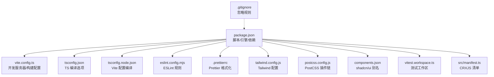
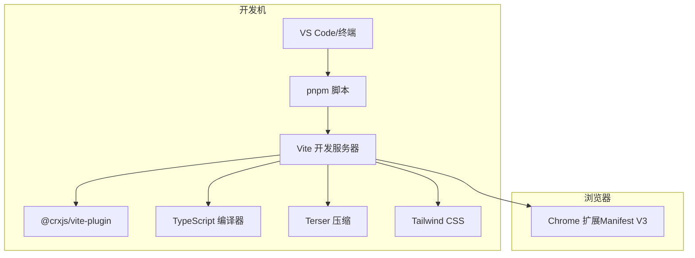
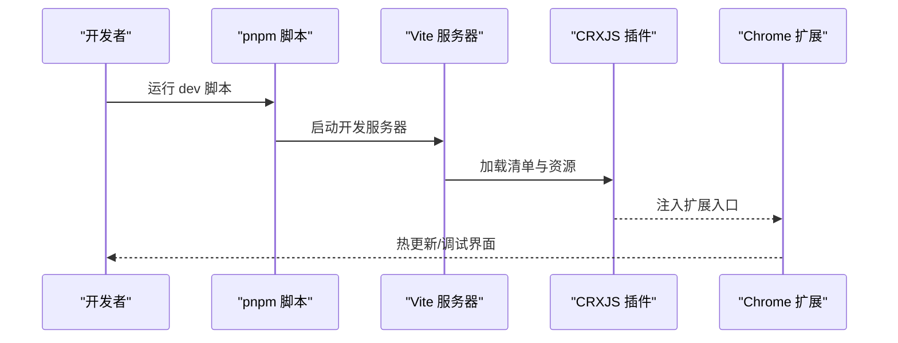
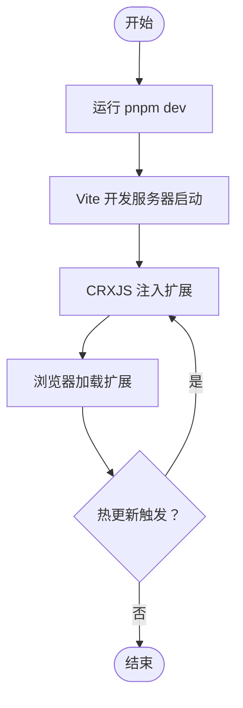
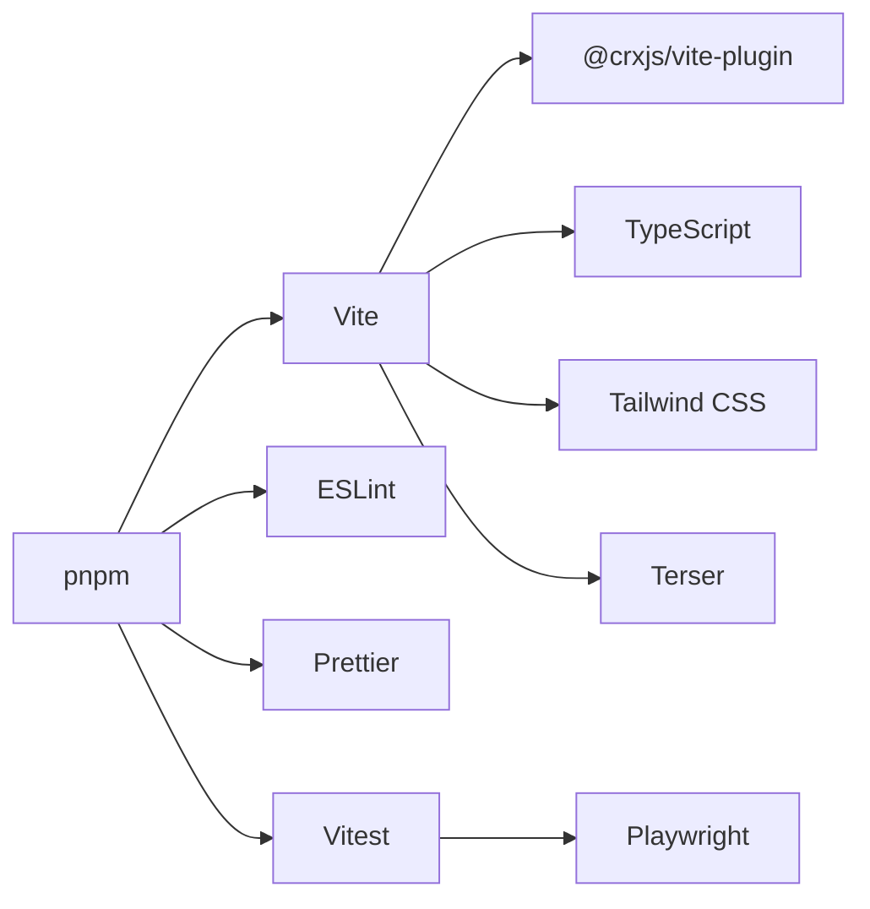

# 开发环境搭建

<cite>
**本文引用的文件**
- [package.json](file://package.json)
- [tsconfig.json](file://tsconfig.json)
- [tsconfig.node.json](file://tsconfig.node.json)
- [vite.config.ts](file://vite.config.ts)
- [eslint.config.mjs](file://eslint.config.mjs)
- [.prettierrc](file://.prettierrc)
- [tailwind.config.js](file://tailwind.config.js)
- [postcss.config.js](file://postcss.config.js)
- [components.json](file://components.json)
- [.gitignore](file://.gitignore)
- [vitest.workspace.ts](file://vitest.workspace.ts)
- [src/manifest.ts](file://src/manifest.ts)
- [README.md](file://README.md)
</cite>

## 目录
1. [简介](#简介)
2. [项目结构](#项目结构)
3. [核心组件](#核心组件)
4. [架构总览](#架构总览)
5. [详细组件分析](#详细组件分析)
6. [依赖分析](#依赖分析)
7. [性能考虑](#性能考虑)
8. [故障排查指南](#故障排查指南)
9. [结论](#结论)
10. [附录](#附录)

## 简介
本指南面向首次参与“B站收藏夹整理工具”开发的工程师，提供从零搭建开发环境的完整步骤，涵盖 Node.js 版本要求、pnpm 包管理器安装与配置、依赖安装流程（生产依赖与开发依赖）、IDE 推荐配置（VS Code 插件、TypeScript、ESLint、Prettier 集成）、Git 钩子（Husky）安装与配置、开发服务器启动与热重载、以及调试环境设置。文档同时结合项目实际配置文件，确保每一步都可落地执行。

## 项目结构
该工程是一个基于 Vite 的 Chrome 扩展项目，采用 React 19、TypeScript 5、Tailwind CSS 3、Radix UI 组件体系与 shadcn/ui 风格规范，配合 CRXJS 插件实现 Chrome Manifest V3 的打包与开发体验。关键目录与文件职责概览：
- src：源代码根目录，包含 background、contentScript、popup、options、sidepanel、components、hooks、store、workers、utils 等模块
- vite.config.ts：Vite 构建与开发服务器配置，集成 CRXJS、React 插件与 Terser 压缩
- tsconfig.json 与 tsconfig.node.json：双 tsconfig 分离编译上下文，分别服务于源码与 Vite 配置
- eslint.config.mjs 与 .prettierrc：统一代码风格与静态检查策略
- tailwind.config.js 与 postcss.config.js：Tailwind CSS 与 PostCSS 配置
- components.json：shadcn/ui 配置，定义别名与样式风格
- vitest.workspace.ts：测试工作区配置，支持浏览器环境测试
- src/manifest.ts：CRXJS 定义的 Manifest V3 清单，声明权限、入口与资源映射
- package.json：脚本、引擎与依赖声明，明确 Node >= 14.18.0 与 pnpm 版本

**图示来源**
- [package.json:1-91](file://package.json#L1-L91)
- [vite.config.ts:1-44](file://vite.config.ts#L1-L44)
- [tsconfig.json:1-44](file://tsconfig.json#L1-L44)
- [tsconfig.node.json:1-11](file://tsconfig.node.json#L1-L11)
- [eslint.config.mjs:1-48](file://eslint.config.mjs#L1-L48)
- [.prettierrc:1-11](file://.prettierrc#L1-L11)
- [tailwind.config.js:1-118](file://tailwind.config.js#L1-L118)
- [postcss.config.js:1-7](file://postcss.config.js#L1-L7)
- [components.json:1-22](file://components.json#L1-L22)
- [vitest.workspace.ts:1-15](file://vitest.workspace.ts#L1-L15)
- [src/manifest.ts:1-55](file://src/manifest.ts#L1-L55)
- [.gitignore:1-28](file://.gitignore#L1-L28)

**章节来源**
- [package.json:1-91](file://package.json#L1-L91)
- [vite.config.ts:1-44](file://vite.config.ts#L1-L44)
- [tsconfig.json:1-44](file://tsconfig.json#L1-L44)
- [tsconfig.node.json:1-11](file://tsconfig.node.json#L1-L11)
- [eslint.config.mjs:1-48](file://eslint.config.mjs#L1-L48)
- [.prettierrc:1-11](file://.prettierrc#L1-L11)
- [tailwind.config.js:1-118](file://tailwind.config.js#L1-L118)
- [postcss.config.js:1-7](file://postcss.config.js#L1-L7)
- [components.json:1-22](file://components.json#L1-L22)
- [vitest.workspace.ts:1-15](file://vitest.workspace.ts#L1-L15)
- [src/manifest.ts:1-55](file://src/manifest.ts#L1-L55)
- [.gitignore:1-28](file://.gitignore#L1-L28)

## 核心组件
- Node.js 与包管理器
  - Node.js 版本要求：>= 14.18.0
  - 包管理器：pnpm（版本在 package.json 中声明）
- 构建与开发服务器
  - Vite：开发服务器、热重载、构建产物输出
  - CRXJS：Chrome Manifest V3 打包与签名（开发时自动注入）
  - React 插件与 Babel React Compiler：加速构建与渲染
  - Terser：生产构建去除 console 并压缩
- 类型系统与样式
  - TypeScript：严格模式、ESNext 目标、路径别名
  - Tailwind CSS：暗色模式、颜色变量、滚动条样式增强
  - shadcn/ui：组件风格与别名配置
- 代码质量
  - ESLint：基于 TypeScript Parser 的 React Hooks 规则
  - Prettier：统一缩进、引号、尾逗号等格式
- 测试
  - Vitest：Node 与浏览器双环境测试，Playwright 提供浏览器驱动
- Git 钩子
  - Husky：通过 prepare 脚本初始化

**章节来源**
- [package.json:13-28](file://package.json#L13-L28)
- [vite.config.ts:11-43](file://vite.config.ts#L11-L43)
- [tsconfig.json:2-34](file://tsconfig.json#L2-L34)
- [tailwind.config.js:4-67](file://tailwind.config.js#L4-L67)
- [components.json:1-22](file://components.json#L1-L22)
- [eslint.config.mjs:4-47](file://eslint.config.mjs#L4-L47)
- [.prettierrc:1-11](file://.prettierrc#L1-L11)
- [vitest.workspace.ts:6-14](file://vitest.workspace.ts#L6-L14)
- [package.json:27](file://package.json#L27)

## 架构总览
下图展示了开发环境的关键交互：IDE/终端调用 pnpm 脚本，Vite 启动开发服务器并加载 CRXJS 插件，读取 TypeScript 与 Tailwind 配置，构建出 Chrome 扩展产物并在浏览器中加载。

**图示来源**
- [package.json:17-28](file://package.json#L17-L28)
- [vite.config.ts:11-43](file://vite.config.ts#L11-L43)
- [tsconfig.json:2-34](file://tsconfig.json#L2-L34)
- [tailwind.config.js:1-118](file://tailwind.config.js#L1-L118)
- [src/manifest.ts:8-54](file://src/manifest.ts#L8-L54)

## 详细组件分析

### Node.js 与 pnpm 安装与配置
- Node.js 版本要求
  - 在 package.json 的 engines 字段中声明 Node >= 14.18.0
- pnpm 安装与配置
  - 项目声明了 packageManager 为 pnpm@9.15.0，建议按此版本安装以避免锁版本差异
  - 安装后可通过 pnpm install 安装依赖
- 生产依赖与开发依赖
  - 生产依赖：运行期所需（如 React、Radix UI、Tailwind Merge、Zustand、OpenAI SDK 等）
  - 开发依赖：构建与开发工具（如 Vite、TypeScript、ESLint、Prettier、Husky、Vitest、Playwright 等）

**章节来源**
- [package.json:13-28](file://package.json#L13-L28)
- [package.json:29-89](file://package.json#L29-L89)

### TypeScript 配置
- 双 tsconfig 设计
  - tsconfig.json：源码编译上下文，严格模式、ESNext、React JSX、路径别名 @/*
  - tsconfig.node.json：Vite 配置文件编译上下文，便于 vite.config.ts 正确解析
- 关键点
  - baseUrl 与 paths 配合 Vite 别名，保证导入一致性
  - types 字段包含 vitest/browser providers、react、react-dom、chrome，满足测试与扩展类型需求

**章节来源**
- [tsconfig.json:1-44](file://tsconfig.json#L1-L44)
- [tsconfig.node.json:1-11](file://tsconfig.node.json#L1-L11)
- [vite.config.ts:29-33](file://vite.config.ts#L29-L33)

### Vite 与 CRXJS 开发服务器
- 开发服务器
  - 脚本 dev 对应 vite，启动热重载开发服务器
  - CRXJS 插件负责将清单与前端资源打包为可加载的扩展
- 构建配置
  - 输出目录 outDir: build，chunk 文件名带 hash
  - Rollup 插件链中集成 Terser，生产构建移除 console
- 路径别名
  - @ 指向 src，便于统一导入

**图示来源**
- [package.json:17-18](file://package.json#L17-L18)
- [vite.config.ts:11-43](file://vite.config.ts#L11-L43)
- [src/manifest.ts:8-54](file://src/manifest.ts#L8-L54)

**章节来源**
- [package.json:17-20](file://package.json#L17-L20)
- [vite.config.ts:11-43](file://vite.config.ts#L11-L43)

### ESLint 与 Prettier 集成
- ESLint
  - 使用 TypeScript Parser，仅对 TS/TSX/JSX/JS 文件生效
  - 启用 React Hooks 插件，规则包括 hooks 规范与依赖检查
  - 忽略目录：node_modules、dist、build、public、.codebuddy、.qoder、*.md、pnpm-lock.yaml 等
- Prettier
  - 单引号、尾逗号、LF 结尾、宽度 100、无分号、缩进 2 空格
  - 通过脚本 fmt 应用到 .tsx、.ts、.json、.css、.scss、.md

**章节来源**
- [eslint.config.mjs:4-47](file://eslint.config.mjs#L4-L47)
- [.prettierrc:1-11](file://.prettierrc#L1-L11)
- [package.json:21-24](file://package.json#L21-L24)

### Tailwind CSS 与 shadcn/ui
- Tailwind
  - 内容扫描范围覆盖根 HTML 与 src 下的 JS/TS/JSX/TSX
  - 深色模式、颜色变量、自定义滚动条样式增强
- shadcn/ui
  - 风格：New York；TSX；Tailwind 配置指向项目 tailwind.config.js
  - 别名：components -> @/components；ui -> @/components/ui；lib -> @/lib；hooks -> @/hooks
  - 图标库：lucide

**章节来源**
- [tailwind.config.js:1-118](file://tailwind.config.js#L1-L118)
- [components.json:1-22](file://components.json#L1-L22)

### 测试与覆盖率
- 测试框架：Vitest
- 工作区：vitest.workspace.ts 指定测试文件范围与 jsdom 环境
- 覆盖率：脚本 coverage 运行并生成覆盖率报告
- 浏览器测试：通过 playwright 提供浏览器驱动

**章节来源**
- [vitest.workspace.ts:1-15](file://vitest.workspace.ts#L1-L15)
- [package.json:25-26](file://package.json#L25-L26)

### Git 钩子与 Husky
- Husky 初始化
  - 通过 prepare 脚本在安装依赖时自动初始化
- 建议用途
  - 在 pre-commit 阶段执行 lint 与 format，保障提交质量
  - 在 commit-msg 阶段校验提交信息格式（可选）

**章节来源**
- [package.json:27](file://package.json#L27)

### IDE 推荐配置（VS Code）
- 插件推荐
  - ESLint：实时语法与规则检查
  - Prettier：保存时自动格式化
  - Tailwind CSS IntelliSense：类名补全与错误提示
  - TypeScript Importer：自动导入类型
  - ES7+ React/Redux/React-Native snippets：提高 React 开发效率
- VS Code 设置要点
  - 将 ESLint 与 Prettier 设为默认格式化工具
  - 启用“编辑时保存时格式化”以配合 .prettierrc
  - 为 TypeScript 项目开启“严格模式”，与 tsconfig.json 保持一致
  - 为 Chrome 扩展开发，可在调试配置中附加扩展（见“调试环境设置”）

**章节来源**
- [eslint.config.mjs:4-47](file://eslint.config.mjs#L4-L47)
- [.prettierrc:1-11](file://.prettierrc#L1-L11)
- [tsconfig.json:2-34](file://tsconfig.json#L2-L34)

### 调试环境设置
- 开发模式
  - 运行 pnpm dev 启动 Vite 开发服务器，自动打开热重载页面
  - 通过 CRXJS 插件将扩展注入浏览器，支持热更新
- 清单与权限
  - src/manifest.ts 定义了扩展名称、图标、背景脚本、内容脚本、权限与 host 权限
  - 开发模式下会在名称后追加 “Dev” 标识，便于区分
- 浏览器加载
  - 在浏览器扩展页面启用“开发者模式”，加载 src 目录或构建产物
  - 如需侧边栏调试，可打开 sidepanel.html 或通过扩展入口访问

**图示来源**
- [package.json:17-18](file://package.json#L17-L18)
- [vite.config.ts:11-43](file://vite.config.ts#L11-L43)
- [src/manifest.ts:8-54](file://src/manifest.ts#L8-L54)

**章节来源**
- [package.json:17-20](file://package.json#L17-L20)
- [src/manifest.ts:6-7](file://src/manifest.ts#L6-L7)

## 依赖分析
- 依赖关系概览
  - 构建链路：pnpm -> Vite -> CRXJS -> TypeScript -> Tailwind -> Terser
  - 代码质量链路：ESLint -> Prettier
  - 测试链路：Vitest -> Playwright（浏览器环境）
- 外部依赖与作用
  - React 19 + Radix UI：UI 与交互基础
  - Zustand + Immer：状态管理与不可变更新
  - Tailwind CSS + shadcn/ui：样式与组件体系
  - OpenAI SDK：可选 AI 能力
  - ECharts：可视化图表
  - Husky：Git 钩子自动化

**图示来源**
- [package.json:29-89](file://package.json#L29-L89)
- [vite.config.ts:11-43](file://vite.config.ts#L11-L43)
- [eslint.config.mjs:4-47](file://eslint.config.mjs#L4-L47)
- [.prettierrc:1-11](file://.prettierrc#L1-L11)
- [vitest.workspace.ts:6-14](file://vitest.workspace.ts#L6-L14)

**章节来源**
- [package.json:29-89](file://package.json#L29-L89)

## 性能考虑
- 构建优化
  - Terser 移除 console，减小产物体积
  - chunk 文件名带 hash，利于浏览器缓存
- 开发体验
  - React Compiler 与 Babel 预处理提升编译速度
  - Vite 热重载与 CRXJS 注入降低调试等待时间
- 样式与体积
  - Tailwind 按需扫描内容，避免引入未使用样式
  - shadcn/ui 组件按需引入，减少冗余

**章节来源**
- [vite.config.ts:13-27](file://vite.config.ts#L13-L27)
- [vite.config.ts:36-40](file://vite.config.ts#L36-L40)
- [tailwind.config.js:6](file://tailwind.config.js#L6)

## 故障排查指南
- Node 版本不兼容
  - 现象：pnpm 报错或构建失败
  - 处理：升级 Node 至 >= 14.18.0，或使用 nvm/fnm 管理多版本
- pnpm 版本不匹配
  - 现象：lock 文件冲突或安装异常
  - 处理：按 package.json 声明的 pnpm@9.15.0 安装
- ESLint/Prettier 冲突
  - 现象：保存时报错或格式化不一致
  - 处理：确认 VS Code 默认格式化工具为 Prettier，且 ESLint 配置生效
- 浏览器无法加载扩展
  - 现象：扩展页面空白或报错
  - 处理：确认已启用“开发者模式”，加载正确目录；检查 src/manifest.ts 权限与入口
- 热重载无效
  - 现象：修改代码后页面未刷新
  - 处理：重启 pnpm dev；检查 Vite 插件链与 CRXJS 配置

**章节来源**
- [package.json:13-16](file://package.json#L13-L16)
- [package.json:27](file://package.json#L27)
- [src/manifest.ts:39-54](file://src/manifest.ts#L39-L54)

## 结论
本指南基于项目现有配置文件，提供了从 Node.js、pnpm 到 Vite、TypeScript、ESLint、Prettier、Tailwind CSS、shadcn/ui、Husky、Vitest 的完整开发环境搭建路径。遵循上述步骤，开发者可快速建立一致的本地开发与调试环境，并通过脚本与配置文件确保团队协作的代码质量与构建稳定性。

## 附录
- 常用脚本速查
  - pnpm dev：启动开发服务器与热重载
  - pnpm build：TypeScript 编译 + Vite 构建
  - pnpm preview：本地预览构建产物
  - pnpm lint / pnpm lint:fix：ESLint 检查与修复
  - pnpm fmt：Prettier 格式化
  - pnpm coverage：Vitest 覆盖率
  - pnpm test:browser：浏览器环境测试
  - pnpm prepare：初始化 Husky 钩子
- 项目贡献与隐私
  - 参考 README.md 了解基本使用与贡献流程
  - 隐私政策与数据存储策略详见项目文档

**章节来源**
- [package.json:17-28](file://package.json#L17-L28)
- [README.md:147-159](file://README.md#L147-L159)