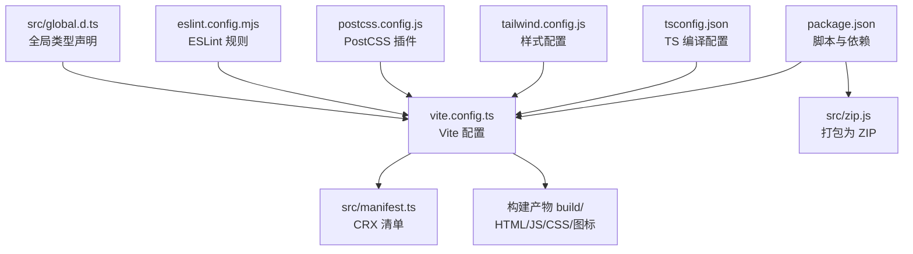
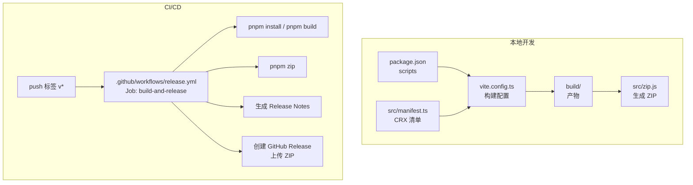
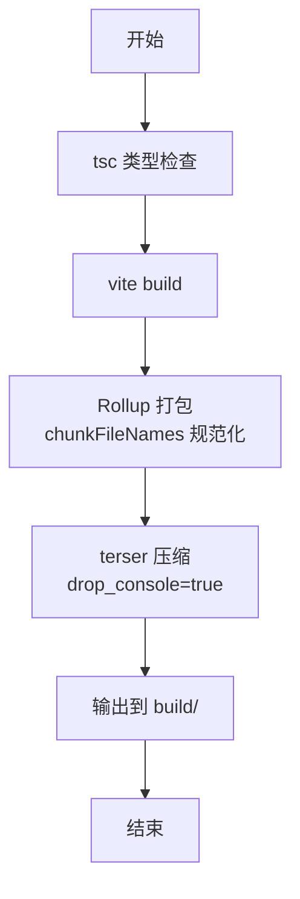
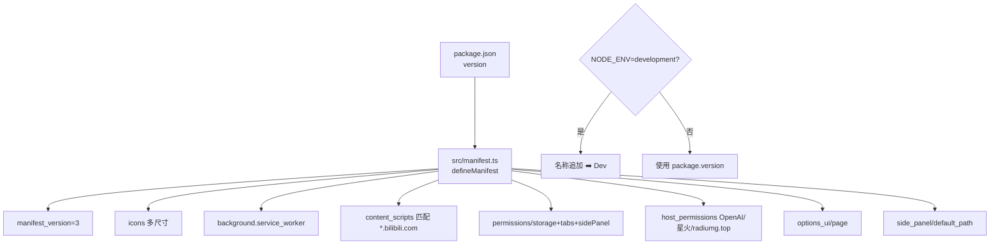
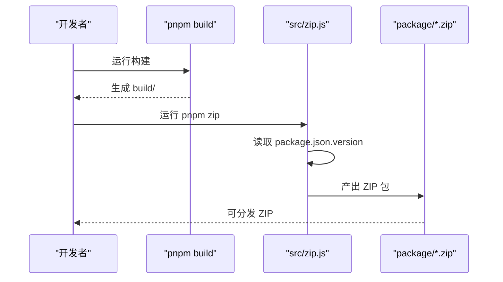
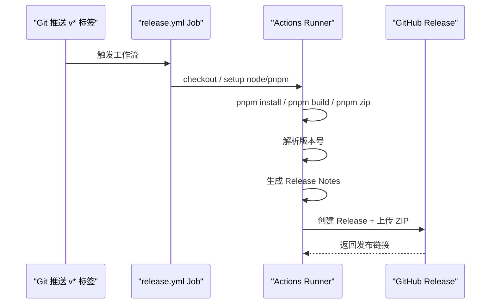
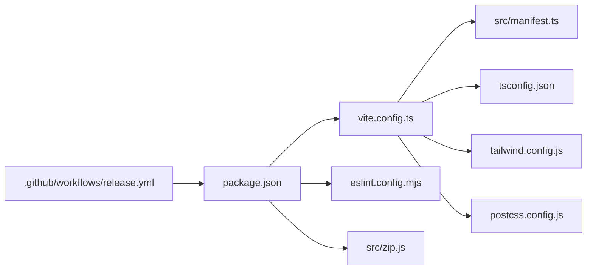

# 构建与发布流程

<cite>
**本文引用的文件**
- [package.json](file://package.json)
- [vite.config.ts](file://vite.config.ts)
- [src/manifest.ts](file://src/manifest.ts)
- [.github/workflows/release.yml](file://.github/workflows/release.yml)
- [src/zip.js](file://src/zip.js)
- [tsconfig.json](file://tsconfig.json)
- [tailwind.config.js](file://tailwind.config.js)
- [postcss.config.js](file://postcss.config.js)
- [eslint.config.mjs](file://eslint.config.mjs)
- [PRIVACY.md](file://PRIVACY.md)
- [README.md](file://README.md)
- [src/global.d.ts](file://src/global.d.ts)
</cite>

## 目录
1. [简介](#简介)
2. [项目结构](#项目结构)
3. [核心组件](#核心组件)
4. [架构总览](#架构总览)
5. [详细组件分析](#详细组件分析)
6. [依赖关系分析](#依赖关系分析)
7. [性能考量](#性能考量)
8. [故障排查指南](#故障排查指南)
9. [结论](#结论)
10. [附录](#附录)

## 简介
本文件面向维护者与贡献者，系统化阐述“B站收藏夹整理工具”的构建与发布流程，覆盖以下主题：
- Vite 构建配置与资源优化
- CRX 扩展打包与版本管理
- 发布前准备（版本号、变更日志、兼容性测试）
- Chrome Web Store 发布与版本更新
- GitHub Actions 自动化发布
- 发布后的监控与问题处理

## 项目结构
该项目为基于 Vite + CRX 的 Chrome Extension（Manifest V3），前端采用 React + TypeScript，样式使用 TailwindCSS，构建产物输出至 build 目录并通过 CRX 插件生成可分发的扩展包。

图示来源
- [package.json:1-91](file://package.json#L1-L91)
- [vite.config.ts:1-44](file://vite.config.ts#L1-L44)
- [src/manifest.ts:1-55](file://src/manifest.ts#L1-L55)
- [src/zip.js:1-11](file://src/zip.js#L1-L11)
- [tsconfig.json:1-44](file://tsconfig.json#L1-L44)
- [tailwind.config.js:1-118](file://tailwind.config.js#L1-L118)
- [postcss.config.js:1-7](file://postcss.config.js#L1-L7)
- [eslint.config.mjs:1-48](file://eslint.config.mjs#L1-L48)
- [src/global.d.ts:1-4](file://src/global.d.ts#L1-L4)

章节来源
- [package.json:1-91](file://package.json#L1-L91)
- [vite.config.ts:1-44](file://vite.config.ts#L1-L44)
- [src/manifest.ts:1-55](file://src/manifest.ts#L1-L55)
- [src/zip.js:1-11](file://src/zip.js#L1-L11)
- [tsconfig.json:1-44](file://tsconfig.json#L1-L44)
- [tailwind.config.js:1-118](file://tailwind.config.js#L1-L118)
- [postcss.config.js:1-7](file://postcss.config.js#L1-L7)
- [eslint.config.mjs:1-48](file://eslint.config.mjs#L1-L48)
- [src/global.d.ts:1-4](file://src/global.d.ts#L1-L4)

## 核心组件
- 构建与打包
  - Vite 配置：定义输出目录、Rollup 插件（压缩）、别名、CRX 插件与 React 编译器。
  - 清单与版本：CRX 清单由 src/manifest.ts 统一生成，版本号来自 package.json。
  - ZIP 打包：通过 src/zip.js 将 build 目录打包为扩展分发包。
- 发布自动化
  - GitHub Actions：监听标签推送，执行安装依赖、构建、打包、生成发布说明并创建 Release。
- 质量保障
  - ESLint：集中规则，忽略构建产物与锁文件。
  - 类型与样式：TS 配置、Tailwind 与 PostCSS 集成。

章节来源
- [vite.config.ts:11-44](file://vite.config.ts#L11-L44)
- [src/manifest.ts:8-55](file://src/manifest.ts#L8-L55)
- [package.json:17-28](file://package.json#L17-L28)
- [src/zip.js:1-11](file://src/zip.js#L1-L11)
- [.github/workflows/release.yml:1-101](file://.github/workflows/release.yml#L1-L101)
- [eslint.config.mjs:1-48](file://eslint.config.mjs#L1-L48)
- [tsconfig.json:1-44](file://tsconfig.json#L1-L44)
- [tailwind.config.js:1-118](file://tailwind.config.js#L1-L118)
- [postcss.config.js:1-7](file://postcss.config.js#L1-L7)

## 架构总览
下图展示了从代码到可分发包的关键路径，以及 GitHub Actions 的自动化流程。

图示来源
- [package.json:17-28](file://package.json#L17-L28)
- [vite.config.ts:11-44](file://vite.config.ts#L11-L44)
- [src/manifest.ts:8-55](file://src/manifest.ts#L8-L55)
- [src/zip.js:1-11](file://src/zip.js#L1-L11)
- [.github/workflows/release.yml:1-101](file://.github/workflows/release.yml#L1-L101)

## 详细组件分析

### Vite 构建配置与资源优化
- 输出与压缩
  - 输出目录：build
  - Rollup 插件：启用 terser 并移除控制台日志，减小体积并清理调试信息
- 路径别名与插件链
  - @ 别名指向 src
  - CRX 插件注入清单
  - React 插件集成 babel-plugin-react-compiler
- 构建顺序
  - 先 tsc（类型检查），再 vite build（CRX 打包）

图示来源
- [vite.config.ts:13-28](file://vite.config.ts#L13-L28)
- [vite.config.ts:34-41](file://vite.config.ts#L34-L41)
- [package.json:19](file://package.json#L19)

章节来源
- [vite.config.ts:11-44](file://vite.config.ts#L11-L44)
- [package.json:17-28](file://package.json#L17-L28)

### CRX 清单与版本管理
- 版本来源：从 package.json 的 version 字段读取
- 清单字段要点
  - 名称：开发模式下追加 Dev 标识
  - 图标：16/32/48/128 多尺寸
  - 行为：action 弹窗、background service worker、content script 匹配 B站域名
  - 权限：storage、tabs、sidePanel；host 权限包含 OpenAI 与星火等服务
  - 选项页与侧边栏路径

图示来源
- [src/manifest.ts:8-55](file://src/manifest.ts#L8-L55)
- [package.json:4](file://package.json#L4)

章节来源
- [src/manifest.ts:8-55](file://src/manifest.ts#L8-L55)
- [package.json:4](file://package.json#L4)

### ZIP 打包与分发包生成
- 输入：build 目录
- 输出：package/{name}-v{version}.zip
- 用途：本地分发或 GitHub Release 附件

图示来源
- [package.json:24](file://package.json#L24)
- [src/zip.js:1-11](file://src/zip.js#L1-L11)

章节来源
- [package.json:24](file://package.json#L24)
- [src/zip.js:1-11](file://src/zip.js#L1-L11)

### GitHub Actions 自动化发布
- 触发条件：推送以 v 开头的标签
- 步骤概览
  - 检出代码、设置 Node.js 与 pnpm
  - 安装依赖、构建、ZIP 打包
  - 从标签解析版本号
  - 生成 Release Notes（按 feat/fix/其他分类）
  - 创建 GitHub Release 并上传 ZIP

图示来源
- [.github/workflows/release.yml:1-101](file://.github/workflows/release.yml#L1-L101)

章节来源
- [.github/workflows/release.yml:1-101](file://.github/workflows/release.yml#L1-L101)

### 发布前准备
- 版本号管理
  - 修改 package.json 的 version 字段
  - 确保 src/manifest.ts 读取到最新版本
- 变更日志更新
  - 建议在本地基于 git log 或变更记录维护 changelog，发布时可复用
- 兼容性测试
  - 在不同 Chrome 版本与 B站页面环境验证功能
  - 确认 content scripts、background、side panel、options 页面正常
- 隐私与合规
  - 参考隐私政策，确认网络权限与数据处理符合预期

章节来源
- [package.json:4](file://package.json#L4)
- [src/manifest.ts:8-55](file://src/manifest.ts#L8-L55)
- [PRIVACY.md:1-104](file://PRIVACY.md#L1-L104)

### Chrome Web Store 发布与版本更新
- 准备材料
  - 已通过自动化流程生成的 ZIP 包
  - 清单与图标资源
- 发布步骤（概念流程）
  - 登录 Chrome Web Store Developer Dashboard
  - 上传新版本 ZIP
  - 填写版本说明与截图
  - 提交审核
  - 审核通过后自动生效
- 版本更新
  - 通过提高 package.json 中的 version 并打新标签触发自动化发布
  - 若需灰度发布或回滚，遵循商店策略与版本管理约定

章节来源
- [.github/workflows/release.yml:90-101](file://.github/workflows/release.yml#L90-L101)
- [README.md:82-96](file://README.md#L82-L96)

### 发布后的监控与问题处理
- 监控指标
  - 用户反馈渠道（Issues）
  - Chrome Web Store 评分与评论
  - 本地日志与错误上报（如实现）
- 常见问题定位
  - 清单权限缺失导致功能异常
  - 内容脚本未注入或匹配规则不正确
  - 缓存与存储相关问题
- 处理流程
  - 复现最小化案例
  - 对照清单与权限配置
  - 回滚至上一稳定版本并发布热修复

章节来源
- [src/manifest.ts:39-54](file://src/manifest.ts#L39-L54)
- [PRIVACY.md:33-47](file://PRIVACY.md#L33-L47)

## 依赖关系分析
- 构建链路
  - package.json scripts -> vite.config.ts -> CRX 清单 -> 构建产物 -> ZIP
- 质量与样式
  - ESLint 规则集中管理，TS/Tailwind/PostCSS 配置统一
- CI 依赖
  - Actions 使用 pnpm 与 Node LTS，确保跨平台一致性

图示来源
- [package.json:17-28](file://package.json#L17-L28)
- [vite.config.ts:11-44](file://vite.config.ts#L11-L44)
- [src/manifest.ts:8-55](file://src/manifest.ts#L8-L55)
- [tsconfig.json:1-44](file://tsconfig.json#L1-L44)
- [tailwind.config.js:1-118](file://tailwind.config.js#L1-L118)
- [postcss.config.js:1-7](file://postcss.config.js#L1-L7)
- [eslint.config.mjs:1-48](file://eslint.config.mjs#L1-L48)
- [src/zip.js:1-11](file://src/zip.js#L1-L11)
- [.github/workflows/release.yml:1-101](file://.github/workflows/release.yml#L1-L101)

章节来源
- [package.json:17-28](file://package.json#L17-L28)
- [vite.config.ts:11-44](file://vite.config.ts#L11-L44)
- [src/manifest.ts:8-55](file://src/manifest.ts#L8-L55)
- [tsconfig.json:1-44](file://tsconfig.json#L1-L44)
- [tailwind.config.js:1-118](file://tailwind.config.js#L1-L118)
- [postcss.config.js:1-7](file://postcss.config.js#L1-L7)
- [eslint.config.mjs:1-48](file://eslint.config.mjs#L1-L48)
- [src/zip.js:1-11](file://src/zip.js#L1-L11)
- [.github/workflows/release.yml:1-101](file://.github/workflows/release.yml#L1-L101)

## 性能考量
- 体积优化
  - 启用 terser 压缩与 drop_console
  - 合理拆分 chunk，避免单文件过大
- 构建速度
  - 使用 React 编译器与增量构建
  - 仅在必要时运行 ZIP 打包
- 运行时性能
  - 内容脚本匹配精确域名，减少无关页面注入
  - 合理使用缓存与存储 TTL（参考隐私政策中的缓存策略）

章节来源
- [vite.config.ts:20-26](file://vite.config.ts#L20-L26)
- [vite.config.ts:36-40](file://vite.config.ts#L36-L40)
- [src/manifest.ts:27-32](file://src/manifest.ts#L27-L32)
- [PRIVACY.md:28-31](file://PRIVACY.md#L28-L31)

## 故障排查指南
- 构建失败
  - 检查 Node 与 pnpm 版本要求
  - 确认依赖安装与类型检查通过
- 清单错误
  - 核对 permissions/host_permissions 与匹配规则
  - 确认图标与 HTML 路径存在
- CI 失败
  - 查看 Actions 日志，确认 pnpm install 与构建步骤
  - 检查标签命名与版本号解析
- 发布问题
  - 确认 ZIP 包包含完整 build 内容
  - 检查商店后台上传与审核状态

章节来源
- [package.json:13-16](file://package.json#L13-L16)
- [eslint.config.mjs:7-18](file://eslint.config.mjs#L7-L18)
- [.github/workflows/release.yml:31-38](file://.github/workflows/release.yml#L31-L38)
- [src/manifest.ts:39-54](file://src/manifest.ts#L39-L54)

## 结论
本项目通过 Vite + CRX 实现高效的 Chrome Extension 构建与分发，结合 GitHub Actions 自动化发布，形成从本地开发到商店上线的闭环流程。建议在每次发布前严格校验版本号、变更日志与兼容性，并持续关注用户反馈与商店审核状态，确保扩展的稳定性与用户体验。

## 附录
- 版本号与全局常量
  - 应用版本常量在全局声明中定义，便于在代码中读取当前版本
- 隐私与合规
  - 隐私政策明确了数据处理原则与权限范围，发布时应与商店描述保持一致

章节来源
- [src/global.d.ts:1-4](file://src/global.d.ts#L1-L4)
- [PRIVACY.md:1-104](file://PRIVACY.md#L1-L104)