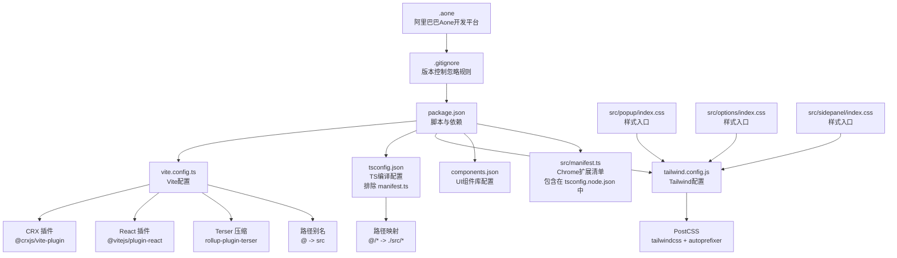
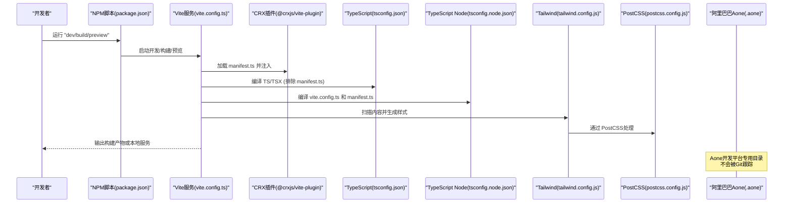
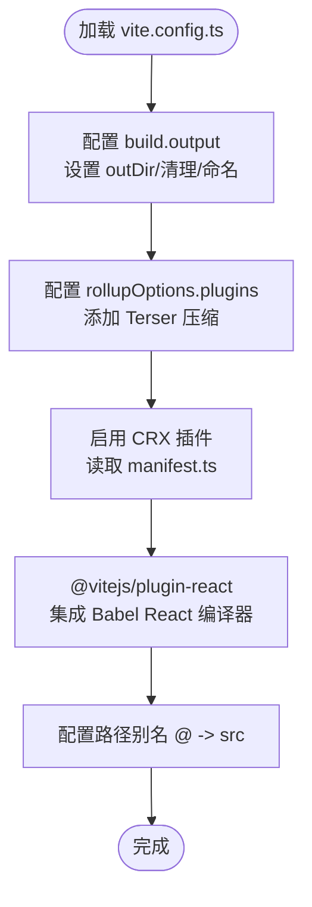
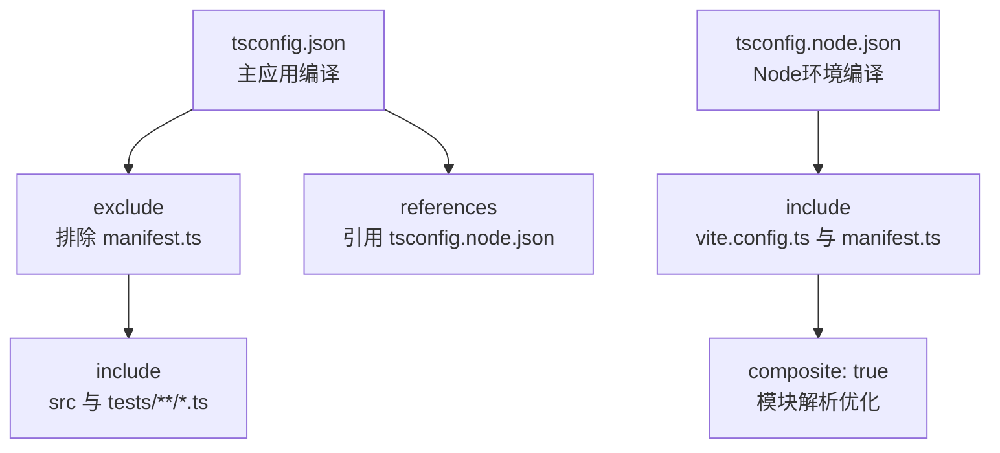
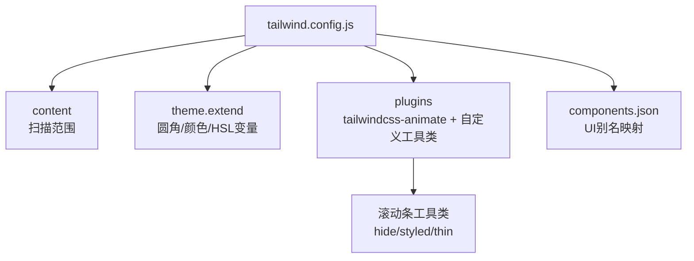
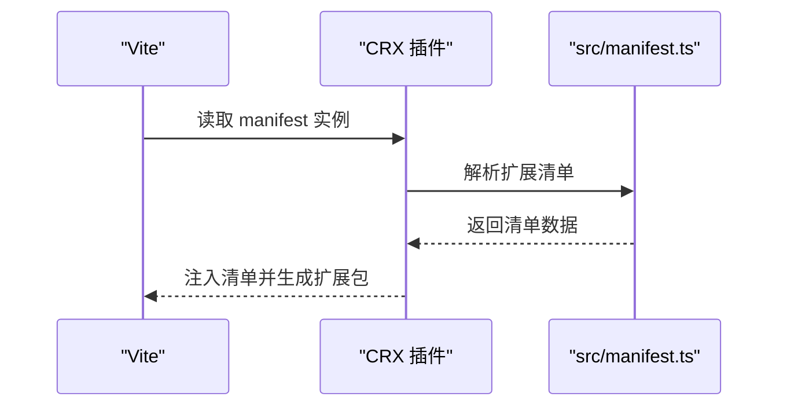
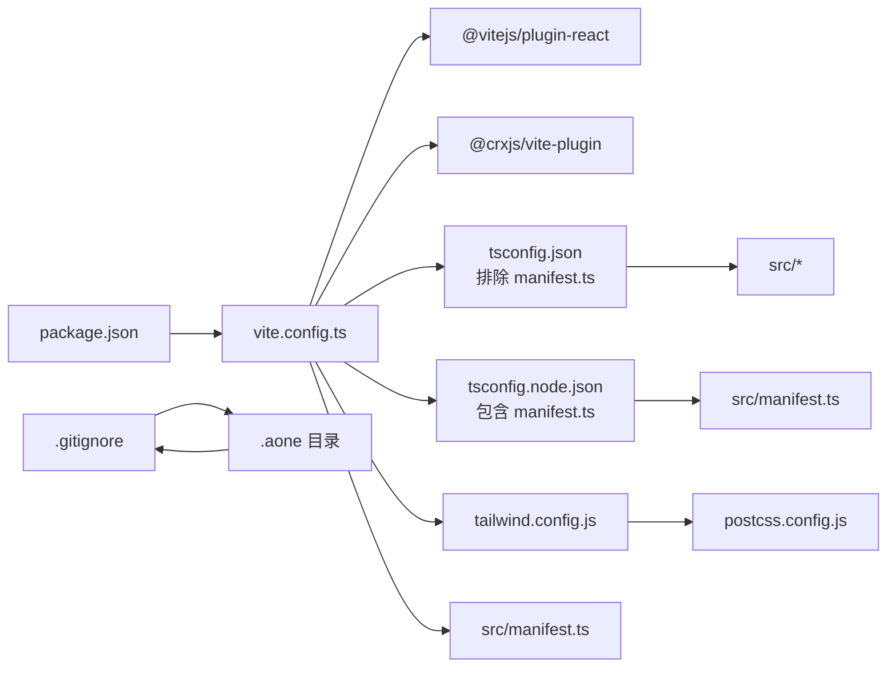

# 构建配置详解

<cite>
**本文引用的文件**
- [vite.config.ts](file://vite.config.ts)
- [tsconfig.json](file://tsconfig.json)
- [tsconfig.node.json](file://tsconfig.node.json)
- [tailwind.config.js](file://tailwind.config.js)
- [postcss.config.js](file://postcss.config.js)
- [package.json](file://package.json)
- [components.json](file://components.json)
- [src/manifest.ts](file://src/manifest.ts)
- [src/global.d.ts](file://src/global.d.ts)
- [.prettierrc](file://.prettierrc)
- [.gitignore](file://.gitignore)
- [src/options/index.css](file://src/options/index.css)
- [src/popup/index.css](file://src/popup/index.css)
- [src/sidepanel/index.css](file://src/sidepanel/index.css)
</cite>

## 更新摘要
**所做更改**
- 更新TypeScript编译配置章节，反映tsconfig.json排除manifest.ts文件和tsconfig.node.json包含manifest.ts文件的优化
- 增强TypeScript编译范围优化说明，解释双配置文件策略的优势
- 更新构建流程图以体现manifest.ts的特殊处理方式

## 目录
1. [简介](#简介)
2. [项目结构](#项目结构)
3. [核心组件](#核心组件)
4. [架构总览](#架构总览)
5. [详细组件分析](#详细组件分析)
6. [依赖关系分析](#依赖关系分析)
7. [性能考量](#性能考量)
8. [故障排查指南](#故障排查指南)
9. [结论](#结论)
10. [附录](#附录)

## 简介
本文件面向B站收藏夹整理工具的构建与打包配置，系统性解析以下方面：
- Vite 配置：插件体系、路径别名、构建输出与压缩策略
- TypeScript 编译配置：编译目标、模块解析、路径映射、类型声明、**优化的编译范围控制**
- Tailwind CSS 主题与组件：变量系统、暗色模式、自定义滚动条样式
- PostCSS 自动前缀与 Tailwind 集成
- 构建脚本与用途：开发、生产、预览、打包发布
- CRX 插件：Chrome 扩展清单与打包流程
- **新增**：阿里巴巴Aone开发平台集成与.gitignore配置

## 项目结构
该工程采用 Vite + React + TypeScript + Tailwind CSS 技术栈，结合 CRX 插件实现 Chrome 扩展的开发与打包。关键目录与文件如下：
- 构建与配置：vite.config.ts、tsconfig.json、tsconfig.node.json、tailwind.config.js、postcss.config.js、components.json、package.json
- 扩展清单：src/manifest.ts
- 全局类型声明：src/global.d.ts
- 样式入口：src/popup/index.css、src/options/index.css、src/sidepanel/index.css
- 代码规范：.prettierrc
- **新增**：版本控制忽略规则：.gitignore

**图表来源**
- [package.json:17-28](file://package.json#L17-L28)
- [vite.config.ts:11-43](file://vite.config.ts#L11-L43)
- [tsconfig.json:22-41](file://tsconfig.json#L22-L41)
- [tsconfig.node.json:8-11](file://tsconfig.node.json#L8-L11)
- [tailwind.config.js:4-67](file://tailwind.config.js#L4-L67)
- [postcss.config.js:1-6](file://postcss.config.js#L1-L6)
- [components.json:6-19](file://components.json#L6-L19)
- [src/manifest.ts:8-54](file://src/manifest.ts#L8-L54)
- [src/popup/index.css:1-3](file://src/popup/index.css#L1-L3)
- [src/options/index.css:1-3](file://src/options/index.css#L1-L3)
- [src/sidepanel/index.css:1](file://src/sidepanel/index.css#L1)
- [.gitignore:27](file://.gitignore#L27)
- [package.json:13-16](file://package.json#L13-L16)

**章节来源**
- [package.json:17-28](file://package.json#L17-L28)
- [vite.config.ts:11-43](file://vite.config.ts#L11-L43)
- [tsconfig.json:22-41](file://tsconfig.json#L22-L41)
- [tsconfig.node.json:8-11](file://tsconfig.node.json#L8-L11)
- [tailwind.config.js:4-67](file://tailwind.config.js#L4-L67)
- [postcss.config.js:1-6](file://postcss.config.js#L1-L6)
- [components.json:6-19](file://components.json#L6-L19)
- [src/manifest.ts:8-54](file://src/manifest.ts#L8-L54)
- [src/popup/index.css:1-3](file://src/popup/index.css#L1-L3)
- [src/options/index.css:1-3](file://src/options/index.css#L1-L3)
- [src/sidepanel/index.css:1](file://src/sidepanel/index.css#L1)
- [.gitignore:27](file://.gitignore#L27)

## 核心组件
- Vite 构建配置：定义构建输出目录、空目录清理、Rollup 输出命名、Terser 压缩（去除 console）、路径别名、CRX 插件与 React 插件（含 Babel React 编译器）
- TypeScript 编译配置：严格模式、ESNext 目标、Node 解析、JSX 转换、路径映射、类型声明、引用 tsconfig.node.json
- Tailwind CSS：内容扫描范围、暗色模式、HSL 变量主题、品牌色、自定义滚动条工具类、动画插件
- PostCSS：启用 Tailwind 与 Autoprefixer
- 构建脚本：开发、构建、预览、打包、测试、覆盖率、格式化等
- CRX 插件：基于 manifest.ts 动态生成扩展包，支持 Dev 模式后缀
- **新增**：阿里巴巴Aone开发平台集成：.aone目录作为开发平台专用目录，不影响项目核心功能

**章节来源**
- [vite.config.ts:11-43](file://vite.config.ts#L11-L43)
- [tsconfig.json:2-47](file://tsconfig.json#L2-L47)
- [tsconfig.node.json:1-12](file://tsconfig.node.json#L1-L12)
- [tailwind.config.js:4-118](file://tailwind.config.js#L4-L118)
- [postcss.config.js:1-6](file://postcss.config.js#L1-L6)
- [package.json:17-28](file://package.json#L17-L28)
- [src/manifest.ts:8-54](file://src/manifest.ts#L8-L54)
- [.gitignore:27](file://.gitignore#L27)

## 架构总览
下图展示从开发到打包的关键流程与组件交互，特别体现了TypeScript编译配置的优化策略。

**图表来源**
- [package.json:17-28](file://package.json#L17-L28)
- [vite.config.ts:11-43](file://vite.config.ts#L11-L43)
- [src/manifest.ts:8-54](file://src/manifest.ts#L8-L54)
- [tsconfig.json:2-47](file://tsconfig.json#L2-L47)
- [tsconfig.node.json:1-12](file://tsconfig.node.json#L1-L12)
- [tailwind.config.js:4-67](file://tailwind.config.js#L4-L67)
- [postcss.config.js:1-6](file://postcss.config.js#L1-L6)
- [.gitignore:27](file://.gitignore#L27)

## 详细组件分析

### Vite 配置详解
- 构建输出
  - 输出目录：build
  - 清理输出目录：开启
  - Rollup 输出命名：chunk 文件名带哈希
- 插件体系
  - CRX 插件：读取 src/manifest.ts 动态生成扩展包
  - React 插件：集成 Babel React 编译器以提升渲染性能
  - Terser 压缩：移除 console 日志，减小产物体积
- 路径别名
  - @ -> src，便于在源码中统一导入

**图表来源**
- [vite.config.ts:11-43](file://vite.config.ts#L11-L43)

**章节来源**
- [vite.config.ts:11-43](file://vite.config.ts#L11-L43)

### TypeScript 编译配置详解
**更新** 本节反映了最新的TypeScript编译配置优化，采用双配置文件策略来优化编译范围。

- 编译目标与模块
  - 目标：ESNext；模块：ESNext；解析：Node
- 类型与 JSX
  - 严格模式：开启；JSX：react-jsx；跳过库检查：开启
- 路径映射与类型声明
  - baseUrl：项目根目录；paths：@/* -> ./src/*
  - types：包含 Vitest Playwright 提供者、React、React-DOM、chrome
- 引用配置
  - 引用 tsconfig.node.json，用于 Vite 配置文件编译
- **优化的编译范围控制**
  - tsconfig.json 排除 src/manifest.ts：避免在主应用编译中处理扩展清单文件
  - tsconfig.node.json 包含 src/manifest.ts：专门处理Vite配置和扩展清单
  - 这种分离确保了编译效率和类型安全性

**图表来源**
- [tsconfig.json:2-47](file://tsconfig.json#L2-L47)
- [tsconfig.node.json:1-12](file://tsconfig.node.json#L1-L12)

**章节来源**
- [tsconfig.json:2-47](file://tsconfig.json#L2-L47)
- [tsconfig.node.json:1-12](file://tsconfig.node.json#L1-L12)

### Tailwind CSS 配置详解
- 内容扫描
  - 扫描根 HTML 与 src 下所有 JS/TS/JSX/TSX 文件
- 暗色模式
  - 使用 class 方式切换
- 主题扩展
  - 圆角变量：基于 CSS 变量 --radius 的多级推导
  - 颜色系统：基于 HSL var(--*) 的语义化命名，包含卡片、弹出层、主次色、强调、破坏性、输入框、环形光等
  - 品牌色：自定义 B站风格色系
- 插件与工具类
  - 启用 tailwindcss-animate
  - 自定义滚动条工具类：隐藏滚动条、细滚动条、美化滚动条
- 组件库适配
  - components.json 指定 UI 库为 shadcn，并映射别名为 @/components、@/lib/utils、@/components/ui 等

**图表来源**
- [tailwind.config.js:4-118](file://tailwind.config.js#L4-L118)
- [components.json:6-19](file://components.json#L6-L19)

**章节来源**
- [tailwind.config.js:4-118](file://tailwind.config.js#L4-L118)
- [components.json:6-19](file://components.json#L6-L19)

### PostCSS 配置与自动前缀
- 插件链
  - tailwindcss：生成所需样式
  - autoprefixer：自动添加浏览器前缀
- 与 Tailwind 协作
  - 在构建阶段由 PostCSS 完成最终 CSS 输出

**章节来源**
- [postcss.config.js:1-6](file://postcss.config.js#L1-L6)

### 构建脚本与用途
- 开发构建
  - 命令：dev
  - 行为：启动 Vite 开发服务器，支持热更新与 CRX 注入
- 生产构建
  - 命令：build
  - 行为：先执行 tsc 校验，再执行 vite build，输出至 build 目录
- 预览构建
  - 命令：preview
  - 行为：本地预览生产构建产物
- 打包与发布
  - 命令：zip
  - 行为：先执行 build，再运行 src/zip.js 生成可分发压缩包
- 测试与覆盖率
  - 命令：test:browser、coverage
  - 行为：使用 Vitest 与浏览器环境进行端到端测试与覆盖率统计
- 代码质量
  - 命令：lint、lint:fix、fmt
  - 行为：ESLint 检查与修复、Prettier 格式化

**章节来源**
- [package.json:17-28](file://package.json#L17-L28)

### CRX 插件与 Chrome 扩展打包
- 清单来源
  - src/manifest.ts 使用 @crxjs/vite-plugin 的 defineManifest 定义扩展清单
  - 开发模式下名称追加 "Dev" 后缀，便于区分
- 关键字段
  - 图标、动作弹窗、后台服务工作线程、内容脚本匹配规则、web_accessible_resources、权限与主机权限、侧边栏与选项页
- Vite 集成
  - vite.config.ts 中启用 CRX 插件并传入 manifest 实例，使开发与构建时自动注入清单

**图表来源**
- [vite.config.ts:34-35](file://vite.config.ts#L34-L35)
- [src/manifest.ts:8-54](file://src/manifest.ts#L8-L54)

**章节来源**
- [vite.config.ts:34-35](file://vite.config.ts#L34-L35)
- [src/manifest.ts:8-54](file://src/manifest.ts#L8-L54)

### 版本控制与开发平台集成
- Git 忽略规则
  - 标准忽略：node_modules、coverage、build、package、.DS_Store、日志文件等
  - 秘密文件：secrets.*.js
  - **新增**：.aone 目录，用于阿里巴巴Aone开发平台的项目配置与临时文件
  - 构建产物：build.zip
- Aone 开发平台集成
  - .aone 目录包含开发平台相关的配置文件
  - 不会被Git跟踪，避免将平台特定配置提交到版本库
  - 支持团队协作时的本地开发隔离

**章节来源**
- [.gitignore:27](file://.gitignore#L27)

## 依赖关系分析
- 构建链路
  - package.json 脚本驱动 Vite
  - Vite 读取 vite.config.ts，加载 CRX 与 React 插件
  - TypeScript 编译器参与类型检查与编译，采用双配置文件策略
  - Tailwind 与 PostCSS 负责样式生成与兼容
  - CRX 插件消费 src/manifest.ts 产出扩展包
- 耦合与内聚
  - Vite 配置集中管理插件与别名，耦合度低、扩展性强
  - TS 配置通过路径映射与类型声明保持一致，**双配置文件策略优化了编译范围**
  - Tailwind 与 PostCSS 通过 components.json 与样式入口文件形成稳定协作
- **新增**：Aone 开发平台集成不影响核心构建流程，但需要在版本控制层面进行特殊处理

**图表来源**
- [package.json:17-28](file://package.json#L17-L28)
- [vite.config.ts:11-43](file://vite.config.ts#L11-L43)
- [tsconfig.json:22-41](file://tsconfig.json#L22-L41)
- [tsconfig.node.json:8-11](file://tsconfig.node.json#L8-L11)
- [tailwind.config.js:4-67](file://tailwind.config.js#L4-L67)
- [postcss.config.js:1-6](file://postcss.config.js#L1-L6)
- [src/manifest.ts:8-54](file://src/manifest.ts#L8-L54)
- [.gitignore:27](file://.gitignore#L27)

**章节来源**
- [package.json:17-28](file://package.json#L17-L28)
- [vite.config.ts:11-43](file://vite.config.ts#L11-L43)
- [tsconfig.json:22-41](file://tsconfig.json#L22-L41)
- [tsconfig.node.json:8-11](file://tsconfig.node.json#L8-L11)
- [tailwind.config.js:4-67](file://tailwind.config.js#L4-L67)
- [postcss.config.js:1-6](file://postcss.config.js#L1-L6)
- [src/manifest.ts:8-54](file://src/manifest.ts#L8-L54)
- [.gitignore:27](file://.gitignore#L27)

## 性能考量
- 构建优化
  - Terser 压缩移除 console，降低产物体积与调试信息泄露风险
  - Rollup 输出命名带哈希，有利于浏览器缓存与增量更新
- 编译优化
  - **双配置文件策略**：通过tsconfig.json排除manifest.ts，减少不必要的编译工作
  - **专门化编译**：tsconfig.node.json专门处理manifest.ts，确保类型检查准确性
  - Babel React 编译器用于优化 React 渲染路径，减少运行时开销
  - TypeScript 严格模式与跳过库检查在保证类型安全的同时提升编译速度
- 样式优化
  - Tailwind 仅生成实际使用的类，配合 PostCSS 自动前缀确保跨浏览器兼容
  - 自定义滚动条工具类避免全局污染，按需引入
- **新增**：Aone 开发平台集成不影响性能，.aone 目录不参与构建过程

## 故障排查指南
- 构建失败
  - 确认已安装 Node 版本满足 engines 要求
  - 检查 package.json 中依赖是否完整安装
- TypeScript 错误
  - **检查双配置文件策略**：确认tsconfig.json排除了manifest.ts，tsconfig.node.json包含了manifest.ts
  - 确保 tsconfig.json 与 tsconfig.node.json 配置一致且无冲突
  - 核对路径映射 @/* 是否与实际目录一致
- 样式异常
  - 检查 tailwind.config.js 的 content 扫描范围是否覆盖到新增文件
  - 确认 PostCSS 插件顺序正确（先 tailwindcss 再 autoprefixer）
- CRX 打包问题
  - 确认 src/manifest.ts 字段完整且路径有效
  - 开发模式下名称会追加 "Dev"，属预期行为
- 全局常量
  - __APP_VERSION__ 在 src/global.d.ts 中声明，确保在代码中正确引用
- **新增**：Aone 相关问题
  - .aone 目录不应出现在版本控制中，如出现请检查.gitignore配置
  - 如需在不同开发环境中使用Aone，请确保该目录不在构建范围内

**章节来源**
- [package.json:13-16](file://package.json#L13-L16)
- [tsconfig.json:22-41](file://tsconfig.json#L22-L41)
- [tsconfig.node.json:8-11](file://tsconfig.node.json#L8-L11)
- [tailwind.config.js:6](file://tailwind.config.js#L6)
- [postcss.config.js:1-6](file://postcss.config.js#L1-L6)
- [src/manifest.ts:8-54](file://src/manifest.ts#L8-L54)
- [src/global.d.ts:1-4](file://src/global.d.ts#L1-L4)
- [.gitignore:27](file://.gitignore#L27)

## 结论
本项目构建配置围绕 Vite、TypeScript、Tailwind CSS 与 CRX 插件形成高效稳定的开发与打包链路。通过明确的路径别名、严格的类型检查、可维护的主题系统与自动前缀处理，既保障了开发体验，也确保了产物质量与跨浏览器兼容。

**最新的TypeScript编译配置优化**通过双配置文件策略显著提升了编译效率：tsconfig.json排除manifest.ts文件，tsconfig.node.json专门包含manifest.ts文件，这种分离确保了编译范围的精确控制和类型检查的准确性。

**新增的阿里巴巴Aone开发平台集成**进一步增强了项目的开发灵活性，.aone目录的引入使得团队可以在不同的开发环境中使用相同的代码库，同时避免了平台特定配置的版本控制问题。

建议在后续迭代中持续关注插件版本升级与安全审计，以维持长期可维护性。同时，随着Aone平台的深入集成，可以考虑将其纳入CI/CD流程，实现更高效的自动化开发体验。

## 附录
- 代码规范
  - Prettier 规则：单引号、尾逗号、行宽、制表符宽度等
- 样式入口
  - popup、options、sidepanel 均通过 Tailwind 指令引入基础与组件层，确保主题一致性
- **新增**：开发平台配置
  - .aone 目录包含Aone开发平台的配置文件，不影响项目核心功能
  - 该目录已被.gitignore排除，不会被版本控制系统跟踪
- **TypeScript编译优化策略**
  - 主应用编译：排除扩展清单文件，专注于业务逻辑
  - Node环境编译：专门处理配置文件和扩展清单，确保类型安全
  - 这种分离策略提升了编译性能和开发体验

**章节来源**
- [.prettierrc:1-11](file://.prettierrc#L1-L11)
- [src/popup/index.css:1-3](file://src/popup/index.css#L1-L3)
- [src/options/index.css:1-3](file://src/options/index.css#L1-L3)
- [src/sidepanel/index.css:1](file://src/sidepanel/index.css#L1)
- [.gitignore:27](file://.gitignore#L27)
- [tsconfig.json:39-41](file://tsconfig.json#L39-L41)
- [tsconfig.node.json:8-11](file://tsconfig.node.json#L8-L11)