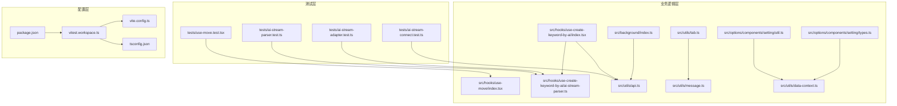
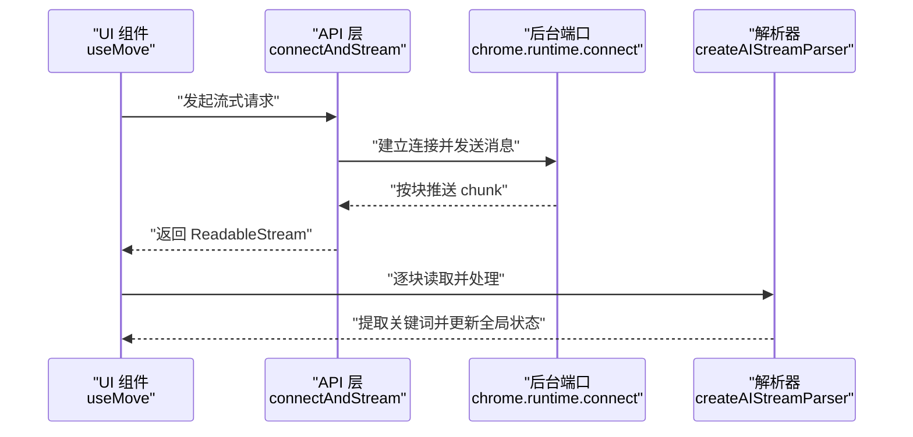
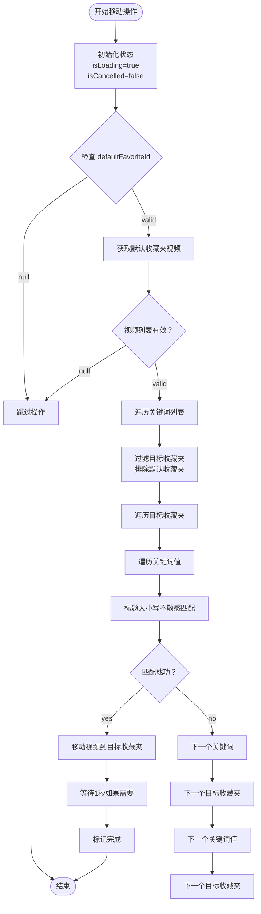
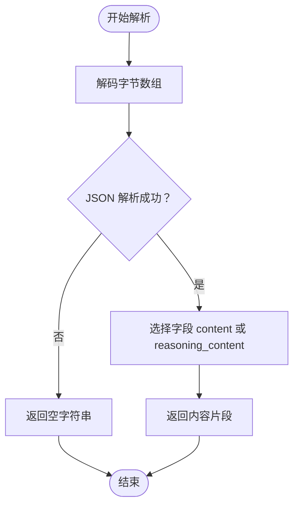
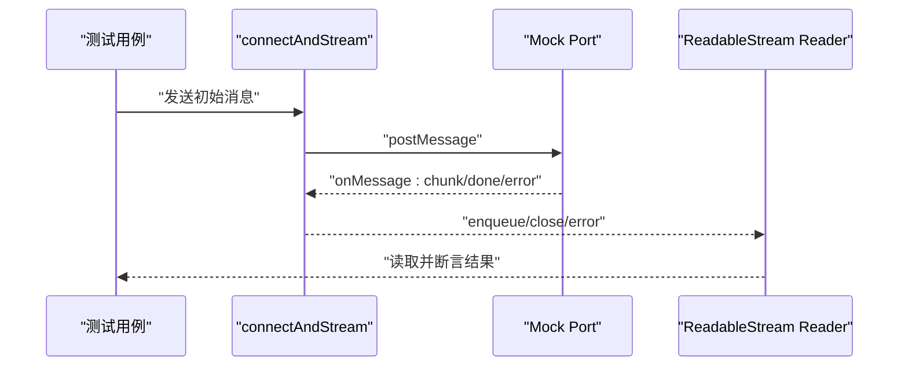
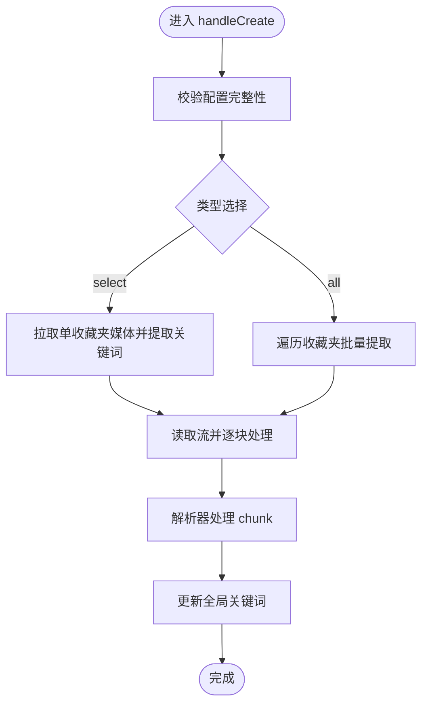
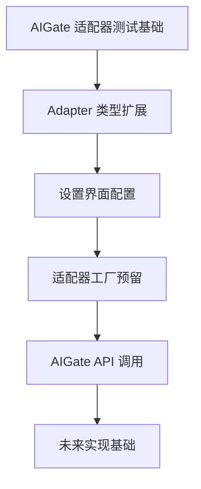
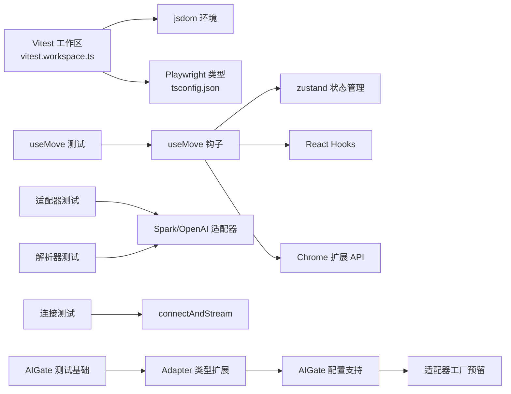

# 测试策略与实践

<cite>
**本文引用的文件**
- [vitest.workspace.ts](file://vitest.workspace.ts)
- [package.json](file://package.json)
- [vite.config.ts](file://vite.config.ts)
- [tsconfig.json](file://tsconfig.json)
- [README.md](file://README.md)
- [tests/use-move.test.tsx](file://tests/use-move.test.tsx)
- [tests/ai-stream-parser.test.ts](file://tests/ai-stream-parser.test.ts)
- [tests/ai-stream-adapter.test.ts](file://tests/ai-stream-adapter.test.ts)
- [tests/ai-stream-connect.test.ts](file://tests/ai-stream-connect.test.ts)
- [src/hooks/use-move/index.tsx](file://src/hooks/use-move/index.tsx)
- [src/hooks/use-create-keyword-by-ai/ai-stream-parser.ts](file://src/hooks/use-create-keyword-by-ai/ai-stream-parser.ts)
- [src/hooks/use-create-keyword-by-ai/index.tsx](file://src/hooks/use-create-keyword-by-ai/index.tsx)
- [src/utils/api.ts](file://src/utils/api.ts)
- [src/utils/tab.ts](file://src/utils/tab.ts)
- [src/utils/message.ts](file://src/utils/message.ts)
- [src/utils/data-context.ts](file://src/utils/data-context.ts)
- [src/options/components/setting/util.ts](file://src/options/components/setting/util.ts)
- [src/options/components/setting/types.ts](file://src/options/components/setting/types.ts)
- [src/background/index.ts](file://src/background/index.ts)
- [.github/workflows/release.yml](file://.github/workflows/release.yml)
</cite>

## 目录
1. [引言](#引言)
2. [项目结构](#项目结构)
3. [核心组件](#核心组件)
4. [架构总览](#架构总览)
5. [详细组件分析](#详细组件分析)
6. [依赖分析](#依赖分析)
7. [性能考量](#性能考量)
8. [故障排查指南](#故障排查指南)
9. [结论](#结论)
10. [附录](#附录)

## 引言
本测试策略文档面向"B站收藏夹整理工具"项目，系统阐述如何基于 Vitest 框架构建完善的测试体系，覆盖单元测试、异步与流式测试、错误处理测试、集成测试与端到端测试，并说明覆盖率生成与分析、测试数据准备、测试环境配置以及在持续集成中的测试执行流程。文档以现有测试用例为蓝本，结合代码实现细节，给出可操作的规范与最佳实践。

**更新** 本版本特别增强了对 useMove 钩子的完整单元测试套件支持，包含600+行详细测试用例，涵盖初始状态、关键词匹配、多目标收藏夹操作、大小写不敏感匹配、取消处理、错误场景和边界情况等全面测试覆盖。

## 项目结构
项目采用 Vite + React + TypeScript 技术栈，测试位于 tests 目录下，核心业务逻辑集中在 src 相关模块。测试运行通过 Vitest 工作区配置统一管理，支持 jsdom 环境与浏览器模式（Playwright）。

**图示来源**
- [vitest.workspace.ts:1-15](file://vitest.workspace.ts#L1-L15)
- [vite.config.ts:1-44](file://vite.config.ts#L1-L44)
- [tsconfig.json:1-44](file://tsconfig.json#L1-L44)
- [package.json:17-28](file://package.json#L17-L28)

**章节来源**
- [vitest.workspace.ts:1-15](file://vitest.workspace.ts#L1-L15)
- [vite.config.ts:1-44](file://vite.config.ts#L1-L44)
- [tsconfig.json:1-44](file://tsconfig.json#L1-L44)
- [package.json:17-28](file://package.json#L17-L28)

## 核心组件
- **新增** useMove 钩子：负责收藏夹视频移动操作，包含关键词匹配、多目标收藏夹处理、取消操作、加载状态管理等功能。
- AI 流解析器与适配器：负责解析不同模型的 SSE 流数据，提取关键词并维护缓冲区状态。
- 流式连接与读取：封装 chrome.runtime.connect 的长连接，将后台返回的 chunk 组装为可读流。
- 关键词提取 Hook：整合配置、流解析与全局状态，驱动关键词提取流程。
- **新增** AIGate 配置管理：支持 AIGate 用户标识和 API Key 配置，提供免费额度模式。

**章节来源**
- [src/hooks/use-move/index.tsx:1-161](file://src/hooks/use-move/index.tsx#L1-L161)
- [src/hooks/use-create-keyword-by-ai/ai-stream-parser.ts:1-278](file://src/hooks/use-create-keyword-by-ai/ai-stream-parser.ts#L1-L278)
- [src/hooks/use-create-keyword-by-ai/index.tsx:1-170](file://src/hooks/use-create-keyword-by-ai/index.tsx#L1-L170)
- [src/utils/api.ts:176-232](file://src/utils/api.ts#L176-L232)
- [src/utils/tab.ts:1-93](file://src/utils/tab.ts#L1-L93)
- [src/utils/message.ts:1-20](file://src/utils/message.ts#L1-L20)
- [src/utils/data-context.ts:1-33](file://src/utils/data-context.ts#L1-L33)
- [src/options/components/setting/util.ts:1-35](file://src/options/components/setting/util.ts#L1-L35)

## 架构总览
下图展示了从 UI 触发到流式解析的关键调用链路，以及测试覆盖点：

**图示来源**
- [src/hooks/use-create-keyword-by-ai/index.tsx:21-74](file://src/hooks/use-create-keyword-by-ai/index.tsx#L21-L74)
- [src/utils/api.ts:180-232](file://src/utils/api.ts#L180-L232)
- [src/hooks/use-create-keyword-by-ai/ai-stream-parser.ts:221-277](file://src/hooks/use-create-keyword-by-ai/ai-stream-parser.ts#L221-L277)

## 详细组件分析

### useMove 钩子测试套件
**新增** 本节详细介绍 useMove 钩子的完整单元测试套件，包含600+行详细测试用例，涵盖：
- 初始状态验证：isLoadingElement 和 handleMove 函数的正确初始化
- 关键词匹配逻辑：大小写不敏感匹配、多关键词处理、跨收藏夹匹配
- 多目标收藏夹操作：同时处理多个目标收藏夹的关键词
- 取消操作：实时取消正在进行的移动操作
- 错误处理：API 调用失败、网络错误、数据获取异常等场景
- 边界情况：空视频列表、空关键词列表、不存在的目标收藏夹等
- 加载状态管理：执行期间的 loading 状态和完成动画

**图示来源**
- [src/hooks/use-move/index.tsx:27-124](file://src/hooks/use-move/index.tsx#L27-L124)
- [src/hooks/use-move/index.tsx:126-152](file://src/hooks/use-move/index.tsx#L126-L152)

**章节来源**
- [tests/use-move.test.tsx:1-607](file://tests/use-move.test.tsx#L1-L607)
- [src/hooks/use-move/index.tsx:1-161](file://src/hooks/use-move/index.tsx#L1-L161)

### AI 流解析器与适配器测试
本节解析现有解析器与适配器的测试用例，涵盖：
- SSE 数据解析（content 与 reasoning_content 优先级）
- 错误输入与边界条件处理
- 缓冲区关键词提取与跨 chunk 拼接
- 适配器工厂与类型选择

**更新** 增强了对 AIGate 适配器类型的测试基础支持，为未来实现预留测试框架。

**图示来源**
- [src/hooks/use-create-keyword-by-ai/ai-stream-parser.ts:39-73](file://src/hooks/use-create-keyword-by-ai/ai-stream-parser.ts#L39-L73)
- [src/hooks/use-create-keyword-by-ai/ai-stream-parser.ts:100-103](file://src/hooks/use-create-keyword-by-ai/ai-stream-parser.ts#L100-L103)

**章节来源**
- [tests/ai-stream-adapter.test.ts:1-129](file://tests/ai-stream-adapter.test.ts#L1-L129)
- [tests/ai-stream-parser.test.ts:1-243](file://tests/ai-stream-parser.test.ts#L1-L243)
- [src/hooks/use-create-keyword-by-ai/ai-stream-parser.ts:1-278](file://src/hooks/use-create-keyword-by-ai/ai-stream-parser.ts#L1-L278)

### 流式连接与读取测试
本节解析现有连接与读取测试用例，涵盖：
- 正常连接、消息监听与断开
- 多 chunk 拼接与顺序保证
- done/error/abort 等终止信号处理
- toReadableStream 实例一致性
- fetchAIMove 场景的 JSON 流解析

**图示来源**
- [tests/ai-stream-connect.test.ts:55-88](file://tests/ai-stream-connect.test.ts#L55-L88)
- [src/utils/api.ts:180-232](file://src/utils/api.ts#L180-L232)

**章节来源**
- [tests/ai-stream-connect.test.ts:1-307](file://tests/ai-stream-connect.test.ts#L1-L307)
- [src/utils/api.ts:176-232](file://src/utils/api.ts#L176-L232)

### 关键词提取流程测试
本节解析关键词提取 Hook 的测试要点，包括：
- 配置校验与异常提示
- 单收藏夹与全量处理
- 流式读取与解析器 flush
- 全局状态更新与回调触发

**图示来源**
- [src/hooks/use-create-keyword-by-ai/index.tsx:21-154](file://src/hooks/use-create-keyword-by-ai/index.tsx#L21-L154)
- [src/hooks/use-create-keyword-by-ai/ai-stream-parser.ts:221-277](file://src/hooks/use-create-keyword-by-ai/ai-stream-parser.ts#L221-L277)

**章节来源**
- [src/hooks/use-create-keyword-by-ai/index.tsx:1-170](file://src/hooks/use-create-keyword-by-ai/index.tsx#L1-L170)
- [src/hooks/use-create-keyword-by-ai/ai-stream-parser.ts:148-179](file://src/hooks/use-create-keyword-by-ai/ai-stream-parser.ts#L148-L179)

### AIGate 适配器测试基础
**新增** 本节介绍为 AIGate 适配器提供的测试基础，包括：
- Adapter 类型扩展支持 'aigate' 选项
- 设置界面配置字段支持 AIGate 用户标识和 API Key
- 适配器工厂函数预留 AIGate 类型处理
- AIGate API 调用函数支持免费额度模式

**图示来源**
- [src/utils/data-context.ts:1-33](file://src/utils/data-context.ts#L1-L33)
- [src/options/components/setting/util.ts:1-35](file://src/options/components/setting/util.ts#L1-L35)
- [src/utils/api.ts:265-277](file://src/utils/api.ts#L265-L277)

**章节来源**
- [src/utils/data-context.ts:1-33](file://src/utils/data-context.ts#L1-L33)
- [src/options/components/setting/util.ts:1-35](file://src/options/components/setting/util.ts#L1-L35)
- [src/utils/api.ts:265-277](file://src/utils/api.ts#L265-L277)

## 依赖分析
- 测试运行环境：Vitest 工作区配置启用 jsdom，支持 DOM API；tsconfig 注入 @vitest/browser/providers/playwright 类型，便于浏览器模式测试。
- 依赖关系：测试对业务模块的直接依赖清晰，适配器与解析器相互独立，利于单元测试隔离。
- 外部依赖：Playwright、jsdom、@testing-library/react 等为测试生态提供支撑。
- **新增** useMove 钩子依赖：useMove 钩子依赖 zustand 状态管理、React hooks、Chrome 扩展 API 等多个外部依赖。
- **新增** AIGate 依赖：Adapter 类型扩展为 AIGate 适配器测试提供基础支持。

**图示来源**
- [vitest.workspace.ts:6-13](file://vitest.workspace.ts#L6-L13)
- [tsconfig.json:23-28](file://tsconfig.json#L23-L28)
- [tests/use-move.test.tsx:1-607](file://tests/use-move.test.tsx#L1-L607)
- [tests/ai-stream-adapter.test.ts:1-129](file://tests/ai-stream-adapter.test.ts#L1-L129)
- [tests/ai-stream-parser.test.ts:1-243](file://tests/ai-stream-parser.test.ts#L1-L243)
- [tests/ai-stream-connect.test.ts:1-307](file://tests/ai-stream-connect.test.ts#L1-L307)
- [src/utils/api.ts:180-232](file://src/utils/api.ts#L180-L232)
- [src/utils/data-context.ts:1-33](file://src/utils/data-context.ts#L1-L33)

**章节来源**
- [vitest.workspace.ts:1-15](file://vitest.workspace.ts#L1-L15)
- [tsconfig.json:23-28](file://tsconfig.json#L23-L28)

## 性能考量
- 流式读取与缓冲区管理：解析器通过缓冲区增量提取关键词，避免频繁全局状态写入，建议在测试中验证大块数据与跨 chunk 拆分场景。
- 适配器选择：根据配置动态选择适配器，测试应覆盖 spark/openai/custom/aigate 四类路径，确保默认行为与扩展性。
- **新增** useMove 性能优化：useMove 钩子实现了取消机制和防抖处理，测试应验证大量视频处理时的性能表现。
- 断言粒度：针对高频调用的解析逻辑，使用更细粒度的断言（如 shouldSkipContent、extractKeywordFromBuffer）以降低回归风险。
- **新增** AIGate 适配器性能：为 AIGate 适配器预留性能测试框架，包括流式数据处理和错误恢复机制。

## 故障排查指南
- 流式错误处理：检查 connectAndStream 对 error 消息的传播与断开逻辑，确保异常能被上层捕获并提示。
- JSON 解析失败：适配器在 JSON 解析失败时返回空字符串，测试需覆盖无效 JSON、缺失字段等边界。
- 状态更新幂等：addKeywordToGlobalData 需避免重复关键词，测试应验证去重逻辑。
- **新增** useMove 错误处理：检查 useMove 钩子的错误提示机制，确保网络错误、API 调用失败等场景的正确处理。
- **新增** useMove 取消机制：验证取消按钮的禁用状态和取消标志位的正确设置。
- 环境差异：jsdom 与浏览器模式差异可能导致某些 API 不可用，必要时使用浏览器模式测试关键交互。
- **新增** AIGate 配置错误：检查 AIGate 用户标识和 API Key 配置的有效性，确保免费额度模式正常工作。

**章节来源**
- [tests/ai-stream-connect.test.ts:158-171](file://tests/ai-stream-connect.test.ts#L158-L171)
- [src/hooks/use-create-keyword-by-ai/ai-stream-parser.ts:39-73](file://src/hooks/use-create-keyword-by-ai/ai-stream-parser.ts#L39-L73)
- [src/hooks/use-create-keyword-by-ai/ai-stream-parser.ts:148-179](file://src/hooks/use-create-keyword-by-ai/ai-stream-parser.ts#L148-L179)
- [tests/use-move.test.tsx:420-476](file://tests/use-move.test.tsx#L420-L476)

## 结论
本项目已具备较为完善的 AI 流解析与连接测试基础，**更新** 特别增强了对 useMove 钩子的完整单元测试套件支持，包含600+行详细测试用例。建议在此基础上进一步扩展：
- 补充浏览器模式测试，覆盖真实扩展上下文。
- 增加集成测试，验证 UI 与解析器协作的端到端流程。
- 引入覆盖率阈值与报告分析，持续改进测试质量。
- **新增** 为 useMove 钩子的取消机制和加载状态管理增加专门的测试套件。
- **新增** 为 AIGate 适配器类实现创建专门的测试套件，确保新功能的稳定性。

## 附录

### Vitest 配置与使用
- 工作区配置：通过工作区文件统一 include/globals/environment，便于扩展更多测试套件。
- 运行脚本：提供 test:browser 与 coverage 命令，分别用于浏览器模式与覆盖率生成。
- 构建与别名：Vite 配置提供别名与产物优化，保障测试与生产一致。

**章节来源**
- [vitest.workspace.ts:6-13](file://vitest.workspace.ts#L6-L13)
- [package.json:25-26](file://package.json#L25-L26)
- [vite.config.ts:30-33](file://vite.config.ts#L30-L33)

### 单元测试编写规范
- 文件组织：按功能模块划分测试文件，命名遵循 {module}.test.ts。
- 断言库：使用 Vitest 内置 expect，配合 describe/it/beforeEach/afterEach。
- Mock 策略：对 chrome.runtime、IndexedDB、全局状态等外部依赖进行合理 Mock，确保测试可重复。
- **新增** useMove 测试规范：使用 @testing-library/react 进行组件测试，合理 Mock zustand 状态管理。

### 异步与流式测试
- ReadableStream：使用 toReadableStream 获取流并逐块读取，验证拼接与顺序。
- 端口通信：通过自定义 Port 模拟 onMessage/onDisconnect，验证错误与完成信号。
- 超时与取消：对取消与超时场景进行断言，确保资源释放。
- **新增** useMove 异步测试：验证 handleMove 函数的异步执行和状态更新。

### 错误处理测试
- 无效输入：JSON 解析失败、空 chunk、缺失字段等。
- 异常传播：error 消息应导致流错误并断开连接。
- 边界条件：空数组、空字符串、特殊字符等。
- **新增** useMove 错误处理：验证 API 调用失败、网络错误、数据获取异常等场景。

### 集成测试与端到端测试
- 集成测试：组合 useCreateKeywordByAi 与解析器，验证从 UI 到全局状态的完整链路。
- 端到端测试：在浏览器模式下运行，模拟真实扩展交互，覆盖关键用户路径。
- **新增** useMove 集成测试：验证从 UI 触发到视频移动的完整流程。

### 覆盖率报告生成与分析
- 生成命令：通过 coverage 脚本运行 Vitest 并输出覆盖率。
- 分析建议：关注关键分支与路径的覆盖率，优先补齐高风险区域。
- **新增** useMove 覆盖率：重点关注状态管理、错误处理和取消机制的覆盖率。

### 测试数据准备与环境配置
- 测试数据：构造典型 JSON 片段与跨 chunk 场景，确保解析器与连接器的健壮性。
- 环境变量：在 CI 中注入必要的 API Key 与模型配置，避免真实网络请求。
- **新增** useMove 测试数据：准备多种视频标题、关键词组合和收藏夹配置。

### 持续集成中的测试执行
- 工作流：release 工作流未包含测试步骤，可在构建后追加测试与覆盖率任务。
- 最佳实践：在 PR 中要求最小覆盖率阈值，确保新改动具备基本测试保障。
- **新增** useMove CI 集成：在持续集成中运行完整的测试套件，包括 useMove 测试。

### useMove 钩子测试套件详解
**新增** 本节详细介绍 useMove 钩子的完整测试策略：

#### 初始状态测试
- 验证 isLoadingElement 和 handleMove 函数的正确初始化
- 检查初始加载状态的样式类和可见性
- 确保默认收藏夹 ID 为 null 时不执行任何操作

#### 关键词匹配测试
- 大小写不敏感匹配：验证 "React" 和 "react" 的等价匹配
- 多关键词处理：同时处理多个关键词并正确匹配
- 跨收藏夹匹配：验证多个目标收藏夹的关键词处理
- 跳过默认收藏夹：确保不会将视频移动到默认收藏夹

#### 取消操作测试
- 实时取消：验证取消按钮的点击能够中断正在进行的操作
- 取消状态：检查取消标志位和按钮禁用状态
- 资源清理：确保取消后正确清理状态和资源

#### 错误处理测试
- API 调用失败：验证网络错误的正确处理和提示
- 数据获取异常：检查 fetchAllFavoriteMedias 返回 null 的处理
- Toast 提示：验证错误消息的正确显示

#### 边界情况测试
- 空视频列表：验证空列表时的正确处理
- 空关键词列表：检查无关键词时的处理逻辑
- 不存在的目标收藏夹：验证目标收藏夹不存在时的跳过逻辑

#### 加载状态测试
- 执行期间显示：验证操作执行期间的加载状态
- 完成动画：检查完成后完成动画的正确显示
- 状态重置：确保操作完成后状态的正确重置

**章节来源**
- [.github/workflows/release.yml:1-101](file://.github/workflows/release.yml#L1-L101)
- [README.md:100-132](file://README.md#L100-L132)
- [src/hooks/use-move/index.tsx:1-161](file://src/hooks/use-move/index.tsx#L1-L161)
- [src/utils/data-context.ts:1-33](file://src/utils/data-context.ts#L1-L33)
- [src/options/components/setting/util.ts:1-35](file://src/options/components/setting/util.ts#L1-L35)
- [src/utils/api.ts:265-277](file://src/utils/api.ts#L265-L277)