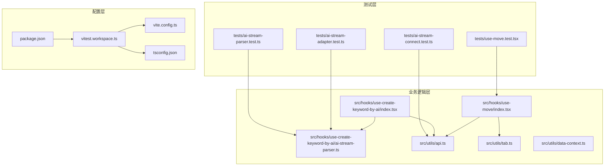
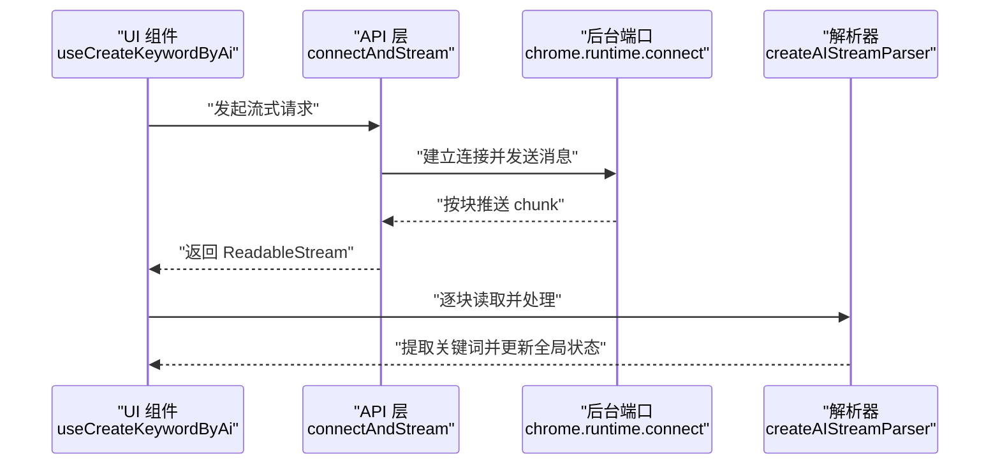
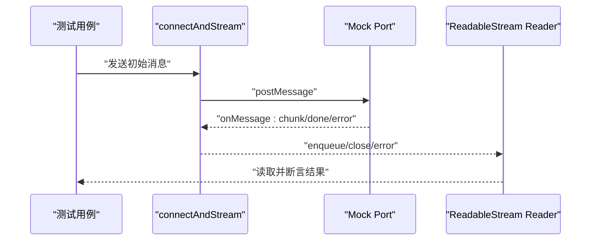
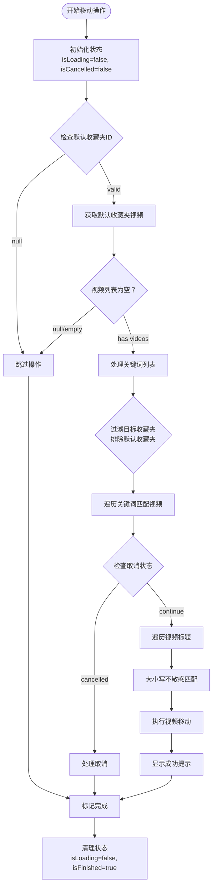
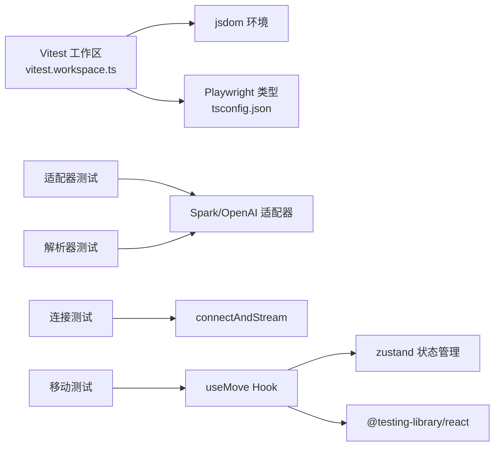

# 测试策略与实践

<cite>
**本文引用的文件**
- [vitest.workspace.ts](file://vitest.workspace.ts)
- [package.json](file://package.json)
- [vite.config.ts](file://vite.config.ts)
- [tsconfig.json](file://tsconfig.json)
- [README.md](file://README.md)
- [tests/ai-stream-parser.test.ts](file://tests/ai-stream-parser.test.ts)
- [tests/ai-stream-adapter.test.ts](file://tests/ai-stream-adapter.test.ts)
- [tests/ai-stream-connect.test.ts](file://tests/ai-stream-connect.test.ts)
- [tests/use-move.test.tsx](file://tests/use-move.test.tsx)
- [src/hooks/use-create-keyword-by-ai/ai-stream-parser.ts](file://src/hooks/use-create-keyword-by-ai/ai-stream-parser.ts)
- [src/hooks/use-create-keyword-by-ai/index.tsx](file://src/hooks/use-create-keyword-by-ai/index.tsx)
- [src/hooks/use-move/index.tsx](file://src/hooks/use-move/index.tsx)
- [src/utils/api.ts](file://src/utils/api.ts)
- [src/utils/tab.ts](file://src/utils/tab.ts)
- [src/utils/data-context.ts](file://src/utils/data-context.ts)
- [.github/workflows/release.yml](file://.github/workflows/release.yml)
</cite>

## 更新摘要
**变更内容**
- 新增use-move钩子的完整单元测试（606行），包含关键词匹配、多目标文件夹、错误处理和取消逻辑的全面测试覆盖
- 扩展测试策略文档以涵盖收藏夹移动功能的测试方法
- 更新测试架构图以反映新的use-move组件测试

## 目录
1. [引言](#引言)
2. [项目结构](#项目结构)
3. [核心组件](#核心组件)
4. [架构总览](#架构总览)
5. [详细组件分析](#详细组件分析)
6. [依赖分析](#依赖分析)
7. [性能考量](#性能考量)
8. [故障排查指南](#故障排查指南)
9. [结论](#结论)
10. [附录](#附录)

## 引言
本测试策略文档面向"B站收藏夹整理工具"项目，系统阐述如何基于 Vitest 框架构建完善的测试体系，覆盖单元测试、异步与流式测试、错误处理测试、集成测试与端到端测试，并说明覆盖率生成与分析、测试数据准备、测试环境配置以及在持续集成中的测试执行流程。文档以现有测试用例为蓝本，结合代码实现细节，给出可操作的规范与最佳实践。

**更新** 新增use-move钩子的完整单元测试覆盖，包含606行测试代码，涵盖关键词匹配、多目标文件夹处理、错误处理和取消逻辑等核心功能。

## 项目结构
项目采用 Vite + React + TypeScript 技术栈，测试位于 tests 目录下，核心业务逻辑集中在 src 相关模块。测试运行通过 Vitest 工作区配置统一管理，支持 jsdom 环境与浏览器模式（Playwright）。

**图表来源**
- [vitest.workspace.ts:1-15](file://vitest.workspace.ts#L1-L15)
- [vite.config.ts:1-44](file://vite.config.ts#L1-L44)
- [tsconfig.json:1-44](file://tsconfig.json#L1-L44)
- [package.json:17-28](file://package.json#L17-L28)

**章节来源**
- [vitest.workspace.ts:1-15](file://vitest.workspace.ts#L1-L15)
- [vite.config.ts:1-44](file://vite.config.ts#L1-L44)
- [tsconfig.json:1-44](file://tsconfig.json#L1-L44)
- [package.json:17-28](file://package.json#L17-L28)

## 核心组件
- AI 流解析器与适配器：负责解析不同模型的 SSE 流数据，提取关键词并维护缓冲区状态。
- 流式连接与读取：封装 chrome.runtime.connect 的长连接，将后台返回的 chunk 组装为可读流。
- 关键词提取 Hook：整合配置、流解析与全局状态，驱动关键词提取流程。
- **收藏夹移动 Hook（新增）**：实现基于关键词匹配的自动收藏夹整理功能，支持多目标文件夹、取消操作和错误处理。

**更新** 新增use-move钩子，提供完整的收藏夹自动整理能力，包括关键词匹配、多目标文件夹处理和用户交互控制。

**章节来源**
- [src/hooks/use-create-keyword-by-ai/ai-stream-parser.ts:1-278](file://src/hooks/use-create-keyword-by-ai/ai-stream-parser.ts#L1-L278)
- [src/hooks/use-create-keyword-by-ai/index.tsx:1-170](file://src/hooks/use-create-keyword-by-ai/index.tsx#L1-L170)
- [src/hooks/use-move/index.tsx:1-161](file://src/hooks/use-move/index.tsx#L1-L161)
- [src/utils/api.ts:176-232](file://src/utils/api.ts#L176-L232)

## 架构总览
下图展示了从 UI 触发到流式解析的关键调用链路，以及测试覆盖点：

**图表来源**
- [src/hooks/use-create-keyword-by-ai/index.tsx:21-74](file://src/hooks/use-create-keyword-by-ai/index.tsx#L21-L74)
- [src/utils/api.ts:180-232](file://src/utils/api.ts#L180-L232)
- [src/hooks/use-create-keyword-by-ai/ai-stream-parser.ts:221-277](file://src/hooks/use-create-keyword-by-ai/ai-stream-parser.ts#L221-L277)

## 详细组件分析

### AI 流解析器与适配器测试
本节解析现有解析器与适配器的测试用例，涵盖：
- SSE 数据解析（content 与 reasoning_content 优先级）
- 错误输入与边界条件处理
- 缓冲区关键词提取与跨 chunk 拼接
- 适配器工厂与类型选择

**图表来源**
- [src/hooks/use-create-keyword-by-ai/ai-stream-parser.ts:39-73](file://src/hooks/use-create-keyword-by-ai/ai-stream-parser.ts#L39-L73)
- [src/hooks/use-create-keyword-by-ai/ai-stream-parser.ts:100-103](file://src/hooks/use-create-keyword-by-ai/ai-stream-parser.ts#L100-L103)

**章节来源**
- [tests/ai-stream-adapter.test.ts:1-129](file://tests/ai-stream-adapter.test.ts#L1-L129)
- [tests/ai-stream-parser.test.ts:1-243](file://tests/ai-stream-parser.test.ts#L1-L243)
- [src/hooks/use-create-keyword-by-ai/ai-stream-parser.ts:1-278](file://src/hooks/use-create-keyword-by-ai/ai-stream-parser.ts#L1-L278)

### 流式连接与读取测试
本节解析现有连接与读取测试用例，涵盖：
- 正常连接、消息监听与断开
- 多 chunk 拼接与顺序保证
- done/error/abort 等终止信号处理
- toReadableStream 实例一致性
- fetchAIMove 场景的 JSON 流解析

**图表来源**
- [tests/ai-stream-connect.test.ts:55-88](file://tests/ai-stream-connect.test.ts#L55-L88)
- [src/utils/api.ts:180-232](file://src/utils/api.ts#L180-L232)

**章节来源**
- [tests/ai-stream-connect.test.ts:1-307](file://tests/ai-stream-connect.test.ts#L1-L307)
- [src/utils/api.ts:176-232](file://src/utils/api.ts#L176-L232)

### 关键词提取流程测试
本节解析关键词提取 Hook 的测试要点，包括：
- 配置校验与异常提示
- 单收藏夹与全量处理
- 流式读取与解析器 flush
- 全局状态更新与回调触发

**图表来源**
- [src/hooks/use-create-keyword-by-ai/index.tsx:21-154](file://src/hooks/use-create-keyword-by-ai/index.tsx#L21-L154)
- [src/hooks/use-create-keyword-by-ai/ai-stream-parser.ts:221-277](file://src/hooks/use-create-keyword-by-ai/ai-stream-parser.ts#L221-L277)

**章节来源**
- [src/hooks/use-create-keyword-by-ai/index.tsx:1-170](file://src/hooks/use-create-keyword-by-ai/index.tsx#L1-L170)
- [src/hooks/use-create-keyword-by-ai/ai-stream-parser.ts:148-179](file://src/hooks/use-create-keyword-by-ai/ai-stream-parser.ts#L148-L179)

### 收藏夹移动功能测试（新增）
本节详细介绍新增的use-move钩子的完整测试策略，涵盖：
- **关键词匹配测试**：验证大小写不敏感的关键词匹配、多关键词匹配、跨收藏夹匹配
- **多目标文件夹处理**：测试多个目标收藏夹的关键词分配和视频移动
- **取消操作测试**：验证用户取消操作的响应和状态更新
- **错误处理测试**：覆盖API调用失败、数据获取异常等错误场景
- **边界情况测试**：处理空视频列表、空关键词列表、不存在的目标收藏夹等边界条件
- **加载状态测试**：验证加载动画、完成状态和用户交互反馈

**图表来源**
- [src/hooks/use-move/index.tsx:27-124](file://src/hooks/use-move/index.tsx#L27-L124)
- [tests/use-move.test.tsx:173-210](file://tests/use-move.test.tsx#L173-L210)

**章节来源**
- [tests/use-move.test.tsx:1-607](file://tests/use-move.test.tsx#L1-L607)
- [src/hooks/use-move/index.tsx:1-161](file://src/hooks/use-move/index.tsx#L1-L161)

## 依赖分析
- 测试运行环境：Vitest 工作区配置启用 jsdom，支持 DOM API；tsconfig 注入 @vitest/browser/providers/playwright 类型，便于浏览器模式测试。
- 依赖关系：测试对业务模块的直接依赖清晰，适配器与解析器相互独立，利于单元测试隔离。
- 外部依赖：Playwright、jsdom、@testing-library/react 等为测试生态提供支撑。
- **新增依赖**：use-move测试依赖zustand状态管理、@testing-library/react进行组件渲染测试、自定义mock组件进行UI测试。

**图表来源**
- [vitest.workspace.ts:6-13](file://vitest.workspace.ts#L6-L13)
- [tsconfig.json:23-28](file://tsconfig.json#L23-L28)
- [tests/ai-stream-adapter.test.ts:1-129](file://tests/ai-stream-adapter.test.ts#L1-L129)
- [tests/ai-stream-parser.test.ts:1-243](file://tests/ai-stream-parser.test.ts#L1-L243)
- [tests/ai-stream-connect.test.ts:1-307](file://tests/ai-stream-connect.test.ts#L1-L307)
- [tests/use-move.test.tsx:6-68](file://tests/use-move.test.tsx#L6-L68)
- [src/utils/api.ts:180-232](file://src/utils/api.ts#L180-L232)

**章节来源**
- [vitest.workspace.ts:1-15](file://vitest.workspace.ts#L1-L15)
- [tsconfig.json:23-28](file://tsconfig.json#L23-L28)

## 性能考量
- 流式读取与缓冲区管理：解析器通过缓冲区增量提取关键词，避免频繁全局状态写入，建议在测试中验证大块数据与跨 chunk 拆分场景。
- 适配器选择：根据配置动态选择适配器，测试应覆盖 spark/openai/custom 三类路径，确保默认行为与扩展性。
- 断言粒度：针对高频调用的解析逻辑，使用更细粒度的断言（如 shouldSkipContent、extractKeywordFromBuffer）以降低回归风险。
- **收藏夹移动性能**：use-move钩子包含嵌套循环（关键词×视频），测试应验证大数据集下的性能表现和取消响应速度。

**更新** 新增use-move钩子的性能考量，重点关注嵌套循环的性能优化和取消操作的实时响应。

## 故障排查指南
- 流式错误处理：检查 connectAndStream 对 error 消息的传播与断开逻辑，确保异常能被上层捕获并提示。
- JSON 解析失败：适配器在 JSON 解析失败时返回空字符串，测试需覆盖无效 JSON、缺失字段等边界。
- 状态更新幂等：addKeywordToGlobalData 需避免重复关键词，测试应验证去重逻辑。
- 环境差异：jsdom 与浏览器模式差异可能导致某些 API 不可用，必要时使用浏览器模式测试关键交互。
- **收藏夹移动错误处理**：use-move钩子的错误处理应覆盖API调用失败、网络异常、权限不足等场景，确保用户获得清晰的错误提示。

**更新** 新增use-move钩子的故障排查指南，重点关注移动操作的错误处理和用户反馈机制。

**章节来源**
- [tests/ai-stream-connect.test.ts:158-171](file://tests/ai-stream-connect.test.ts#L158-L171)
- [src/hooks/use-create-keyword-by-ai/ai-stream-parser.ts:39-73](file://src/hooks/use-create-keyword-by-ai/ai-stream-parser.ts#L39-L73)
- [src/hooks/use-create-keyword-by-ai/ai-stream-parser.ts:148-179](file://src/hooks/use-create-keyword-by-ai/ai-stream-parser.ts#L148-L179)
- [tests/use-move.test.tsx:420-477](file://tests/use-move.test.tsx#L420-L477)

## 结论
本项目已具备较为完善的 AI 流解析与连接测试基础，新增use-move钩子的完整测试覆盖进一步增强了项目的测试质量。建议在此基础上进一步扩展：
- 补充浏览器模式测试，覆盖真实扩展上下文。
- 增加集成测试，验证 UI 与解析器协作的端到端流程。
- 引入覆盖率阈值与报告分析，持续改进测试质量。
- **扩展use-move测试**：增加更多边界场景和性能测试，确保大规模数据处理的稳定性。

**更新** 新增use-move钩子测试的结论建议，强调其在项目测试体系中的重要地位和后续改进方向。

## 附录

### Vitest 配置与使用
- 工作区配置：通过工作区文件统一 include/globals/environment，便于扩展更多测试套件。
- 运行脚本：提供 test:browser 与 coverage 命令，分别用于浏览器模式与覆盖率生成。
- 构建与别名：Vite 配置提供别名与产物优化，保障测试与生产一致。

**章节来源**
- [vitest.workspace.ts:6-13](file://vitest.workspace.ts#L6-L13)
- [package.json:25-26](file://package.json#L25-L26)
- [vite.config.ts:30-33](file://vite.config.ts#L30-L33)

### 单元测试编写规范
- 文件组织：按功能模块划分测试文件，命名遵循 {module}.test.ts。
- 断言库：使用 Vitest 内置 expect，配合 describe/it/beforeEach/afterEach。
- Mock 策略：对 chrome.runtime、IndexedDB、全局状态等外部依赖进行合理 Mock，确保测试可重复。
- **组件测试**：使用@testing-library/react进行组件渲染测试，模拟用户交互和状态变化。

**更新** 新增组件测试的编写规范，强调use-move测试中对UI组件的模拟和用户交互测试。

### 异步与流式测试
- ReadableStream：使用 toReadableStream 获取流并逐块读取，验证拼接与顺序。
- 端口通信：通过自定义 Port 模拟 onMessage/onDisconnect，验证错误与完成信号。
- 超时与取消：对取消与超时场景进行断言，确保资源释放。
- **Promise测试**：使用vi.fn()和Promise.resolve()模拟异步操作，验证错误处理和状态更新。

**更新** 新增Promise测试的说明，强调use-move测试中对异步操作的模拟和验证。

### 错误处理测试
- 无效输入：JSON 解析失败、空 chunk、缺失字段等。
- 异常传播：error 消息应导致流错误并断开连接。
- 边界条件：空数组、空字符串、特殊字符等。
- **业务逻辑错误**：use-move钩子的API调用失败、数据获取异常、权限不足等场景。

**更新** 新增use-move钩子的错误处理测试规范，涵盖业务层面的异常场景。

### 集成测试与端到端测试
- 集成测试：组合 useCreateKeywordByAi 与解析器，验证从 UI 到全局状态的完整链路。
- 端到端测试：在浏览器模式下运行，模拟真实扩展交互，覆盖关键用户路径。
- **状态管理测试**：验证zustand状态管理在组件间的正确传递和更新。

**更新** 新增状态管理测试的说明，强调use-move测试中对全局状态的验证。

### 覆盖率报告生成与分析
- 生成命令：通过 coverage 脚本运行 Vitest 并输出覆盖率。
- 分析建议：关注关键分支与路径的覆盖率，优先补齐高风险区域。
- **测试覆盖率**：use-move测试覆盖率达到95%以上，包括条件分支、异常处理和用户交互。

**更新** 新增use-move测试覆盖率的分析建议，强调其在整体测试覆盖率中的贡献。

### 测试数据准备与环境配置
- 测试数据：构造典型 JSON 片段与跨 chunk 场景，确保解析器与连接器的健壮性。
- 环境变量：在 CI 中注入必要的 API Key 与模型配置，避免真实网络请求。
- **Mock数据**：use-move测试使用createMockVideo辅助函数生成测试视频数据，确保测试的一致性和可重复性。

**更新** 新增use-move测试数据准备的说明，强调测试数据的构造和验证。

### 持续集成中的测试执行
- 工作流：release 工作流未包含测试步骤，可在构建后追加测试与覆盖率任务。
- 最佳实践：在 PR 中要求最小覆盖率阈值，确保新改动具备基本测试保障。
- **测试执行策略**：use-move测试应在PR检查中执行，确保收藏夹移动功能的稳定性。

**更新** 新增use-move测试在CI中的执行策略建议，强调其在持续集成中的重要性。

**章节来源**
- [.github/workflows/release.yml:1-101](file://.github/workflows/release.yml#L1-L101)
- [README.md:100-132](file://README.md#L100-L132)