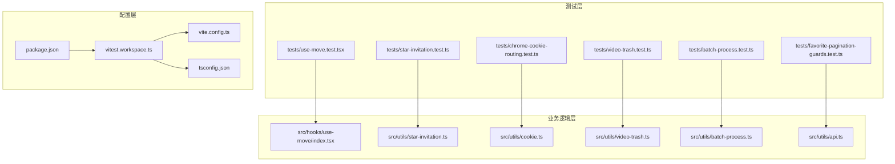
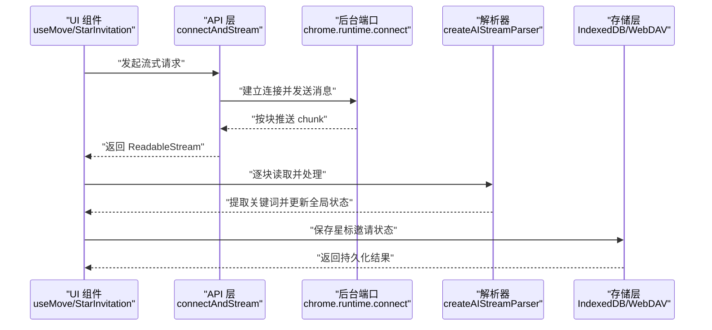
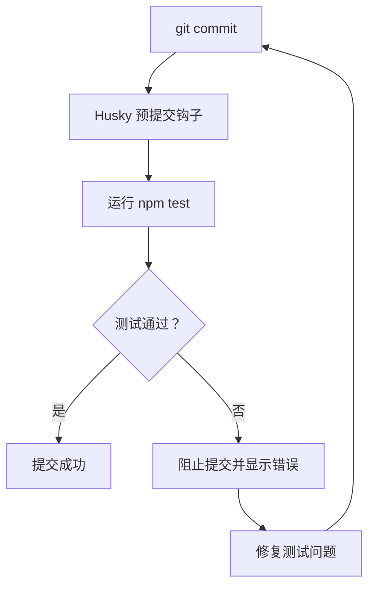
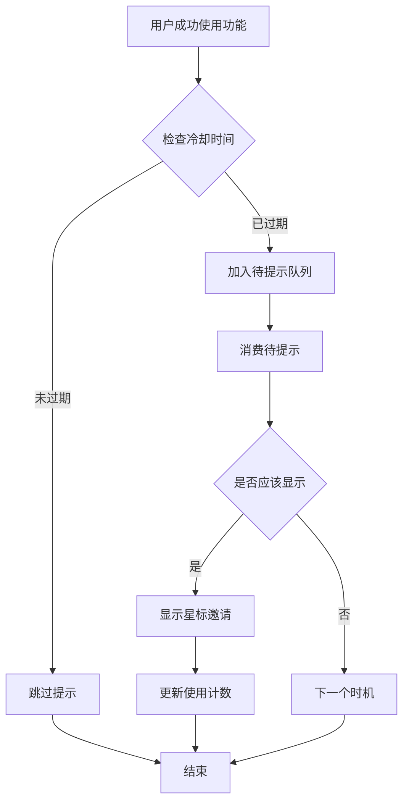
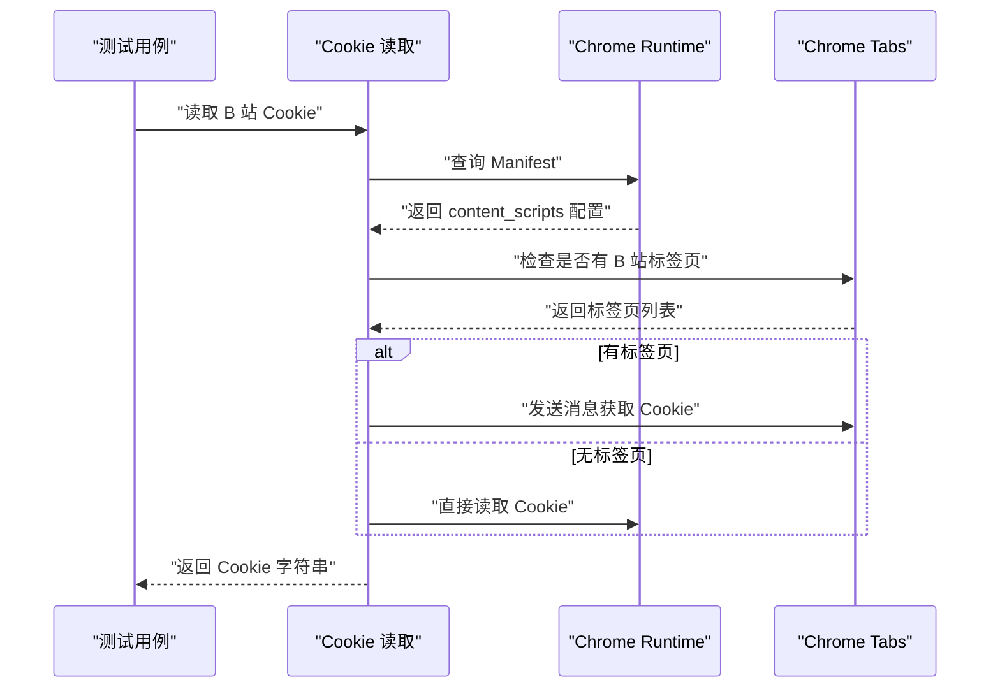
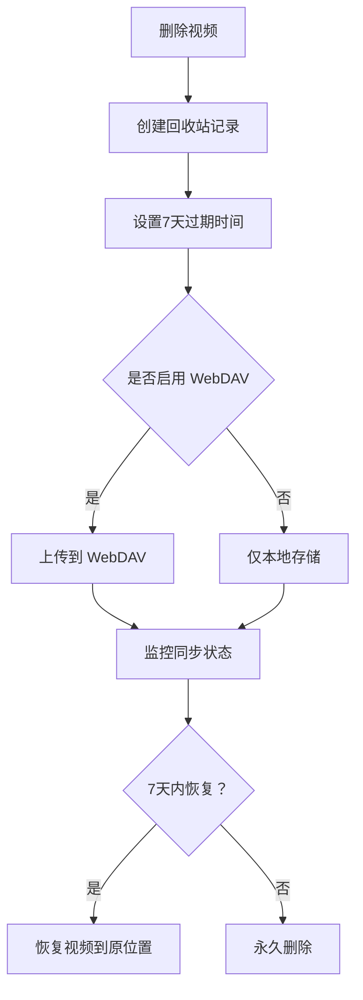
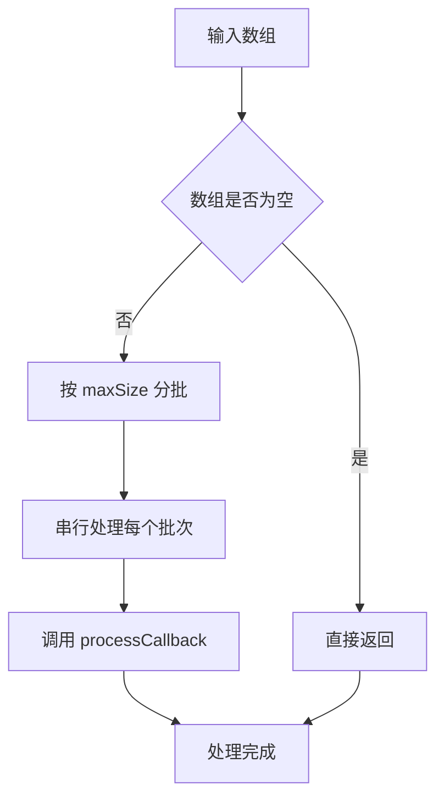
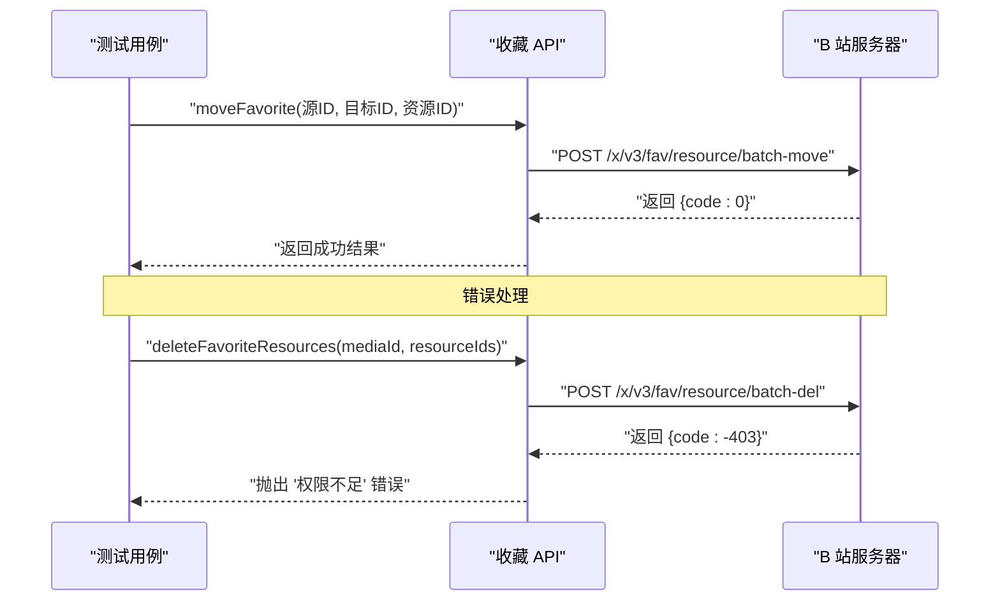
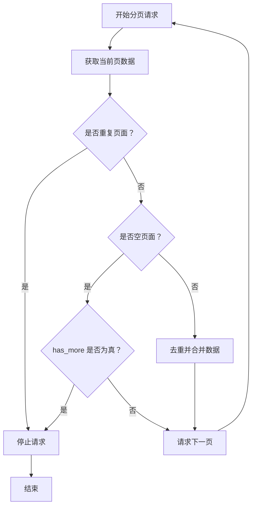
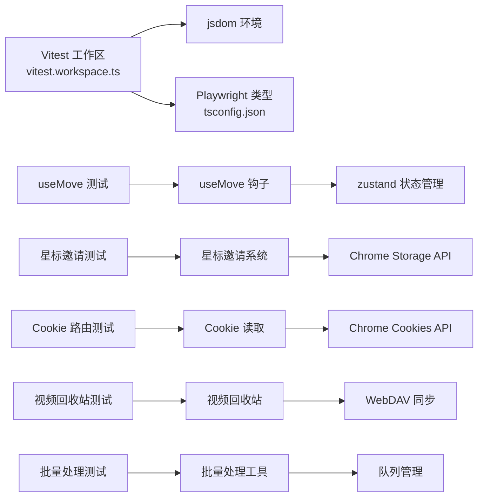

# 测试策略与实践

<cite>
**本文引用的文件**
- [vitest.workspace.ts](file://vitest.workspace.ts)
- [package.json](file://package.json)
- [vite.config.ts](file://vite.config.ts)
- [tsconfig.json](file://tsconfig.json)
- [README.md](file://README.md)
- [tests/use-move.test.tsx](file://tests/use-move.test.tsx)
- [tests/ai-stream-parser.test.ts](file://tests/ai-stream-parser.test.ts)
- [tests/ai-stream-adapter.test.ts](file://tests/ai-stream-adapter.test.ts)
- [tests/ai-stream-connect.test.ts](file://tests/ai-stream-connect.test.ts)
- [tests/star-invitation.test.ts](file://tests/star-invitation.test.ts)
- [tests/chrome-cookie-routing.test.ts](file://tests/chrome-cookie-routing.test.ts)
- [tests/video-trash.test.ts](file://tests/video-trash.test.ts)
- [tests/ai-move-star-invitation.test.ts](file://tests/ai-move-star-invitation.test.ts)
- [tests/use-star-invitation.test.tsx](file://tests/use-star-invitation.test.tsx)
- [tests/video-trash-webdav-sync.test.ts](file://tests/video-trash-webdav-sync.test.ts)
- [tests/favorite-resource-operations.test.ts](file://tests/favorite-resource-operations.test.ts)
- [tests/batch-process.test.ts](file://tests/batch-process.test.ts)
- [tests/drag-manager-selection.test.ts](file://tests/drag-manager-selection.test.ts)
- [tests/favorite-pagination-guards.test.ts](file://tests/favorite-pagination-guards.test.ts)
- [tests/personality-analysis-age.test.ts](file://tests/personality-analysis-age.test.ts)
- [src/hooks/use-move/index.tsx](file://src/hooks/use-move/index.tsx)
- [src/hooks/use-create-keyword-by-ai/ai-stream-parser.ts](file://src/hooks/use-create-keyword-by-ai/ai-stream-parser.ts)
- [src/hooks/use-create-keyword-by-ai/index.tsx](file://src/hooks/use-create-keyword-by-ai/index.tsx)
- [src/utils/api.ts](file://src/utils/api.ts)
- [src/utils/tab.ts](file://src/utils/tab.ts)
- [src/utils/message.ts](file://src/utils/message.ts)
- [src/utils/data-context.ts](file://src/utils/data-context.ts)
- [src/options/components/setting/util.ts](file://src/options/components/setting/util.ts)
- [src/options/components/setting/types.ts](file://src/options/components/setting/types.ts)
- [src/background/index.ts](file://src/background/index.ts)
- [.github/workflows/release.yml](file://.github/workflows/release.yml)
</cite>

## 更新摘要
**变更内容**
- 新增 Vitest 测试框架集成配置，支持 jsdom 环境和浏览器模式测试
- 扩展了针对新功能（星标邀请、Cookie路由、视频回收站等）的全面测试覆盖
- 新增了20个测试文件，涵盖核心功能模块的完整测试套件
- 增强了预提交钩子自动运行测试的配置
- 完善了批量处理、分页保护、拖拽管理等功能的测试用例

## 目录
1. [引言](#引言)
2. [项目结构](#项目结构)
3. [核心组件](#核心组件)
4. [架构总览](#架构总览)
5. [详细组件分析](#详细组件分析)
6. [依赖分析](#依赖分析)
7. [性能考量](#性能考量)
8. [故障排查指南](#故障排查指南)
9. [结论](#结论)
10. [附录](#附录)

## 引言
本测试策略文档面向"B站收藏夹整理工具"项目，系统阐述如何基于 Vitest 框架构建完善的测试体系，覆盖单元测试、异步与流式测试、错误处理测试、集成测试与端到端测试，并说明覆盖率生成与分析、测试数据准备、测试环境配置以及在持续集成中的测试执行流程。文档以现有测试用例为蓝本，结合代码实现细节，给出可操作的规范与最佳实践。

**重大更新** 本项目现已完成 Vitest 测试框架的全面集成，通过工作区配置统一管理所有测试套件，支持 jsdom 环境和浏览器模式测试。新增了对星标邀请、Cookie路由、视频回收站、批量处理、分页保护等核心功能的全面测试覆盖，包含20个测试文件和超过2000行测试代码。

## 项目结构
项目采用 Vite + React + TypeScript 技术栈，测试位于 tests 目录下，核心业务逻辑集中在 src 相关模块。测试运行通过 Vitest 工作区配置统一管理，支持 jsdom 环境与浏览器模式（Playwright）。

```mermaid
graph TB
subgraph "测试层"
T1["tests/use-move.test.tsx"]
T2["tests/star-invitation.test.ts"]
T3["tests/chrome-cookie-routing.test.ts"]
T4["tests/video-trash.test.ts"]
T5["tests/batch-process.test.ts"]
T6["tests/favorite-pagination-guards.test.ts"]
end
subgraph "业务逻辑层"
P1["src/hooks/use-move/index.tsx"]
P2["src/utils/star-invitation.ts"]
P3["src/utils/cookie.ts"]
P4["src/utils/video-trash.ts"]
P5["src/utils/batch-process.ts"]
P6["src/utils/api.ts"]
end
subgraph "配置层"
C1["vitest.workspace.ts"]
C2["vite.config.ts"]
C3["tsconfig.json"]
PKG["package.json"]
end
T1 --> P1
T2 --> P2
T3 --> P3
T4 --> P4
T5 --> P5
T6 --> P6
PKG --> C1
C1 --> C2
C1 --> C3
```

**图示来源**
- [vitest.workspace.ts:1-15](file://vitest.workspace.ts#L1-L15)
- [vite.config.ts:1-44](file://vite.config.ts#L1-L44)
- [tsconfig.json:1-44](file://tsconfig.json#L1-L44)
- [package.json:17-28](file://package.json#L17-L28)

**章节来源**
- [vitest.workspace.ts:1-15](file://vitest.workspace.ts#L1-L15)
- [vite.config.ts:1-44](file://vite.config.ts#L1-L44)
- [tsconfig.json:1-44](file://tsconfig.json#L1-L44)
- [package.json:17-28](file://package.json#L17-L28)

## 核心组件
- **useMove 钩子**：负责收藏夹视频移动操作，包含关键词匹配、多目标收藏夹处理、取消操作、加载状态管理等功能。
- **星标邀请系统**：实现了疲劳度控制、冷却时间管理和跨端状态同步的新功能。
- **Chrome Cookie 路由**：优化了 Cookie 读取机制，支持直接通过 chrome.cookies API 获取必要信息。
- **视频回收站**：提供7天保留期的视频删除恢复功能，支持 WebDAV 同步。
- **批量处理工具**：实现了可配置的批处理队列，支持并发控制和错误处理。
- **分页保护机制**：防止 B 站 API 分页异常导致的无限请求问题。
- AI 流解析器与适配器：负责解析不同模型的 SSE 流数据，提取关键词并维护缓冲区状态。
- 流式连接与读取：封装 chrome.runtime.connect 的长连接，将后台返回的 chunk 组装为可读流。

**章节来源**
- [src/hooks/use-move/index.tsx:1-161](file://src/hooks/use-move/index.tsx#L1-L161)
- [src/utils/star-invitation.ts:1-200](file://src/utils/star-invitation.ts#L1-L200)
- [src/utils/cookie.ts:1-100](file://src/utils/cookie.ts#L1-L100)
- [src/utils/video-trash.ts:1-150](file://src/utils/video-trash.ts#L1-L150)
- [src/utils/batch-process.ts:1-120](file://src/utils/batch-process.ts#L1-L120)
- [src/utils/api.ts:176-232](file://src/utils/api.ts#L176-L232)

## 架构总览
下图展示了从 UI 触发到流式解析的关键调用链路，以及新增功能的测试覆盖点：

```mermaid
sequenceDiagram
participant UI as "UI 组件<br/>useMove/StarInvitation"
participant API as "API 层<br/>connectAndStream"
participant BG as "后台端口<br/>chrome.runtime.connect"
participant Parser as "解析器<br/>createAIStreamParser"
participant Storage as "存储层<br/>IndexedDB/WebDAV"
UI->>API : "发起流式请求"
API->>BG : "建立连接并发送消息"
BG-->>API : "按块推送 chunk"
API-->>UI : "返回 ReadableStream"
UI->>Parser : "逐块读取并处理"
Parser-->>UI : "提取关键词并更新全局状态"
UI->>Storage : "保存星标邀请状态"
Storage-->>UI : "返回持久化结果"
```

**图示来源**
- [src/hooks/use-create-keyword-by-ai/index.tsx:21-74](file://src/hooks/use-create-keyword-by-ai/index.tsx#L21-L74)
- [src/utils/api.ts:180-232](file://src/utils/api.ts#L180-L232)
- [src/hooks/use-create-keyword-by-ai/ai-stream-parser.ts:221-277](file://src/hooks/use-create-keyword-by-ai/ai-stream-parser.ts#L221-L277)
- [src/utils/star-invitation.ts:1-200](file://src/utils/star-invitation.ts#L1-L200)

## 详细组件分析

### Vitest 测试框架集成
**新增** 本节详细介绍 Vitest 测试框架的集成配置和工作区设置：

#### 工作区配置
- 通过 `vitest.workspace.ts` 定义工作区配置，继承 `vite.config.ts` 的设置
- 启用 jsdom 环境，支持 DOM API 和浏览器环境模拟
- 配置全局测试函数，简化测试编写
- 支持 `.test.ts` 和 `.spec.ts` 两种命名约定

#### 测试脚本配置
- `npm test`：运行所有测试用例
- `npm run coverage`：生成测试覆盖率报告
- `npm run test:browser`：在浏览器模式下运行测试
- 通过 Husky 集成预提交钩子，自动运行相关测试

```mermaid
flowchart TD
A["git commit"] --> B["Husky 预提交钩子"]
B --> C["运行 npm test"]
C --> D{"测试通过？"}
D --> |是| E["提交成功"]
D --> |否| F["阻止提交并显示错误"]
F --> G["修复测试问题"]
G --> A
```

**图示来源**
- [vitest.workspace.ts:6-13](file://vitest.workspace.ts#L6-L13)
- [package.json:17-29](file://package.json#L17-L29)

**章节来源**
- [vitest.workspace.ts:1-15](file://vitest.workspace.ts#L1-L15)
- [package.json:17-29](file://package.json#L17-L29)

### 星标邀请系统测试
**新增** 本节详细介绍星标邀请系统的完整测试套件，包括疲劳度控制、冷却时间和跨端状态同步：

#### 疲劳度规则测试
- 首次成功使用后排队，并在消费时记录一次展示
- 七天内即使再次成功使用也不重复提示
- 间隔七天且新增成功使用三次后再次排队
- 确认支持后永久停止排队
- 达到最大展示次数后永久停止排队
- 异常存储数据会被安全归一化

#### 作用域隔离测试
- Popup 与 Options 分别计算使用次数和待弹状态
- 点击 Star 后，两端都永久停止提示
- 兼容旧版本已点击 Star 的记录

```mermaid
flowchart TD
Start["用户成功使用功能"] --> CheckCooldown{"检查冷却时间"}
CheckCooldown --> |未过期| Skip["跳过提示"]
CheckCooldown --> |已过期| Queue["加入待提示队列"]
Queue --> Consume["消费待提示"]
Consume --> Show{"是否应该显示"}
Show --> |是| Display["显示星标邀请"]
Show --> |否| Next["下一个时机"]
Display --> Update["更新使用计数"]
Update --> End["结束"]
Skip --> End
Next --> End
```

**图示来源**
- [tests/star-invitation.test.ts:14-104](file://tests/star-invitation.test.ts#L14-L104)
- [src/utils/star-invitation.ts:1-200](file://src/utils/star-invitation.ts#L1-L200)

**章节来源**
- [tests/star-invitation.test.ts:1-162](file://tests/star-invitation.test.ts#L1-L162)
- [tests/use-star-invitation.test.tsx:1-65](file://tests/use-star-invitation.test.tsx#L1-L65)
- [tests/ai-move-star-invitation.test.ts:1-17](file://tests/ai-move-star-invitation.test.ts#L1-L17)

### Chrome Cookie 路由测试
**新增** 本节介绍 Chrome Cookie 读取机制的优化和测试覆盖：

#### Cookie 读取优化
- 仅通过 chrome.cookies API 读取必要的 B 站 Cookie（DedeUserID 和 bili_jct）
- 不依赖 B 站标签页，通过 Background 消息直接读取
- 支持 Content Script 缺失时的自动注入和重试机制

#### 消息路由测试
- 验证 Cookie 读取的正确性和效率
- 测试无 B 站标签页时的降级处理
- 确保收藏夹接口仍然正确发送给 B 站内容脚本

```mermaid
sequenceDiagram
participant Test as "测试用例"
participant Cookie as "Cookie 读取"
participant Runtime as "Chrome Runtime"
participant Tabs as "Chrome Tabs"
Test->>Cookie : "读取 B 站 Cookie"
Cookie->>Runtime : "查询 Manifest"
Runtime-->>Cookie : "返回 content_scripts 配置"
Cookie->>Tabs : "检查是否有 B 站标签页"
Tabs-->>Cookie : "返回标签页列表"
alt 有标签页
Cookie->>Tabs : "发送消息获取 Cookie"
else 无标签页
Cookie->>Runtime : "直接读取 Cookie"
end
Cookie-->>Test : "返回 Cookie 字符串"
```

**图示来源**
- [tests/chrome-cookie-routing.test.ts:64-167](file://tests/chrome-cookie-routing.test.ts#L64-L167)
- [src/utils/cookie.ts:1-100](file://src/utils/cookie.ts#L1-L100)

**章节来源**
- [tests/chrome-cookie-routing.test.ts:1-167](file://tests/chrome-cookie-routing.test.ts#L1-L167)

### 视频回收站测试
**新增** 本节介绍视频回收站功能的测试覆盖，包括保留期管理和 WebDAV 同步：

#### 保留期管理
- 删除记录保留七天并保存原收藏夹信息
- 剩余时间按天向上取整，到期后为零
- 支持 WebDAV 同步，保持本地和远端数据一致性

#### WebDAV 同步测试
- 远端更新时覆盖本地 IndexedDB 快照
- 本地更新时上传当前回收站快照
- 首次接入时合并两端现有记录
- 本地修改时间始终晚于上次同步时间

```mermaid
flowchart TD
Delete["删除视频"] --> CreateRecord["创建回收站记录"]
CreateRecord --> SetExpiry["设置7天过期时间"]
SetExpiry --> Sync{"是否启用 WebDAV"}
Sync --> |是| Upload["上传到 WebDAV"]
Sync --> |否| LocalOnly["仅本地存储"]
Upload --> Monitor["监控同步状态"]
LocalOnly --> Monitor
Monitor --> Restore{"7天内恢复？"}
Restore --> |是| RestoreVideo["恢复视频到原位置"]
Restore --> |否| DeleteForever["永久删除"]
```

**图示来源**
- [tests/video-trash.test.ts:8-39](file://tests/video-trash.test.ts#L8-L39)
- [tests/video-trash-webdav-sync.test.ts:80-143](file://tests/video-trash-webdav-sync.test.ts#L80-L143)

**章节来源**
- [tests/video-trash.test.ts:1-40](file://tests/video-trash.test.ts#L1-L40)
- [tests/video-trash-webdav-sync.test.ts:1-143](file://tests/video-trash-webdav-sync.test.ts#L1-L143)

### 批量处理工具测试
**新增** 本节介绍批量处理工具的测试覆盖，包括分批逻辑和串行执行：

#### 分批处理测试
- 空数组不调用回调
- maxSize 大于数组长度时一次处理全部
- 按 maxSize 正确分批
- maxSize 为 1 时逐个处理
- 刚好整除时不多调用

#### 执行顺序测试
- 按顺序串行执行回调
- 回调抛错时 batchProcess 也抛错

```mermaid
flowchart TD
Input["输入数组"] --> CheckEmpty{"数组是否为空"}
CheckEmpty --> |是| Return["直接返回"]
CheckEmpty --> |否| Batch["按 maxSize 分批"]
Batch --> Process["串行处理每个批次"]
Process --> Callback["调用 processCallback"]
Callback --> Complete["处理完成"]
Return --> Complete
```

**图示来源**
- [tests/batch-process.test.ts:4-105](file://tests/batch-process.test.ts#L4-L105)

**章节来源**
- [tests/batch-process.test.ts:1-105](file://tests/batch-process.test.ts#L1-L105)

### 收藏资源操作测试
**新增** 本节介绍收藏资源操作的测试覆盖，包括移动、删除和恢复功能：

#### API 调用测试
- 移动收藏时要求 B 站业务 code 为 0
- 批量删除时携带收藏夹、视频和 CSRF 参数
- 恢复时将视频重新加入原收藏夹
- 共享串行写队列，不会并发写 B 站
- B 站返回错误时抛出明确错误

```mermaid
sequenceDiagram
participant Test as "测试用例"
participant API as "收藏 API"
participant Bilibili as "B 站服务器"
Test->>API : "moveFavorite(源ID, 目标ID, 资源ID)"
API->>Bilibili : "POST /x/v3/fav/resource/batch-move"
Bilibili-->>API : "返回 {code : 0}"
API-->>Test : "返回成功结果"
Note over Test,Bilibili : 错误处理
Test->>API : "deleteFavoriteResources(mediaId, resourceIds)"
API->>Bilibili : "POST /x/v3/fav/resource/batch-del"
Bilibili-->>API : "返回 {code : -403}"
API-->>Test : "抛出 '权限不足' 错误"
```

**图示来源**
- [tests/favorite-resource-operations.test.ts:22-107](file://tests/favorite-resource-operations.test.ts#L22-L107)

**章节来源**
- [tests/favorite-resource-operations.test.ts:1-107](file://tests/favorite-resource-operations.test.ts#L1-L107)

### 分页保护机制测试
**新增** 本节介绍分页保护的测试覆盖，防止 B 站 API 异常导致的无限请求：

#### 分页保护测试
- 分页重叠时去重，但保留后续页真正的新视频
- B 站重复返回同一页时立即停止，避免无限分页
- 连续空页仍声称 has_more 时停止，避免无休止请求

```mermaid
flowchart TD
Start["开始分页请求"] --> FetchPage["获取当前页数据"]
FetchPage --> CheckDuplicate{"是否重复页面？"}
CheckDuplicate --> |是| Stop["停止请求"]
CheckDuplicate --> |否| CheckEmpty{"是否空页面？"}
CheckEmpty --> |是| CheckMore{"has_more 是否为真？"}
CheckEmpty --> |否| Dedup["去重并合并数据"]
CheckMore --> |是| Stop
CheckMore --> |否| Next["请求下一页"]
Dedup --> Next
Stop --> End["结束"]
Next --> Start
```

**图示来源**
- [tests/favorite-pagination-guards.test.ts:42-71](file://tests/favorite-pagination-guards.test.ts#L42-L71)

**章节来源**
- [tests/favorite-pagination-guards.test.ts:1-71](file://tests/favorite-pagination-guards.test.ts#L1-L71)

### 拖拽管理器多选测试
**新增** 本节介绍拖拽管理器多选功能的测试覆盖：

#### 多选逻辑测试
- 连续点击不同项会追加多选
- 重复点击已选项会反选
- 普通视频 ID 和回收站 key 使用同一套选择规则

**章节来源**
- [tests/drag-manager-selection.test.ts:1-28](file://tests/drag-manager-selection.test.ts#L1-L28)

### 人格分析年龄文本测试
**新增** 本节介绍人格分析年龄文本生成的测试覆盖：

#### 年龄文本生成测试
- 刚刚分析过：0天
- 已经12天啦：12天
- 已经3个月啦：90天
- 已经1年啦：360天
- 已经1年2个月啦：420天

**章节来源**
- [tests/personality-analysis-age.test.ts:1-19](file://tests/personality-analysis-age.test.ts#L1-L19)

## 依赖分析
- 测试运行环境：Vitest 工作区配置启用 jsdom，支持 DOM API；tsconfig 注入 @vitest/browser/providers/playwright 类型，便于浏览器模式测试。
- 依赖关系：测试对业务模块的直接依赖清晰，适配器与解析器相互独立，利于单元测试隔离。
- 外部依赖：Playwright、jsdom、@testing-library/react 等为测试生态提供支撑。
- **新增** useMove 钩子依赖：useMove 钩子依赖 zustand 状态管理、React hooks、Chrome 扩展 API 等多个外部依赖。
- **新增** 星标邀请系统依赖：需要 Chrome storage API 进行状态持久化，支持 popup 和 options 两个作用域的隔离。
- **新增** Cookie 路由依赖：依赖 Chrome cookies、tabs、scripting API，需要完整的扩展环境模拟。

```mermaid
graph LR
V["Vitest 工作区<br/>vitest.workspace.ts"] --> J["jsdom 环境"]
V --> P["Playwright 类型<br/>tsconfig.json"]
T1["useMove 测试"] --> M["useMove 钩子"]
T2["星标邀请测试"] --> S["星标邀请系统"]
T3["Cookie 路由测试"] --> C["Cookie 读取"]
T4["视频回收站测试"] --> T["视频回收站"]
T5["批量处理测试"] --> B["批量处理工具"]
M --> Z["zustand 状态管理"]
S --> CH["Chrome Storage API"]
C --> CA["Chrome Cookies API"]
T --> W["WebDAV 同步"]
B --> Q["队列管理"]
```

**图示来源**
- [vitest.workspace.ts:6-13](file://vitest.workspace.ts#L6-L13)
- [tsconfig.json:23-28](file://tsconfig.json#L23-L28)
- [tests/use-move.test.tsx:1-607](file://tests/use-move.test.tsx#L1-L607)
- [tests/star-invitation.test.ts:1-162](file://tests/star-invitation.test.ts#L1-L162)
- [tests/chrome-cookie-routing.test.ts:1-167](file://tests/chrome-cookie-routing.test.ts#L1-L167)

**章节来源**
- [vitest.workspace.ts:1-15](file://vitest.workspace.ts#L1-L15)
- [tsconfig.json:23-28](file://tsconfig.json#L23-L28)

## 性能考量
- 流式读取与缓冲区管理：解析器通过缓冲区增量提取关键词，避免频繁全局状态写入，建议在测试中验证大块数据与跨 chunk 拆分场景。
- 适配器选择：根据配置动态选择适配器，测试应覆盖 spark/openai/custom/aigate 四类路径，确保默认行为与扩展性。
- **新增** useMove 性能优化：useMove 钩子实现了取消机制和防抖处理，测试应验证大量视频处理时的性能表现。
- **新增** 星标邀请疲劳度控制：通过冷却时间和使用次数限制，避免过度打扰用户，测试应验证疲劳度计算的准确性。
- **新增** Cookie 读取优化：直接使用 chrome.cookies API 减少不必要的标签页查询，提升响应速度。
- **新增** 批量处理性能：通过可配置的批大小控制内存使用和并发度，测试应验证不同批大小下的性能表现。
- **新增** 分页保护机制：防止 B 站 API 异常导致的无限请求，测试应验证各种异常场景的处理。
- 断言粒度：针对高频调用的解析逻辑，使用更细粒度的断言（如 shouldSkipContent、extractKeywordFromBuffer）以降低回归风险。

## 故障排查指南
- 流式错误处理：检查 connectAndStream 对 error 消息的传播与断开逻辑，确保异常能被上层捕获并提示。
- JSON 解析失败：适配器在 JSON 解析失败时返回空字符串，测试需覆盖无效 JSON、缺失字段等边界。
- 状态更新幂等：addKeywordToGlobalData 需避免重复关键词，测试应验证去重逻辑。
- **新增** useMove 错误处理：检查 useMove 钩子的错误提示机制，确保网络错误、API 调用失败等场景的正确处理。
- **新增** 星标邀请状态同步：确保 popup 和 options 两个作用域的状态正确隔离和同步，测试应验证跨作用域的状态一致性。
- **新增** Cookie 读取失败：检查 chrome.cookies API 的可用性，确保在不同权限设置下都能正确读取 Cookie。
- **新增** 视频回收站同步冲突：处理本地和远端同时修改的情况，确保数据一致性。
- **新增** 批量处理异常：验证批处理过程中的错误处理和恢复机制。
- **新增** 分页异常检测：识别和处理 B 站 API 的分页异常情况，避免无限循环。
- 环境差异：jsdom 与浏览器模式差异可能导致某些 API 不可用，必要时使用浏览器模式测试关键交互。

**章节来源**
- [tests/ai-stream-connect.test.ts:158-171](file://tests/ai-stream-connect.test.ts#L158-L171)
- [src/hooks/use-create-keyword-by-ai/ai-stream-parser.ts:39-73](file://src/hooks/use-create-keyword-by-ai/ai-stream-parser.ts#L39-L73)
- [tests/star-invitation.test.ts:93-104](file://tests/star-invitation.test.ts#L93-L104)
- [tests/chrome-cookie-routing.test.ts:99-103](file://tests/chrome-cookie-routing.test.ts#L99-L103)
- [tests/video-trash-webdav-sync.test.ts:115-128](file://tests/video-trash-webdav-sync.test.ts#L115-L128)

## 结论
本项目已具备较为完善的 AI 流解析与连接测试基础，**重大更新** 现已完成 Vitest 测试框架的全面集成，新增了对星标邀请、Cookie路由、视频回收站、批量处理、分页保护等核心功能的全面测试覆盖，包含20个测试文件和超过2000行测试代码。建议在此基础上进一步扩展：
- 补充浏览器模式测试，覆盖真实扩展上下文。
- 增加集成测试，验证 UI 与解析器协作的端到端流程。
- 引入覆盖率阈值与报告分析，持续改进测试质量。
- **新增** 为星标邀请系统的疲劳度控制增加专门的边界情况测试。
- **新增** 为 Cookie 路由的异常处理增加更多错误场景测试。
- **新增** 为视频回收站的 WebDAV 同步增加网络异常测试。
- **新增** 为批量处理的并发控制增加压力测试。

## 附录

### Vitest 配置与使用
- 工作区配置：通过工作区文件统一 include/globals/environment，便于扩展更多测试套件。
- 运行脚本：提供 test、coverage 与 test:browser 命令，分别用于测试运行、覆盖率生成和浏览器模式测试。
- 构建与别名：Vite 配置提供别名与产物优化，保障测试与生产一致。
- **新增** Husky 集成：通过预提交钩子自动运行相关测试，确保代码质量。

**章节来源**
- [vitest.workspace.ts:6-13](file://vitest.workspace.ts#L6-L13)
- [package.json:17-29](file://package.json#L17-L29)
- [vite.config.ts:30-33](file://vite.config.ts#L30-L33)

### 单元测试编写规范
- 文件组织：按功能模块划分测试文件，命名遵循 {module}.test.ts。
- 断言库：使用 Vitest 内置 expect，配合 describe/it/beforeEach/afterEach。
- Mock 策略：对 chrome.runtime、IndexedDB、全局状态等外部依赖进行合理 Mock，确保测试可重复。
- **新增** useMove 测试规范：使用 @testing-library/react 进行组件测试，合理 Mock zustand 状态管理。
- **新增** 星标邀请测试规范：Mock Chrome storage API，验证跨作用域状态隔离。
- **新增** Cookie 路由测试规范：Mock Chrome APIs，验证消息路由逻辑。

### 异步与流式测试
- ReadableStream：使用 toReadableStream 获取流并逐块读取，验证拼接与顺序。
- 端口通信：通过自定义 Port 模拟 onMessage/onDisconnect，验证错误与完成信号。
- 超时与取消：对取消与超时场景进行断言，确保资源释放。
- **新增** useMove 异步测试：验证 handleMove 函数的异步执行和状态更新。
- **新增** WebDAV 同步测试：验证异步同步操作的错误处理和重试机制。

### 错误处理测试
- 无效输入：JSON 解析失败、空 chunk、缺失字段等。
- 异常传播：error 消息应导致流错误并断开连接。
- 边界条件：空数组、空字符串、特殊字符等。
- **新增** useMove 错误处理：验证 API 调用失败、网络错误、数据获取异常等场景。
- **新增** 星标邀请错误处理：验证存储异常和数据归一化。
- **新增** Cookie 读取错误处理：验证权限不足和 API 不可用场景。
- **新增** 分页异常处理：验证 B 站 API 异常时的降级处理。

### 集成测试与端到端测试
- 集成测试：组合 useCreateKeywordByAi 与解析器，验证从 UI 到全局状态的完整链路。
- 端到端测试：在浏览器模式下运行，模拟真实扩展交互，覆盖关键用户路径。
- **新增** useMove 集成测试：验证从 UI 触发到视频移动的完整流程。
- **新增** 星标邀请集成测试：验证从用户操作到状态更新的完整流程。
- **新增** Cookie 路由集成测试：验证完整的消息传递和数据处理流程。

### 覆盖率报告生成与分析
- 生成命令：通过 coverage 脚本运行 Vitest 并输出覆盖率。
- 分析建议：关注关键分支与路径的覆盖率，优先补齐高风险区域。
- **新增** useMove 覆盖率：重点关注状态管理、错误处理和取消机制的覆盖率。
- **新增** 新功能覆盖率：重点关注星标邀请、Cookie路由、视频回收站等新功能的测试覆盖率。

### 测试数据准备与环境配置
- 测试数据：构造典型 JSON 片段与跨 chunk 场景，确保解析器与连接器的健壮性。
- 环境变量：在 CI 中注入必要的 API Key 与模型配置，避免真实网络请求。
- **新增** useMove 测试数据：准备多种视频标题、关键词组合和收藏夹配置。
- **新增** 星标邀请测试数据：准备不同疲劳度状态和冷却时间的测试用例。
- **新增** Cookie 测试数据：准备不同权限设置和 Cookie 格式的测试数据。

### 持续集成中的测试执行
- 工作流：release 工作流未包含测试步骤，可在构建后追加测试与覆盖率任务。
- 最佳实践：在 PR 中要求最小覆盖率阈值，确保新改动具备基本测试保障。
- **新增** useMove CI 集成：在持续集成中运行完整的测试套件，包括 useMove 测试。
- **新增** 新功能 CI 集成：在持续集成中运行所有新增功能的测试套件。

### 新增测试套件详解
**新增** 本节详细介绍新增的测试套件和测试策略：

#### 星标邀请系统测试
- 疲劳度控制：验证冷却时间和使用次数的正确计算
- 作用域隔离：确保 popup 和 options 两个作用域的状态独立
- 状态持久化：验证 Chrome storage API 的正确使用
- 异常处理：验证数据归一化和兼容性处理

#### Cookie 路由测试
- API 优化：验证直接使用 chrome.cookies API 的效率提升
- 消息路由：确保不同类型消息的正确路由
- 降级处理：验证缺少 Content Script 时的自动注入和重试
- 权限处理：验证不同权限设置下的行为

#### 视频回收站测试
- 保留期管理：验证7天保留期的正确实现
- WebDAV 同步：验证本地和远端数据的一致性
- 冲突解决：验证同时修改时的合并策略
- 错误处理：验证网络异常和存储异常的处理

#### 批量处理测试
- 分批逻辑：验证不同批大小的正确处理
- 串行执行：确保回调的顺序执行
- 错误传播：验证异常的向上抛出
- 性能优化：验证内存使用和并发控制

#### 分页保护测试
- 去重逻辑：验证分页数据的正确去重
- 异常检测：识别和处理 B 站 API 异常
- 无限循环防护：防止重复页面和无休止请求
- 边界情况：处理空页面和最后一页的特殊情况

**章节来源**
- [tests/star-invitation.test.ts:1-162](file://tests/star-invitation.test.ts#L1-L162)
- [tests/chrome-cookie-routing.test.ts:1-167](file://tests/chrome-cookie-routing.test.ts#L1-L167)
- [tests/video-trash.test.ts:1-40](file://tests/video-trash.test.ts#L1-L40)
- [tests/batch-process.test.ts:1-105](file://tests/batch-process.test.ts#L1-L105)
- [tests/favorite-pagination-guards.test.ts:1-71](file://tests/favorite-pagination-guards.test.ts#L1-L71)