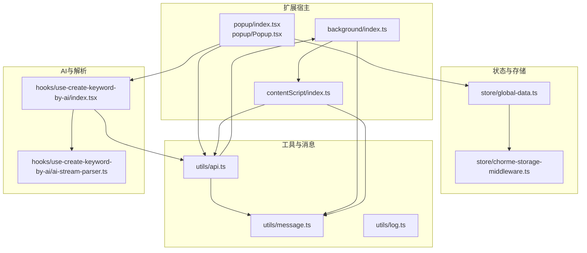
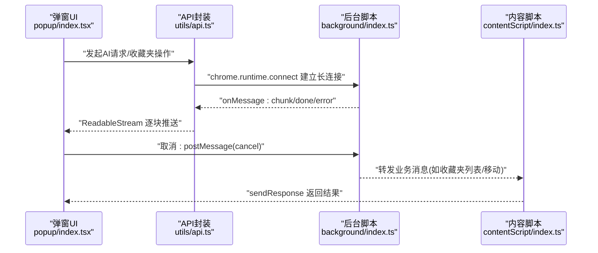
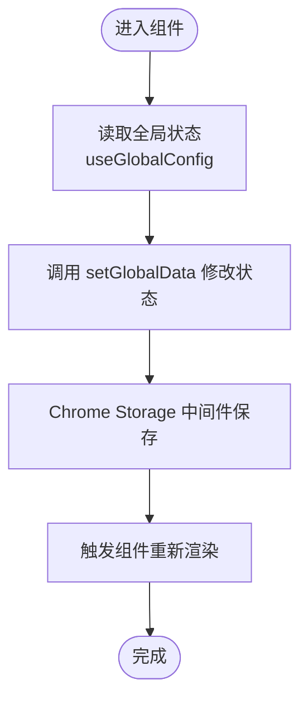
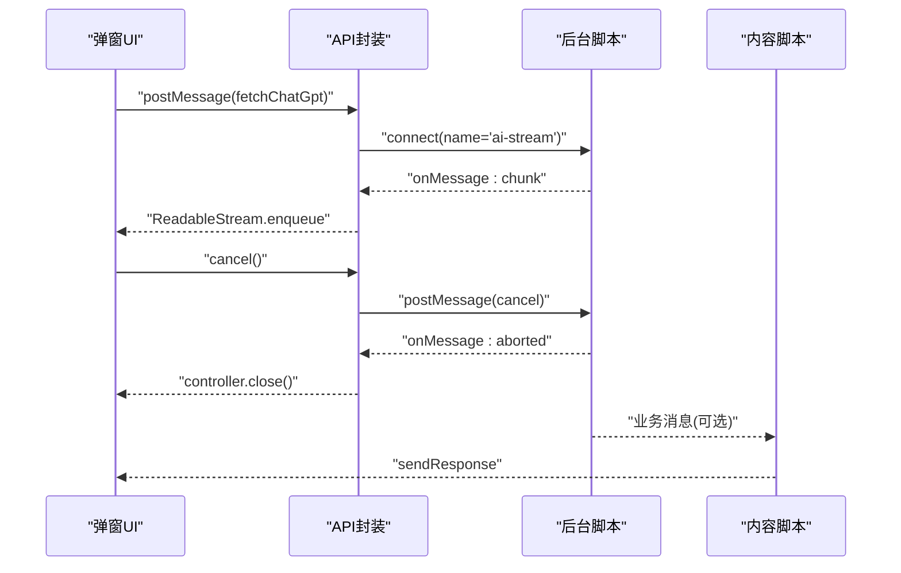
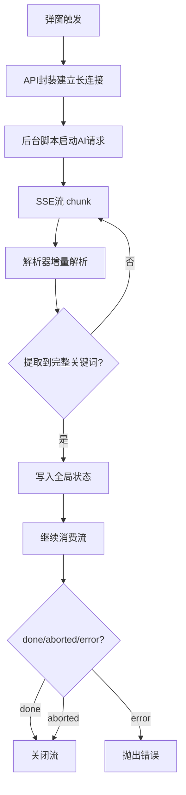
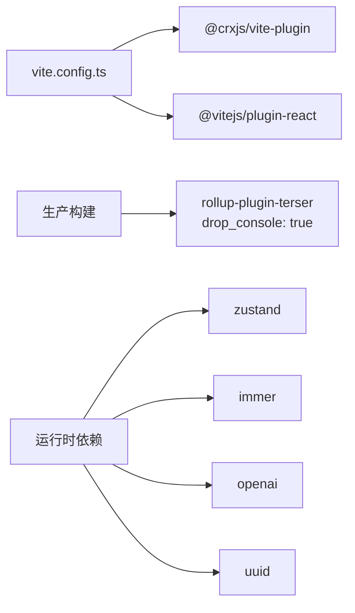

# 调试技巧与开发工具

<cite>
**本文引用的文件**
- [src/background/index.ts](file://src/background/index.ts)
- [src/contentScript/index.ts](file://src/contentScript/index.ts)
- [src/popup/index.tsx](file://src/popup/index.tsx)
- [src/popup/Popup.tsx](file://src/popup/Popup.tsx)
- [src/store/global-data.ts](file://src/store/global-data.ts)
- [src/store/chorme-storage-middleware.ts](file://src/store/chorme-storage-middleware.ts)
- [src/utils/message.ts](file://src/utils/message.ts)
- [src/utils/api.ts](file://src/utils/api.ts)
- [src/hooks/use-create-keyword-by-ai/index.tsx](file://src/hooks/use-create-keyword-by-ai/index.tsx)
- [src/hooks/use-create-keyword-by-ai/ai-stream-parser.ts](file://src/hooks/use-create-keyword-by-ai/ai-stream-parser.ts)
- [src/utils/log.ts](file://src/utils/log.ts)
- [src/options/components/setting/index.tsx](file://src/options/components/setting/index.tsx)
- [src/options/components/setting/components/config-mode-selector.tsx](file://src/options/components/setting/components/config-mode-selector.tsx)
- [src/options/components/setting/types.ts](file://src/options/components/setting/types.ts)
- [tests/ai-stream-parser.test.ts](file://tests/ai-stream-parser.test.ts)
- [tests/ai-stream-connect.test.ts](file://tests/ai-stream-connect.test.ts)
- [vite.config.ts](file://vite.config.ts)
- [package.json](file://package.json)
</cite>

## 目录
1. [简介](#简介)
2. [项目结构](#项目结构)
3. [核心组件](#核心组件)
4. [架构总览](#架构总览)
5. [详细组件分析](#详细组件分析)
6. [依赖关系分析](#依赖关系分析)
7. [性能考虑](#性能考虑)
8. [故障排查指南](#故障排查指南)
9. [结论](#结论)
10. [附录](#附录)

## 简介
本指南面向B站收藏夹整理工具的开发者与高级用户，聚焦以下调试与开发主题：
- Chrome扩展调试：后台脚本、内容脚本、弹窗页面的调试方法
- React DevTools在扩展开发中的使用
- Zustand状态管理调试：状态变更追踪、持久化与时间旅行思路
- 消息通信调试：扩展内与扩展间通信的监控与问题排查
- AI服务调试：API调用监控、流式响应调试
- 性能分析工具使用与优化建议

## 项目结构
该项目采用按职责分层的组织方式：
- 背景页：负责AI流式通信、配额检查、与内容脚本/弹窗的消息桥接
- 内容脚本：与目标网页交互，执行收藏夹操作
- 弹窗/侧边栏：React界面，承载用户交互与状态展示
- 工具与中间件：消息枚举、API封装、Zustand中间件、日志工具
- Hook与解析器：AI流解析、关键词提取、批量处理流程
- 测试：覆盖AI流解析与消息连接的单元与集成测试

图表来源
- [src/background/index.ts:1-393](file://src/background/index.ts#L1-L393)
- [src/contentScript/index.ts:1-55](file://src/contentScript/index.ts#L1-L55)
- [src/popup/index.tsx:1-17](file://src/popup/index.tsx#L1-L17)
- [src/popup/Popup.tsx:1-80](file://src/popup/Popup.tsx#L1-L80)
- [src/store/global-data.ts:1-28](file://src/store/global-data.ts#L1-L28)
- [src/store/chorme-storage-middleware.ts:1-63](file://src/store/chorme-storage-middleware.ts#L1-L63)
- [src/utils/message.ts:1-20](file://src/utils/message.ts#L1-L20)
- [src/utils/api.ts:1-339](file://src/utils/api.ts#L1-L339)
- [src/hooks/use-create-keyword-by-ai/index.tsx:1-170](file://src/hooks/use-create-keyword-by-ai/index.tsx#L1-L170)
- [src/hooks/use-create-keyword-by-ai/ai-stream-parser.ts:1-278](file://src/hooks/use-create-keyword-by-ai/ai-stream-parser.ts#L1-L278)

章节来源
- [src/background/index.ts:1-393](file://src/background/index.ts#L1-L393)
- [src/contentScript/index.ts:1-55](file://src/contentScript/index.ts#L1-L55)
- [src/popup/index.tsx:1-17](file://src/popup/index.tsx#L1-L17)
- [src/popup/Popup.tsx:1-80](file://src/popup/Popup.tsx#L1-L80)
- [src/store/global-data.ts:1-28](file://src/store/global-data.ts#L1-L28)
- [src/store/chorme-storage-middleware.ts:1-63](file://src/store/chorme-storage-middleware.ts#L1-L63)
- [src/utils/message.ts:1-20](file://src/utils/message.ts#L1-L20)
- [src/utils/api.ts:1-339](file://src/utils/api.ts#L1-L339)
- [src/hooks/use-create-keyword-by-ai/index.tsx:1-170](file://src/hooks/use-create-keyword-by-ai/index.tsx#L1-L170)
- [src/hooks/use-create-keyword-by-ai/ai-stream-parser.ts:1-278](file://src/hooks/use-create-keyword-by-ai/ai-stream-parser.ts#L1-L278)

## 核心组件
- 消息枚举与类型：统一扩展各模块间的消息协议，便于调试时定位类型与数据结构
- API封装：统一建立与后台脚本的长连接，实现可取消的流式通信
- 后台脚本：监听端口、处理AI请求、配额检查、SSE流式转发
- 内容脚本：监听来自弹窗的消息，执行收藏夹相关API调用
- 弹窗页面：React应用入口，加载渲染扫描工具，承载功能组件
- Zustand全局状态：Immer中间件+Chrome Storage中间件，支持持久化与可观测性
- AI流解析器：适配不同模型的流式响应，增量解析关键词并写回全局状态

章节来源
- [src/utils/message.ts:1-20](file://src/utils/message.ts#L1-L20)
- [src/utils/api.ts:176-232](file://src/utils/api.ts#L176-L232)
- [src/background/index.ts:315-392](file://src/background/index.ts#L315-L392)
- [src/contentScript/index.ts:4-54](file://src/contentScript/index.ts#L4-L54)
- [src/popup/index.tsx:1-17](file://src/popup/index.tsx#L1-L17)
- [src/store/global-data.ts:6-25](file://src/store/global-data.ts#L6-L25)
- [src/hooks/use-create-keyword-by-ai/ai-stream-parser.ts:221-277](file://src/hooks/use-create-keyword-by-ai/ai-stream-parser.ts#L221-L277)

## 架构总览
扩展由“弹窗界面 -> API封装 -> 后台脚本 -> 内容脚本”构成消息链路；AI请求通过长连接进行流式传输。

图表来源
- [src/popup/index.tsx:1-17](file://src/popup/index.tsx#L1-L17)
- [src/utils/api.ts:176-232](file://src/utils/api.ts#L176-L232)
- [src/background/index.ts:315-392](file://src/background/index.ts#L315-L392)
- [src/contentScript/index.ts:4-54](file://src/contentScript/index.ts#L4-L54)

## 详细组件分析

### 后台脚本调试要点
- 端口监听与消息分发：使用端口名区分AI流通道，集中处理取消、配额检查、SSE流转发
- 取消机制：AbortController与端口断开均触发取消，确保资源释放
- 错误处理：对SSE解析异常、配额不足、网络错误分别上报
- 日志策略：在关键路径打印消息类型与状态，便于定位

调试步骤
- 在浏览器扩展页面打开后台页面，观察控制台日志
- 使用React DevTools（见后续章节）定位弹窗状态变化
- 对SSE流：在后台脚本中增加更细粒度的日志，确认每一块的解析与转发

章节来源
- [src/background/index.ts:315-392](file://src/background/index.ts#L315-L392)
- [src/background/index.ts:93-192](file://src/background/index.ts#L93-L192)
- [src/background/index.ts:249-247](file://src/background/index.ts#L249-L247)

### 内容脚本调试要点
- 消息监听：对收藏夹列表、移动视频、Cookie获取等消息进行响应
- 异步处理：Promise链路中捕获错误并返回标准化响应
- 页面上下文：注意在内容脚本中访问document.cookie与DOM

调试步骤
- 在目标页面打开开发者工具，切换到“扩展”面板查看内容脚本日志
- 使用React DevTools调试弹窗UI，结合内容脚本日志核对消息往返

章节来源
- [src/contentScript/index.ts:4-54](file://src/contentScript/index.ts#L4-L54)

### 弹窗页面调试要点
- React入口：启用react-scan以输出渲染信息到控制台
- 组件结构：弹窗组件组织收藏夹标签、关键词、动作按钮等
- 设置页联动：设置页通过Zustand持久化AI配置，影响弹窗行为

调试步骤
- 在弹窗页面打开React DevTools，查看组件树与状态
- 使用react-scan日志辅助定位渲染问题

章节来源
- [src/popup/index.tsx:1-17](file://src/popup/index.tsx#L1-L17)
- [src/popup/Popup.tsx:1-80](file://src/popup/Popup.tsx#L1-L80)

### Zustand状态管理调试
- 状态结构：包含关键词、收藏夹数据、Cookie、活动收藏夹、AI配置、默认收藏夹等
- 中间件链：Immer中间件提供不可变更新语义；Chrome Storage中间件自动持久化指定键
- 调试技巧
  - 使用React DevTools的Zustand插件（若可用）观察状态变更
  - 在setGlobalData前后打印状态快照，验证持久化时机
  - 利用持久化键列表核验存储内容

图表来源
- [src/store/global-data.ts:6-25](file://src/store/global-data.ts#L6-L25)
- [src/store/chorme-storage-middleware.ts:8-57](file://src/store/chorme-storage-middleware.ts#L8-L57)

章节来源
- [src/store/global-data.ts:1-28](file://src/store/global-data.ts#L1-L28)
- [src/store/chorme-storage-middleware.ts:1-63](file://src/store/chorme-storage-middleware.ts#L1-L63)

### 消息通信调试
- 消息枚举：统一类型常量，便于在后台/内容脚本/弹窗间快速定位
- API封装：connectAndStream建立长连接，将后台的chunk/done/error映射为ReadableStream事件
- 取消流程：弹窗端调用cancel，后台收到取消信号后断开端口
- 断线处理：监听断开事件，读取lastError并转换为controller.error

图表来源
- [src/utils/api.ts:176-232](file://src/utils/api.ts#L176-L232)
- [src/background/index.ts:315-392](file://src/background/index.ts#L315-L392)
- [src/contentScript/index.ts:4-54](file://src/contentScript/index.ts#L4-L54)
- [src/utils/message.ts:1-20](file://src/utils/message.ts#L1-L20)

章节来源
- [src/utils/message.ts:1-20](file://src/utils/message.ts#L1-L20)
- [src/utils/api.ts:176-232](file://src/utils/api.ts#L176-L232)
- [src/background/index.ts:315-392](file://src/background/index.ts#L315-L392)
- [src/contentScript/index.ts:4-54](file://src/contentScript/index.ts#L4-L54)

### AI服务调试（关键词提取与流式响应）
- 关键词提取流程：弹窗触发 -> API封装 -> 后台脚本 -> AI模型 -> 流式返回 -> 解析器增量提取 -> 写入全局状态
- 流解析器：支持Spark/OpenAI等适配器，逐块解析JSON，缓冲区增量提取，去重插入
- 调试建议
  - 在后台脚本中打印SSE数据块与解析结果
  - 在弹窗Hook中打印配置与全局状态快照
  - 使用测试用例验证解析边界条件（连字符、中英文混排、分块拼接）

图表来源
- [src/hooks/use-create-keyword-by-ai/index.tsx:21-154](file://src/hooks/use-create-keyword-by-ai/index.tsx#L21-L154)
- [src/hooks/use-create-keyword-by-ai/ai-stream-parser.ts:221-277](file://src/hooks/use-create-keyword-by-ai/ai-stream-parser.ts#L221-L277)
- [src/utils/api.ts:176-232](file://src/utils/api.ts#L176-L232)
- [src/background/index.ts:93-192](file://src/background/index.ts#L93-L192)

章节来源
- [src/hooks/use-create-keyword-by-ai/index.tsx:1-170](file://src/hooks/use-create-keyword-by-ai/index.tsx#L1-L170)
- [src/hooks/use-create-keyword-by-ai/ai-stream-parser.ts:1-278](file://src/hooks/use-create-keyword-by-ai/ai-stream-parser.ts#L1-L278)
- [src/utils/api.ts:176-232](file://src/utils/api.ts#L176-L232)
- [src/background/index.ts:93-192](file://src/background/index.ts#L93-L192)

### React DevTools在扩展开发中的使用
- 在弹窗入口启用react-scan，输出渲染信息到控制台，辅助定位渲染问题
- 在扩展页面打开React DevTools，查看组件树、Props、State与Hooks
- 结合Zustand中间件与持久化，观察状态变化与存储同步

章节来源
- [src/popup/index.tsx:7-10](file://src/popup/index.tsx#L7-L10)
- [src/store/global-data.ts:6-25](file://src/store/global-data.ts#L6-L25)
- [src/store/chorme-storage-middleware.ts:8-57](file://src/store/chorme-storage-middleware.ts#L8-L57)

### 设置页与配置调试
- 设置页通过表单收集AI配置（API Key、BaseURL、Model、Adapter、额外参数），并写入全局状态
- 配置模式：自定义配置与免费额度两种模式，分别校验必填项
- 调试建议：在设置提交时打印aiConfig，核对extraParams序列化与默认值注入

章节来源
- [src/options/components/setting/index.tsx:1-97](file://src/options/components/setting/index.tsx#L1-L97)
- [src/options/components/setting/components/config-mode-selector.tsx:1-44](file://src/options/components/setting/components/config-mode-selector.tsx#L1-L44)
- [src/options/components/setting/types.ts:41-98](file://src/options/components/setting/types.ts#L41-L98)

## 依赖关系分析
- 构建与打包：Vite + CRX插件，生产构建去除console，便于发布
- 运行时依赖：React、Zustand、Immer、OpenAI SDK、UUID等
- 开发依赖：React Compiler、Vitest、Playwright、Tailwind等

图表来源
- [vite.config.ts:1-44](file://vite.config.ts#L1-L44)
- [package.json:29-58](file://package.json#L29-L58)

章节来源
- [vite.config.ts:1-44](file://vite.config.ts#L1-L44)
- [package.json:1-91](file://package.json#L1-L91)

## 性能考虑
- 构建优化：生产构建移除console，减少包体积与运行时开销
- 流式处理：后台脚本与解析器均采用增量处理，降低内存峰值
- 状态持久化：仅持久化必要键，避免频繁写入存储
- 取消与断开：及时取消未完成请求，防止资源泄漏

章节来源
- [vite.config.ts:20-27](file://vite.config.ts#L20-L27)
- [src/store/chorme-storage-middleware.ts:3-34](file://src/store/chorme-storage-middleware.ts#L3-L34)
- [src/background/index.ts:383-391](file://src/background/index.ts#L383-L391)

## 故障排查指南
- 后台脚本无响应
  - 检查端口名与消息类型是否匹配
  - 查看控制台日志，确认配额检查与SSE读取路径
- 内容脚本无返回
  - 确认消息监听与sendResponse调用
  - 核对Cookie与CSRF参数
- 弹窗无渲染或状态不更新
  - 使用react-scan与React DevTools核对渲染与状态
  - 检查Zustand中间件是否正确持久化
- AI流解析异常
  - 在后台脚本与解析器中增加日志，验证chunk与缓冲区拼接
  - 使用测试用例覆盖边界场景（连字符、分块、中英文混排）
- 取消无效
  - 确认弹窗端调用cancel与后台端口断开
  - 检查AbortController信号与done/error分支

章节来源
- [src/background/index.ts:315-392](file://src/background/index.ts#L315-L392)
- [src/contentScript/index.ts:4-54](file://src/contentScript/index.ts#L4-L54)
- [src/popup/index.tsx:1-17](file://src/popup/index.tsx#L1-L17)
- [src/hooks/use-create-keyword-by-ai/ai-stream-parser.ts:221-277](file://src/hooks/use-create-keyword-by-ai/ai-stream-parser.ts#L221-L277)
- [tests/ai-stream-parser.test.ts:1-243](file://tests/ai-stream-parser.test.ts#L1-L243)
- [tests/ai-stream-connect.test.ts:103-136](file://tests/ai-stream-connect.test.ts#L103-L136)

## 结论
通过统一的消息协议、清晰的组件边界与完善的调试工具链，本项目在扩展调试、状态管理与AI流式处理方面具备良好的可观测性与可维护性。建议在日常开发中持续利用React DevTools、Zustand中间件与测试用例，配合后台脚本与解析器的日志，快速定位问题并优化性能。

## 附录
- 日志开关：开发模式下才输出日志，避免生产环境冗余
- 测试参考：AI流解析与消息连接的测试用例可作为调试边界与回归保障

章节来源
- [src/utils/log.ts:1-8](file://src/utils/log.ts#L1-L8)
- [tests/ai-stream-parser.test.ts:1-243](file://tests/ai-stream-parser.test.ts#L1-L243)
- [tests/ai-stream-connect.test.ts:103-136](file://tests/ai-stream-connect.test.ts#L103-L136)