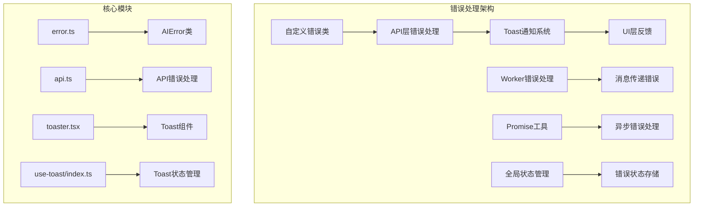
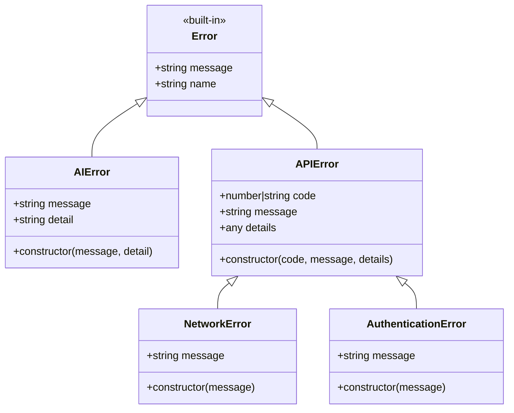
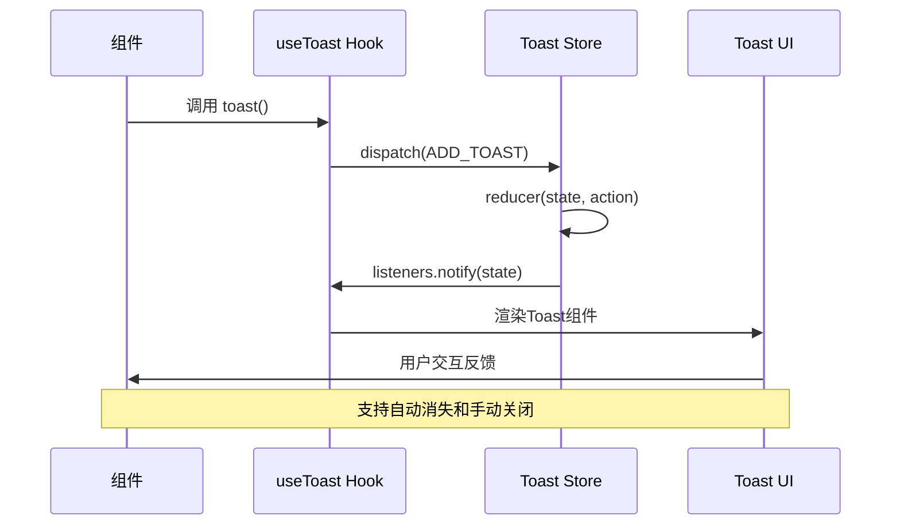
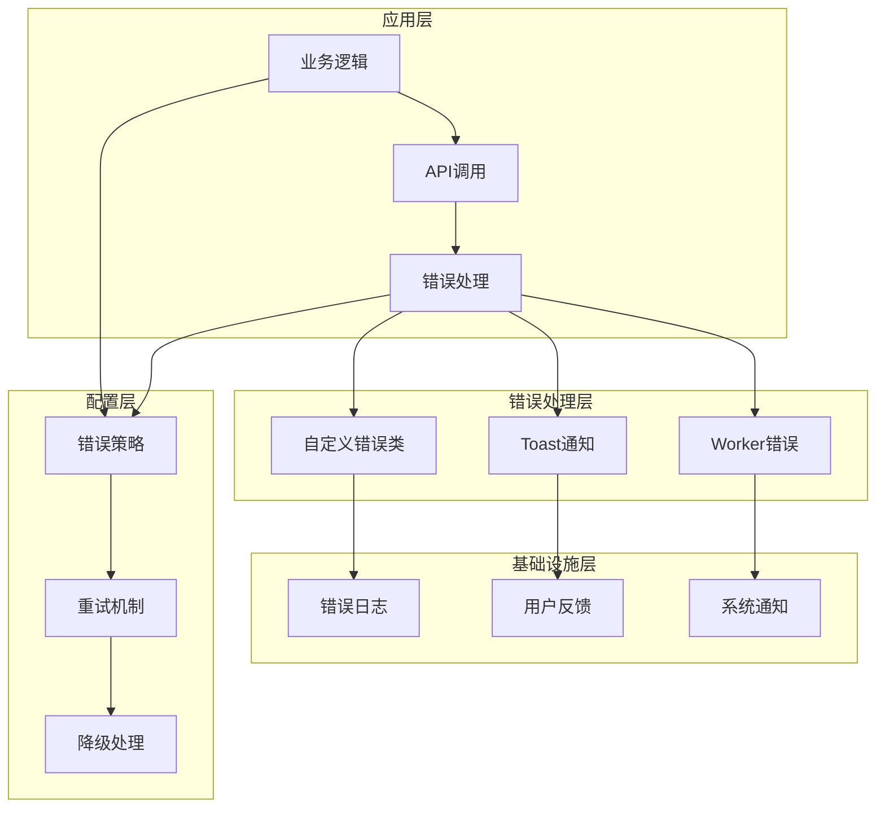
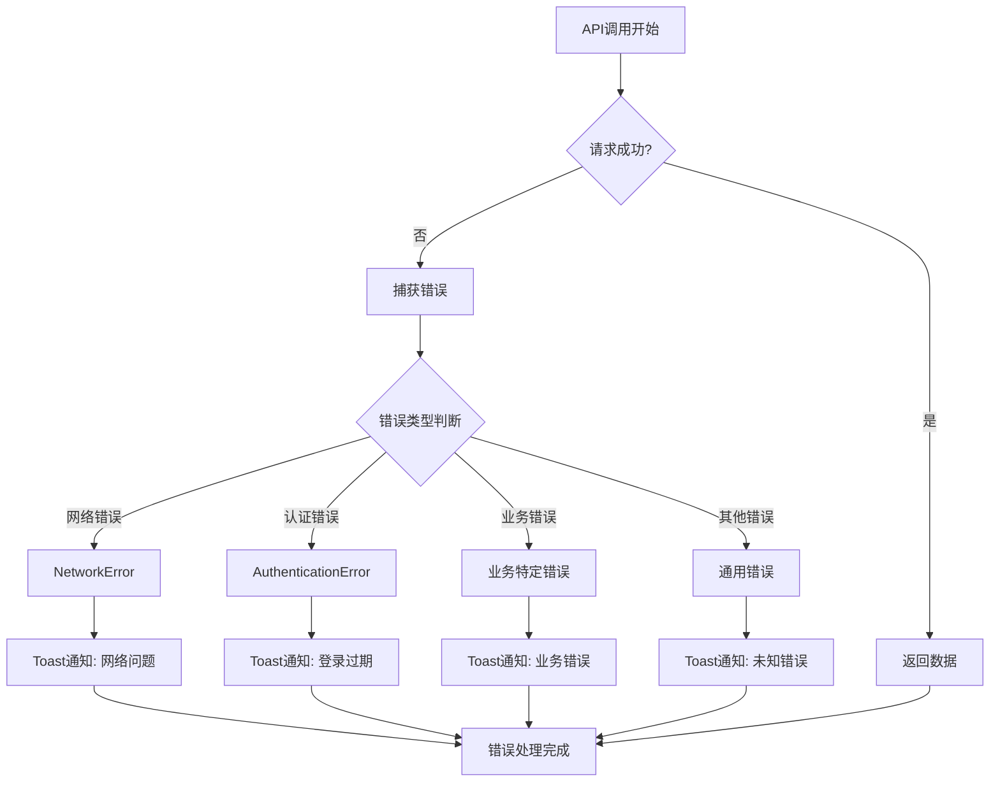
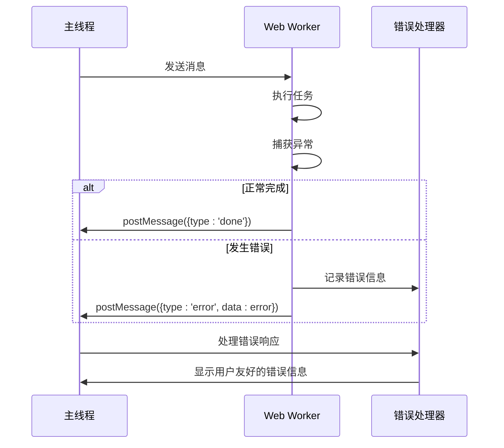
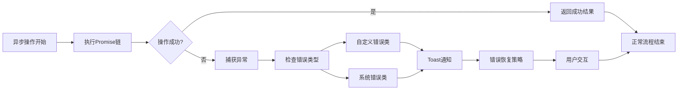
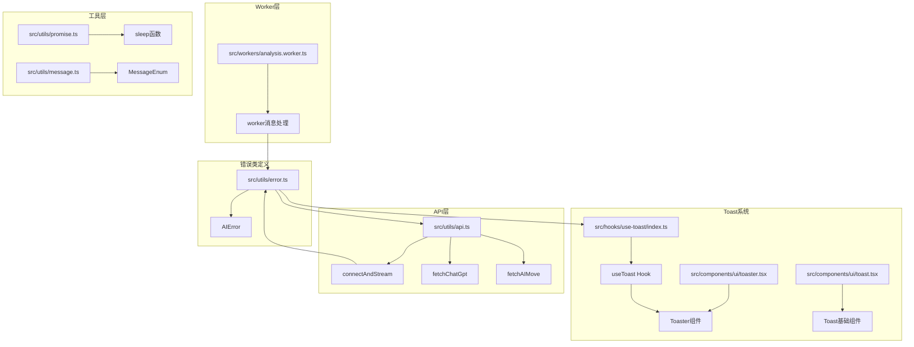

# 错误处理系统

<cite>
**本文档引用的文件**
- [src/utils/error.ts](file://src/utils/error.ts)
- [src/hooks/use-toast/index.ts](file://src/hooks/use-toast/index.ts)
- [src/components/ui/toaster.tsx](file://src/components/ui/toaster.tsx)
- [src/components/ui/toast.tsx](file://src/components/ui/toast.tsx)
- [src/utils/api.ts](file://src/utils/api.ts)
- [src/workers/analysis.worker.ts](file://src/workers/analysis.worker.ts)
- [.codebuddy/.rules/api-integration.mdc](file://.codebuddy/.rules/api-integration.mdc)
- [src/utils/promise.ts](file://src/utils/promise.ts)
- [src/utils/message.ts](file://src/utils/message.ts)
- [src/store/global-data.ts](file://src/store/global-data.ts)
</cite>

## 目录
1. [简介](#简介)
2. [项目结构](#项目结构)
3. [核心组件](#核心组件)
4. [架构概览](#架构概览)
5. [详细组件分析](#详细组件分析)
6. [依赖关系分析](#依赖关系分析)
7. [性能考虑](#性能考虑)
8. [故障排除指南](#故障排除指南)
9. [结论](#结论)

## 简介

本项目采用多层次的错误处理系统，结合了自定义错误类、状态管理、UI通知机制和异步错误传播。系统主要包含以下特点：

- **统一的错误类型体系**：基于继承的错误类结构
- **实时用户反馈**：基于Toast的通知系统
- **异步错误处理**：支持Promise链和流式数据处理
- **Worker错误隔离**：独立的Web Worker错误处理机制
- **配置化错误策略**：可扩展的错误处理中间件

## 项目结构

项目中的错误处理系统分布在多个层次中，形成了完整的错误处理生态：

**图表来源**
- [src/utils/error.ts:1-12](file://src/utils/error.ts#L1-L12)
- [src/utils/api.ts:1-348](file://src/utils/api.ts#L1-L348)
- [src/components/ui/toaster.tsx:1-63](file://src/components/ui/toaster.tsx#L1-L63)
- [src/hooks/use-toast/index.ts:1-187](file://src/hooks/use-toast/index.ts#L1-L187)

**章节来源**
- [src/utils/error.ts:1-12](file://src/utils/error.ts#L1-L12)
- [src/utils/api.ts:1-348](file://src/utils/api.ts#L1-L348)
- [src/components/ui/toaster.tsx:1-63](file://src/components/ui/toaster.tsx#L1-L63)
- [src/hooks/use-toast/index.ts:1-187](file://src/hooks/use-toast/index.ts#L1-L187)

## 核心组件

### 自定义错误类体系

项目实现了基于继承的错误类结构，提供统一的错误处理机制：

**图表来源**
- [src/utils/error.ts:1-12](file://src/utils/error.ts#L1-L12)
- [.codebuddy/.rules/api-integration.mdc:240-262](file://.codebuddy/.rules/api-integration.mdc#L240-L262)

### Toast通知系统

实现了基于Redux模式的状态管理，提供实时的用户反馈机制：

**图表来源**
- [src/hooks/use-toast/index.ts:137-164](file://src/hooks/use-toast/index.ts#L137-L164)
- [src/components/ui/toaster.tsx:51-62](file://src/components/ui/toaster.tsx#L51-L62)

**章节来源**
- [src/utils/error.ts:1-12](file://src/utils/error.ts#L1-L12)
- [src/hooks/use-toast/index.ts:1-187](file://src/hooks/use-toast/index.ts#L1-L187)
- [src/components/ui/toaster.tsx:1-63](file://src/components/ui/toaster.tsx#L1-L63)

## 架构概览

错误处理系统采用分层架构设计，确保错误能够在各个层面得到适当的处理：

**图表来源**
- [src/utils/api.ts:181-233](file://src/utils/api.ts#L181-L233)
- [src/workers/analysis.worker.ts:116-135](file://src/workers/analysis.worker.ts#L116-L135)
- [.codebuddy/.rules/api-integration.mdc:267-296](file://.codebuddy/.rules/api-integration.mdc#L267-L296)

## 详细组件分析

### API错误处理机制

API层实现了完整的错误处理流程，包括网络错误、认证错误和业务逻辑错误：

**图表来源**
- [src/utils/api.ts:181-233](file://src/utils/api.ts#L181-L233)
- [.codebuddy/.rules/api-integration.mdc:276-295](file://.codebuddy/.rules/api-integration.mdc#L276-L295)

### Worker错误处理

Web Worker实现了独立的错误处理机制，确保后台任务的错误不会影响主界面：

**图表来源**
- [src/workers/analysis.worker.ts:126-132](file://src/workers/analysis.worker.ts#L126-L132)

### 异步错误传播

Promise工具提供了统一的异步错误处理机制：

**图表来源**
- [src/utils/promise.ts:1-11](file://src/utils/promise.ts#L1-L11)
- [src/utils/api.ts:206-221](file://src/utils/api.ts#L206-L221)

**章节来源**
- [src/utils/api.ts:181-233](file://src/utils/api.ts#L181-L233)
- [src/workers/analysis.worker.ts:116-135](file://src/workers/analysis.worker.ts#L116-L135)
- [src/utils/promise.ts:1-11](file://src/utils/promise.ts#L1-L11)

## 依赖关系分析

错误处理系统各组件之间的依赖关系如下：

**图表来源**
- [src/utils/error.ts:1-12](file://src/utils/error.ts#L1-L12)
- [src/hooks/use-toast/index.ts:1-187](file://src/hooks/use-toast/index.ts#L1-L187)
- [src/components/ui/toaster.tsx:1-63](file://src/components/ui/toaster.tsx#L1-L63)
- [src/utils/api.ts:1-348](file://src/utils/api.ts#L1-L348)
- [src/workers/analysis.worker.ts:1-135](file://src/workers/analysis.worker.ts#L1-L135)

**章节来源**
- [src/utils/error.ts:1-12](file://src/utils/error.ts#L1-L12)
- [src/hooks/use-toast/index.ts:1-187](file://src/hooks/use-toast/index.ts#L1-L187)
- [src/components/ui/toaster.tsx:1-63](file://src/components/ui/toaster.tsx#L1-L63)
- [src/utils/api.ts:1-348](file://src/utils/api.ts#L1-L348)
- [src/workers/analysis.worker.ts:1-135](file://src/workers/analysis.worker.ts#L1-L135)

## 性能考虑

错误处理系统在设计时充分考虑了性能优化：

### 错误处理性能优化

1. **异步错误处理**：使用Promise和async/await避免阻塞主线程
2. **错误缓存**：Toast消息的生命周期管理，避免内存泄漏
3. **Worker隔离**：后台任务错误不影响UI性能
4. **条件加载**：错误处理逻辑按需加载，减少初始包大小

### 内存管理

- Toast消息队列限制，防止无限增长
- Worker连接的自动清理机制
- 错误监听器的及时移除

## 故障排除指南

### 常见错误场景及解决方案

#### 网络连接错误
- **症状**：API调用失败，显示网络错误提示
- **原因**：网络不稳定或服务器不可达
- **解决方案**：检查网络连接，重试机制自动处理

#### 认证过期错误
- **症状**：登录状态失效，需要重新登录
- **原因**：Cookie过期或Token失效
- **解决方案**：引导用户重新登录

#### AI服务错误
- **症状**：AI功能无法正常使用
- **原因**：API密钥配置错误或服务端错误
- **解决方案**：检查AI配置，查看详细错误信息

#### Worker错误
- **症状**：后台任务执行失败
- **原因**：Worker初始化失败或消息传递错误
- **解决方案**：重启浏览器扩展，检查控制台错误

**章节来源**
- [.codebuddy/.rules/api-integration.mdc:276-295](file://.codebuddy/.rules/api-integration.mdc#L276-L295)
- [src/utils/api.ts:206-221](file://src/utils/api.ts#L206-L221)
- [src/workers/analysis.worker.ts:126-132](file://src/workers/analysis.worker.ts#L126-L132)

## 结论

本项目的错误处理系统具有以下优势：

1. **层次化设计**：从底层错误类到上层用户反馈形成完整链条
2. **统一标准**：基于继承的错误类体系提供一致的错误处理体验
3. **实时反馈**：Toast系统提供即时的用户反馈机制
4. **异步支持**：完善的Promise和Worker错误处理
5. **可扩展性**：配置化的错误处理策略支持未来扩展

系统通过合理的架构设计和组件分离，确保了错误处理的可靠性、可维护性和用户体验。建议在后续开发中继续完善错误监控和日志记录机制，以进一步提升系统的可观测性。