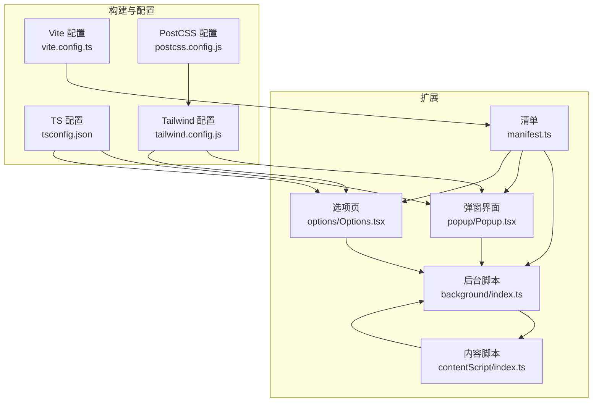
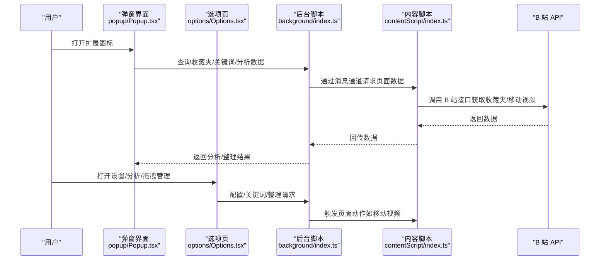
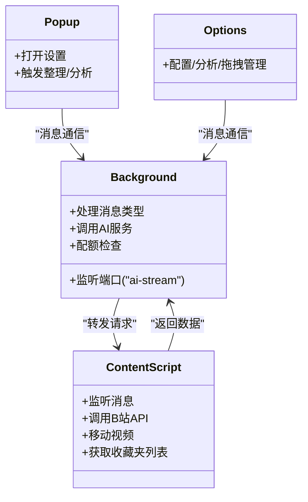
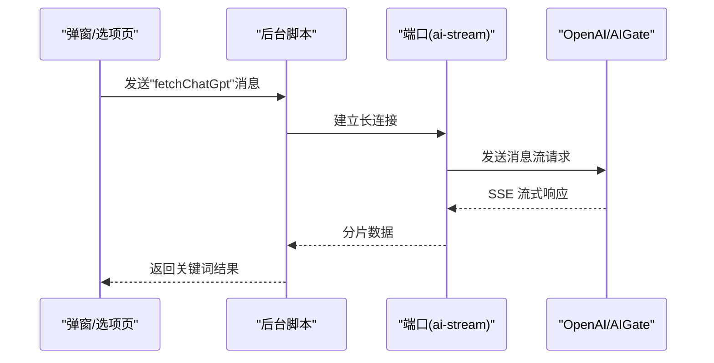
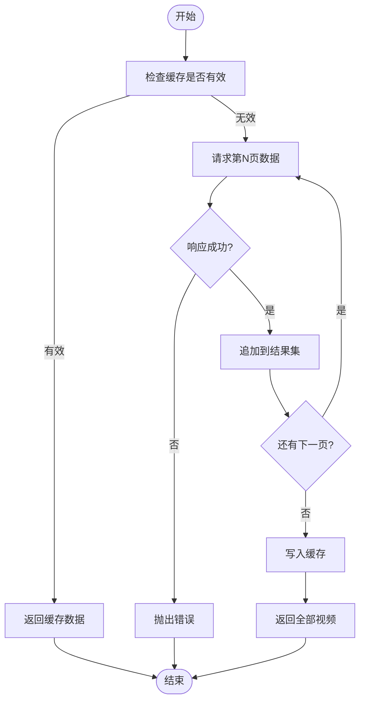
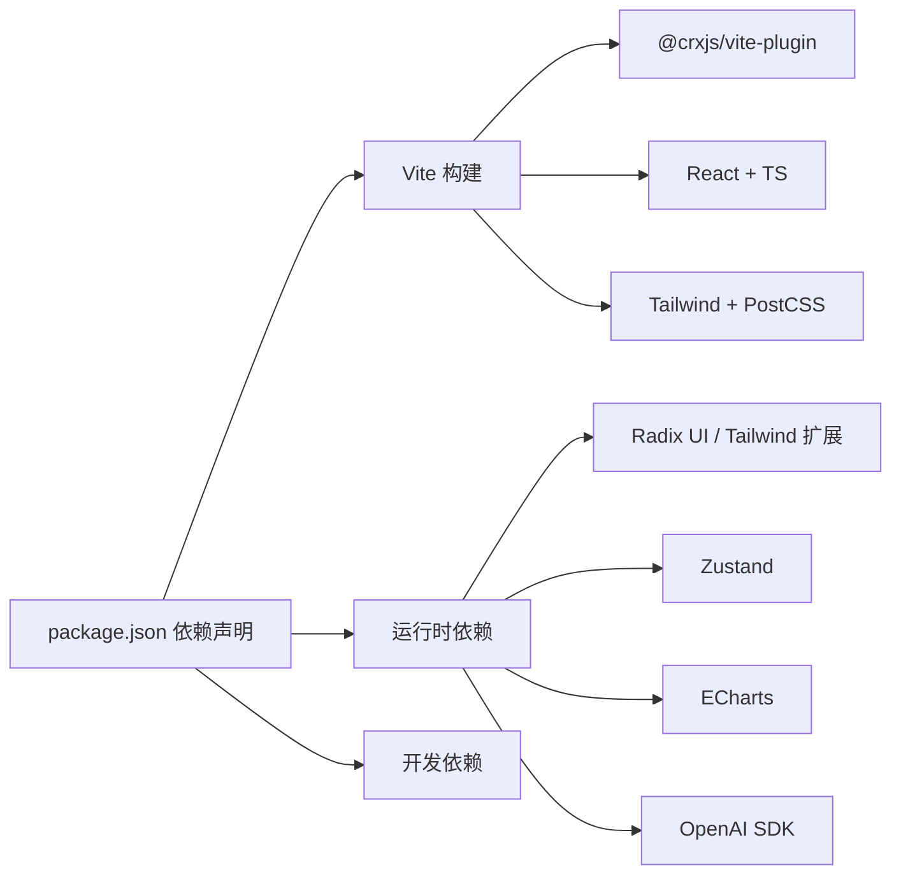

# 快速开始

<cite>
**本文引用的文件**
- [package.json](file://package.json)
- [README.md](file://README.md)
- [vite.config.ts](file://vite.config.ts)
- [src/manifest.ts](file://src/manifest.ts)
- [tsconfig.json](file://tsconfig.json)
- [tailwind.config.js](file://tailwind.config.js)
- [postcss.config.js](file://postcss.config.js)
- [src/popup/Popup.tsx](file://src/popup/Popup.tsx)
- [src/options/Options.tsx](file://src/options/Options.tsx)
- [src/background/index.ts](file://src/background/index.ts)
- [src/contentScript/index.ts](file://src/contentScript/index.ts)
- [src/utils/api.ts](file://src/utils/api.ts)
- [src/hooks/use-favorite-data/index.ts](file://src/hooks/use-favorite-data/index.ts)
- [PRIVACY.md](file://PRIVACY.md)
</cite>

## 目录
1. [简介](#简介)
2. [项目结构](#项目结构)
3. [核心组件](#核心组件)
4. [架构总览](#架构总览)
5. [详细组件分析](#详细组件分析)
6. [依赖分析](#依赖分析)
7. [性能考虑](#性能考虑)
8. [故障排除指南](#故障排除指南)
9. [结论](#结论)
10. [附录](#附录)

## 简介
本指南面向首次接触“B站收藏夹整理工具”的用户与开发者，提供从安装到日常使用的完整流程，涵盖：
- 两种安装方式：Chrome Web Store 官方安装与本地开发安装
- 开发环境搭建：Node.js 版本要求、包管理器选择（pnpm）、依赖安装
- 启动开发服务器与热重载配置
- 基本使用教程：登录 B 站、打开扩展界面、收藏夹分析与整理
- 常见问题与故障排除、调试技巧

## 项目结构
该项目为 Chrome Extension（Manifest V3），采用 React + TypeScript + Vite 构建，核心目录与职责概览如下：
- src/background：后台脚本，负责与 AI 服务通信、配额检查、消息路由
- src/contentScript：注入到 B 站页面的内容脚本，负责与页面交互、调用 B 站 API
- src/popup：扩展弹窗界面入口
- src/options：选项页（设置/分析/拖拽管理/关键词管理）
- src/utils：通用工具模块（API 封装、消息通信、IndexedDB 缓存、日志等）
- src/hooks：React Hooks（如收藏夹数据 Hook）
- vite.config.ts：构建与 CRX 插件配置
- src/manifest.ts：扩展清单，声明权限、入口、侧边栏等
- tailwind/postcss：样式与构建管线

**图示来源**
- [src/background/index.ts:1-393](file://src/background/index.ts#L1-L393)
- [src/contentScript/index.ts:1-55](file://src/contentScript/index.ts#L1-L55)
- [src/popup/Popup.tsx:1-80](file://src/popup/Popup.tsx#L1-L80)
- [src/options/Options.tsx:1-91](file://src/options/Options.tsx#L1-L91)
- [src/manifest.ts:1-55](file://src/manifest.ts#L1-L55)
- [vite.config.ts:1-44](file://vite.config.ts#L1-L44)
- [tsconfig.json:1-44](file://tsconfig.json#L1-L44)
- [tailwind.config.js:1-118](file://tailwind.config.js#L1-L118)
- [postcss.config.js:1-7](file://postcss.config.js#L1-L7)

**章节来源**
- [src/manifest.ts:1-55](file://src/manifest.ts#L1-L55)
- [vite.config.ts:1-44](file://vite.config.ts#L1-L44)
- [tsconfig.json:1-44](file://tsconfig.json#L1-L44)
- [tailwind.config.js:1-118](file://tailwind.config.js#L1-L118)
- [postcss.config.js:1-7](file://postcss.config.js#L1-L7)

## 核心组件
- 清单与权限：声明扩展名称、图标、弹窗、后台、内容脚本、侧边栏、权限与主机权限
- 构建与打包：Vite + CRX 插件，支持 React 编译优化与生产压缩
- 数据与通信：内容脚本与后台脚本通过消息通道通信；后台脚本与 AI 服务（OpenAI/AIGate）交互
- UI 组件：弹窗与选项页提供收藏夹分析、关键词管理、拖拽整理、设置等功能

**章节来源**
- [src/manifest.ts:8-55](file://src/manifest.ts#L8-L55)
- [vite.config.ts:11-44](file://vite.config.ts#L11-L44)
- [src/background/index.ts:315-392](file://src/background/index.ts#L315-L392)
- [src/contentScript/index.ts:4-54](file://src/contentScript/index.ts#L4-L54)
- [src/popup/Popup.tsx:14-76](file://src/popup/Popup.tsx#L14-L76)
- [src/options/Options.tsx:12-87](file://src/options/Options.tsx#L12-L87)

## 架构总览
扩展采用“内容脚本 + 后台脚本 + 选项页/弹窗 UI”的分层架构。内容脚本负责与 B 站页面交互，后台脚本负责业务逻辑与外部 API 通信，UI 层通过消息与后台交互。

**图示来源**
- [src/popup/Popup.tsx:18-20](file://src/popup/Popup.tsx#L18-L20)
- [src/options/Options.tsx:12-87](file://src/options/Options.tsx#L12-L87)
- [src/background/index.ts:315-392](file://src/background/index.ts#L315-L392)
- [src/contentScript/index.ts:4-54](file://src/contentScript/index.ts#L4-L54)
- [src/utils/api.ts:117-174](file://src/utils/api.ts#L117-L174)

## 详细组件分析

### 安装与运行

- Chrome Web Store 官方安装
  - 步骤：访问扩展商店页面并点击“添加到 Chrome”
  - 适用场景：普通用户快速体验功能
  - 参考路径：[README.md:84-88](file://README.md#L84-L88)

- 本地开发安装
  - 步骤：启用开发者模式 → 加载已解压的扩展程序 → 选择扩展根目录
  - 适用场景：开发者调试与二次开发
  - 参考路径：[README.md:89-96](file://README.md#L89-L96)

- 开发环境要求
  - Node.js 版本：需满足 engines 字段要求
  - 包管理器：pnpm（版本在 packageManager 中声明）
  - 参考路径：
    - [package.json:13-16](file://package.json#L13-L16)
    - [package.json:17-27](file://package.json#L17-L27)

- 启动开发服务器与热重载
  - 使用 Vite 开发命令启动本地服务
  - CRX 插件支持 Chrome Extension 热重载
  - 参考路径：
    - [vite.config.ts:34-41](file://vite.config.ts#L34-L41)
    - [package.json:17-18](file://package.json#L17-L18)

**章节来源**
- [README.md:82-96](file://README.md#L82-L96)
- [package.json:13-16](file://package.json#L13-L16)
- [package.json:17-18](file://package.json#L17-L18)
- [vite.config.ts:34-41](file://vite.config.ts#L34-L41)

### 基本使用教程

- 登录 B 站账号
  - 在任意 B 站页面保持登录状态，扩展通过内容脚本读取 Cookie 并调用 B 站 API
  - 若提示未登录，请刷新 B 站页面后重新打开插件
  - 参考路径：
    - [README.md:101-106](file://README.md#L101-L106)
    - [src/contentScript/index.ts:6-9](file://src/contentScript/index.ts#L6-L9)

- 打开扩展界面
  - 弹窗：点击扩展图标打开
  - 侧边栏：右键扩展图标 → “在侧边栏中打开”，或点击浏览器侧边栏图标选择扩展
  - 参考路径：
    - [README.md:62-71](file://README.md#L62-L71)
    - [src/manifest.ts:51-53](file://src/manifest.ts#L51-L53)

- 收藏夹分析
  - 在选项页“收藏夹数据分析”标签查看图表与趋势，使用“刷新”按钮获取最新数据
  - 参考路径：[README.md:108-111](file://README.md#L108-L111)

- 收藏夹整理
  - 设置 → 整理收藏夹标签：选择源/目标收藏夹、配置关键词规则、点击“开始整理”
  - 参考路径：[README.md:112-120](file://README.md#L112-L120)

- AI 关键词提取
  - 配置 OpenAI API Key → 关键词管理 → AI 提取关键词 → 手动优化
  - 参考路径：[README.md:121-127](file://README.md#L121-L127)

- 手动关键词提取
  - 使用本地 TF-IDF 算法提取关键词
  - 参考路径：[README.md:128-131](file://README.md#L128-L131)

**章节来源**
- [README.md:62-131](file://README.md#L62-L131)
- [src/contentScript/index.ts:6-9](file://src/contentScript/index.ts#L6-L9)
- [src/manifest.ts:51-53](file://src/manifest.ts#L51-L53)

### 组件关系与数据流

#### 类图：消息与数据流

**图示来源**
- [src/background/index.ts:315-392](file://src/background/index.ts#L315-L392)
- [src/contentScript/index.ts:4-54](file://src/contentScript/index.ts#L4-L54)
- [src/popup/Popup.tsx:18-20](file://src/popup/Popup.tsx#L18-L20)
- [src/options/Options.tsx:12-87](file://src/options/Options.tsx#L12-L87)

#### 序列图：AI 关键词提取流程

**图示来源**
- [src/background/index.ts:334-341](file://src/background/index.ts#L334-L341)
- [src/background/index.ts:197-247](file://src/background/index.ts#L197-L247)
- [src/utils/api.ts:234-247](file://src/utils/api.ts#L234-L247)

#### 流程图：分页获取收藏夹全部视频

**图示来源**
- [src/utils/api.ts:285-319](file://src/utils/api.ts#L285-L319)

### 依赖分析
- 构建与打包
  - Vite + @crxjs/vite-plugin：支持 CRX 打包与热重载
  - React + TypeScript：前端框架与类型系统
  - Tailwind CSS + PostCSS：样式与自动化前缀
- 运行时依赖
  - React 生态、Radix UI、Tailwind 扩展、Zustand 状态管理、ECharts 图表、OpenAI SDK
- 开发依赖
  - ESLint、Prettier、Vitest、Playwright、React Compiler 等

**图示来源**
- [package.json:29-89](file://package.json#L29-L89)
- [vite.config.ts:34-41](file://vite.config.ts#L34-L41)
- [tailwind.config.js:1-118](file://tailwind.config.js#L1-L118)
- [postcss.config.js:1-7](file://postcss.config.js#L1-L7)

**章节来源**
- [package.json:29-89](file://package.json#L29-L89)
- [vite.config.ts:34-41](file://vite.config.ts#L34-L41)
- [tailwind.config.js:1-118](file://tailwind.config.js#L1-L118)
- [postcss.config.js:1-7](file://postcss.config.js#L1-L7)

## 性能考虑
- 数据缓存：收藏夹全量数据带过期时间的缓存，减少重复请求
- 压缩与体积：生产构建移除 console，按需拆分 chunk
- UI 渲染：React Compiler 优化、Tailwind 实用类减少样式体积
- 网络请求：按需分页拉取、错误快速回退

**章节来源**
- [src/utils/api.ts:285-319](file://src/utils/api.ts#L285-L319)
- [vite.config.ts:20-27](file://vite.config.ts#L20-L27)

## 故障排除指南

- 登录失败/提示未登录
  - 确保已在 B 站页面保持登录状态
  - 刷新 B 站页面后重新打开插件
  - 参考路径：[README.md:101-106](file://README.md#L101-L106)

- 无法获取收藏夹数据
  - 检查内容脚本是否能读取 Cookie
  - 确认扩展已授予 storage 与 tabs 权限
  - 参考路径：
    - [src/contentScript/index.ts:6-9](file://src/contentScript/index.ts#L6-L9)
    - [src/manifest.ts:39-46](file://src/manifest.ts#L39-L46)

- AI 功能异常
  - 检查 API Key 与模型配置
  - 若使用 AIGate 免费额度，确认配额充足
  - 参考路径：
    - [src/background/index.ts:28-91](file://src/background/index.ts#L28-L91)
    - [src/background/index.ts:351-363](file://src/background/index.ts#L351-L363)

- 侧边栏无法打开
  - 右键扩展图标 → “在侧边栏中打开”
  - 或点击浏览器侧边栏图标选择扩展
  - 参考路径：[README.md:67-71](file://README.md#L67-L71)

- 调试技巧
  - 开发模式下可查看控制台日志
  - 使用选项页“配置”标签查看网络与权限状态
  - 参考路径：
    - [src/utils/log.ts:1-8](file://src/utils/log.ts#L1-L8)
    - [src/options/Options.tsx:37-40](file://src/options/Options.tsx#L37-L40)

**章节来源**
- [README.md:67-106](file://README.md#L67-L106)
- [src/contentScript/index.ts:6-9](file://src/contentScript/index.ts#L6-L9)
- [src/manifest.ts:39-46](file://src/manifest.ts#L39-L46)
- [src/background/index.ts:28-91](file://src/background/index.ts#L28-L91)
- [src/background/index.ts:351-363](file://src/background/index.ts#L351-L363)
- [src/utils/log.ts:1-8](file://src/utils/log.ts#L1-L8)
- [src/options/Options.tsx:37-40](file://src/options/Options.tsx#L37-L40)

## 结论
本指南覆盖了从安装到日常使用的全流程，以及开发环境搭建、核心组件与数据流、性能与故障排除要点。建议新用户优先通过 Chrome Web Store 安装体验，开发者可使用 pnpm + Vite 快速启动本地开发与热重载。

## 附录

### 清单与权限说明
- 权限：storage、tabs、sidePanel
- 主机权限：Bilibili 官方 API、OpenAI、AIGate 等
- 参考路径：[src/manifest.ts:39-46](file://src/manifest.ts#L39-L46)

### 隐私与数据存储
- 本地存储：IndexedDB 缓存 + Chrome Storage
- 仅访问用户本人数据，不上传第三方
- 参考路径：[PRIVACY.md:28-41](file://PRIVACY.md#L28-L41)

**章节来源**
- [src/manifest.ts:39-46](file://src/manifest.ts#L39-L46)
- [PRIVACY.md:28-41](file://PRIVACY.md#L28-L41)