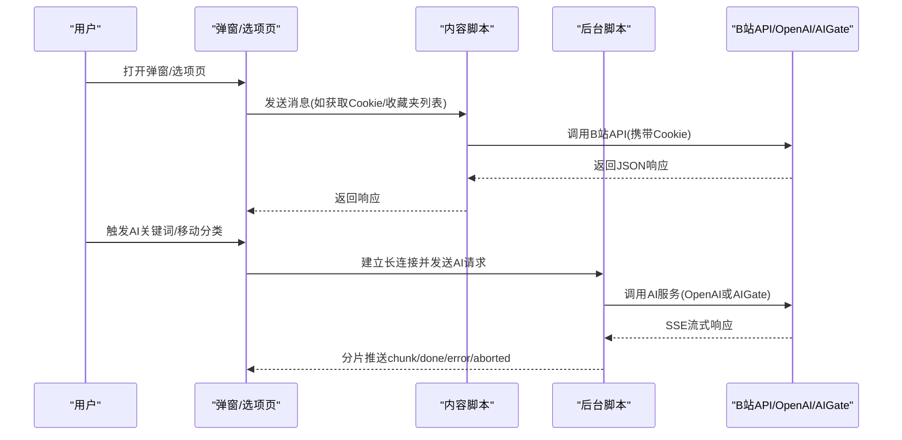
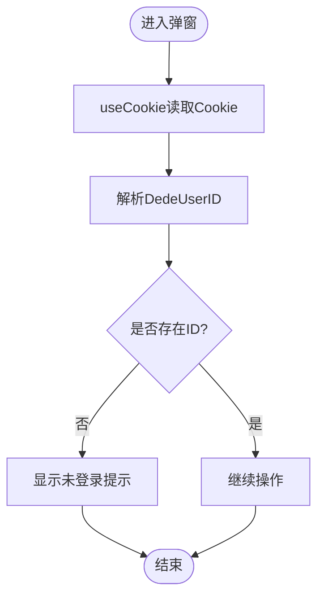
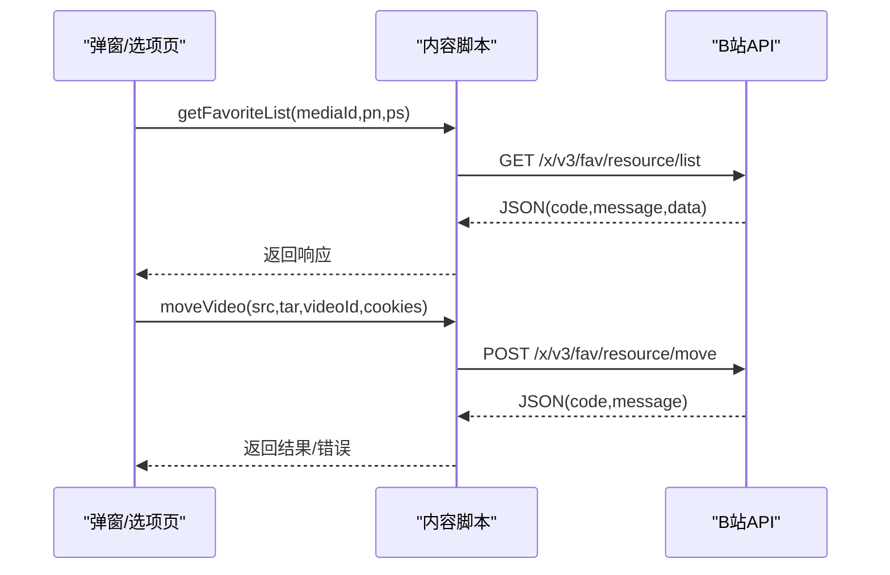
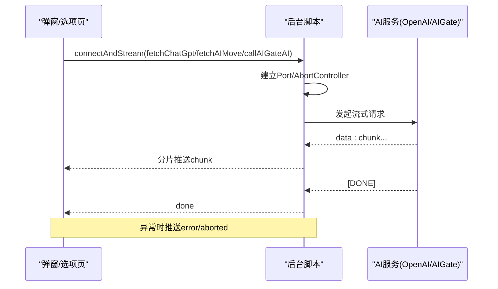
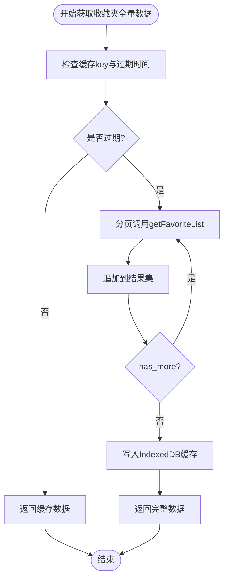
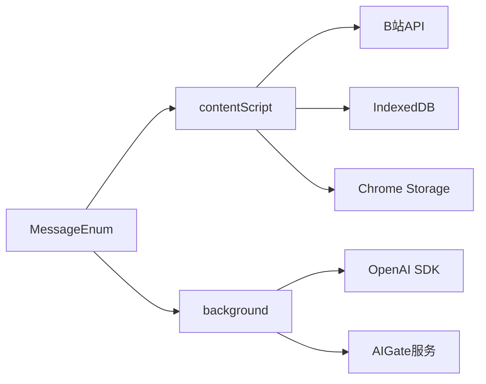

# 故障排除

<cite>
**本文引用的文件**
- [README.md](file://README.md)
- [PRIVACY.md](file://PRIVACY.md)
- [package.json](file://package.json)
- [src/background/index.ts](file://src/background/index.ts)
- [src/contentScript/index.ts](file://src/contentScript/index.ts)
- [src/utils/api.ts](file://src/utils/api.ts)
- [src/utils/cookie.ts](file://src/utils/cookie.ts)
- [src/hooks/use-cookie/index.ts](file://src/hooks/use-cookie/index.ts)
- [src/utils/message.ts](file://src/utils/message.ts)
- [src/utils/tab.ts](file://src/utils/tab.ts)
- [src/utils/log.ts](file://src/utils/log.ts)
- [src/utils/indexed-db.ts](file://src/utils/indexed-db.ts)
- [src/popup/components/login-check/index.tsx](file://src/popup/components/login-check/index.tsx)
- [src/popup/components/tourist/index.tsx](file://src/popup/components/tourist/index.tsx)
- [src/options/components/setting/util.ts](file://src/options/components/setting/util.ts)
- [src/store/global-data.ts](file://src/store/global-data.ts)
</cite>

## 目录
1. [简介](#简介)
2. [项目结构](#项目结构)
3. [核心组件](#核心组件)
4. [架构总览](#架构总览)
5. [详细组件分析](#详细组件分析)
6. [依赖分析](#依赖分析)
7. [性能考虑](#性能考虑)
8. [故障排除指南](#故障排除指南)
9. [结论](#结论)
10. [附录](#附录)

## 简介
本指南面向使用“B站收藏夹整理工具”的用户与技术支持人员，系统性地梳理常见问题与解决方案，覆盖登录失败、功能异常、性能问题、隐私与安全、调试方法与工具使用、错误码含义与处理步骤、性能诊断与优化建议、用户反馈渠道与问题报告模板等内容。文档中的技术细节均基于仓库内实际代码与配置文件进行分析与总结。

## 项目结构
该扩展采用 Manifest V3 架构，主要由以下模块组成：
- 内容脚本：与 B 站页面交互，负责读取 Cookie、转发收藏夹请求等
- 后台脚本：处理 AI 流式通信、配额检查、OpenAI/AIGate 调用
- 选项页与弹窗：提供配置、分析、关键词管理与操作入口
- 工具模块：消息枚举、Cookie 解析、IndexedDB 缓存、标签页查询、日志开关等
- 存储：全局状态通过 Chrome Storage 与 IndexedDB 管理

```mermaid
graph TB
subgraph "UI 层"
Popup["弹窗<br/>Popup"]
Options["选项页<br/>Options"]
SidePanel["侧边栏<br/>SidePanel"]
end
subgraph "内容脚本层"
CS["contentScript<br/>与页面交互"]
end
subgraph "后台脚本层"
BG["background<br/>AI流式通信/配额检查"]
end
subgraph "工具与存储"
Msg["消息枚举<br/>MessageEnum"]
Cookie["Cookie解析<br/>getCookieValue"]
Tab["标签页工具<br/>queryAndSendMessage"]
IDB["IndexedDB缓存<br/>dbManager"]
Log["日志开关<br/>log"]
Store["全局状态<br/>useGlobalConfig"]
end
Popup --> CS
Options --> CS
SidePanel --> CS
CS <- --> BG
BG --> IDB
CS --> Tab
CS --> Cookie
CS --> Msg
BG --> Msg
Popup --> Store
Options --> Store
SidePanel --> Store
BG --> Log
```

图示来源
- [src/contentScript/index.ts:1-55](file://src/contentScript/index.ts#L1-L55)
- [src/background/index.ts:1-393](file://src/background/index.ts#L1-L393)
- [src/utils/message.ts:1-20](file://src/utils/message.ts#L1-L20)
- [src/utils/cookie.ts:1-13](file://src/utils/cookie.ts#L1-L13)
- [src/utils/tab.ts:1-93](file://src/utils/tab.ts#L1-L93)
- [src/utils/indexed-db.ts:1-128](file://src/utils/indexed-db.ts#L1-L128)
- [src/utils/log.ts:1-8](file://src/utils/log.ts#L1-L8)
- [src/store/global-data.ts:1-28](file://src/store/global-data.ts#L1-L28)

章节来源
- [README.md: 82-132:82-132](file://README.md#L82-L132)
- [package.json: 17-27:17-27](file://package.json#L17-L27)

## 核心组件
- 登录检查与 Cookie 读取：弹窗层通过内容脚本读取 Cookie 并校验 DedeUserID，若缺失则提示未登录
- 收藏夹数据获取与移动：内容脚本封装收藏夹列表与移动接口；后台脚本负责 AI 流式通信与配额检查
- AI 服务适配：支持 OpenAI 与 AIGate（免费额度）两种路径，统一通过长连接流式传输
- 缓存与性能：使用 IndexedDB 缓存收藏夹全量数据，24 小时过期策略
- 配置与适配器：选项页支持不同 AI 适配器（OpenAI、星火 Spark、AIGate）

章节来源
- [src/popup/components/login-check/index.tsx: 9-21:9-21](file://src/popup/components/login-check/index.tsx#L9-L21)
- [src/hooks/use-cookie/index.ts: 12-34:12-34](file://src/hooks/use-cookie/index.ts#L12-L34)
- [src/contentScript/index.ts: 4-54:4-54](file://src/contentScript/index.ts#L4-L54)
- [src/utils/api.ts: 117-174:117-174](file://src/utils/api.ts#L117-L174)
- [src/background/index.ts: 315-392:315-392](file://src/background/index.ts#L315-L392)
- [src/utils/indexed-db.ts: 118-123:118-123](file://src/utils/indexed-db.ts#L118-L123)
- [src/options/components/setting/util.ts: 4-25:4-25](file://src/options/components/setting/util.ts#L4-L25)

## 架构总览
扩展通过消息通道在弹窗/选项页与内容脚本之间传递指令，内容脚本再与 Bilibili API 交互；后台脚本负责 AI 服务调用与流式响应，同时维护配额与缓存。



图示来源
- [src/contentScript/index.ts: 4-54:4-54](file://src/contentScript/index.ts#L4-L54)
- [src/background/index.ts: 315-392:315-392](file://src/background/index.ts#L315-L392)
- [src/utils/api.ts: 176-232:176-232](file://src/utils/api.ts#L176-L232)

## 详细组件分析

### 组件A：登录检查与 Cookie 读取
- 登录检查逻辑：弹窗组件依赖 Hook 读取 Cookie 并解析 DedeUserID，若为空则渲染未登录提示
- 内容脚本监听 getCookie 消息，直接返回 document.cookie
- 若提示未登录，请确认已在 B 站页面登录且保持页面打开，再重新打开插件



图示来源
- [src/popup/components/login-check/index.tsx: 9-21:9-21](file://src/popup/components/login-check/index.tsx#L9-L21)
- [src/hooks/use-cookie/index.ts: 12-34:12-34](file://src/hooks/use-cookie/index.ts#L12-L34)
- [src/contentScript/index.ts: 6-9:6-9](file://src/contentScript/index.ts#L6-L9)
- [src/utils/cookie.ts: 1-10:1-10](file://src/utils/cookie.ts#L1-L10)

章节来源
- [README.md: 101-106:101-106](file://README.md#L101-L106)
- [src/popup/components/login-check/index.tsx: 9-21:9-21](file://src/popup/components/login-check/index.tsx#L9-L21)
- [src/hooks/use-cookie/index.ts: 12-34:12-34](file://src/hooks/use-cookie/index.ts#L12-L34)

### 组件B：收藏夹数据获取与移动
- 内容脚本处理 getFavoriteList 与 moveVideo 消息，分别调用 B 站 API 获取列表与移动视频
- 错误时返回 code=-1 或抛出异常，调用方需据此处理



图示来源
- [src/contentScript/index.ts: 25-50:25-50](file://src/contentScript/index.ts#L25-L50)
- [src/utils/api.ts: 117-174:117-174](file://src/utils/api.ts#L117-L174)

章节来源
- [src/contentScript/index.ts: 25-50:25-50](file://src/contentScript/index.ts#L25-L50)
- [src/utils/api.ts: 117-174:117-174](file://src/utils/api.ts#L117-L174)

### 组件C：AI 流式通信与配额检查
- 后台脚本通过 chrome.runtime.onConnect 建立长连接，支持 fetchChatGpt、fetchAIMove、callAIGateAI、checkAIGateQuota 等消息类型
- 流式响应通过 SSE 或 OpenAI SDK stream 推送 chunk/done/error/aborted
- AIGate 配额检查每日/每分钟限制，不足时拒绝请求



图示来源
- [src/utils/api.ts: 176-232:176-232](file://src/utils/api.ts#L176-L232)
- [src/background/index.ts: 315-392:315-392](file://src/background/index.ts#L315-L392)

章节来源
- [src/background/index.ts: 27-91:27-91](file://src/background/index.ts#L27-L91)
- [src/background/index.ts: 315-392:315-392](file://src/background/index.ts#L315-L392)
- [src/utils/api.ts: 234-263:234-263](file://src/utils/api.ts#L234-L263)

### 组件D：缓存与性能
- IndexedDB 缓存收藏夹全量数据，键名包含媒体ID，24 小时过期
- fetchAllFavoriteMedias 首次拉取后写入缓存，后续直接读取缓存



图示来源
- [src/utils/api.ts: 285-319:285-319](file://src/utils/api.ts#L285-L319)
- [src/utils/indexed-db.ts: 118-123:118-123](file://src/utils/indexed-db.ts#L118-L123)

章节来源
- [src/utils/api.ts: 285-319:285-319](file://src/utils/api.ts#L285-L319)
- [src/utils/indexed-db.ts: 118-123:118-123](file://src/utils/indexed-db.ts#L118-L123)

### 组件E：配置与适配器
- 选项页支持 Adapter 切换：OpenAI、星火 Spark、AIGate
- 默认额外参数对 Spark 进行思维模式禁用，OpenAI 默认空对象
- 建议优先使用“星火大模型”以获得免费额度

章节来源
- [src/options/components/setting/util.ts: 4-25:4-25](file://src/options/components/setting/util.ts#L4-L25)
- [README.md: 73-79:73-79](file://README.md#L73-L79)

## 依赖分析
- 消息通道：MessageEnum 定义了 getCookie、getFavoriteList、getAllFavoriteFlag、moveVideo、fetchChatGpt、fetchAIMove、checkAIGateQuota、callAIGateAI 等类型
- 运行时依赖：OpenAI SDK、Chrome Runtime、IndexedDB、Chrome Storage
- 版本与构建：Node >= 14.18.0，使用 Vite 构建，支持测试与覆盖率



图示来源
- [src/utils/message.ts: 1-L20:1-20](file://src/utils/message.ts#L1-L20)
- [src/contentScript/index.ts: 1-L55:1-55](file://src/contentScript/index.ts#L1-L55)
- [src/background/index.ts: 1-L393:1-393](file://src/background/index.ts#L1-L393)
- [package.json: 29-L58:29-58](file://package.json#L29-L58)

章节来源
- [src/utils/message.ts: 1-L20:1-20](file://src/utils/message.ts#L1-L20)
- [package.json: 29-L58:29-58](file://package.json#L29-L58)

## 性能考虑
- 缓存策略：收藏夹全量数据缓存 24 小时，减少重复网络请求
- 分页拉取：fetchAllFavoriteMedias 逐页获取并聚合，避免单次请求过大
- 流式响应：AI 请求采用流式传输，降低首帧延迟
- 存储位置：配置与缓存分别使用 Chrome Storage 与 IndexedDB，兼顾容量与访问速度

章节来源
- [src/utils/api.ts: 285-319:285-319](file://src/utils/api.ts#L285-L319)
- [src/utils/indexed-db.ts: 118-123:118-123](file://src/utils/indexed-db.ts#L118-L123)
- [src/background/index.ts: 197-247:197-247](file://src/background/index.ts#L197-L247)

## 故障排除指南

### 一、登录相关问题
- 现象：弹窗显示“请检查是否在b站打开并登录了呢”
- 可能原因
  - 未在 B 站页面登录或 Cookie 未正确注入
  - 内容脚本未能获取 Cookie
  - DedeUserID 解析失败
- 排查步骤
  1) 确认已在 B 站任意页面登录，保持页面打开
  2) 重新打开插件弹窗，检查是否仍提示未登录
  3) 在 B 站页面打开控制台，手动执行 document.cookie 并确认包含 DedeUserID
  4) 查看内容脚本是否能返回 Cookie（消息 getCookie）
  5) 检查 Cookie 解析逻辑是否正确
- 相关代码参考
  - [src/popup/components/login-check/index.tsx: 9-21:9-21](file://src/popup/components/login-check/index.tsx#L9-L21)
  - [src/hooks/use-cookie/index.ts: 12-34:12-34](file://src/hooks/use-cookie/index.ts#L12-L34)
  - [src/contentScript/index.ts: 6-9:6-9](file://src/contentScript/index.ts#L6-L9)
  - [src/utils/cookie.ts: 1-10:1-10](file://src/utils/cookie.ts#L1-L10)

章节来源
- [src/popup/components/login-check/index.tsx: 9-21:9-21](file://src/popup/components/login-check/index.tsx#L9-L21)
- [src/hooks/use-cookie/index.ts: 12-34:12-34](file://src/hooks/use-cookie/index.ts#L12-L34)
- [src/contentScript/index.ts: 6-9:6-9](file://src/contentScript/index.ts#L6-L9)
- [src/utils/cookie.ts: 1-10:1-10](file://src/utils/cookie.ts#L1-L10)
- [README.md: 101-106:101-106](file://README.md#L101-L106)

### 二、功能异常（收藏夹列表/移动失败）
- 现象：获取收藏夹列表失败或移动视频返回错误
- 可能原因
  - B 站 API 返回非 code=0
  - 内容脚本未正确转发 Cookie 或 CSRF 缺失
  - 网络超时或标签页不可用
- 排查步骤
  1) 检查 getFavoriteList 返回的 code/message
  2) 确认 moveFavorite 请求体包含 CSRF 与 DedeUserID
  3) 使用 queryAndSendMessage 检查标签页查询与消息发送是否成功
  4) 如超时，增大超时时间或检查标签页状态
- 相关代码参考
  - [src/contentScript/index.ts: 25-50:25-50](file://src/contentScript/index.ts#L25-L50)
  - [src/utils/api.ts: 117-174:117-174](file://src/utils/api.ts#L117-L174)
  - [src/utils/tab.ts: 65-82:65-82](file://src/utils/tab.ts#L65-L82)

章节来源
- [src/contentScript/index.ts: 25-50:25-50](file://src/contentScript/index.ts#L25-L50)
- [src/utils/api.ts: 117-174:117-174](file://src/utils/api.ts#L117-L174)
- [src/utils/tab.ts: 65-82:65-82](file://src/utils/tab.ts#L65-L82)

### 三、AI 功能异常
- 现象：AI 关键词提取或智能分类无响应、报错或提前终止
- 可能原因
  - OpenAI 配置错误或网络受限
  - AIGate 配额不足或服务异常
  - 流式响应被中断（用户取消或端口断开）
- 排查步骤
  1) 在选项页检查 Adapter 选择与配置（OpenAI/Spark/AIGate）
  2) 对于 AIGate：调用 checkAIGateQuota 检查剩余配额
  3) 观察后台脚本日志，确认是否收到 error/aborted
  4) 若为取消：确认前端是否正确触发取消并断开 Port
- 相关代码参考
  - [src/options/components/setting/util.ts: 4-25:4-25](file://src/options/components/setting/util.ts#L4-L25)
  - [src/background/index.ts: 27-91:27-91](file://src/background/index.ts#L27-L91)
  - [src/background/index.ts: 315-392:315-392](file://src/background/index.ts#L315-L392)
  - [src/utils/api.ts: 176-232:176-232](file://src/utils/api.ts#L176-L232)

章节来源
- [src/options/components/setting/util.ts: 4-25:4-25](file://src/options/components/setting/util.ts#L4-L25)
- [src/background/index.ts: 27-91:27-91](file://src/background/index.ts#L27-L91)
- [src/background/index.ts: 315-392:315-392](file://src/background/index.ts#L315-L392)
- [src/utils/api.ts: 176-232:176-232](file://src/utils/api.ts#L176-L232)

### 四、性能问题
- 现象：首次获取收藏夹耗时较长、频繁刷新导致请求过多
- 可能原因
  - 未命中缓存或缓存过期
  - 未启用分页拉取或分页大小不当
- 优化建议
  1) 确认缓存键与过期时间（默认 24 小时）
  2) 使用 fetchAllFavoriteMedias 的内置缓存逻辑
  3) 避免频繁刷新，合理利用缓存
- 相关代码参考
  - [src/utils/api.ts: 285-319:285-319](file://src/utils/api.ts#L285-L319)
  - [src/utils/indexed-db.ts: 118-123:118-123](file://src/utils/indexed-db.ts#L118-L123)

章节来源
- [src/utils/api.ts: 285-319:285-319](file://src/utils/api.ts#L285-L319)
- [src/utils/indexed-db.ts: 118-123:118-123](file://src/utils/indexed-db.ts#L118-L123)

### 五、隐私与安全相关问题
- 现象：担心数据被上传或泄露
- 事实与保障
  - 仅在本地浏览器进行数据处理，不上传至任何第三方服务器
  - 仅访问 Bilibili 官方 API 与可选 OpenAI API
  - 配置与缓存数据存储于 Chrome Storage 与 IndexedDB
- 参考声明
  - [PRIVACY.md: 9-47:9-47](file://PRIVACY.md#L9-L47)
  - [PRIVACY.md: 48-57:48-57](file://PRIVACY.md#L48-L57)
  - [PRIVACY.md: 68-76:68-76](file://PRIVACY.md#L68-L76)

章节来源
- [PRIVACY.md: 9-47:9-47](file://PRIVACY.md#L9-L47)
- [PRIVACY.md: 48-57:48-57](file://PRIVACY.md#L48-L57)
- [PRIVACY.md: 68-76:68-76](file://PRIVACY.md#L68-L76)

### 六、调试方法与工具使用
- 浏览器开发者工具
  - 控制台：查看日志与错误堆栈（仅在开发环境开启）
  - 网络面板：检查 B 站与 AI 服务请求状态、Headers、Body
  - 扩展页：定位消息通道与 Port 连接状态
- 日志与开关
  - 仅在开发模式下输出日志，便于定位问题
- 相关代码参考
  - [src/utils/log.ts: 1-8:1-8](file://src/utils/log.ts#L1-L8)
  - [src/background/index.ts: 315-392:315-392](file://src/background/index.ts#L315-L392)

章节来源
- [src/utils/log.ts: 1-8:1-8](file://src/utils/log.ts#L1-L8)
- [src/background/index.ts: 315-392:315-392](file://src/background/index.ts#L315-L392)

### 七、错误码与含义
- B 站 API 响应结构包含 code/message/ttl/data 字段
- 常见场景
  - code 非 0：表示接口调用失败，需根据 message 提示处理
  - 移动接口返回 -1：内容脚本捕获异常或未正确返回
- 处理建议
  - 检查登录状态与 Cookie
  - 核对 CSRF 与用户 MID
  - 重试或切换 Adapter
- 相关代码参考
  - [src/utils/api.ts: 7-12:7-12](file://src/utils/api.ts#L7-L12)
  - [src/contentScript/index.ts: 18-20:18-20](file://src/contentScript/index.ts#L18-L20)

章节来源
- [src/utils/api.ts: 7-12:7-12](file://src/utils/api.ts#L7-L12)
- [src/contentScript/index.ts: 18-20:18-20](file://src/contentScript/index.ts#L18-L20)

### 八、用户反馈渠道与问题报告模板
- 反馈渠道
  - GitHub Issues：https://github.com/your-repo/bilibili-favorite/issues
- 问题报告模板（建议）
  - 扩展版本：1.1.7
  - 浏览器与系统：Chrome 版本、操作系统版本
  - 复现步骤：清晰描述操作流程
  - 预期结果 vs 实际结果
  - 截图或录屏（网络面板、控制台日志）
  - 是否使用 AI 功能及 Adapter 类型
  - 是否启用缓存与缓存键（如适用）
- 参考声明
  - [PRIVACY.md: 95-98:95-98](file://PRIVACY.md#L95-L98)

章节来源
- [PRIVACY.md: 95-98:95-98](file://PRIVACY.md#L95-L98)

## 结论
本指南基于仓库代码与配置，提供了从登录、功能、AI、性能到隐私与安全的系统性故障排除路径。建议用户优先核对登录状态与 Cookie、检查缓存与网络请求、结合后台日志定位问题，并通过 GitHub Issues 提供详细信息以便快速修复。

## 附录

### A. 常见问题速查表
- 登录失败：确认 B 站页面已登录且 Cookie 可用
- 获取列表失败：检查 code/message，必要时切换 Adapter
- 移动失败：确认 CSRF 与 MID，重试或刷新页面
- AI 无响应：检查配额、网络与取消状态
- 性能差：启用缓存、避免频繁刷新

### B. 术语说明
- CSRF：跨站请求伪造，移动接口必需
- SSE：服务器推送事件，用于流式响应
- Port：Chrome Runtime 长连接通道