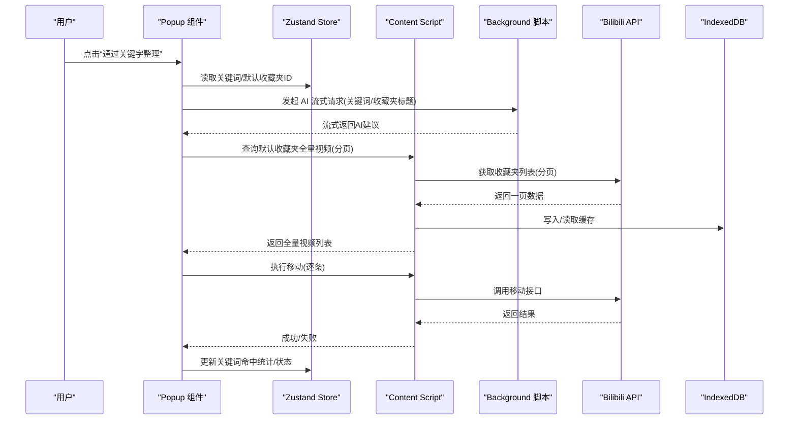
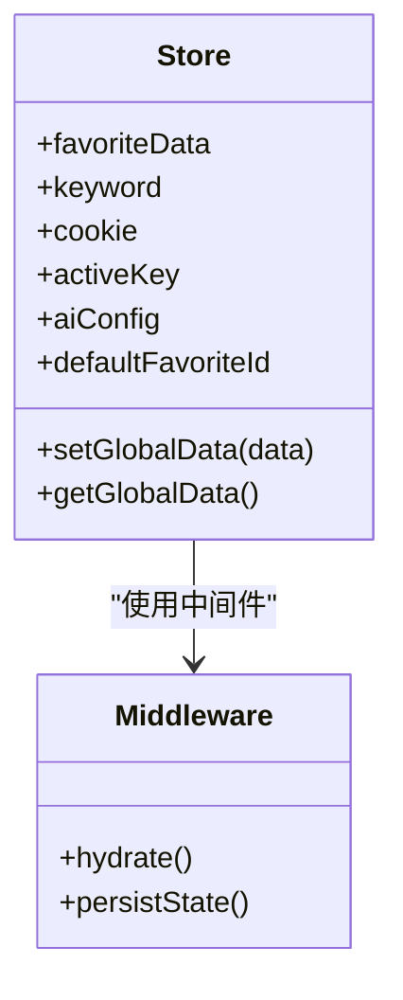
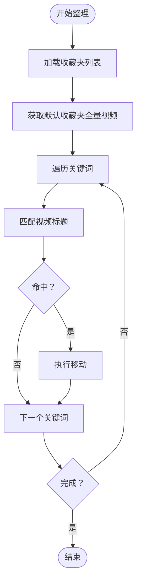
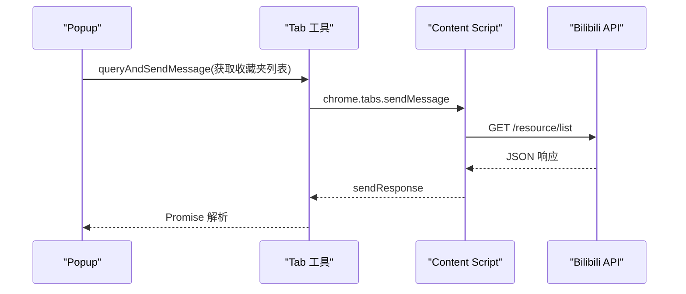
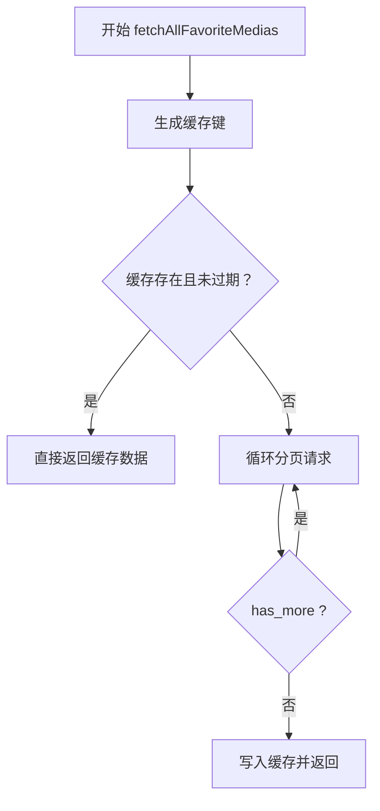
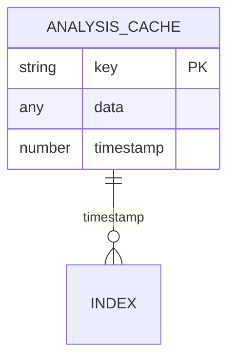
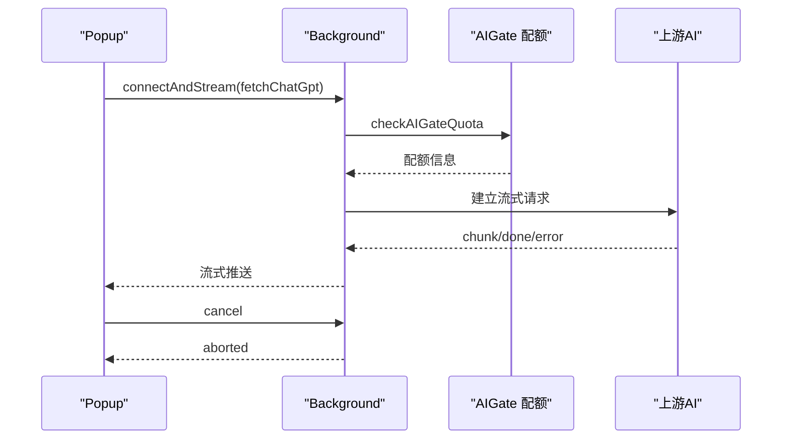
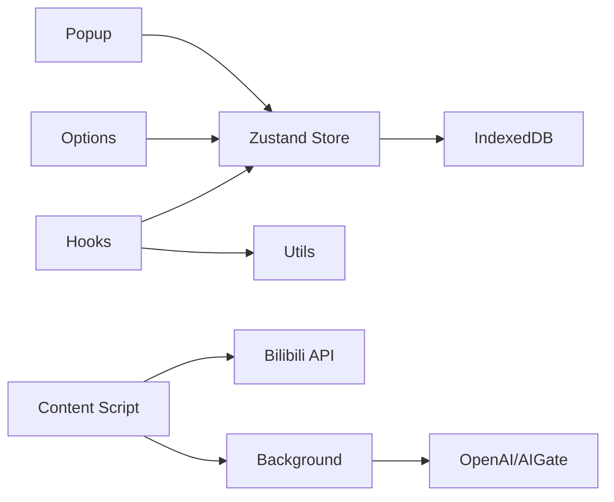

# 数据流设计

<cite>
**本文引用的文件**
- [src/store/global-data.ts](file://src/store/global-data.ts)
- [src/store/chorme-storage-middleware.ts](file://src/store/chorme-storage-middleware.ts)
- [src/utils/data-context.ts](file://src/utils/data-context.ts)
- [src/utils/api.ts](file://src/utils/api.ts)
- [src/utils/tab.ts](file://src/utils/tab.ts)
- [src/utils/message.ts](file://src/utils/message.ts)
- [src/utils/indexed-db.ts](file://src/utils/indexed-db.ts)
- [src/contentScript/index.ts](file://src/contentScript/index.ts)
- [src/background/index.ts](file://src/background/index.ts)
- [src/hooks/use-favorite-data/index.ts](file://src/hooks/use-favorite-data/index.ts)
- [src/hooks/use-move/index.tsx](file://src/hooks/use-move/index.tsx)
- [src/popup/components/move/index.tsx](file://src/popup/components/move/index.tsx)
- [src/options/components/setting/index.tsx](file://src/options/components/setting/index.tsx)
- [src/manifest.ts](file://src/manifest.ts)
</cite>

## 目录
1. [简介](#简介)
2. [项目结构](#项目结构)
3. [核心组件](#核心组件)
4. [架构总览](#架构总览)
5. [详细组件分析](#详细组件分析)
6. [依赖关系分析](#依赖关系分析)
7. [性能考量](#性能考量)
8. [故障排查指南](#故障排查指南)
9. [结论](#结论)
10. [附录](#附录)

## 简介
本文件面向“B站收藏夹整理工具”的数据流设计，围绕从用户交互到数据持久化的完整链路进行系统化梳理。重点覆盖以下方面：
- 单向数据流与异步处理：React 组件状态更新、Zustand Store 数据变更、后台脚本 API 调用、数据库存储的协调机制。
- Bilibili API 数据获取：分页加载、错误处理、缓存策略与速率限制处理。
- IndexedDB 本地存储：数据模型、索引策略与查询优化。
- 数据同步机制、冲突解决与数据迁移方案。

## 项目结构
该扩展采用 Manifest V3 架构，包含 Popup、Options、Side Panel、Content Script、Background 以及若干 React 组件与 Zustand Store。核心数据流由消息通道驱动，跨页面脚本与后台脚本协同完成。

```mermaid
graph TB
subgraph "浏览器环境"
Popup["Popup 页面<br/>触发整理动作"]
Options["Options 页面<br/>配置AI参数/配额"]
SidePanel["Side Panel 页面"]
end
subgraph "扩展内核"
CS["Content Script<br/>与 B站页面通信"]
BG["Background 脚本<br/>AI流式处理/配额检查"]
Store["Zustand Store<br/>全局状态+Chrome Storage 持久化"]
IDB["IndexedDB 管理器<br/>本地缓存"]
end
subgraph "外部服务"
BAPI["Bilibili API"]
OAIMS["OpenAI / Spark / 自定义"]
AIGATE["AIGate 免费配额服务"]
end
Popup --> Store
Options --> Store
Popup --> CS
CS <- --> BAPI
CS --> BG
BG --> OAIMS
BG --> AIGATE
Store < --> IDB
```

图表来源
- [src/manifest.ts:19-54](file://src/manifest.ts#L19-L54)
- [src/contentScript/index.ts:1-55](file://src/contentScript/index.ts#L1-L55)
- [src/background/index.ts:315-392](file://src/background/index.ts#L315-L392)
- [src/store/global-data.ts:6-25](file://src/store/global-data.ts#L6-L25)
- [src/utils/indexed-db.ts:15-124](file://src/utils/indexed-db.ts#L15-L124)

章节来源
- [src/manifest.ts:19-54](file://src/manifest.ts#L19-L54)

## 核心组件
- Zustand 全局状态与持久化
  - Store 定义了收藏夹列表、关键词、Cookie、默认收藏夹ID、AI 配置等字段，并通过自定义中间件将指定键持久化至 Chrome Storage。
- 内容脚本与消息桥接
  - Content Script 监听来自 Popup 的消息，转发至 Bilibili API 并回传结果；同时可直接调用 B 站接口。
- 后台脚本与 AI 流式处理
  - Background 通过长连接与 Popup 建立流式通信，支持取消、错误处理与配额检查；支持 OpenAI/SSE/AIGate 等多种适配。
- IndexedDB 缓存
  - 提供键值缓存、过期检测、事务读写，用于收藏夹全量数据的本地缓存与加速。

章节来源
- [src/store/global-data.ts:6-25](file://src/store/global-data.ts#L6-L25)
- [src/store/chorme-storage-middleware.ts:3-34](file://src/store/chorme-storage-middleware.ts#L3-L34)
- [src/utils/data-context.ts:3-31](file://src/utils/data-context.ts#L3-L31)
- [src/contentScript/index.ts:4-54](file://src/contentScript/index.ts#L4-L54)
- [src/background/index.ts:315-392](file://src/background/index.ts#L315-L392)
- [src/utils/indexed-db.ts:15-124](file://src/utils/indexed-db.ts#L15-L124)

## 架构总览
整体数据流遵循“用户交互 → React 组件 → Zustand Store → 消息桥接 → Content Script/B站 API → IndexedDB 缓存 → Store 更新”的闭环。AI 整理流程通过 Background 脚本以流式方式与前端交互，支持取消与配额控制。



图表来源
- [src/hooks/use-move/index.tsx:27-124](file://src/hooks/use-move/index.tsx#L27-L124)
- [src/utils/api.ts:285-319](file://src/utils/api.ts#L285-L319)
- [src/contentScript/index.ts:25-37](file://src/contentScript/index.ts#L25-L37)
- [src/background/index.ts:334-375](file://src/background/index.ts#L334-L375)
- [src/utils/indexed-db.ts:45-81](file://src/utils/indexed-db.ts#L45-L81)

## 详细组件分析

### 1) Zustand Store 与 Chrome Storage 持久化
- 设计要点
  - 使用 Immer 中间件简化不可变更新。
  - 通过自定义中间件仅持久化白名单字段，避免冗余存储。
  - 初始化时从 Chrome Storage 恢复状态，随后 setState 自动落盘。
- 关键字段
  - 收藏夹列表、关键词、Cookie、默认收藏夹ID、AI 配置、活动键等。
- 状态一致性
  - 仅持久化必要键，减少存储体积；通过浅订阅降低渲染成本。



图表来源
- [src/store/global-data.ts:6-25](file://src/store/global-data.ts#L6-L25)
- [src/store/chorme-storage-middleware.ts:8-57](file://src/store/chorme-storage-middleware.ts#L8-L57)
- [src/utils/data-context.ts:3-31](file://src/utils/data-context.ts#L3-L31)

章节来源
- [src/store/global-data.ts:6-25](file://src/store/global-data.ts#L6-L25)
- [src/store/chorme-storage-middleware.ts:3-57](file://src/store/chorme-storage-middleware.ts#L3-L57)
- [src/utils/data-context.ts:3-31](file://src/utils/data-context.ts#L3-L31)

### 2) React 组件与 Hook：收藏夹数据与移动流程
- useFavoriteData
  - 首次加载时通过消息查询收藏夹列表，成功后写入 Store 并设置默认收藏夹ID。
- useMove
  - 主流程：拉取默认收藏夹全量视频 → 遍历关键词 → 匹配标题 → 逐条移动 → UI 动画与取消。
  - 错误处理：捕获异常并提示；支持取消标志位中断循环。
- Popup 按钮
  - 展示帮助说明与触发入口。



图表来源
- [src/hooks/use-favorite-data/index.ts:32-52](file://src/hooks/use-favorite-data/index.ts#L32-L52)
- [src/hooks/use-move/index.tsx:60-97](file://src/hooks/use-move/index.tsx#L60-L97)
- [src/popup/components/move/index.tsx:6-38](file://src/popup/components/move/index.tsx#L6-L38)

章节来源
- [src/hooks/use-favorite-data/index.ts:23-61](file://src/hooks/use-favorite-data/index.ts#L23-L61)
- [src/hooks/use-move/index.tsx:14-158](file://src/hooks/use-move/index.tsx#L14-L158)
- [src/popup/components/move/index.tsx:6-38](file://src/popup/components/move/index.tsx#L6-L38)

### 3) 消息桥接与跨脚本通信
- 消息枚举
  - 定义了 Cookie 获取、移动视频、获取收藏夹列表、获取全部收藏夹、AI 请求等消息类型。
- Content Script
  - 监听消息，转发至 Bilibili API 并回传响应；支持移动视频与获取收藏夹列表。
- Tab 工具
  - 提供查询 B站标签页、向指定标签页发送消息并带超时控制。
- Background
  - 建立长连接，处理流式 AI 请求、配额检查与取消逻辑。



图表来源
- [src/utils/message.ts:1-20](file://src/utils/message.ts#L1-L20)
- [src/contentScript/index.ts:25-37](file://src/contentScript/index.ts#L25-L37)
- [src/utils/tab.ts:65-82](file://src/utils/tab.ts#L65-L82)

章节来源
- [src/utils/message.ts:1-20](file://src/utils/message.ts#L1-L20)
- [src/contentScript/index.ts:4-54](file://src/contentScript/index.ts#L4-L54)
- [src/utils/tab.ts:37-82](file://src/utils/tab.ts#L37-L82)

### 4) Bilibili API 数据获取与缓存策略
- 分页加载
  - 通过循环调用资源列表接口，依据 has_more 字段决定是否继续翻页。
- 缓存策略
  - 使用 IndexedDB 对“默认收藏夹全量视频”进行键值缓存，支持过期检测（默认 24 小时）。
- 错误处理
  - 对响应 code 非 0 的场景抛出错误；Content Script 与调用方均进行异常捕获与回退。
- 速率限制
  - 通过分页与本地缓存降低请求频率；AI 请求通过配额检查与取消机制避免滥用。



图表来源
- [src/utils/api.ts:285-319](file://src/utils/api.ts#L285-L319)
- [src/utils/indexed-db.ts:118-123](file://src/utils/indexed-db.ts#L118-L123)

章节来源
- [src/utils/api.ts:117-130](file://src/utils/api.ts#L117-L130)
- [src/utils/api.ts:285-319](file://src/utils/api.ts#L285-L319)
- [src/utils/indexed-db.ts:45-81](file://src/utils/indexed-db.ts#L45-L81)

### 5) IndexedDB 本地存储模型与优化
- 数据模型
  - 存储名 analysis-cache，键路径 key，包含索引 timestamp。
  - 缓存项结构包含 key、data、timestamp。
- 索引策略
  - 以 timestamp 为索引，便于按过期策略清理或查询。
- 查询优化
  - 读写分离事务；按需初始化数据库；提供 isExpired 辅助方法。
- 迁移与清理
  - 版本升级时创建对象仓库与索引；提供 clear 清空能力。



图表来源
- [src/utils/indexed-db.ts:5-9](file://src/utils/indexed-db.ts#L5-L9)
- [src/utils/indexed-db.ts:34-37](file://src/utils/indexed-db.ts#L34-L37)

章节来源
- [src/utils/indexed-db.ts:15-124](file://src/utils/indexed-db.ts#L15-L124)

### 6) AI 整理流程与配额控制
- 流式通信
  - Popup 通过长连接与 Background 建立流式通道，支持取消与错误上报。
- 配额检查
  - Background 调用 AIGate 配额接口，返回每日/每分钟配额信息；不足时拒绝请求。
- 取消机制
  - 用户点击取消或断开连接时，Background 中止流式请求并通知前端。
- 适配多源
  - 支持 OpenAI/SSE/AIGate 等不同上游，统一以流式 chunk 形式回传。



图表来源
- [src/utils/api.ts:180-232](file://src/utils/api.ts#L180-L232)
- [src/background/index.ts:28-91](file://src/background/index.ts#L28-L91)
- [src/background/index.ts:334-375](file://src/background/index.ts#L334-L375)

章节来源
- [src/utils/api.ts:234-263](file://src/utils/api.ts#L234-L263)
- [src/background/index.ts:94-192](file://src/background/index.ts#L94-L192)

### 7) 数据同步、冲突解决与迁移
- 同步机制
  - Store 通过 setState 自动持久化；Content Script 在成功获取数据后回写 Store。
- 冲突解决
  - 读取优先级：内存 > 缓存 > 网络；写入时仅持久化白名单字段，避免覆盖无关数据。
- 数据迁移
  - IndexedDB 版本升级时创建对象仓库与索引；可在此处添加迁移逻辑（如字段重命名、默认值填充）。

章节来源
- [src/store/chorme-storage-middleware.ts:22-34](file://src/store/chorme-storage-middleware.ts#L22-L34)
- [src/utils/indexed-db.ts:31-38](file://src/utils/indexed-db.ts#L31-L38)

## 依赖关系分析
- 组件耦合
  - Popup/Options 依赖 Store；Hook 仅依赖 Store 与工具模块；Content Script 与 Background 通过消息解耦。
- 外部依赖
  - Bilibili API、OpenAI/SSE、AIGate；权限由 manifest 声明。
- 循环依赖
  - 未见直接循环导入；消息枚举与工具模块被多处引用，但均为单向依赖。



图表来源
- [src/manifest.ts:39-46](file://src/manifest.ts#L39-L46)
- [src/contentScript/index.ts:1-55](file://src/contentScript/index.ts#L1-L55)
- [src/background/index.ts:315-392](file://src/background/index.ts#L315-L392)

章节来源
- [src/manifest.ts:39-46](file://src/manifest.ts#L39-L46)

## 性能考量
- 异步与并发
  - 移动操作采用串行逐条执行，避免 API 限速与状态竞争；可在 UI 层增加批量进度反馈。
- 缓存与网络
  - 默认收藏夹全量数据缓存 24 小时，显著降低重复抓取成本；分页请求避免一次性大负载。
- 存储与 IO
  - IndexedDB 事务读写，避免频繁序列化；仅持久化必要字段，减少存储压力。
- UI 响应
  - Loading 动画与取消按钮提升用户体验；Toast 提示错误信息。

## 故障排查指南
- 无 B站标签页
  - queryAndSendMessage 会因找不到标签页而报错；确认扩展已注入到 B站页面。
- 消息超时
  - sendMessageToTab 设置了超时时间；若长时间无响应，检查 Content Script 是否正常监听。
- 移动失败
  - Content Script 在移动失败时回传错误码；检查 Cookie 有效性与 CSRF 参数。
- AI 请求失败
  - 检查配额与网络；确认取消逻辑是否正确触发；查看 Background 日志。
- Store 不持久化
  - 确认中间件已启用且持久化键在白名单中；检查 Chrome Storage 权限。

章节来源
- [src/utils/tab.ts:65-82](file://src/utils/tab.ts#L65-L82)
- [src/contentScript/index.ts:12-23](file://src/contentScript/index.ts#L12-L23)
- [src/background/index.ts:334-375](file://src/background/index.ts#L334-L375)
- [src/store/chorme-storage-middleware.ts:3-34](file://src/store/chorme-storage-middleware.ts#L3-L34)

## 结论
该系统通过消息桥接与后台脚本实现了前端与外部 API 的解耦，结合 Zustand Store 与 IndexedDB 缓存，形成了清晰的单向数据流与一致的状态管理。AI 整理流程通过流式通信与配额控制保障了稳定性与可控性。后续可在批量移动、缓存清理策略与迁移脚本上进一步增强。

## 附录
- 关键流程路径参考
  - [分页获取收藏夹全量视频:285-319](file://src/utils/api.ts#L285-L319)
  - [IndexedDB 缓存读写:45-81](file://src/utils/indexed-db.ts#L45-L81)
  - [消息枚举与类型:1-20](file://src/utils/message.ts#L1-L20)
  - [Store 初始化与持久化:6-25](file://src/store/global-data.ts#L6-L25)
  - [AI 流式请求与配额检查:94-192](file://src/background/index.ts#L94-L192)