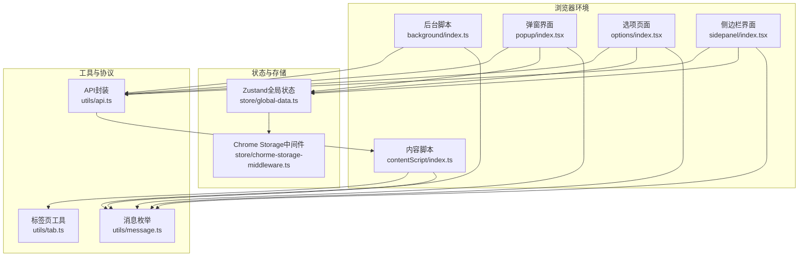
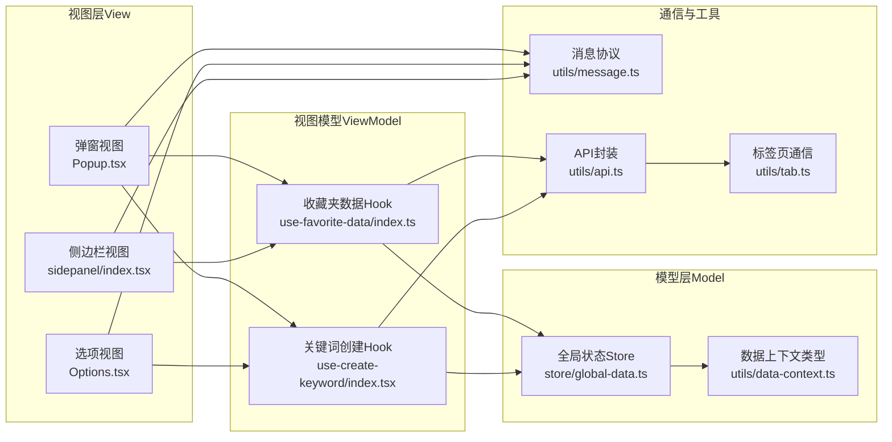
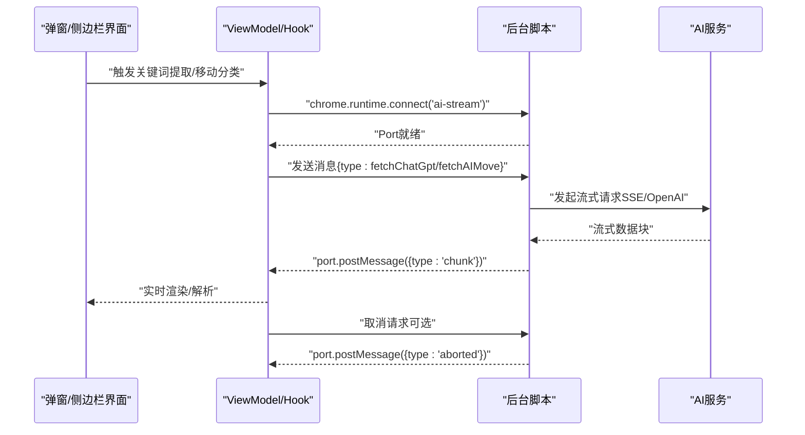
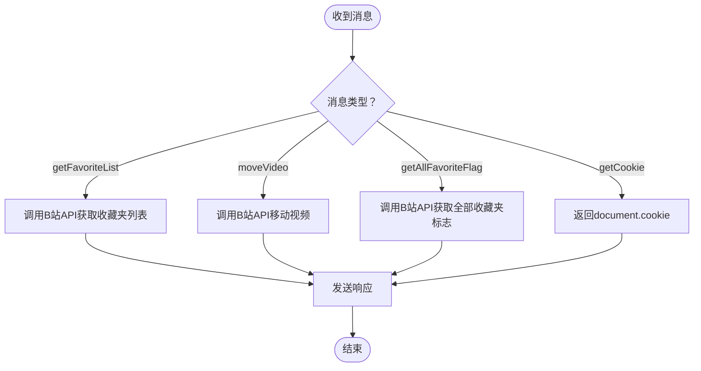
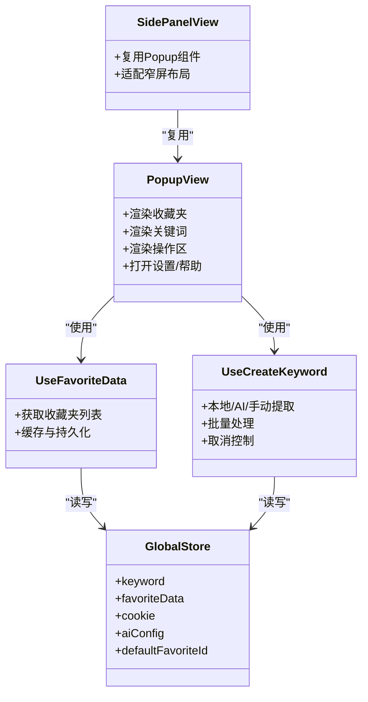
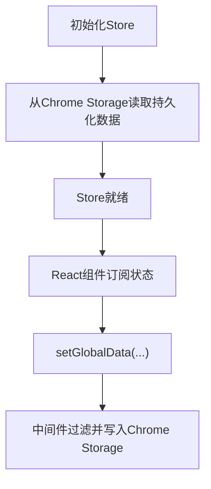
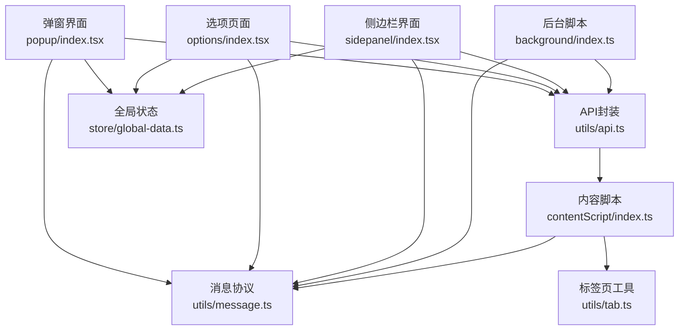

# 整体架构模式

<cite>
**本文引用的文件**   
- [manifest.ts](file://src/manifest.ts)
- [background/index.ts](file://src/background/index.ts)
- [contentScript/index.ts](file://src/contentScript/index.ts)
- [popup/index.tsx](file://src/popup/index.tsx)
- [options/index.tsx](file://src/options/index.tsx)
- [sidepanel/index.tsx](file://src/sidepanel/index.tsx)
- [message.ts](file://src/utils/message.ts)
- [global-data.ts](file://src/store/global-data.ts)
- [chorme-storage-middleware.ts](file://src/store/chorme-storage-middleware.ts)
- [Popup.tsx](file://src/popup/Popup.tsx)
- [Options.tsx](file://src/options/Options.tsx)
- [api.ts](file://src/utils/api.ts)
- [data-context.ts](file://src/utils/data-context.ts)
- [use-favorite-data/index.ts](file://src/hooks/use-favorite-data/index.ts)
- [use-create-keyword/index.tsx](file://src/hooks/use-create-keyword/index.tsx)
- [tab.ts](file://src/utils/tab.ts)
- [package.json](file://package.json)
</cite>

## 目录
1. [引言](#引言)
2. [项目结构](#项目结构)
3. [核心组件](#核心组件)
4. [架构总览](#架构总览)
5. [详细组件分析](#详细组件分析)
6. [依赖分析](#依赖分析)
7. [性能考虑](#性能考虑)
8. [故障排查指南](#故障排查指南)
9. [结论](#结论)
10. [附录](#附录)

## 引言
本文件面向“B站收藏夹整理工具”的整体架构与MVVM模式实现，系统性阐述Chrome扩展的模块划分、职责边界、生命周期管理、权限控制与安全边界，并说明清单（manifest）配置对架构的影响。重点覆盖以下模块：
- 后台脚本（background）：AI流式通信、配额检查、跨域AI服务调用
- 内容脚本（contentScript）：与网页交互、B站API调用、消息转发
- 弹窗界面（popup）：主操作入口、功能编排
- 选项页面（options）：配置与分析、可视化管理
- 侧边栏界面（sidepanel）：轻量化操作面板
- 存储与状态（Zustand + Chrome Storage）：全局状态持久化与中间件
- 工具与消息（utils/message、utils/tab）：统一消息协议与跨页通信
- 清单（manifest）：权限声明、资源访问控制、更新机制

## 项目结构
该项目采用以功能域为中心的组织方式，结合MVVM分层与组件化设计：
- 功能域：background、contentScript、popup、options、sidepanel、components、hooks、store、utils、workers
- 展示层：React应用入口（popup、options、sidepanel）
- 状态层：Zustand全局状态 + Chrome Storage中间件
- 通信层：chrome.runtime消息与Port长连接、chrome.tabs跨页通信
- 工具层：API封装、数据上下文、索引数据库、消息协议

图表来源
- [background/index.ts:1-393](file://src/background/index.ts#L1-L393)
- [contentScript/index.ts:1-55](file://src/contentScript/index.ts#L1-L55)
- [popup/index.tsx:1-17](file://src/popup/index.tsx#L1-L17)
- [options/index.tsx:1-19](file://src/options/index.tsx#L1-L19)
- [sidepanel/index.tsx:1-11](file://src/sidepanel/index.tsx#L1-L11)
- [global-data.ts:1-28](file://src/store/global-data.ts#L1-L28)
- [chorme-storage-middleware.ts:1-63](file://src/store/chorme-storage-middleware.ts#L1-L63)
- [message.ts:1-20](file://src/utils/message.ts#L1-L20)
- [tab.ts:1-93](file://src/utils/tab.ts#L1-L93)
- [api.ts:1-339](file://src/utils/api.ts#L1-L339)

章节来源
- [manifest.ts:1-55](file://src/manifest.ts#L1-L55)
- [package.json:1-91](file://package.json#L1-L91)

## 核心组件
- 后台脚本（background）：负责AI流式通信、配额检查、与外部AI服务（OpenAI/AIGate）交互；通过Port建立长连接，支持取消与错误处理。
- 内容脚本（contentScript）：注入到B站页面，直接与B站API交互，提供收藏夹列表、移动视频等能力；通过消息监听器响应后台/界面请求。
- 弹窗界面（popup）：React应用入口，承载主要功能按钮与引导流程，支持侧边栏模式复用。
- 选项页面（options）：React应用入口，提供配置、关键字管理、拖拽可视化、数据分析等。
- 侧边栏界面（sidepanel）：轻量React应用，复用弹窗组件，适配窄屏场景。
- 全局状态（Zustand）：集中管理收藏夹、关键词、AI配置、默认收藏夹等；通过Chrome Storage中间件持久化。
- 工具与协议：统一消息枚举、跨页通信工具、API封装与数据上下文。

章节来源
- [background/index.ts:1-393](file://src/background/index.ts#L1-L393)
- [contentScript/index.ts:1-55](file://src/contentScript/index.ts#L1-L55)
- [popup/index.tsx:1-17](file://src/popup/index.tsx#L1-L17)
- [options/index.tsx:1-19](file://src/options/index.tsx#L1-L19)
- [sidepanel/index.tsx:1-11](file://src/sidepanel/index.tsx#L1-L11)
- [global-data.ts:1-28](file://src/store/global-data.ts#L1-L28)
- [chorme-storage-middleware.ts:1-63](file://src/store/chorme-storage-middleware.ts#L1-L63)
- [message.ts:1-20](file://src/utils/message.ts#L1-L20)
- [api.ts:1-339](file://src/utils/api.ts#L1-L339)

## 架构总览
本项目遵循MVVM模式：
- Model：Zustand状态与Chrome Storage、B站API响应数据结构
- View：React组件（popup、options、sidepanel及其子组件）
- ViewModel：Hooks（use-favorite-data、use-create-keyword）与工具函数（api、tab）

图表来源
- [Popup.tsx:1-80](file://src/popup/Popup.tsx#L1-L80)
- [Options.tsx:1-91](file://src/options/Options.tsx#L1-L91)
- [use-favorite-data/index.ts:1-64](file://src/hooks/use-favorite-data/index.ts#L1-L64)
- [use-create-keyword/index.tsx:1-304](file://src/hooks/use-create-keyword/index.tsx#L1-L304)
- [global-data.ts:1-28](file://src/store/global-data.ts#L1-L28)
- [data-context.ts:1-34](file://src/utils/data-context.ts#L1-L34)
- [message.ts:1-20](file://src/utils/message.ts#L1-L20)
- [tab.ts:1-93](file://src/utils/tab.ts#L1-L93)
- [api.ts:1-339](file://src/utils/api.ts#L1-L339)

## 详细组件分析

### 后台脚本（background）：AI流式通信与配额管理
职责
- 通过Port建立长连接，支持流式AI通信
- 统一封装OpenAI与AIGate两种AI服务调用
- 实现请求取消、错误处理、配额检查
- 构建系统提示词与消息序列，驱动关键词提取与AI移动分类

生命周期与安全
- 生命周期：随扩展加载启动，常驻内存；通过Port断开时清理AbortController
- 安全边界：仅处理来自受信Port的消息；对外部AI服务进行错误兜底与取消信号检查

图表来源
- [background/index.ts:315-392](file://src/background/index.ts#L315-L392)
- [api.ts:176-232](file://src/utils/api.ts#L176-L232)
- [message.ts:1-20](file://src/utils/message.ts#L1-L20)

章节来源
- [background/index.ts:1-393](file://src/background/index.ts#L1-L393)
- [api.ts:176-232](file://src/utils/api.ts#L176-L232)

### 内容脚本（contentScript）：页面交互与B站API桥接
职责
- 监听来自后台/界面的消息，执行具体动作（获取收藏夹、移动视频、获取Cookie）
- 直接向B站API发起请求，携带Cookie确保鉴权

安全与边界
- 仅在匹配的B站域名内运行，避免越权访问
- 所有网络请求均在页面上下文中执行，避免跨域限制

图表来源
- [contentScript/index.ts:1-55](file://src/contentScript/index.ts#L1-L55)
- [api.ts:108-174](file://src/utils/api.ts#L108-L174)

章节来源
- [contentScript/index.ts:1-55](file://src/contentScript/index.ts#L1-L55)
- [api.ts:108-174](file://src/utils/api.ts#L108-L174)

### 弹窗界面（popup）与侧边栏界面（sidepanel）：MVVM视图层
职责
- 弹窗：主操作入口，包含收藏夹展示、关键词管理、移动、AI移动、拖拽管理、登录检查等
- 侧边栏：轻量复用弹窗组件，适配窄屏场景

MVVM映射
- View：Popup.tsx、sidepanel/index.tsx
- ViewModel：use-favorite-data、use-create-keyword
- Model：Zustand全局状态

图表来源
- [Popup.tsx:1-80](file://src/popup/Popup.tsx#L1-L80)
- [sidepanel/index.tsx:1-11](file://src/sidepanel/index.tsx#L1-L11)
- [use-favorite-data/index.ts:1-64](file://src/hooks/use-favorite-data/index.ts#L1-L64)
- [use-create-keyword/index.tsx:1-304](file://src/hooks/use-create-keyword/index.tsx#L1-L304)
- [global-data.ts:1-28](file://src/store/global-data.ts#L1-L28)

章节来源
- [popup/index.tsx:1-17](file://src/popup/index.tsx#L1-L17)
- [sidepanel/index.tsx:1-11](file://src/sidepanel/index.tsx#L1-L11)
- [Popup.tsx:1-80](file://src/popup/Popup.tsx#L1-L80)
- [Options.tsx:1-91](file://src/options/Options.tsx#L1-L91)

### 选项页面（options）：配置与分析
职责
- 配置页签：设置、关键字管理、拖拽可视化、收藏夹数据分析
- 登录检查：统一登录状态校验

MVVM映射
- View：Options.tsx + 各Tab组件
- ViewModel：use-create-keyword（复用）、拖拽管理、分析Worker
- Model：Zustand全局状态

章节来源
- [options/index.tsx:1-19](file://src/options/index.tsx#L1-L19)
- [Options.tsx:1-91](file://src/options/Options.tsx#L1-L91)

### 全局状态与存储（Zustand + Chrome Storage中间件）
职责
- 统一管理收藏夹、关键词、Cookie、AI配置、默认收藏夹等
- 通过中间件实现自动持久化与Hydrate

图表来源
- [global-data.ts:1-28](file://src/store/global-data.ts#L1-L28)
- [chorme-storage-middleware.ts:1-63](file://src/store/chorme-storage-middleware.ts#L1-L63)

章节来源
- [global-data.ts:1-28](file://src/store/global-data.ts#L1-L28)
- [chorme-storage-middleware.ts:1-63](file://src/store/chorme-storage-middleware.ts#L1-L63)
- [data-context.ts:1-34](file://src/utils/data-context.ts#L1-L34)

### 工具与消息（message.ts、tab.ts、api.ts）
职责
- message.ts：统一消息枚举，约束后台/界面通信协议
- tab.ts：跨页通信工具（查询标签页、发送消息、超时处理、设备ID生成）
- api.ts：封装B站API、AI流式通信、分页拉取、IndexedDB缓存

章节来源
- [message.ts:1-20](file://src/utils/message.ts#L1-L20)
- [tab.ts:1-93](file://src/utils/tab.ts#L1-L93)
- [api.ts:1-339](file://src/utils/api.ts#L1-L339)

## 依赖分析
模块间耦合与解耦
- 松耦合：通过消息协议（MessageEnum）与Port通信，避免直接依赖
- 中介者：Zustand作为共享状态中心，降低组件间直接依赖
- 插件化扩展点：AI服务适配器（OpenAI/AIGate）、关键词提取模式（本地/AI/手动）
- 中间件模式：Chrome Storage中间件统一处理持久化逻辑

图表来源
- [message.ts:1-20](file://src/utils/message.ts#L1-L20)
- [tab.ts:1-93](file://src/utils/tab.ts#L1-L93)
- [api.ts:1-339](file://src/utils/api.ts#L1-L339)
- [background/index.ts:1-393](file://src/background/index.ts#L1-L393)
- [contentScript/index.ts:1-55](file://src/contentScript/index.ts#L1-L55)
- [popup/index.tsx:1-17](file://src/popup/index.tsx#L1-L17)
- [options/index.tsx:1-19](file://src/options/index.tsx#L1-L19)
- [sidepanel/index.tsx:1-11](file://src/sidepanel/index.tsx#L1-L11)
- [global-data.ts:1-28](file://src/store/global-data.ts#L1-L28)

章节来源
- [message.ts:1-20](file://src/utils/message.ts#L1-L20)
- [tab.ts:1-93](file://src/utils/tab.ts#L1-L93)
- [api.ts:1-339](file://src/utils/api.ts#L1-L339)
- [background/index.ts:1-393](file://src/background/index.ts#L1-L393)
- [contentScript/index.ts:1-55](file://src/contentScript/index.ts#L1-L55)
- [popup/index.tsx:1-17](file://src/popup/index.tsx#L1-L17)
- [options/index.tsx:1-19](file://src/options/index.tsx#L1-L19)
- [sidepanel/index.tsx:1-11](file://src/sidepanel/index.tsx#L1-L11)
- [global-data.ts:1-28](file://src/store/global-data.ts#L1-L28)

## 性能考虑
- 流式传输：后台脚本与界面通过Port实现流式数据传输，减少一次性响应体积，提升交互体验
- 缓存策略：API封装支持IndexedDB缓存与分页拉取，降低重复请求成本
- 取消与中断：AbortController与Port取消机制，避免无效计算与资源浪费
- 状态持久化：中间件按需持久化关键字段，减少存储压力

## 故障排查指南
常见问题与定位
- 界面无响应或卡顿：检查Port连接状态与消息类型；确认后台脚本未抛出异常
- AI请求失败：检查配额状态、网络连通性、取消信号；查看错误消息类型
- 页面API调用失败：确认内容脚本在B站域名内运行；检查Cookie传递与CSRF参数
- 状态不同步：检查Chrome Storage中间件是否正常持久化；确认Zustand订阅是否生效

章节来源
- [background/index.ts:315-392](file://src/background/index.ts#L315-L392)
- [api.ts:176-232](file://src/utils/api.ts#L176-L232)
- [contentScript/index.ts:1-55](file://src/contentScript/index.ts#L1-L55)
- [chorme-storage-middleware.ts:1-63](file://src/store/chorme-storage-middleware.ts#L1-L63)

## 结论
本项目以MVVM为核心，结合松耦合的消息协议与Port长连接，实现了后台脚本、内容脚本与多界面的协同工作。通过Zustand中间件与Chrome Storage实现状态持久化，利用工具层统一封装通信与API调用，形成清晰的职责边界与可扩展的插件化架构。清单（manifest）配置确保了权限最小化与资源可控访问，为扩展的安全与稳定提供了基础保障。

## 附录
- 清单（manifest）要点
  - 权限：storage、tabs、sidePanel
  - 主机权限：开放AI服务域名（OpenAI、讯飞星火等）
  - 资源：web_accessible_resources公开图标资源
  - 更新：通过Vite构建与打包脚本（package.json）

章节来源
- [manifest.ts:1-55](file://src/manifest.ts#L1-L55)
- [package.json:1-91](file://package.json#L1-L91)