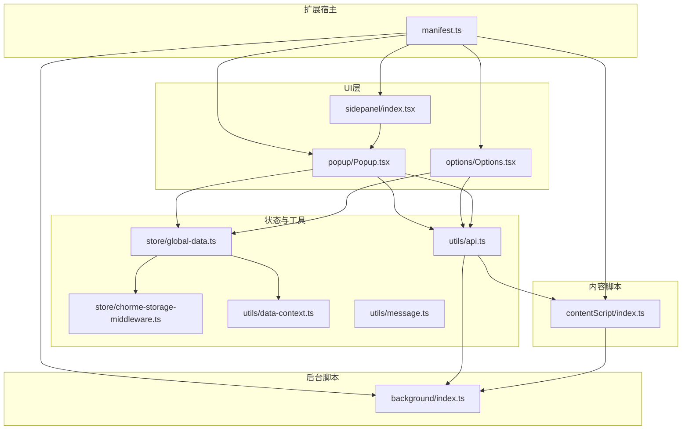
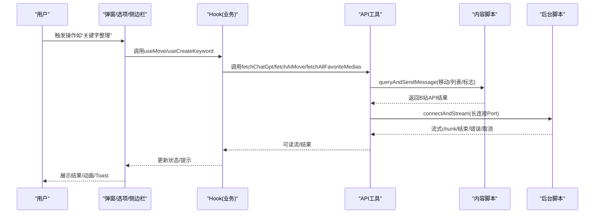
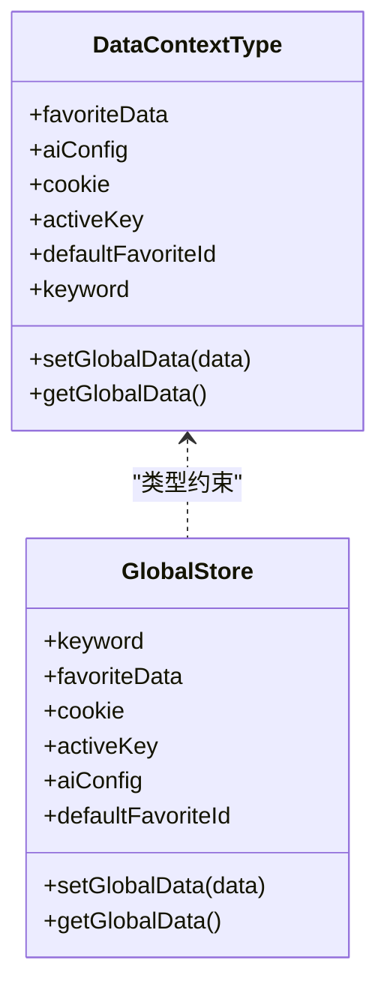
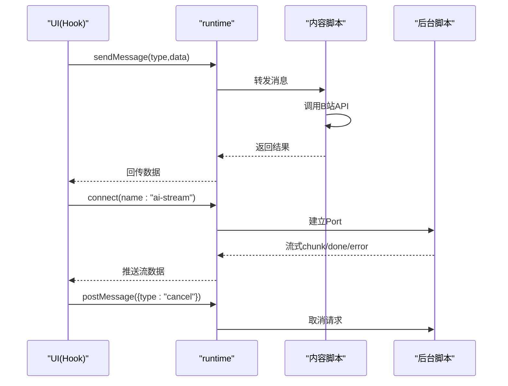
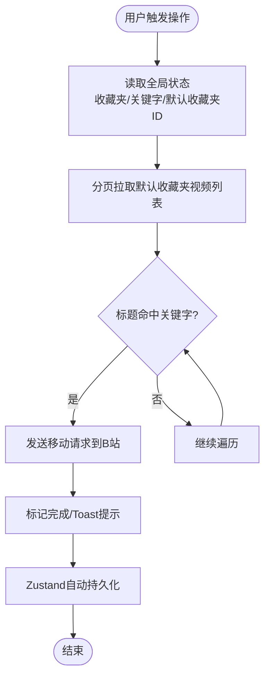
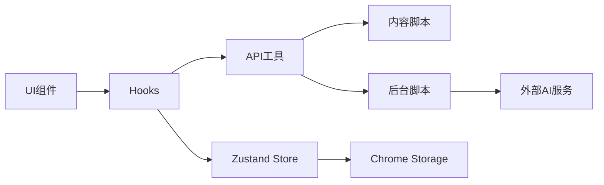

# 架构设计

<cite>
**本文引用的文件**
- [manifest.ts](file://src/manifest.ts)
- [background/index.ts](file://src/background/index.ts)
- [contentScript/index.ts](file://src/contentScript/index.ts)
- [popup/Popup.tsx](file://src/popup/Popup.tsx)
- [options/Options.tsx](file://src/options/Options.tsx)
- [sidepanel/index.tsx](file://src/sidepanel/index.tsx)
- [store/global-data.ts](file://src/store/global-data.ts)
- [store/chorme-storage-middleware.ts](file://src/store/chorme-storage-middleware.ts)
- [utils/data-context.ts](file://src/utils/data-context.ts)
- [utils/message.ts](file://src/utils/message.ts)
- [utils/api.ts](file://src/utils/api.ts)
- [hooks/use-move/index.tsx](file://src/hooks/use-move/index.tsx)
- [hooks/use-create-keyword/index.tsx](file://src/hooks/use-create-keyword/index.tsx)
- [popup/components/move/index.tsx](file://src/popup/components/move/index.tsx)
- [popup/components/ai-move/index.tsx](file://src/popup/components/ai-move/index.tsx)
- [popup/components/drag-manager-button/index.tsx](file://src/popup/components/drag-manager-button/index.tsx)
</cite>

## 目录
1. [简介](#简介)
2. [项目结构](#项目结构)
3. [核心组件](#核心组件)
4. [架构总览](#架构总览)
5. [详细组件分析](#详细组件分析)
6. [依赖分析](#依赖分析)
7. [性能考虑](#性能考虑)
8. [故障排查指南](#故障排查指南)
9. [结论](#结论)
10. [附录](#附录)

## 简介
本项目为一个面向B站收藏夹的整理工具，采用Chrome Extension（Manifest V3）架构，结合React前端组件与Zustand状态管理，提供“弹窗界面”“选项页面”“侧边栏界面”三大用户入口，并通过后台脚本与内容脚本实现与B站网页及外部AI服务的交互。系统以MVVM思想指导UI层与状态层解耦，以消息通信机制串联各模块，以Zustand实现轻量级状态持久化与响应式更新。

## 项目结构
- Manifest声明扩展元信息、权限、背景页、内容脚本、侧边栏与选项页等。
- 后台脚本负责AI流式通信、配额检查、与外部服务对接。
- 内容脚本负责与页面交互、转发B站API调用请求。
- 弹窗、选项、侧边栏均为React应用，分别承载主要功能入口与配置管理。
- 状态管理采用Zustand，配合Chrome Storage中间件实现跨标签页持久化。
- 工具层封装消息枚举、API调用、IndexedDB缓存、AI流解析器等。

图表来源
- [manifest.ts:1-55](file://src/manifest.ts#L1-L55)
- [background/index.ts:1-393](file://src/background/index.ts#L1-L393)
- [contentScript/index.ts:1-55](file://src/contentScript/index.ts#L1-L55)
- [popup/Popup.tsx:1-80](file://src/popup/Popup.tsx#L1-L80)
- [options/Options.tsx:1-91](file://src/options/Options.tsx#L1-L91)
- [sidepanel/index.tsx:1-11](file://src/sidepanel/index.tsx#L1-L11)
- [store/global-data.ts:1-28](file://src/store/global-data.ts#L1-L28)
- [store/chorme-storage-middleware.ts:1-63](file://src/store/chorme-storage-middleware.ts#L1-L63)
- [utils/data-context.ts:1-34](file://src/utils/data-context.ts#L1-L34)
- [utils/message.ts:1-20](file://src/utils/message.ts#L1-L20)
- [utils/api.ts:1-339](file://src/utils/api.ts#L1-L339)

章节来源
- [manifest.ts:1-55](file://src/manifest.ts#L1-L55)

## 核心组件
- 后台脚本（service worker）：负责AI流式通信、配额检查、与外部服务（OpenAI/AIGate）交互；通过长连接Port实现浏览器与后台的双向流式消息。
- 内容脚本：监听来自UI的消息，代理调用B站收藏夹相关接口，返回结果或错误。
- 弹窗界面：提供收藏夹与关键字展示、移动、AI整理、拖拽管理等入口。
- 选项页面：集中配置AI模型、可视化拖拽管理、关键字管理、数据分析等。
- 侧边栏界面：复用弹窗布局，适配侧边面板场景。
- 状态管理：Zustand Store + Immer + Chrome Storage中间件，持久化关键字段，提供全局状态访问与更新。
- 工具层：消息枚举统一、API封装（含分页拉取、IndexedDB缓存、AI流解析）、Tab通信工具。

章节来源
- [background/index.ts:1-393](file://src/background/index.ts#L1-L393)
- [contentScript/index.ts:1-55](file://src/contentScript/index.ts#L1-L55)
- [popup/Popup.tsx:1-80](file://src/popup/Popup.tsx#L1-L80)
- [options/Options.tsx:1-91](file://src/options/Options.tsx#L1-L91)
- [sidepanel/index.tsx:1-11](file://src/sidepanel/index.tsx#L1-L11)
- [store/global-data.ts:1-28](file://src/store/global-data.ts#L1-L28)
- [store/chorme-storage-middleware.ts:1-63](file://src/store/chorme-storage-middleware.ts#L1-L63)
- [utils/data-context.ts:1-34](file://src/utils/data-context.ts#L1-L34)
- [utils/message.ts:1-20](file://src/utils/message.ts#L1-L20)
- [utils/api.ts:1-339](file://src/utils/api.ts#L1-L339)

## 架构总览
系统采用MVVM风格：
- Model：Zustand Store（全局状态）+ 数据上下文类型（DataContextType）。
- View：React组件（弹窗、选项、侧边栏）。
- ViewModel：Hooks（use-move、use-create-keyword等）封装业务逻辑与状态订阅，向View暴露方法与状态片段。

消息通信机制：
- UI层通过chrome.runtime.sendMessage/connect与内容脚本/后台脚本通信。
- 内容脚本代理B站API调用并返回结果。
- 后台脚本通过Port建立长连接，实现SSE/流式响应的转发与取消控制。

状态管理架构：
- Zustand + Immer：简化不可变更新，避免样板代码。
- Chrome Storage中间件：仅持久化必要键，减少存储压力与同步成本。
- DataContextType：统一状态结构，便于类型约束与IDE提示。

图表来源
- [hooks/use-move/index.tsx:1-161](file://src/hooks/use-move/index.tsx#L1-L161)
- [hooks/use-create-keyword/index.tsx:1-304](file://src/hooks/use-create-keyword/index.tsx#L1-L304)
- [utils/api.ts:176-232](file://src/utils/api.ts#L176-L232)
- [contentScript/index.ts:4-54](file://src/contentScript/index.ts#L4-L54)
- [background/index.ts:315-392](file://src/background/index.ts#L315-L392)

## 详细组件分析

### MVVM架构实现
- 数据绑定：Zustand通过useShallow订阅状态片段，React组件按需渲染，避免全局抖动。
- 事件处理：Hooks封装业务事件（如整理、AI抽取），统一错误与取消处理。
- 组件通信：UI层通过消息与工具层交互，工具层再与后台/内容脚本通信，保持组件内聚。

章节来源
- [hooks/use-move/index.tsx:14-33](file://src/hooks/use-move/index.tsx#L14-L33)
- [hooks/use-create-keyword/index.tsx:191-284](file://src/hooks/use-create-keyword/index.tsx#L191-L284)
- [store/global-data.ts:6-25](file://src/store/global-data.ts#L6-L25)

### 状态管理架构（Zustand）
- 选择原因：轻量、零样板、易于集成Immer与中间件；适合扩展状态持久化与类型安全。
- 实现细节：
  - Store定义：keyword、favoriteData、cookie、activeKey、aiConfig、defaultFavoriteId等。
  - 中间件：仅持久化PERSISTED_KEYS，初始化时从chrome.storage.hydrate，setState时自动落盘。
  - 类型约束：DataContextType统一字段与Adapter枚举，确保配置一致性。

图表来源
- [utils/data-context.ts:3-31](file://src/utils/data-context.ts#L3-L31)
- [store/global-data.ts:6-25](file://src/store/global-data.ts#L6-L25)

章节来源
- [store/global-data.ts:1-28](file://src/store/global-data.ts#L1-L28)
- [store/chorme-storage-middleware.ts:1-63](file://src/store/chorme-storage-middleware.ts#L1-L63)
- [utils/data-context.ts:1-34](file://src/utils/data-context.ts#L1-L34)

### 消息通信机制
- 消息枚举：统一定义getCookie、moveVideo、getFavoriteList、getAllFavoriteFlag、fetchChatGpt、fetchAIMove、checkAIGateQuota、callAIGateAI等。
- UI到内容脚本：通过chrome.runtime.sendMessage，内容脚本代理B站API调用并回传结果。
- UI到后台脚本：通过chrome.runtime.connect建立Port，后台脚本以SSE流式返回AI结果，支持中途取消。
- 错误处理：统一捕获并回传错误信息，UI层以Toast提示；断连时读取lastError进行兜底。

图表来源
- [utils/message.ts:1-20](file://src/utils/message.ts#L1-L20)
- [contentScript/index.ts:4-54](file://src/contentScript/index.ts#L4-L54)
- [utils/api.ts:176-232](file://src/utils/api.ts#L176-L232)
- [background/index.ts:315-392](file://src/background/index.ts#L315-L392)

章节来源
- [utils/message.ts:1-20](file://src/utils/message.ts#L1-L20)
- [utils/api.ts:176-232](file://src/utils/api.ts#L176-L232)
- [contentScript/index.ts:1-55](file://src/contentScript/index.ts#L1-L55)
- [background/index.ts:1-393](file://src/background/index.ts#L1-L393)

### 数据流设计（从用户交互到持久化）
- 用户在弹窗/侧边栏触发“关键字整理”或“AI整理”，Hooks收集全局状态（收藏夹、关键字、默认收藏夹ID）。
- 工具层调用API分页拉取默认收藏夹视频列表，命中关键字即发起移动请求。
- 移动请求经内容脚本代理至B站API，后台脚本负责AI流式通信与配额检查。
- 结果通过Toast反馈，状态通过Zustand更新；持久化由Chrome Storage中间件自动完成。

图表来源
- [hooks/use-move/index.tsx:60-97](file://src/hooks/use-move/index.tsx#L60-L97)
- [utils/api.ts:285-319](file://src/utils/api.ts#L285-L319)
- [store/chorme-storage-middleware.ts:12-54](file://src/store/chorme-storage-middleware.ts#L12-L54)

章节来源
- [hooks/use-move/index.tsx:1-161](file://src/hooks/use-move/index.tsx#L1-L161)
- [utils/api.ts:285-319](file://src/utils/api.ts#L285-L319)
- [store/chorme-storage-middleware.ts:1-63](file://src/store/chorme-storage-middleware.ts#L1-L63)

### 关键功能组件

#### 弹窗界面（Popup）
- 职责：展示收藏夹与关键字，提供“移动”“AI整理”“拖拽管理”等入口，打开设置与帮助。
- 交互：按钮组件通过Hooks触发业务逻辑，底部显示登录检查与Toast。

章节来源
- [popup/Popup.tsx:14-76](file://src/popup/Popup.tsx#L14-L76)
- [popup/components/move/index.tsx:1-42](file://src/popup/components/move/index.tsx#L1-L42)
- [popup/components/ai-move/index.tsx:1-63](file://src/popup/components/ai-move/index.tsx#L1-L63)
- [popup/components/drag-manager-button/index.tsx:1-41](file://src/popup/components/drag-manager-button/index.tsx#L1-L41)

#### 选项页面（Options）
- 职责：集中配置AI模型、可视化拖拽管理、关键字管理、数据分析。
- 交互：Tab切换不同功能区，内部组件通过Hooks与工具层交互。

章节来源
- [options/Options.tsx:12-87](file://src/options/Options.tsx#L12-L87)

#### 侧边栏界面（Side Panel）
- 职责：复用弹窗布局，适配侧边面板宽度与高度。
- 交互：与弹窗一致，仅容器尺寸不同。

章节来源
- [sidepanel/index.tsx:1-11](file://src/sidepanel/index.tsx#L1-L11)

#### 关键字抽取（use-create-keyword）
- 职责：支持本地TF-IDF、AI抽取（OpenAI/AIGate）、手动模式；批量处理多个收藏夹。
- 交互：构建messages、建立流式连接、解析增量结果、取消与错误处理。

章节来源
- [hooks/use-create-keyword/index.tsx:107-169](file://src/hooks/use-create-keyword/index.tsx#L107-L169)
- [utils/api.ts:234-277](file://src/utils/api.ts#L234-L277)

#### 视频移动（use-move）
- 职责：遍历默认收藏夹视频，按关键字匹配并移动到目标收藏夹；支持取消与完成动画。
- 交互：分页拉取、逐条匹配、逐条移动、进度提示。

章节来源
- [hooks/use-move/index.tsx:60-124](file://src/hooks/use-move/index.tsx#L60-L124)
- [utils/api.ts:285-319](file://src/utils/api.ts#L285-L319)

## 依赖分析
- 组件耦合：UI层通过Hooks与工具层解耦；工具层通过消息枚举与后台/内容脚本解耦。
- 外部依赖：OpenAI SDK、IndexedDB（封装于工具层）、Chrome Storage、SSE流。
- 潜在循环：未见直接循环依赖；消息枚举作为共享契约降低耦合。

图表来源
- [utils/message.ts:1-20](file://src/utils/message.ts#L1-L20)
- [utils/api.ts:176-232](file://src/utils/api.ts#L176-L232)
- [background/index.ts:315-392](file://src/background/index.ts#L315-L392)
- [contentScript/index.ts:4-54](file://src/contentScript/index.ts#L4-L54)
- [store/global-data.ts:6-25](file://src/store/global-data.ts#L6-L25)
- [store/chorme-storage-middleware.ts:12-54](file://src/store/chorme-storage-middleware.ts#L12-L54)

章节来源
- [utils/message.ts:1-20](file://src/utils/message.ts#L1-L20)
- [utils/api.ts:1-339](file://src/utils/api.ts#L1-L339)
- [background/index.ts:1-393](file://src/background/index.ts#L1-L393)
- [contentScript/index.ts:1-55](file://src/contentScript/index.ts#L1-L55)
- [store/global-data.ts:1-28](file://src/store/global-data.ts#L1-L28)
- [store/chorme-storage-middleware.ts:1-63](file://src/store/chorme-storage-middleware.ts#L1-L63)

## 性能考虑
- 流式处理：后台脚本以SSE流式返回，前端按chunk消费，降低首帧延迟与内存占用。
- 分页缓存：默认收藏夹视频列表通过IndexedDB缓存，带过期时间，减少重复请求。
- 状态订阅：useShallow仅订阅必要字段，避免不必要的重渲染。
- 取消机制：AbortController与Port取消结合，快速中断长耗时请求。
- 存储优化：仅持久化必要键，减少chrome.storage写入频率与体积。

## 故障排查指南
- AI流异常：检查后台脚本SSE解析与错误上报；确认Port断连lastError；前端Toast提示错误信息。
- 移动失败：确认Cookie有效性与CS代理B站API返回码；查看use-move错误Toast。
- 配额不足：后台脚本AIGate配额检查失败时，前端提示剩余次数。
- 状态未持久：确认chrome.storage中间件已初始化与写入；检查PERSISTED_KEYS覆盖范围。

章节来源
- [background/index.ts:351-375](file://src/background/index.ts#L351-L375)
- [contentScript/index.ts:39-50](file://src/contentScript/index.ts#L39-L50)
- [hooks/use-move/index.tsx:114-123](file://src/hooks/use-move/index.tsx#L114-L123)
- [store/chorme-storage-middleware.ts:12-54](file://src/store/chorme-storage-middleware.ts#L12-L54)

## 结论
本项目以MVVM与消息通信为核心，结合Zustand实现轻量状态管理与持久化，通过后台脚本与内容脚本解耦UI与外部服务，形成清晰的职责边界与可扩展架构。流式通信与分页缓存提升了用户体验与性能，而完善的错误与取消机制增强了稳定性。

## 附录
- 架构决策要点
  - 选择Zustand：兼顾易用性与性能，配合Immer与中间件满足扩展需求。
  - 选择Port长连接：满足SSE流式与取消控制，适配AI大模型交互。
  - 选择分页+缓存：平衡数据完整性与网络开销。
- 可扩展性建议
  - 引入插件化消息枚举与中间件，便于新增AI适配器。
  - 将UI组件进一步拆分为更细粒度的可复用组件，提升测试与维护效率。
  - 增加离线模式与增量同步策略，提升弱网环境体验。