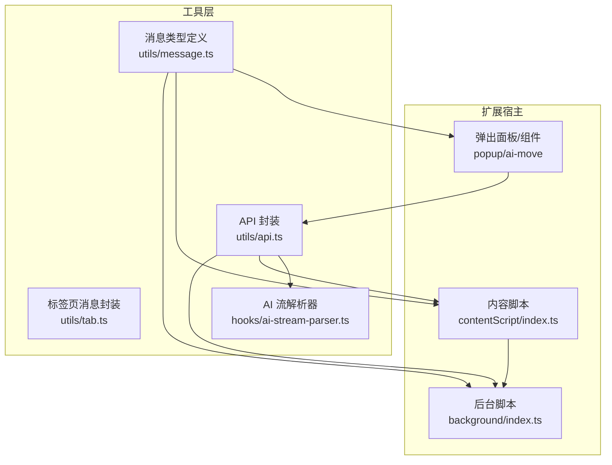
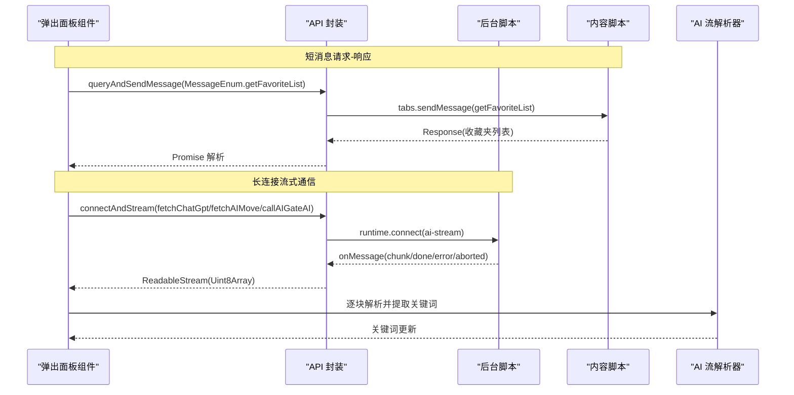
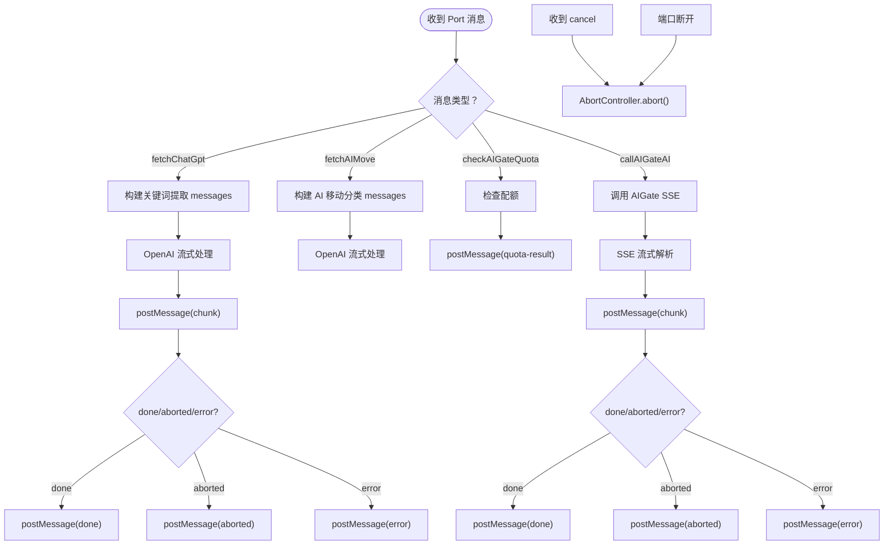
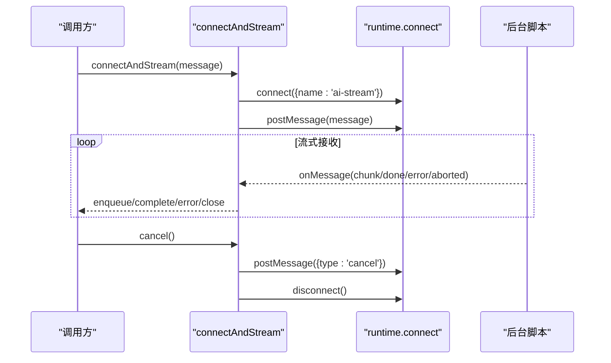
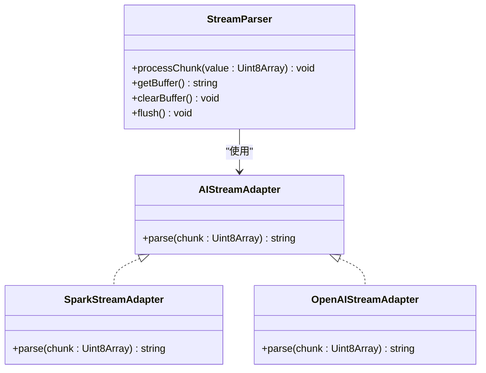
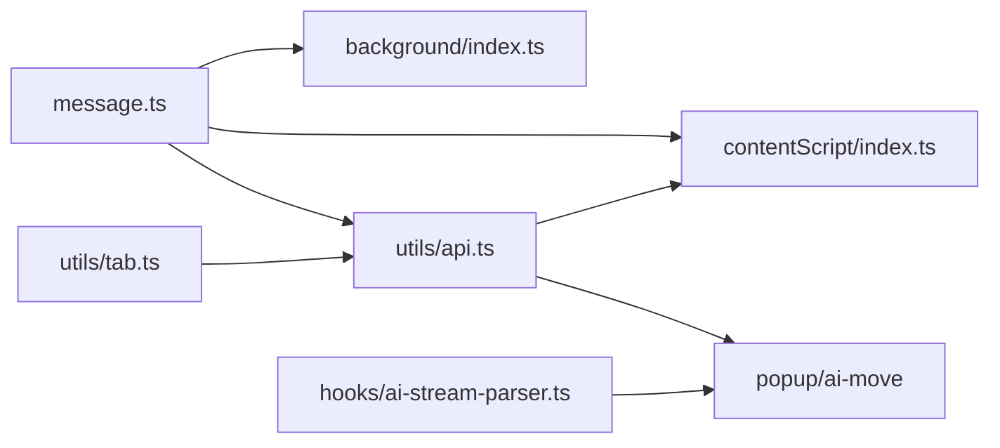

# 消息通信机制

<cite>
**本文档引用的文件**
- [src/utils/message.ts](file://src/utils/message.ts)
- [src/background/index.ts](file://src/background/index.ts)
- [src/contentScript/index.ts](file://src/contentScript/index.ts)
- [src/utils/api.ts](file://src/utils/api.ts)
- [src/utils/tab.ts](file://src/utils/tab.ts)
- [src/hooks/use-create-keyword-by-ai/ai-stream-parser.ts](file://src/hooks/use-create-keyword-by-ai/ai-stream-parser.ts)
- [src/popup/components/ai-move/use-ai-move.tsx](file://src/popup/components/ai-move/use-ai-move.tsx)
- [src/manifest.ts](file://src/manifest.ts)
- [tests/ai-stream-connect.test.ts](file://tests/ai-stream-connect.test.ts)
- [tests/ai-stream-parser.test.ts](file://tests/ai-stream-parser.test.ts)
- [tests/ai-stream-adapter.test.ts](file://tests/ai-stream-adapter.test.ts)
</cite>

## 目录
1. [简介](#简介)
2. [项目结构](#项目结构)
3. [核心组件](#核心组件)
4. [架构总览](#架构总览)
5. [详细组件分析](#详细组件分析)
6. [依赖关系分析](#依赖关系分析)
7. [性能考量](#性能考量)
8. [故障排查指南](#故障排查指南)
9. [结论](#结论)

## 简介
本文件系统性梳理 B站收藏夹整理工具的消息通信机制，覆盖 Chrome 扩展的消息传递模型（runtime.sendMessage、tabs.sendMessage、extension.connect）、消息类型枚举（MessageEnum）设计、请求-响应与事件广播、流式数据传输、后台脚本与内容脚本的双向通信协议、端到端消息生命周期、序列化与压缩优化以及安全验证方案。文档同时提供可视化图示与测试用例映射，帮助开发者快速理解与维护该通信体系。

## 项目结构
该扩展采用 Manifest V3 架构，包含以下关键模块：
- 后台脚本（background）：负责 AI 请求、配额检查、长连接管理与流式数据转发
- 内容脚本（contentScript）：与 B站页面交互，处理收藏夹列表与移动操作
- 弹出面板与 AI 整理功能：通过 API 层封装消息与流式通信
- 工具层：消息类型定义、标签页消息封装、AI 流解析器

图表来源
- [src/background/index.ts:315-392](file://src/background/index.ts#L315-L392)
- [src/contentScript/index.ts:4-54](file://src/contentScript/index.ts#L4-L54)
- [src/utils/api.ts:180-232](file://src/utils/api.ts#L180-L232)
- [src/utils/tab.ts:37-82](file://src/utils/tab.ts#L37-L82)
- [src/hooks/use-create-keyword-by-ai/ai-stream-parser.ts:221-277](file://src/hooks/use-create-keyword-by-ai/ai-stream-parser.ts#L221-L277)

章节来源
- [src/manifest.ts:23-32](file://src/manifest.ts#L23-L32)
- [src/utils/message.ts:1-20](file://src/utils/message.ts#L1-L20)

## 核心组件
- 消息类型枚举（MessageEnum）：统一定义扩展内所有消息类型，确保前后端一致性与可维护性
- 后台脚本（background）：监听长连接、处理 AI 请求、配额检查、流式数据分发与取消控制
- 内容脚本（contentScript）：处理与页面相关的收藏夹列表与移动操作，基于 runtime.onMessage 的请求-响应模式
- API 封装（utils/api.ts）：封装 runtime.connect 建立长连接、流式读取、取消控制与错误传播；封装 tabs.sendMessage 的请求-响应
- 标签页消息封装（utils/tab.ts）：封装向指定标签页或查询到的第一个标签页发送消息的 Promise 化封装
- AI 流解析器（hooks/ai-stream-parser.ts）：解析不同模型的 SSE 流数据，提取关键词并维护缓冲区

章节来源
- [src/utils/message.ts:1-20](file://src/utils/message.ts#L1-L20)
- [src/background/index.ts:315-392](file://src/background/index.ts#L315-L392)
- [src/contentScript/index.ts:4-54](file://src/contentScript/index.ts#L4-L54)
- [src/utils/api.ts:180-232](file://src/utils/api.ts#L180-L232)
- [src/utils/tab.ts:37-82](file://src/utils/tab.ts#L37-L82)
- [src/hooks/use-create-keyword-by-ai/ai-stream-parser.ts:221-277](file://src/hooks/use-create-keyword-by-ai/ai-stream-parser.ts#L221-L277)

## 架构总览
扩展的消息通信分为两条主线：
- 短消息请求-响应：Popup/ContentScript 通过 runtime.sendMessage 或 tabs.sendMessage 与后台/内容脚本通信
- 长连接流式通信：Popup 通过 runtime.connect 建立 ai-stream 端口，后台以 SSE/流式方式推送增量数据

图表来源
- [src/utils/api.ts:180-232](file://src/utils/api.ts#L180-L232)
- [src/background/index.ts:315-392](file://src/background/index.ts#L315-L392)
- [src/contentScript/index.ts:4-54](file://src/contentScript/index.ts#L4-L54)
- [src/hooks/use-create-keyword-by-ai/ai-stream-parser.ts:221-277](file://src/hooks/use-create-keyword-by-ai/ai-stream-parser.ts#L221-L277)

## 详细组件分析

### 消息类型枚举（MessageEnum）与消息结构
- 设计理念：集中定义所有消息类型，配合统一的 Message 结构，保证类型安全与跨模块一致性
- 类型覆盖：收藏夹操作、AI 请求、配额检查、AIGate 调用等
- 使用场景：runtime.onMessage、tabs.sendMessage、runtime.connect 的消息类型识别

章节来源
- [src/utils/message.ts:1-20](file://src/utils/message.ts#L1-L20)

### 后台脚本（background）：长连接与流式处理
- 长连接监听：通过 runtime.onConnect 监听名为 ai-stream 的端口，仅接受该命名端口
- 请求处理：根据消息类型分发至不同处理函数（关键词提取、AI 移动分类、配额检查、AIGate 调用）
- 流式数据：支持 OpenAI 流式与 AIGate SSE 两种模式，逐块推送 chunk，结束时发送 done，异常时发送 error，取消时发送 aborted
- 取消机制：AbortController 在每个请求中保存引用，收到 cancel 或断开连接时触发取消
- 错误传播：统一捕获异常并回传 error 消息，便于上层 UI 响应

图表来源
- [src/background/index.ts:315-392](file://src/background/index.ts#L315-L392)
- [src/background/index.ts:197-247](file://src/background/index.ts#L197-L247)
- [src/background/index.ts:94-192](file://src/background/index.ts#L94-L192)

章节来源
- [src/background/index.ts:315-392](file://src/background/index.ts#L315-L392)
- [src/background/index.ts:197-247](file://src/background/index.ts#L197-L247)
- [src/background/index.ts:94-192](file://src/background/index.ts#L94-L192)

### 内容脚本（contentScript）：请求-响应模式
- 监听 runtime.onMessage，处理与页面相关的收藏夹列表与移动操作
- 基于 Promise 的 sendResponse 机制，确保请求-响应语义清晰
- 对错误进行统一处理并返回标准化响应

章节来源
- [src/contentScript/index.ts:4-54](file://src/contentScript/index.ts#L4-L54)

### API 封装（utils/api.ts）：长连接与短消息封装
- 长连接封装：connectAndStream 建立 named port，将后台的 chunk/done/error/aborted 转换为 ReadableStream，支持 cancel
- 短消息封装：queryAndSendMessage 基于 tabs.sendMessage，封装超时与 lastError 检测
- AI 请求封装：fetchChatGpt、fetchAIMove、callAIGateAI 统一封装消息类型与数据结构

图表来源
- [src/utils/api.ts:180-232](file://src/utils/api.ts#L180-L232)
- [src/background/index.ts:315-392](file://src/background/index.ts#L315-L392)

章节来源
- [src/utils/api.ts:180-232](file://src/utils/api.ts#L180-L232)
- [src/utils/api.ts:321-329](file://src/utils/api.ts#L321-L329)

### 标签页消息封装（utils/tab.ts）：Promise 化与超时控制
- sendMessageToTab：Promise 化 tabs.sendMessage，支持超时与 lastError 检测
- queryAndSendMessage：查询 B站标签页并发送消息，简化调用方逻辑

章节来源
- [src/utils/tab.ts:37-82](file://src/utils/tab.ts#L37-L82)

### AI 流解析器（hooks/ai-stream-parser.ts）：适配器与缓冲区
- 适配器模式：Spark/OpenAI 适配器解析不同模型的 delta/content/reasoning_content
- 缓冲区与关键词提取：逐块解析、跳过无效内容、从缓冲区提取完整关键词并去重
- 工厂函数：根据配置创建适配器实例

图表来源
- [src/hooks/use-create-keyword-by-ai/ai-stream-parser.ts:27-93](file://src/hooks/use-create-keyword-by-ai/ai-stream-parser.ts#L27-L93)
- [src/hooks/use-create-keyword-by-ai/ai-stream-parser.ts:221-277](file://src/hooks/use-create-keyword-by-ai/ai-stream-parser.ts#L221-L277)

章节来源
- [src/hooks/use-create-keyword-by-ai/ai-stream-parser.ts:27-93](file://src/hooks/use-create-keyword-by-ai/ai-stream-parser.ts#L27-L93)
- [src/hooks/use-create-keyword-by-ai/ai-stream-parser.ts:188-214](file://src/hooks/use-create-keyword-by-ai/ai-stream-parser.ts#L188-L214)

### 弹出面板组件（use-ai-move）：端到端工作流
- 配置检测：自定义模型或 AIGate 免费额度二选一
- 流式读取：从 ReadableStream 读取并用适配器解析，提取 JSON 片段
- 取消机制：AbortController 与流 cancel 双重保障
- 移动执行：逐条调用 queryAndSendMessage(MessageEnum.moveVideo) 完成视频移动

章节来源
- [src/popup/components/ai-move/use-ai-move.tsx:90-169](file://src/popup/components/ai-move/use-ai-move.tsx#L90-L169)
- [src/popup/components/ai-move/use-ai-move.tsx:171-211](file://src/popup/components/ai-move/use-ai-move.tsx#L171-L211)
- [src/popup/components/ai-move/use-ai-move.tsx:309-325](file://src/popup/components/ai-move/use-ai-move.tsx#L309-L325)

## 依赖关系分析
- 模块耦合
  - background 依赖 utils/message.ts 与 utils/tab.ts（设备 ID）
  - contentScript 依赖 utils/message.ts 与 utils/api.ts（移动与收藏夹列表）
  - utils/api.ts 依赖 utils/message.ts、utils/tab.ts，并向 popup 组件暴露流式接口
  - popup 组件依赖 utils/api.ts 与 hooks/ai-stream-parser.ts
- 外部依赖
  - Chrome Extension APIs：runtime、tabs、storage、sidePanel
  - 第三方 AI 服务：OpenAI、AIGate（SSE）

图表来源
- [src/utils/message.ts:1-20](file://src/utils/message.ts#L1-L20)
- [src/background/index.ts:1-10](file://src/background/index.ts#L1-L10)
- [src/contentScript/index.ts:1-3](file://src/contentScript/index.ts#L1-L3)
- [src/utils/api.ts:1-6](file://src/utils/api.ts#L1-L6)
- [src/utils/tab.ts:1-10](file://src/utils/tab.ts#L1-L10)
- [src/hooks/use-create-keyword-by-ai/ai-stream-parser.ts:1-5](file://src/hooks/use-create-keyword-by-ai/ai-stream-parser.ts#L1-L5)

章节来源
- [src/manifest.ts:39-46](file://src/manifest.ts#L39-L46)

## 性能考量
- 流式传输
  - 使用 ReadableStream 与 TextEncoder/TextDecoder，避免一次性拼接大字符串
  - 后台按块推送，前台按块解析，降低内存峰值
- 取消与断开
  - AbortController + port cancel 双重取消，及时释放资源
  - 端口断开时清理控制器，防止悬挂请求
- 序列化与压缩
  - 消息体为 JSON 字符串，建议在上层对大对象进行必要裁剪
  - SSE 流本身为文本增量，无需额外压缩
- 错误与超时
  - tabs.sendMessage 超时控制与 lastError 检测，避免阻塞 UI
  - 流式读取中对异常进行快速传播与关闭

## 故障排查指南
- 短消息无响应
  - 检查 tabs.sendMessage 的超时与 lastError，确认目标标签页存在且消息类型匹配
  - 参考：[src/utils/tab.ts:37-82](file://src/utils/tab.ts#L37-L82)
- 长连接不触发
  - 确认 runtime.connect 的 name 为 ai-stream，后台 onConnect 已注册
  - 参考：[src/utils/api.ts:180-182](file://src/utils/api.ts#L180-L182)，[src/background/index.ts:315-317](file://src/background/index.ts#L315-L317)
- 流式数据解析异常
  - 检查适配器类型与模型输出字段（content/reasoning_content）
  - 参考：[src/hooks/use-create-keyword-by-ai/ai-stream-parser.ts:27-93](file://src/hooks/use-create-keyword-by-ai/ai-stream-parser.ts#L27-L93)
- 取消无效
  - 确保调用 cancel 并发送 {type:'cancel'}，同时断开端口
  - 参考：[src/utils/api.ts:184-188](file://src/utils/api.ts#L184-L188)，[src/background/index.ts:324-332](file://src/background/index.ts#L324-L332)
- 测试验证
  - 使用单元测试验证流式连接、解析与适配器行为
  - 参考：[tests/ai-stream-connect.test.ts:90-136](file://tests/ai-stream-connect.test.ts#L90-L136)，[tests/ai-stream-parser.test.ts:1-243](file://tests/ai-stream-parser.test.ts#L1-L243)，[tests/ai-stream-adapter.test.ts:1-129](file://tests/ai-stream-adapter.test.ts#L1-L129)

章节来源
- [src/utils/tab.ts:37-82](file://src/utils/tab.ts#L37-L82)
- [src/utils/api.ts:180-232](file://src/utils/api.ts#L180-L232)
- [src/background/index.ts:315-392](file://src/background/index.ts#L315-L392)
- [src/hooks/use-create-keyword-by-ai/ai-stream-parser.ts:27-93](file://src/hooks/use-create-keyword-by-ai/ai-stream-parser.ts#L27-L93)
- [tests/ai-stream-connect.test.ts:90-136](file://tests/ai-stream-connect.test.ts#L90-L136)
- [tests/ai-stream-parser.test.ts:1-243](file://tests/ai-stream-parser.test.ts#L1-L243)
- [tests/ai-stream-adapter.test.ts:1-129](file://tests/ai-stream-adapter.test.ts#L1-L129)

## 结论
该扩展通过统一的消息类型枚举、明确的请求-响应与长连接流式通信协议，实现了后台与内容脚本、弹出面板之间的高效协作。消息生命周期从构建、传输、处理到响应闭环完整，结合适配器与缓冲区策略，确保了多模型流式数据的稳定解析与 UI 实时反馈。取消与错误传播机制完善，测试覆盖到位，具备良好的可维护性与扩展性。