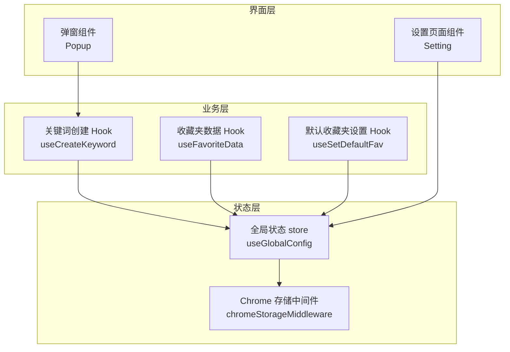
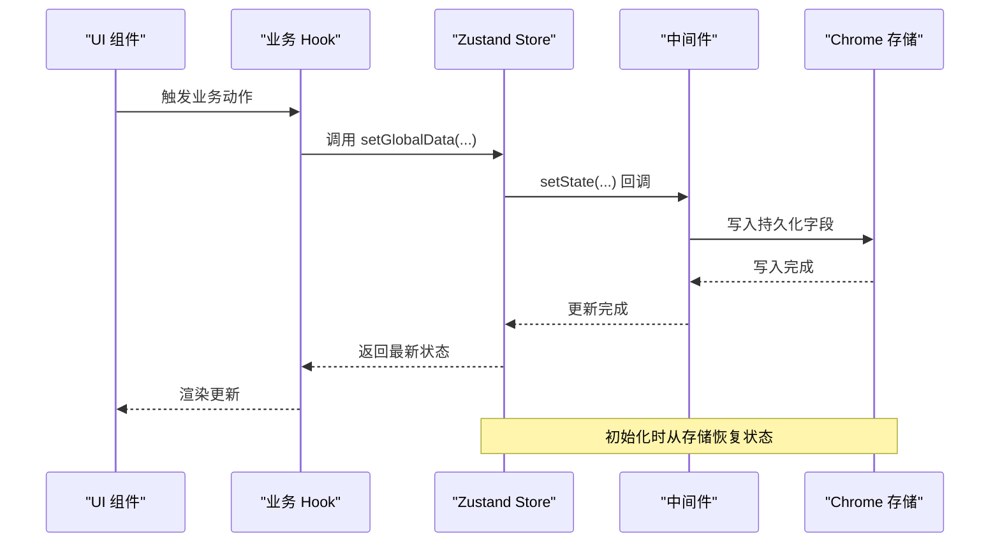
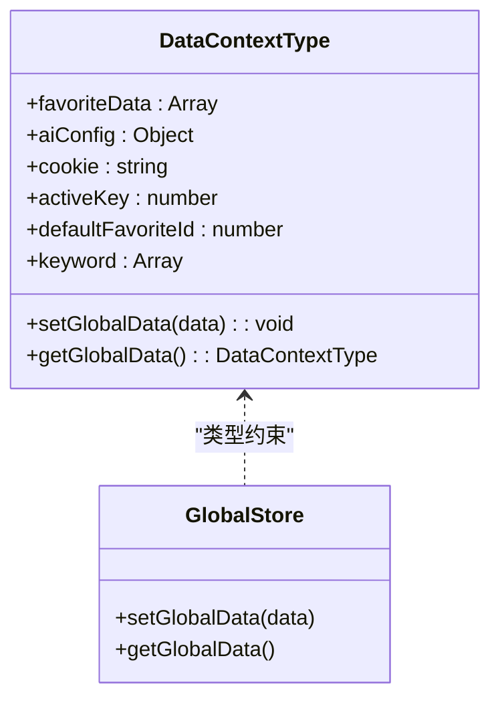
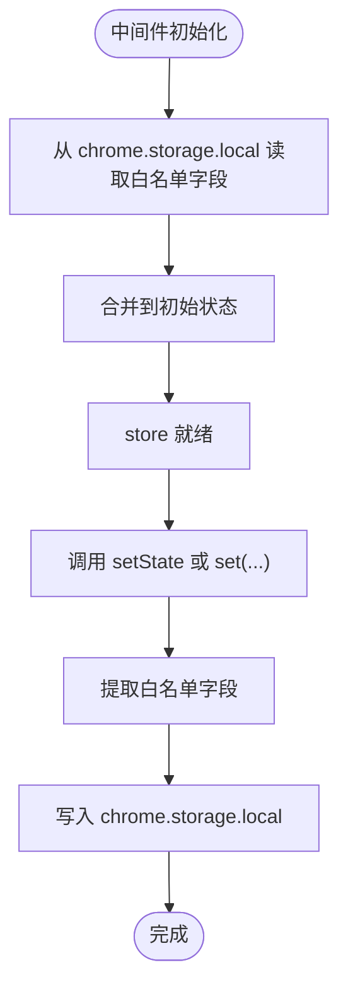
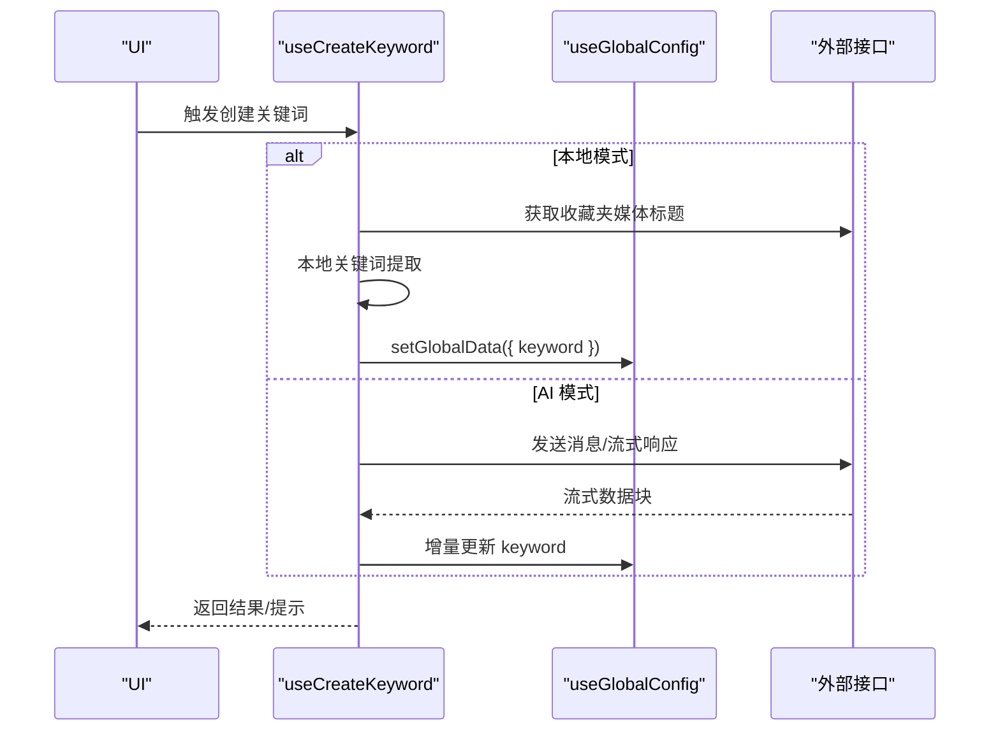
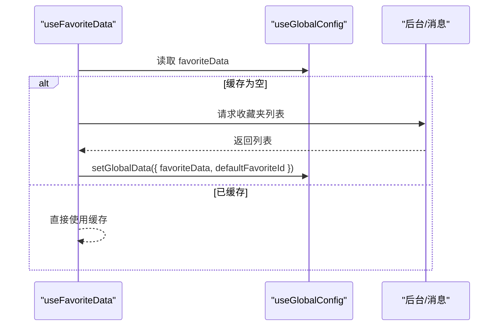
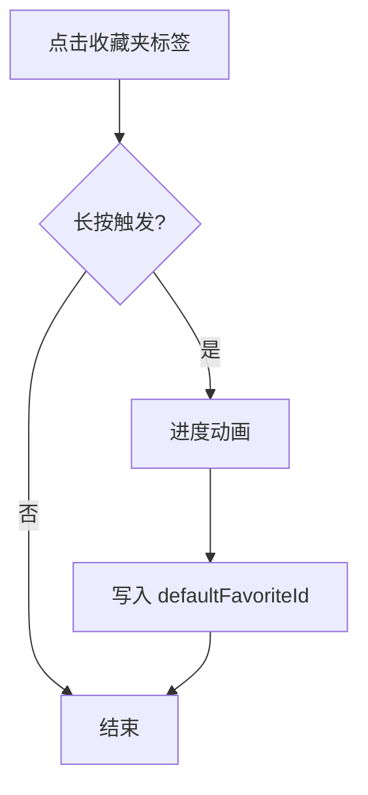
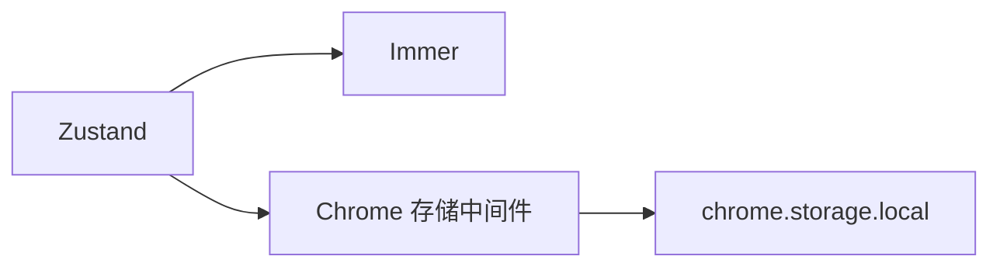

# 状态管理设计

<cite>
**本文引用的文件**
- [src/store/global-data.ts](file://src/store/global-data.ts)
- [src/store/chorme-storage-middleware.ts](file://src/store/chorme-storage-middleware.ts)
- [src/utils/data-context.ts](file://src/utils/data-context.ts)
- [src/hooks/use-favorite-data/index.ts](file://src/hooks/use-favorite-data/index.ts)
- [src/hooks/use-create-keyword/index.tsx](file://src/hooks/use-create-keyword/index.tsx)
- [src/hooks/use-set-default-fav/index.tsx](file://src/hooks/use-set-default-fav/index.tsx)
- [src/options/components/setting/index.tsx](file://src/options/components/setting/index.tsx)
- [src/popup/components/move/index.tsx](file://src/popup/components/move/index.tsx)
- [package.json](file://package.json)
</cite>

## 目录
1. [引言](#引言)
2. [项目结构](#项目结构)
3. [核心组件](#核心组件)
4. [架构总览](#架构总览)
5. [详细组件分析](#详细组件分析)
6. [依赖分析](#依赖分析)
7. [性能考虑](#性能考虑)
8. [故障排查指南](#故障排查指南)
9. [结论](#结论)
10. [附录](#附录)

## 引言
本设计文档围绕“B站收藏夹整理工具”的状态管理展开，重点说明基于 Zustand 的全局状态设计与实现细节，涵盖 store 设计模式、action 定义、selector 优化、中间件机制、全局/局部状态划分策略、Chrome 存储中间件原理（持久化、跨标签页同步、存储限制处理）、状态订阅与性能优化、内存管理、状态迁移与版本兼容性、以及数据备份与恢复建议。目标是在保证功能完整性的同时，确保状态管理具备可维护性、可扩展性与高性能。

## 项目结构
本项目采用“按职责分层 + 组件驱动”的组织方式：
- store 层：集中定义全局状态与中间件，提供统一的数据入口
- hooks 层：封装业务逻辑与状态读取，使用 shallow selector 降低重渲染
- components 层：UI 组件消费状态，触发 action
- utils 层：类型定义、工具函数、消息通信、API 调用等

图表来源
- [src/store/global-data.ts:1-28](file://src/store/global-data.ts#L1-L28)
- [src/store/chorme-storage-middleware.ts:1-63](file://src/store/chorme-storage-middleware.ts#L1-L63)
- [src/hooks/use-create-keyword/index.tsx:1-304](file://src/hooks/use-create-keyword/index.tsx#L1-L304)
- [src/hooks/use-favorite-data/index.ts:1-64](file://src/hooks/use-favorite-data/index.ts#L1-L64)
- [src/hooks/use-set-default-fav/index.tsx:1-126](file://src/hooks/use-set-default-fav/index.tsx#L1-L126)
- [src/options/components/setting/index.tsx:1-98](file://src/options/components/setting/index.tsx#L1-L98)
- [src/popup/components/move/index.tsx:1-42](file://src/popup/components/move/index.tsx#L1-L42)

章节来源
- [src/store/global-data.ts:1-28](file://src/store/global-data.ts#L1-L28)
- [src/store/chorme-storage-middleware.ts:1-63](file://src/store/chorme-storage-middleware.ts#L1-L63)
- [src/utils/data-context.ts:1-34](file://src/utils/data-context.ts#L1-L34)

## 核心组件
- 全局状态 store：以 Zustand 创建，结合 Immer 中间件实现不可变更新；通过自定义 Chrome 存储中间件实现持久化与初始化恢复。
- 数据上下文类型：统一定义收藏夹数据、AI 配置、Cookie、活动收藏夹键、默认收藏夹 ID、关键词集合等字段及 set/get 方法。
- 关键业务 Hook：
  - useCreateKeyword：负责关键词提取（本地/AI/手动）与批量处理流程
  - useFavoriteData：负责收藏夹列表的拉取与缓存
  - useSetDefaultFav：负责默认收藏夹的设置与交互反馈
- 设置页面：通过表单读取/写入全局状态中的 AI 配置，并根据适配器动态填充默认参数

章节来源
- [src/store/global-data.ts:6-25](file://src/store/global-data.ts#L6-L25)
- [src/utils/data-context.ts:3-31](file://src/utils/data-context.ts#L3-L31)
- [src/hooks/use-create-keyword/index.tsx:19-301](file://src/hooks/use-create-keyword/index.tsx#L19-L301)
- [src/hooks/use-favorite-data/index.ts:23-61](file://src/hooks/use-favorite-data/index.ts#L23-L61)
- [src/hooks/use-set-default-fav/index.tsx:6-99](file://src/hooks/use-set-default-fav/index.tsx#L6-L99)
- [src/options/components/setting/index.tsx:14-75](file://src/options/components/setting/index.tsx#L14-L75)

## 架构总览
下图展示状态从创建、持久化到使用的端到端流程，以及关键组件之间的调用关系。

图表来源
- [src/store/global-data.ts:6-25](file://src/store/global-data.ts#L6-L25)
- [src/store/chorme-storage-middleware.ts:8-57](file://src/store/chorme-storage-middleware.ts#L8-L57)
- [src/hooks/use-create-keyword/index.tsx:40-74](file://src/hooks/use-create-keyword/index.tsx#L40-L74)
- [src/hooks/use-set-default-fav/index.tsx:88-89](file://src/hooks/use-set-default-fav/index.tsx#L88-L89)

## 详细组件分析

### 全局状态 store 设计
- 设计模式
  - 使用 Zustand 的 create API 创建 store
  - 结合 immer 中间件，允许以可变风格编写更新逻辑，同时保持不可变语义
  - 通过自定义 chromeStorageMiddleware 实现状态持久化与初始化恢复
- Action 定义
  - setGlobalData：用于批量或单项更新状态字段
  - getGlobalData：用于在业务逻辑中读取完整状态快照
- Selector 优化
  - 在多个 hook 中使用 shallow selector，仅在所选字段变化时触发重渲染，避免无关 UI 重复渲染
- 中间件机制
  - 在 setState 回调中拦截，仅对白名单字段进行持久化
  - 初始化时从 chrome.storage.local 恢复状态

图表来源
- [src/utils/data-context.ts:3-31](file://src/utils/data-context.ts#L3-L31)
- [src/store/global-data.ts:6-25](file://src/store/global-data.ts#L6-L25)

章节来源
- [src/store/global-data.ts:6-25](file://src/store/global-data.ts#L6-L25)
- [src/utils/data-context.ts:3-31](file://src/utils/data-context.ts#L3-L31)

### Chrome 存储中间件实现原理
- 持久化字段白名单：仅对 keyword、activeKey、cookie、aiConfig、defaultFavoriteId 进行持久化，避免存储冗余与越界
- 初始化恢复：启动时从 chrome.storage.local 读取白名单字段，合并到初始状态
- 写入策略：每次 setState 或通过包装后的 set 调用后，仅提取白名单字段写回存储
- 跨标签页同步：当前实现未显式监听 storage 变更事件，因此跨标签页同步需额外机制（见“性能与跨标签页同步”）

图表来源
- [src/store/chorme-storage-middleware.ts:8-57](file://src/store/chorme-storage-middleware.ts#L8-L57)

章节来源
- [src/store/chorme-storage-middleware.ts:3-34](file://src/store/chorme-storage-middleware.ts#L3-L34)
- [src/store/chorme-storage-middleware.ts:49-52](file://src/store/chorme-storage-middleware.ts#L49-L52)

### 全局状态与局部状态划分策略
- 全局状态（持久化）
  - 收藏夹数据：favoriteData（用于关键词匹配与整理）
  - 用户配置：aiConfig（模型、适配器、免费额度配置等）
  - Cookie：登录态标识
  - 活动收藏夹键：activeKey（当前选中收藏夹）
  - 默认收藏夹 ID：defaultFavoriteId（默认目标收藏夹）
  - 关键词集合：keyword（每个收藏夹对应的关键词映射）
- 局部状态（非持久化）
  - 组件内部的临时 UI 状态（如加载、错误提示、动画进度等），通过 React useState 管理
  - 业务流程中的临时变量（如 AbortController、请求缓存等）

章节来源
- [src/utils/data-context.ts:3-31](file://src/utils/data-context.ts#L3-L31)
- [src/hooks/use-create-keyword/index.tsx:33-36](file://src/hooks/use-create-keyword/index.tsx#L33-L36)
- [src/hooks/use-favorite-data/index.ts:30-31](file://src/hooks/use-favorite-data/index.ts#L30-L31)

### 关键业务流程与状态交互

#### 关键词创建流程（本地/AI/手动）
- 本地提取：从收藏夹媒体标题构建关键词集合，写入全局状态
- AI 提取：根据配置选择自定义模型或免费额度通道，流式解析并增量更新状态
- 批量处理：遍历所有收藏夹，逐个执行提取并统计结果

图表来源
- [src/hooks/use-create-keyword/index.tsx:40-74](file://src/hooks/use-create-keyword/index.tsx#L40-L74)
- [src/hooks/use-create-keyword/index.tsx:107-169](file://src/hooks/use-create-keyword/index.tsx#L107-L169)
- [src/hooks/use-create-keyword/index.tsx:191-284](file://src/hooks/use-create-keyword/index.tsx#L191-L284)

章节来源
- [src/hooks/use-create-keyword/index.tsx:19-301](file://src/hooks/use-create-keyword/index.tsx#L19-L301)

#### 收藏夹数据获取与缓存
- 首次访问时通过消息通信拉取收藏夹列表，写入全局状态并缓存
- 后续直接从全局状态读取，减少网络开销

图表来源
- [src/hooks/use-favorite-data/index.ts:32-52](file://src/hooks/use-favorite-data/index.ts#L32-L52)
- [src/hooks/use-favorite-data/index.ts:54-58](file://src/hooks/use-favorite-data/index.ts#L54-L58)

章节来源
- [src/hooks/use-favorite-data/index.ts:23-61](file://src/hooks/use-favorite-data/index.ts#L23-L61)

#### 默认收藏夹设置流程
- 长按触发设置流程，通过动画进度指示用户操作
- 完成后将 defaultFavoriteId 写入全局状态

图表来源
- [src/hooks/use-set-default-fav/index.tsx:54-99](file://src/hooks/use-set-default-fav/index.tsx#L54-L99)

章节来源
- [src/hooks/use-set-default-fav/index.tsx:6-99](file://src/hooks/use-set-default-fav/index.tsx#L6-L99)

### 状态订阅机制、性能优化与内存管理
- 订阅机制
  - 通过 Zustand 的订阅能力，组件在 selector 中声明依赖字段，仅当这些字段变化时触发重渲染
  - 使用 useShallow 降低不必要的重渲染
- 性能优化
  - 仅持久化必要字段，减少存储体积与 IO 开销
  - 对大数组（如收藏夹列表）采用浅拷贝与选择性更新
  - 使用 useMemoizedFn 缓解函数重建带来的副作用
- 内存管理
  - 及时清理 AbortController，避免悬挂请求占用内存
  - 对临时 UI 状态与动画资源在 useEffect cleanup 中释放

章节来源
- [src/hooks/use-create-keyword/index.tsx:33-36](file://src/hooks/use-create-keyword/index.tsx#L33-L36)
- [src/hooks/use-create-keyword/index.tsx:286-290](file://src/hooks/use-create-keyword/index.tsx#L286-L290)
- [src/store/chorme-storage-middleware.ts:22-34](file://src/store/chorme-storage-middleware.ts#L22-L34)

### 状态迁移、版本兼容性与数据备份恢复
- 状态迁移
  - 当新增字段时，可在 hydrate 阶段提供默认值，保证旧版本数据平滑升级
  - 对于字段删除或结构变更，可通过版本号字段控制迁移策略
- 版本兼容性
  - 通过白名单字段与类型约束，避免持久化未知字段导致的兼容问题
- 数据备份与恢复
  - 建议在设置页面提供导出/导入功能：导出时读取白名单字段，导入时校验并合并到当前状态
  - 导入时应进行字段校验与默认值填充，防止异常状态写入

章节来源
- [src/store/chorme-storage-middleware.ts:13-18](file://src/store/chorme-storage-middleware.ts#L13-L18)
- [src/utils/data-context.ts:3-31](file://src/utils/data-context.ts#L3-L31)

## 依赖分析
- Zustand：核心状态管理库，提供轻量、灵活的 store 创建与中间件机制
- Immer：用于不可变更新，简化状态修改逻辑
- Chrome 存储：提供本地持久化能力，作为状态的后备存储

图表来源
- [package.json:29-57](file://package.json#L29-L57)
- [src/store/chorme-storage-middleware.ts:1-63](file://src/store/chorme-storage-middleware.ts#L1-L63)

章节来源
- [package.json:29-57](file://package.json#L29-L57)

## 性能考虑
- 选择器优化：优先使用 useShallow，仅订阅必要字段
- 中间件写入节流：setState 后立即持久化，但可通过防抖或批量写入进一步优化
- 存储体积控制：严格遵循白名单字段，避免将大型对象或临时数据写入存储
- 跨标签页同步：当前未实现监听 storage 变更，建议增加 storage 监听并在变更时触发状态更新，以提升一致性体验

## 故障排查指南
- 状态未持久化
  - 检查字段是否在白名单中
  - 确认中间件是否正确包裹 store 初始化
- 初始化恢复失败
  - 检查 chrome.storage.local 中是否存在对应键
  - 确认字段类型与默认值是否一致
- 性能问题
  - 检查是否存在过度重渲染，确认是否使用 shallow 选择器
  - 关注大数组更新频率，必要时采用分页或懒加载
- 跨标签页不同步
  - 当前实现未监听 storage 变更，建议添加 storage 事件监听并触发状态更新

章节来源
- [src/store/chorme-storage-middleware.ts:3-34](file://src/store/chorme-storage-middleware.ts#L3-L34)
- [src/store/chorme-storage-middleware.ts:13-18](file://src/store/chorme-storage-middleware.ts#L13-L18)
- [src/hooks/use-create-keyword/index.tsx:286-290](file://src/hooks/use-create-keyword/index.tsx#L286-L290)

## 结论
本项目采用 Zustand 作为状态管理核心，结合 Immer 与自定义 Chrome 存储中间件，实现了简洁高效的全局状态管理。通过白名单持久化、shallow 选择器与中间件拦截写入，兼顾了性能与可维护性。未来可在跨标签页同步、存储变更监听、状态迁移与备份恢复等方面进一步完善，以提升用户体验与系统稳定性。

## 附录
- 相关实现文件路径
  - [全局状态 store:6-25](file://src/store/global-data.ts#L6-L25)
  - [Chrome 存储中间件:8-57](file://src/store/chorme-storage-middleware.ts#L8-L57)
  - [数据上下文类型:3-31](file://src/utils/data-context.ts#L3-L31)
  - [关键词创建 Hook:19-301](file://src/hooks/use-create-keyword/index.tsx#L19-L301)
  - [收藏夹数据 Hook:23-61](file://src/hooks/use-favorite-data/index.ts#L23-L61)
  - [默认收藏夹设置 Hook:6-99](file://src/hooks/use-set-default-fav/index.tsx#L6-L99)
  - [设置页面组件:14-75](file://src/options/components/setting/index.tsx#L14-L75)
  - [弹窗组件:6-8](file://src/popup/components/move/index.tsx#L6-L8)
  - [依赖清单:29-57](file://package.json#L29-L57)