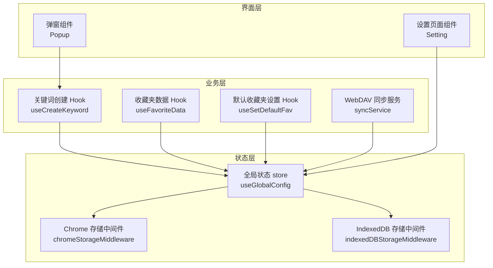
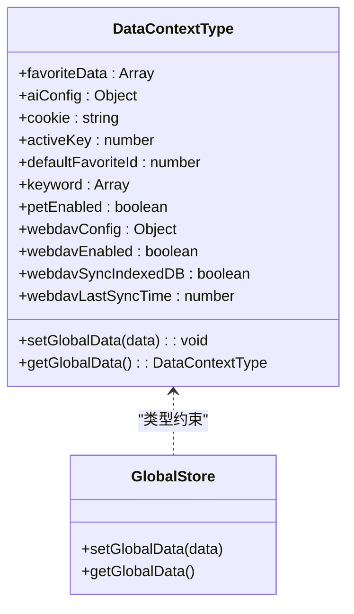
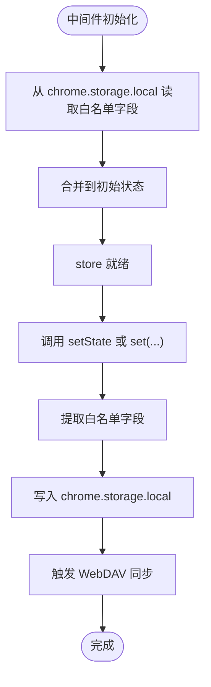
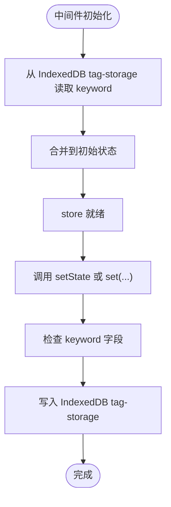
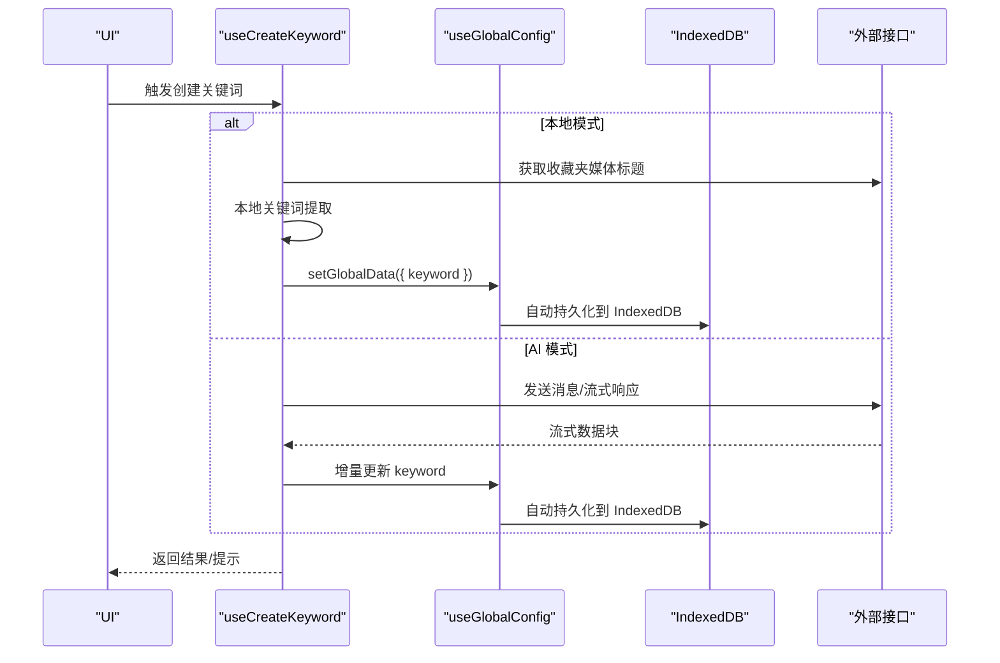
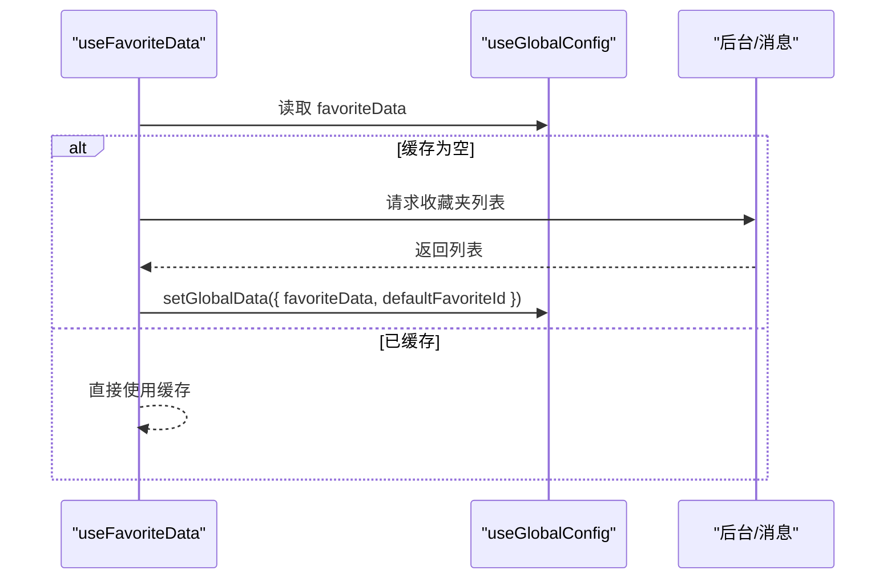
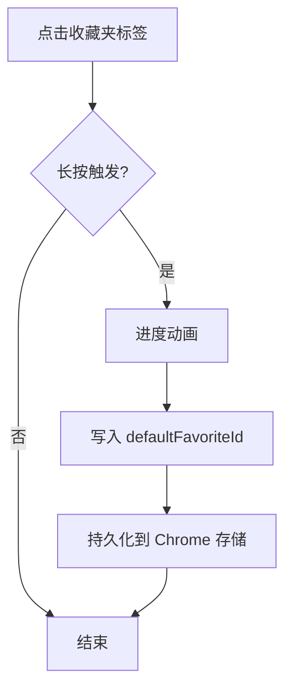
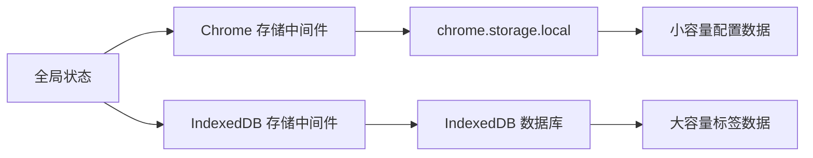
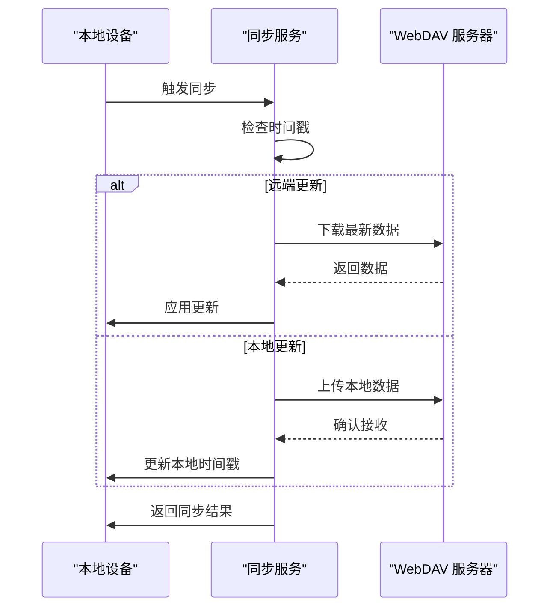
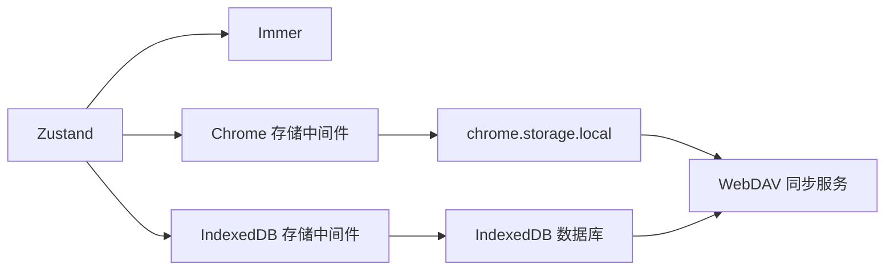

# 状态管理设计

<cite>
**本文引用的文件**
- [src/store/global-data.ts](file://src/store/global-data.ts)
- [src/store/chorme-storage-middleware.ts](file://src/store/chorme-storage-middleware.ts)
- [src/store/indexeddb-storage-middleware.ts](file://src/store/indexeddb-storage-middleware.ts)
- [src/utils/indexed-db.ts](file://src/utils/indexed-db.ts)
- [src/utils/sync-service.ts](file://src/utils/sync-service.ts)
- [src/utils/data-context.ts](file://src/utils/data-context.ts)
- [src/hooks/use-favorite-data/index.ts](file://src/hooks/use-favorite-data/index.ts)
- [src/hooks/use-create-keyword/index.tsx](file://src/hooks/use-create-keyword/index.tsx)
- [src/hooks/use-set-default-fav/index.tsx](file://src/hooks/use-set-default-fav/index.tsx)
- [src/options/components/setting/index.tsx](file://src/options/components/setting/index.tsx)
- [src/popup/components/move/index.tsx](file://src/popup/components/move/index.tsx)
- [package.json](file://package.json)
</cite>

## 更新摘要
**变更内容**
- 新增IndexedDB存储中间件，支持大容量数据的高效持久化
- 更新全局数据存储配置，实现Chrome存储与IndexedDB的混合存储策略
- 重构WebDAV同步服务，支持跨设备数据同步与冲突解决
- 优化状态持久化策略，区分不同类型数据的最佳存储位置

## 目录
1. [引言](#引言)
2. [项目结构](#项目结构)
3. [核心组件](#核心组件)
4. [架构总览](#架构总览)
5. [详细组件分析](#详细组件分析)
6. [混合存储策略](#混合存储策略)
7. [WebDAV跨设备同步](#webdav跨设备同步)
8. [依赖分析](#依赖分析)
9. [性能考虑](#性能考虑)
10. [故障排查指南](#故障排查指南)
11. [结论](#结论)
12. [附录](#附录)

## 引言
本设计文档围绕"B站收藏夹整理工具"的状态管理展开，重点说明基于Zustand的全局状态设计与实现细节。系统采用混合存储策略，结合Chrome存储中间件和IndexedDB存储中间件，实现不同类型数据的最优持久化方案。涵盖store设计模式、action定义、selector优化、中间件机制、全局/局部状态划分策略、跨设备同步机制、状态订阅与性能优化、内存管理、状态迁移与版本兼容性、以及数据备份与恢复建议。

## 项目结构
本项目采用"按职责分层 + 组件驱动"的组织方式，引入混合存储架构：
- store层：集中定义全局状态与多种中间件，提供统一的数据入口
- hooks层：封装业务逻辑与状态读取，使用shallow selector降低重渲染
- components层：UI组件消费状态，触发action
- utils层：类型定义、工具函数、消息通信、API调用、IndexedDB管理、WebDAV同步服务



**图表来源**
- [src/store/global-data.ts:1-39](file://src/store/global-data.ts#L1-L39)
- [src/store/chorme-storage-middleware.ts:1-80](file://src/store/chorme-storage-middleware.ts#L1-L80)
- [src/store/indexeddb-storage-middleware.ts:1-80](file://src/store/indexeddb-storage-middleware.ts#L1-L80)
- [src/utils/sync-service.ts:1-275](file://src/utils/sync-service.ts#L1-L275)

**章节来源**
- [src/store/global-data.ts:1-39](file://src/store/global-data.ts#L1-L39)
- [src/store/chorme-storage-middleware.ts:1-80](file://src/store/chorme-storage-middleware.ts#L1-L80)
- [src/store/indexeddb-storage-middleware.ts:1-80](file://src/store/indexeddb-storage-middleware.ts#L1-L80)
- [src/utils/sync-service.ts:1-275](file://src/utils/sync-service.ts#L1-L275)

## 核心组件
- **全局状态store**：以Zustand创建，结合Immer中间件实现不可变更新；通过混合中间件实现持久化与初始化恢复
- **数据上下文类型**：统一定义收藏夹数据、AI配置、Cookie、活动收藏夹键、默认收藏夹ID、关键词集合、宠物配置、WebDAV配置等字段及set/get方法
- **关键业务Hook**：
  - useCreateKeyword：负责关键词提取（本地/AI/手动）与批量处理流程
  - useFavoriteData：负责收藏夹列表的拉取与缓存
  - useSetDefaultFav：负责默认收藏夹的设置与交互反馈
- **设置页面**：通过表单读取/写入全局状态中的AI配置，并根据适配器动态填充默认参数
- **WebDAV同步服务**：管理跨设备数据同步、冲突解决和版本控制

**章节来源**
- [src/store/global-data.ts:7-36](file://src/store/global-data.ts#L7-L36)
- [src/utils/data-context.ts:5-39](file://src/utils/data-context.ts#L5-L39)
- [src/hooks/use-create-keyword/index.tsx:47-59](file://src/hooks/use-create-keyword/index.tsx#L47-L59)
- [src/hooks/use-favorite-data/index.ts:47-58](file://src/hooks/use-favorite-data/index.ts#L47-L58)
- [src/hooks/use-set-default-fav/index.tsx:6-99](file://src/hooks/use-set-default-fav/index.tsx#L6-L99)
- [src/options/components/setting/index.tsx:14-75](file://src/options/components/setting/index.tsx#L14-L75)
- [src/utils/sync-service.ts:80-214](file://src/utils/sync-service.ts#L80-L214)

## 架构总览
下图展示状态从创建、持久化到使用的端到端流程，以及关键组件之间的调用关系。系统现在支持两种存储策略：Chrome存储用于小容量配置数据，IndexedDB用于大容量标签数据。

```mermaid
sequenceDiagram
participant UI as "UI 组件"
participant Hook as "业务 Hook"
participant Store as "Zustand Store"
participant M1 as "Chrome 中间件"
participant M2 as "IndexedDB 中间件"
participant Storage1 as "Chrome 存储"
participant Storage2 as "IndexedDB"
UI->>Hook : 触发业务动作
Hook->>Store : 调用 setGlobalData(...)
Store->>M1 : setState(...) 回调
Store->>M2 : setState(...) 回调
M1->>Storage1 : 写入配置字段
M2->>Storage2 : 写入标签数据
Storage1-->>M1 : 写入完成
Storage2-->>M2 : 写入完成
M1-->>Store : 更新完成
M2-->>Store : 更新完成
Store-->>Hook : 返回最新状态
Hook-->>UI : 渲染更新
Note over Store,Storage1,Storage2 : 初始化时从两种存储恢复状态
```

**图表来源**
- [src/store/global-data.ts:7-36](file://src/store/global-data.ts#L7-L36)
- [src/store/chorme-storage-middleware.ts:20-74](file://src/store/chorme-storage-middleware.ts#L20-L74)
- [src/store/indexeddb-storage-middleware.ts:12-72](file://src/store/indexeddb-storage-middleware.ts#L12-L72)

## 详细组件分析

### 全局状态store设计
- **设计模式**
  - 使用Zustand的create API创建store
  - 结合immer中间件，允许以可变风格编写更新逻辑，同时保持不可变语义
  - 通过混合中间件实现状态持久化与初始化恢复
- **Action定义**
  - setGlobalData：用于批量或单项更新状态字段
  - getGlobalData：用于在业务逻辑中读取完整状态快照
- **Selector优化**
  - 在多个hook中使用shallow selector，仅在所选字段变化时触发重渲染，避免无关UI重复渲染
- **中间件机制**
  - 在setState回调中拦截，分别对不同中间件进行持久化
  - 初始化时从chrome.storage.local和IndexedDB恢复状态



**图表来源**
- [src/utils/data-context.ts:5-39](file://src/utils/data-context.ts#L5-L39)
- [src/store/global-data.ts:7-36](file://src/store/global-data.ts#L7-L36)

**章节来源**
- [src/store/global-data.ts:7-36](file://src/store/global-data.ts#L7-L36)
- [src/utils/data-context.ts:5-39](file://src/utils/data-context.ts#L5-L39)

### Chrome存储中间件实现原理
- **持久化字段白名单**：仅对activeKey、cookie、aiConfig、defaultFavoriteId、petEnabled、WebDAV配置等小容量字段进行持久化
- **初始化恢复**：启动时从chrome.storage.local读取白名单字段，合并到初始状态
- **写入策略**：每次setState或通过包装后的set调用后，仅提取白名单字段写回存储
- **WebDAV自动同步**：当WebDAV启用时，自动触发同步通知



**图表来源**
- [src/store/chorme-storage-middleware.ts:20-74](file://src/store/chorme-storage-middleware.ts#L20-L74)

**章节来源**
- [src/store/chorme-storage-middleware.ts:3-16](file://src/store/chorme-storage-middleware.ts#L3-L16)
- [src/store/chorme-storage-middleware.ts:24-51](file://src/store/chorme-storage-middleware.ts#L24-L51)

### IndexedDB存储中间件实现原理
- **存储字段白名单**：专门针对keyword字段进行持久化，适合存储体积较大、访问频率高的标签数据
- **初始化恢复**：启动时从IndexedDB的tag-storage对象存储中读取keyword字段
- **写入策略**：每次状态更新时，仅对keyword字段进行IndexedDB持久化
- **性能优势**：相比Chrome存储，IndexedDB更适合大容量数据的高效读写



**图表来源**
- [src/store/indexeddb-storage-middleware.ts:12-72](file://src/store/indexeddb-storage-middleware.ts#L12-L72)

**章节来源**
- [src/store/indexeddb-storage-middleware.ts:4-8](file://src/store/indexeddb-storage-middleware.ts#L4-L8)
- [src/store/indexeddb-storage-middleware.ts:16-49](file://src/store/indexeddb-storage-middleware.ts#L16-L49)

### 全局状态与局部状态划分策略
- **全局状态（Chrome存储持久化）**
  - 用户配置：aiConfig（模型、适配器、免费额度配置等）
  - Cookie：登录态标识
  - 活动收藏夹键：activeKey（当前选中收藏夹）
  - 默认收藏夹ID：defaultFavoriteId（默认目标收藏夹）
  - 宠物配置：petEnabled（桌面宠物开关）
  - WebDAV配置：webdavConfig、webdavEnabled、webdavSyncIndexedDB、webdavLastSyncTime
- **全局状态（IndexedDB持久化）**
  - 关键词集合：keyword（每个收藏夹对应的关键词映射）
- **局部状态（非持久化）**
  - 组件内部的临时UI状态（如加载、错误提示、动画进度等）
  - 业务流程中的临时变量（如AbortController、请求缓存等）

**章节来源**
- [src/utils/data-context.ts:5-39](file://src/utils/data-context.ts#L5-L39)
- [src/store/chorme-storage-middleware.ts:3-16](file://src/store/chorme-storage-middleware.ts#L3-L16)
- [src/store/indexeddb-storage-middleware.ts:4-8](file://src/store/indexeddb-storage-middleware.ts#L4-L8)

### 关键业务流程与状态交互

#### 关键词创建流程（本地/AI/手动）
- **本地提取**：从收藏夹媒体标题构建关键词集合，写入全局状态（自动持久化到IndexedDB）
- **AI提取**：根据配置选择自定义模型或免费额度通道，流式解析并增量更新状态
- **批量处理**：遍历所有收藏夹，逐个执行提取并统计结果



**图表来源**
- [src/hooks/use-create-keyword/index.tsx:112-151](file://src/hooks/use-create-keyword/index.tsx#L112-L151)
- [src/hooks/use-create-keyword/index.tsx:157-200](file://src/hooks/use-create-keyword/index.tsx#L157-L200)
- [src/hooks/use-create-keyword/index.tsx:200-284](file://src/hooks/use-create-keyword/index.tsx#L200-L284)

**章节来源**
- [src/hooks/use-create-keyword/index.tsx:47-59](file://src/hooks/use-create-keyword/index.tsx#L47-L59)

#### 收藏夹数据获取与缓存
- **首次访问时**通过消息通信拉取收藏夹列表，写入全局状态并缓存
- **后续直接从全局状态**读取，减少网络开销



**图表来源**
- [src/hooks/use-favorite-data/index.ts:47-58](file://src/hooks/use-favorite-data/index.ts#L47-L58)
- [src/hooks/use-favorite-data/index.ts:54-58](file://src/hooks/use-favorite-data/index.ts#L54-L58)

**章节来源**
- [src/hooks/use-favorite-data/index.ts:47-58](file://src/hooks/use-favorite-data/index.ts#L47-L58)

#### 默认收藏夹设置流程
- **长按触发设置流程**，通过动画进度指示用户操作
- **完成后将defaultFavoriteId写入全局状态**（自动持久化到Chrome存储）



**图表来源**
- [src/hooks/use-set-default-fav/index.tsx:54-99](file://src/hooks/use-set-default-fav/index.tsx#L54-L99)

**章节来源**
- [src/hooks/use-set-default-fav/index.tsx:6-99](file://src/hooks/use-set-default-fav/index.tsx#L6-L99)

### 状态订阅机制、性能优化与内存管理
- **订阅机制**
  - 通过Zustand的订阅能力，组件在selector中声明依赖字段，仅当这些字段变化时触发重渲染
  - 使用useShallow降低不必要的重渲染
- **性能优化**
  - **混合存储策略**：小容量配置数据走Chrome存储，大容量标签数据走IndexedDB
  - 仅持久化必要字段，减少存储体积与IO开销
  - 对大数组（如收藏夹列表）采用浅拷贝与选择性更新
  - 使用useMemoizedFn缓解函数重建带来的副作用
- **内存管理**
  - 及时清理AbortController，避免悬挂请求占用内存
  - 对临时UI状态与动画资源在useEffect cleanup中释放

**章节来源**
- [src/hooks/use-create-keyword/index.tsx:47-59](file://src/hooks/use-create-keyword/index.tsx#L47-L59)
- [src/hooks/use-create-keyword/index.tsx:200-206](file://src/hooks/use-create-keyword/index.tsx#L200-L206)
- [src/store/chorme-storage-middleware.ts:3-16](file://src/store/chorme-storage-middleware.ts#L3-L16)
- [src/store/indexeddb-storage-middleware.ts:4-8](file://src/store/indexeddb-storage-middleware.ts#L4-L8)

### 状态迁移、版本兼容性与数据备份恢复
- **状态迁移**
  - 当新增字段时，可在hydrate阶段提供默认值，保证旧版本数据平滑升级
  - 对于字段删除或结构变更，可通过版本号字段控制迁移策略
- **版本兼容性**
  - 通过白名单字段与类型约束，避免持久化未知字段导致的兼容问题
  - IndexedDB和Chrome存储的分离设计提供了更好的向后兼容性
- **数据备份与恢复**
  - 建议在设置页面提供导出/导入功能：导出时读取白名单字段，导入时校验并合并到当前状态
  - WebDAV同步服务支持跨设备数据备份与恢复
  - IndexedDB分析缓存支持单独的数据备份选项

**章节来源**
- [src/store/chorme-storage-middleware.ts:24-31](file://src/store/chorme-storage-middleware.ts#L24-L31)
- [src/utils/data-context.ts:5-39](file://src/utils/data-context.ts#L5-L39)
- [src/utils/sync-service.ts:80-121](file://src/utils/sync-service.ts#L80-L121)

## 混合存储策略

### 存储策略设计原则
系统采用"按数据特征选择最佳存储"的混合策略：

- **Chrome存储**：适用于小容量、频繁访问的配置数据
  - 字段：activeKey、cookie、aiConfig、defaultFavoriteId、petEnabled、WebDAV配置
  - 优点：访问速度快、API简单、自动同步
  - 限制：存储空间有限（约5MB）

- **IndexedDB存储**：适用于大容量、结构化数据
  - 字段：keyword（关键词集合）
  - 优点：存储空间大、支持复杂查询、事务性操作
  - 限制：API相对复杂、访问速度慢于内存



**图表来源**
- [src/store/global-data.ts:7-36](file://src/store/global-data.ts#L7-L36)
- [src/store/chorme-storage-middleware.ts:3-16](file://src/store/chorme-storage-middleware.ts#L3-L16)
- [src/store/indexeddb-storage-middleware.ts:4-8](file://src/store/indexeddb-storage-middleware.ts#L4-L8)

### 存储中间件实现细节
- **初始化顺序**：IndexedDB中间件先于Chrome中间件执行，确保数据完整性
- **并发写入**：两个中间件独立处理各自的持久化，避免相互阻塞
- **错误隔离**：单个中间件的失败不影响另一个中间件的正常工作

**章节来源**
- [src/store/global-data.ts:7-36](file://src/store/global-data.ts#L7-L36)
- [src/store/indexeddb-storage-middleware.ts:12-72](file://src/store/indexeddb-storage-middleware.ts#L12-L72)
- [src/store/chorme-storage-middleware.ts:20-74](file://src/store/chorme-storage-middleware.ts#L20-L74)

## WebDAV跨设备同步

### 同步架构设计
系统提供完整的跨设备数据同步解决方案，支持冲突检测与自动解决：

- **同步范围**：配置数据（除cookie外）和可选的IndexedDB数据
- **冲突解决**：基于时间戳的最后写入获胜策略
- **版本控制**：支持同步版本管理和设备标识



**图表来源**
- [src/utils/sync-service.ts:185-214](file://src/utils/sync-service.ts#L185-L214)

### 同步字段管理
- **标准同步字段**：activeKey、aiConfig、defaultFavoriteId、petEnabled
- **IndexedDB同步字段**：keyword（可选开启）
- **特殊处理**：cookie字段不参与同步，确保账户安全

**章节来源**
- [src/utils/sync-service.ts:18-22](file://src/utils/sync-service.ts#L18-L22)
- [src/utils/sync-service.ts:71-78](file://src/utils/sync-service.ts#L71-L78)
- [src/store/chorme-storage-middleware.ts:3-16](file://src/store/chorme-storage-middleware.ts#L3-L16)

## 依赖分析
- **Zustand**：核心状态管理库，提供轻量、灵活的store创建与中间件机制
- **Immer**：用于不可变更新，简化状态修改逻辑
- **Chrome存储**：提供本地持久化能力，作为配置数据的后备存储
- **IndexedDB**：提供大容量数据存储能力，专门用于标签数据持久化
- **WebDAV**：提供跨设备同步能力，支持数据备份与恢复



**图表来源**
- [package.json:29-57](file://package.json#L29-L57)
- [src/store/chorme-storage-middleware.ts:1-80](file://src/store/chorme-storage-middleware.ts#L1-L80)
- [src/store/indexeddb-storage-middleware.ts:1-80](file://src/store/indexeddb-storage-middleware.ts#L1-L80)
- [src/utils/sync-service.ts:1-275](file://src/utils/sync-service.ts#L1-L275)

**章节来源**
- [package.json:29-57](file://package.json#L29-L57)

## 性能考虑
- **选择器优化**：优先使用useShallow，仅订阅必要字段
- **存储策略优化**：
  - 小容量配置数据走Chrome存储，访问速度快
  - 大容量标签数据走IndexedDB，存储效率高
  - 避免将大型对象或临时数据写入存储
- **中间件写入优化**：setState后立即持久化，但可通过防抖或批量写入进一步优化
- **跨设备同步优化**：支持增量同步和冲突检测，减少不必要的数据传输
- **存储体积控制**：严格遵循白名单字段，避免将临时数据写入存储

## 故障排查指南
- **状态未持久化**
  - 检查字段是否在正确的中间件白名单中
  - 确认中间件是否正确包裹store初始化
  - 验证IndexedDB数据库连接状态
- **初始化恢复失败**
  - 检查chrome.storage.local和IndexedDB中是否存在对应键
  - 确认字段类型与默认值是否一致
  - 检查IndexedDB数据库版本升级是否成功
- **性能问题**
  - 检查是否存在过度重渲染，确认是否使用shallow选择器
  - 关注大数组更新频率，必要时采用分页或懒加载
  - 监控IndexedDB存储使用情况
- **跨设备不同步**
  - 检查WebDAV配置是否正确
  - 验证网络连接和服务器可用性
  - 查看同步日志和错误信息
- **存储空间不足**
  - 清理过期的分析缓存数据
  - 考虑调整同步策略，减少同步的数据量

**章节来源**
- [src/store/chorme-storage-middleware.ts:3-16](file://src/store/chorme-storage-middleware.ts#L3-L16)
- [src/store/indexeddb-storage-middleware.ts:31-33](file://src/store/indexeddb-storage-middleware.ts#L31-L33)
- [src/utils/sync-service.ts:185-214](file://src/utils/sync-service.ts#L185-L214)

## 结论
本项目采用Zustand作为状态管理核心，结合Immer、Chrome存储中间件和IndexedDB存储中间件，实现了高效且可扩展的全局状态管理。通过混合存储策略，系统能够根据不同数据特征选择最佳的存储方案：小容量配置数据使用Chrome存储，大容量标签数据使用IndexedDB。WebDAV同步服务提供了完整的跨设备数据同步解决方案，支持冲突检测与自动解决。这种架构设计在保证功能完整性的同时，确保了状态管理具备良好的可维护性、可扩展性与高性能。

## 附录
- **相关实现文件路径**
  - [全局状态store:7-36](file://src/store/global-data.ts#L7-L36)
  - [Chrome存储中间件:20-74](file://src/store/chorme-storage-middleware.ts#L20-L74)
  - [IndexedDB存储中间件:12-72](file://src/store/indexeddb-storage-middleware.ts#L12-L72)
  - [数据上下文类型:5-39](file://src/utils/data-context.ts#L5-L39)
  - [关键词创建Hook:47-59](file://src/hooks/use-create-keyword/index.tsx#L47-L59)
  - [收藏夹数据Hook:47-58](file://src/hooks/use-favorite-data/index.tsx#L47-L58)
  - [默认收藏夹设置Hook:6-99](file://src/hooks/use-set-default-fav/index.tsx#L6-L99)
  - [设置页面组件:14-75](file://src/options/components/setting/index.tsx#L14-L75)
  - [弹窗组件:6-8](file://src/popup/components/move/index.tsx#L6-L8)
  - [依赖清单:29-57](file://package.json#L29-L57)
  - [IndexedDB管理器:16-168](file://src/utils/indexed-db.ts#L16-L168)
  - [WebDAV同步服务:80-214](file://src/utils/sync-service.ts#L80-L214)