# AI关键词提取系统

<cite>
**本文档引用的文件**
- [ai-gate.ts](file://src/background/ai-gate.ts)
- [utils.ts](file://src/background/utils.ts)
- [index.ts](file://src/background/index.ts)
- [ai-stream-parser.ts](file://src/hooks/use-create-keyword-by-ai/ai-stream-parser.ts)
- [use-ai-move.tsx](file://src/popup/components/ai-move/use-ai-move.tsx)
- [api.ts](file://src/utils/api.ts)
- [message.ts](file://src/utils/message.ts)
- [global-data.ts](file://src/store/global-data.ts)
- [types.ts](file://src/options/components/setting/types.ts)
- [util.ts](file://src/options/components/setting/util.ts)
- [keyword-extractor.ts](file://src/utils/keyword-extractor.ts)
- [keyword/index.tsx](file://src/components/keyword/index.tsx)
- [use-edit-keyword/index.tsx](file://src/hooks/use-edit-keyword/index.tsx)
- [ai-stream-parser.test.ts](file://tests/ai-stream-parser.test.ts)
- [ai-stream-adapter.test.ts](file://tests/ai-stream-adapter.test.ts)
- [ai-stream-connect.test.ts](file://tests/ai-stream-connect.test.ts)
- [package.json](file://package.json)
- [README.md](file://README.md)
</cite>

## 更新摘要
**所做更改**
- 新增多AI提供商集成支持（Qwen、Kimi、通义千问、GML）
- 新增LangChain架构支持和消息模板系统
- 新增AIGate免费AI服务集成和配额管理
- 新增后台处理模块（ai-gate.ts）和AI工具集（utils.ts）
- 更新AI流解析器以支持更多适配器类型
- 新增AI移动分类功能和配额检查机制

## 目录
1. [简介](#简介)
2. [项目结构](#项目结构)
3. [核心组件](#核心组件)
4. [架构概览](#架构概览)
5. [详细组件分析](#详细组件分析)
6. [依赖关系分析](#依赖关系分析)
7. [性能考虑](#性能考虑)
8. [故障排除指南](#故障排除指南)
9. [结论](#结论)
10. [附录](#附录)

## 简介

AI关键词提取系统是一个基于Chrome扩展的智能工具，专门用于帮助用户高效管理和分析Bilibili收藏夹内容。该系统的核心功能包括：

- **多AI提供商集成**：支持OpenAI、Qwen、Kimi、通义千问、GML等多种AI模型的流式响应处理
- **LangChain架构支持**：基于LangChain的消息模板和流式处理机制
- **智能关键词管理**：支持关键词的创建、编辑、删除和组织管理
- **本地TF-IDF算法**：提供离线关键词提取能力
- **实时流式处理**：支持SSE流式数据的实时解析和更新
- **AIGate免费服务**：提供内置的免费AI配额管理和流式响应处理

系统采用模块化设计，通过Chrome扩展的消息传递机制实现前后端分离，确保良好的用户体验和性能表现。

## 项目结构

该项目采用React + TypeScript + Vite构建的Chrome扩展应用，主要目录结构如下：

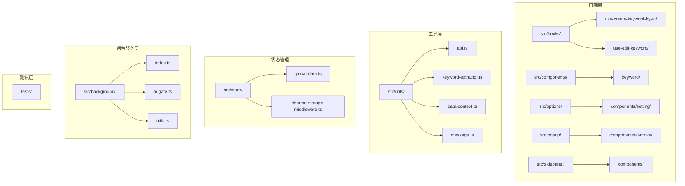

**图表来源**
- [package.json:1-91](file://package.json#L1-L91)
- [README.md:1-188](file://README.md#L1-L188)

**章节来源**
- [package.json:1-91](file://package.json#L1-L91)
- [README.md:1-188](file://README.md#L1-L188)

## 核心组件

### LangChain消息模板系统

系统集成了完整的LangChain消息模板系统，支持多种AI模型的标准化消息格式：

- **关键词提取模板**：基于ChatPromptTemplate的系统提示和few-shot示例
- **AI移动分类模板**：专门针对视频分类任务的消息模板
- **标准化消息格式**：统一不同AI模型的消息结构
- **动态参数注入**：支持运行时参数的动态替换

### AIGate免费AI服务

AIGate提供了完整的免费AI服务集成，包括：

- **配额管理系统**：每日、每分钟请求配额检查
- **SSE流式响应**：标准的SSE数据流处理
- **错误处理机制**：完善的异常捕获和错误上报
- **用户标识管理**：基于扩展设备ID的用户识别

### AI流解析器组件

AI流解析器是系统的核心组件，负责处理来自AI模型的流式响应数据。它实现了以下关键功能：

- **多适配器支持**：支持OpenAI、星火、Qwen、Kimi等多种模型格式
- **增量解析**：实时解析SSE流数据，支持关键词的渐进式提取
- **缓冲区管理**：智能管理解析过程中的数据缓冲区
- **错误处理**：完善的异常处理和数据验证机制

### 关键词管理组件

关键词管理组件提供了完整的关键词生命周期管理：

- **关键词创建**：支持通过AI自动提取和手动输入两种方式
- **关键词编辑**：提供可视化的关键词编辑界面
- **关键词删除**：支持单个和批量删除操作
- **关键词组织**：按收藏夹进行关键词分类管理

### TF-IDF算法组件

本地TF-IDF算法组件提供了离线关键词提取能力：

- **中文分词**：支持中文文本的智能分词处理
- **停用词过滤**：内置常用停用词列表，提高关键词质量
- **权重计算**：基于TF-IDF算法计算关键词重要性
- **结果排序**：按权重对关键词进行排序和筛选

**章节来源**
- [utils.ts:1-183](file://src/background/utils.ts#L1-L183)
- [ai-gate.ts:1-209](file://src/background/ai-gate.ts#L1-L209)
- [ai-stream-parser.ts:1-282](file://src/hooks/use-create-keyword-by-ai/ai-stream-parser.ts#L1-L282)
- [keyword-extractor.ts:1-197](file://src/utils/keyword-extractor.ts#L1-L197)
- [use-edit-keyword/index.tsx:1-108](file://src/hooks/use-edit-keyword/index.tsx#L1-L108)

## 架构概览

系统采用分层架构设计，通过Chrome扩展的消息传递机制实现前后端分离：

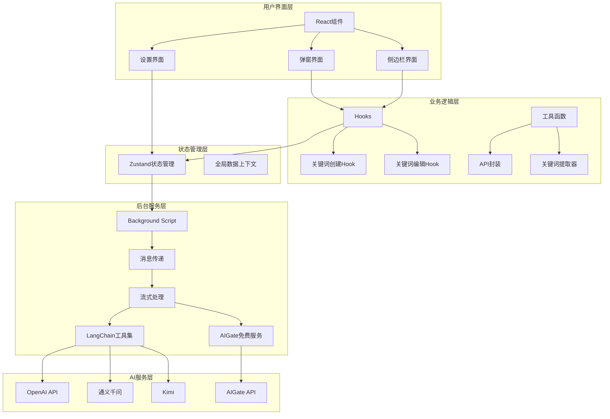

**图表来源**
- [index.ts:1-87](file://src/background/index.ts#L1-L87)
- [api.ts:1-348](file://src/utils/api.ts#L1-L348)
- [global-data.ts:1-30](file://src/store/global-data.ts#L1-L30)

## 详细组件分析

### LangChain消息模板实现

系统集成了完整的LangChain消息模板系统，实现了标准化的消息处理机制：

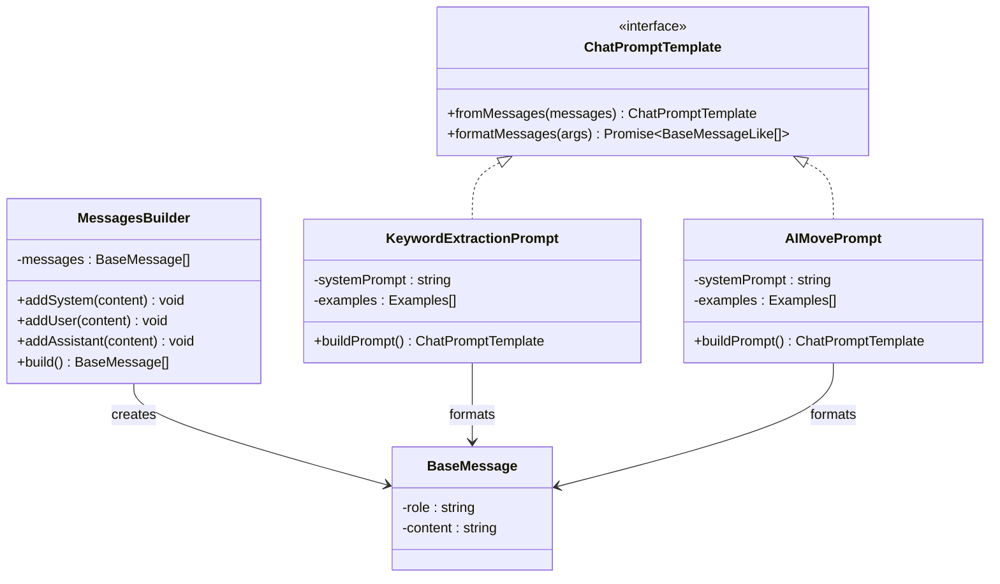

**图表来源**
- [utils.ts:34-50](file://src/background/utils.ts#L34-L50)
- [utils.ts:99-118](file://src/background/utils.ts#L99-L118)

#### 消息模板构建流程

系统通过以下流程构建标准化的消息模板：

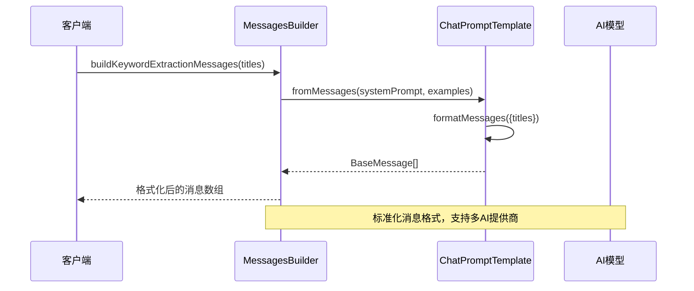

**图表来源**
- [utils.ts:46-50](file://src/background/utils.ts#L46-L50)
- [utils.ts:111-118](file://src/background/utils.ts#L111-L118)

**章节来源**
- [utils.ts:1-183](file://src/background/utils.ts#L1-L183)

### AIGate免费AI服务集成

AIGate服务提供了完整的免费AI集成方案，包括配额管理和流式响应处理：

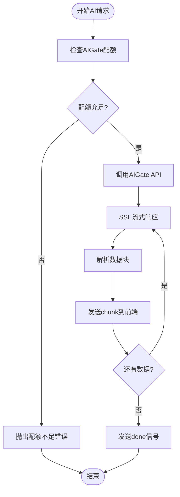

**图表来源**
- [ai-gate.ts:106-206](file://src/background/ai-gate.ts#L106-L206)

#### 配额管理系统

AIGate提供了完善的配额管理机制：

- **每日配额**：基于请求次数的每日限制
- **RPM限制**：每分钟请求频率限制
- **用户标识**：基于扩展设备ID的用户识别
- **实时检查**：请求前的配额状态检查

**章节来源**
- [ai-gate.ts:1-209](file://src/background/ai-gate.ts#L1-L209)

### AI流解析器实现原理

AI流解析器采用了适配器模式和流式处理技术，实现了对不同AI模型响应格式的统一处理：

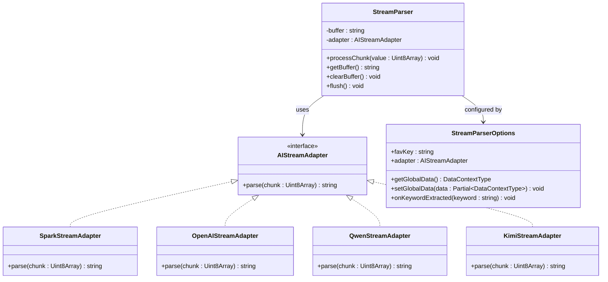

**图表来源**
- [ai-stream-parser.ts:26-97](file://src/hooks/use-create-keyword-by-ai/ai-stream-parser.ts#L26-L97)
- [ai-stream-parser.ts:225-282](file://src/hooks/use-create-keyword-by-ai/ai-stream-parser.ts#L225-L282)

#### 流式响应处理流程

系统通过以下流程处理AI模型的流式响应：

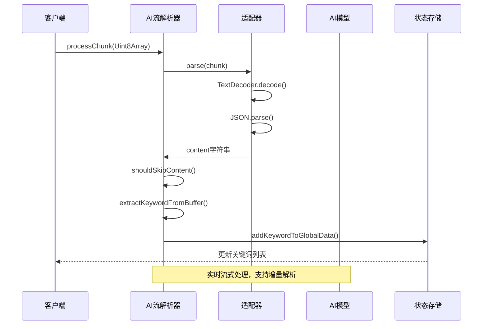

**图表来源**
- [ai-stream-parser.ts:188-218](file://src/hooks/use-create-keyword-by-ai/ai-stream-parser.ts#L188-L218)
- [ai-stream-parser.ts:231-250](file://src/hooks/use-create-keyword-by-ai/ai-stream-parser.ts#L231-L250)

#### 关键词提取算法

系统实现了高效的关键词提取算法，支持多种数据格式：

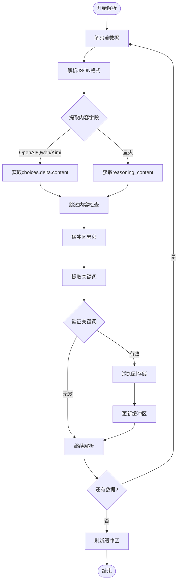

**图表来源**
- [ai-stream-parser.ts:121-149](file://src/hooks/use-create-keyword-by-ai/ai-stream-parser.ts#L121-L149)
- [ai-stream-parser.ts:269-282](file://src/hooks/use-create-keyword-by-ai/ai-stream-parser.ts#L269-L282)

**章节来源**
- [ai-stream-parser.ts:1-282](file://src/hooks/use-create-keyword-by-ai/ai-stream-parser.ts#L1-L282)
- [ai-stream-parser.test.ts:1-243](file://tests/ai-stream-parser.test.ts#L1-L243)

### TF-IDF算法应用

系统提供了完整的TF-IDF算法实现，用于本地关键词提取：

```mermaid
flowchart TD
Input[输入标题列表] --> Tokenize[中文分词]
Tokenize --> Clean[清理标点符号]
Clean --> ExtractPhrases[提取词组]
ExtractPhrases --> TF[计算词频(TF)]
TF --> IDF[计算逆文档频率(IDF)]
IDF --> Score[计算TF-IDF分数]
Score --> Filter[过滤停用词]
Filter --> Sort[按分数排序]
Sort --> Limit[限制关键词数量]
Limit --> Output[输出关键词结果]
```

**图表来源**
- [keyword-extractor.ts:137-187](file://src/utils/keyword-extractor.ts#L137-L187)

#### TF-IDF算法实现细节

系统采用以下策略优化TF-IDF算法：

- **中文分词优化**：支持2-4字中文词组的智能提取
- **停用词过滤**：内置丰富的中文停用词列表
- **动态阈值**：根据文档数量自动调整最小分数阈值
- **长度过滤**：支持最小关键词长度的配置

**章节来源**
- [keyword-extractor.ts:1-197](file://src/utils/keyword-extractor.ts#L1-L197)

### 关键词管理功能

关键词管理系统提供了完整的CRUD操作和组织管理：

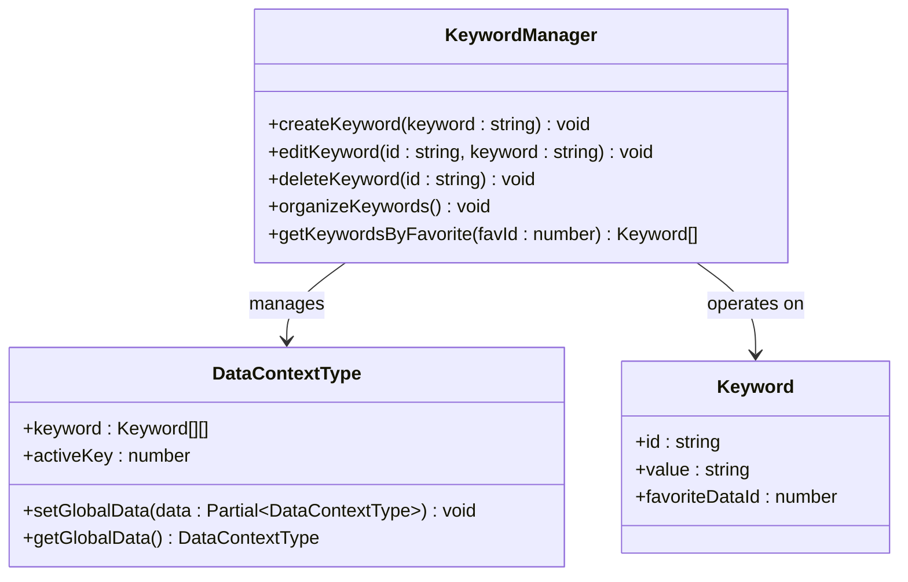

**图表来源**
- [use-edit-keyword/index.tsx:52-102](file://src/hooks/use-edit-keyword/index.tsx#L52-L102)
- [data-context.ts:24-31](file://src/utils/data-context.ts#L24-L31)

#### 关键词编辑界面

关键词编辑界面提供了直观的操作体验：

- **可视化标签**：以标签形式展示现有关键词
- **键盘快捷键**：支持Enter创建、Backspace删除
- **实时更新**：关键词变更立即反映到UI
- **防重复机制**：自动检测并防止重复关键词

**章节来源**
- [use-edit-keyword/index.tsx:1-108](file://src/hooks/use-edit-keyword/index.tsx#L1-L108)
- [keyword/index.tsx:1-32](file://src/components/keyword/index.tsx#L1-L32)

### 配置管理功能

系统提供了灵活的配置管理机制：

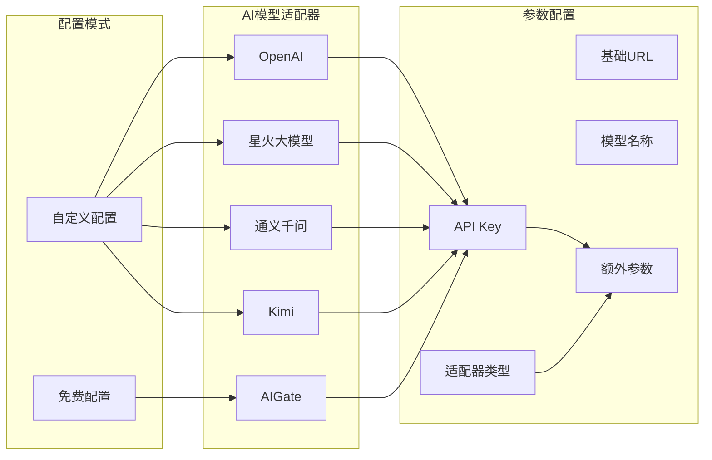

**图表来源**
- [setting/index.tsx:40-65](file://src/options/components/setting/index.tsx#L40-L65)
- [types.ts:30-40](file://src/options/components/setting/types.ts#L30-L40)

#### 配置验证机制

系统实现了多层次的配置验证：

- **必填字段检查**：确保API Key、模型名称等关键字段
- **格式验证**：使用Zod进行表单数据的严格验证
- **适配器选择**：根据选择的AI模型自动填充默认参数
- **配额检查**：免费模式下提供实时配额查询功能

**章节来源**
- [setting/index.tsx:1-98](file://src/options/components/setting/index.tsx#L1-L98)
- [types.ts:41-99](file://src/options/components/setting/types.ts#L41-L99)
- [util.ts:18-22](file://src/options/components/setting/util.ts#L18-L22)

### AI移动分类功能

系统新增了AI移动分类功能，支持自动视频整理：

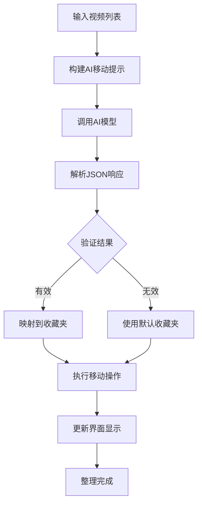

**图表来源**
- [use-ai-move.tsx:50-139](file://src/popup/components/ai-move/use-ai-move.tsx#L50-L139)
- [use-ai-move.tsx:141-292](file://src/popup/components/ai-move/use-ai-move.tsx#L141-L292)

#### AI移动分类实现

AI移动分类功能通过以下步骤实现：

- **视频收集**：从默认收藏夹收集所有视频
- **提示构建**：使用LangChain模板构建分类提示
- **AI分析**：调用AI模型进行视频分类
- **结果验证**：验证AI返回的收藏夹有效性
- **批量移动**：执行视频移动操作

**章节来源**
- [use-ai-move.tsx:1-378](file://src/popup/components/ai-move/use-ai-move.tsx#L1-L378)

## 依赖关系分析

系统采用模块化设计，各组件之间的依赖关系清晰明确：

```mermaid
graph TB
subgraph "核心依赖"
React[React 19.0.0]
Zustand[Zustand 5.0.6]
LangChain[LangChain Core]
UUID[UUID 11.0.3]
Zod[Zod 3.0.0]
end
subgraph "AI模型SDK"
OpenAI[OpenAI 6.22.0]
DashScope[DashScope 2.0.0]
Moonshot[Moonshot AI 1.0.0]
end
subgraph "UI组件库"
RadixUI[Radix UI]
TailwindCSS[Tailwind CSS]
Lucide[Lucide React]
end
subgraph "开发工具"
Vite[Vite 6.0.6]
TypeScript[TypeScript 5.7.2]
Vitest[Vitest 3.0.5]
end
subgraph "Chrome扩展"
ChromeTypes[@types/chrome]
CRXJS[CRXJS Vite Plugin]
end
React --> Zustand
React --> LangChain
React --> OpenAI
React --> UUID
LangChain --> Zod
UI --> RadixUI
UI --> TailwindCSS
UI --> Lucide
Dev --> Vite
Dev --> TypeScript
Dev --> Vitest
Extension --> ChromeTypes
Extension --> CRXJS
```

**图表来源**
- [package.json:29-58](file://package.json#L29-L58)
- [package.json:59-89](file://package.json#L59-L89)

### 关键依赖说明

- **React 19.0.0**：提供现代化的组件开发体验
- **Zustand 5.0.6**：轻量级状态管理解决方案
- **LangChain Core**：提供消息模板和流式处理能力
- **OpenAI 6.22.0**：官方OpenAI SDK，支持流式响应
- **DashScope**：通义千问官方SDK
- **Moonshot**：Kimi官方SDK
- **Radix UI**：高质量的无障碍UI组件库
- **Tailwind CSS**：实用优先的CSS框架

**章节来源**
- [package.json:1-91](file://package.json#L1-L91)

## 性能考虑

系统在设计时充分考虑了性能优化：

### 流式处理优化

- **增量解析**：实时处理流数据，避免内存占用过高
- **缓冲区管理**：智能管理解析缓冲区，支持断点续传
- **并发控制**：限制同时进行的AI请求数量
- **适配器复用**：避免频繁创建适配器实例

### 缓存策略

- **数据缓存**：收藏夹数据缓存24小时，减少重复请求
- **状态持久化**：使用Chrome Storage实现状态持久化
- **索引数据库**：利用IndexedDB存储大量收藏夹数据
- **配额缓存**：AIGate配额信息的短期缓存

### 内存管理

- **垃圾回收**：及时释放不再使用的数据引用
- **流式读取**：使用流式API避免大文件内存占用
- **组件卸载**：确保组件卸载时清理相关资源
- **适配器池化**：复用适配器实例减少内存分配

### 多AI提供商优化

- **适配器选择**：根据AI模型类型选择最优解析器
- **消息模板缓存**：缓存LangChain消息模板提升性能
- **流式连接复用**：复用Chrome扩展端口连接
- **配额预检查**：避免无效请求消耗配额

## 故障排除指南

### 常见问题及解决方案

#### API配置问题

**问题**：API Key配置无效
**解决方案**：
1. 检查API Key格式是否正确
2. 确认模型名称是否支持
3. 验证网络连接状态
4. 查看浏览器控制台错误信息
5. 检查AI提供商的可用性状态

#### 流式响应处理问题

**问题**：关键词提取不完整或延迟
**解决方案**：
1. 检查网络连接稳定性
2. 验证AI模型响应格式
3. 确认适配器配置正确
4. 查看流式数据解析日志
5. 检查AIGate配额状态

#### 关键词管理问题

**问题**：关键词无法保存或删除
**解决方案**：
1. 检查浏览器存储权限
2. 确认关键词格式符合要求
3. 验证收藏夹ID有效性
4. 重启浏览器扩展
5. 检查全局数据状态同步

#### AI移动分类问题

**问题**：AI移动功能无法正常工作
**解决方案**：
1. 检查默认收藏夹设置
2. 验证AI配置的有效性
3. 确认收藏夹列表加载完成
4. 查看AI返回的分类结果
5. 检查视频移动权限

#### 性能问题

**问题**：系统运行缓慢
**解决方案**：
1. 清理浏览器缓存
2. 检查扩展权限设置
3. 减少同时进行的AI请求
4. 升级到更高性能的设备
5. 检查AIGate配额使用情况

#### 配置模式切换问题

**问题**：从免费模式切换到自定义模式失败
**解决方案**：
1. 确认自定义AI配置完整
2. 验证API Key和模型名称
3. 检查网络连接状态
4. 查看配置验证错误信息
5. 重新加载扩展页面

**章节来源**
- [background/index.ts:181-192](file://src/background/index.ts#L181-L192)
- [api.ts:190-232](file://src/utils/api.ts#L190-L232)

## 结论

AI关键词提取系统是一个功能完整、架构清晰的Chrome扩展应用。系统的主要优势包括：

- **多AI提供商支持**：支持OpenAI、Qwen、Kimi、通义千问等多种AI模型
- **LangChain架构**：提供标准化的消息模板和流式处理能力
- **AIGate免费服务**：内置免费AI配额管理和流式响应处理
- **模块化设计**：各组件职责明确，便于维护和扩展
- **流式处理**：支持实时AI响应处理，提供良好用户体验
- **本地算法**：提供离线关键词提取能力，保护用户隐私
- **完整配置**：支持灵活的配置管理，适应不同使用场景
- **AI移动分类**：新增智能视频整理功能

系统通过合理的架构设计和优化策略，在保证功能完整性的同时，确保了良好的性能表现和用户体验。

## 附录

### 使用示例

#### 基本使用流程

1. **配置AI参数**：在设置页面配置API Key和模型参数
2. **选择收藏夹**：在关键词管理页面选择目标收藏夹
3. **触发AI提取**：点击"AI提取关键词"按钮开始处理
4. **编辑关键词**：在关键词列表中进行编辑和优化
5. **应用关键词**：将关键词应用到收藏夹整理规则中

#### 高级配置

- **多AI提供商**：通过适配器选择不同的AI模型
- **自定义参数**：通过extraParams传递模型特定参数
- **配额管理**：监控和管理AIGate免费配额使用情况
- **批量操作**：支持对多个收藏夹进行批量关键词提取
- **AI移动分类**：使用AI自动整理视频到指定收藏夹

### 最佳实践

- **定期清理**：定期清理无效和重复的关键词
- **合理配置**：根据使用场景调整模型参数和阈值
- **备份数据**：定期备份关键词配置和历史数据
- **监控性能**：关注系统性能指标，及时发现和解决问题
- **配额管理**：合理使用AIGate免费配额，避免浪费
- **多模型对比**：根据任务类型选择最适合的AI模型