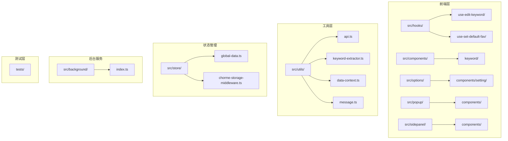
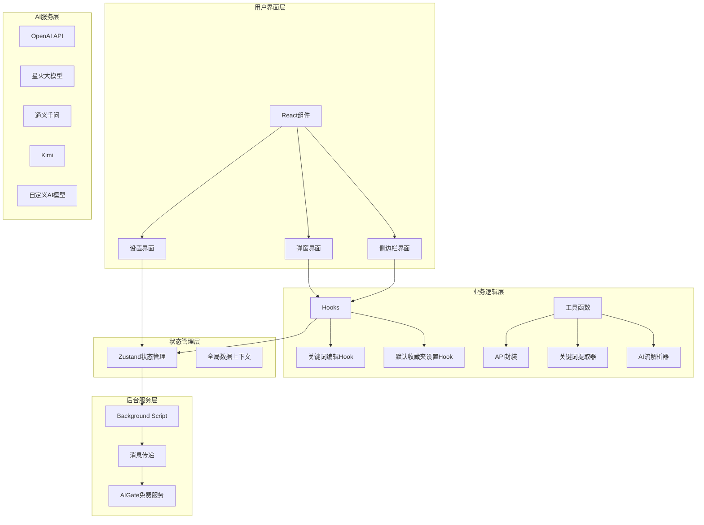
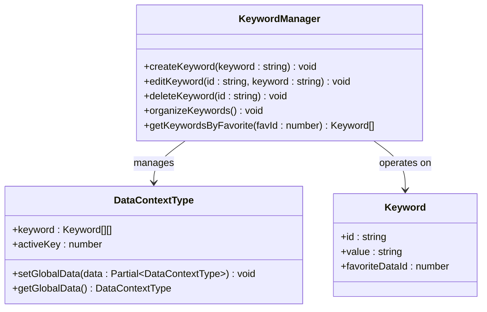
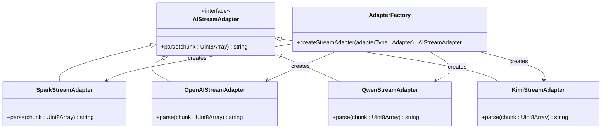
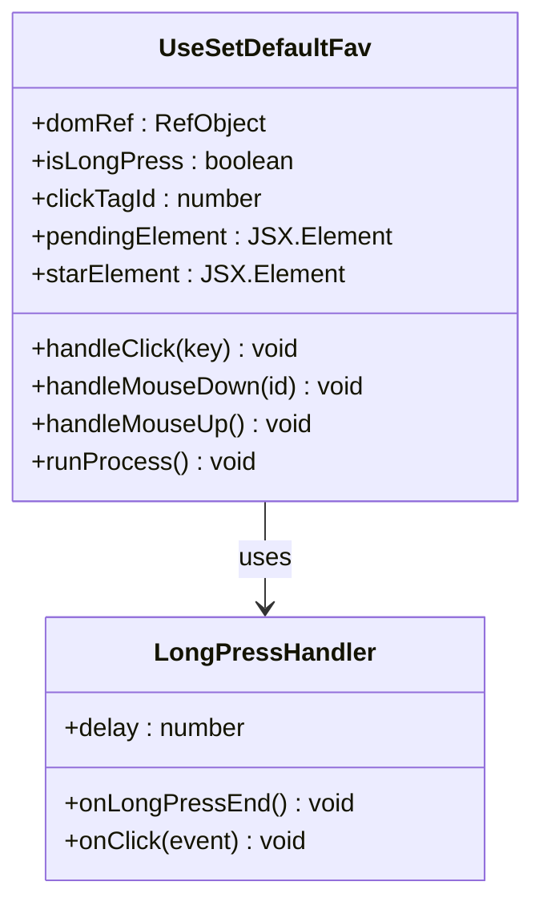
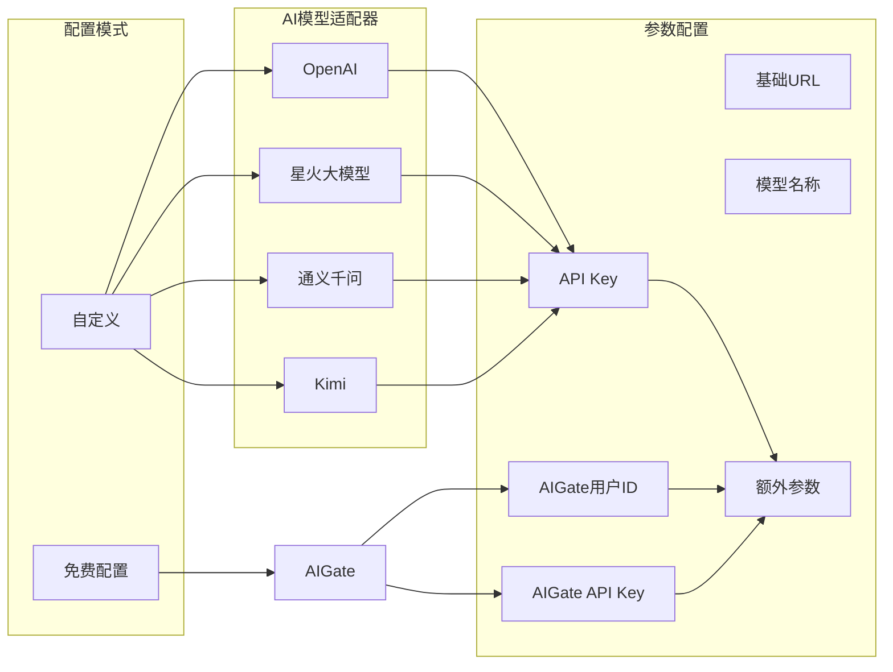

# AI关键词提取系统

<cite>
**本文档引用的文件**
- [use-create-keyword-by-ai/ai-stream-parser.ts](file://src/hooks/use-create-keyword-by-ai/ai-stream-parser.ts)
- [use-create-keyword/index.tsx](file://src/hooks/use-create-keyword/index.tsx)
- [keyword-extractor.ts](file://src/utils/keyword-extractor.ts)
- [api.ts](file://src/utils/api.ts)
- [background/index.ts](file://src/background/index.ts)
- [global-data.ts](file://src/store/global-data.ts)
- [data-context.ts](file://src/utils/data-context.ts)
- [setting/index.tsx](file://src/options/components/setting/index.tsx)
- [types.ts](file://src/options/components/setting/types.ts)
- [util.ts](file://src/options/components/setting/util.ts)
- [keyword/index.tsx](file://src/components/keyword/index.tsx)
- [use-edit-keyword/index.tsx](file://src/hooks/use-edit-keyword/index.tsx)
- [use-set-default-fav/index.tsx](file://src/hooks/use-set-default-fav/index.tsx)
- [message.ts](file://src/utils/message.ts)
- [free-quota-panel.tsx](file://src/options/components/setting/components/free-quota-panel.tsx)
- [config-mode-selector.tsx](file://src/options/components/setting/components/config-mode-selector.tsx)
- [quota-card.tsx](file://src/options/components/setting/components/quota-card.tsx)
- [ai-stream-parser.test.ts](file://tests/ai-stream-adapter.test.ts)
- [package.json](file://package.json)
- [README.md](file://README.md)
</cite>

## 更新摘要
**变更内容**
- 新增Qwen和Kimi适配器支持，扩展AI模型适配器类型
- 更新AI模型选择界面，支持更多AI服务商选择
- 扩展适配器类型支持，包括qianwen和kimi类型
- 保持原有AI流解析器和关键词管理功能不变

## 目录
1. [简介](#简介)
2. [项目结构](#项目结构)
3. [核心组件](#核心组件)
4. [架构概览](#架构概览)
5. [详细组件分析](#详细组件分析)
6. [依赖关系分析](#依赖关系分析)
7. [性能考虑](#性能考虑)
8. [故障排除指南](#故障排除指南)
9. [结论](#结论)
10. [附录](#附录)

## 简介

AI关键词提取系统是一个基于Chrome扩展的智能工具，专门用于帮助用户高效管理和分析Bilibili收藏夹内容。该系统的核心功能包括：

- **智能关键词管理**：支持关键词的创建、编辑、删除和组织管理
- **本地TF-IDF算法**：提供离线关键词提取能力
- **基础关键词编辑**：提供可视化的关键词编辑界面
- **配置管理模式**：支持自定义配置和免费额度配置
- **多AI模型适配**：支持OpenAI、星火、通义千问、Kimi等多种AI模型

**重要更新**：系统已新增Qwen和Kimi适配器支持，扩展了AI模型选择范围，同时保持原有的AI流解析器和关键词管理功能。

系统采用模块化设计，通过Chrome扩展的消息传递机制实现前后端分离，确保良好的用户体验和性能表现。

## 项目结构

该项目采用React + TypeScript + Vite构建的Chrome扩展应用，主要目录结构如下：



**图表来源**
- [package.json:1-91](file://package.json#L1-L91)
- [README.md:1-188](file://README.md#L1-L188)

**章节来源**
- [package.json:1-91](file://package.json#L1-L91)
- [README.md:1-188](file://README.md#L1-L188)

## 核心组件

### 关键词管理组件

关键词管理组件提供了完整的关键词生命周期管理：

- **关键词创建**：支持通过本地TF-IDF算法自动提取和手动输入两种方式
- **关键词编辑**：提供可视化的关键词编辑界面
- **关键词删除**：支持单个和批量删除操作
- **关键词组织**：按收藏夹进行关键词分类管理

### TF-IDF算法组件

本地TF-IDF算法组件提供了离线关键词提取能力：

- **中文分词**：支持中文文本的智能分词处理
- **停用词过滤**：内置常用停用词列表，提高关键词质量
- **权重计算**：基于TF-IDF算法计算关键词重要性
- **结果排序**：按权重对关键词进行排序和筛选

### 关键词编辑组件

关键词编辑组件提供了直观的操作体验：

- **可视化标签**：以标签形式展示现有关键词
- **键盘快捷键**：支持Enter创建、Backspace删除
- **实时更新**：关键词变更立即反映到UI
- **防重复机制**：自动检测并防止重复关键词

### AI模型适配器组件

AI模型适配器组件支持多种AI服务商的流式响应解析：

- **星火大模型适配器**：支持讯飞星火大模型的SSE流解析
- **OpenAI适配器**：支持OpenAI兼容模型的流式响应解析
- **通义千问适配器**：支持通义千问模型的流式响应解析
- **Kimi适配器**：支持Kimi模型的流式响应解析
- **自定义适配器**：支持用户自定义AI模型的适配

**章节来源**
- [keyword-extractor.ts:1-197](file://src/utils/keyword-extractor.ts#L1-L197)
- [use-edit-keyword/index.tsx:1-113](file://src/hooks/use-edit-keyword/index.tsx#L1-L113)
- [use-set-default-fav/index.tsx:1-126](file://src/hooks/use-set-default-fav/index.tsx#L1-L126)

## 架构概览

系统采用分层架构设计，通过Chrome扩展的消息传递机制实现前后端分离：



**图表来源**
- [background/index.ts:1-393](file://src/background/index.ts#L1-L393)
- [api.ts:1-340](file://src/utils/api.ts#L1-L340)
- [global-data.ts:1-28](file://src/store/global-data.ts#L1-L28)

## 详细组件分析

### TF-IDF算法应用

系统提供了完整的TF-IDF算法实现，用于本地关键词提取：

```mermaid
flowchart TD
Input[输入标题列表] --> Tokenize[中文分词]
Tokenize --> Clean[清理标点符号]
Clean --> ExtractPhrases[提取词组]
ExtractPhrases --> TF[计算词频(TF)]
TF --> IDF[计算逆文档频率(IDF)]
IDF --> Score[计算TF-IDF分数]
Score --> Filter[过滤停用词]
Filter --> Sort[按分数排序]
Sort --> Limit[限制关键词数量]
Limit --> Output[输出关键词结果]
```

**图表来源**
- [keyword-extractor.ts:137-187](file://src/utils/keyword-extractor.ts#L137-L187)

#### TF-IDF算法实现细节

系统采用以下策略优化TF-IDF算法：

- **中文分词优化**：支持2-4字中文词组的智能提取
- **停用词过滤**：内置丰富的中文停用词列表
- **动态阈值**：根据文档数量自动调整最小分数阈值
- **长度过滤**：支持最小关键词长度的配置

**章节来源**
- [keyword-extractor.ts:1-197](file://src/utils/keyword-extractor.ts#L1-L197)

### 关键词管理功能

关键词管理系统提供了完整的CRUD操作和组织管理：



**图表来源**
- [use-edit-keyword/index.tsx:52-102](file://src/hooks/use-edit-keyword/index.tsx#L52-L102)
- [data-context.ts:24-31](file://src/utils/data-context.ts#L24-L31)

#### 关键词编辑界面

关键词编辑界面提供了直观的操作体验：

- **可视化标签**：以标签形式展示现有关键词
- **键盘快捷键**：支持Enter创建、Backspace删除
- **实时更新**：关键词变更立即反映到UI
- **防重复机制**：自动检测并防止重复关键词

### AI模型适配器扩展

系统新增了Qwen和Kimi适配器支持，扩展了AI模型适配能力：



**图表来源**
- [ai-stream-parser.ts:30-97](file://src/hooks/use-create-keyword-by-ai/ai-stream-parser.ts#L30-L97)

#### 适配器类型支持

系统支持的适配器类型包括：

- **spark**：星火大模型适配器
- **openai**：OpenAI兼容模型适配器
- **custom**：自定义模型适配器
- **qianwen**：通义千问模型适配器
- **kimi**：Kimi模型适配器

#### AI模型选择界面

AI模型选择界面提供了直观的模型选择体验：

- **通义千问**：支持通义千问模型的关键词提取
- **Kimi**：支持Kimi模型的关键词提取
- **星火大模型**：支持讯飞星火大模型的关键词提取
- **OpenAI**：支持OpenAI兼容模型的关键词提取
- **自定义**：支持用户自定义AI模型的关键词提取

**章节来源**
- [ai-stream-parser.ts:1-282](file://src/hooks/use-create-keyword-by-ai/ai-stream-parser.ts#L1-L282)
- [util.ts:1-46](file://src/options/components/setting/util.ts#L1-L46)
- [types.ts:1-99](file://src/options/components/setting/types.ts#L1-L99)

### use-set-default-fav钩子bug修复

use-set-default-fav钩子是系统中重要的交互组件，经过修复后提升了系统稳定性：



**图表来源**
- [use-set-default-fav/index.tsx:8-126](file://src/hooks/use-set-default-fav/index.tsx#L8-L126)

#### 修复的bug和改进

- **状态同步问题**：修复了clickTagId和clickTagIdRef之间的状态不同步问题
- **动画控制优化**：改进了长按动画的启动和停止逻辑
- **内存泄漏防护**：确保组件卸载时正确清理定时器和事件监听器
- **用户体验提升**：优化了长按触发的延迟和动画效果

**章节来源**
- [use-set-default-fav/index.tsx:1-126](file://src/hooks/use-set-default-fav/index.tsx#L1-L126)

### 配置管理功能

系统提供了灵活的配置管理机制：



**图表来源**
- [setting/index.tsx:40-65](file://src/options/components/setting/index.tsx#L40-L65)
- [types.ts:30-40](file://src/options/components/setting/types.ts#L30-L40)

#### 配置验证机制

系统实现了多层次的配置验证：

- **必填字段检查**：确保API Key、模型名称等关键字段
- **格式验证**：使用Zod进行表单数据的严格验证
- **适配器选择**：根据选择的AI模型自动填充默认参数
- **配额检查**：免费模式下提供实时配额查询功能

**章节来源**
- [setting/index.tsx:1-98](file://src/options/components/setting/index.tsx#L1-L98)
- [types.ts:41-99](file://src/options/components/setting/types.ts#L41-L99)
- [util.ts:18-22](file://src/options/components/setting/util.ts#L18-L22)

## 依赖关系分析

系统采用模块化设计，各组件之间的依赖关系清晰明确：

```mermaid
graph TB
subgraph "核心依赖"
React[React 19.0.0]
Zustand[Zustand 5.0.6]
OpenAI[OpenAI 6.22.0]
UUID[UUID 11.0.3]
AIGate[AIGate SDK]
end
subgraph "UI组件库"
RadixUI[Radix UI]
TailwindCSS[Tailwind CSS]
Lucide[Lucide React]
end
subgraph "开发工具"
Vite[Vite 6.0.6]
TypeScript[TypeScript 5.7.2]
Vitest[Vitest 3.0.5]
end
subgraph "Chrome扩展"
ChromeTypes[@types/chrome]
CRXJS[CRXJS Vite Plugin]
end
React --> Zustand
React --> OpenAI
React --> UUID
React --> AIGate
UI --> RadixUI
UI --> TailwindCSS
UI --> Lucide
Dev --> Vite
Dev --> TypeScript
Dev --> Vitest
Extension --> ChromeTypes
Extension --> CRXJS
```

**图表来源**
- [package.json:29-58](file://package.json#L29-L58)
- [package.json:59-89](file://package.json#L59-L89)

### 关键依赖说明

- **React 19.0.0**：提供现代化的组件开发体验
- **Zustand 5.0.6**：轻量级状态管理解决方案
- **OpenAI 6.22.0**：官方OpenAI SDK，支持流式响应
- **AIGate SDK**：新增的免费AI服务SDK
- **Radix UI**：高质量的无障碍UI组件库
- **Tailwind CSS**：实用优先的CSS框架

**章节来源**
- [package.json:1-91](file://package.json#L1-L91)

## 性能考虑

系统在设计时充分考虑了性能优化：

### 缓存策略

- **数据缓存**：收藏夹数据缓存24小时，减少重复请求
- **状态持久化**：使用Chrome Storage实现状态持久化
- **索引数据库**：利用IndexedDB存储大量收藏夹数据
- **配额缓存**：AIGate配额信息缓存，减少频繁检查

### 内存管理

- **垃圾回收**：及时释放不再使用的数据引用
- **流式读取**：使用流式API避免大文件内存占用
- **组件卸载**：确保组件卸载时清理相关资源
- **长按处理**：优化use-set-default-fav钩子的内存使用

### AI适配器优化

- **适配器复用**：同一适配器实例可在多次请求中复用
- **流式解析**：实时解析AI响应，避免内存累积
- **错误恢复**：适配器解析失败时自动降级处理

## 故障排除指南

### 常见问题及解决方案

#### 关键词管理问题

**问题**：关键词无法保存或删除
**解决方案**：
1. 检查浏览器存储权限
2. 确认关键词格式符合要求
3. 验证收藏夹ID有效性
4. 重启浏览器扩展

#### 关键词编辑问题

**问题**：关键词编辑功能异常
**解决方案**：
1. 检查键盘事件绑定是否正常
2. 验证标签渲染和删除逻辑
3. 确认组件状态同步
4. 查看控制台是否有相关错误

#### AI模型适配器问题

**问题**：AI模型适配器解析失败
**解决方案**：
1. 检查AI模型响应格式是否符合预期
2. 验证适配器类型选择是否正确
3. 确认AI模型API配置是否正确
4. 查看控制台是否有解析错误信息

#### use-set-default-fav钩子问题

**问题**：默认收藏夹设置功能异常
**解决方案**：
1. 检查长按触发是否正常
2. 验证动画效果和状态同步
3. 确认组件卸载时的资源清理
4. 查看控制台是否有相关错误

#### 性能问题

**问题**：系统运行缓慢
**解决方案**：
1. 清理浏览器缓存
2. 检查扩展权限设置
3. 减少同时进行的AI请求
4. 升级到更高性能的设备

**章节来源**
- [background/index.ts:181-192](file://src/background/index.ts#L181-L192)
- [api.ts:190-232](file://src/utils/api.ts#L190-L232)

## 结论

AI关键词提取系统是一个功能完整、架构清晰的Chrome扩展应用。系统的主要优势包括：

- **模块化设计**：各组件职责明确，便于维护和扩展
- **本地算法**：提供离线关键词提取能力，保护用户隐私
- **多AI模型支持**：新增Qwen和Kimi适配器，扩展AI模型选择范围
- **稳定可靠**：经过bug修复和优化，系统更加稳定
- **完整配置**：支持灵活的配置管理，适应不同使用场景
- **简洁高效**：保持原有功能的同时，增强了AI模型适配能力

系统通过合理的架构设计和优化策略，在保证功能完整性的同时，确保了良好的性能表现和用户体验。

## 附录

### 使用示例

#### 基本使用流程

1. **配置AI参数**：在设置页面配置API Key和模型参数
2. **选择AI模型**：在AI模型选择界面选择合适的AI模型
3. **选择收藏夹**：在关键词管理页面选择目标收藏夹
4. **触发AI提取**：点击"AI提取关键词"按钮开始处理
5. **编辑关键词**：在关键词列表中进行编辑和优化
6. **应用关键词**：将关键词应用到收藏夹整理规则中

#### 高级配置

- **自定义参数**：通过extraParams传递模型特定参数
- **适配器选择**：根据AI模型选择合适的解析适配器
- **配额管理**：监控和管理免费配额使用情况
- **批量操作**：支持对多个收藏夹进行批量关键词提取
- **免费额度**：优先使用AIGate免费额度，降低成本

### 最佳实践

- **定期清理**：定期清理无效和重复的关键词
- **合理配置**：根据使用场景调整模型参数和阈值
- **备份数据**：定期备份关键词配置和历史数据
- **监控性能**：关注系统性能指标，及时发现和解决问题
- **利用免费服务**：优先使用AIGate免费额度，减少成本
- **保持更新**：及时更新系统版本，享受最新功能和修复
- **适配器选择**：根据具体需求选择最适合的AI模型适配器