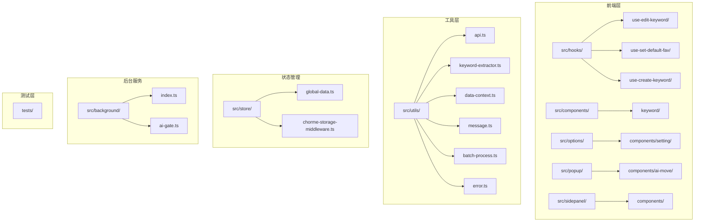
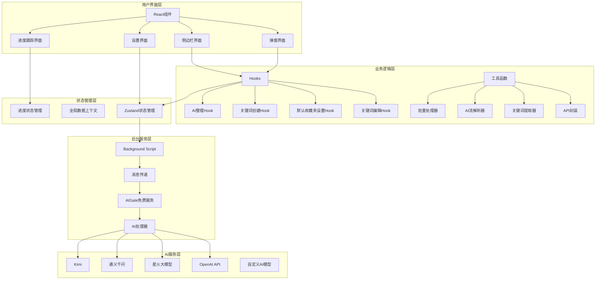
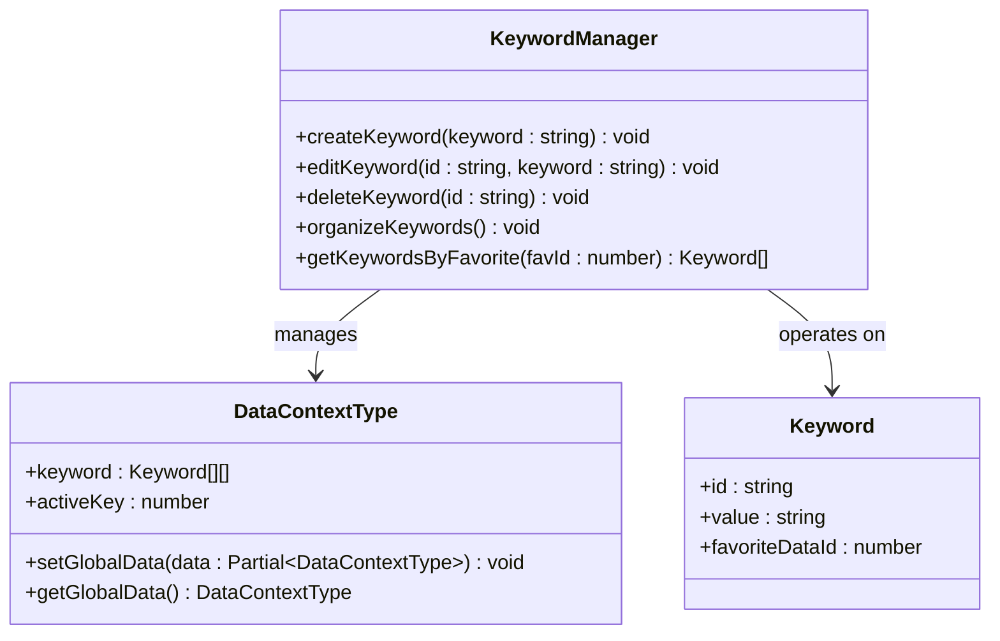
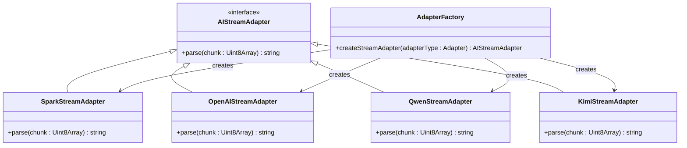
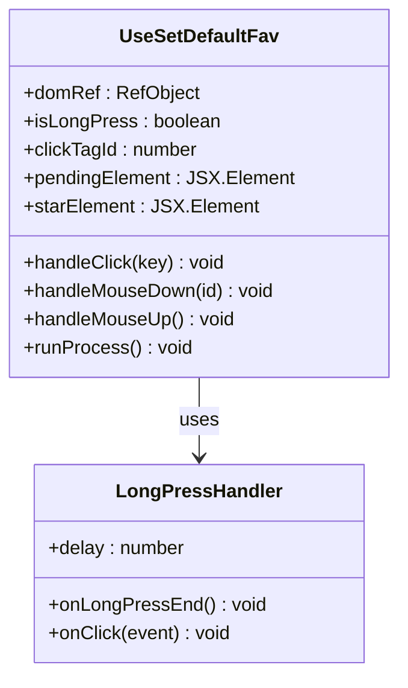
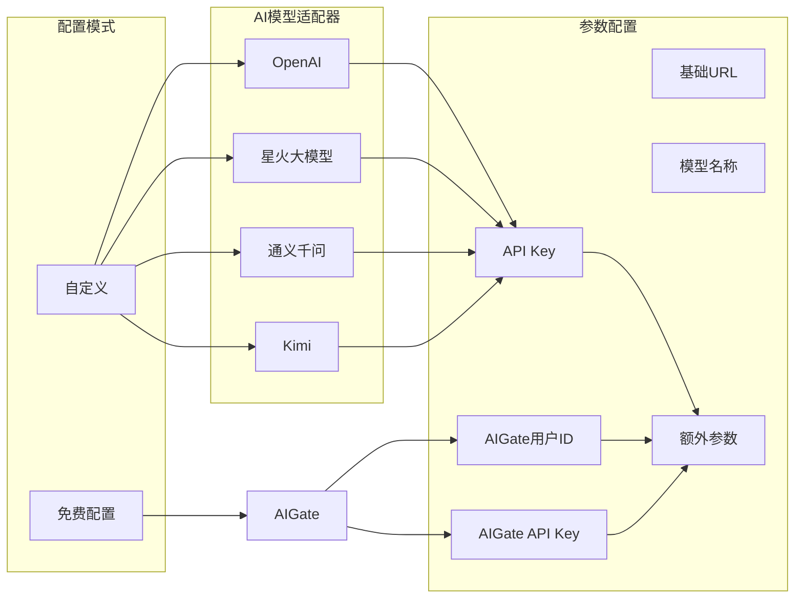
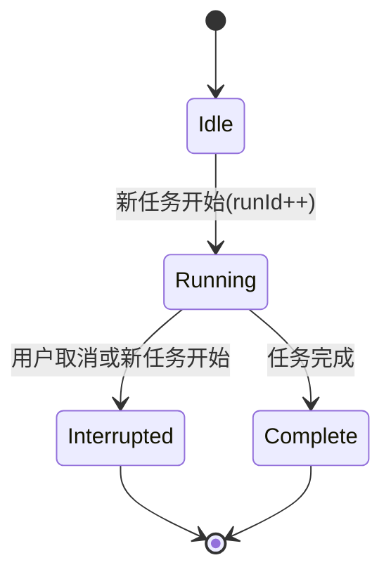
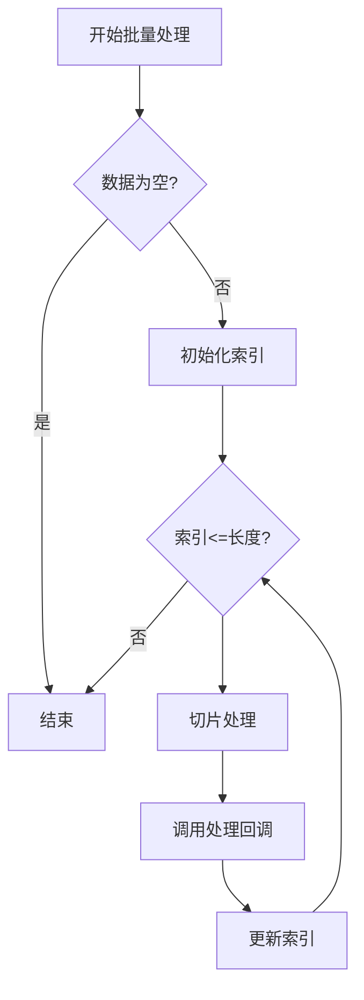
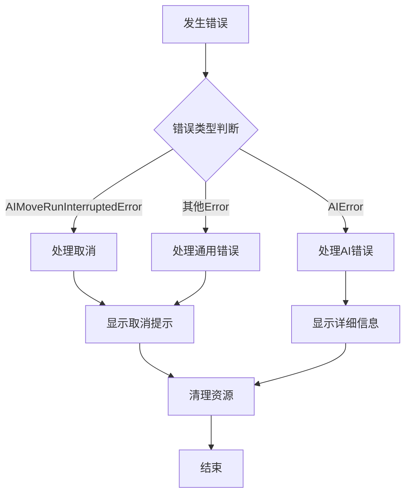
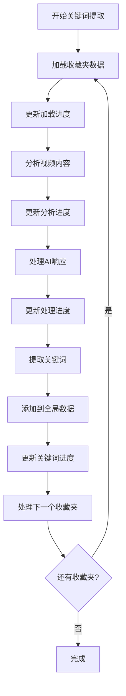

# AI关键词提取系统

<cite>
**本文档引用的文件**
- [use-create-keyword-by-ai/ai-stream-parser.ts](file://src/hooks/use-create-keyword-by-ai/ai-stream-parser.ts)
- [use-create-keyword/index.tsx](file://src/hooks/use-create-keyword/index.tsx)
- [keyword-extractor.ts](file://src/utils/keyword-extractor.ts)
- [api.ts](file://src/utils/api.ts)
- [background/index.ts](file://src/background/index.ts)
- [global-data.ts](file://src/store/global-data.ts)
- [data-context.ts](file://src/utils/data-context.ts)
- [setting/index.tsx](file://src/options/components/setting/index.tsx)
- [types.ts](file://src/options/components/setting/types.ts)
- [util.ts](file://src/options/components/setting/util.ts)
- [keyword/index.tsx](file://src/components/keyword/index.tsx)
- [use-edit-keyword/index.tsx](file://src/hooks/use-edit-keyword/index.tsx)
- [use-set-default-fav/index.tsx](file://src/hooks/use-set-default-fav/index.tsx)
- [message.ts](file://src/utils/message.ts)
- [free-quota-panel.tsx](file://src/options/components/setting/components/free-quota-panel.tsx)
- [config-mode-selector.tsx](file://src/options/components/setting/components/config-mode-selector.tsx)
- [quota-card.tsx](file://src/options/components/setting/components/quota-card.tsx)
- [ai-stream-parser.test.ts](file://tests/ai-stream-parser.test.ts)
- [ai-stream-adapter.test.ts](file://tests/ai-stream-adapter.test.ts)
- [ai-stream-connect.test.ts](file://tests/ai-stream-connect.test.ts)
- [package.json](file://package.json)
- [README.md](file://README.md)
- [use-ai-move.tsx](file://src/popup/components/ai-move/use-ai-move.tsx)
- [batch-process.ts](file://src/utils/batch-process.ts)
- [error.ts](file://src/utils/error.ts)
</cite>

## 更新摘要
**变更内容**
- 新增AI工作流运行隔离机制，防止并发组织任务相互干扰
- 实现完善的错误处理和取消逻辑，提升系统稳定性
- 增强批量处理能力，支持大规模数据的高效处理
- 改进AI流解析器的调试日志和状态监控
- 优化进度跟踪和实时反馈机制

## 目录
1. [简介](#简介)
2. [项目结构](#项目结构)
3. [核心组件](#核心组件)
4. [架构概览](#架构概览)
5. [详细组件分析](#详细组件分析)
6. [AI工作流运行隔离机制](#ai工作流运行隔离机制)
7. [批量处理优化](#批量处理优化)
8. [错误处理与取消逻辑](#错误处理与取消逻辑)
9. [依赖关系分析](#依赖关系分析)
10. [性能考虑](#性能考虑)
11. [故障排除指南](#故障排除指南)
12. [结论](#结论)
13. [附录](#附录)

## 简介

AI关键词提取系统是一个基于Chrome扩展的智能工具，专门用于帮助用户高效管理和分析Bilibili收藏夹内容。该系统的核心功能包括：

- **智能关键词管理**：支持关键词的创建、编辑、删除和组织管理
- **本地TF-IDF算法**：提供离线关键词提取能力
- **基础关键词编辑**：提供可视化的关键词编辑界面
- **配置管理模式**：支持自定义配置和免费额度配置
- **多AI模型适配**：支持OpenAI、星火、通义千问、Kimi等多种AI模型
- **AI工作流隔离**：确保并发任务互不干扰，提升系统稳定性

**重要更新**：系统已实现完整的AI工作流运行隔离机制，通过任务世代控制和取消信号机制，有效防止并发组织任务相互干扰。同时增强了错误处理和取消逻辑，提供更稳定的用户体验。

系统采用模块化设计，通过Chrome扩展的消息传递机制实现前后端分离，确保良好的用户体验和性能表现。

## 项目结构

该项目采用React + TypeScript + Vite构建的Chrome扩展应用，主要目录结构如下：


```mermaid
graph TB
subgraph "前端层"
A[src/hooks/] --> A2[use-edit-keyword/]
A --> A3[use-set-default-fav/]
A --> A4[use-create-keyword/]
B[src/components/] --> B1[keyword/]
C[src/options/] --> C1[components/setting/]
D[src/popup/] --> D1[components/ai-move/]
E[src/sidepanel/] --> E1[components/]
end
subgraph "工具层"
F[src/utils/] --> F1[api.ts]
F --> F2[keyword-extractor.ts]
F --> F3[data-context.ts]
F --> F4[message.ts]
F --> F5[batch-process.ts]
F --> F6[error.ts]
end
subgraph "状态管理"
G[src/store/] --> G1[global-data.ts]
G --> G2[chorme-storage-middleware.ts]
end
subgraph "后台服务"
H[src/background/] --> H1[index.ts]
H --> H2[ai-gate.ts]
end
subgraph "测试层"
I[tests/]
end
```

**图表来源**
- [package.json:1-91](file://package.json#L1-L91)
- [README.md:1-188](file://README.md#L1-L188)

**章节来源**
- [package.json:1-91](file://package.json#L1-L91)
- [README.md:1-188](file://README.md#L1-L188)

## 核心组件

### 关键词管理组件

关键词管理组件提供了完整的关键词生命周期管理：

- **关键词创建**：支持通过本地TF-IDF算法自动提取和手动输入两种方式
- **关键词编辑**：提供可视化的关键词编辑界面
- **关键词删除**：支持单个和批量删除操作
- **关键词组织**：按收藏夹进行关键词分类管理

### TF-IDF算法组件

本地TF-IDF算法组件提供了离线关键词提取能力：

- **中文分词**：支持中文文本的智能分词处理
- **停用词过滤**：内置常用停用词列表，提高关键词质量
- **权重计算**：基于TF-IDF算法计算关键词重要性
- **结果排序**：按权重对关键词进行排序和筛选

### 关键词编辑组件

关键词编辑组件提供了直观的操作体验：

- **可视化标签**：以标签形式展示现有关键词
- **键盘快捷键**：支持Enter创建、Backspace删除
- **实时更新**：关键词变更立即反映到UI
- **防重复机制**：自动检测并防止重复关键词

### AI模型适配器组件

AI模型适配器组件支持多种AI服务商的流式响应解析：

- **星火大模型适配器**：支持讯飞星火大模型的SSE流解析
- **OpenAI适配器**：支持OpenAI兼容模型的流式响应解析
- **通义千问适配器**：支持通义千问模型的流式响应解析
- **Kimi适配器**：支持Kimi模型的流式响应解析
- **自定义适配器**：支持用户自定义AI模型的适配

**章节来源**
- [keyword-extractor.ts:1-197](file://src/utils/keyword-extractor.ts#L1-L197)
- [use-edit-keyword/index.tsx:1-113](file://src/hooks/use-edit-keyword/index.tsx#L1-L113)
- [use-set-default-fav/index.tsx:1-126](file://src/hooks/use-set-default-fav/index.tsx#L1-L126)

## 架构概览

系统采用分层架构设计，通过Chrome扩展的消息传递机制实现前后端分离：


```mermaid
graph TB
subgraph "用户界面层"
UI[React组件] --> Popup[弹窗界面]
UI --> SidePanel[侧边栏界面]
UI --> Options[设置界面]
UI --> Progress[进度跟踪界面]
end
subgraph "业务逻辑层"
Hook[Hooks] --> EditKeyword[关键词编辑Hook]
Hook --> SetDefaultFav[默认收藏夹设置Hook]
Hook --> CreateKeyword[关键词创建Hook]
Hook --> AIMove[AI整理Hook]
Utils[工具函数] --> API[API封装]
Utils --> Extractor[关键词提取器]
Utils --> StreamParser[AI流解析器]
Utils --> BatchProcess[批量处理器]
end
subgraph "状态管理层"
Store[Zustand状态管理]
GlobalData[全局数据上下文]
ProgressState[进度状态管理]
end
subgraph "后台服务层"
Background[Background Script]
Message[消息传递]
AIGate[AIGate免费服务]
AIProcessor[AI处理器]
end
subgraph "AI服务层"
OpenAI[OpenAI API]
Spark[星火大模型]
Qwen[通义千问]
Kimi[Kimi]
Custom[自定义AI模型]
end
Popup --> Hook
SidePanel --> Hook
Options --> Store
Progress --> ProgressState
Hook --> Store
Store --> Background
Background --> Message
Message --> AIGate
AIGate --> AIProcessor
AIProcessor --> OpenAI
AIProcessor --> Spark
AIProcessor --> Qwen
AIProcessor --> Kimi
```

**图表来源**
- [background/index.ts:1-185](file://src/background/index.ts#L1-L185)
- [api.ts:1-523](file://src/utils/api.ts#L1-L523)
- [global-data.ts:1-28](file://src/store/global-data.ts#L1-L28)

## 详细组件分析

### TF-IDF算法应用

系统提供了完整的TF-IDF算法实现，用于本地关键词提取：

```mermaid
flowchart TD
Input[输入标题列表] --> Tokenize[中文分词]
Tokenize --> Clean[清理标点符号]
Clean --> ExtractPhrases[提取词组]
ExtractPhrases --> TF[计算词频(TF)]
TF --> IDF[计算逆文档频率(IDF)]
IDF --> Score[计算TF-IDF分数]
Score --> Filter[过滤停用词]
Filter --> Sort[按分数排序]
Sort --> Limit[限制关键词数量]
Limit --> Output[输出关键词结果]
```

**图表来源**
- [keyword-extractor.ts:137-187](file://src/utils/keyword-extractor.ts#L137-L187)

#### TF-IDF算法实现细节

系统采用以下策略优化TF-IDF算法：

- **中文分词优化**：支持2-4字中文词组的智能提取
- **停用词过滤**：内置丰富的中文停用词列表
- **动态阈值**：根据文档数量自动调整最小分数阈值
- **长度过滤**：支持最小关键词长度的配置

**章节来源**
- [keyword-extractor.ts:1-197](file://src/utils/keyword-extractor.ts#L1-L197)

### 关键词管理功能

关键词管理系统提供了完整的CRUD操作和组织管理：


```mermaid
classDiagram
class KeywordManager {
+createKeyword(keyword : string) void
+editKeyword(id : string, keyword : string) void
+deleteKeyword(id : string) void
+organizeKeywords() void
+getKeywordsByFavorite(favId : number) Keyword[]
}
class Keyword {
+id : string
+value : string
+favoriteDataId : number
}
class DataContextType {
+keyword : Keyword[][]
+activeKey : number
+setGlobalData(data : Partial~DataContextType~) void
+getGlobalData() DataContextType
}
KeywordManager --> DataContextType : manages
KeywordManager --> Keyword : operates on
```

**图表来源**
- [use-edit-keyword/index.tsx:52-102](file://src/hooks/use-edit-keyword/index.tsx#L52-L102)
- [data-context.ts:24-31](file://src/utils/data-context.ts#L24-L31)

#### 关键词编辑界面

关键词编辑界面提供了直观的操作体验：

- **可视化标签**：以标签形式展示现有关键词
- **键盘快捷键**：支持Enter创建、Backspace删除
- **实时更新**：关键词变更立即反映到UI
- **防重复机制**：自动检测并防止重复关键词

### AI模型适配器扩展

系统新增了Qwen和Kimi适配器支持，扩展了AI模型适配能力：


```mermaid
classDiagram
class AIStreamAdapter {
<<interface>>
+parse(chunk : Uint8Array) string
}
class SparkStreamAdapter {
+parse(chunk : Uint8Array) string
}
class OpenAIStreamAdapter {
+parse(chunk : Uint8Array) string
}
class QwenStreamAdapter {
+parse(chunk : Uint8Array) string
}
class KimiStreamAdapter {
+parse(chunk : Uint8Array) string
}
class AdapterFactory {
+createStreamAdapter(adapterType : Adapter) AIStreamAdapter
}
AIStreamAdapter <|-- SparkStreamAdapter
AIStreamAdapter <|-- OpenAIStreamAdapter
AIStreamAdapter <|-- QwenStreamAdapter
AIStreamAdapter <|-- KimiStreamAdapter
AdapterFactory --> SparkStreamAdapter : creates
AdapterFactory --> OpenAIStreamAdapter : creates
AdapterFactory --> QwenStreamAdapter : creates
AdapterFactory --> KimiStreamAdapter : creates
```

**图表来源**
- [ai-stream-parser.ts:30-97](file://src/hooks/use-create-keyword-by-ai/ai-stream-parser.ts#L30-L97)

#### 适配器类型支持

系统支持的适配器类型包括：

- **spark**：星火大模型适配器
- **openai**：OpenAI兼容模型适配器
- **custom**：自定义模型适配器
- **qianwen**：通义千问模型适配器
- **kimi**：Kimi模型适配器

#### AI模型选择界面

AI模型选择界面提供了直观的模型选择体验：

- **通义千问**：支持通义千问模型的关键词提取
- **Kimi**：支持Kimi模型的关键词提取
- **星火大模型**：支持讯飞星火大模型的关键词提取
- **OpenAI**：支持OpenAI兼容模型的关键词提取
- **自定义**：支持用户自定义AI模型的关键词提取

**章节来源**
- [ai-stream-parser.ts:1-282](file://src/hooks/use-create-keyword-by-ai/ai-stream-parser.ts#L1-L282)
- [util.ts:1-46](file://src/options/components/setting/util.ts#L1-L46)
- [types.ts:1-99](file://src/options/components/setting/types.ts#L1-L99)

### use-set-default-fav钩子bug修复

use-set-default-fav钩子是系统中重要的交互组件，经过修复后提升了系统稳定性：


```mermaid
classDiagram
class UseSetDefaultFav {
+domRef : RefObject
+isLongPress : boolean
+clickTagId : number
+pendingElement : JSX.Element
+starElement : JSX.Element
+handleClick(key) void
+handleMouseDown(id) void
+handleMouseUp() void
+runProcess() void
}
class LongPressHandler {
+delay : number
+onLongPressEnd() void
+onClick(event) void
}
UseSetDefaultFav --> LongPressHandler : uses
```

**图表来源**
- [use-set-default-fav/index.tsx:8-126](file://src/hooks/use-set-default-fav/index.tsx#L8-L126)

#### 修复的bug和改进

- **状态同步问题**：修复了clickTagId和clickTagIdRef之间的状态不同步问题
- **动画控制优化**：改进了长按动画的启动和停止逻辑
- **内存泄漏防护**：确保组件卸载时正确清理定时器和事件监听器
- **用户体验提升**：优化了长按触发的延迟和动画效果

**章节来源**
- [use-set-default-fav/index.tsx:1-126](file://src/hooks/use-set-default-fav/index.tsx#L1-L126)

### 配置管理功能

系统提供了灵活的配置管理机制：


```mermaid
graph LR
subgraph "配置模式"
Custom[自定义配置]
Free[免费配置]
end
subgraph "AI模型适配器"
OpenAI[OpenAI]
Spark[星火大模型]
Qwen[通义千问]
Kimi[Kimi]
Custom[自定义]
end
subgraph "参数配置"
APIKey[API Key]
BaseURL[基础URL]
Model[模型名称]
ExtraParams[额外参数]
AIGateUserId[AIGate用户ID]
AIGateApiKey[AIGate API Key]
end
Custom --> OpenAI
Custom --> Spark
Custom --> Qwen
Custom --> Kimi
Free --> AIGate
OpenAI --> APIKey
Spark --> APIKey
Qwen --> APIKey
Kimi --> APIKey
AIGate --> AIGateUserId
AIGate --> AIGateApiKey
APIKey --> ExtraParams
AIGateUserId --> ExtraParams
AIGateApiKey --> ExtraParams
```

**图表来源**
- [setting/index.tsx:40-65](file://src/options/components/setting/index.tsx#L40-L65)
- [types.ts:30-40](file://src/options/components/setting/types.ts#L30-L40)

#### 配置验证机制

系统实现了多层次的配置验证：

- **必填字段检查**：确保API Key、模型名称等关键字段
- **格式验证**：使用Zod进行表单数据的严格验证
- **适配器选择**：根据选择的AI模型自动填充默认参数
- **配额检查**：免费模式下提供实时配额查询功能

**章节来源**
- [setting/index.tsx:1-98](file://src/options/components/setting/index.tsx#L1-L98)
- [types.ts:41-99](file://src/options/components/setting/types.ts#L41-L99)
- [util.ts:18-22](file://src/options/components/setting/util.ts#L18-L22)

## AI工作流运行隔离机制

### 任务世代控制

系统实现了完整的AI工作流运行隔离机制，通过任务世代控制确保并发任务互不干扰：


```mermaid
stateDiagram-v2
[*] --> Idle
Idle --> Running : 新任务开始(runId++)
Running --> Interrupted : 用户取消或新任务开始
Running --> Complete : 任务完成
Interrupted --> [*]
Complete --> [*]
```

#### 核心隔离机制

系统通过以下机制实现任务隔离：

- **任务世代标识**：每个任务分配唯一的runId，确保任务独立性
- **取消信号控制**：使用AbortController实现优雅的任务取消
- **活动状态检查**：通过ensureRunActive函数检查任务是否仍然活跃
- **资源清理**：任务结束时正确释放所有相关资源

#### 运行时状态管理

```typescript
type RunState = {
  activeRunIdRef: React.RefObject<number> // 当前活跃任务ID
  abortControllerRef: React.RefObject<AbortController> // 取消控制器
  isProcessingRef: React.RefObject<boolean> // 处理状态
  streamRef: React.RefObject<{ cancel: () => void }> // 流引用
}
```

### 并发安全保证

系统确保多个AI整理任务可以安全地并发执行：

- **任务互斥**：同一时间只有一个任务处于活跃状态
- **状态隔离**：每个任务拥有独立的状态和缓冲区
- **错误隔离**：任务失败不会影响其他任务的正常执行
- **资源隔离**：网络请求、流处理等资源按任务隔离

**章节来源**
- [use-ai-move.tsx:33-152](file://src/popup/components/ai-move/use-ai-move.tsx#L33-L152)
- [use-ai-move.tsx:132-181](file://src/popup/components/ai-move/use-ai-move.tsx#L132-L181)

## 批量处理优化

### 分批处理机制

系统实现了高效的批量处理机制，支持大规模数据的安全处理：


```mermaid
flowchart TD
Start[开始批量处理] --> CheckEmpty{数据为空?}
CheckEmpty --> |是| End[结束]
CheckEmpty --> |否| Init[初始化索引]
Init --> Loop{索引<=长度?}
Loop --> |否| End
Loop --> Slice[切片处理]
Slice --> Process[调用处理回调]
Process --> UpdateIndex[更新索引]
UpdateIndex --> Loop
```

#### 批量处理特性

- **可配置批次大小**：支持自定义最大处理数量
- **串行执行保证**：确保批次的顺序执行
- **错误传播**：处理过程中的错误会正确传播
- **内存友好**：避免一次性加载大量数据

#### 使用示例

```typescript
await batchProcess(videos, {
  maxSize: 1000,
  async processCallback(batchVideos) {
    // 处理单个批次的视频
    const stream = await fetchAIMove(batchVideos, ...)
    // 处理流式响应
  }
})
```

**章节来源**
- [batch-process.ts:1-24](file://src/utils/batch-process.ts#L1-L24)
- [use-ai-move.tsx:254-358](file://src/popup/components/ai-move/use-ai-move.tsx#L254-L358)

## 错误处理与取消逻辑

### 错误处理机制

系统实现了完善的错误处理机制，确保异常情况的优雅处理：


```mermaid
flowchart TD
Error[发生错误] --> CheckType{错误类型判断}
CheckType --> |AIMoveRunInterruptedError| HandleCancel[处理取消]
CheckType --> |AIError| HandleAI[处理AI错误]
CheckType --> |其他Error| HandleGeneral[处理通用错误]
HandleCancel --> ShowToast[显示取消提示]
HandleAI --> ShowDetail[显示详细信息]
HandleGeneral --> ShowToast
ShowToast --> Cleanup[清理资源]
ShowDetail --> Cleanup
Cleanup --> End[结束]
```

#### 自定义错误类型

系统定义了专门的错误类型来处理不同的异常情况：

- **AIMoveRunInterruptedError**：专门处理任务中断情况
- **AIError**：处理AI相关的错误，包含详细信息
- **标准Error**：处理其他类型的错误

#### 取消逻辑实现

```typescript
const cancelMove = useMemoizedFn(() => {
  activeRunIdRef.current += 1 // 增加任务世代
  isProcessingRef.current = false
  abortControllerRef.current?.abort() // 触发取消信号
  abortControllerRef.current = null
  // 取消后台中的AI请求
  if (streamRef.current) {
    streamRef.current.cancel()
    streamRef.current = null
  }
  setIsProcessing(false)
  setIsLoading(false)
  toast({
    title: '已取消',
    description: '操作已取消',
  })
})
```

### 资源清理机制

系统确保在所有情况下都能正确清理资源：

- **finally块清理**：确保无论成功还是失败都执行清理逻辑
- **条件清理**：只在特定条件下清理资源，避免误清理
- **引用重置**：将不再使用的引用设置为null，防止内存泄漏

**章节来源**
- [use-ai-move.tsx:387-441](file://src/popup/components/ai-move/use-ai-move.tsx#L387-L441)
- [error.ts:1-12](file://src/utils/error.ts#L1-L12)

### 关键词提取流程优化

关键词提取流程现在提供更详细的处理状态：


```mermaid
flowchart TD
Start[开始关键词提取] --> Load[加载收藏夹数据]
Load --> Progress1[更新加载进度]
Progress1 --> Analyze[分析视频内容]
Analyze --> Progress2[更新分析进度]
Progress2 --> Process[处理AI响应]
Process --> Progress3[更新处理进度]
Progress3 --> Extract[提取关键词]
Extract --> Add[添加到全局数据]
Add --> Progress4[更新关键词进度]
Progress4 --> Next[处理下一个收藏夹]
Next --> Done{还有收藏夹?}
Done --> |是| Load
Done --> |否| Complete[完成]
```

#### 实时反馈机制

系统实现了多层次的实时反馈：

- **收藏夹级别反馈**：显示当前处理的收藏夹和总数量
- **视频级别反馈**：提供视频加载和处理的详细信息
- **关键词级别反馈**：实时显示新提取的关键词
- **阶段转换反馈**：明确标识处理阶段的变化

**章节来源**
- [use-create-keyword/index.tsx:66-107](file://src/hooks/use-create-keyword/index.tsx#L66-L107)
- [use-create-keyword/index.tsx:157-226](file://src/hooks/use-create-keyword/index.tsx#L157-L226)

## 依赖关系分析

系统采用模块化设计，各组件之间的依赖关系清晰明确：

```mermaid
graph TB
subgraph "核心依赖"
React[React 19.0.0]
Zustand[Zustand 5.0.6]
OpenAI[OpenAI 6.22.0]
UUID[UUID 11.0.3]
AIGate[AIGate SDK]
Ahooks[Ahooks]
Vitest[Vitest]
end
subgraph "UI组件库"
RadixUI[Radix UI]
TailwindCSS[Tailwind CSS]
Lucide[Lucide React]
end
subgraph "开发工具"
Vite[Vite 6.0.6]
TypeScript[TypeScript 5.7.2]
end
subgraph "Chrome扩展"
ChromeTypes[@types/chrome]
CRXJS[CRXJS Vite Plugin]
end
React --> Zustand
React --> OpenAI
React --> UUID
React --> AIGate
React --> Ahooks
UI --> RadixUI
UI --> TailwindCSS
UI --> Lucide
Dev --> Vite
Dev --> TypeScript
Dev --> Vitest
Extension --> ChromeTypes
Extension --> CRXJS
```

**图表来源**
- [package.json:29-58](file://package.json#L29-L58)
- [package.json:59-89](file://package.json#L59-L89)

### 关键依赖说明

- **React 19.0.0**：提供现代化的组件开发体验
- **Zustand 5.0.6**：轻量级状态管理解决方案
- **OpenAI 6.22.0**：官方OpenAI SDK，支持流式响应
- **AIGate SDK**：新增的免费AI服务SDK
- **Ahooks**：新增的React Hooks工具库，提供useMemoizedFn等实用Hook
- **Radix UI**：高质量的无障碍UI组件库
- **Tailwind CSS**：实用优先的CSS框架

**章节来源**
- [package.json:1-91](file://package.json#L1-L91)

## 性能考虑

系统在设计时充分考虑了性能优化：

### 缓存策略

- **数据缓存**：收藏夹数据缓存24小时，减少重复请求
- **状态持久化**：使用Chrome Storage实现状态持久化
- **索引数据库**：利用IndexedDB存储大量收藏夹数据
- **配额缓存**：AIGate配额信息缓存，减少频繁检查

### 内存管理

- **垃圾回收**：及时释放不再使用的数据引用
- **流式读取**：使用流式API避免大文件内存占用
- **组件卸载**：确保组件卸载时清理相关资源
- **长按处理**：优化use-set-default-fav钩子的内存使用
- **缓冲区管理**：AI流解析器中的缓冲区内容及时清理

### AI适配器优化

- **适配器复用**：同一适配器实例可在多次请求中复用
- **流式解析**：实时解析AI响应，避免内存累积
- **错误恢复**：适配器解析失败时自动降级处理
- **调试日志优化**：仅在开发环境启用详细日志，生产环境禁用

### 进度跟踪优化

- **状态更新节流**：避免过于频繁的状态更新
- **增量进度计算**：只计算必要的进度变化
- **内存友好的缓冲区**：及时清理已处理的数据
- **异步处理**：使用Promise和async/await避免阻塞主线程

### 批量处理优化

- **分批处理**：避免一次性处理大量数据导致内存溢出
- **串行执行**：确保批次的顺序执行，避免并发冲突
- **错误隔离**：单个批次失败不影响其他批次的处理
- **资源释放**：及时处理完的批次数据，释放内存

## 故障排除指南

### 常见问题及解决方案

#### 关键词管理问题

**问题**：关键词无法保存或删除
**解决方案**：
1. 检查浏览器存储权限
2. 确认关键词格式符合要求
3. 验证收藏夹ID有效性
4. 重启浏览器扩展

#### 关键词编辑问题

**问题**：关键词编辑功能异常
**解决方案**：
1. 检查键盘事件绑定是否正常
2. 验证标签渲染和删除逻辑
3. 确认组件状态同步
4. 查看控制台是否有相关错误

#### AI模型适配器问题

**问题**：AI模型适配器解析失败
**解决方案**：
1. 检查AI模型响应格式是否符合预期
2. 验证适配器类型选择是否正确
3. 确认AI模型API配置是否正确
4. 查看控制台是否有解析错误信息
5. 检查调试日志以获取更多信息

#### 进度跟踪问题

**问题**：进度跟踪显示异常
**解决方案**：
1. 检查进度状态数据结构是否正确
2. 验证进度更新逻辑是否正常执行
3. 确认UI组件是否正确订阅进度状态
4. 查看控制台是否有进度相关的错误信息

#### use-set-default-fav钩子问题

**问题**：默认收藏夹设置功能异常
**解决方案**：
1. 检查长按触发是否正常
2. 验证动画效果和状态同步
3. 确认组件卸载时的资源清理
4. 查看控制台是否有相关错误

#### AI工作流问题

**问题**：AI整理任务无法正常完成
**解决方案**：
1. 检查任务隔离机制是否正常工作
2. 验证取消逻辑是否正确执行
3. 确认错误处理是否捕获所有异常情况
4. 查看控制台是否有AIMoveRunInterruptedError相关错误
5. 检查批量处理是否正确执行

#### 性能问题

**问题**：系统运行缓慢
**解决方案**：
1. 清理浏览器缓存
2. 检查扩展权限设置
3. 减少同时进行的AI请求
4. 升级到更高性能的设备
5. 检查AI流解析器的内存使用情况
6. 优化批量处理的大小设置

**章节来源**
- [background/index.ts:105-185](file://src/background/index.ts#L105-L185)
- [api.ts:182-240](file://src/utils/api.ts#L182-L240)
- [use-create-keyword/index.tsx:364-391](file://src/hooks/use-create-keyword/index.tsx#L364-L391)

## 结论

AI关键词提取系统是一个功能完整、架构清晰的Chrome扩展应用。系统的主要优势包括：

- **模块化设计**：各组件职责明确，便于维护和扩展
- **本地算法**：提供离线关键词提取能力，保护用户隐私
- **多AI模型支持**：新增Qwen和Kimi适配器，扩展AI模型选择范围
- **稳定可靠**：经过bug修复和优化，系统更加稳定
- **完整配置**：支持灵活的配置管理，适应不同使用场景
- **AI工作流隔离**：实现了完整的任务隔离机制，防止并发任务干扰
- **完善错误处理**：提供全面的错误处理和取消逻辑
- **批量处理优化**：支持大规模数据的高效处理
- **实时反馈**：通过调试日志和状态监控提供更好的问题诊断能力
- **简洁高效**：保持原有功能的同时，增强了AI模型适配能力和任务管理能力

系统通过合理的架构设计和优化策略，在保证功能完整性的同时，确保了良好的性能表现和用户体验。新增的AI工作流运行隔离机制显著提升了系统的稳定性和可靠性，使多个AI整理任务可以安全地并发执行而不会相互干扰。

## 附录

### 使用示例

#### 基本使用流程

1. **配置AI参数**：在设置页面配置API Key和模型参数
2. **选择AI模型**：在AI模型选择界面选择合适的AI模型
3. **选择收藏夹**：在关键词管理页面选择目标收藏夹
4. **触发AI提取**：点击"AI提取关键词"按钮开始处理
5. **监控进度**：通过进度跟踪界面查看处理状态
6. **编辑关键词**：在关键词列表中进行编辑和优化
7. **应用关键词**：将关键词应用到收藏夹整理规则中

#### 高级配置

- **自定义参数**：通过extraParams传递模型特定参数
- **适配器选择**：根据AI模型选择合适的解析适配器
- **配额管理**：监控和管理免费配额使用情况
- **批量操作**：支持对多个收藏夹进行批量关键词提取
- **免费额度**：优先使用AIGate免费额度，降低成本
- **进度监控**：实时查看处理进度和状态信息

### 最佳实践

- **定期清理**：定期清理无效和重复的关键词
- **合理配置**：根据使用场景调整模型参数和阈值
- **备份数据**：定期备份关键词配置和历史数据
- **监控性能**：关注系统性能指标，及时发现和解决问题
- **利用免费服务**：优先使用AIGate免费额度，减少成本
- **保持更新**：及时更新系统版本，享受最新功能和修复
- **适配器选择**：根据具体需求选择最适合的AI模型适配器
- **进度跟踪**：充分利用进度跟踪功能，更好地管理长时间任务
- **调试日志**：在开发环境中充分利用调试日志进行问题诊断
- **任务隔离**：利用新的任务隔离机制，确保并发任务的安全性
- **批量优化**：合理设置批量处理大小，平衡性能和内存使用