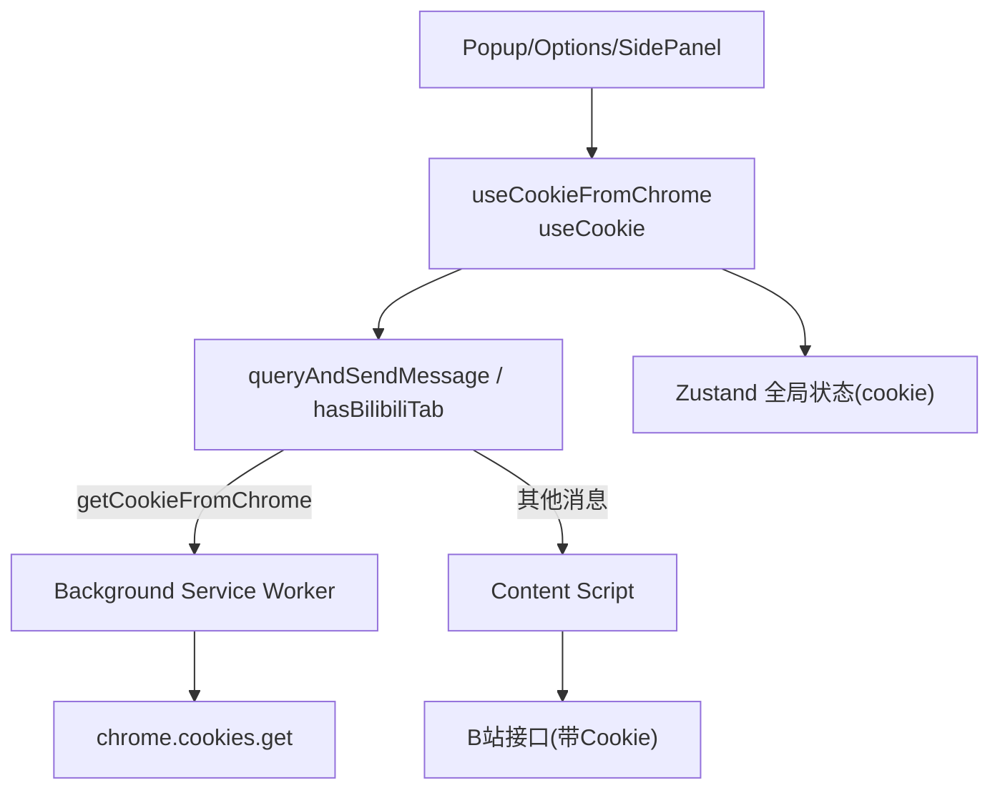
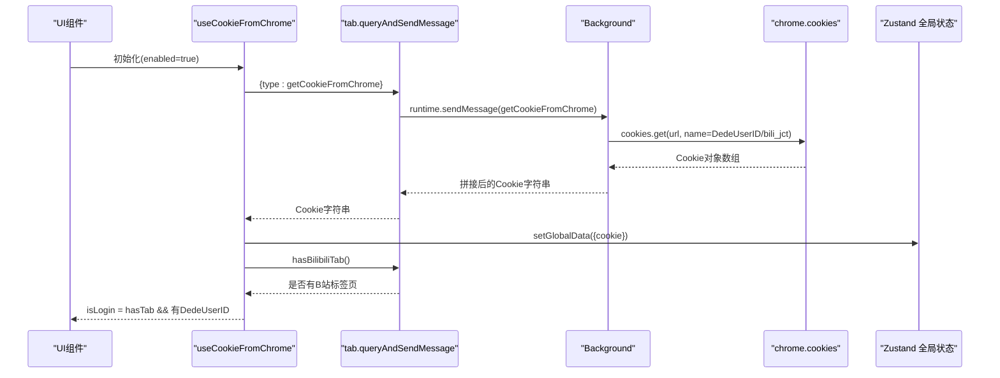
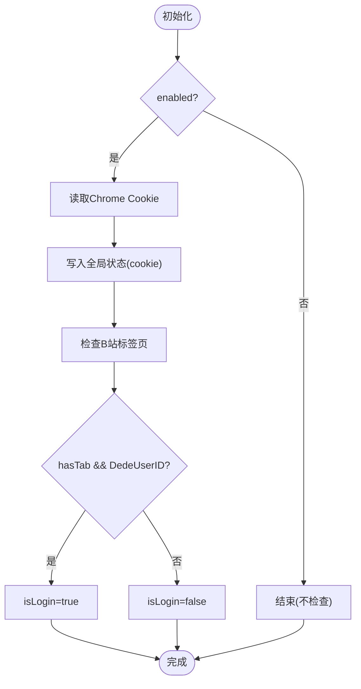
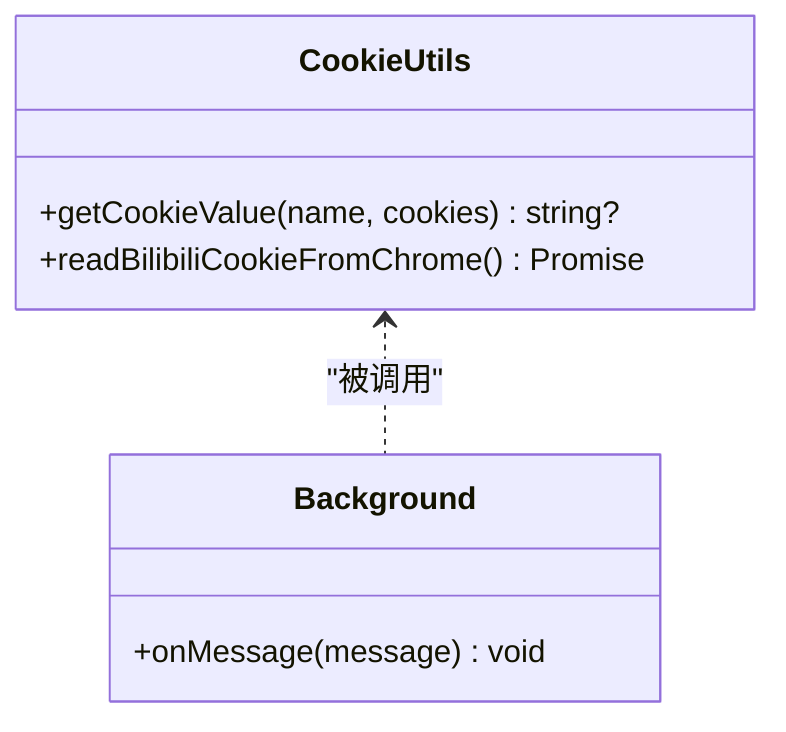
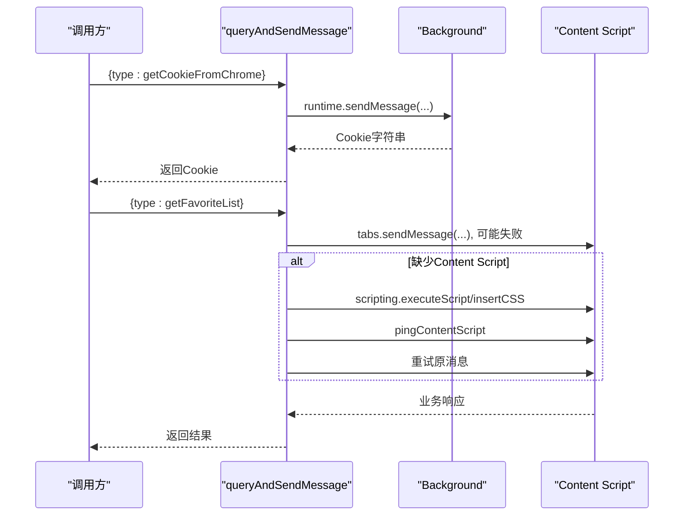
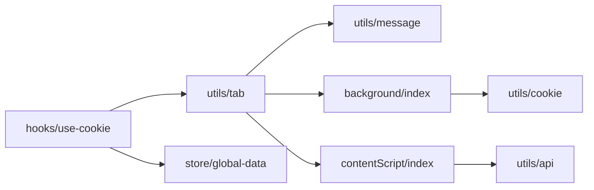

# Chrome Cookie认证系统

<cite>
**本文引用的文件**
- [src/hooks/use-cookie/index.ts](file://src/hooks/use-cookie/index.ts)
- [src/utils/cookie.ts](file://src/utils/cookie.ts)
- [src/utils/tab.ts](file://src/utils/tab.ts)
- [src/utils/message.ts](file://src/utils/message.ts)
- [src/background/index.ts](file://src/background/index.ts)
- [src/contentScript/index.ts](file://src/contentScript/index.ts)
- [src/popup/components/login-check/index.tsx](file://src/popup/components/login-check/index.tsx)
- [src/store/global-data.ts](file://src/store/global-data.ts)
- [src/utils/api.ts](file://src/utils/api.ts)
- [src/manifest.ts](file://src/manifest.ts)
- [tests/chrome-cookie-routing.test.ts](file://tests/chrome-cookie-routing.test.ts)
- [tests/use-cookie-from-chrome.test.tsx](file://tests/use-cookie-from-chrome.test.tsx)
</cite>

## 目录
1. [简介](#简介)
2. [项目结构](#项目结构)
3. [核心组件](#核心组件)
4. [架构总览](#架构总览)
5. [详细组件分析](#详细组件分析)
6. [依赖关系分析](#依赖关系分析)
7. [性能与可靠性](#性能与可靠性)
8. [故障排查指南](#故障排查指南)
9. [结论](#结论)

## 简介
本仓库实现了一个基于Chrome扩展的B站收藏夹增强工具，其中“Cookie认证系统”负责在Popup、Options、SidePanel等界面中安全地获取并维护B站登录态。系统通过两种路径获取Cookie：
- 通过Content Script从当前B站页面读取document.cookie（传统方式）
- 通过Background Service Worker调用chrome.cookies API直接读取必要Cookie（更稳定、不依赖页面脚本注入）

系统还包含自动检测B站标签页、缺失Content Script时自动注入并重试、以及将Cookie同步到全局状态供后续API调用使用。

## 项目结构
围绕Cookie认证的关键模块分布如下：
- hooks层：提供React Hook封装Cookie获取与登录态判断
- utils层：Cookie解析、消息路由、标签页通信
- background：后台服务处理chrome.cookies读取
- contentScript：内容脚本响应消息并转发业务请求
- store：Zustand全局状态持久化Cookie
- manifest：声明权限与脚本注入策略

图表来源
- [src/hooks/use-cookie/index.ts:40-96](file://src/hooks/use-cookie/index.ts#L40-L96)
- [src/utils/tab.ts:189-210](file://src/utils/tab.ts#L189-L210)
- [src/background/index.ts:33-42](file://src/background/index.ts#L33-L42)
- [src/utils/cookie.ts:15-29](file://src/utils/cookie.ts#L15-L29)
- [src/contentScript/index.ts:63-83](file://src/contentScript/index.ts#L63-L83)
- [src/store/global-data.ts:7-39](file://src/store/global-data.ts#L7-L39)

章节来源
- [src/manifest.ts:27-40](file://src/manifest.ts#L27-L40)

## 核心组件
- useCookieFromChrome：在Popup/Options等环境中，优先通过Background读取Chrome Cookie，并检查是否存在B站标签页；结果写入全局状态，暴露isLogin/isChecking/hasBilibiliTab/refreshCookie
- useCookie：兼容旧流程，通过Content Script读取document.cookie并判断登录态
- cookie工具：解析Cookie字符串、通过chrome.cookies.get读取DedeUserID与bili_jct
- tab工具：统一消息路由，区分getCookieFromChrome走Background，其余走Content Script；支持自动注入Content Script并重试
- Background：监听getCookieFromChrome消息，调用chrome.cookies.get并返回拼接后的Cookie串
- Content Script：响应getCookie消息返回document.cookie，并处理收藏相关API调用
- Zustand全局状态：持久化cookie字段，供UI与API层共享

章节来源
- [src/hooks/use-cookie/index.ts:8-98](file://src/hooks/use-cookie/index.ts#L8-L98)
- [src/utils/cookie.ts:1-31](file://src/utils/cookie.ts#L1-L31)
- [src/utils/tab.ts:189-210](file://src/utils/tab.ts#L189-L210)
- [src/background/index.ts:33-42](file://src/background/index.ts#L33-L42)
- [src/contentScript/index.ts:63-83](file://src/contentScript/index.ts#L63-L83)
- [src/store/global-data.ts:7-39](file://src/store/global-data.ts#L7-L39)

## 架构总览
下图展示了Cookie认证的核心数据流与控制流：

图表来源
- [src/hooks/use-cookie/index.ts:47-95](file://src/hooks/use-cookie/index.ts#L47-L95)
- [src/utils/tab.ts:189-210](file://src/utils/tab.ts#L189-L210)
- [src/background/index.ts:33-42](file://src/background/index.ts#L33-L42)
- [src/utils/cookie.ts:15-29](file://src/utils/cookie.ts#L15-L29)
- [src/store/global-data.ts:7-39](file://src/store/global-data.ts#L7-L39)

## 详细组件分析

### 组件A：useCookieFromChrome（Chrome Cookie直读模式）
- 功能要点
  - 启用时通过Background读取DedeUserID与bili_jct，并写入全局状态
  - 同时检查是否存在B站标签页
  - 登录判定：存在B站标签页且Cookie中包含DedeUserID
  - 暴露刷新方法refreshCookie用于手动重试
- 错误处理
  - 读取失败或无Cookie时清空全局状态
  - 检查标签页失败时降级为未登录
- 性能考虑
  - 使用useMemoizedFn避免重复创建函数
  - 异步操作设置isChecking状态，避免UI闪烁

图表来源
- [src/hooks/use-cookie/index.ts:40-96](file://src/hooks/use-cookie/index.ts#L40-L96)

章节来源
- [src/hooks/use-cookie/index.ts:40-96](file://src/hooks/use-cookie/index.ts#L40-L96)
- [tests/use-cookie-from-chrome.test.tsx:43-90](file://tests/use-cookie-from-chrome.test.tsx#L43-L90)

### 组件B：useCookie（Content Script Cookie模式）
- 功能要点
  - Popup模式下向Content Script发送getCookie消息，获取document.cookie
  - 非Popup模式直接使用全局状态中的cookie
  - 根据DedeUserID判断是否已登录
- 适用场景
  - 兼容旧流程或在某些环境下无法使用chrome.cookies权限时使用

章节来源
- [src/hooks/use-cookie/index.ts:8-38](file://src/hooks/use-cookie/index.ts#L8-L38)
- [src/contentScript/index.ts:79-83](file://src/contentScript/index.ts#L79-L83)

### 组件C：Cookie工具与Background读取
- 工具函数
  - getCookieValue：从Cookie字符串解析指定键值
  - readBilibiliCookieFromChrome：仅读取DedeUserID与bili_jct两个必要Cookie，并拼接为标准格式
- Background处理
  - 监听getCookieFromChrome消息，调用readBilibiliCookieFromChrome并返回结果
  - 异常时返回空字符串，保证调用方容错

图表来源
- [src/utils/cookie.ts:1-31](file://src/utils/cookie.ts#L1-L31)
- [src/background/index.ts:33-42](file://src/background/index.ts#L33-L42)

章节来源
- [src/utils/cookie.ts:1-31](file://src/utils/cookie.ts#L1-L31)
- [src/background/index.ts:33-42](file://src/background/index.ts#L33-L42)
- [tests/chrome-cookie-routing.test.ts:64-97](file://tests/chrome-cookie-routing.test.ts#L64-L97)

### 组件D：消息路由与Content Script注入
- 路由策略
  - getCookieFromChrome：通过runtime.sendMessage走Background
  - 其他消息：查询B站标签页并向第一个标签页发送消息
- 自动注入与重试
  - 若Content Script不存在导致连接失败，则通过scripting.executeScript/insertCSS注入并等待就绪后重试
- 超时控制
  - tabs.sendMessage与runtime.sendMessage均设置超时，避免阻塞

图表来源
- [src/utils/tab.ts:189-210](file://src/utils/tab.ts#L189-L210)
- [src/utils/tab.ts:151-181](file://src/utils/tab.ts#L151-L181)
- [src/contentScript/index.ts:63-83](file://src/contentScript/index.ts#L63-L83)

章节来源
- [src/utils/tab.ts:189-210](file://src/utils/tab.ts#L189-L210)
- [src/utils/tab.ts:151-181](file://src/utils/tab.ts#L151-L181)
- [tests/chrome-cookie-routing.test.ts:105-165](file://tests/chrome-cookie-routing.test.ts#L105-L165)

### 组件E：登录态展示与用户引导
- 当未检测到登录态时，显示友好提示，指导用户按顺序重启浏览器、打开B站登录、再打开插件
- 该组件依赖useCookieFromChrome提供的isChecking与isLogin状态

章节来源
- [src/popup/components/login-check/index.tsx:9-31](file://src/popup/components/login-check/index.tsx#L9-L31)

### 组件F：API层对Cookie的使用
- 写操作（移动、删除、恢复）需要校验Cookie中存在DedeUserID与bili_jct，否则抛出明确错误
- 读操作（列表、标签）通过Content Script转发，实际请求由页面环境发起，携带浏览器Cookie

章节来源
- [src/utils/api.ts:153-280](file://src/utils/api.ts#L153-L280)

## 依赖关系分析
- 权限声明
  - cookies、tabs、scripting、storage等权限在manifest中声明，确保Background可读取Cookie、可向标签页注入脚本
- 模块耦合
  - hooks依赖tab工具进行消息路由
  - tab工具依赖message枚举定义消息类型
  - background依赖cookie工具读取必要Cookie
  - contentScript依赖api工具执行业务逻辑
  - 全局状态集中管理cookie，供多模块共享

图表来源
- [src/manifest.ts:27-40](file://src/manifest.ts#L27-L40)
- [src/utils/message.ts:1-23](file://src/utils/message.ts#L1-L23)
- [src/utils/tab.ts:189-210](file://src/utils/tab.ts#L189-L210)
- [src/background/index.ts:33-42](file://src/background/index.ts#L33-L42)
- [src/contentScript/index.ts:63-83](file://src/contentScript/index.ts#L63-L83)
- [src/utils/api.ts:153-280](file://src/utils/api.ts#L153-L280)
- [src/store/global-data.ts:7-39](file://src/store/global-data.ts#L7-L39)

章节来源
- [src/manifest.ts:27-40](file://src/manifest.ts#L27-L40)
- [src/utils/message.ts:1-23](file://src/utils/message.ts#L1-L23)

## 性能与可靠性
- 最小化Cookie读取范围：仅读取DedeUserID与bili_jct，减少不必要的数据传输与权限影响
- 超时保护：所有跨进程通信均设置超时，避免长时间阻塞
- 自动注入与重试：缺失Content Script时自动注入并等待就绪，提升鲁棒性
- 状态同步：Cookie变更立即反映到全局状态，避免UI与逻辑不一致
- 防抖与节流：背景任务（如WebDAV同步）采用防抖，避免频繁触发

[本节为通用性能建议，不直接分析具体代码]

## 故障排查指南
- 现象：Popup显示“未登录”，但B站已登录
  - 检查是否存在B站标签页：hasBilibiliTab返回false会导致未登录
  - 检查Background是否正确读取Cookie：确认chrome.cookies权限与域名匹配
  - 检查Content Script是否注入成功：查看控制台错误或重试日志
- 现象：API调用失败，提示未获取到登录信息
  - 确认全局状态中cookie字段是否已填充
  - 确认Cookie中是否包含DedeUserID与bili_jct
- 现象：Content Script通信失败
  - 检查是否缺少Content Script，观察是否触发了自动注入
  - 检查标签页URL是否匹配bilibiliUrlPatterns
- 现象：长时间加载或卡住
  - 检查是否触发超时（tabs.sendMessage/runtime.sendMessage）
  - 检查网络与B站API可用性

章节来源
- [src/utils/tab.ts:52-90](file://src/utils/tab.ts#L52-L90)
- [src/utils/tab.ts:151-181](file://src/utils/tab.ts#L151-L181)
- [src/background/index.ts:33-42](file://src/background/index.ts#L33-L42)
- [src/utils/api.ts:171-280](file://src/utils/api.ts#L171-L280)

## 结论
本Cookie认证系统以“最小权限、最小数据”为原则，结合Background直读与Content Script兼容两种方式，确保在不同环境下都能稳定获取B站登录态。通过统一的消息路由、自动注入与重试机制，提升了用户体验与系统健壮性。配合全局状态管理与清晰的错误提示，便于定位与解决问题。建议在后续迭代中继续优化超时策略、增加更详细的诊断日志，并持续验证不同B站子域名的兼容性。