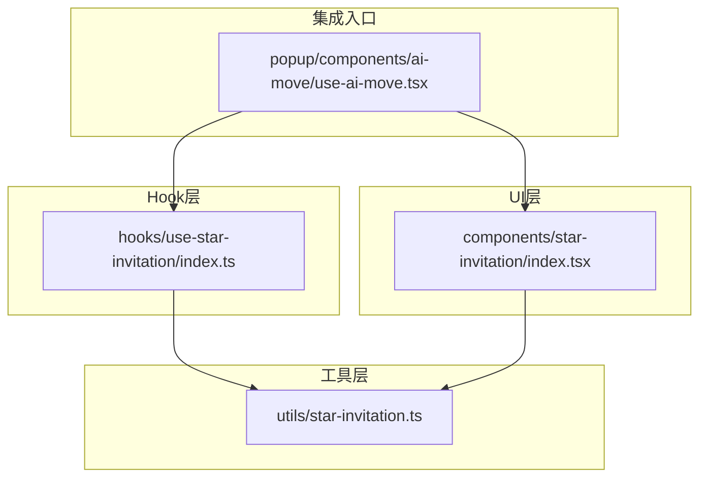
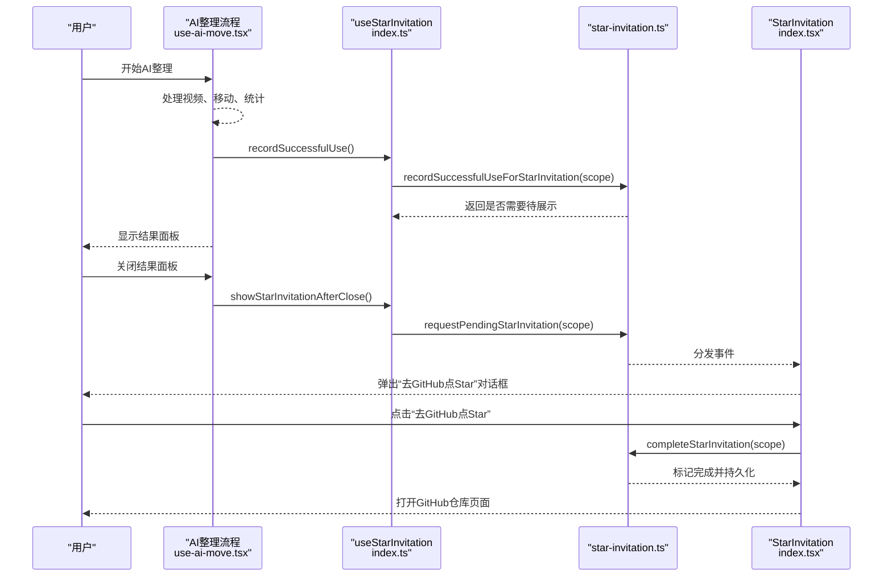
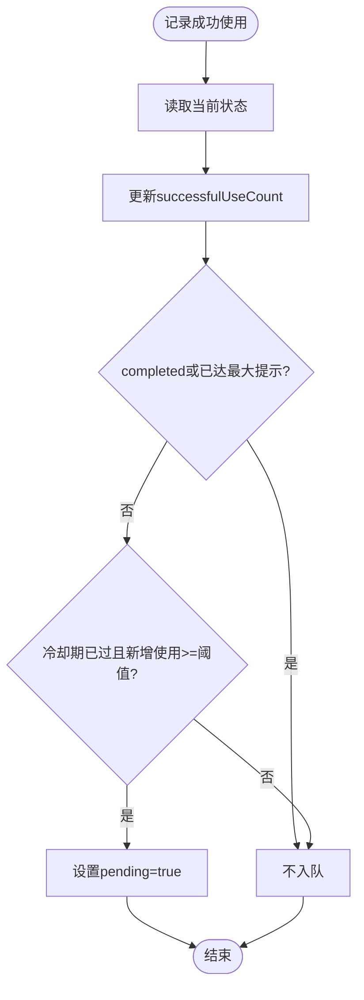
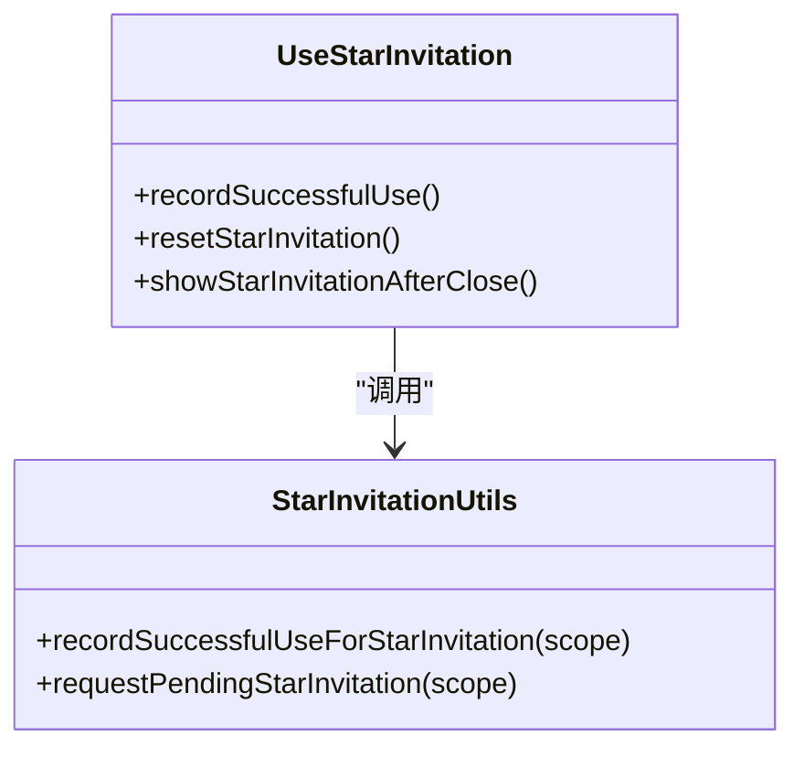
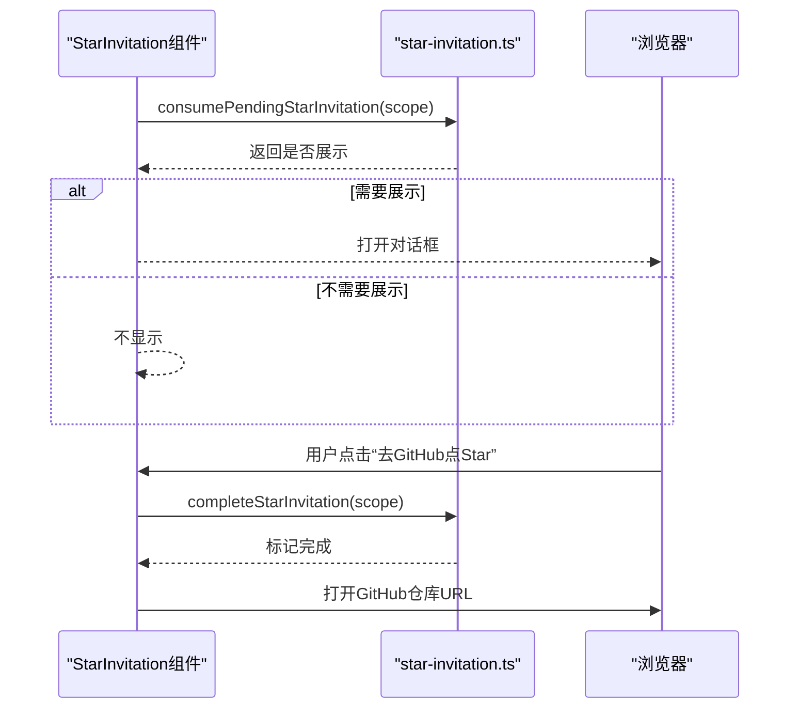
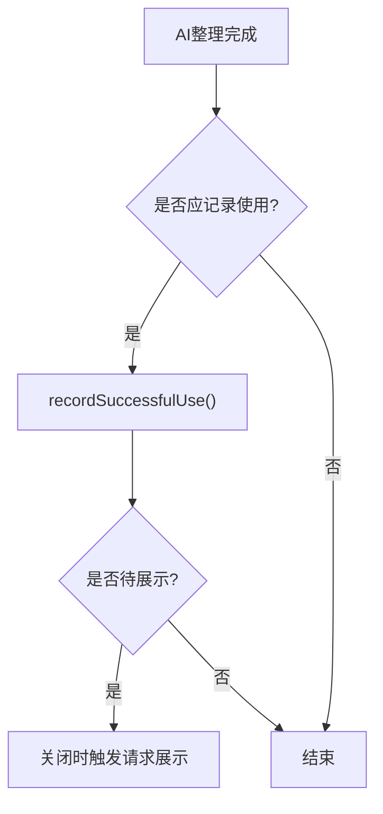
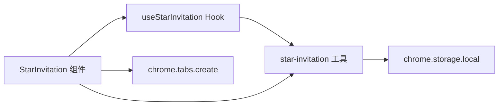

# GitHub星标邀请系统

<cite>
**本文引用的文件**
- [src/utils/star-invitation.ts](file://src/utils/star-invitation.ts)
- [src/hooks/use-star-invitation/index.ts](file://src/hooks/use-star-invitation/index.ts)
- [src/components/star-invitation/index.tsx](file://src/components/star-invitation/index.tsx)
- [src/popup/components/ai-move/use-ai-move.tsx](file://src/popup/components/ai-move/use-ai-move.tsx)
- [src/popup/components/ai-move/star-invitation.ts](file://src/popup/components/ai-move/star-invitation.ts)
- [tests/star-invitation.test.ts](file://tests/star-invitation.test.ts)
- [tests/use-star-invitation.test.tsx](file://tests/use-star-invitation.test.tsx)
- [README.md](file://README.md)
</cite>

## 目录
1. [简介](#简介)
2. [项目结构](#项目结构)
3. [核心组件](#核心组件)
4. [架构总览](#架构总览)
5. [详细组件分析](#详细组件分析)
6. [依赖关系分析](#依赖关系分析)
7. [性能与体验考量](#性能与体验考量)
8. [故障排查指南](#故障排查指南)
9. [结论](#结论)
10. [附录](#附录)

## 简介
本仓库实现了一个“GitHub星标邀请系统”，用于在用户成功使用插件功能后，适时引导用户前往 GitHub 为项目点 Star。该系统具备以下特性：
- 防疲劳策略：避免频繁打扰用户，支持冷却期、最大提示次数等规则
- 多作用域隔离：Popup 与 Options 独立计数与状态
- 持久化存储：基于 Chrome Storage Local 保存状态，兼容旧版本数据
- 事件驱动：通过自定义事件在不同页面间协调展示时机
- 可测试性：提供完整的单元测试覆盖核心逻辑

## 项目结构
围绕星标邀请的核心代码分布在 utils、hooks、components 以及 popup 的 AI 整理流程中：
- 工具层：star-invitation.ts 负责状态机、存储读写、事件派发
- Hook 层：use-star-invitation 封装业务时序（记录成功使用、关闭后触发展示）
- 组件层：star-invitation/index.tsx 渲染弹窗并监听事件
- 集成点：AI 整理流程在成功后调用 Hook，触发邀请流程

图表来源
- [src/utils/star-invitation.ts:1-220](file://src/utils/star-invitation.ts#L1-L220)
- [src/hooks/use-star-invitation/index.ts:1-35](file://src/hooks/use-star-invitation/index.ts#L1-L35)
- [src/components/star-invitation/index.tsx:1-96](file://src/components/star-invitation/index.tsx#L1-L96)
- [src/popup/components/ai-move/use-ai-move.tsx:1-582](file://src/popup/components/ai-move/use-ai-move.tsx#L1-L582)

章节来源
- [src/utils/star-invitation.ts:1-220](file://src/utils/star-invitation.ts#L1-L220)
- [src/hooks/use-star-invitation/index.ts:1-35](file://src/hooks/use-star-invitation/index.ts#L1-L35)
- [src/components/star-invitation/index.tsx:1-96](file://src/components/star-invitation/index.tsx#L1-L96)
- [src/popup/components/ai-move/use-ai-move.tsx:1-582](file://src/popup/components/ai-move/use-ai-move.tsx#L1-L582)

## 核心组件
- 状态机与存储：star-invitation.ts
  - 定义状态结构、归一化、读取/写入、冷却期与提示次数控制
  - 暴露函数：记录成功使用、消费待展示、完成邀请、请求展示事件
- Hook：use-star-invitation/index.ts
  - 封装“记录成功使用”和“关闭后请求展示”的时序
  - 管理内存中的“是否需要在关闭后触发展示”标志
- 弹窗组件：components/star-invitation/index.tsx
  - 监听来自工具层的请求事件，弹出确认框
  - 点击“去 GitHub 点 Star”后标记完成并打开仓库链接
- 集成点：popup/components/ai-move/use-ai-move.tsx
  - 在 AI 整理完成后，根据结果决定是否记录成功使用
  - 在关闭结果面板时，若存在待展示则触发邀请弹窗

章节来源
- [src/utils/star-invitation.ts:1-220](file://src/utils/star-invitation.ts#L1-L220)
- [src/hooks/use-star-invitation/index.ts:1-35](file://src/hooks/use-star-invitation/index.ts#L1-L35)
- [src/components/star-invitation/index.tsx:1-96](file://src/components/star-invitation/index.tsx#L1-L96)
- [src/popup/components/ai-move/use-ai-move.tsx:1-582](file://src/popup/components/ai-move/use-ai-move.tsx#L1-L582)

## 架构总览
整体交互流程如下：
- 用户在 Popup 中执行 AI 整理，成功后 Hook 记录一次成功使用
- 工具层根据规则判断是否进入“待展示”队列
- 当用户关闭结果面板时，Hook 触发“请求展示”事件
- 任意位置的 StarInvitation 组件监听该事件并弹出对话框
- 用户点击“去 GitHub 点 Star”后，标记完成并永久停止后续提示

图表来源
- [src/popup/components/ai-move/use-ai-move.tsx:1-582](file://src/popup/components/ai-move/use-ai-move.tsx#L1-L582)
- [src/hooks/use-star-invitation/index.ts:1-35](file://src/hooks/use-star-invitation/index.ts#L1-L35)
- [src/utils/star-invitation.ts:1-220](file://src/utils/star-invitation.ts#L1-L220)
- [src/components/star-invitation/index.tsx:1-96](file://src/components/star-invitation/index.tsx#L1-L96)

## 详细组件分析

### 工具层：star-invitation.ts
- 状态模型
  - successfulUseCount：累计成功使用次数
  - promptCount：已提示次数
  - pending：是否处于待展示队列
  - completed：是否已完成邀请（全局永久停止）
  - lastPromptAt / lastPromptUseCount：上次提示时间与对应的使用次数
- 关键规则
  - 首次成功使用即入队；之后需满足冷却期与新增使用次数阈值才再次入队
  - 达到最大提示次数或已完成邀请后，不再入队
- 存储与兼容
  - 按作用域（popup/options）分别存储
  - 兼容旧版“已点击Star”的全局标记
- 事件机制
  - 通过 window.dispatchEvent 分发请求事件，供任意组件订阅

图表来源
- [src/utils/star-invitation.ts:63-123](file://src/utils/star-invitation.ts#L63-L123)

章节来源
- [src/utils/star-invitation.ts:1-220](file://src/utils/star-invitation.ts#L1-L220)

### Hook：use-star-invitation/index.ts
- 职责
  - 记录成功使用并缓存“是否需要关闭后展示”的内存标志
  - 在关闭时触发“请求展示”事件
  - 新一轮操作开始时重置内存标志，避免跨轮次误触发
- 与工具层协作
  - 调用 recordSuccessfulUseForStarInvitation 获取是否应排队
  - 调用 requestPendingStarInvitation 触发事件

图表来源
- [src/hooks/use-star-invitation/index.ts:1-35](file://src/hooks/use-star-invitation/index.ts#L1-L35)
- [src/utils/star-invitation.ts:155-203](file://src/utils/star-invitation.ts#L155-L203)

章节来源
- [src/hooks/use-star-invitation/index.ts:1-35](file://src/hooks/use-star-invitation/index.ts#L1-L35)

### 组件：StarInvitation/index.tsx
- 行为
  - 初始化时检查是否有待展示，若有则弹出对话框
  - 监听来自工具层的请求事件，动态弹出
  - 点击“去 GitHub 点 Star”后标记完成并打开仓库链接
- 样式与交互
  - 使用统一对话框组件，提供“下次再说”与“去 GitHub 点 Star”两个动作

图表来源
- [src/components/star-invitation/index.tsx:27-96](file://src/components/star-invitation/index.tsx#L27-L96)
- [src/utils/star-invitation.ts:169-199](file://src/utils/star-invitation.ts#L169-L199)

章节来源
- [src/components/star-invitation/index.tsx:1-96](file://src/components/star-invitation/index.tsx#L1-L96)

### 集成点：AI 整理流程
- 触发时机
  - 在 AI 整理完成后，根据成功/跳过数量决定是否记录成功使用
  - 关闭结果面板时，若存在待展示则触发邀请弹窗
- 条件判断
  - shouldRecordAIMoveUse 确保至少有一次有效使用（成功或跳过）才计入

图表来源
- [src/popup/components/ai-move/use-ai-move.tsx:361-381](file://src/popup/components/ai-move/use-ai-move.tsx#L361-L381)
- [src/popup/components/ai-move/star-invitation.ts:1-6](file://src/popup/components/ai-move/star-invitation.ts#L1-L6)
- [src/hooks/use-star-invitation/index.ts:16-25](file://src/hooks/use-star-invitation/index.ts#L16-L25)

章节来源
- [src/popup/components/ai-move/use-ai-move.tsx:1-582](file://src/popup/components/ai-move/use-ai-move.tsx#L1-L582)
- [src/popup/components/ai-move/star-invitation.ts:1-6](file://src/popup/components/ai-move/star-invitation.ts#L1-L6)

## 依赖关系分析
- 模块耦合
  - 组件仅依赖 Hook 与工具层，保持低耦合
  - Hook 仅依赖工具层，无 UI 细节
  - 工具层通过事件与外部解耦，便于扩展多个监听者
- 外部依赖
  - chrome.storage.local：持久化状态
  - window.addEventListener/dispatchEvent：跨组件通信
  - chrome.tabs.create：打开 GitHub 仓库页

图表来源
- [src/components/star-invitation/index.tsx:1-96](file://src/components/star-invitation/index.tsx#L1-L96)
- [src/hooks/use-star-invitation/index.ts:1-35](file://src/hooks/use-star-invitation/index.ts#L1-L35)
- [src/utils/star-invitation.ts:1-220](file://src/utils/star-invitation.ts#L1-L220)

章节来源
- [src/utils/star-invitation.ts:1-220](file://src/utils/star-invitation.ts#L1-L220)

## 性能与体验考量
- 防疲劳设计
  - 冷却期与使用间隔限制，避免过度打扰
  - 最大提示次数上限，保证用户体验
- 状态一致性
  - 作用域隔离，避免不同入口互相干扰
  - 完成邀请后全局永久停止，减少重复计算
- 异步与错误处理
  - 存储读写失败时降级处理，不影响主流程
  - 事件驱动降低同步阻塞风险
- 可观测性
  - 控制台日志辅助定位问题
  - 单元测试覆盖关键路径

[本节为通用指导，无需特定文件引用]

## 故障排查指南
- 未弹出邀请
  - 检查是否已达到最大提示次数或已完成邀请
  - 检查冷却期与新增使用次数阈值是否满足
  - 查看是否触发了“请求展示”事件
- 弹窗重复出现
  - 确认 consumePendingStarInvitation 是否正确消费了待展示状态
  - 检查是否在多处同时监听同一事件导致重复展示
- 无法打开 GitHub
  - 检查 chrome.tabs.create 权限与返回值
  - 查看控制台是否有相关警告信息

章节来源
- [src/utils/star-invitation.ts:155-203](file://src/utils/star-invitation.ts#L155-L203)
- [src/components/star-invitation/index.tsx:50-60](file://src/components/star-invitation/index.tsx#L50-L60)

## 结论
本系统以清晰的状态机为核心，结合 Hook 与事件机制，实现了稳定、可配置、可扩展的 GitHub 星标邀请流程。通过防疲劳策略与作用域隔离，既保证了推广效果，又兼顾了用户体验。完善的测试覆盖确保了核心逻辑的可靠性。

[本节为总结性内容，无需特定文件引用]

## 附录

### API 与常量说明
- 常量
  - STAR_INVITATION_COOLDOWN_MS：冷却期时长
  - STAR_INVITATION_USAGE_INTERVAL：新增使用次数阈值
  - STAR_INVITATION_MAX_PROMPTS：最大提示次数
- 主要函数
  - recordSuccessfulUseForStarInvitation：记录成功使用并返回是否待展示
  - consumePendingStarInvitation：消费待展示并返回是否应显示
  - completeStarInvitation：标记完成并持久化
  - requestPendingStarInvitation：触发展示事件
  - getStarInvitationRequestEvent：生成事件名

章节来源
- [src/utils/star-invitation.ts:1-220](file://src/utils/star-invitation.ts#L1-L220)

### 测试要点
- 疲劳规则验证：首次入队、冷却期内不重复、冷却期后再次入队、完成与达上限后不再入队
- 作用域隔离：popup 与 options 独立计数与状态
- 兼容性：旧版“已点击Star”记录的兼容处理
- Hook 行为：记录成功使用、关闭后触发展示、重置内存标志

章节来源
- [tests/star-invitation.test.ts:1-162](file://tests/star-invitation.test.ts#L1-L162)
- [tests/use-star-invitation.test.tsx:1-65](file://tests/use-star-invitation.test.tsx#L1-L65)