# WebDAV云同步系统

<cite>
**本文档引用的文件**
- [webdav.ts](file://src/utils/webdav.ts)
- [sync-service.ts](file://src/utils/sync-service.ts)
- [webdav-config.tsx](file://src/options/components/setting/components/webdav-config.tsx)
- [global-data.ts](file://src/store/global-data.ts)
- [background/index.ts](file://src/background/index.ts)
- [indexed-db.ts](file://src/utils/indexed-db.ts)
- [Options.tsx](file://src/options/Options.tsx)
- [manifest.ts](file://src/manifest.ts)
- [chorme-storage-middleware.ts](file://src/store/chorme-storage-middleware.ts)
- [indexeddb-storage-middleware.ts](file://src/store/indexeddb-storage-middleware.ts)
- [login-check/index.tsx](file://src/popup/components/login-check/index.tsx)
- [data-context.ts](file://src/utils/data-context.ts)
</cite>

## 更新摘要
**变更内容**
- 新增IndexedDB存储中间件支持，实现混合存储策略
- 更新同步服务架构，支持Chrome存储和IndexedDB的协同工作
- 改进WebDAV配置面板的可访问性和功能完整性
- 增强状态管理系统的数据持久化能力

## 目录
1. [简介](#简介)
2. [项目结构](#项目结构)
3. [核心组件](#核心组件)
4. [架构概览](#架构概览)
5. [详细组件分析](#详细组件分析)
6. [依赖关系分析](#依赖关系分析)
7. [性能考虑](#性能考虑)
8. [故障排除指南](#故障排除指南)
9. [结论](#结论)

## 简介

WebDAV云同步系统是一个基于浏览器扩展的B站收藏夹管理工具，主要功能包括：

- **WebDAV云同步**：支持将用户配置和数据同步到各种WebDAV服务器（如Nextcloud、坚果云、群晖等）
- **智能冲突解决**：采用last-write-wins策略处理多设备间的同步冲突
- **防抖机制**：避免频繁同步操作造成资源浪费
- **可选的数据缓存**：支持同步分析缓存数据以提升性能
- **混合存储策略**：结合Chrome存储和IndexedDB实现最优的数据持久化方案

该系统通过Chrome扩展的service worker实现跨域请求代理，确保与WebDAV服务器的安全通信。

## 项目结构

项目采用模块化设计，主要分为以下几个核心部分：

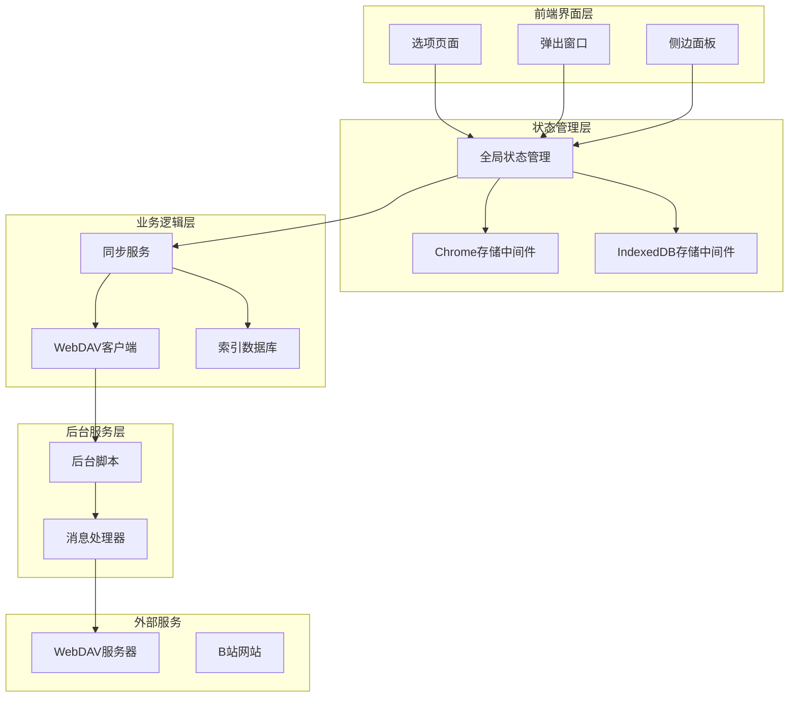

**图表来源**
- [Options.tsx:17-106](file://src/options/Options.tsx#L17-L106)
- [global-data.ts:6-33](file://src/store/global-data.ts#L6-L33)
- [sync-service.ts:1-293](file://src/utils/sync-service.ts#L1-L293)

**章节来源**
- [manifest.ts:1-61](file://src/manifest.ts#L1-L61)
- [Options.tsx:1-110](file://src/options/Options.tsx#L1-L110)

## 核心组件

### WebDAV客户端
提供轻量级的WebDAV操作封装，支持基本的文件操作和目录管理。

### 同步服务
负责协调整个同步流程，包括数据准备、冲突检测和版本控制，并支持混合存储策略。

### 全局状态管理
使用Zustand配合双重存储中间件实现状态持久化和跨组件共享，支持Chrome存储和IndexedDB的协同工作。

### 后台服务
通过service worker处理跨域请求和自动同步任务。

**章节来源**
- [webdav.ts:1-182](file://src/utils/webdav.ts#L1-L182)
- [sync-service.ts:1-293](file://src/utils/sync-service.ts#L1-L293)
- [global-data.ts:1-36](file://src/store/global-data.ts#L1-L36)

## 架构概览

系统采用分层架构设计，确保各组件职责清晰且松耦合：

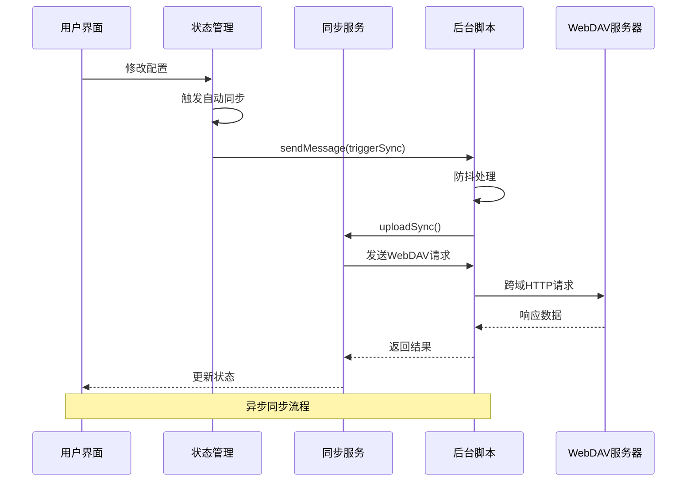

**图表来源**
- [chorme-storage-middleware.ts:47-50](file://src/store/chorme-storage-middleware.ts#L47-L50)
- [background/index.ts:21-31](file://src/background/index.ts#L21-L31)
- [sync-service.ts:80-113](file://src/utils/sync-service.ts#L80-L113)

## 详细组件分析

### IndexedDB存储中间件

**新增** 系统引入了IndexedDB存储中间件，专门用于处理大数据量的标签数据。

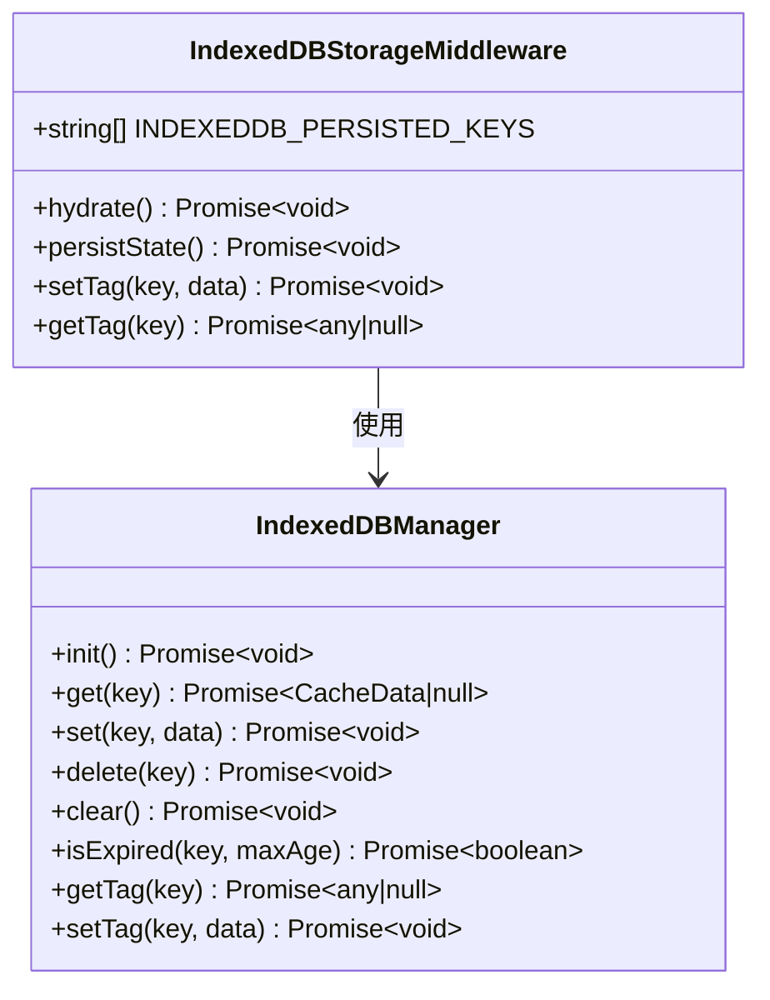

**图表来源**
- [indexeddb-storage-middleware.ts:8-80](file://src/store/indexeddb-storage-middleware.ts#L8-L80)
- [indexed-db.ts:16-168](file://src/utils/indexed-db.ts#L16-L168)

#### 存储策略

系统采用混合存储策略，根据数据大小和访问频率进行智能分配：

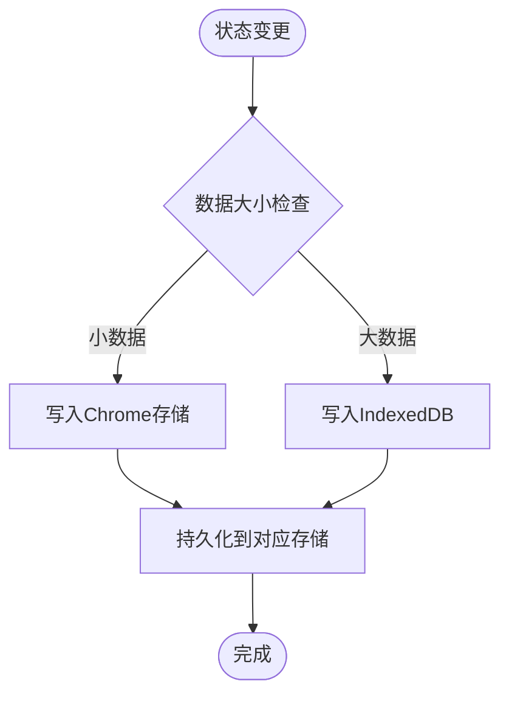

**图表来源**
- [chorme-storage-middleware.ts:3-16](file://src/store/chorme-storage-middleware.ts#L3-L16)
- [indexeddb-storage-middleware.ts:4-8](file://src/store/indexeddb-storage-middleware.ts#L4-L8)

**章节来源**
- [indexeddb-storage-middleware.ts:1-80](file://src/store/indexeddb-storage-middleware.ts#L1-L80)
- [indexed-db.ts:1-168](file://src/utils/indexed-db.ts#L1-L168)

### WebDAV客户端组件分析

WebDAV客户端提供了完整的WebDAV协议支持，包括认证、URL构建和请求代理。

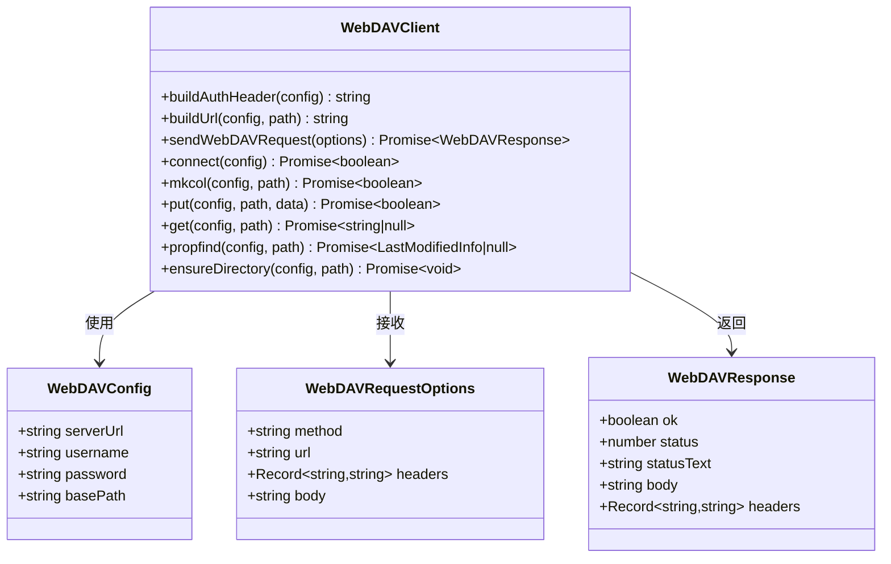

**图表来源**
- [webdav.ts:5-25](file://src/utils/webdav.ts#L5-L25)
- [webdav.ts:30-62](file://src/utils/webdav.ts#L30-L62)

#### WebDAV连接流程

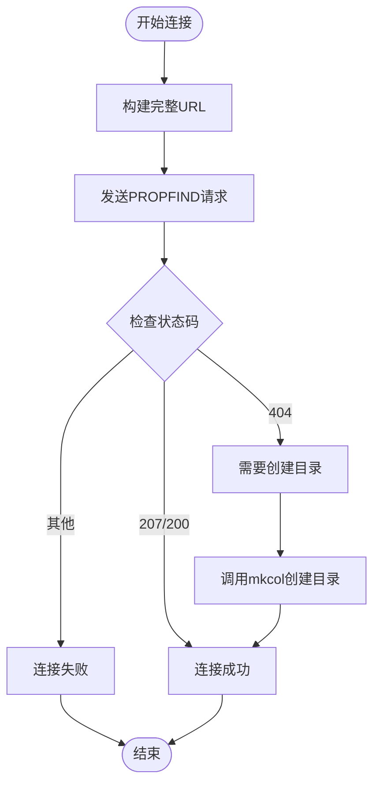

**图表来源**
- [webdav.ts:67-80](file://src/utils/webdav.ts#L67-L80)
- [webdav.ts:85-96](file://src/utils/webdav.ts#L85-L96)

**章节来源**
- [webdav.ts:1-182](file://src/utils/webdav.ts#L1-L182)

### 同步服务组件分析

同步服务是整个系统的核心，负责协调数据的上传、下载和冲突解决，并支持混合存储策略。

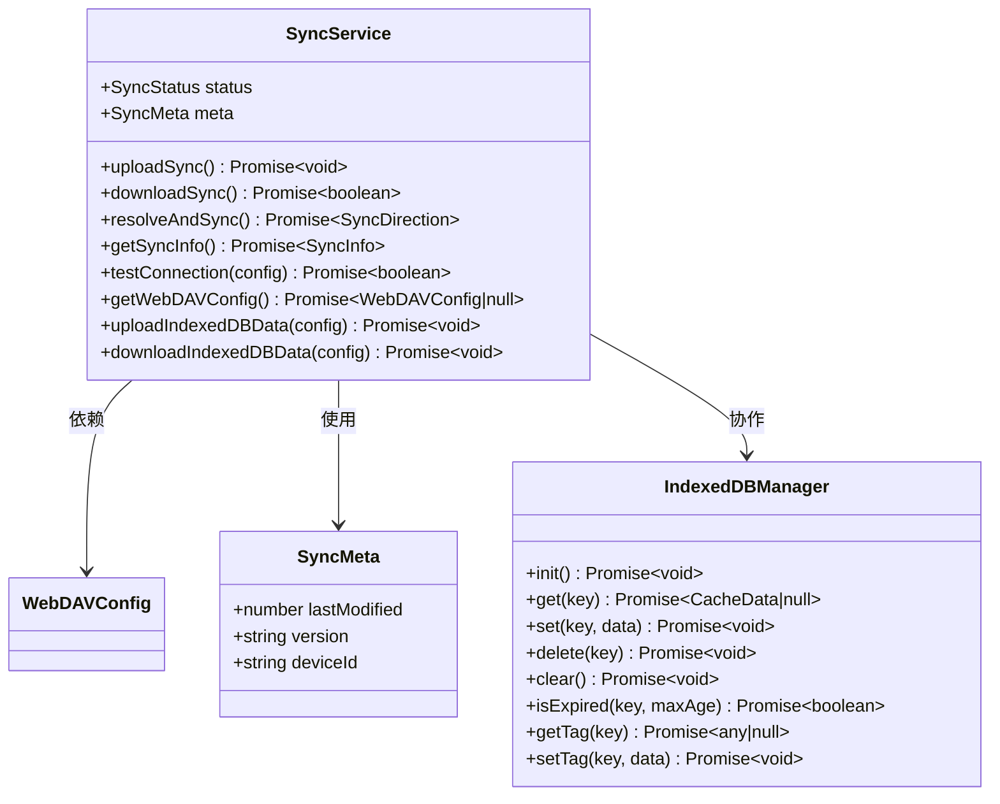

**图表来源**
- [sync-service.ts:8-16](file://src/utils/sync-service.ts#L8-L16)
- [sync-service.ts:24-37](file://src/utils/sync-service.ts#L24-L37)
- [indexed-db.ts:15-40](file://src/utils/indexed-db.ts#L15-L40)

#### 混合存储同步策略

系统采用智能的混合存储同步策略，区分不同类型的存储需求：

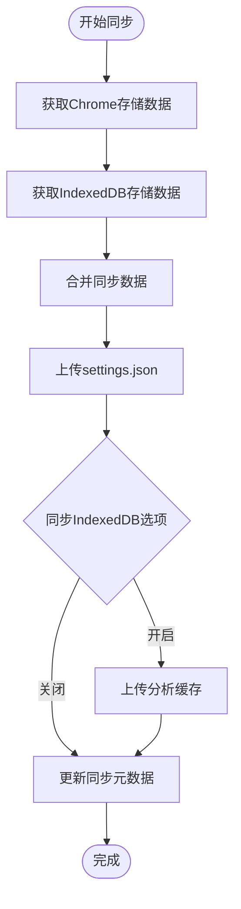

**图表来源**
- [sync-service.ts:90-121](file://src/utils/sync-service.ts#L90-L121)
- [sync-service.ts:248-285](file://src/utils/sync-service.ts#L248-L285)

#### 冲突解决算法

系统采用简单的last-write-wins策略处理同步冲突：

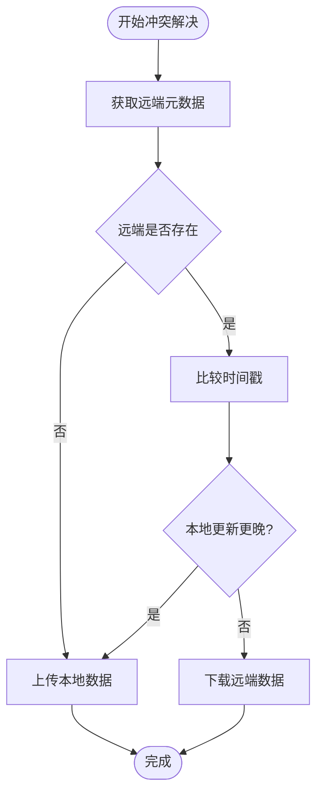

**图表来源**
- [sync-service.ts:170-199](file://src/utils/sync-service.ts#L170-L199)

**章节来源**
- [sync-service.ts:1-293](file://src/utils/sync-service.ts#L1-L293)

### WebDAV配置界面组件分析

配置界面提供了完整的WebDAV设置和管理功能，现已支持混合存储策略的配置。

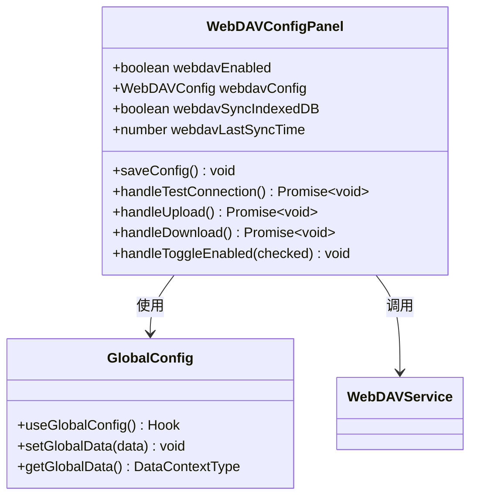

**图表来源**
- [webdav-config.tsx:23-33](file://src/options/components/setting/components/webdav-config.tsx#L23-L33)
- [global-data.ts:6-33](file://src/store/global-data.ts#L6-L33)

#### 同步操作流程

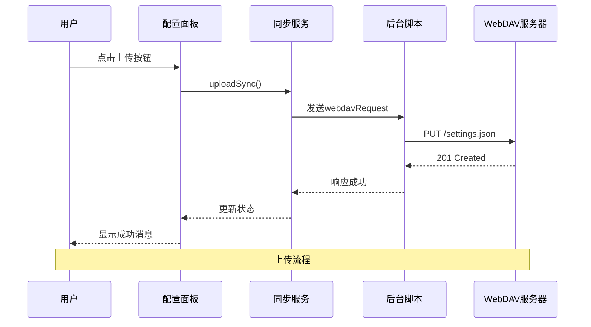

**图表来源**
- [webdav-config.tsx:108-123](file://src/options/components/setting/components/webdav-config.tsx#L108-L123)
- [sync-service.ts:80-113](file://src/utils/sync-service.ts#L80-L113)

**章节来源**
- [webdav-config.tsx:1-318](file://src/options/components/setting/components/webdav-config.tsx#L1-L318)

### 状态管理系统分析

系统使用Zustand实现高效的状态管理，结合双重存储中间件确保数据持久化。

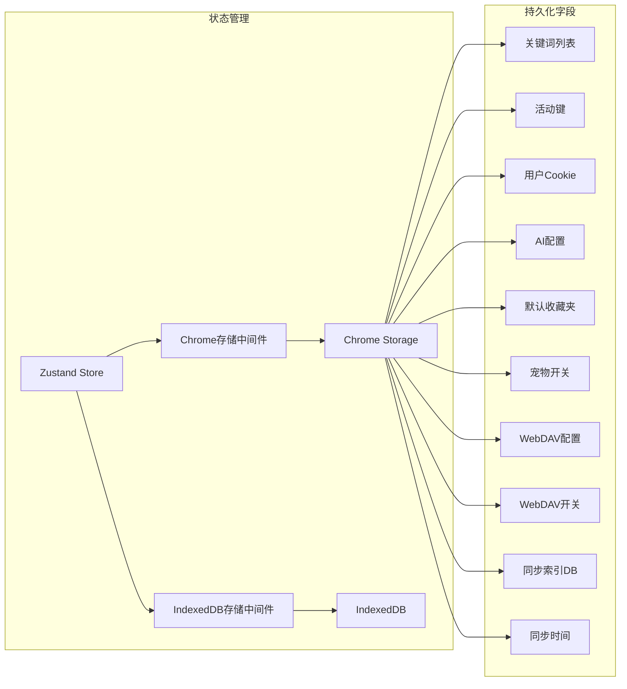

**图表来源**
- [chorme-storage-middleware.ts:3-16](file://src/store/chorme-storage-middleware.ts#L3-L16)
- [global-data.ts:19-23](file://src/store/global-data.ts#L19-L23)

**章节来源**
- [global-data.ts:1-36](file://src/store/global-data.ts#L1-L36)
- [chorme-storage-middleware.ts:1-80](file://src/store/chorme-storage-middleware.ts#L1-L80)

## 依赖关系分析

系统的关键依赖关系如下：

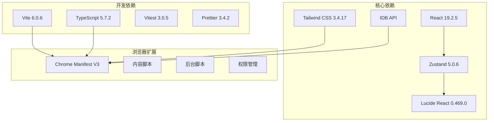

**图表来源**
- [package.json:30-65](file://package.json#L30-L65)
- [manifest.ts:8-61](file://src/manifest.ts#L8-L61)

**章节来源**
- [package.json:1-99](file://package.json#L1-L99)
- [manifest.ts:1-61](file://src/manifest.ts#L1-L61)

## 性能考虑

### 防抖机制
系统实现了5秒的防抖延迟，避免频繁操作导致的资源浪费：

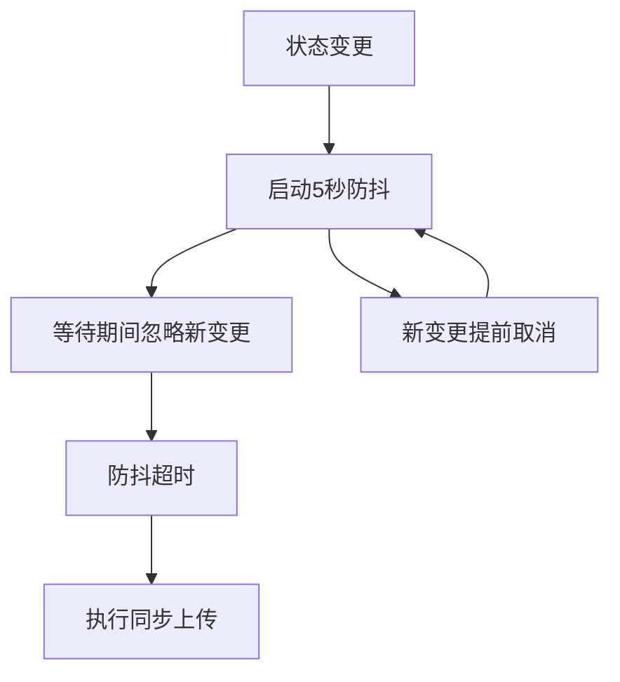

**图表来源**
- [background/index.ts:17-31](file://src/background/index.ts#L17-L31)

### 智能存储策略
- **混合存储架构**：小数据（配置信息）存储在Chrome存储，大数据（标签、分析缓存）存储在IndexedDB
- **24小时过期机制**：避免缓存数据过期
- **增量同步**：只同步必要的配置数据
- **可选的缓存同步**：用户可以选择是否同步分析缓存数据

### 网络优化
- **跨域代理**：通过service worker绕过CORS限制
- **批量操作**：一次同步包含多个文件操作
- **条件同步**：基于时间戳判断是否需要同步

## 故障排除指南

### 常见问题及解决方案

#### WebDAV连接失败
1. **检查服务器地址格式**：确保URL以`https://`开头且不包含末尾斜杠
2. **验证认证信息**：确认用户名和密码正确
3. **检查网络权限**：确保扩展具有访问目标服务器的权限
4. **测试服务器连通性**：使用测试连接功能验证服务器可达性

#### 同步失败
1. **检查同步状态**：查看最近同步时间是否更新
2. **验证磁盘空间**：确保WebDAV服务器有足够的存储空间
3. **检查文件权限**：确认扩展具有读写权限
4. **重试机制**：系统会自动重试失败的操作

#### 数据丢失风险
1. **备份重要数据**：定期备份重要的收藏夹数据
2. **监控同步状态**：关注同步状态指示器
3. **使用安全服务器**：选择可靠的WebDAV服务提供商

#### 存储相关问题
1. **IndexedDB存储异常**：检查浏览器的存储配额和权限设置
2. **混合存储同步失败**：确认选择了正确的同步选项
3. **数据迁移问题**：确保从旧版本升级时数据正确迁移

**章节来源**
- [webdav-config.tsx:54-105](file://src/options/components/setting/components/webdav-config.tsx#L54-L105)
- [sync-service.ts:195-198](file://src/utils/sync-service.ts#L195-L198)

## 结论

WebDAV云同步系统是一个设计精良的浏览器扩展解决方案，具有以下特点：

### 优势
- **架构清晰**：分层设计确保各组件职责明确
- **用户体验好**：自动同步和防抖机制提升使用体验
- **安全性高**：通过service worker处理敏感的网络请求
- **扩展性强**：支持多种WebDAV服务器和配置选项
- **智能存储**：混合存储策略优化数据持久化性能

### 技术亮点
- **跨域解决方案**：巧妙利用Chrome扩展的权限模型
- **智能冲突处理**：简单的last-write-wins策略满足大多数场景
- **性能优化**：防抖机制和增量同步减少资源消耗
- **状态管理**：Zustand + 双重存储中间件实现高效持久化
- **混合存储架构**：根据数据特征选择最优的存储方案

### 改进建议
- **双向同步**：可以考虑实现更复杂的冲突解决策略
- **增量同步**：针对大文件的增量同步机制
- **进度跟踪**：为大型同步操作提供进度反馈
- **错误恢复**：增强失败后的自动恢复能力
- **存储监控**：提供存储使用情况的可视化监控

该系统为B站收藏夹管理提供了可靠的云端同步解决方案，既保证了数据安全，又提升了用户的使用便利性。新增的IndexedDB存储中间件和混合存储策略进一步增强了系统的性能和可靠性，为用户提供更好的使用体验。