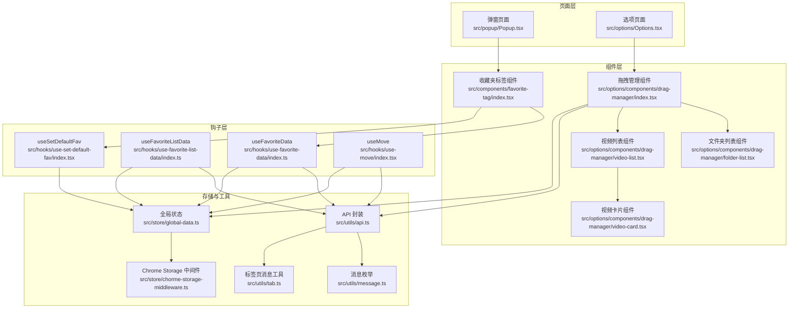
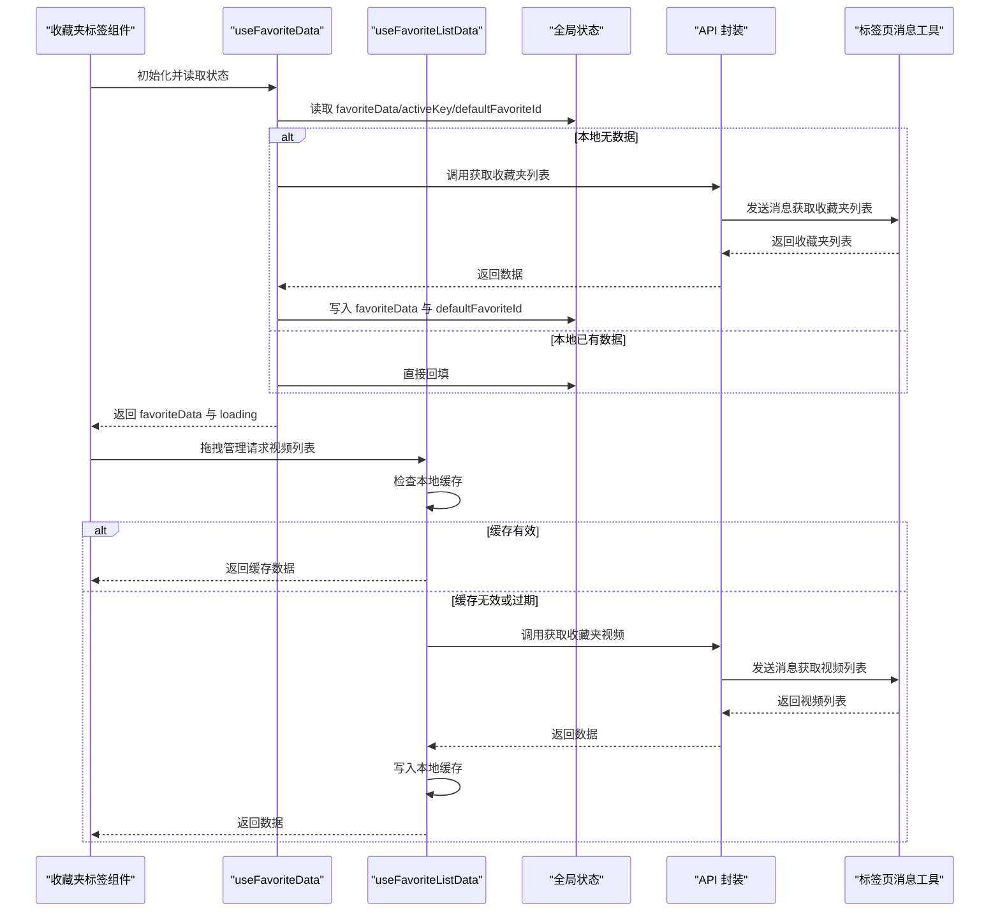
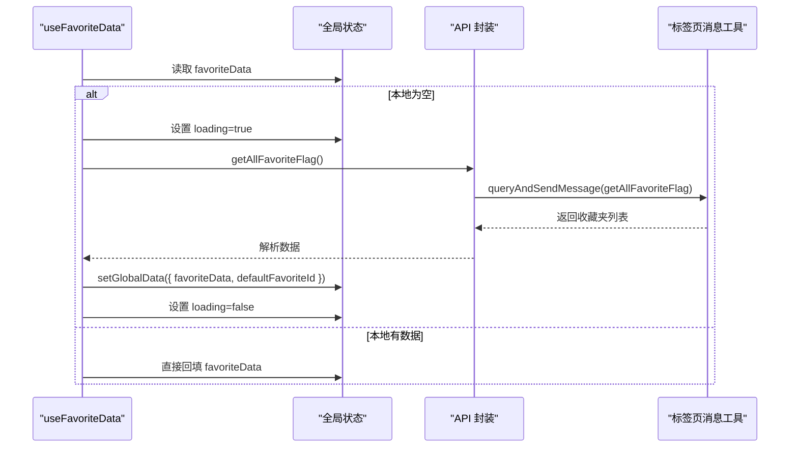
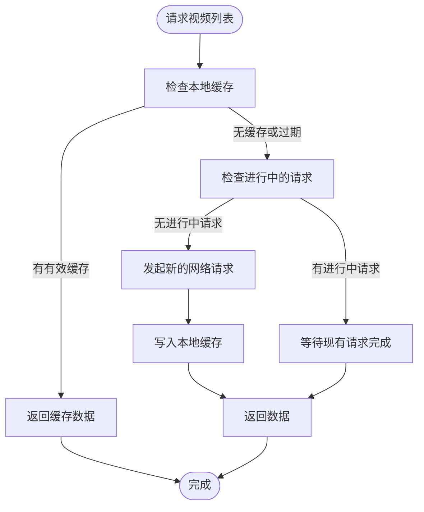
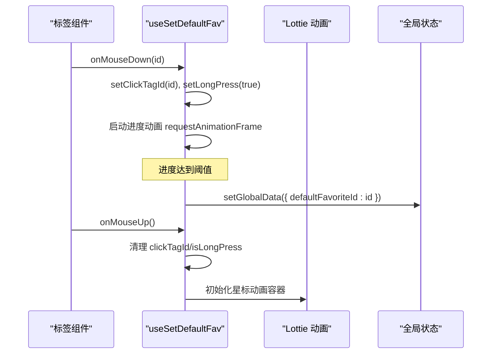
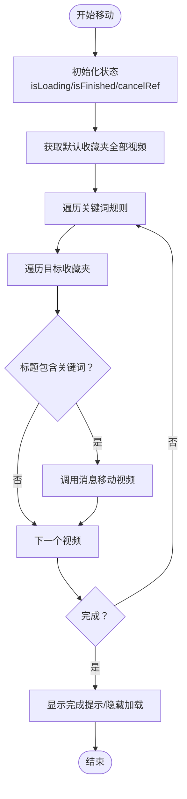
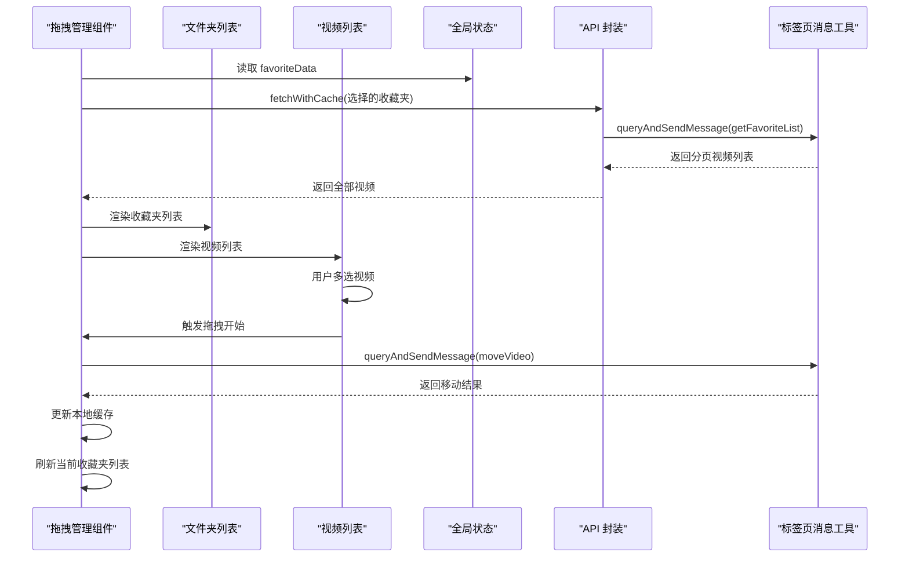
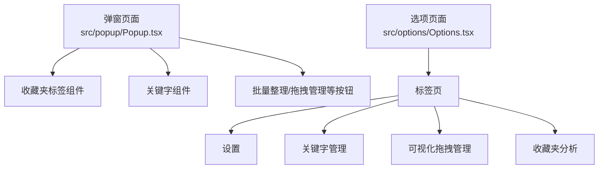
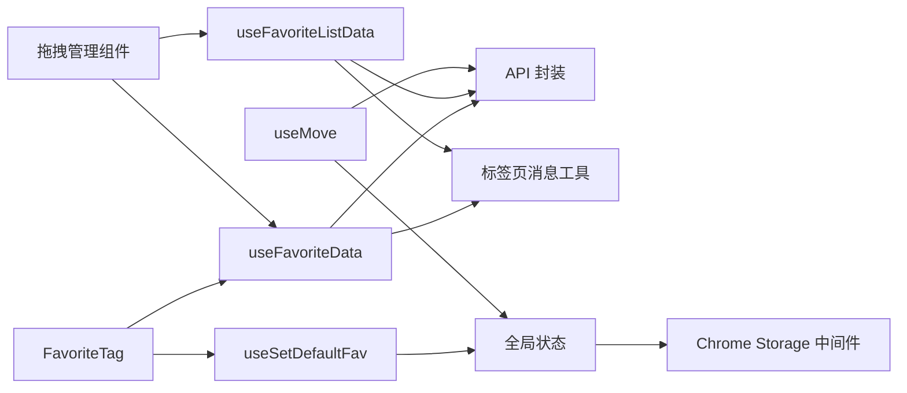

# 收藏夹管理系统

<cite>
**本文引用的文件**
- [src/components/favorite-tag/index.tsx](file://src/components/favorite-tag/index.tsx)
- [src/hooks/use-favorite-data/index.ts](file://src/hooks/use-favorite-data/index.ts)
- [src/hooks/use-favorite-list-data/index.ts](file://src/hooks/use-favorite-list-data/index.ts)
- [src/hooks/use-set-default-fav/index.tsx](file://src/hooks/use-set-default-fav/index.tsx)
- [src/hooks/use-move/index.tsx](file://src/hooks/use-move/index.tsx)
- [src/store/global-data.ts](file://src/store/global-data.ts)
- [src/store/chorme-storage-middleware.ts](file://src/store/chorme-storage-middleware.ts)
- [src/utils/data-context.ts](file://src/utils/data-context.ts)
- [src/utils/message.ts](file://src/utils/message.ts)
- [src/utils/api.ts](file://src/utils/api.ts)
- [src/utils/tab.ts](file://src/utils/tab.ts)
- [src/options/Options.tsx](file://src/options/Options.tsx)
- [src/popup/Popup.tsx](file://src/popup/Popup.tsx)
- [src/options/components/drag-manager/index.tsx](file://src/options/components/drag-manager/index.tsx)
- [src/options/components/drag-manager/folder-list.tsx](file://src/options/components/drag-manager/folder-list.tsx)
- [src/options/components/drag-manager/video-list.tsx](file://src/options/components/drag-manager/video-list.tsx)
- [src/options/components/drag-manager/video-card.tsx](file://src/options/components/drag-manager/video-card.tsx)
- [src/popup/components/drag-manager-button/index.tsx](file://src/popup/components/drag-manager-button/index.tsx)
- [README.md](file://README.md)
</cite>

## 更新摘要
**变更内容**
- 新增 useFavoriteListData hook，提供本地缓存和请求去重功能
- 模块化拖拽管理组件架构，拆分为独立的文件夹列表、视频列表和视频卡片组件
- 增强多选操作支持，包括 Ctrl/Cmd + 点击多选和 Shift 范围选择
- 实现缓存同步机制，支持视频移动后的本地缓存更新
- 优化拖拽管理界面的交互体验和视觉反馈

## 目录
1. [简介](#简介)
2. [项目结构](#项目结构)
3. [核心组件](#核心组件)
4. [架构总览](#架构总览)
5. [详细组件分析](#详细组件分析)
6. [依赖关系分析](#依赖关系分析)
7. [性能考虑](#性能考虑)
8. [故障排查指南](#故障排查指南)
9. [结论](#结论)
10. [附录](#附录)

## 简介
本项目是一个 Chrome 扩展，旨在帮助用户高效管理与分析 Bilibili 收藏夹内容。系统围绕"收藏夹标签展示""收藏夹数据获取与缓存""默认收藏夹配置""批量整理与拖拽移动"等核心能力构建，提供弹窗与侧边栏两种使用形态，并通过全局状态管理与消息通信机制实现跨页面的数据同步与操作。

**更新** 新增了强大的拖拽管理功能，支持多选操作、缓存同步和模块化的组件架构。

## 项目结构
系统采用按功能域划分的目录组织方式，主要模块包括：
- 组件层：收藏夹标签组件、UI 组件库、拖拽管理组件（模块化）
- 钩子层：收藏夹数据获取、收藏夹列表数据、默认收藏夹设置、移动操作、拖拽管理等
- 存储层：全局状态（Zustand + Chrome Storage）与 IndexedDB 缓存
- 工具层：消息通信、API 请求封装、数据上下文类型定义
- 页面层：弹窗 Popup、选项页 Options、可视化拖拽管理界面

**图示来源**
- [src/popup/Popup.tsx:14-76](file://src/popup/Popup.tsx#L14-L76)
- [src/options/Options.tsx:12-87](file://src/options/Options.tsx#L12-L87)
- [src/components/favorite-tag/index.tsx:13-83](file://src/components/favorite-tag/index.tsx#L13-L83)
- [src/hooks/use-favorite-data/index.ts:20-59](file://src/hooks/use-favorite-data/index.ts#L20-L59)
- [src/hooks/use-favorite-list-data/index.ts:44-133](file://src/hooks/use-favorite-list-data/index.ts#L44-L133)
- [src/hooks/use-set-default-fav/index.tsx:6-127](file://src/hooks/use-set-default-fav/index.tsx#L6-L127)
- [src/hooks/use-move/index.tsx:14-161](file://src/hooks/use-move/index.tsx#L14-L161)
- [src/store/global-data.ts:6-30](file://src/store/global-data.ts#L6-L30)
- [src/store/chorme-storage-middleware.ts:8-57](file://src/store/chorme-storage-middleware.ts#L8-L57)
- [src/utils/api.ts:285-349](file://src/utils/api.ts#L285-L349)
- [src/utils/message.ts:1-20](file://src/utils/message.ts#L1-L20)
- [src/utils/tab.ts:65-82](file://src/utils/tab.ts#L65-L82)

**章节来源**
- [src/popup/Popup.tsx:14-76](file://src/popup/Popup.tsx#L14-L76)
- [src/options/Options.tsx:12-87](file://src/options/Options.tsx#L12-L87)
- [README.md:29-78](file://README.md#L29-L78)

## 核心组件
- 收藏夹标签组件：负责渲染收藏夹列表、高亮当前活动收藏夹、显示默认收藏夹星标、处理长按设置默认收藏夹与点击切换活动收藏夹。
- 收藏夹数据钩子：负责首次拉取收藏夹列表、缓存与状态更新、触发全局状态变更。
- 收藏夹列表数据钩子：提供本地缓存、请求去重、缓存同步等功能，增强拖拽管理的性能表现。
- 默认收藏夹设置钩子：负责长按动画进度、长按结束清理、在长按过程中将点击的收藏夹设为默认收藏夹。
- 批量移动钩子：负责遍历默认收藏夹视频、按关键词匹配移动到目标收藏夹、提供加载态与取消逻辑。
- 全局状态：统一管理收藏夹数据、活动收藏夹、默认收藏夹、关键词等，并持久化到 Chrome Storage。
- 可视化拖拽管理：提供收藏夹与视频列表的可视化界面，支持多选与拖拽批量移动，具备模块化组件架构。

**更新** 新增了 useFavoriteListData 钩子和模块化的拖拽管理组件，显著提升了拖拽功能的性能和用户体验。

**章节来源**
- [src/components/favorite-tag/index.tsx:13-83](file://src/components/favorite-tag/index.tsx#L13-L83)
- [src/hooks/use-favorite-data/index.ts:20-59](file://src/hooks/use-favorite-data/index.ts#L20-L59)
- [src/hooks/use-favorite-list-data/index.ts:44-133](file://src/hooks/use-favorite-list-data/index.ts#L44-L133)
- [src/hooks/use-set-default-fav/index.tsx:6-127](file://src/hooks/use-set-default-fav/index.tsx#L6-L127)
- [src/hooks/use-move/index.tsx:14-161](file://src/hooks/use-move/index.tsx#L14-L161)
- [src/store/global-data.ts:6-30](file://src/store/global-data.ts#L6-L30)

## 架构总览
系统采用"页面 -> 组件 -> 钩子 -> 工具/存储"的分层架构。页面通过组件渲染 UI；组件通过钩子获取/更新状态；钩子通过 API 与消息工具与后台通信；全局状态通过中间件持久化到 Chrome Storage；部分数据通过 IndexedDB 缓存以降低重复请求。

**更新** 新增了 useFavoriteListData 钩子，提供本地缓存和请求去重功能，进一步优化了拖拽管理的性能表现。

**图示来源**
- [src/components/favorite-tag/index.tsx:24-30](file://src/components/favorite-tag/index.tsx#L24-L30)
- [src/hooks/use-favorite-data/index.ts:33-47](file://src/hooks/use-favorite-data/index.ts#L33-L47)
- [src/hooks/use-favorite-list-data/index.ts:51-79](file://src/hooks/use-favorite-list-data/index.ts#L51-L79)
- [src/utils/api.ts:285-349](file://src/utils/api.ts#L285-L349)
- [src/utils/tab.ts:65-82](file://src/utils/tab.ts#L65-L82)
- [src/store/global-data.ts:16-22](file://src/store/global-data.ts#L16-L22)

## 详细组件分析

### 收藏夹标签组件（FavoriteTag）
- 渲染逻辑：根据全局收藏夹数据生成标签元素，支持滚动展示、高亮当前活动收藏夹、显示默认收藏夹星标。
- 交互行为：鼠标按下记录点击的收藏夹 ID；长按触发设置默认收藏夹流程；松开恢复状态。
- 数据来源：依赖 useFavoriteData 获取收藏夹列表与 loading 状态；依赖 useSetDefaultFav 提供长按动画与点击事件处理；依赖全局状态获取当前活动收藏夹与默认收藏夹 ID。

**图示来源**
- [src/components/favorite-tag/index.tsx:30-67](file://src/components/favorite-tag/index.tsx#L30-L67)
- [src/hooks/use-set-default-fav/index.tsx:55-74](file://src/hooks/use-set-default-fav/index.tsx#L55-L74)

**章节来源**
- [src/components/favorite-tag/index.tsx:13-83](file://src/components/favorite-tag/index.tsx#L13-L83)
- [src/hooks/use-set-default-fav/index.tsx:6-127](file://src/hooks/use-set-default-fav/index.tsx#L6-L127)

### 收藏夹数据获取钩子（useFavoriteData）
- 数据拉取：若本地已有收藏夹数据则直接回填，否则通过消息通信向后台请求收藏夹列表，并写入全局状态。
- 缓存策略：在内存中缓存一次拉取结果，避免重复请求；同时通过全局状态持久化到 Chrome Storage。
- 状态管理：返回 favoriteData 与 loading，供组件渲染骨架屏与控制交互。

**图示来源**
- [src/hooks/use-favorite-data/index.ts:33-47](file://src/hooks/use-favorite-data/index.ts#L33-L47)
- [src/utils/api.ts:137-145](file://src/utils/api.ts#L137-L145)
- [src/utils/tab.ts:65-82](file://src/utils/tab.ts#L65-L82)
- [src/store/global-data.ts:16-22](file://src/store/global-data.ts#L16-L22)

**章节来源**
- [src/hooks/use-favorite-data/index.ts:20-59](file://src/hooks/use-favorite-data/index.ts#L20-L59)

### 收藏夹列表数据钩子（useFavoriteListData）
- 本地缓存：使用 localStorage 存储收藏夹视频列表，支持自定义缓存过期时间（默认 20 分钟）。
- 请求去重：对同一收藏夹 ID 的并发请求进行去重处理，避免重复网络请求。
- 缓存同步：提供 moveVideosCache 方法，在视频移动后同步更新源收藏夹和目标收藏夹的缓存。
- 缓存管理：支持单个收藏夹缓存清除和全部缓存批量清除功能。

**更新** 新增的功能，显著提升了拖拽管理的性能和用户体验。

**图示来源**
- [src/hooks/use-favorite-list-data/index.ts:51-79](file://src/hooks/use-favorite-list-data/index.ts#L51-L79)
- [src/hooks/use-favorite-list-data/index.ts:87-108](file://src/hooks/use-favorite-list-data/index.ts#L87-L108)

**章节来源**
- [src/hooks/use-favorite-list-data/index.ts:44-133](file://src/hooks/use-favorite-list-data/index.ts#L44-L133)

### 默认收藏夹设置钩子（useSetDefaultFav）
- 长按逻辑：使用长按钩子检测长按事件，长按时启动进度动画；长按结束后将点击的收藏夹设为默认收藏夹。
- 动画与状态：维护 isLongPress、clickTagId、pendingElement（遮罩）、starElement（星标动画容器）等状态与 DOM 引用。
- 事件绑定：在标签组件中通过 onMouseDown/onMouseUp 传递事件，确保长按与点击行为一致。

**图示来源**
- [src/hooks/use-set-default-fav/index.tsx:55-100](file://src/hooks/use-set-default-fav/index.tsx#L55-L100)
- [src/hooks/use-set-default-fav/index.tsx:102-112](file://src/hooks/use-set-default-fav/index.tsx#L102-L112)

**章节来源**
- [src/hooks/use-set-default-fav/index.tsx:6-127](file://src/hooks/use-set-default-fav/index.tsx#L6-L127)

### 批量移动钩子（useMove）
- 执行流程：从全局状态读取关键词与收藏夹列表，从默认收藏夹拉取全部视频，按关键词匹配移动到目标收藏夹。
- 加载与取消：提供加载遮罩、取消按钮、完成提示；支持中途取消并清理状态。
- 错误处理：捕获移动异常并通过 Toast 提示错误信息。

**图示来源**
- [src/hooks/use-move/index.tsx:60-97](file://src/hooks/use-move/index.tsx#L60-L97)
- [src/utils/api.ts:285-349](file://src/utils/api.ts#L285-L349)
- [src/utils/message.ts:3-5](file://src/utils/message.ts#L3-L5)

**章节来源**
- [src/hooks/use-move/index.tsx:14-161](file://src/hooks/use-move/index.tsx#L14-L161)

### 模块化拖拽管理（DragManager）
- 组件架构：采用模块化设计，拆分为 DragManager 主组件、FolderList 文件夹列表、VideoList 视频列表、VideoCard 视频卡片四个独立组件。
- 多选操作：支持 Ctrl/Cmd + 点击进行多选、Shift + 点击进行范围选择、全选/取消全选功能。
- 缓存同步：在视频移动后同步更新本地缓存，确保拖拽界面的实时性。
- 交互反馈：提供拖拽过程中的视觉反馈、移动中遮罩、Toast 结果提示等。

**更新** 重大增强的功能，提供了完整的模块化拖拽管理解决方案。

**图示来源**
- [src/options/components/drag-manager/index.tsx:37-60](file://src/options/components/drag-manager/index.tsx#L37-L60)
- [src/options/components/drag-manager/index.tsx:68-95](file://src/options/components/drag-manager/index.tsx#L68-L95)
- [src/options/components/drag-manager/index.tsx:125-164](file://src/options/components/drag-manager/index.tsx#L125-L164)
- [src/utils/api.ts:285-349](file://src/utils/api.ts#L285-L349)
- [src/utils/message.ts:3-5](file://src/utils/message.ts#L3-L5)

**章节来源**
- [src/options/components/drag-manager/index.tsx:23-200](file://src/options/components/drag-manager/index.tsx#L23-200)
- [src/options/components/drag-manager/folder-list.tsx:23-80](file://src/options/components/drag-manager/folder-list.tsx#L23-80)
- [src/options/components/drag-manager/video-list.tsx:28-147](file://src/options/components/drag-manager/video-list.tsx#L28-147)
- [src/options/components/drag-manager/video-card.tsx:17-86](file://src/options/components/drag-manager/video-card.tsx#L17-86)

### 页面集成与入口
- 弹窗页面：在弹窗中展示收藏夹标签与关键字管理区域，并提供批量整理、AI 整理、拖拽管理等操作入口。
- 选项页面：提供设置、关键字管理、可视化拖拽管理、收藏夹分析等标签页。

**图示来源**
- [src/popup/Popup.tsx:14-76](file://src/popup/Popup.tsx#L14-L76)
- [src/options/Options.tsx:31-83](file://src/options/Options.tsx#L31-L83)

**章节来源**
- [src/popup/Popup.tsx:14-76](file://src/popup/Popup.tsx#L14-L76)
- [src/options/Options.tsx:12-87](file://src/options/Options.tsx#L12-L87)

## 依赖关系分析
- 组件依赖钩子：FavoriteTag 依赖 useFavoriteData 与 useSetDefaultFav；拖拽管理组件依赖 useFavoriteData 和 useFavoriteListData。
- 钩子依赖工具：useFavoriteData 与 useFavoriteListData 依赖 API 封装与消息工具；useMove 依赖全局状态。
- 全局状态依赖中间件：全局状态通过 Chrome Storage 中间件持久化，仅持久化指定字段。
- 页面依赖组件：弹窗与选项页面分别组合收藏夹标签与拖拽管理组件。

**更新** 新增了 useFavoriteListData 对 API 封装的依赖关系。

**图示来源**
- [src/components/favorite-tag/index.tsx:20-22](file://src/components/favorite-tag/index.tsx#L20-L22)
- [src/hooks/use-favorite-data/index.ts:21-26](file://src/hooks/use-favorite-data/index.ts#L21-L26)
- [src/hooks/use-favorite-list-data/index.ts:1-1](file://src/hooks/use-favorite-list-data/index.ts#L1-L1)
- [src/hooks/use-set-default-fav/index.tsx:4-10](file://src/hooks/use-set-default-fav/index.tsx#L4-L10)
- [src/hooks/use-move/index.tsx:9-12](file://src/hooks/use-move/index.tsx#L9-L12)
- [src/store/global-data.ts:6-30](file://src/store/global-data.ts#L6-L30)
- [src/store/chorme-storage-middleware.ts:8-57](file://src/store/chorme-storage-middleware.ts#L8-L57)

**章节来源**
- [src/store/global-data.ts:6-30](file://src/store/global-data.ts#L6-L30)
- [src/store/chorme-storage-middleware.ts:8-57](file://src/store/chorme-storage-middleware.ts#L8-L57)

## 性能考虑
- 数据缓存
  - 收藏夹视频列表缓存：分页拉取并缓存到 IndexedDB，带过期时间（默认 10 分钟），减少重复请求。
  - 本地缓存增强：新增 localStorage 缓存，支持自定义过期时间（默认 20 分钟），显著提升拖拽管理性能。
  - 请求去重：对同一收藏夹 ID 的并发请求进行去重处理，避免重复网络请求。
- 网络与消息
  - 使用消息通信在后台与页面间传递数据，避免前端直接访问外部 API。
- 渲染优化
  - 使用滚动区域组件限制高度，避免长列表造成渲染压力。
  - 骨架屏与加载遮罩提升交互体验。
  - 模块化组件架构，支持细粒度的状态管理和渲染优化。
- 状态持久化
  - 仅持久化必要字段，减少存储体积与读写开销。

**更新** 新增了本地缓存和请求去重机制，显著提升了拖拽管理的性能表现。

**章节来源**
- [src/hooks/use-favorite-list-data/index.ts:16-38](file://src/hooks/use-favorite-list-data/index.ts#L16-L38)
- [src/hooks/use-favorite-list-data/index.ts:60-79](file://src/hooks/use-favorite-list-data/index.ts#L60-L79)
- [src/utils/api.ts:285-349](file://src/utils/api.ts#L285-L349)
- [src/hooks/use-favorite-data/index.ts:20-59](file://src/hooks/use-favorite-data/index.ts#L20-L59)
- [src/store/chorme-storage-middleware.ts:3-34](file://src/store/chorme-storage-middleware.ts#L3-L34)

## 故障排查指南
- 无法获取收藏夹列表
  - 检查是否已登录 B 站并在 B 站页面保持打开状态。
  - 确认消息通信是否正常，后台是否有响应。
- 移动视频失败
  - 检查源收藏夹与目标收藏夹是否正确选择。
  - 查看 Toast 错误提示，确认网络与权限。
- 默认收藏夹未生效
  - 确认长按时间是否足够，动画进度是否完成。
  - 检查全局状态是否已更新 defaultFavoriteId。
- 拖拽移动无响应
  - 确认是否选择了收藏夹与视频。
  - 检查拖拽放置事件是否触发，后台是否返回成功。
  - 验证本地缓存是否正常工作，必要时清除缓存重新加载。
- 缓存不同步问题
  - 检查 moveVideosCache 是否正确调用。
  - 确认缓存过期时间设置是否合理。
  - 验证 localStorage 权限和存储空间。

**更新** 新增了缓存相关的问题排查指导。

**章节来源**
- [src/hooks/use-move/index.tsx:114-123](file://src/hooks/use-move/index.tsx#L114-L123)
- [src/hooks/use-set-default-fav/index.tsx:75-99](file://src/hooks/use-set-default-fav/index.tsx#L75-L99)
- [src/options/components/drag-manager/index.tsx:125-164](file://src/options/components/drag-manager/index.tsx#L125-L164)
- [src/hooks/use-favorite-list-data/index.ts:87-108](file://src/hooks/use-favorite-list-data/index.ts#L87-L108)

## 结论
本收藏夹管理系统通过清晰的分层设计与消息通信机制，实现了收藏夹列表的高效获取、默认收藏夹的便捷配置、以及可视化的批量移动能力。**更新** 新增的 useFavoriteListData 钩子和模块化的拖拽管理组件，显著提升了系统的性能和用户体验。结合本地缓存、请求去重和缓存同步机制，系统在保证用户体验的同时兼顾了性能与可靠性。后续可在关键词匹配算法、AI 整理策略与拖拽交互细节方面持续优化。

## 附录

### 常见问题与最佳实践
- 如何使用 FavoriteTag 组件
  - 在页面中直接引入并传入 className 即可渲染收藏夹标签列表。
  - 通过全局状态 activeKey 控制高亮，通过 defaultFavoriteId 显示星标。
- 如何使用 useFavoriteData 钩子
  - 在组件中调用返回的 favoriteData 与 loading，用于渲染与交互控制。
  - 首次加载会自动拉取收藏夹列表并写入全局状态。
- 如何使用 useFavoriteListData 钩子
  - 调用 fetchWithCache 获取收藏夹视频列表，自动处理缓存和请求去重。
  - 使用 moveVideosCache 在视频移动后同步更新本地缓存。
  - 通过 invalidateCache 清除特定或全部收藏夹的缓存。
- 如何配置默认收藏夹
  - 长按任意收藏夹标签，等待进度条完成，即可将其设为默认收藏夹。
  - 默认收藏夹 ID 会写入全局状态并持久化。
- 如何进行批量整理
  - 在选项页面的"可视化管理"标签中，选择源收藏夹与目标收藏夹，配置关键词规则后开始整理。
  - 支持取消与完成提示，移动完成后自动刷新当前收藏夹。
- 如何使用拖拽管理
  - 在弹窗中点击"拖拽管理"按钮，打开选项页的拖拽管理界面。
  - 支持 Ctrl/Cmd + 点击多选与拖拽批量移动。
  - 支持 Shift + 点击进行范围选择，全选/取消全选功能。
  - 拖拽移动后会自动同步本地缓存，确保界面实时性。

**更新** 新增了 useFavoriteListData 钩子和拖拽管理组件的使用指导。

**章节来源**
- [src/components/favorite-tag/index.tsx:13-83](file://src/components/favorite-tag/index.tsx#L13-L83)
- [src/hooks/use-favorite-data/index.ts:20-59](file://src/hooks/use-favorite-data/index.ts#L20-L59)
- [src/hooks/use-favorite-list-data/index.ts:44-133](file://src/hooks/use-favorite-list-data/index.ts#L44-L133)
- [src/hooks/use-set-default-fav/index.tsx:6-127](file://src/hooks/use-set-default-fav/index.tsx#L6-L127)
- [src/hooks/use-move/index.tsx:14-161](file://src/hooks/use-move/index.tsx#L14-L161)
- [src/options/components/drag-manager/index.tsx:23-200](file://src/options/components/drag-manager/index.tsx#L23-200)
- [src/popup/components/drag-manager-button/index.tsx:6-42](file://src/popup/components/drag-manager-button/index.tsx#L6-L42)